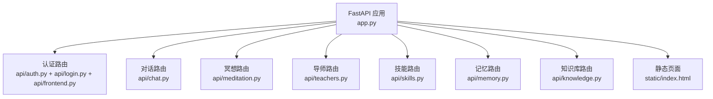
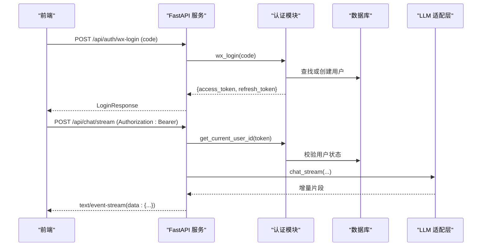
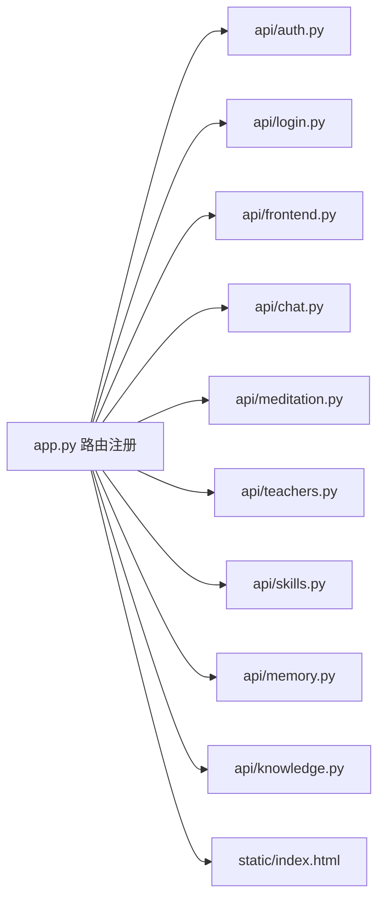

# API 接口文档

<cite>
**本文引用的文件**
- [README.md](file://README.md)
- [app.py](file://hushai/meditation/app.py)
- [auth.py](file://hushai/meditation/api/auth.py)
- [login.py](file://hushai/meditation/api/login.py)
- [frontend.py](file://hushai/meditation/api/frontend.py)
- [chat.py](file://hushai/meditation/api/chat.py)
- [meditation.py](file://hushai/meditation/api/meditation.py)
- [teachers.py](file://hushai/meditation/api/teachers.py)
- [skills.py](file://hushai/meditation/api/skills.py)
- [memory.py](file://hushai/meditation/api/memory.py)
- [knowledge.py](file://hushai/meditation/api/knowledge.py)
- [schemas.py](file://hushai/meditation/schemas.py)
- [index.html](file://hushai/meditation/static/index.html)
</cite>

## 目录
1. [简介](#简介)
2. [项目结构](#项目结构)
3. [核心组件](#核心组件)
4. [架构总览](#架构总览)
5. [详细接口说明](#详细接口说明)
6. [依赖关系分析](#依赖关系分析)
7. [性能与限流](#性能与限流)
8. [故障排查指南](#故障排查指南)
9. [结论](#结论)
10. [附录：客户端集成与最佳实践](#附录客户端集成与最佳实践)

## 简介
本文件为 hush.ai 的 RESTful API 接口文档，覆盖认证、会话管理、流式对话（SSE）、冥想追踪、导师选择、技能导入、记忆管理与知识库管理等能力。面向前端开发者与第三方集成商，提供完整的请求/响应规范、错误码说明、鉴权方式与最佳实践建议。

## 项目结构
后端基于 FastAPI，路由按功能模块拆分在 meditation/api 下；统一入口在 app.py 中注册路由、挂载静态资源并启用限流中间件。

图表来源
- [app.py:136-207](file://hushai/meditation/app.py#L136-L207)
- [auth.py:1-171](file://hushai/meditation/api/auth.py#L1-L171)
- [login.py:1-53](file://hushai/meditation/api/login.py#L1-L53)
- [frontend.py:1-56](file://hushai/meditation/api/frontend.py#L1-L56)
- [chat.py:1-245](file://hushai/meditation/api/chat.py#L1-L245)
- [meditation.py:1-368](file://hushai/meditation/api/meditation.py#L1-L368)
- [teachers.py:1-139](file://hushai/meditation/api/teachers.py#L1-L139)
- [skills.py:1-113](file://hushai/meditation/api/skills.py#L1-L113)
- [memory.py:1-61](file://hushai/meditation/api/memory.py#L1-L61)
- [knowledge.py:1-310](file://hushai/meditation/api/knowledge.py#L1-L310)
- [index.html:1816-1891](file://hushai/meditation/static/index.html#L1816-L1891)

章节来源
- [README.md:136-178](file://README.md#L136-L178)
- [app.py:136-207](file://hushai/meditation/app.py#L136-L207)

## 核心组件
- 认证与令牌签发：微信登录、Access Token 签发与校验、Refresh Token 刷新、开发模式一键登录。
- 对话引擎：普通对话与 SSE 流式对话、知识库问答、场景与历史列表。
- 冥想追踪：会话开始/结束、情绪签到、统计与周视图。
- 导师选择：列表、详情、用户默认导师设置。
- 技能管理：公开列表、批量导入（支持 JSON 与文件上传）。
- 记忆管理：分页查询用户记忆。
- 知识库管理：文本/Markdown 导入、结构化导入、批量导入、URL/远程源抓取、检索。

章节来源
- [auth.py:45-164](file://hushai/meditation/api/auth.py#L45-L164)
- [login.py:21-52](file://hushai/meditation/api/login.py#L21-L52)
- [frontend.py:26-55](file://hushai/meditation/api/frontend.py#L26-L55)
- [chat.py:58-127](file://hushai/meditation/api/chat.py#L58-L127)
- [meditation.py:112-368](file://hushai/meditation/api/meditation.py#L112-L368)
- [teachers.py:58-139](file://hushai/meditation/api/teachers.py#L58-L139)
- [skills.py:47-113](file://hushai/meditation/api/skills.py#L47-L113)
- [memory.py:27-61](file://hushai/meditation/api/memory.py#L27-L61)
- [knowledge.py:57-310](file://hushai/meditation/api/knowledge.py#L57-L310)

## 架构总览
系统采用“前端 SPA + FastAPI 服务层 + 数据库/向量库”的分层架构。认证通过 JWT Bearer 保护受保护接口；SSE 用于实时流式输出；限流基于 IP 维度进行。

图表来源
- [login.py:21-35](file://hushai/meditation/api/login.py#L21-L35)
- [auth.py:63-106](file://hushai/meditation/api/auth.py#L63-L106)
- [auth.py:121-131](file://hushai/meditation/api/auth.py#L121-L131)
- [chat.py:80-104](file://hushai/meditation/api/chat.py#L80-L104)

## 详细接口说明

### 通用约定
- 基础路径：/api
- 认证方式：Bearer Token（Authorization: Bearer <token>）
- 内容类型：application/json（除非特别说明）
- 时间格式：ISO 8601
- 错误响应体：{ error: string, detail?: string }

章节来源
- [schemas.py:239-242](file://hushai/meditation/schemas.py#L239-L242)

---

### 认证与令牌

#### 微信登录
- 方法：POST
- 路径：/api/auth/wx-login
- 请求体：
  - code: string（必填）
- 成功响应：LoginResponse
  - access_token: string
  - refresh_token: string
  - token_type: string（固定 bearer）
  - user_id: string
  - nickname: string | null
  - expires_in: number（秒）
- 失败：
  - 400：微信侧错误或参数无效
- 备注：首次登录自动注册用户并写入 session_key/unionid

章节来源
- [login.py:21-35](file://hushai/meditation/api/login.py#L21-L35)
- [auth.py:63-106](file://hushai/meditation/api/auth.py#L63-L106)
- [schemas.py:71-82](file://hushai/meditation/schemas.py#L71-L82)

#### 刷新令牌
- 方法：POST
- 路径：/api/auth/refresh
- 请求体：
  - refresh_token: string
- 成功响应：RefreshTokenResponse
  - access_token: string
  - refresh_token: string（轮换）
  - token_type: string
  - expires_in: number
- 失败：
  - 401：无效或过期

章节来源
- [login.py:38-52](file://hushai/meditation/api/login.py#L38-L52)
- [auth.py:134-164](file://hushai/meditation/api/auth.py#L134-L164)
- [schemas.py:84-92](file://hushai/meditation/schemas.py#L84-L92)

#### 开发模式登录
- 方法：POST
- 路径：/api/auth/dev-login
- 请求体：
  - nickname: string（可选，默认“冥想者”，长度限制见实现）
- 成功响应：LoginResponse
- 用途：本地调试快速获得令牌

章节来源
- [frontend.py:26-55](file://hushai/meditation/api/frontend.py#L26-L55)
- [schemas.py:75-82](file://hushai/meditation/schemas.py#L75-L82)

#### 访问令牌校验与提取
- 校验逻辑：verify_token 强制 type=access
- 获取当前用户：get_current_user_id 从 sub 解析用户 ID 并检查活跃状态
- 提取 Bearer：extract_bearer_token 兼容 Authorization 头

章节来源
- [auth.py:109-131](file://hushai/meditation/api/auth.py#L109-L131)
- [auth.py:167-171](file://hushai/meditation/api/auth.py#L167-L171)

---

### 对话

#### 普通对话
- 方法：POST
- 路径：/api/chat/
- 鉴权：需要 Authorization: Bearer
- 请求体：ChatRequest
  - message: string（1-5000）
  - conversation_id: string | null
  - stream: boolean（默认 false）
  - skill_ids: string[]（去重、上限由常量控制）
  - provider: string | null
  - scene_id: string | null
  - teacher_id: string | null
- 成功响应：ChatResponse
  - reply: string
  - conversation_id: string
  - memory_updated: boolean
- 失败：
  - 401：未授权
  - 500：服务端异常

章节来源
- [chat.py:58-77](file://hushai/meditation/api/chat.py#L58-L77)
- [schemas.py:24-57](file://hushai/meditation/schemas.py#L24-L57)

#### 流式对话（SSE）
- 方法：POST
- 路径：/api/chat/stream
- 鉴权：需要 Authorization: Bearer
- 请求体：ChatRequest（同上）
- 响应：text/event-stream
  - 数据行：data: { delta?: string, done?: boolean, conversation_id?: string }
  - 错误行：data: { error: string }
- 失败：
  - 401：未授权

章节来源
- [chat.py:80-104](file://hushai/meditation/api/chat.py#L80-L104)
- [schemas.py:244-248](file://hushai/meditation/schemas.py#L244-L248)
- [index.html:1816-1891](file://hushai/meditation/static/index.html#L1816-L1891)

#### 知识库问答
- 方法：POST
- 路径：/api/chat/knowledge
- 鉴权：需要 Authorization: Bearer
- 请求体：ChatRequest（仅使用 message/conversation_id/provider）
- 成功响应：KnowledgeQAResponse
  - reply: string
  - conversation_id: string
  - sources: KnowledgeSourceItem[]
- 失败：
  - 401：未授权
  - 500：服务端异常

章节来源
- [chat.py:107-127](file://hushai/meditation/api/chat.py#L107-L127)
- [schemas.py:59-69](file://hushai/meditation/schemas.py#L59-L69)

#### 场景列表
- 方法：GET
- 路径：/api/chat/scenes
- 鉴权：无需
- 成功响应：SceneListResponse
  - scenes: ScenePublicItem[]

章节来源
- [chat.py:130-152](file://hushai/meditation/api/chat.py#L130-L152)
- [schemas.py:250-259](file://hushai/meditation/schemas.py#L250-L259)

#### 对话历史列表
- 方法：GET
- 路径：/api/chat/conversations
- 鉴权：需要 Authorization: Bearer
- 查询参数：
  - limit: int（1-200，默认 50）
  - offset: int（>=0，默认 0）
- 成功响应：ConversationListResponse
  - conversations: ConversationItem[]
  - total: int

章节来源
- [chat.py:155-190](file://hushai/meditation/api/chat.py#L155-L190)

#### 对话消息历史
- 方法：GET
- 路径：/api/chat/conversations/{conversation_id}/messages
- 鉴权：需要 Authorization: Bearer
- 成功响应：MessageListResponse
  - messages: MessageItem[]
  - conversation_title: string | null
- 失败：
  - 404：对话不存在

章节来源
- [chat.py:205-244](file://hushai/meditation/api/chat.py#L205-L244)

---

### 冥想追踪

#### 开始会话
- 方法：POST
- 路径：/api/meditation/session/start
- 鉴权：需要 Authorization: Bearer
- 请求体：SessionStartRequest
  - conversation_id: string | null
  - scene_id: string | null
  - mood_before: int（1-10，可选）
- 成功响应：SessionStartResponse
  - session_id: string
  - started_at: datetime

章节来源
- [meditation.py:112-133](file://hushai/meditation/api/meditation.py#L112-L133)
- [meditation.py:44-53](file://hushai/meditation/api/meditation.py#L44-L53)

#### 结束会话
- 方法：POST
- 路径：/api/meditation/session/end
- 鉴权：需要 Authorization: Bearer
- 请求体：SessionEndRequest
  - session_id: string
  - mood_after: int（1-10，可选）
  - note: string | null
- 成功响应：SessionEndResponse
  - session_id: string
  - duration_seconds: int
  - mood_before: int | null
  - mood_after: int | null
- 失败：
  - 404：会话不存在或未找到

章节来源
- [meditation.py:136-174](file://hushai/meditation/api/meditation.py#L136-L174)

#### 情绪签到
- 方法：POST
- 路径：/api/meditation/mood-checkin
- 鉴权：需要 Authorization: Bearer
- 请求体：MoodCheckInRequest
  - mood: int（1-10）
- 成功响应：MoodCheckInResponse
  - mood: int
  - recorded_at: datetime

章节来源
- [meditation.py:177-186](file://hushai/meditation/api/meditation.py#L177-L186)
- [meditation.py:68-74](file://hushai/meditation/api/meditation.py#L68-L74)

#### 进度统计
- 方法：GET
- 路径：/api/meditation/stats
- 鉴权：需要 Authorization: Bearer
- 成功响应：ProgressStatsResponse
  - total_sessions: int
  - total_duration_seconds: int
  - current_streak: int
  - longest_streak: int
  - today_sessions: int
  - today_duration_seconds: int
  - avg_mood: float | null
  - recent_sessions: RecentSessionItem[]

章节来源
- [meditation.py:241-333](file://hushai/meditation/api/meditation.py#L241-L333)
- [meditation.py:77-94](file://hushai/meditation/api/meditation.py#L77-L94)

#### 本周进度
- 方法：GET
- 路径：/api/meditation/weekly
- 鉴权：需要 Authorization: Bearer
- 成功响应：WeeklyProgressResponse
  - days: DayProgress[]

章节来源
- [meditation.py:336-367](file://hushai/meditation/api/meditation.py#L336-L367)
- [meditation.py:96-107](file://hushai/meditation/api/meditation.py#L96-L107)

---

### 冥想搭子（导师）

#### 导师列表
- 方法：GET
- 路径：/api/teachers/list
- 鉴权：需要 Authorization: Bearer
- 成功响应：TeacherListResponse
  - teachers: TeacherItem[]
  - selected_id: string | null

章节来源
- [teachers.py:58-86](file://hushai/meditation/api/teachers.py#L58-L86)
- [teachers.py:32-44](file://hushai/meditation/api/teachers.py#L32-L44)

#### 导师详情
- 方法：GET
- 路径：/api/teachers/{teacher_id}
- 鉴权：需要 Authorization: Bearer
- 成功响应：TeacherDetailResponse
- 失败：
  - 404：导师不存在

章节来源
- [teachers.py:89-109](file://hushai/meditation/api/teachers.py#L89-L109)

#### 选择导师
- 方法：POST
- 路径：/api/teachers/select
- 鉴权：需要 Authorization: Bearer
- 请求体：SelectTeacherRequest
  - teacher_id: string
- 成功响应：SelectTeacherResponse
  - success: boolean
  - teacher_id: string
- 失败：
  - 404：导师不存在

章节来源
- [teachers.py:121-139](file://hushai/meditation/api/teachers.py#L121-L139)
- [teachers.py:112-118](file://hushai/meditation/api/teachers.py#L112-L118)

---

### 技能插件

#### 获取技能列表
- 方法：GET
- 路径：/api/skills/
- 鉴权：无需
- 成功响应：SkillListResponse
  - skills: SkillPublicItem[]

章节来源
- [skills.py:47-58](file://hushai/meditation/api/skills.py#L47-L58)
- [schemas.py:162-169](file://hushai/meditation/schemas.py#L162-L169)

#### 批量导入（JSON）
- 方法：POST
- 路径：/api/skills/import
- 鉴权：管理员 JWT 或用户 JWT
- 请求体：SkillImportRequest
  - skills: SkillImportItem[]（支持顶层数组或 { skills: [...] }）
- 成功响应：SkillImportResult
  - imported: int
  - items: SkillImportedRow[]
- 失败：
  - 401：未授权
  - 400：JSON 解析或格式错误（文件导入时）

章节来源
- [skills.py:61-90](file://hushai/meditation/api/skills.py#L61-L90)
- [schemas.py:197-218](file://hushai/meditation/schemas.py#L197-L218)

#### 批量导入（文件）
- 方法：POST
- 路径：/api/skills/import-file
- 鉴权：管理员 JWT 或用户 JWT
- 表单字段：
  - file: multipart/form-data
- 成功响应：SkillImportResult
- 失败：
  - 400：JSON 解析失败或数据格式无效

章节来源
- [skills.py:93-113](file://hushai/meditation/api/skills.py#L93-L113)

---

### 记忆管理

#### 获取记忆列表
- 方法：GET
- 路径：/api/memory/
- 鉴权：需要 Authorization: Bearer
- 查询参数：
  - category: string | null
  - limit: int（1-200，默认 50）
  - offset: int（>=0，默认 0）
- 成功响应：MemoryListResponse
  - memories: MemoryItem[]
  - total: int

章节来源
- [memory.py:27-61](file://hushai/meditation/api/memory.py#L27-L61)
- [schemas.py:95-108](file://hushai/meditation/schemas.py#L95-L108)

---

### 知识库管理

#### 文本导入
- 方法：POST
- 路径：/api/knowledge/import
- 鉴权：管理员 JWT 或用户 JWT
- 请求体：KnowledgeImportRequest
  - content: string（非空）
  - title: string | null
  - tags: string[]
  - parent_id: string | null
  - content_format: "plain" | "markdown"
- 成功响应：KnowledgeItem[]

章节来源
- [knowledge.py:57-93](file://hushai/meditation/api/knowledge.py#L57-L93)
- [schemas.py:110-118](file://hushai/meditation/schemas.py#L110-L118)

#### 文件导入
- 方法：POST
- 路径：/api/knowledge/import-file
- 鉴权：管理员 JWT 或用户 JWT
- 表单字段：
  - file: multipart/form-data
  - tags: string（逗号分隔）
  - parent_id: string | null
  - as_markdown: boolean
- 成功响应：KnowledgeItem[]

章节来源
- [knowledge.py:96-137](file://hushai/meditation/api/knowledge.py#L96-L137)

#### 结构化导入
- 方法：POST
- 路径：/api/knowledge/import-structured
- 鉴权：管理员 JWT 或用户 JWT
- 请求体：任意对象（内部解析）
- 成功响应：KnowledgeItem[]

章节来源
- [knowledge.py:140-162](file://hushai/meditation/api/knowledge.py#L140-L162)

#### 批量导入
- 方法：POST
- 路径：/api/knowledge/import-batch
- 鉴权：管理员 JWT 或用户 JWT
- 表单字段：
  - files: list[UploadFile]
  - tags: string（逗号分隔）
  - as_markdown: boolean
- 成功响应：dict
  - imported: int
  - results: list[dict]
  - errors: list[string]

章节来源
- [knowledge.py:165-210](file://hushai/meditation/api/knowledge.py#L165-L210)

#### 搜索知识库
- 方法：POST
- 路径：/api/knowledge/search
- 鉴权：管理员 JWT 或用户 JWT
- 请求体：KnowledgeSearchRequest
  - query: string（非空）
  - top_k: int（默认 5）
- 成功响应：KnowledgeSearchResponse
  - results: KnowledgeSearchResult[]

章节来源
- [knowledge.py:213-234](file://hushai/meditation/api/knowledge.py#L213-L234)
- [schemas.py:136-151](file://hushai/meditation/schemas.py#L136-L151)

#### 从 URL 导入
- 方法：POST
- 路径：/api/knowledge/import-url
- 鉴权：管理员 JWT 或用户 JWT
- 请求体：RemoteImportRequest
  - source_type: "url" | "coze" | "ima"
  - urls: string[]（source_type=url/ima 时使用）
  - config: dict（如 coze 需 api_token/dataset_id）
  - tags: string[]
- 成功响应：RemoteImportResult
  - imported: int
  - results: list[dict]
  - errors: list[string]

章节来源
- [knowledge.py:237-266](file://hushai/meditation/api/knowledge.py#L237-L266)
- [schemas.py:220-237](file://hushai/meditation/schemas.py#L220-L237)

#### 从远程源导入
- 方法：POST
- 路径：/api/knowledge/import-remote
- 鉴权：管理员 JWT 或用户 JWT
- 请求体：RemoteImportRequest
- 成功响应：RemoteImportResult

章节来源
- [knowledge.py:269-291](file://hushai/meditation/api/knowledge.py#L269-L291)

#### 同步所有远程源
- 方法：POST
- 路径：/api/knowledge/sync-remote
- 鉴权：管理员 JWT 或用户 JWT
- 成功响应：dict（包含导入结果与错误）

章节来源
- [knowledge.py:294-309](file://hushai/meditation/api/knowledge.py#L294-L309)

---

### 错误码总览
- 200：成功
- 400：请求参数或业务校验失败
- 401：未授权（缺少或无效令牌）
- 404：资源不存在
- 500：服务端异常

章节来源
- [schemas.py:239-242](file://hushai/meditation/schemas.py#L239-L242)
- [chat.py:58-127](file://hushai/meditation/api/chat.py#L58-L127)
- [meditation.py:136-174](file://hushai/meditation/api/meditation.py#L136-L174)
- [teachers.py:89-139](file://hushai/meditation/api/teachers.py#L89-L139)
- [skills.py:61-113](file://hushai/meditation/api/skills.py#L61-L113)
- [knowledge.py:57-310](file://hushai/meditation/api/knowledge.py#L57-L310)

## 依赖关系分析
- 路由注册：app.py 集中 include_router，将各模块路由挂载到 FastAPI 实例。
- 认证依赖：各受保护路由通过 Header("Authorization") 提取 Bearer，再调用 get_current_user_id 完成鉴权。
- 限流：全局 Limiter 以 IP 为 key，部分端点额外装饰器限定每分钟次数。
- 静态资源：/static 与 /admin/static 分别挂载前台与管理后台静态文件。

图表来源
- [app.py:156-180](file://hushai/meditation/app.py#L156-L180)
- [auth.py:109-131](file://hushai/meditation/api/auth.py#L109-L131)
- [chat.py:47-56](file://hushai/meditation/api/chat.py#L47-L56)
- [meditation.py:25-33](file://hushai/meditation/api/meditation.py#L25-L33)
- [teachers.py:21-29](file://hushai/meditation/api/teachers.py#L21-L29)
- [skills.py:28-44](file://hushai/meditation/api/skills.py#L28-L44)
- [memory.py:16-24](file://hushai/meditation/api/memory.py#L16-L24)

章节来源
- [app.py:136-207](file://hushai/meditation/app.py#L136-L207)

## 性能与限流
- 全局限流：基于 slowapi，key_func 为客户端 IP。
- 端点限流：对话相关端点（普通对话、流式对话、知识库问答）均设置为 30/minute。
- CORS：生产环境允许指定来源，开发环境允许 *。
- 静态资源：直接挂载，减少路由开销。

章节来源
- [app.py:20-21](file://hushai/meditation/app.py#L20-L21)
- [app.py:146-155](file://hushai/meditation/app.py#L146-L155)
- [chat.py:59-81](file://hushai/meditation/api/chat.py#L59-L81)

## 故障排查指南
- 401 未授权
  - 检查 Authorization 头是否携带 Bearer Token
  - 确认 Token 未过期，必要时调用 /api/auth/refresh 刷新
- 400 参数错误
  - 检查必填字段与长度约束（如 message 1-5000）
  - 文件导入时确保 JSON 可解析且符合模型定义
- 404 资源不存在
  - 检查会话 ID、导师 ID、对话 ID 是否正确
- 500 服务端异常
  - 查看服务端日志定位具体异常信息

章节来源
- [chat.py:58-127](file://hushai/meditation/api/chat.py#L58-L127)
- [meditation.py:136-174](file://hushai/meditation/api/meditation.py#L136-L174)
- [teachers.py:89-139](file://hushai/meditation/api/teachers.py#L89-L139)
- [skills.py:61-113](file://hushai/meditation/api/skills.py#L61-L113)
- [knowledge.py:57-310](file://hushai/meditation/api/knowledge.py#L57-L310)

## 结论
本 API 体系围绕“认证—对话—知识—记忆—冥想—导师—技能”构建，提供完善的鉴权、限流与错误处理机制。通过 SSE 实现低延迟流式体验，结合 RAG 与长期记忆提升回答质量。建议在生产环境严格配置 CORS、JWT 密钥与限流策略，并在客户端实现自动刷新与重试逻辑。

## 附录：客户端集成与最佳实践

### 认证流程
- 步骤
  - 使用微信登录或开发模式登录获取 access_token 与 refresh_token
  - 后续请求在 Authorization 头携带 Bearer Token
  - 当收到 401 时，调用 /api/auth/refresh 刷新令牌并重试
- 注意事项
  - 刷新后会得到新的 refresh_token，请妥善保存
  - 开发模式登录仅用于本地调试

章节来源
- [login.py:21-52](file://hushai/meditation/api/login.py#L21-L52)
- [frontend.py:26-55](file://hushai/meditation/api/frontend.py#L26-L55)
- [auth.py:134-164](file://hushai/meditation/api/auth.py#L134-L164)

### 流式对话（SSE）
- 客户端应读取 text/event-stream 的 data: 行，解析 JSON
- 若返回 error 字段，立即中断并提示用户
- 若返回 done=true，表示流结束并可持久化 conversation_id

章节来源
- [chat.py:80-104](file://hushai/meditation/api/chat.py#L80-L104)
- [index.html:1816-1891](file://hushai/meditation/static/index.html#L1816-L1891)

### 数据验证与权限
- 输入校验：Pydantic 模型负责长度、范围、枚举等校验
- 权限控制：
  - 普通接口：无需鉴权
  - 用户接口：需要用户 JWT
  - 管理接口：需要管理员 JWT（或同时接受用户 JWT，视具体端点而定）

章节来源
- [schemas.py:24-57](file://hushai/meditation/schemas.py#L24-L57)
- [skills.py:28-44](file://hushai/meditation/api/skills.py#L28-L44)
- [knowledge.py:38-54](file://hushai/meditation/api/knowledge.py#L38-L54)

### 限流与重试
- 对话相关端点限流 30/分钟
- 建议在客户端实现指数退避重试与队列合并，避免触发限流

章节来源
- [chat.py:59-81](file://hushai/meditation/api/chat.py#L59-L81)