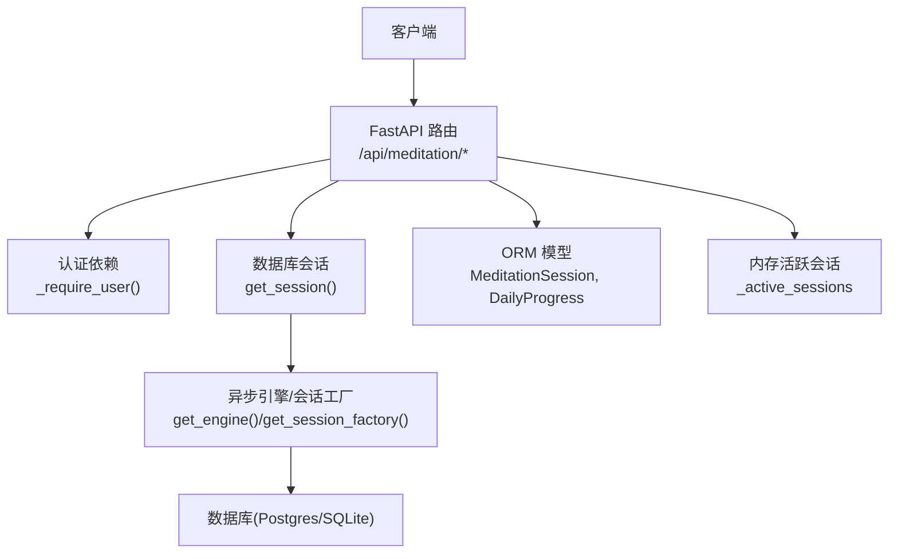
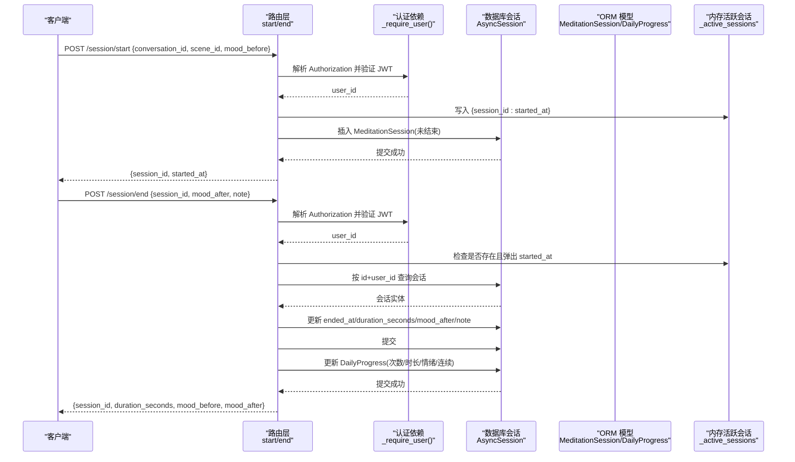
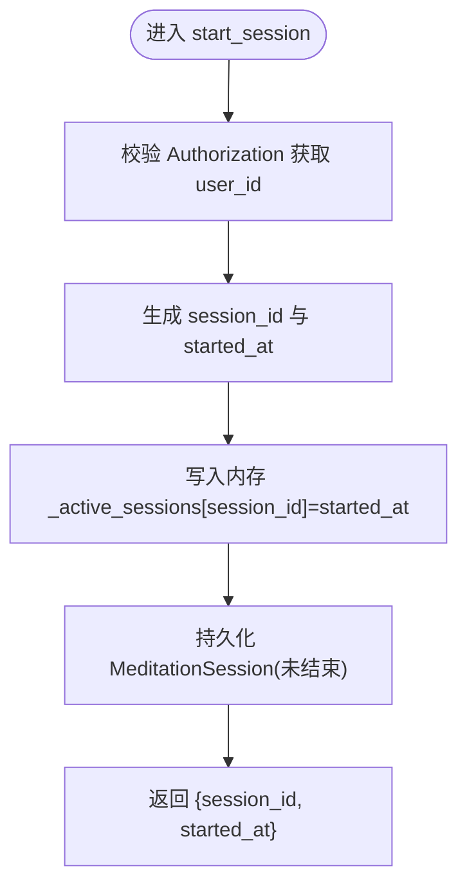
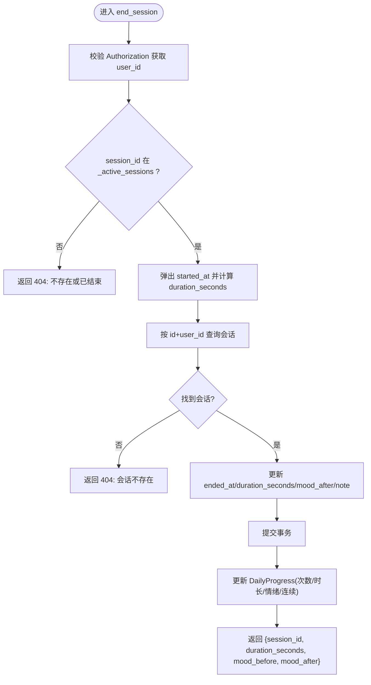

# 冥想会话管理接口

<cite>
**本文引用的文件**   
- [hushai/meditation/api/meditation.py](file://hushai/meditation/api/meditation.py)
- [hushai/meditation/db/models.py](file://hushai/meditation/db/models.py)
- [hushai/meditation/api/auth.py](file://hushai/meditation/api/auth.py)
- [hushai/meditation/db/session.py](file://hushai/meditation/db/session.py)
- [hushai/meditation/config.py](file://hushai/meditation/config.py)
- [hushai/meditation/app.py](file://hushai/meditation/app.py)
</cite>

## 目录
1. [简介](#简介)
2. [项目结构](#项目结构)
3. [核心组件](#核心组件)
4. [架构总览](#架构总览)
5. [详细组件分析](#详细组件分析)
6. [依赖关系分析](#依赖关系分析)
7. [性能与并发考量](#性能与并发考量)
8. [故障排查指南](#故障排查指南)
9. [结论](#结论)
10. [附录：请求/响应示例与错误码](#附录请求响应示例与错误码)

## 简介
本文件为“冥想会话管理”功能的 API 文档，聚焦以下能力：
- 会话开始：POST /api/meditation/session/start
- 会话结束：POST /api/meditation/session/end
- 会话状态管理、持续时间计算、会话关联（conversation_id、scene_id）
- 内存中的活跃会话管理机制（进程内字典），以及数据持久化策略（SQLAlchemy + 异步数据库）
- 与对话系统、场景系统的集成方式
- 并发访问安全保障机制与最佳实践建议

## 项目结构
冥想模块采用 FastAPI 路由 + Pydantic 模型 + SQLAlchemy ORM 的分层组织。会话管理的核心实现位于 meditation API 路由中，数据模型定义在 db.models，认证鉴权在 api.auth，数据库连接与会话工厂在 db.session，应用装配在 app.py。



图示来源
- [hushai/meditation/api/meditation.py:112-174](file://hushai/meditation/api/meditation.py#L112-L174)
- [hushai/meditation/api/auth.py:121-131](file://hushai/meditation/api/auth.py#L121-L131)
- [hushai/meditation/db/session.py:34-54](file://hushai/meditation/db/session.py#L34-L54)
- [hushai/meditation/db/models.py:204-244](file://hushai/meditation/db/models.py#L204-L244)

章节来源
- [hushai/meditation/app.py:136-167](file://hushai/meditation/app.py#L136-L167)
- [hushai/meditation/api/meditation.py:1-18](file://hushai/meditation/api/meditation.py#L1-L18)

## 核心组件
- 路由与请求/响应模型
  - 会话开始：POST /api/meditation/session/start
  - 会话结束：POST /api/meditation/session/end
  - 情绪打卡：POST /api/meditation/mood-checkin（辅助统计）
  - 进度查询：GET /api/meditation/stats、GET /api/meditation/weekly
- 认证依赖
  - 从 Authorization 头提取 Bearer Token，校验 JWT，返回当前用户 ID
- 数据模型
  - MeditationSession：记录会话起止时间、时长、前后情绪、备注及关联 conversation_id、scene_id
  - DailyProgress：每日累计次数、时长、平均情绪、连续天数等
- 内存活跃会话
  - _active_sessions：进程内 dict，键为 session_id，值为 started_at；用于快速判定是否已结束并计算时长

章节来源
- [hushai/meditation/api/meditation.py:44-109](file://hushai/meditation/api/meditation.py#L44-L109)
- [hushai/meditation/db/models.py:204-244](file://hushai/meditation/db/models.py#L204-L244)
- [hushai/meditation/api/auth.py:121-131](file://hushai/meditation/api/auth.py#L121-L131)

## 架构总览
下图展示一次“开始-结束”的完整调用链，包括认证、数据库写入、内存状态更新与统计更新。



图示来源
- [hushai/meditation/api/meditation.py:112-174](file://hushai/meditation/api/meditation.py#L112-L174)
- [hushai/meditation/api/auth.py:121-131](file://hushai/meditation/api/auth.py#L121-L131)
- [hushai/meditation/db/models.py:204-244](file://hushai/meditation/db/models.py#L204-L244)

## 详细组件分析

### 接口一：开始冥想会话
- 路径与方法：POST /api/meditation/session/start
- 鉴权：需要有效的 Bearer Token（Authorization 头）
- 请求体字段
  - conversation_id: string | null，可选，关联对话
  - scene_id: string | null，可选，关联场景
  - mood_before: int | null，范围 1..10，可选，会话前情绪评分
- 响应体
  - session_id: string，本次会话唯一标识
  - started_at: datetime，UTC 时间戳
- 处理逻辑要点
  - 生成 UUID 作为 session_id，记录 UTC 开始时间
  - 将 (session_id -> started_at) 写入内存字典 _active_sessions
  - 持久化一条 MeditationSession 记录（未结束）
  - 返回 session_id 与 started_at



图示来源
- [hushai/meditation/api/meditation.py:112-133](file://hushai/meditation/api/meditation.py#L112-L133)

章节来源
- [hushai/meditation/api/meditation.py:44-53](file://hushai/meditation/api/meditation.py#L44-L53)
- [hushai/meditation/api/meditation.py:112-133](file://hushai/meditation/api/meditation.py#L112-L133)
- [hushai/meditation/db/models.py:204-222](file://hushai/meditation/db/models.py#L204-L222)

### 接口二：结束冥想会话
- 路径与方法：POST /api/meditation/session/end
- 鉴权：需要有效的 Bearer Token（Authorization 头）
- 请求体字段
  - session_id: string，必填
  - mood_after: int | null，范围 1..10，可选，会话后情绪评分
  - note: string | null，可选，备注
- 响应体
  - session_id: string
  - duration_seconds: int，秒级时长
  - mood_before: int | null
  - mood_after: int | null
- 处理逻辑要点
  - 校验 session_id 是否在内存活跃集合中，否则返回 404
  - 从内存中弹出 started_at，计算 duration_seconds
  - 根据 session_id 与 user_id 查询并更新会话记录（ended_at、duration_seconds、mood_after、note）
  - 提交后更新 DailyProgress（次数、时长、情绪均值、连续天数）
  - 返回结果



图示来源
- [hushai/meditation/api/meditation.py:136-174](file://hushai/meditation/api/meditation.py#L136-L174)

章节来源
- [hushai/meditation/api/meditation.py:55-66](file://hushai/meditation/api/meditation.py#L55-L66)
- [hushai/meditation/api/meditation.py:136-174](file://hushai/meditation/api/meditation.py#L136-L174)
- [hushai/meditation/db/models.py:204-222](file://hushai/meditation/db/models.py#L204-L222)

### 会话状态管理与内存机制
- 活跃会话存储：_active_sessions 为进程内 dict，键为 session_id，值为 started_at
- 生命周期
  - 开始：写入 _active_sessions
  - 结束：从 _active_sessions 弹出，并持久化结束时间与时长
- 风险与建议
  - 多进程部署时，内存不共享，可能导致“找不到活跃会话”的错误
  - 建议：使用 Redis 等外部缓存替代进程内 dict，保证跨进程一致性

章节来源
- [hushai/meditation/api/meditation.py:109-109](file://hushai/meditation/api/meditation.py#L109-L109)
- [hushai/meditation/api/meditation.py:112-174](file://hushai/meditation/api/meditation.py#L112-L174)

### 持续时间计算
- 计算方式：duration_seconds = floor((ended_at - started_at).total_seconds())
- 时间基准：统一使用 UTC 时间

章节来源
- [hushai/meditation/api/meditation.py:145-147](file://hushai/meditation/api/meditation.py#L145-L147)

### 会话关联（conversation_id、scene_id）
- 支持可选关联到对话与场景，便于后续分析与个性化引导
- 关联字段仅落库，不参与时长与统计计算

章节来源
- [hushai/meditation/api/meditation.py:122-129](file://hushai/meditation/api/meditation.py#L122-L129)
- [hushai/meditation/db/models.py:204-222](file://hushai/meditation/db/models.py#L204-L222)

### 数据持久化策略
- 使用 SQLAlchemy 异步会话（AsyncSession）进行读写
- 默认驱动：若未配置 postgres_url，则回退至 sqlite+aiosqlite
- 生产推荐：配置 postgresql+asyncpg 以支持高并发与多进程

章节来源
- [hushai/meditation/db/session.py:15-31](file://hushai/meditation/db/session.py#L15-L31)
- [hushai/meditation/db/session.py:34-54](file://hushai/meditation/db/session.py#L34-L54)

### 与对话系统、场景系统的集成
- 通过 conversation_id 与 scene_id 建立外键关联，便于后续聚合分析
- 实际业务中可在会话开始前由上层服务校验 conversation_id/scene_id 的有效性

章节来源
- [hushai/meditation/db/models.py:204-222](file://hushai/meditation/db/models.py#L204-L222)

### 并发访问的安全保障
- 当前实现使用进程内 dict 维护活跃会话，单进程安全，但多进程下存在不一致风险
- 建议改进
  - 使用 Redis 存储活跃会话，设置过期时间，避免僵尸会话
  - 在结束接口增加幂等保护（如基于 session_id 的唯一约束或去重表）
  - 对频繁读取的 DailyProgress 行加索引（已具备 user_id+date 复合索引）

章节来源
- [hushai/meditation/api/meditation.py:109-109](file://hushai/meditation/api/meditation.py#L109-L109)
- [hushai/meditation/db/models.py:241-241](file://hushai/meditation/db/models.py#L241-L241)

## 依赖关系分析
```mermaid
classDiagram
class MeditationSession {
+string id
+string user_id
+string conversation_id
+string scene_id
+datetime started_at
+datetime ended_at
+int duration_seconds
+int mood_before
+int mood_after
+string note
}
class DailyProgress {
+string id
+string user_id
+datetime date
+int meditation_count
+int total_duration_seconds
+float mood_avg
+int streak_day
}
class User {
+string id
+bool is_active
}
class Auth {
+verify_token(token) dict
+get_current_user_id(token, session) str
}
class SessionManager {
+get_session() AsyncSession
+get_engine() Engine
}
User ||--o{ MeditationSession : "拥有"
User ||--o{ DailyProgress : "拥有"
MeditationSession ..> Conversation : "关联 conversation_id"
MeditationSession ..> Scene : "关联 scene_id"
Auth --> User : "校验用户"
SessionManager --> MeditationSession : "读写"
SessionManager --> DailyProgress : "更新统计"
```

图示来源
- [hushai/meditation/db/models.py:37-66](file://hushai/meditation/db/models.py#L37-L66)
- [hushai/meditation/db/models.py:204-244](file://hushai/meditation/db/models.py#L204-L244)
- [hushai/meditation/api/auth.py:109-131](file://hushai/meditation/api/auth.py#L109-L131)
- [hushai/meditation/db/session.py:34-54](file://hushai/meditation/db/session.py#L34-L54)

章节来源
- [hushai/meditation/db/models.py:204-244](file://hushai/meditation/db/models.py#L204-L244)
- [hushai/meditation/api/auth.py:109-131](file://hushai/meditation/api/auth.py#L109-L131)
- [hushai/meditation/db/session.py:34-54](file://hushai/meditation/db/session.py#L34-L54)

## 性能与并发考量
- 数据库连接池
  - SQLite：pool_size=5，适合单机开发
  - Postgres：pool_size=10，适合生产
- 索引优化
  - DailyProgress(user_id, date) 复合索引提升按日查询效率
- 内存活跃会话
  - 单进程 O(1) 查找，但多进程不可共享
  - 建议迁移至 Redis，并设置 TTL 防止泄漏
- 统计更新
  - 每次结束会话都会更新 DailyProgress，注意在高并发下的写热点，可考虑批量合并或异步任务

章节来源
- [hushai/meditation/db/session.py:34-54](file://hushai/meditation/db/session.py#L34-L54)
- [hushai/meditation/db/models.py:241-241](file://hushai/meditation/db/models.py#L241-L241)
- [hushai/meditation/api/meditation.py:109-109](file://hushai/meditation/api/meditation.py#L109-L109)

## 故障排查指南
- 401 未授权
  - 原因：Authorization 缺失或 Bearer Token 无效/过期
  - 定位：查看认证依赖抛出的异常信息
- 404 会话不存在或已结束
  - 原因：session_id 不在内存活跃集合，或数据库中无对应记录
  - 定位：确认开始接口是否成功返回 session_id，并确保同一进程结束
- 400 参数校验失败
  - 原因：mood_before/mood_after 超出 1..10 范围
  - 定位：检查请求体字段类型与范围
- 多进程部署导致“找不到活跃会话”
  - 原因：内存字典不共享
  - 解决：改用 Redis 存储活跃会话，或在网关层保证同一会话的请求路由到同一进程

章节来源
- [hushai/meditation/api/meditation.py:142-157](file://hushai/meditation/api/meditation.py#L142-L157)
- [hushai/meditation/api/auth.py:121-131](file://hushai/meditation/api/auth.py#L121-L131)

## 结论
冥想会话管理接口实现了完整的“开始-结束”流程，结合内存活跃会话与数据库持久化，提供会话时长、情绪变化与每日统计。为保证在多进程环境下的可靠性，建议将活跃会话迁移至 Redis，并对关键查询与写入路径做进一步的性能优化与监控。

## 附录：请求/响应示例与错误码

- 开始会话
  - 请求
    - 方法：POST
    - 路径：/api/meditation/session/start
    - 头部：Authorization: Bearer <token>
    - 主体：{ "conversation_id": "<可选>", "scene_id": "<可选>", "mood_before": 5 }
  - 响应
    - 200 OK：{ "session_id": "<uuid>", "started_at": "2026-01-01T00:00:00Z" }
    - 401 Unauthorized：Token 无效或缺失
    - 422 Unprocessable Entity：参数校验失败（如 mood_before 不在 1..10）

- 结束会话
  - 请求
    - 方法：POST
    - 路径：/api/meditation/session/end
    - 头部：Authorization: Bearer <token>
    - 主体：{ "session_id": "<uuid>", "mood_after": 7, "note": "感觉放松" }
  - 响应
    - 200 OK：{ "session_id": "<uuid>", "duration_seconds": 120, "mood_before": 5, "mood_after": 7 }
    - 404 Not Found：会话不存在或已结束
    - 401 Unauthorized：Token 无效或缺失
    - 422 Unprocessable Entity：参数校验失败（如 mood_after 不在 1..10）

- 相关错误码说明
  - 401：认证失败
  - 404：会话不存在或已结束
  - 422：请求体校验失败

章节来源
- [hushai/meditation/api/meditation.py:44-66](file://hushai/meditation/api/meditation.py#L44-L66)
- [hushai/meditation/api/meditation.py:112-174](file://hushai/meditation/api/meditation.py#L112-L174)
- [hushai/meditation/api/auth.py:121-131](file://hushai/meditation/api/auth.py#L121-L131)