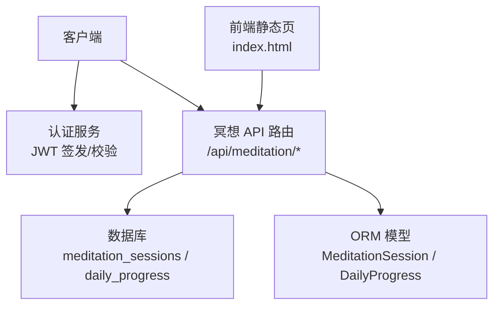
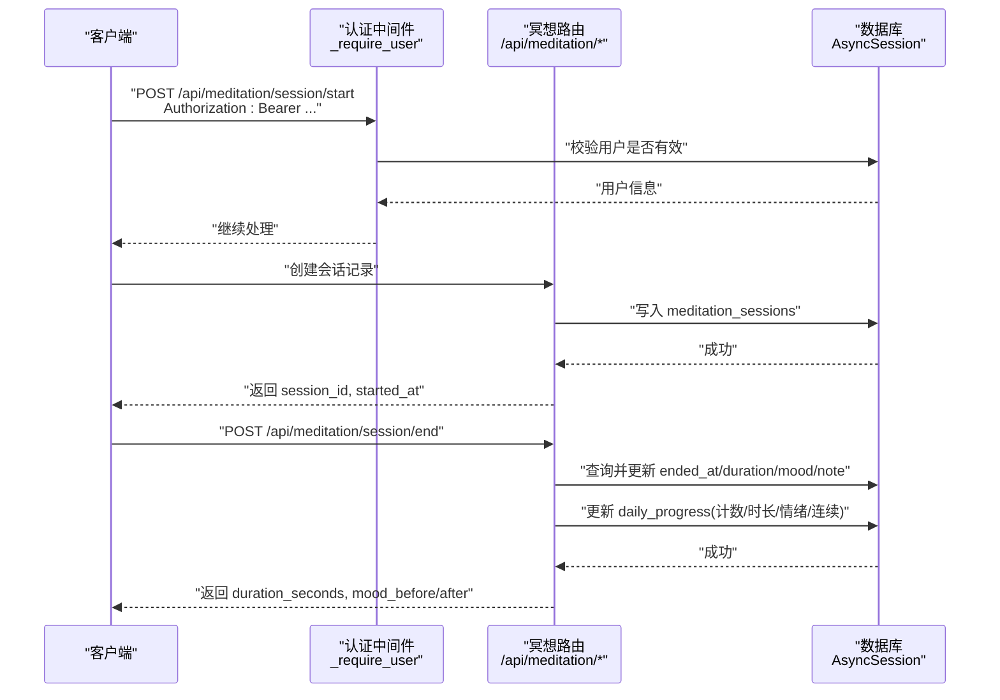
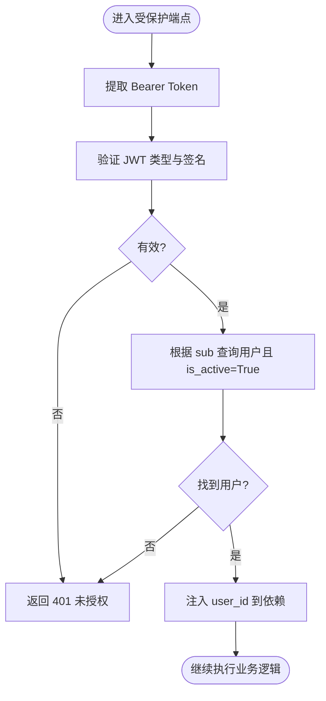
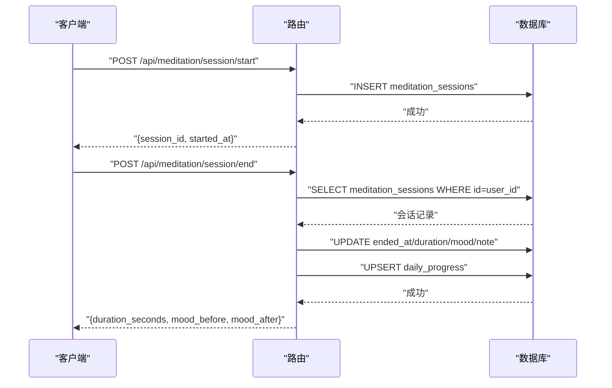
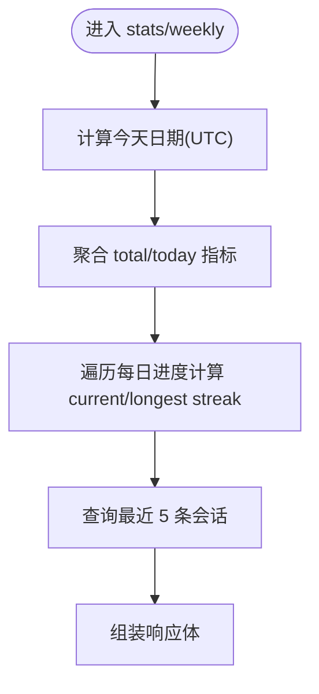
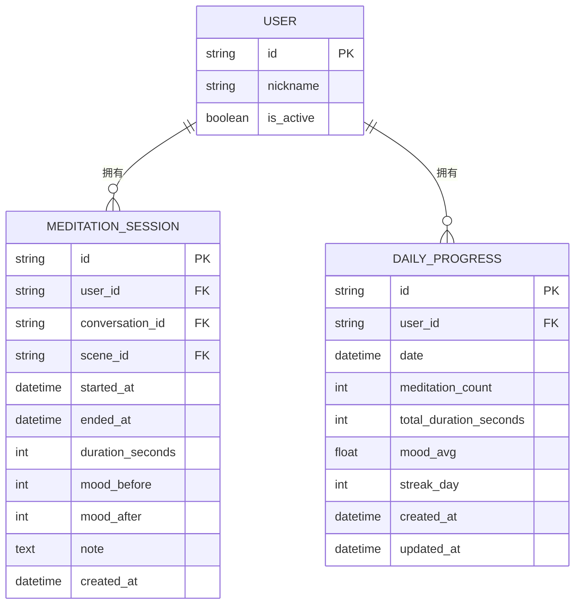
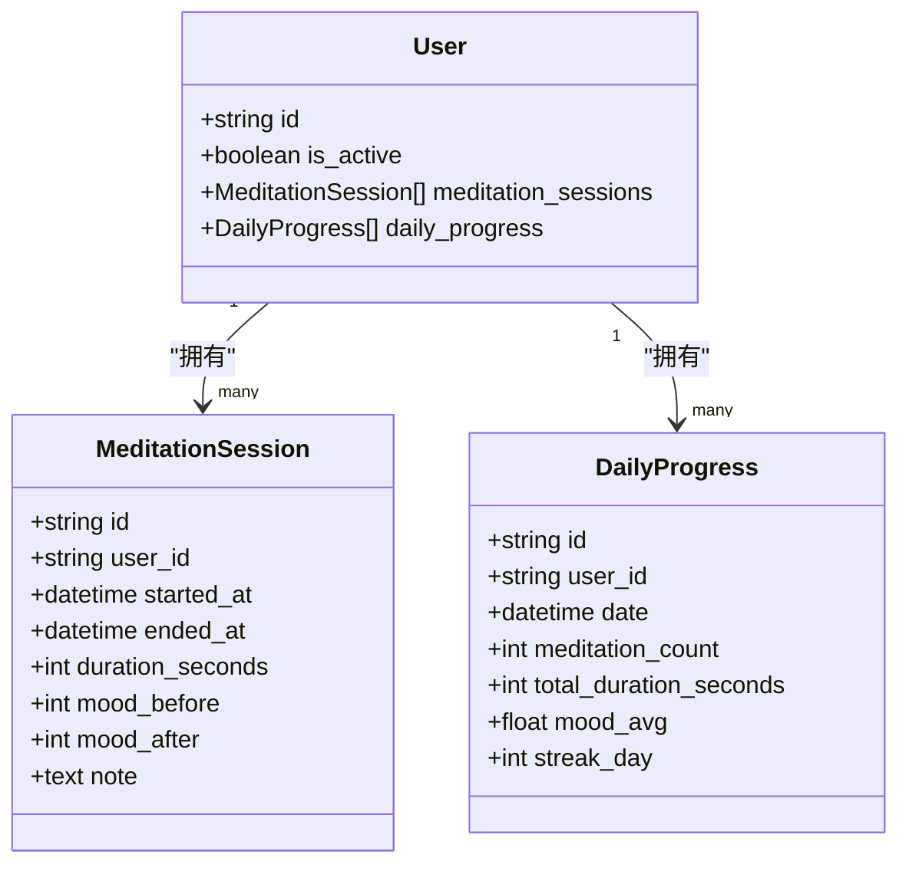

# 冥想功能接口

<cite>
**本文引用的文件**
- [hushai/meditation/api/meditation.py](file://hushai/meditation/api/meditation.py)
- [hushai/meditation/api/auth.py](file://hushai/meditation/api/auth.py)
- [hushai/meditation/db/models.py](file://hushai/meditation/db/models.py)
- [README.md](file://README.md)
</cite>

## 目录
1. [简介](#简介)
2. [项目结构](#项目结构)
3. [核心组件](#核心组件)
4. [架构总览](#架构总览)
5. [详细组件分析](#详细组件分析)
6. [依赖关系分析](#依赖关系分析)
7. [性能与扩展性](#性能与扩展性)
8. [故障排查指南](#故障排查指南)
9. [结论](#结论)
10. [附录：请求/响应示例](#附录请求响应示例)

## 简介
本文件为 hush.ai 的“冥想”功能模块提供面向开发者的 API 接口文档，覆盖以下能力：
- 冥想会话管理：开始/结束会话、记录前后情绪与备注
- 情绪签到：独立于会话的情绪打卡
- 进度统计与报表：累计时长、次数、连续天数、平均情绪、最近会话、本周趋势
- 数据模型与存储：会话与每日进度的结构化存储
- 认证与安全：基于 JWT 的访问控制与刷新机制
- 呼吸练习引导：前端内置三种呼吸节奏（4-7-8、方形、平静），通过 UI 交互完成，不依赖后端接口
- 最佳实践：隐私保护、批量操作与异步处理建议

说明：
- 所有需要鉴权的端点均要求携带 Authorization: Bearer <access_token> 请求头。
- 时间字段采用 UTC 时区。

章节来源
- [README.md](file://README.md)

## 项目结构
冥想相关代码主要位于 meditation 子包中：
- API 层：FastAPI Router 定义端点与请求/响应模型
- 认证：JWT 签发与校验、微信登录流程
- 数据模型：SQLAlchemy ORM 定义用户、会话、每日进度等表
- 静态页面与前端交互：包含呼吸练习引导 UI

图表来源
- [hushai/meditation/api/meditation.py](file://hushai/meditation/api/meditation.py)
- [hushai/meditation/api/auth.py](file://hushai/meditation/api/auth.py)
- [hushai/meditation/db/models.py](file://hushai/meditation/db/models.py)

章节来源
- [hushai/meditation/api/meditation.py](file://hushai/meditation/api/meditation.py)
- [hushai/meditation/api/auth.py](file://hushai/meditation/api/auth.py)
- [hushai/meditation/db/models.py](file://hushai/meditation/db/models.py)

## 核心组件
- 会话管理
  - 开始会话：创建会话记录并返回 session_id 与开始时间
  - 结束会话：计算时长、更新结束时间与情绪/备注，并同步更新每日进度
- 情绪签到
  - 独立记录当日情绪，用于非会话场景的情绪追踪
- 统计与报表
  - 总体统计：总次数、总时长、平均情绪、今日次数/时长、最近会话
  - 连续天数：当前连续与历史最长连续
  - 周视图：近 7 天每日会话数、时长、情绪均值、连续天数
- 认证
  - 使用 Bearer Token 鉴权；支持 refresh token 刷新 access token
- 数据模型
  - MeditationSession：单次冥想会话
  - DailyProgress：按日聚合的冥想统计与情绪均值、连续天数

章节来源
- [hushai/meditation/api/meditation.py](file://hushai/meditation/api/meditation.py)
- [hushai/meditation/db/models.py](file://hushai/meditation/db/models.py)
- [hushai/meditation/api/auth.py](file://hushai/meditation/api/auth.py)

## 架构总览
冥想 API 基于 FastAPI 构建，使用 SQLAlchemy 异步会话访问数据库，并通过 JWT 进行身份校验。

图表来源
- [hushai/meditation/api/meditation.py](file://hushai/meditation/api/meditation.py)
- [hushai/meditation/api/auth.py](file://hushai/meditation/api/auth.py)
- [hushai/meditation/db/models.py](file://hushai/meditation/db/models.py)

## 详细组件分析

### 认证与鉴权
- 鉴权方式：Authorization: Bearer <access_token>
- 校验流程：解析 token -> 验证类型与有效期 -> 查询用户状态 -> 返回 user_id
- 刷新令牌：通过 refresh_token 获取新的 access_token 与 refresh_token

图表来源
- [hushai/meditation/api/auth.py](file://hushai/meditation/api/auth.py)
- [hushai/meditation/api/meditation.py](file://hushai/meditation/api/meditation.py)

章节来源
- [hushai/meditation/api/auth.py](file://hushai/meditation/api/auth.py)
- [hushai/meditation/api/meditation.py](file://hushai/meditation/api/meditation.py)

### 冥想会话管理
- 开始会话
  - 输入：可选 conversation_id、scene_id、mood_before（1-10）
  - 输出：session_id、started_at
  - 行为：生成 UUID 作为会话 ID，记录开始时间，写入 meditation_sessions
- 结束会话
  - 输入：session_id、可选 mood_after（1-10）、note
  - 输出：duration_seconds、mood_before、mood_after
  - 行为：从内存活跃会话映射中查找开始时间，计算时长；更新 ended_at、duration_seconds、mood_after、note；调用内部函数更新每日进度

图表来源
- [hushai/meditation/api/meditation.py](file://hushai/meditation/api/meditation.py)
- [hushai/meditation/db/models.py](file://hushai/meditation/db/models.py)

章节来源
- [hushai/meditation/api/meditation.py](file://hushai/meditation/api/meditation.py)
- [hushai/meditation/db/models.py](file://hushai/meditation/db/models.py)

### 情绪签到
- 端点：POST /api/meditation/mood-checkin
- 输入：mood（1-10）
- 输出：mood、recorded_at
- 行为：以当前 UTC 时间为记录时间，更新当日每日进度中的情绪均值与计数

章节来源
- [hushai/meditation/api/meditation.py](file://hushai/meditation/api/meditation.py)
- [hushai/meditation/db/models.py](file://hushai/meditation/db/models.py)

### 进度统计与报表
- 总体统计
  - 端点：GET /api/meditation/stats
  - 输出：total_sessions、total_duration_seconds、current_streak、longest_streak、today_sessions、today_duration_seconds、avg_mood、recent_sessions（最近 5 条）
- 周视图
  - 端点：GET /api/meditation/weekly
  - 输出：近 7 天每日 sessions、duration_seconds、mood_avg、streak_day

图表来源
- [hushai/meditation/api/meditation.py](file://hushai/meditation/api/meditation.py)
- [hushai/meditation/db/models.py](file://hushai/meditation/db/models.py)

章节来源
- [hushai/meditation/api/meditation.py](file://hushai/meditation/api/meditation.py)
- [hushai/meditation/db/models.py](file://hushai/meditation/db/models.py)

### 呼吸练习引导
- 实现位置：前端静态页面 index.html 内嵌 JavaScript
- 功能：提供 4-7-8 呼吸、方形呼吸、平静呼吸三种预设模式，通过动画与文字提示引导用户完成
- 与后端关系：纯前端交互，无需后端接口

章节来源
- [README.md](file://README.md)

### 数据模型与存储
- 会话模型
  - 表名：meditation_sessions
  - 关键字段：id、user_id、conversation_id、scene_id、started_at、ended_at、duration_seconds、mood_before、mood_after、note、created_at
- 每日进度模型
  - 表名：daily_progress
  - 关键字段：id、user_id、date、meditation_count、total_duration_seconds、mood_avg、streak_day、created_at、updated_at
  - 索引：(user_id, date)

图表来源
- [hushai/meditation/db/models.py](file://hushai/meditation/db/models.py)

章节来源
- [hushai/meditation/db/models.py](file://hushai/meditation/db/models.py)

## 依赖关系分析
- 路由依赖
  - _require_user：从 Authorization 头提取 Bearer Token，调用 get_current_user_id 校验并返回 user_id
  - get_session：注入 AsyncSession 用于数据库操作
- 模型依赖
  - MeditationSession 与 User 一对多关联
  - DailyProgress 与 User 一对多关联，并按 (user_id, date) 建立索引优化查询

图表来源
- [hushai/meditation/db/models.py](file://hushai/meditation/db/models.py)

章节来源
- [hushai/meditation/api/meditation.py](file://hushai/meditation/api/meditation.py)
- [hushai/meditation/db/models.py](file://hushai/meditation/db/models.py)

## 性能与扩展性
- 查询优化
  - 每日进度表对 (user_id, date) 建索引，提升按日聚合查询效率
- 并发与一致性
  - 使用异步会话减少阻塞；在更新每日进度时使用先查后改再提交的事务语义
- 可扩展方向
  - 将活跃会话映射迁移至 Redis，避免进程重启丢失
  - 增加分页与过滤参数（如时间范围、会话来源）
  - 引入缓存层缓存常用统计结果，降低高频读取压力

[本节为通用指导，不涉及具体文件分析]

## 故障排查指南
- 401 未授权
  - 检查 Authorization 头是否为 Bearer Token
  - 确认 access_token 未过期且类型为 access
  - 确认用户未被禁用
- 404 会话不存在或已结束
  - 确保 session_id 存在且属于当前用户
  - 检查是否在结束前重复调用结束接口
- 统计异常
  - 检查 daily_progress 是否存在对应日期记录
  - 核对 mood_before/mood_after 取值范围（1-10）

章节来源
- [hushai/meditation/api/meditation.py](file://hushai/meditation/api/meditation.py)
- [hushai/meditation/api/auth.py](file://hushai/meditation/api/auth.py)

## 结论
冥想模块提供了完整的会话生命周期管理与进度统计能力，结合 JWT 鉴权与高效的数据模型设计，满足日常冥想练习与习惯追踪需求。前端内置的呼吸练习引导提升了用户体验。建议在后续迭代中增强分页、缓存与跨进程活跃会话持久化，以提升稳定性与扩展性。

[本节为总结，不涉及具体文件分析]

## 附录：请求/响应示例

以下为常见操作的请求/响应示例（字段含义见上文说明）。请替换占位符值。

- 开始冥想会话
  - 方法：POST
  - 路径：/api/meditation/session/start
  - 请求头：Authorization: Bearer <access_token>
  - 请求体：
    - conversation_id: 字符串或空
    - scene_id: 字符串或空
    - mood_before: 整数 1-10 或空
  - 响应体：
    - session_id: 字符串
    - started_at: ISO 8601 时间戳（UTC）

- 结束冥想会话
  - 方法：POST
  - 路径：/api/meditation/session/end
  - 请求头：Authorization: Bearer <access_token>
  - 请求体：
    - session_id: 字符串
    - mood_after: 整数 1-10 或空
    - note: 字符串或空
  - 响应体：
    - session_id: 字符串
    - duration_seconds: 整数
    - mood_before: 整数或空
    - mood_after: 整数或空

- 情绪签到
  - 方法：POST
  - 路径：/api/meditation/mood-checkin
  - 请求头：Authorization: Bearer <access_token>
  - 请求体：
    - mood: 整数 1-10
  - 响应体：
    - mood: 整数
    - recorded_at: ISO 8601 时间戳（UTC）

- 获取总体统计
  - 方法：GET
  - 路径：/api/meditation/stats
  - 请求头：Authorization: Bearer <access_token>
  - 响应体：
    - total_sessions: 整数
    - total_duration_seconds: 整数
    - current_streak: 整数
    - longest_streak: 整数
    - today_sessions: 整数
    - today_duration_seconds: 整数
    - avg_mood: 浮点数或空
    - recent_sessions: 数组（每项含 id、started_at、duration_seconds、mood_before、mood_after）

- 获取本周进度
  - 方法：GET
  - 路径：/api/meditation/weekly
  - 请求头：Authorization: Bearer <access_token>
  - 响应体：
    - days: 数组（每项含 date、day_name、sessions、duration_seconds、mood、streak）

章节来源
- [hushai/meditation/api/meditation.py](file://hushai/meditation/api/meditation.py)
- [README.md](file://README.md)