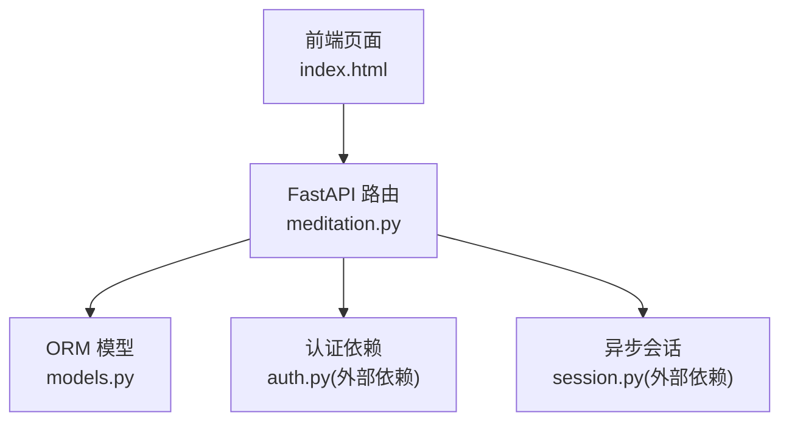
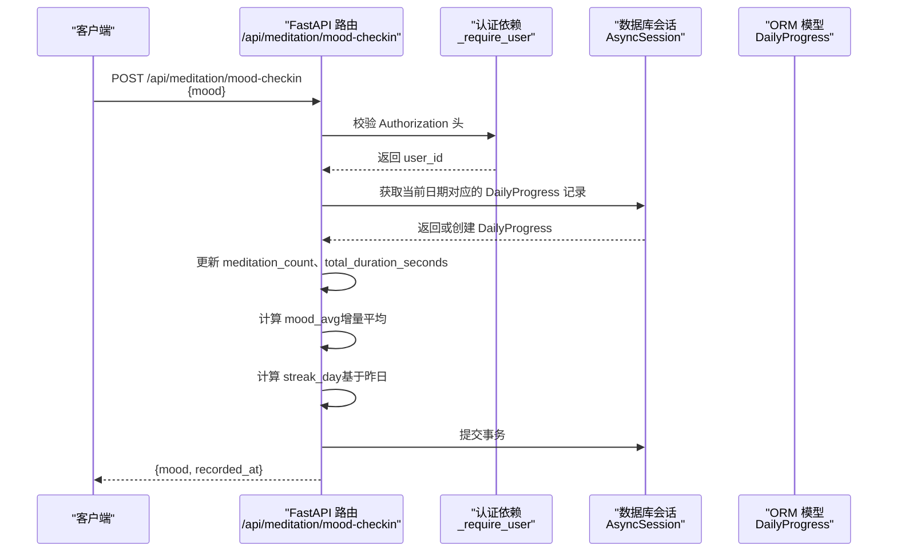
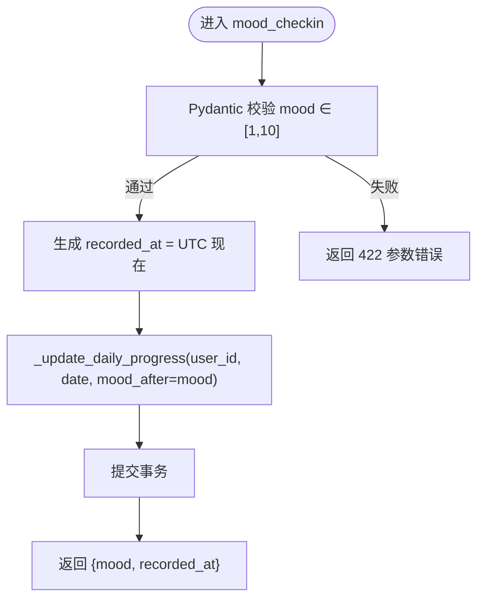
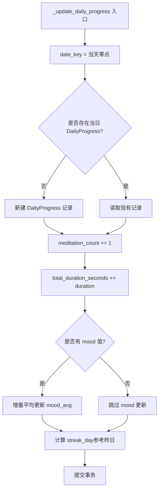
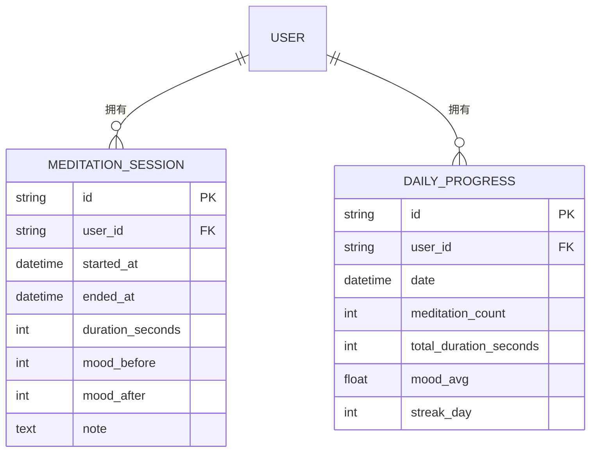
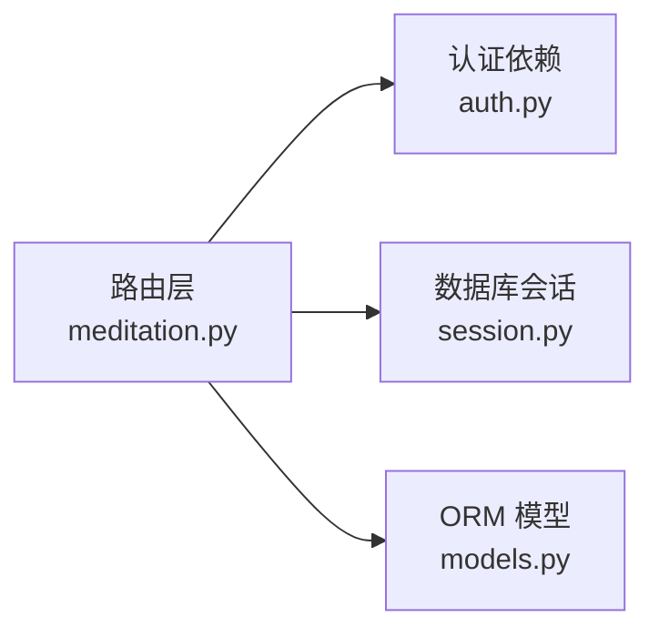

# 情绪追踪接口

<cite>
**本文引用的文件列表**
- [hushai/meditation/api/meditation.py](file://hushai/meditation/api/meditation.py)
- [hushai/meditation/db/models.py](file://hushai/meditation/db/models.py)
- [hushai/meditation/static/index.html](file://hushai/meditation/static/index.html)
- [README.md](file://README.md)
</cite>

## 目录
1. [简介](#简介)
2. [项目结构](#项目结构)
3. [核心组件](#核心组件)
4. [架构总览](#架构总览)
5. [详细组件分析](#详细组件分析)
6. [依赖关系分析](#依赖关系分析)
7. [性能与扩展性](#性能与扩展性)
8. [故障排查指南](#故障排查指南)
9. [结论](#结论)
10. [附录：API 定义与示例](#附录api-定义与示例)

## 简介
本文件为“情绪追踪”功能的 API 文档，重点说明情绪签到接口 POST /api/meditation/mood-checkin 的实现原理、使用方法与数据模型。内容涵盖：
- 情绪值范围验证（1-10）
- 时间戳记录
- 情绪数据存储与每日进度统计的关联机制（平均值计算、趋势分析）
- 隐私保护要点
- 批量导入能力现状与建议
- 历史查询接口建议
- 情绪变化分析与个性化建议生成的扩展点设计

## 项目结构
情绪追踪相关代码位于冥想模块中，主要涉及以下文件：
- API 路由与请求/响应模型：hushai/meditation/api/meditation.py
- 数据库 ORM 模型：hushai/meditation/db/models.py
- 前端交互入口（调用示例）：hushai/meditation/static/index.html
- 项目级接口清单：README.md

图表来源
- [hushai/meditation/api/meditation.py:1-20](file://hushai/meditation/api/meditation.py#L1-L20)
- [hushai/meditation/db/models.py:224-244](file://hushai/meditation/db/models.py#L224-L244)
- [hushai/meditation/static/index.html:1928-1936](file://hushai/meditation/static/index.html#L1928-L1936)

章节来源
- [hushai/meditation/api/meditation.py:1-20](file://hushai/meditation/api/meditation.py#L1-L20)
- [README.md](file://README.md)

## 核心组件
- 情绪签到接口：POST /api/meditation/mood-checkin
  - 功能：记录用户当日情绪值，并更新每日进度统计（含情绪均值与连续打卡天数）。
  - 鉴权：需要携带 Authorization: Bearer <token>。
  - 输入：mood 整数，范围 1-10。
  - 输出：返回本次记录的情绪值与记录时间戳。
- 每日进度聚合：_update_daily_progress
  - 负责按天聚合冥想次数、时长、情绪均值与连续打卡天数。
- 统计与趋势接口：GET /api/meditation/stats、GET /api/meditation/weekly
  - 提供总体统计与近一周趋势数据（包含每日情绪均值等）。

章节来源
- [hushai/meditation/api/meditation.py:176-186](file://hushai/meditation/api/meditation.py#L176-L186)
- [hushai/meditation/api/meditation.py:189-238](file://hushai/meditation/api/meditation.py#L189-L238)
- [hushai/meditation/api/meditation.py:241-333](file://hushai/meditation/api/meditation.py#L241-L333)
- [hushai/meditation/api/meditation.py:336-367](file://hushai/meditation/api/meditation.py#L336-L367)

## 架构总览
情绪签到的端到端流程如下：

图表来源
- [hushai/meditation/api/meditation.py:176-186](file://hushai/meditation/api/meditation.py#L176-L186)
- [hushai/meditation/api/meditation.py:189-238](file://hushai/meditation/api/meditation.py#L189-L238)
- [hushai/meditation/db/models.py:224-244](file://hushai/meditation/db/models.py#L224-L244)

## 详细组件分析

### 情绪签到接口（POST /api/meditation/mood-checkin）
- 路径与方法
  - POST /api/meditation/mood-checkin
- 鉴权要求
  - 请求头需包含 Authorization: Bearer <token>
- 请求体
  - mood: 整数，取值范围 1-10
- 响应体
  - mood: 整数
  - recorded_at: UTC 时间戳
- 处理逻辑
  - 生成当前 UTC 时间作为 recorded_at
  - 调用 _update_daily_progress 更新当日进度（包括 mood_avg 与 streak_day）
  - 返回 MoodCheckInResponse

图表来源
- [hushai/meditation/api/meditation.py:68-75](file://hushai/meditation/api/meditation.py#L68-L75)
- [hushai/meditation/api/meditation.py:176-186](file://hushai/meditation/api/meditation.py#L176-L186)
- [hushai/meditation/api/meditation.py:189-238](file://hushai/meditation/api/meditation.py#L189-L238)

章节来源
- [hushai/meditation/api/meditation.py:68-75](file://hushai/meditation/api/meditation.py#L68-L75)
- [hushai/meditation/api/meditation.py:176-186](file://hushai/meditation/api/meditation.py#L176-L186)

### 每日进度聚合与情绪平均值计算
- 触发时机
  - 每次结束冥想会话或进行情绪签到时，均会调用 _update_daily_progress
- 关键行为
  - 按用户+日期定位 DailyProgress 记录，不存在则新建
  - 累加 meditation_count 与 total_duration_seconds
  - 若存在 mood_before 或 mood_after，则以 mood_after 优先；否则使用 mood_before
  - 采用增量平均公式更新 mood_avg
  - 根据昨日是否有效打卡更新 streak_day
- 复杂度
  - 单次操作 O(1) 次数据库读写（按 user_id + date 索引查找）

图表来源
- [hushai/meditation/api/meditation.py:189-238](file://hushai/meditation/api/meditation.py#L189-L238)
- [hushai/meditation/db/models.py:224-244](file://hushai/meditation/db/models.py#L224-L244)

章节来源
- [hushai/meditation/api/meditation.py:189-238](file://hushai/meditation/api/meditation.py#L189-L238)
- [hushai/meditation/db/models.py:224-244](file://hushai/meditation/db/models.py#L224-L244)

### 统计与趋势接口
- GET /api/meditation/stats
  - 返回总次数、总时长、当前/最长连续打卡天数、今日次数与时长、全局平均情绪、最近会话列表
- GET /api/meditation/weekly
  - 返回过去 7 天的每日进度（会话数、时长、情绪均值、连续天数）

章节来源
- [hushai/meditation/api/meditation.py:241-333](file://hushai/meditation/api/meditation.py#L241-L333)
- [hushai/meditation/api/meditation.py:336-367](file://hushai/meditation/api/meditation.py#L336-L367)

### 数据模型定义
- DailyProgress（每日进度）
  - 字段：id、user_id、date、meditation_count、total_duration_seconds、mood_avg、streak_day、created_at、updated_at
  - 索引：(user_id, date)
- MeditationSession（冥想会话）
  - 字段：id、user_id、conversation_id、scene_id、started_at、ended_at、duration_seconds、mood_before、mood_after、note、created_at
- User（用户）
  - 字段：id、wx_openid、nickname、avatar_url、refresh_token_hash、selected_teacher_id、is_active、metadata_ 等

图表来源
- [hushai/meditation/db/models.py:204-244](file://hushai/meditation/db/models.py#L204-L244)

章节来源
- [hushai/meditation/db/models.py:204-244](file://hushai/meditation/db/models.py#L204-L244)

### 前端调用示例
- 前端在登录后首次访问时弹出情绪签到弹窗，用户选择 1-10 分后调用后端接口。
- 请求头包含 Authorization: Bearer <token>，请求体为 {mood}。

章节来源
- [hushai/meditation/static/index.html:1928-1936](file://hushai/meditation/static/index.html#L1928-L1936)

## 依赖关系分析
- 路由层依赖
  - FastAPI 路由与 Pydantic 模型用于请求/响应校验
  - 认证依赖从外部 auth 模块解析 Bearer Token 并返回 user_id
  - 数据库会话由外部 session 模块提供
- 数据层依赖
  - SQLAlchemy ORM 模型定义表结构与关系
  - 使用 func.date 与索引 (user_id, date) 提升查询效率

图表来源
- [hushai/meditation/api/meditation.py:1-18](file://hushai/meditation/api/meditation.py#L1-L18)
- [hushai/meditation/db/models.py:224-244](file://hushai/meditation/db/models.py#L224-L244)

章节来源
- [hushai/meditation/api/meditation.py:1-18](file://hushai/meditation/api/meditation.py#L1-L18)

## 性能与扩展性
- 性能特性
  - 情绪签到与每日进度更新均为 O(1) 数据库操作，利用 (user_id, date) 复合索引加速定位
  - 情绪均值采用增量平均，避免全量重算
- 可扩展点
  - 新增情绪维度标签（如情绪类别、强度等级）可在 DailyProgress 扩展 JSON 字段
  - 趋势分析可基于 weekly 接口返回的每日 mood 序列进行移动平均或回归拟合
  - 个性化建议可通过读取 stats/weekly 结果，结合规则引擎或 LLM 生成

[本节为通用指导，不直接分析具体文件]

## 故障排查指南
- 401 未授权
  - 检查 Authorization 头是否正确携带 Bearer Token
- 422 参数错误
  - 确认 mood 为整数且在 1-10 范围内
- 404 资源不存在
  - 针对会话相关接口，确认 session_id 有效且属于当前用户
- 数据不一致
  - 检查 _update_daily_progress 的事务提交是否成功
  - 核对 DailyProgress 的 (user_id, date) 索引是否存在

章节来源
- [hushai/meditation/api/meditation.py:176-186](file://hushai/meditation/api/meditation.py#L176-L186)
- [hushai/meditation/api/meditation.py:189-238](file://hushai/meditation/api/meditation.py#L189-L238)

## 结论
情绪签到接口以简洁的请求/响应模型实现情绪数据的采集与每日进度聚合，配合统计与周趋势接口形成完整的情绪追踪闭环。系统通过增量平均与连续打卡天数维护轻量但实用的指标体系，具备良好的扩展性与可观测性。

[本节为总结性内容，不直接分析具体文件]

## 附录：API 定义与示例

### 接口清单
- POST /api/meditation/mood-checkin
  - 描述：情绪签到
  - 鉴权：需要 Authorization: Bearer <token>
  - 请求体：
    - mood: 整数，1-10
  - 响应体：
    - mood: 整数
    - recorded_at: UTC 时间戳
- GET /api/meditation/stats
  - 描述：总体统计（总次数、总时长、连续打卡、今日数据、平均情绪、最近会话）
- GET /api/meditation/weekly
  - 描述：近 7 天每日进度（会话数、时长、情绪均值、连续天数）

章节来源
- [README.md](file://README.md)
- [hushai/meditation/api/meditation.py:176-186](file://hushai/meditation/api/meditation.py#L176-L186)
- [hushai/meditation/api/meditation.py:241-333](file://hushai/meditation/api/meditation.py#L241-L333)
- [hushai/meditation/api/meditation.py:336-367](file://hushai/meditation/api/meditation.py#L336-L367)

### 数据模型摘要
- DailyProgress
  - 关键字段：user_id、date、meditation_count、total_duration_seconds、mood_avg、streak_day
- MeditationSession
  - 关键字段：user_id、started_at、ended_at、duration_seconds、mood_before、mood_after、note

章节来源
- [hushai/meditation/db/models.py:204-244](file://hushai/meditation/db/models.py#L204-L244)

### 隐私保护措施
- 最小化采集：仅记录必要字段（情绪值、时间戳、会话时长等）
- 访问控制：所有接口均需鉴权，确保用户只能访问自身数据
- 存储安全：敏感字段（如咨询记录）采用加密存储策略（服务内其他模块已实现，可作为参考）
- 审计与合规：管理后台具备审计日志能力，便于追溯管理员操作

章节来源
- [hushai/meditation/db/models.py:386-411](file://hushai/meditation/db/models.py#L386-L411)
- [hushai/meditation/api/admin.py:181-190](file://hushai/meditation/api/admin.py#L181-L190)

### 批量导入功能
- 现状：仓库中未发现情绪数据批量导入接口
- 建议方案：
  - 新增 POST /api/meditation/mood-batch-import
  - 请求体：数组项包含 {mood, recorded_at}，服务端按 recorded_at 归属到对应日期的 DailyProgress
  - 幂等性：支持去重（依据 user_id + recorded_at）
  - 事务与回滚：整批提交，失败时整体回滚

[本节为概念性建议，不直接分析具体文件]

### 历史查询接口
- 现状：提供 stats 与 weekly 汇总接口，未提供逐条情绪记录的历史查询
- 建议方案：
  - GET /api/meditation/mood-history?start_date=&end_date=&limit=&offset=
  - 返回指定时间段内的每日 mood_avg 或原始签到记录（如需）
  - 分页与排序：按日期降序，支持 limit/offset

[本节为概念性建议，不直接分析具体文件]

### 情绪变化分析与个性化建议生成（扩展点）
- 数据来源：stats 与 weekly 返回的每日 mood 序列
- 分析方法：
  - 移动平均、趋势斜率、波动度（方差/标准差）
  - 阈值告警：连续多日低于某阈值时触发提醒
- 建议生成：
  - 规则引擎：基于阈值与趋势组合生成建议
  - LLM 集成：将近期趋势与上下文注入提示词，生成个性化建议
- 输出形式：
  - 新增 GET /api/meditation/insights 返回结构化洞察与建议文本

[本节为概念性建议，不直接分析具体文件]