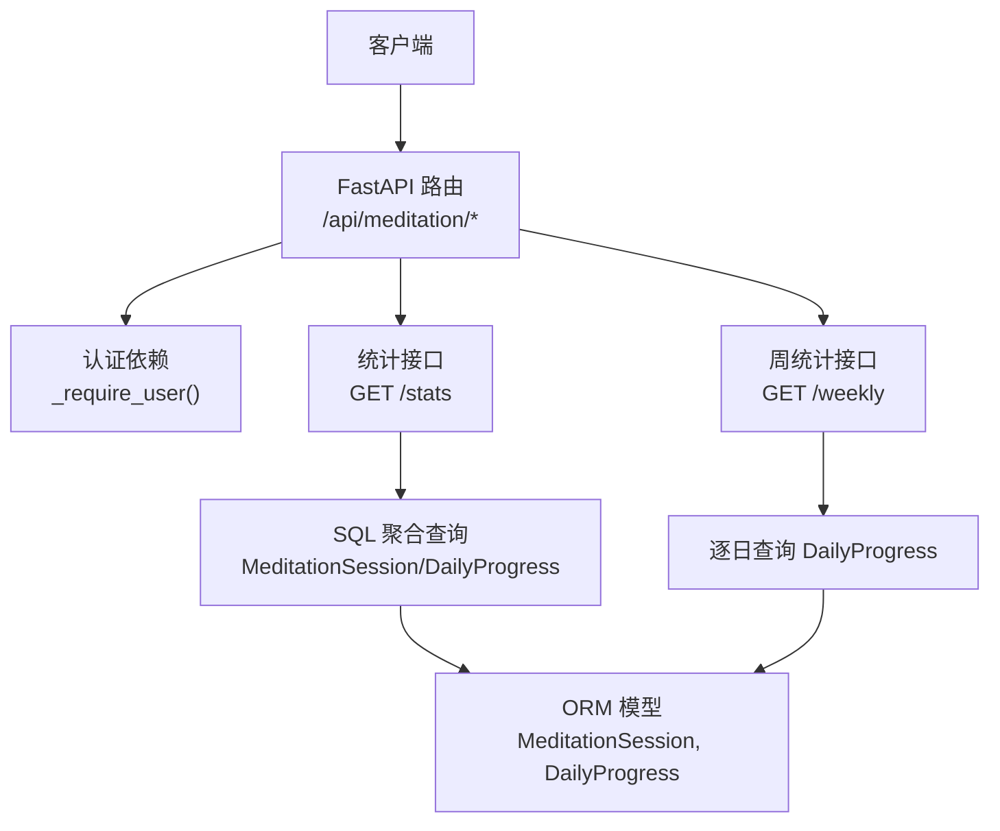
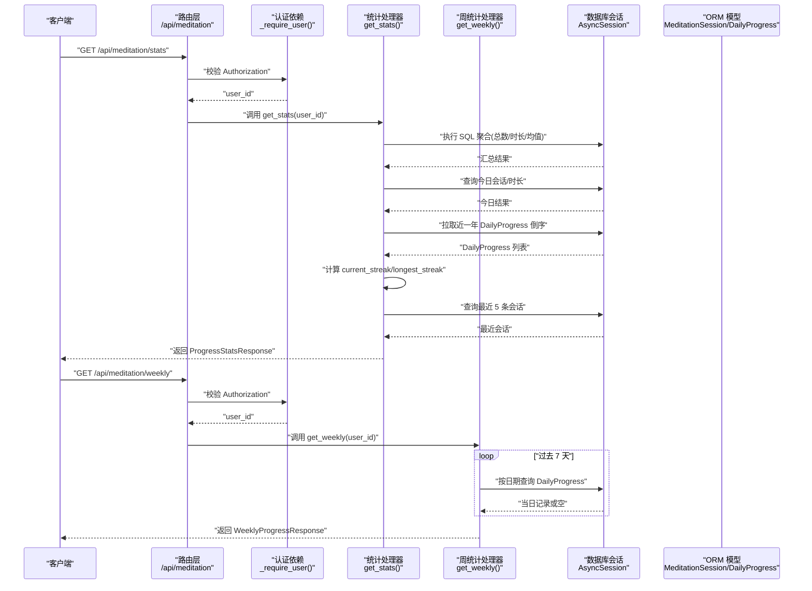
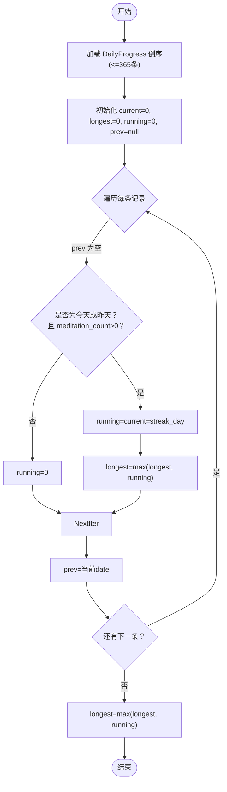
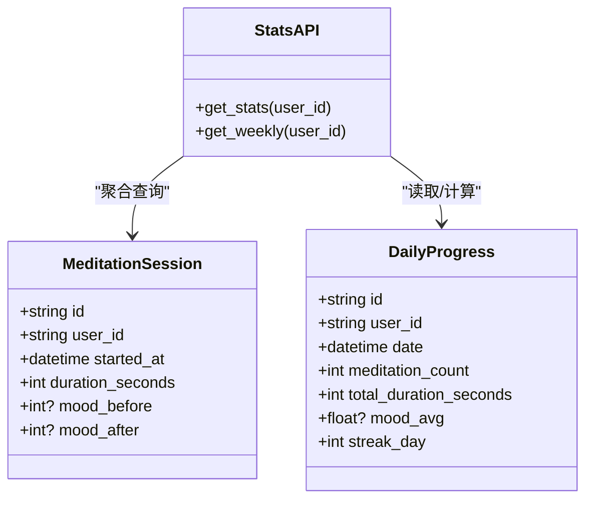

# 进度统计接口

<cite>
**本文引用的文件**   
- [hushai/meditation/api/meditation.py](file://hushai/meditation/api/meditation.py)
- [hushai/meditation/db/models.py](file://hushai/meditation/db/models.py)
</cite>

## 目录
1. [简介](#简介)
2. [项目结构](#项目结构)
3. [核心组件](#核心组件)
4. [架构总览](#架构总览)
5. [详细组件分析](#详细组件分析)
6. [依赖关系分析](#依赖关系分析)
7. [性能考虑](#性能考虑)
8. [故障排查指南](#故障排查指南)
9. [结论](#结论)
10. [附录：数据结构与参数定义](#附录数据结构与参数定义)

## 简介
本文件为冥想进度统计功能的 API 文档，聚焦以下两个只读接口：
- GET /api/meditation/stats：获取用户总体与今日统计、连续打卡天数、最近会话等。
- GET /api/meditation/weekly：获取过去七天（含今天）的每日维度统计。

文档将详细说明关键指标的计算逻辑、连续打卡算法原理、周维度数据聚合方式、请求/响应数据结构、查询参数选项以及性能优化策略（缓存、增量更新、实时计算）。

## 项目结构
与进度统计相关的代码主要位于以下模块：
- API 路由与业务实现：hushai/meditation/api/meditation.py
- 数据库模型与索引：hushai/meditation/db/models.py

图表来源
- [hushai/meditation/api/meditation.py:18-367](file://hushai/meditation/api/meditation.py#L18-L367)
- [hushai/meditation/db/models.py:204-243](file://hushai/meditation/db/models.py#L204-L243)

章节来源
- [hushai/meditation/api/meditation.py:18-367](file://hushai/meditation/api/meditation.py#L18-L367)
- [hushai/meditation/db/models.py:204-243](file://hushai/meditation/db/models.py#L204-L243)

## 核心组件
- 认证依赖：通过 Authorization 头中的 Bearer Token 解析当前用户 ID，未通过则返回 401。
- 统计接口：
  - 总会话数、总时长、平均情绪（基于结束后的情绪评分）、今日会话数与时长、当前连续打卡天数、历史最长连续天数、最近 5 条会话。
- 周统计接口：
  - 返回过去 7 天（含今天）每天的会话数、时长、情绪均值、当日 streak_day。

章节来源
- [hushai/meditation/api/meditation.py:241-333](file://hushai/meditation/api/meditation.py#L241-L333)
- [hushai/meditation/api/meditation.py:336-367](file://hushai/meditation/api/meditation.py#L336-L367)

## 架构总览

图表来源
- [hushai/meditation/api/meditation.py:241-367](file://hushai/meditation/api/meditation.py#L241-L367)
- [hushai/meditation/db/models.py:204-243](file://hushai/meditation/db/models.py#L204-L243)

## 详细组件分析

### 接口一：GET /api/meditation/stats
- 功能：返回用户总体与今日统计、连续打卡天数、最近会话等。
- 认证：需要 Authorization: Bearer <token>。
- 查询参数：无。
- 响应体字段说明：
  - total_sessions：总会话数
  - total_duration_seconds：总时长（秒）
  - avg_mood：所有会话 mood_after 的平均值（若无有效值则为 null）
  - today_sessions：今日会话数
  - today_duration_seconds：今日时长（秒）
  - current_streak：当前连续打卡天数
  - longest_streak：历史最长连续打卡天数
  - recent_sessions：最近 5 条会话摘要（id、started_at、duration_seconds、mood_before、mood_after）

#### 关键指标计算逻辑
- 总会话数与总时长：对 MeditationSession 表按 user_id 进行 count 与 sum(duration_seconds)。
- 平均情绪：对 MeditationSession.mood_after 求平均值；若结果为 0 或空则视为 null。
- 今日统计：限定 started_at 的日期等于当天，再 count 与 sum。
- 最近会话：按 started_at 倒序取前 5 条。

章节来源
- [hushai/meditation/api/meditation.py:241-333](file://hushai/meditation/api/meditation.py#L241-L333)
- [hushai/meditation/db/models.py:204-221](file://hushai/meditation/db/models.py#L204-L221)

#### 连续打卡算法（current_streak 与 longest_streak）
- 数据来源：DailyProgress 表，按 date 降序拉取最多 365 条。
- 断签检测：
  - 遍历 DailyProgress 时，期望的“前一天”应为 prev_date - 1 天。
  - 若当前记录的 date 不等于期望的前一天，或 meditation_count 为 0，则视为断签。
- 当前连续天数（current_streak）：
  - 仅当第一条记录是今天或昨天且 meditation_count > 0 时，才以该记录的 streak_day 作为 current_streak。
- 历史最长连续天数（longest_streak）：
  - 在遍历过程中维护 running_streak，遇到连续且有效的记录则更新 running_streak，并累计 longest_streak = max(longest_streak, running_streak)。
  - 遍历结束后再次用 running_streak 更新 longest_streak。

图表来源
- [hushai/meditation/api/meditation.py:273-305](file://hushai/meditation/api/meditation.py#L273-L305)

章节来源
- [hushai/meditation/api/meditation.py:273-305](file://hushai/meditation/api/meditation.py#L273-L305)

### 接口二：GET /api/meditation/weekly
- 功能：返回过去 7 天（含今天）的每日维度统计。
- 认证：需要 Authorization: Bearer <token>。
- 查询参数：无。
- 响应体字段说明：
  - days：数组，每项包含：
    - date：月-日（MM-DD）
    - day_name：中文星期名（如“日”、“一”...）
    - sessions：当日会话数
    - duration_seconds：当日总时长（秒）
    - mood：当日情绪均值（可能为 null）
    - streak：当日 streak_day（来自 DailyProgress）

#### 周维度数据统计
- 时间范围：从“今天”向前推 6 天，共 7 天。
- 每日数据：
  - 针对每一天，按 user_id 和 date 精确匹配 DailyProgress 记录。
  - 若存在记录，则使用 meditation_count、total_duration_seconds、mood_avg、streak_day；否则对应字段为 0 或 null。
- 输出顺序：从 7 天前到今天依次排列。

章节来源
- [hushai/meditation/api/meditation.py:336-367](file://hushai/meditation/api/meditation.py#L336-L367)
- [hushai/meditation/db/models.py:224-243](file://hushai/meditation/db/models.py#L224-L243)

### 情绪趋势分析
- 周维度情绪趋势：通过 weekly 接口的 days[].mood 序列可观察一周内情绪变化。
- 总体情绪：stats 接口的 avg_mood 提供全局情绪均值（基于 mood_after）。

章节来源
- [hushai/meditation/api/meditation.py:241-333](file://hushai/meditation/api/meditation.py#L241-L333)
- [hushai/meditation/api/meditation.py:336-367](file://hushai/meditation/api/meditation.py#L336-L367)

## 依赖关系分析

图表来源
- [hushai/meditation/db/models.py:204-243](file://hushai/meditation/db/models.py#L204-L243)
- [hushai/meditation/api/meditation.py:241-367](file://hushai/meditation/api/meditation.py#L241-L367)

章节来源
- [hushai/meditation/db/models.py:204-243](file://hushai/meditation/db/models.py#L204-L243)
- [hushai/meditation/api/meditation.py:241-367](file://hushai/meditation/api/meditation.py#L241-L367)

## 性能考虑
- 数据库索引
  - DailyProgress 已建立 (user_id, date) 复合索引，利于按用户与日期快速定位。
  - MeditationSession.user_id 有索引，利于按用户聚合。
- 查询优化建议
  - stats 接口中“最近 5 条会话”已限制 limit(5)，避免大结果集传输。
  - 连续打卡计算仅拉取最近 365 条 DailyProgress，降低内存与 CPU 开销。
- 缓存策略（推荐）
  - 对 stats 与 weekly 结果增加短期缓存（例如 1~5 分钟），键包含 user_id 与 UTC 日期边界，减少重复聚合。
  - 使用 Redis 或进程内 LRU 缓存，注意跨进程部署时的分布式一致性。
- 增量更新（推荐）
  - 在 session/end 与 mood-checkin 后异步刷新相关用户的 stats/weekly 缓存条目，保证后续读取命中最新数据。
  - 对 DailyProgress 的更新已在写入路径完成，统计接口可直接读取。
- 实时计算（推荐）
  - 对于高并发场景，可将“今日统计”与“最近会话”单独缓存，并以事件驱动的方式在写路径触发更新。
  - 连续打卡计算属于 O(N) 扫描，建议仅在缓存失效时计算，避免每次请求都重算。

章节来源
- [hushai/meditation/db/models.py:241-243](file://hushai/meditation/db/models.py#L241-L243)
- [hushai/meditation/api/meditation.py:273-305](file://hushai/meditation/api/meditation.py#L273-L305)
- [hushai/meditation/api/meditation.py:307-322](file://hushai/meditation/api/meditation.py#L307-L322)

## 故障排查指南
- 401 未认证
  - 检查请求头是否携带 Authorization: Bearer <token>。
  - 确认 token 有效且未过期。
- 404 会话不存在或已结束
  - 仅在 session/end 时出现，确认传入的 session_id 有效且未被重复结束。
- 数据不一致
  - 检查 DailyProgress 的 streak_day 与 meditation_count 是否在 session/end 与 mood-checkin 后正确更新。
  - 核对 timezone 与日期截断逻辑，确保“今天”的判断一致。

章节来源
- [hushai/meditation/api/meditation.py:25-33](file://hushai/meditation/api/meditation.py#L25-L33)
- [hushai/meditation/api/meditation.py:136-174](file://hushai/meditation/api/meditation.py#L136-L174)
- [hushai/meditation/api/meditation.py:189-238](file://hushai/meditation/api/meditation.py#L189-L238)

## 结论
- 两个统计接口均基于现有 ORM 模型与索引设计，具备较好的可扩展性与可读性。
- 连续打卡算法采用倒序扫描与断签检测，兼顾准确性与性能。
- 建议在写路径引入缓存与增量更新机制，进一步降低统计接口的延迟与数据库压力。

## 附录：数据结构与参数定义

### 请求与响应结构
- 通用认证要求
  - 请求头：Authorization: Bearer <token>
- GET /api/meditation/stats
  - 查询参数：无
  - 响应体字段：
    - total_sessions：整数
    - total_duration_seconds：整数
    - avg_mood：浮点数或 null
    - today_sessions：整数
    - today_duration_seconds：整数
    - current_streak：整数
    - longest_streak：整数
    - recent_sessions：对象数组，每项包含 id、started_at、duration_seconds、mood_before、mood_after
- GET /api/meditation/weekly
  - 查询参数：无
  - 响应体字段：
    - days：对象数组，每项包含 date（MM-DD）、day_name（中文星期）、sessions、duration_seconds、mood（浮点或 null）、streak

章节来源
- [hushai/meditation/api/meditation.py:85-106](file://hushai/meditation/api/meditation.py#L85-L106)
- [hushai/meditation/api/meditation.py:241-367](file://hushai/meditation/api/meditation.py#L241-L367)

### 数据模型定义
- MeditationSession
  - 关键字段：id、user_id、started_at、ended_at、duration_seconds、mood_before、mood_after、note
- DailyProgress
  - 关键字段：id、user_id、date、meditation_count、total_duration_seconds、mood_avg、streak_day
  - 索引：(user_id, date)

章节来源
- [hushai/meditation/db/models.py:204-243](file://hushai/meditation/db/models.py#L204-L243)