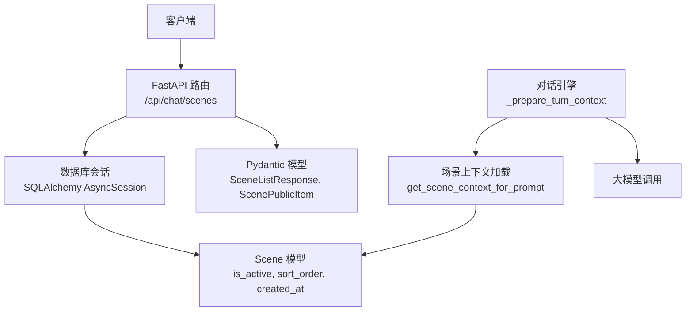
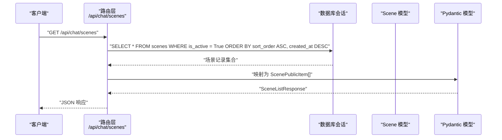
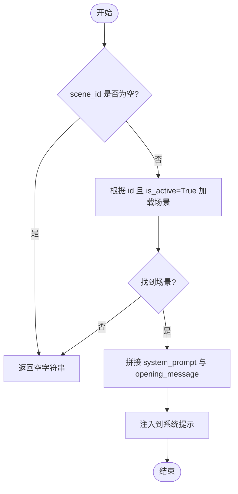
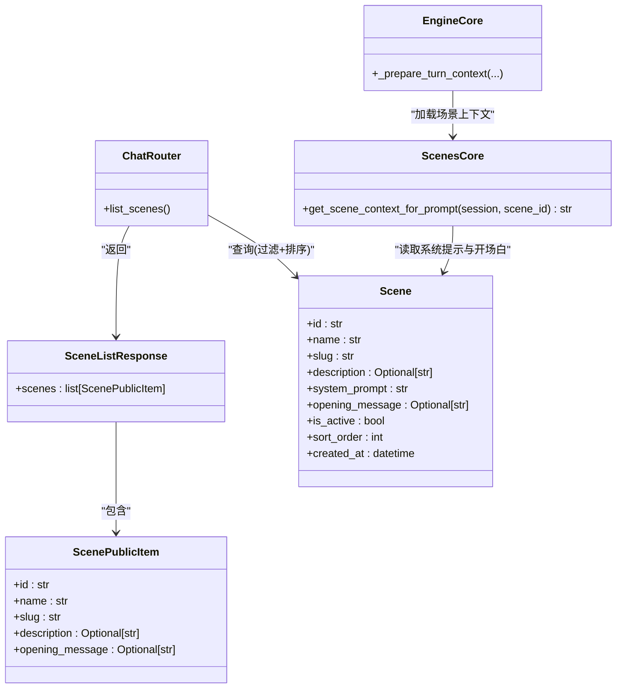

# 场景管理接口

<cite>
**本文引用的文件**   
- [hushai/meditation/api/chat.py](file://hushai/meditation/api/chat.py)
- [hushai/meditation/schemas.py](file://hushai/meditation/schemas.py)
- [hushai/meditation/db/models.py](file://hushai/meditation/db/models.py)
- [hushai/meditation/core/scenes.py](file://hushai/meditation/core/scenes.py)
- [hushai/meditation/core/engine.py](file://hushai/meditation/core/engine.py)
- [README.md](file://README.md)
</cite>

## 目录
1. [简介](#简介)
2. [项目结构](#项目结构)
3. [核心组件](#核心组件)
4. [架构总览](#架构总览)
5. [详细组件分析](#详细组件分析)
6. [依赖关系分析](#依赖关系分析)
7. [性能与排序特性](#性能与排序特性)
8. [故障排查指南](#故障排查指南)
9. [结论](#结论)
10. [附录：前端集成指南与最佳实践](#附录前端集成指南与最佳实践)

## 简介
本文件为 hush.ai 的“场景管理”能力提供 API 文档，重点说明用于获取所有启用冥想场景的 GET /api/chat/scenes 端点。内容涵盖：
- 端点行为、请求与响应格式
- 场景数据结构 ScenePublicItem 字段含义
- 场景启用状态管理与排序规则（sort_order）
- 完整响应示例
- 场景在对话系统中的影响机制（如何影响 AI 导师的行为与对话风格）
- 前端集成指南与最佳实践

## 项目结构
与场景相关的关键代码位置如下：
- 路由定义与列表接口实现：hushai/meditation/api/chat.py
- 公共响应模型定义：hushai/meditation/schemas.py
- 数据库模型（含场景表结构与字段）：hushai/meditation/db/models.py
- 场景上下文加载逻辑（注入系统提示与开场白）：hushai/meditation/core/scenes.py
- 对话引擎组装系统提示并调用 LLM：hushai/meditation/core/engine.py
- 文档索引中对该端点的说明：README.md

图表来源
- [hushai/meditation/api/chat.py:130-152](file://hushai/meditation/api/chat.py#L130-L152)
- [hushai/meditation/schemas.py:250-259](file://hushai/meditation/schemas.py#L250-L259)
- [hushai/meditation/db/models.py:153-169](file://hushai/meditation/db/models.py#L153-L169)
- [hushai/meditation/core/scenes.py:11-29](file://hushai/meditation/core/scenes.py#L11-L29)
- [hushai/meditation/core/engine.py:91-127](file://hushai/meditation/core/engine.py#L91-L127)

章节来源
- [hushai/meditation/api/chat.py:130-152](file://hushai/meditation/api/chat.py#L130-L152)
- [hushai/meditation/schemas.py:250-259](file://hushai/meditation/schemas.py#L250-L259)
- [hushai/meditation/db/models.py:153-169](file://hushai/meditation/db/models.py#L153-L169)
- [hushai/meditation/core/scenes.py:11-29](file://hushai/meditation/core/scenes.py#L11-L29)
- [hushai/meditation/core/engine.py:91-127](file://hushai/meditation/core/engine.py#L91-L127)
- [README.md](file://README.md)

## 核心组件
- 路由层：GET /api/chat/scenes 返回所有启用的场景，按 sort_order 升序、created_at 降序排列。
- 数据模型：Scene 包含 id、name、slug、description、system_prompt、opening_message、is_active、sort_order、created_at 等字段。
- 响应模型：SceneListResponse 包含 scenes 数组；每个元素为 ScenePublicItem，仅暴露 id、name、slug、description、opening_message。
- 上下文注入：当用户发起对话时，若携带 scene_id，则从数据库中加载对应场景的系统提示与开场白，合并入系统提示，从而影响 AI 的回答风格与引导策略。

章节来源
- [hushai/meditation/api/chat.py:130-152](file://hushai/meditation/api/chat.py#L130-L152)
- [hushai/meditation/schemas.py:250-259](file://hushai/meditation/schemas.py#L250-L259)
- [hushai/meditation/db/models.py:153-169](file://hushai/meditation/db/models.py#L153-L169)
- [hushai/meditation/core/scenes.py:11-29](file://hushai/meditation/core/scenes.py#L11-L29)
- [hushai/meditation/core/engine.py:91-127](file://hushai/meditation/core/engine.py#L91-L127)

## 架构总览
场景管理接口的工作流如下：
- 客户端调用 GET /api/chat/scenes
- 服务端查询数据库，过滤 is_active=True 的场景
- 按 sort_order 升序、created_at 降序排序
- 将结果映射为 ScenePublicItem 列表，封装到 SceneListResponse 返回

图表来源
- [hushai/meditation/api/chat.py:130-152](file://hushai/meditation/api/chat.py#L130-L152)
- [hushai/meditation/db/models.py:153-169](file://hushai/meditation/db/models.py#L153-L169)
- [hushai/meditation/schemas.py:250-259](file://hushai/meditation/schemas.py#L250-L259)

## 详细组件分析

### 端点：GET /api/chat/scenes
- 功能：返回所有已启用的冥想场景列表，供前台选择。
- 认证：无需鉴权（该端点未使用 _require_user）。
- 排序规则：先按 sort_order 升序，再按 created_at 降序。
- 过滤条件：仅返回 is_active=True 的场景。
- 响应模型：SceneListResponse，包含 scenes 数组，每项为 ScenePublicItem。

章节来源
- [hushai/meditation/api/chat.py:130-152](file://hushai/meditation/api/chat.py#L130-L152)
- [hushai/meditation/schemas.py:250-259](file://hushai/meditation/schemas.py#L250-L259)

### 数据结构：ScenePublicItem
- id：场景唯一标识（字符串）。
- name：场景名称（字符串）。
- slug：场景唯一标识符（字符串），用于内部识别与路由。
- description：可选描述（字符串或空）。
- opening_message：可选开场白（字符串或空）。

注意：该公开模型不包含 system_prompt，避免泄露系统提示词。

章节来源
- [hushai/meditation/schemas.py:250-255](file://hushai/meditation/schemas.py#L250-L255)

### 数据库模型：Scene
- 关键字段：
  - id：主键
  - name、slug、description、system_prompt、opening_message
  - is_active：是否启用
  - sort_order：排序权重
  - created_at：创建时间
- 用途：存储不同应用场景的系统提示与引导策略，参与对话系统提示构建。

章节来源
- [hushai/meditation/db/models.py:153-169](file://hushai/meditation/db/models.py#L153-L169)

### 场景上下文注入机制
- 当对话请求携带 scene_id 时，系统会加载对应场景的 system_prompt 与 optional opening_message，拼接为 scene_context。
- 该 scene_context 会被传入 build_system_prompt，最终作为 system 消息的一部分发送给 LLM，从而改变 AI 的行为与对话风格。

图表来源
- [hushai/meditation/core/scenes.py:11-29](file://hushai/meditation/core/scenes.py#L11-L29)
- [hushai/meditation/core/engine.py:91-127](file://hushai/meditation/core/engine.py#L91-L127)

章节来源
- [hushai/meditation/core/scenes.py:11-29](file://hushai/meditation/core/scenes.py#L11-L29)
- [hushai/meditation/core/engine.py:91-127](file://hushai/meditation/core/engine.py#L91-L127)

## 依赖关系分析
- 路由层依赖：
  - SQLAlchemy 异步会话（AsyncSession）进行数据库查询
  - Pydantic 模型（SceneListResponse、ScenePublicItem）进行响应序列化
- 数据层依赖：
  - Scene 模型定义了字段与约束
- 业务层依赖：
  - core.scenes.get_scene_context_for_prompt 负责场景上下文加载
  - core.engine._prepare_turn_context 负责将场景上下文注入系统提示

图表来源
- [hushai/meditation/api/chat.py:130-152](file://hushai/meditation/api/chat.py#L130-L152)
- [hushai/meditation/schemas.py:250-259](file://hushai/meditation/schemas.py#L250-L259)
- [hushai/meditation/db/models.py:153-169](file://hushai/meditation/db/models.py#L153-L169)
- [hushai/meditation/core/scenes.py:11-29](file://hushai/meditation/core/scenes.py#L11-L29)
- [hushai/meditation/core/engine.py:91-127](file://hushai/meditation/core/engine.py#L91-L127)

章节来源
- [hushai/meditation/api/chat.py:130-152](file://hushai/meditation/api/chat.py#L130-L152)
- [hushai/meditation/schemas.py:250-259](file://hushai/meditation/schemas.py#L250-L259)
- [hushai/meditation/db/models.py:153-169](file://hushai/meditation/db/models.py#L153-L169)
- [hushai/meditation/core/scenes.py:11-29](file://hushai/meditation/core/scenes.py#L11-L29)
- [hushai/meditation/core/engine.py:91-127](file://hushai/meditation/core/engine.py#L91-L127)

## 性能与排序特性
- 排序规则：
  - 主要排序：sort_order 升序（数值越小越靠前）
  - 次要排序：created_at 降序（同 sort_order 时，较新的排在前面）
- 过滤条件：
  - 仅返回 is_active=True 的场景
- 性能建议：
  - 建议在数据库层面为 (is_active, sort_order, created_at) 建立复合索引以提升查询性能
  - 前端可缓存场景列表以减少频繁请求

章节来源
- [hushai/meditation/api/chat.py:135-139](file://hushai/meditation/api/chat.py#L135-L139)
- [hushai/meditation/db/models.py:153-169](file://hushai/meditation/db/models.py#L153-L169)

## 故障排查指南
- 常见问题：
  - 返回空列表：检查是否有 is_active=True 的场景存在
  - 排序不符合预期：确认 sort_order 设置是否正确，以及 created_at 是否符合预期
  - 场景未生效：确保对话请求中携带了正确的 scene_id，并且该场景 is_active=True
- 错误处理：
  - 该端点未定义特定错误码，通常返回 200 及 JSON 响应体
  - 若数据库异常，可能返回 500（由框架默认处理）

章节来源
- [hushai/meditation/api/chat.py:130-152](file://hushai/meditation/api/chat.py#L130-L152)

## 结论
GET /api/chat/scenes 提供了简洁而强大的场景管理能力，通过 is_active 控制可见性，通过 sort_order 控制展示顺序。场景的 system_prompt 与 opening_message 会在对话系统中被注入，直接影响 AI 导师的行为与对话风格。前端可通过该接口动态渲染场景选择界面，并在后续对话请求中传递所选场景的 id，以获得一致的体验。

## 附录：前端集成指南与最佳实践
- 获取场景列表：
  - 调用 GET /api/chat/scenes
  - 解析返回的 scenes 数组，展示 name、description、opening_message 等信息
- 选择场景并发起对话：
  - 在发送聊天请求时，附带 scene_id（例如在 ChatRequest 中）
  - 系统将自动加载对应场景的系统提示与开场白，影响 AI 回答风格
- 缓存策略：
  - 场景列表变化不频繁，可在前端做短期缓存，减少重复请求
- 排序与筛选：
  - 后端已按 sort_order 与 created_at 排序，前端可直接渲染
  - 如需进一步筛选，可在前端基于 description 或 name 进行本地过滤
- 安全与隐私：
  - 公开模型不包含 system_prompt，避免泄露敏感提示词
  - 确保仅在受信任的前端环境中调用该接口

章节来源
- [hushai/meditation/api/chat.py:130-152](file://hushai/meditation/api/chat.py#L130-L152)
- [hushai/meditation/schemas.py:250-259](file://hushai/meditation/schemas.py#L250-L259)
- [hushai/meditation/core/scenes.py:11-29](file://hushai/meditation/core/scenes.py#L11-L29)
- [hushai/meditation/core/engine.py:91-127](file://hushai/meditation/core/engine.py#L91-L127)