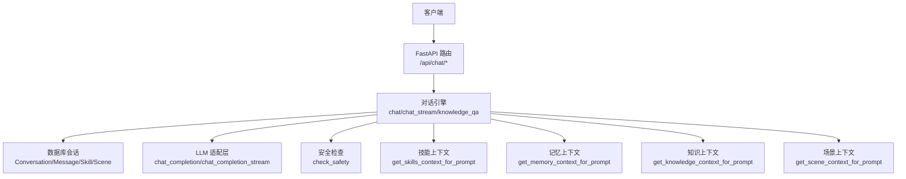
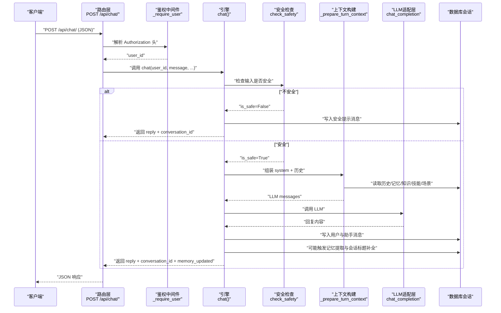
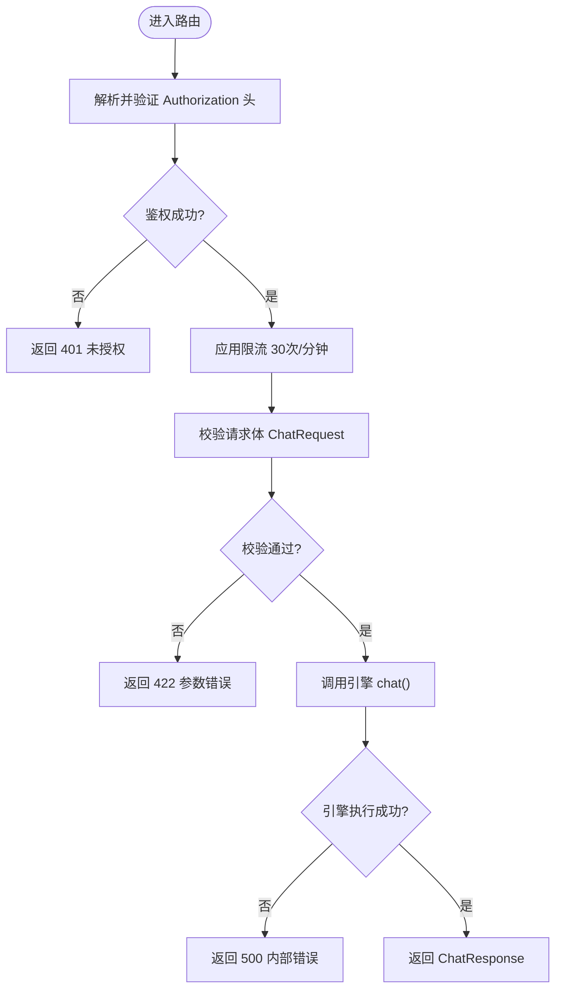
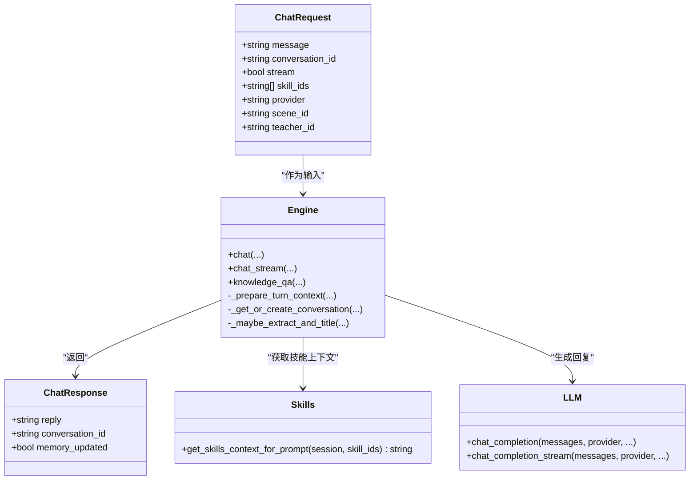
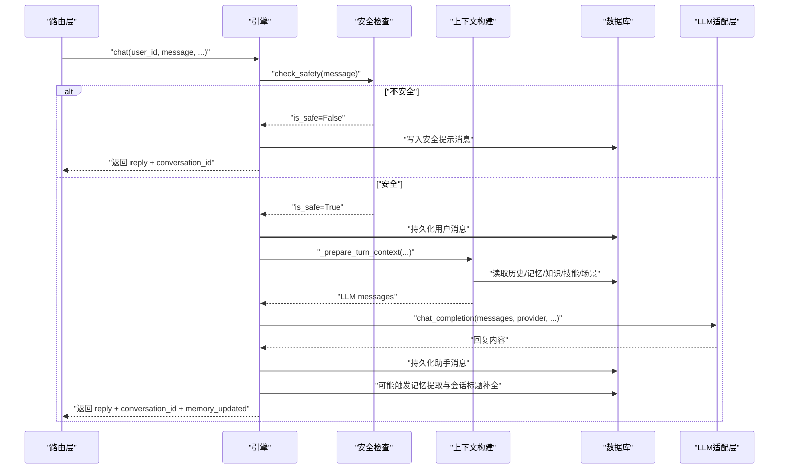
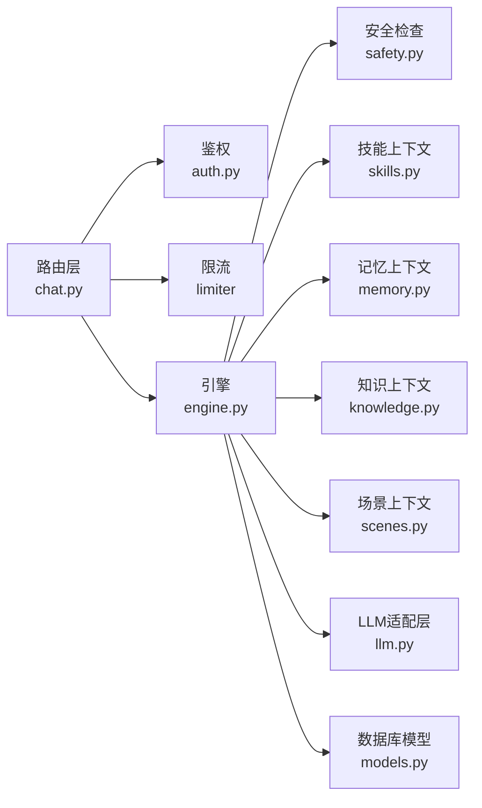

# 基础对话接口

<cite>
**本文引用的文件**
- [hushai/meditation/api/chat.py](file://hushai/meditation/api/chat.py)
- [hushai/meditation/schemas.py](file://hushai/meditation/schemas.py)
- [hushai/meditation/core/engine.py](file://hushai/meditation/core/engine.py)
- [hushai/meditation/core/skills.py](file://hushai/meditation/core/skills.py)
- [hushai/meditation/core/llm.py](file://hushai/meditation/core/llm.py)
- [hushai/meditation/core/safety.py](file://hushai/meditation/core/safety.py)
- [tests/meditation/test_schemas.py](file://tests/meditation/test_schemas.py)
</cite>

## 目录
1. [简介](#简介)
2. [项目结构](#项目结构)
3. [核心组件](#核心组件)
4. [架构总览](#架构总览)
5. [详细组件分析](#详细组件分析)
6. [依赖关系分析](#依赖关系分析)
7. [性能与限流](#性能与限流)
8. [错误处理与安全](#错误处理与安全)
9. [请求/响应示例](#请求响应示例)
10. [故障排查指南](#故障排查指南)
11. [结论](#结论)

## 简介
本文件为 hush.ai 的“基础对话”功能提供 API 文档，重点说明 POST /api/chat/ 端点的实现、参数校验规则、对话上下文管理（会话 ID、多轮状态保持）、技能插件动态调用、错误处理策略、限流机制（30次/分钟）以及安全认证要求。同时给出与对话引擎的集成方式与数据流转过程，并附带完整的请求/响应示例，帮助快速接入文本对话标准流程。

## 项目结构
与本次文档相关的代码主要位于 meditation 子模块中：
- API 路由层：定义 REST 接口、鉴权、限流、请求/响应模型绑定
- 核心引擎层：编排对话流程、上下文组装、记忆提取、知识检索、LLM 调用
- 模型与配置：Pydantic 请求/响应模型、数据库模型、常量与限制



图表来源
- [hushai/meditation/api/chat.py:28-104](file://hushai/meditation/api/chat.py#L28-L104)
- [hushai/meditation/core/engine.py:91-127](file://hushai/meditation/core/engine.py#L91-L127)
- [hushai/meditation/core/llm.py:136-178](file://hushai/meditation/core/llm.py#L136-L178)
- [hushai/meditation/core/safety.py:83-102](file://hushai/meditation/core/safety.py#L83-L102)
- [hushai/meditation/core/skills.py:14-58](file://hushai/meditation/core/skills.py#L14-L58)

章节来源
- [hushai/meditation/api/chat.py:28-104](file://hushai/meditation/api/chat.py#L28-L104)
- [hushai/meditation/core/engine.py:91-127](file://hushai/meditation/core/engine.py#L91-L127)

## 核心组件
- 路由与鉴权
  - 路由前缀：/api/chat
  - 鉴权：通过 Authorization 头携带 Bearer Token，解析出 user_id 后注入到业务逻辑
  - 限流：使用全局 limiter，对关键端点设置 30次/分钟 的限制
- 请求/响应模型
  - ChatRequest：包含 message、conversation_id、skill_ids、provider、scene_id、teacher_id 等字段，内置去重、长度限制等校验
  - ChatResponse：返回 reply、conversation_id、memory_updated
- 对话引擎
  - chat：非流式对话主流程
  - chat_stream：流式对话主流程
  - knowledge_qa：知识库问答（同属对话域）
- 上下文构建
  - _prepare_turn_context：组装 system prompt 与历史消息，融合记忆、知识、技能、场景、教师提示
  - _get_or_create_conversation：按 conversation_id 复用或新建会话
  - _maybe_extract_and_title：周期性触发记忆提取，并在首轮补全会话标题
- LLM 适配层
  - chat_completion：非流式调用，支持 provider 降级与 mock
  - chat_completion_stream：流式调用，支持 provider 降级与 mock

章节来源
- [hushai/meditation/api/chat.py:43-77](file://hushai/meditation/api/chat.py#L43-L77)
- [hushai/meditation/schemas.py:24-56](file://hushai/meditation/schemas.py#L24-L56)
- [hushai/meditation/core/engine.py:38-56](file://hushai/meditation/core/engine.py#L38-L56)
- [hushai/meditation/core/engine.py:91-127](file://hushai/meditation/core/engine.py#L91-L127)
- [hushai/meditation/core/engine.py:166-235](file://hushai/meditation/core/engine.py#L166-L235)
- [hushai/meditation/core/llm.py:136-178](file://hushai/meditation/core/llm.py#L136-L178)
- [hushai/meditation/core/llm.py:208-257](file://hushai/meditation/core/llm.py#L208-L257)

## 架构总览
下图展示了从 HTTP 请求到 LLM 调用的完整链路，包括鉴权、限流、上下文构建、安全检查、持久化与结果返回。



图表来源
- [hushai/meditation/api/chat.py:58-77](file://hushai/meditation/api/chat.py#L58-L77)
- [hushai/meditation/core/engine.py:166-235](file://hushai/meditation/core/engine.py#L166-L235)
- [hushai/meditation/core/safety.py:83-102](file://hushai/meditation/core/safety.py#L83-L102)
- [hushai/meditation/core/engine.py:91-127](file://hushai/meditation/core/engine.py#L91-L127)
- [hushai/meditation/core/llm.py:136-178](file://hushai/meditation/core/llm.py#L136-L178)

## 详细组件分析

### 端点：POST /api/chat/
- 路径与方法：POST /api/chat/
- 鉴权：需要 Authorization: Bearer <token>
- 限流：30次/分钟（同一维度由全局 limiter 控制）
- 请求体：ChatRequest（见下方参数说明）
- 响应体：ChatResponse（reply、conversation_id、memory_updated）



图表来源
- [hushai/meditation/api/chat.py:58-77](file://hushai/meditation/api/chat.py#L58-L77)

章节来源
- [hushai/meditation/api/chat.py:58-77](file://hushai/meditation/api/chat.py#L58-L77)

### 请求参数与校验规则（ChatRequest）
- message: 必填字符串，长度范围 1~5000
- conversation_id: 可选字符串，用于多轮对话上下文关联
- stream: 布尔值，默认 false（当前路由仅用于非流式；流式请使用 /api/chat/stream）
- skill_ids: 可选字符串数组，最大数量受 MAX_SKILLS_PER_MESSAGE 限制（默认上限为 8）
  - 自动去重、去除空白项
  - 若全部无效则视为 None
- provider: 可选字符串，指定 LLM 提供商（如 openai、deepseek 等），为空时回退至默认配置
- scene_id: 可选字符串，指定场景上下文
- teacher_id: 可选字符串，指定教师角色系统提示

校验细节与行为参考测试用例：
- 空 message 或超长 message 将触发校验失败
- skill_ids 去重、过滤空串、截断至上限

章节来源
- [hushai/meditation/schemas.py:24-50](file://hushai/meditation/schemas.py#L24-L50)
- [tests/meditation/test_schemas.py:50-82](file://tests/meditation/test_schemas.py#L50-L82)
- [hushai/meditation/core/skills.py:10-11](file://hushai/meditation/core/skills.py#L10-L11)

### 响应字段（ChatResponse）
- reply: 助手回复文本
- conversation_id: 会话标识（若未传入则创建新会话）
- memory_updated: 本轮是否触发了记忆更新（周期性触发）

章节来源
- [hushai/meditation/schemas.py:53-56](file://hushai/meditation/schemas.py#L53-L56)

### 对话上下文管理机制
- 会话 ID 的作用
  - 若传入 conversation_id，且属于当前用户且未被软删除，则复用该会话
  - 否则创建新会话，并记录 user_id
- 多轮对话的状态保持
  - 每次调用会加载历史消息（可配置最大轮数），拼接成 history_text
  - 将 system prompt 与历史消息一起发送给 LLM，维持上下文连贯性
- 技能插件的动态调用
  - 当 skill_ids 不为空时，按顺序加载对应已启用技能的名称与内容，拼入 system prompt
  - 若无 skill_ids，则加载所有已启用技能（最多 MAX_SKILLS_PER_MESSAGE 条）
- 其他上下文来源
  - 记忆上下文：根据用户消息周期性提取并注入
  - 知识上下文：基于知识库检索结果注入
  - 场景上下文：根据 scene_id 注入
  - 教师提示：根据 teacher_id 查询系统提示，或沿用外部传入的描述



图表来源
- [hushai/meditation/schemas.py:24-56](file://hushai/meditation/schemas.py#L24-L56)
- [hushai/meditation/core/engine.py:91-127](file://hushai/meditation/core/engine.py#L91-L127)
- [hushai/meditation/core/skills.py:14-58](file://hushai/meditation/core/skills.py#L14-L58)
- [hushai/meditation/core/llm.py:136-178](file://hushai/meditation/core/llm.py#L136-L178)

章节来源
- [hushai/meditation/core/engine.py:38-56](file://hushai/meditation/core/engine.py#L38-L56)
- [hushai/meditation/core/engine.py:91-127](file://hushai/meditation/core/engine.py#L91-L127)
- [hushai/meditation/core/skills.py:14-58](file://hushai/meditation/core/skills.py#L14-L58)

### 与对话引擎的集成与数据流转
- 路由层接收请求，完成鉴权与限流后，调用引擎的 chat()
- 引擎先进行安全检查，若不安全直接返回安全提示并落库
- 安全通过后，持久化用户消息，构建上下文（历史、记忆、知识、技能、场景、教师提示）
- 调用 LLM 适配层生成回复，持久化助手消息，并按周期尝试记忆提取与会话标题补全
- 最终返回 reply、conversation_id、memory_updated



图表来源
- [hushai/meditation/core/engine.py:166-235](file://hushai/meditation/core/engine.py#L166-L235)
- [hushai/meditation/core/safety.py:83-102](file://hushai/meditation/core/safety.py#L83-L102)
- [hushai/meditation/core/engine.py:91-127](file://hushai/meditation/core/engine.py#L91-L127)
- [hushai/meditation/core/llm.py:136-178](file://hushai/meditation/core/llm.py#L136-L178)

章节来源
- [hushai/meditation/core/engine.py:166-235](file://hushai/meditation/core/engine.py#L166-L235)

## 依赖关系分析
- 路由层依赖
  - 鉴权模块：解析 Authorization 头并获取 user_id
  - 限流器：全局 limiter，装饰在端点上
  - 引擎模块：chat、chat_stream、knowledge_qa
  - 数据库会话：用于会话与消息读写
  - Pydantic 模型：ChatRequest、ChatResponse、ErrorResponse 等
- 引擎层依赖
  - 安全检查：check_safety
  - 上下文构建：记忆、知识、技能、场景、教师提示
  - LLM 适配层：chat_completion、chat_completion_stream（含 fallback 与 mock）
  - 数据库模型：Conversation、Message、Skill、Scene、Teacher



图表来源
- [hushai/meditation/api/chat.py:13-26](file://hushai/meditation/api/chat.py#L13-L26)
- [hushai/meditation/core/engine.py:13-30](file://hushai/meditation/core/engine.py#L13-L30)
- [hushai/meditation/core/llm.py:136-178](file://hushai/meditation/core/llm.py#L136-L178)

章节来源
- [hushai/meditation/api/chat.py:13-26](file://hushai/meditation/api/chat.py#L13-L26)
- [hushai/meditation/core/engine.py:13-30](file://hushai/meditation/core/engine.py#L13-L30)

## 性能与限流
- 限流策略
  - 端点级限流：30次/分钟（通过 @limiter.limit("30/minute") 装饰器）
  - 适用于 /api/chat/、/api/chat/stream、/api/chat/knowledge
- 性能优化建议
  - 合理设置 conversation_max_turns，避免历史过长导致 LLM 延迟与成本上升
  - 合理使用 skill_ids，减少不必要的技能上下文体积
  - 利用 provider 降级与 mock 模式提升可用性（无 key 时调试友好）

章节来源
- [hushai/meditation/api/chat.py:58-112](file://hushai/meditation/api/chat.py#L58-L112)
- [hushai/meditation/core/engine.py:63-75](file://hushai/meditation/core/engine.py#L63-L75)
- [hushai/meditation/core/llm.py:136-178](file://hushai/meditation/core/llm.py#L136-L178)

## 错误处理与安全
- 错误码
  - 401：未授权（Authorization 缺失或无效）
  - 422：请求体验证失败（message 为空或超长、skill_ids 格式异常等）
  - 500：内部错误（引擎执行异常，如 LLM 调用失败、数据库异常等）
- 安全检查
  - 在调用 LLM 之前进行安全检查，命中危机规则时直接返回安全提示，不发送外部模型
- 流式错误处理
  - 流式端点在异常时将 ErrorResponse 以 data: 事件形式推送

章节来源
- [hushai/meditation/api/chat.py:47-56](file://hushai/meditation/api/chat.py#L47-L56)
- [hushai/meditation/api/chat.py:58-77](file://hushai/meditation/api/chat.py#L58-L77)
- [hushai/meditation/api/chat.py:80-104](file://hushai/meditation/api/chat.py#L80-L104)
- [hushai/meditation/core/safety.py:83-102](file://hushai/meditation/core/safety.py#L83-L102)

## 请求/响应示例
以下为标准文本对话的请求/响应示例（不含具体敏感信息）：

- 请求
  - 方法：POST
  - 路径：/api/chat/
  - 头部：
    - Authorization: Bearer <your_access_token>
    - Content-Type: application/json
  - 请求体（JSON）：
    ```json
    {
      "message": "你好，我想了解冥想入门的方法",
      "conversation_id": null,
      "stream": false,
      "skill_ids": ["mindfulness_basics", "breathing_guide"],
      "provider": "openai",
      "scene_id": "intro_meditation",
      "teacher_id": "teacher_001"
    }
    ```

- 响应
  - 状态码：200
  - 响应体（JSON）：
    ```json
    {
      "reply": "欢迎！冥想入门可以从呼吸练习开始...",
      "conversation_id": "conv_xxxxx",
      "memory_updated": true
    }
    ```

说明：
- 首次调用未传 conversation_id 时，服务端会创建新会话并返回新的 conversation_id
- 后续调用传入相同的 conversation_id 即可保持多轮对话上下文
- memory_updated 表示本轮是否触发了记忆提取与存储

章节来源
- [hushai/meditation/schemas.py:24-56](file://hushai/meditation/schemas.py#L24-L56)
- [hushai/meditation/core/engine.py:166-235](file://hushai/meditation/core/engine.py#L166-L235)

## 故障排查指南
- 401 未授权
  - 检查 Authorization 头是否正确携带 Bearer Token
  - 确认 token 有效且未过期
- 422 参数错误
  - 检查 message 是否为空或超过 5000 字符
  - 检查 skill_ids 是否为字符串数组，是否存在空串或重复项（会自动去重与过滤）
- 500 内部错误
  - 查看后端日志，定位 LLM 调用失败或数据库异常
  - 检查 provider 配置与密钥，必要时启用 fallback 或 mock 模式
- 流式端点异常
  - 确认客户端正确处理 text/event-stream 协议
  - 捕获 data: 事件中的 ErrorResponse 并进行提示

章节来源
- [hushai/meditation/api/chat.py:47-56](file://hushai/meditation/api/chat.py#L47-L56)
- [hushai/meditation/api/chat.py:80-104](file://hushai/meditation/api/chat.py#L80-L104)
- [hushai/meditation/core/llm.py:136-178](file://hushai/meditation/core/llm.py#L136-L178)

## 结论
POST /api/chat/ 提供了稳定、可扩展的基础对话能力，具备完善的鉴权、限流、安全检查与上下文管理能力。通过 conversation_id 可实现多轮对话状态保持，通过 skill_ids 可动态注入技能上下文，结合记忆、知识与场景，形成高质量的个性化回复。配合流式端点与 provider 降级机制，可在生产环境中获得良好的可用性与用户体验。