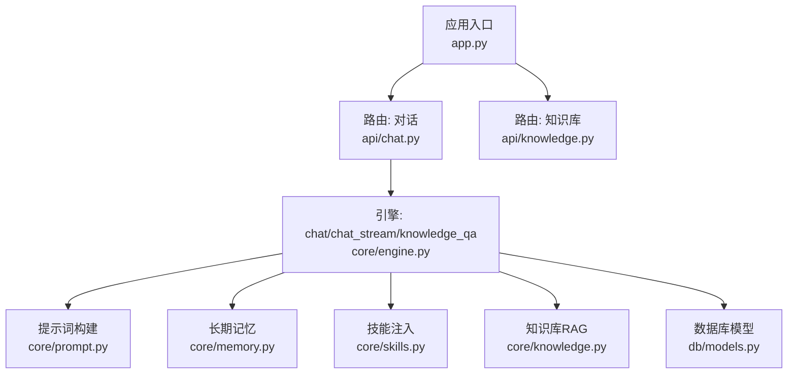
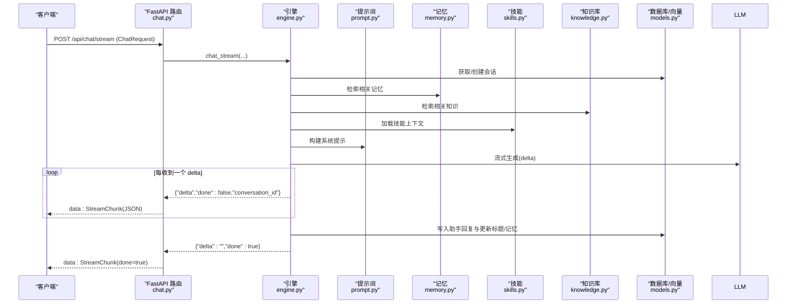
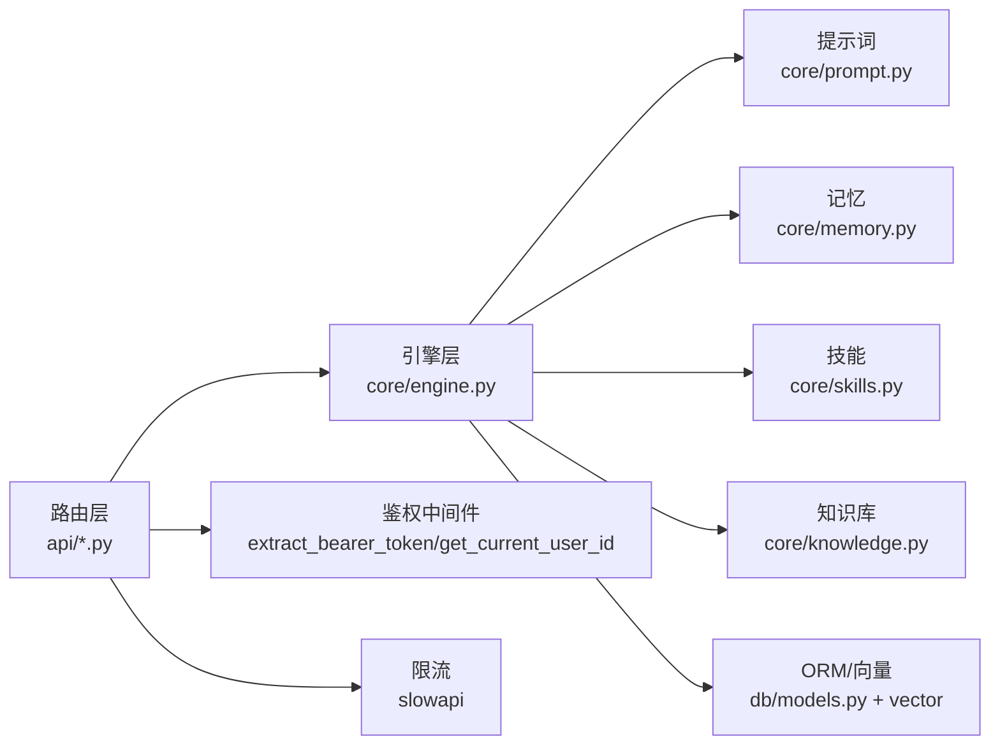

# 对话接口

<cite>
**本文引用的文件**   
- [hushai/meditation/app.py](file://hushai/meditation/app.py)
- [hushai/meditation/api/chat.py](file://hushai/meditation/api/chat.py)
- [hushai/meditation/api/knowledge.py](file://hushai/meditation/api/knowledge.py)
- [hushai/meditation/core/engine.py](file://hushai/meditation/core/engine.py)
- [hushai/meditation/core/memory.py](file://hushai/meditation/core/memory.py)
- [hushai/meditation/core/skills.py](file://hushai/meditation/core/skills.py)
- [hushai/meditation/core/prompt.py](file://hushai/meditation/core/prompt.py)
- [hushai/meditation/core/knowledge.py](file://hushai/meditation/core/knowledge.py)
- [hushai/meditation/db/models.py](file://hushai/meditation/db/models.py)
- [hushai/meditation/schemas.py](file://hushai/meditation/schemas.py)
</cite>

## 目录
1. [简介](#简介)
2. [项目结构](#项目结构)
3. [核心组件](#核心组件)
4. [架构总览](#架构总览)
5. [详细组件分析](#详细组件分析)
6. [依赖分析](#依赖分析)
7. [性能考虑](#性能考虑)
8. [故障排查指南](#故障排查指南)
9. [结论](#结论)
10. [附录：API 定义与示例](#附录api-定义与示例)

## 简介
本文件为 hush.ai 冥想老师服务的“对话接口”完整文档，覆盖普通对话、流式对话（SSE）、知识库问答等核心能力。重点说明：
- 流式响应的实现机制、事件流格式与客户端处理方式
- 对话上下文管理、会话历史存储、技能插件调用
- 请求/响应示例（文本对话、文件上传、多轮对话）
- 错误处理策略、限流机制与性能优化建议

## 项目结构
服务基于 FastAPI 构建，路由按功能模块拆分，核心引擎负责编排对话、记忆提取、知识检索与安全校验。

图表来源
- [hushai/meditation/app.py:136-207](file://hushai/meditation/app.py#L136-L207)
- [hushai/meditation/api/chat.py:28-104](file://hushai/meditation/api/chat.py#L28-L104)
- [hushai/meditation/api/knowledge.py:35-310](file://hushai/meditation/api/knowledge.py#L35-L310)
- [hushai/meditation/core/engine.py:166-387](file://hushai/meditation/core/engine.py#L166-L387)
- [hushai/meditation/core/prompt.py:77-130](file://hushai/meditation/core/prompt.py#L77-L130)
- [hushai/meditation/core/memory.py:45-174](file://hushai/meditation/core/memory.py#L45-L174)
- [hushai/meditation/core/skills.py:14-59](file://hushai/meditation/core/skills.py#L14-L59)
- [hushai/meditation/core/knowledge.py:137-225](file://hushai/meditation/core/knowledge.py#L137-L225)
- [hushai/meditation/db/models.py:69-151](file://hushai/meditation/db/models.py#L69-L151)

章节来源
- [hushai/meditation/app.py:136-207](file://hushai/meditation/app.py#L136-L207)

## 核心组件
- 路由层
  - 对话路由：提供普通对话、流式对话、知识库问答、场景列表、会话与消息查询
  - 知识库路由：提供导入（文本/文件/结构化/批量/远程URL）、搜索、同步远程源
- 引擎层
  - chat：非流式对话，组装系统提示、调用 LLM、持久化消息、触发记忆提取
  - chat_stream：流式对话，逐 token 推送 SSE 事件，完成后持久化并结束
  - knowledge_qa：基于知识库检索的问答流程
- 辅助能力
  - 记忆：周期性从对话中提取长期记忆，向量索引与检索
  - 技能：按 ID 或全局加载已启用技能，拼入系统提示
  - 提示词：动态拼装角色、场景、技能、记忆、历史与安全边界
  - 知识库：Markdown/纯文本预处理、分块、入库与向量检索

章节来源
- [hushai/meditation/api/chat.py:58-127](file://hushai/meditation/api/chat.py#L58-L127)
- [hushai/meditation/api/knowledge.py:57-310](file://hushai/meditation/api/knowledge.py#L57-L310)
- [hushai/meditation/core/engine.py:166-387](file://hushai/meditation/core/engine.py#L166-L387)
- [hushai/meditation/core/memory.py:45-174](file://hushai/meditation/core/memory.py#L45-L174)
- [hushai/meditation/core/skills.py:14-59](file://hushai/meditation/core/skills.py#L14-L59)
- [hushai/meditation/core/prompt.py:77-130](file://hushai/meditation/core/prompt.py#L77-L130)
- [hushai/meditation/core/knowledge.py:137-225](file://hushai/meditation/core/knowledge.py#L137-L225)

## 架构总览
下图展示一次流式对话的关键调用链与数据流向。

图表来源
- [hushai/meditation/api/chat.py:80-104](file://hushai/meditation/api/chat.py#L80-L104)
- [hushai/meditation/core/engine.py:238-314](file://hushai/meditation/core/engine.py#L238-L314)
- [hushai/meditation/core/prompt.py:77-103](file://hushai/meditation/core/prompt.py#L77-L103)
- [hushai/meditation/core/memory.py:161-174](file://hushai/meditation/core/memory.py#L161-L174)
- [hushai/meditation/core/skills.py:14-59](file://hushai/meditation/core/skills.py#L14-L59)
- [hushai/meditation/core/knowledge.py:216-225](file://hushai/meditation/core/knowledge.py#L216-L225)
- [hushai/meditation/db/models.py:69-96](file://hushai/meditation/db/models.py#L69-L96)

## 详细组件分析

### 对话路由（普通/流式/知识库）
- 普通对话
  - 端点：POST /api/chat/
  - 鉴权：Header Authorization=Bearer <token>
  - 请求体：ChatRequest
  - 响应：ChatResponse
  - 限流：30次/分钟（IP）
- 流式对话（SSE）
  - 端点：POST /api/chat/stream
  - 返回：text/event-stream
  - 事件：data: StreamChunk(JSON)，done=true 表示结束
  - 限流：30次/分钟（IP）
- 知识库问答
  - 端点：POST /api/chat/knowledge
  - 请求体：ChatRequest
  - 响应：KnowledgeQAResponse（包含 sources）
  - 限流：30次/分钟（IP）
- 其他
  - GET /api/chat/scenes：列出可用场景
  - GET /api/chat/conversations：分页列出当前用户会话
  - GET /api/chat/conversations/{id}/messages：获取某会话的消息历史

章节来源
- [hushai/meditation/api/chat.py:58-127](file://hushai/meditation/api/chat.py#L58-L127)
- [hushai/meditation/api/chat.py:130-245](file://hushai/meditation/api/chat.py#L130-L245)
- [hushai/meditation/schemas.py:24-69](file://hushai/meditation/schemas.py#L24-L69)

### 流式响应机制与事件格式
- 服务端
  - 引擎 chat_stream 以异步生成器逐 token 产出 delta
  - 路由将每个 delta 序列化为 StreamChunk JSON，并以 SSE 格式 data: {json}\n\n 发送
  - done=true 的事件用于标记完成
- 客户端处理建议
  - 使用支持 SSE 的 HTTP 客户端（如 fetch EventSource 或专用库）
  - 解析 data: 行，反序列化为 StreamChunk
  - 拼接 delta 到 UI；当 done=true 时停止接收并刷新会话状态
  - 异常处理：若收到 ErrorResponse JSON，显示错误信息并终止连接

章节来源
- [hushai/meditation/api/chat.py:80-104](file://hushai/meditation/api/chat.py#L80-L104)
- [hushai/meditation/core/engine.py:238-314](file://hushai/meditation/core/engine.py#L238-L314)
- [hushai/meditation/schemas.py:244-248](file://hushai/meditation/schemas.py#L244-L248)

### 对话上下文管理与会话历史
- 会话与会话消息
  - Conversation 记录用户会话元信息（标题、时间、活跃状态）
  - Message 记录每轮 user/assistant 内容与时间戳
- 上下文组装
  - 加载最近 N 轮历史（受配置限制）
  - 注入记忆摘要、知识库片段、技能指引、场景引导、导师风格与安全边界
- 标题自动补全
  - 首次用户消息前 64 字作为会话标题（若无已有标题）

章节来源
- [hushai/meditation/db/models.py:69-96](file://hushai/meditation/db/models.py#L69-L96)
- [hushai/meditation/core/engine.py:91-127](file://hushai/meditation/core/engine.py#L91-L127)
- [hushai/meditation/core/prompt.py:77-103](file://hushai/meditation/core/prompt.py#L77-L103)

### 长期记忆（提取/存储/检索）
- 提取时机
  - 每隔固定数量的用户回合触发一次（默认每 2 条用户消息）
- 提取内容
  - 类别：冥想经历、情绪模式、个人偏好、目标进展、重要事件、健康提醒、生活背景
  - 输出：JSON 数组，含 category/content/summary/importance
- 存储与检索
  - 持久化至 memories 表，并写入向量索引
  - 根据当前问题检索 Top-K 相关记忆，摘要形式注入提示词

章节来源
- [hushai/meditation/core/engine.py:130-154](file://hushai/meditation/core/engine.py#L130-L154)
- [hushai/meditation/core/memory.py:45-113](file://hushai/meditation/core/memory.py#L45-L113)
- [hushai/meditation/core/memory.py:115-174](file://hushai/meditation/core/memory.py#L115-L174)
- [hushai/meditation/db/models.py:98-118](file://hushai/meditation/db/models.py#L98-L118)

### 技能插件（Skill）
- 作用
  - 将已启用的技能文本注入系统提示，增强特定能力
- 选择策略
  - 可指定 skill_ids 顺序去重加载，最多 N 个；未指定则加载所有已启用（上限 N）
- 限制
  - 单条消息最大技能数与批量导入上限由常量控制

章节来源
- [hushai/meditation/core/skills.py:14-59](file://hushai/meditation/core/skills.py#L14-L59)
- [hushai/meditation/db/models.py:120-135](file://hushai/meditation/db/models.py#L120-L135)
- [hushai/meditation/schemas.py:172-218](file://hushai/meditation/schemas.py#L172-L218)

### 知识库问答（RAG）
- 导入
  - 文本/文件/结构化/批量/远程 URL 多种导入方式
  - Markdown 支持 frontmatter 与标题提取，转纯文本后分块入库
- 检索
  - 向量检索 top_k 结果，摘要形式注入提示词
- 问答
  - 结合记忆与知识库，生成结构化回答并返回引用来源

章节来源
- [hushai/meditation/api/knowledge.py:57-310](file://hushai/meditation/api/knowledge.py#L57-L310)
- [hushai/meditation/core/knowledge.py:76-171](file://hushai/meditation/core/knowledge.py#L76-L171)
- [hushai/meditation/core/knowledge.py:207-225](file://hushai/meditation/core/knowledge.py#L207-L225)
- [hushai/meditation/core/engine.py:316-387](file://hushai/meditation/core/engine.py#L316-L387)

## 依赖分析
- 路由依赖
  - 鉴权：从 Authorization 头提取 Bearer Token，校验用户身份
  - 限流：基于 IP 的速率限制，统一异常处理器
- 引擎依赖
  - 数据库会话工厂、SQLAlchemy 模型
  - 外部 LLM 调用（通过 chat_completion/chat_completion_stream）
  - 向量检索（记忆与知识库）
- 安全
  - 输入安全检查，危险内容不送外部模型，直接返回安全提示

图表来源
- [hushai/meditation/api/chat.py:13-27](file://hushai/meditation/api/chat.py#L13-L27)
- [hushai/meditation/app.py:146-155](file://hushai/meditation/app.py#L146-L155)
- [hushai/meditation/core/engine.py:166-387](file://hushai/meditation/core/engine.py#L166-L387)
- [hushai/meditation/db/models.py:69-151](file://hushai/meditation/db/models.py#L69-L151)

章节来源
- [hushai/meditation/app.py:146-155](file://hushai/meditation/app.py#L146-L155)
- [hushai/meditation/api/chat.py:47-56](file://hushai/meditation/api/chat.py#L47-L56)

## 性能考虑
- 流式优先
  - 长回复建议使用 /api/chat/stream，降低首字节延迟，提升用户体验
- 上下文裁剪
  - 通过 conversation_max_turns 控制历史长度，避免过长提示导致超时与成本上升
- 记忆与知识检索
  - 合理设置 memory_top_k 与 knowledge_top_k，平衡准确性与开销
- 并发与事务
  - 引擎在 finally 中确保失败回滚，避免脏写
- 静态资源与文档
  - 生产环境关闭调试文档与静态挂载，减少攻击面

[本节为通用指导，无需代码来源]

## 故障排查指南
- 鉴权失败（401）
  - 检查 Authorization 头是否携带有效 Bearer Token
  - 确认用户未被禁用且 Token 未过期
- 限流（429）
  - 同一 IP 超过 30 次/分钟将被拒绝，适当退避重试
- 知识库为空
  - 确认已执行导入（文本/文件/URL），并成功写入向量索引
- 流式中断
  - 检查网络稳定性；客户端需正确处理 done=true 与异常事件
- 安全拦截
  - 若检测到危机信号，服务端会返回安全提示而非外部模型答案

章节来源
- [hushai/meditation/api/chat.py:47-56](file://hushai/meditation/api/chat.py#L47-L56)
- [hushai/meditation/api/chat.py:58-78](file://hushai/meditation/api/chat.py#L58-L78)
- [hushai/meditation/core/engine.py:182-196](file://hushai/meditation/core/engine.py#L182-L196)
- [hushai/meditation/core/engine.py:255-274](file://hushai/meditation/core/engine.py#L255-L274)

## 结论
本对话系统通过模块化路由与引擎设计，实现了稳定可靠的普通对话、流式对话与知识库问答能力。配合记忆与技能注入，可在保持低延迟的同时提供个性化、有依据的回答。建议在生产环境中开启限流、合理裁剪上下文、优先使用流式接口，并做好鉴权与错误处理。

[本节为总结性内容，无需代码来源]

## 附录：API 定义与示例

### 通用鉴权
- 请求头
  - Authorization: Bearer <access_token>
- 说明
  - 除公开端点外，均需携带有效令牌

### 普通对话
- 端点
  - POST /api/chat/
- 请求体（字段来自 ChatRequest）
  - message: 必填，字符串，1-5000 字符
  - conversation_id: 可选，会话 ID（留空则新建）
  - skill_ids: 可选，字符串数组，去重并按序加载（最多 N 个）
  - provider: 可选，LLM 提供商标识
  - scene_id: 可选，场景 ID
  - teacher_id: 可选，导师 ID（影响 system_prompt）
- 响应（ChatResponse）
  - reply: 字符串
  - conversation_id: 字符串
  - memory_updated: 布尔值
- 示例（文本对话）
  - 请求
    - Header: Authorization: Bearer xxx
    - Body: { "message": "今天练习呼吸时总是走神，怎么办？", "skill_ids": ["mindfulness-basics"], "scene_id": "relaxation" }
  - 响应
    - { "reply": "...", "conversation_id": "c1", "memory_updated": false }

章节来源
- [hushai/meditation/api/chat.py:58-78](file://hushai/meditation/api/chat.py#L58-L78)
- [hushai/meditation/schemas.py:24-57](file://hushai/meditation/schemas.py#L24-L57)

### 流式对话（SSE）
- 端点
  - POST /api/chat/stream
- 请求体
  - 同 ChatRequest
- 响应
  - Content-Type: text/event-stream
  - 事件格式
    - data: {"delta":"...","done":false,"conversation_id":"c1"}
    - data: {"delta":"","done":true,"conversation_id":"c1"}
- 客户端处理要点
  - 使用 SSE 客户端持续读取 data: 行
  - 拼接 delta 到界面；遇到 done=true 停止
  - 若收到错误 JSON，显示错误并断开
- 示例（多轮对话）
  - 第一轮
    - 请求: { "message": "我想开始正念呼吸练习" }
    - 事件: delta="你愿意先尝试 3 分钟的..."
  - 第二轮
    - 请求: { "message": "我昨天练了 5 分钟，感觉还不错", "conversation_id": "c1" }
    - 事件: delta="很好，我们继续..."

章节来源
- [hushai/meditation/api/chat.py:80-104](file://hushai/meditation/api/chat.py#L80-L104)
- [hushai/meditation/schemas.py:244-248](file://hushai/meditation/schemas.py#L244-L248)

### 知识库问答
- 端点
  - POST /api/chat/knowledge
- 请求体
  - 同 ChatRequest
- 响应（KnowledgeQAResponse）
  - reply: 字符串
  - conversation_id: 字符串
  - sources: 来源列表 [{ id, title, score }]
- 示例
  - 请求: { "message": "什么是正念减压疗法？" }
  - 响应: { "reply": "...", "conversation_id": "c2", "sources": [{"id":"k1","title":"正念减压入门","score":0.92}] }

章节来源
- [hushai/meditation/api/chat.py:107-127](file://hushai/meditation/api/chat.py#L107-L127)
- [hushai/meditation/schemas.py:65-69](file://hushai/meditation/schemas.py#L65-L69)

### 会话与消息
- 会话列表
  - GET /api/chat/conversations?limit=50&offset=0
  - 响应: { conversations: [{ id, title, created_at, updated_at }], total: int }
- 消息历史
  - GET /api/chat/conversations/{conversation_id}/messages
  - 响应: { messages: [{ id, role, content, created_at }], conversation_title: string|null }

章节来源
- [hushai/meditation/api/chat.py:155-245](file://hushai/meditation/api/chat.py#L155-L245)

### 知识库导入与管理
- 文本导入
  - POST /api/knowledge/import
  - 请求体: KnowledgeImportRequest { content, title?, tags[], parent_id?, content_format:"plain"|"markdown" }
  - 响应: list[KnowledgeItem]
- 文件导入
  - POST /api/knowledge/import-file
  - 表单: file, tags="", parent_id?, as_markdown=false
  - 响应: list[KnowledgeItem]
- 结构化导入
  - POST /api/knowledge/import-structured
  - 请求体: dict{ title?, content?, tags[], source?, children[] }
  - 响应: list[KnowledgeItem]
- 批量导入
  - POST /api/knowledge/import-batch
  - 表单: files[], tags="", as_markdown=false
  - 响应: { imported:int, results:[{filename,chunks,title}], errors:[string] }
- 远程导入
  - POST /api/knowledge/import-url
  - POST /api/knowledge/import-remote
  - 请求体: RemoteImportRequest { source_type:"url"|"coze"|"ima", urls?, config{}, tags[] }
  - 响应: RemoteImportResult { imported, results, errors }
- 一键同步
  - POST /api/knowledge/sync-remote
  - 响应: dict
- 搜索
  - POST /api/knowledge/search
  - 请求体: KnowledgeSearchRequest { query, top_k=5 }
  - 响应: KnowledgeSearchResponse { results:[{ id, title?, content, score, tags[] }] }

章节来源
- [hushai/meditation/api/knowledge.py:57-310](file://hushai/meditation/api/knowledge.py#L57-L310)
- [hushai/meditation/schemas.py:110-151](file://hushai/meditation/schemas.py#L110-L151)
- [hushai/meditation/schemas.py:220-237](file://hushai/meditation/schemas.py#L220-L237)

### 错误码与处理
- 401 未授权：缺少或无效 Authorization
- 400 参数错误：请求体验证失败或内容为空
- 404 资源不存在：会话不存在
- 429 限流：超过 30 次/分钟
- 500 服务器错误：引擎异常或外部服务不可用
- 流式异常：SSE 中返回 ErrorResponse JSON，客户端应捕获并提示

章节来源
- [hushai/meditation/api/chat.py:58-127](file://hushai/meditation/api/chat.py#L58-L127)
- [hushai/meditation/api/knowledge.py:57-310](file://hushai/meditation/api/knowledge.py#L57-L310)
- [hushai/meditation/schemas.py:239-242](file://hushai/meditation/schemas.py#L239-L242)