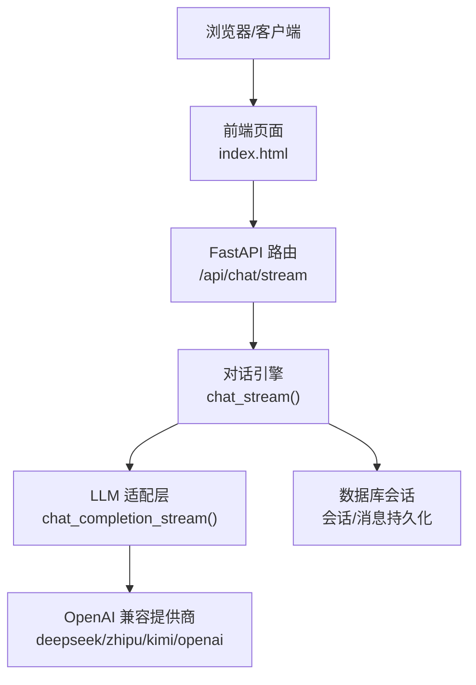
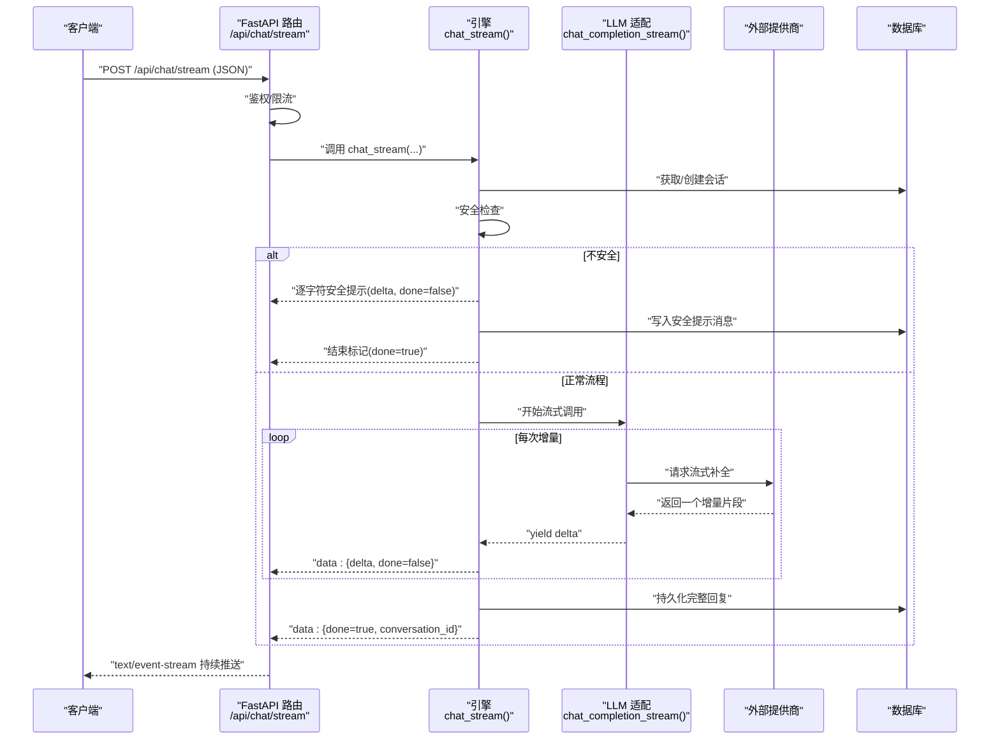
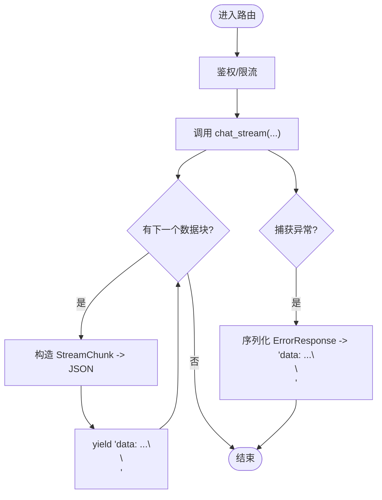
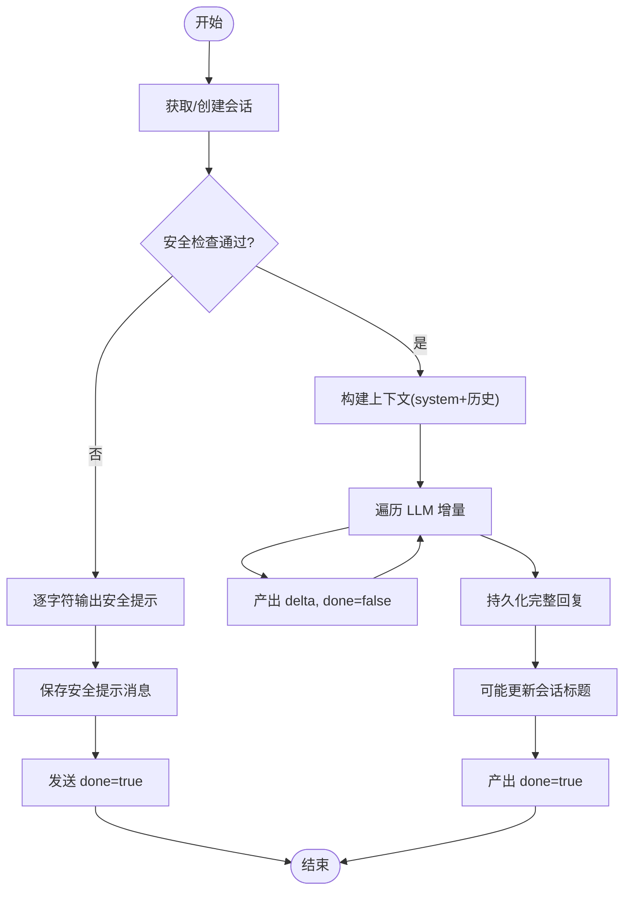
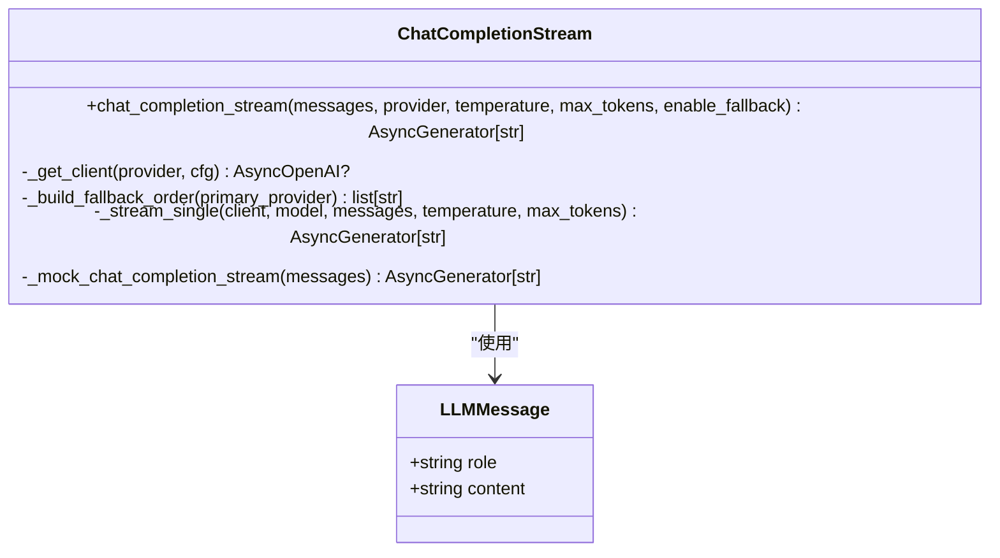
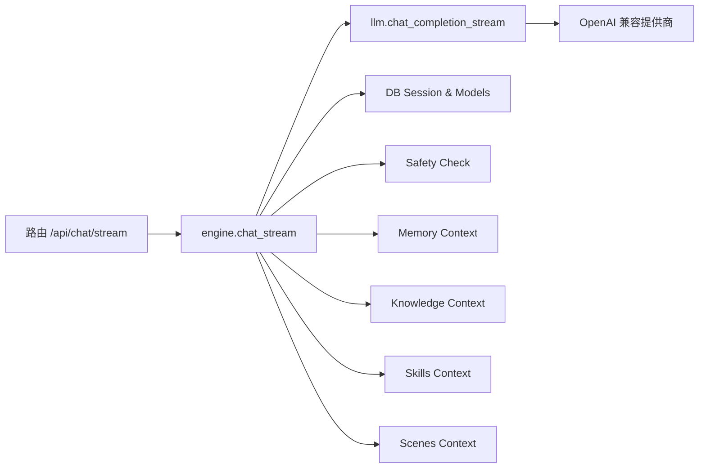

# 流式对话接口

<cite>
**本文引用的文件**   
- [hushai/meditation/api/chat.py](file://hushai/meditation/api/chat.py)
- [hushai/meditation/core/engine.py](file://hushai/meditation/core/engine.py)
- [hushai/meditation/core/llm.py](file://hushai/meditation/core/llm.py)
- [hushai/meditation/schemas.py](file://hushai/meditation/schemas.py)
- [hushai/meditation/static/index.html](file://hushai/meditation/static/index.html)
</cite>

## 目录
1. [简介](#简介)
2. [项目结构](#项目结构)
3. [核心组件](#核心组件)
4. [架构总览](#架构总览)
5. [详细组件分析](#详细组件分析)
6. [依赖关系分析](#依赖关系分析)
7. [性能与优化](#性能与优化)
8. [故障排查指南](#故障排查指南)
9. [结论](#结论)
10. [附录：请求/响应示例与客户端实现要点](#附录请求响应示例与客户端实现要点)

## 简介
本文件为 hush.ai 的“流式对话”功能提供完整 API 文档，重点说明 POST /api/chat/stream 端点的 Server-Sent Events（SSE）实现机制、流式数据结构 StreamChunk、事件类型与消息片段格式、完整响应序列，以及客户端连接、错误处理与重连策略。同时对比流式对话与普通对话的差异，解释异步生成器的工作原理与数据传输优化策略，并给出完整的请求/响应示例路径以便对照实际代码。

## 项目结构
与流式对话相关的后端路由、引擎编排、LLM 适配层与前端消费逻辑分布如下：
- 路由层：FastAPI 路由定义 SSE 端点，负责鉴权、限流、将引擎产生的数据块转换为 SSE 文本事件。
- 引擎层：编排会话上下文、安全检查、记忆提取、知识检索、调用 LLM 流式接口，并将增量内容以字典形式产出。
- LLM 适配层：封装多提供商的流式调用与自动降级，支持调试模式下的模拟流式输出。
- 前端：使用 fetch + ReadableStream 解析 SSE data: 行，实时拼接 delta，并在 done 时完成渲染与持久化。

图表来源
- [hushai/meditation/api/chat.py:80-104](file://hushai/meditation/api/chat.py#L80-L104)
- [hushai/meditation/core/engine.py:238-313](file://hushai/meditation/core/engine.py#L238-L313)
- [hushai/meditation/core/llm.py:208-257](file://hushai/meditation/core/llm.py#L208-L257)
- [hushai/meditation/static/index.html:1799-1891](file://hushai/meditation/static/index.html#L1799-L1891)

章节来源
- [hushai/meditation/api/chat.py:80-104](file://hushai/meditation/api/chat.py#L80-L104)
- [hushai/meditation/core/engine.py:238-313](file://hushai/meditation/core/engine.py#L238-L313)
- [hushai/meditation/core/llm.py:208-257](file://hushai/meditation/core/llm.py#L208-L257)
- [hushai/meditation/static/index.html:1799-1891](file://hushai/meditation/static/index.html#L1799-L1891)

## 核心组件
- 路由端点：POST /api/chat/stream
  - 职责：接收 ChatRequest，校验用户身份，调用 chat_stream 引擎，将每个数据块包装为 StreamChunk，并以 text/event-stream 返回。
  - 限流：每分钟 30 次。
- 引擎函数：chat_stream
  - 职责：创建或复用会话；进行安全拦截；组装系统提示词与历史；调用 LLM 流式接口；逐字产出增量；完成后持久化助手回复与标题；发送结束标记。
- LLM 适配：chat_completion_stream
  - 职责：按优先级选择提供商，失败自动降级；在调试模式下回退到模拟流式输出；对 OpenAIError 进行格式化抛出。
- 数据模型：StreamChunk
  - 字段：delta（增量文本）、done（是否结束）、conversation_id（可选，会话标识）。

章节来源
- [hushai/meditation/api/chat.py:80-104](file://hushai/meditation/api/chat.py#L80-L104)
- [hushai/meditation/core/engine.py:238-313](file://hushai/meditation/core/engine.py#L238-L313)
- [hushai/meditation/core/llm.py:208-257](file://hushai/meditation/core/llm.py#L208-L257)
- [hushai/meditation/schemas.py:244-247](file://hushai/meditation/schemas.py#L244-L247)

## 架构总览
下图展示了从客户端发起请求到最终收到结束事件的完整时序。

图表来源
- [hushai/meditation/api/chat.py:80-104](file://hushai/meditation/api/chat.py#L80-L104)
- [hushai/meditation/core/engine.py:238-313](file://hushai/meditation/core/engine.py#L238-L313)
- [hushai/meditation/core/llm.py:208-257](file://hushai/meditation/core/llm.py#L208-L257)

## 详细组件分析

### 路由层：POST /api/chat/stream
- 输入：ChatRequest（message、conversation_id、skill_ids、provider、scene_id、teacher_id）
- 鉴权：通过 Authorization: Bearer <token> 头验证用户身份
- 限流：30 次/分钟
- 输出：text/event-stream，每行以 data: 开头，内容为 JSON 字符串
- 异常：捕获 RuntimeError，将其序列化为 ErrorResponse 并通过 data: 事件返回

图表来源
- [hushai/meditation/api/chat.py:80-104](file://hushai/meditation/api/chat.py#L80-L104)

章节来源
- [hushai/meditation/api/chat.py:80-104](file://hushai/meditation/api/chat.py#L80-L104)

### 引擎层：chat_stream
- 会话管理：根据 user_id 和 conversation_id 获取或新建会话
- 安全检查：若检测到不安全内容，逐字符输出安全提示，随后结束
- 上下文构建：加载历史、记忆、知识、技能、场景等上下文，拼装 system prompt
- 流式生成：迭代 LLM 增量，累积全文并逐条产出 delta
- 收尾：持久化助手回复、可能更新会话标题、发送 done=true 结束事件
- 事务保障：finally 中未提交则回滚

图表来源
- [hushai/meditation/core/engine.py:238-313](file://hushai/meditation/core/engine.py#L238-L313)

章节来源
- [hushai/meditation/core/engine.py:238-313](file://hushai/meditation/core/engine.py#L238-L313)

### LLM 适配层：chat_completion_stream
- 提供商选择：优先使用配置的默认提供商，失败时按预设顺序降级
- 流式传输：内部 _stream_single 以 stream=True 调用外部接口，逐个 yield 增量
- 调试模式：若无可用 Key，走模拟流式输出
- 错误处理：OpenAIError 统一格式化后抛出，由上层捕获并转为 data: error 事件

图表来源
- [hushai/meditation/core/llm.py:208-257](file://hushai/meditation/core/llm.py#L208-L257)
- [hushai/meditation/core/llm.py:101-110](file://hushai/meditation/core/llm.py#L101-L110)
- [hushai/meditation/core/llm.py:181-206](file://hushai/meditation/core/llm.py#L181-L206)

章节来源
- [hushai/meditation/core/llm.py:208-257](file://hushai/meditation/core/llm.py#L208-L257)
- [hushai/meditation/core/llm.py:101-110](file://hushai/meditation/core/llm.py#L101-L110)
- [hushai/meditation/core/llm.py:181-206](file://hushai/meditation/core/llm.py#L181-L206)

### 数据模型：StreamChunk
- 字段说明
  - delta: string，本次增量文本片段
  - done: boolean，是否表示本次对话结束
  - conversation_id: string | null，会话 ID（结束时携带）
- 序列化：路由层使用 exclude_none=True，避免 None 值出现在 JSON 中

章节来源
- [hushai/meditation/schemas.py:244-247](file://hushai/meditation/schemas.py#L244-L247)
- [hushai/meditation/api/chat.py:98-99](file://hushai/meditation/api/chat.py#L98-L99)

### 前端消费：SSE 解析与实时渲染
- 使用 fetch 发起 POST，读取 response.body.getReader()
- 使用 TextDecoder 解码字节流，按换行拆分，识别 data: 前缀
- 解析 JSON：
  - 若包含 error 字段，显示错误并终止
  - 若包含 delta，追加到 fullText 并实时更新 UI
  - 若包含 done，记录 conversation_id 并结束
- 结束后进行 Markdown 渲染与朗读控制

章节来源
- [hushai/meditation/static/index.html:1799-1891](file://hushai/meditation/static/index.html#L1799-L1891)

## 依赖关系分析
- 路由依赖：
  - FastAPI 的 StreamingResponse、Depends、Header、limiter
  - 引擎 chat_stream、schemas.StreamChunk、ErrorResponse
- 引擎依赖：
  - LLM 适配 chat_completion_stream
  - 数据库会话工厂、模型 Conversation/Message
  - 安全、记忆、知识、技能、场景等上下文构建工具
- LLM 适配依赖：
  - OpenAI 客户端、配置中心、错误格式化

图表来源
- [hushai/meditation/api/chat.py:80-104](file://hushai/meditation/api/chat.py#L80-L104)
- [hushai/meditation/core/engine.py:238-313](file://hushai/meditation/core/engine.py#L238-L313)
- [hushai/meditation/core/llm.py:208-257](file://hushai/meditation/core/llm.py#L208-L257)

章节来源
- [hushai/meditation/api/chat.py:80-104](file://hushai/meditation/api/chat.py#L80-L104)
- [hushai/meditation/core/engine.py:238-313](file://hushai/meditation/core/engine.py#L238-L313)
- [hushai/meditation/core/llm.py:208-257](file://hushai/meditation/core/llm.py#L208-L257)

## 性能与优化
- 首字节延迟低：采用 SSE 增量推送，无需等待整段回复完成即可展示
- 网络开销小：仅传输增量片段，减少一次性大响应体
- 服务端并发友好：异步生成器与异步 I/O 结合，提高吞吐
- 容错与降级：LLM 提供商失败自动切换，提升可用性
- 前端缓冲与分片：基于换行符的分片解析，避免长行导致的内存压力
- 建议
  - 合理设置 max_tokens 与温度参数，平衡质量与速度
  - 前端对滚动位置与渲染频率做节流，避免频繁 DOM 操作
  - 对长时间无响应的情况增加超时与重试

[本节为通用指导，不直接分析具体文件]

## 故障排查指南
- 401 未授权
  - 检查 Authorization: Bearer <token> 是否正确传递
  - 前端在 401 时尝试刷新 token 并重试
- 网络中断或连接丢失
  - 前端需检测 reader.read() 提前结束，触发重连逻辑
- 服务端异常
  - 服务端捕获 RuntimeError，返回 data: {"error": "..."}，前端应显示错误信息
- 提供商不可用
  - 查看日志中的降级信息；确认各提供商 API Key 与 base_url 配置正确
- 流式数据不完整
  - 确保前端正确处理跨行缓冲，最后剩余 buffer 也要解析

章节来源
- [hushai/meditation/api/chat.py:100-102](file://hushai/meditation/api/chat.py#L100-L102)
- [hushai/meditation/core/llm.py:236-245](file://hushai/meditation/core/llm.py#L236-L245)
- [hushai/meditation/static/index.html:1823-1842](file://hushai/meditation/static/index.html#L1823-L1842)

## 结论
POST /api/chat/stream 通过 FastAPI 的 StreamingResponse 与 Python 异步生成器实现了高效的 SSE 流式对话。引擎层保证会话一致性、安全拦截与上下文增强，LLM 适配层提供多提供商与自动降级能力。前端以轻量方式解析 data: 事件，实现即时渲染与良好用户体验。相比普通对话，流式方案显著降低首屏延迟、提升交互流畅度，适用于聊天机器人、智能助手、在线辅导等场景。

[本节为总结性内容，不直接分析具体文件]

## 附录：请求/响应示例与客户端实现要点

### 请求示例
- 方法：POST
- 路径：/api/chat/stream
- 头部：
  - Content-Type: application/json
  - Authorization: Bearer <access_token>
- 请求体（JSON）：
  - message: string，必填
  - conversation_id: string | null，可选
  - skill_ids: string[]，可选
  - provider: string，可选
  - scene_id: string，可选
  - teacher_id: string，可选

章节来源
- [hushai/meditation/schemas.py:24-31](file://hushai/meditation/schemas.py#L24-L31)
- [hushai/meditation/api/chat.py:80-86](file://hushai/meditation/api/chat.py#L80-L86)

### 响应示例（SSE）
- 内容类型：text/event-stream
- 事件格式：每行以 data: 开头，值为 JSON 字符串
- 事件类型与字段：
  - 增量事件：{ "delta": "<片段>", "done": false, "conversation_id": "<id>" }
  - 结束事件：{ "done": true, "conversation_id": "<id>" }
  - 错误事件：{ "error": "<错误描述>" }

章节来源
- [hushai/meditation/api/chat.py:98-102](file://hushai/meditation/api/chat.py#L98-L102)
- [hushai/meditation/schemas.py:244-247](file://hushai/meditation/schemas.py#L244-L247)

### 客户端连接与处理要点
- 建立连接：fetch(endpoint, { method: "POST", headers: {...}, body: JSON.stringify(payload) })
- 读取流：response.body.getReader() + TextDecoder
- 解析规则：
  - 按换行拆分，识别 data: 前缀
  - 解析 JSON：
    - 存在 error：显示错误并停止
    - 存在 delta：追加到全文并更新 UI
    - 存在 done：记录 conversation_id 并结束
- 错误与重连：
  - 401：刷新 token 后重试
  - 网络异常：捕获异常并提示用户
  - 连接断开：检测 reader.done 后触发重连

章节来源
- [hushai/meditation/static/index.html:1799-1891](file://hushai/meditation/static/index.html#L1799-L1891)

### 流式对话 vs 普通对话
- 普通对话（POST /api/chat/）
  - 一次性返回完整回复，适合短文本或对实时性要求不高的场景
- 流式对话（POST /api/chat/stream）
  - 增量推送，首字节延迟更低，适合长文本、交互式体验
  - 需要客户端具备 SSE 解析与增量渲染能力

章节来源
- [hushai/meditation/api/chat.py:58-77](file://hushai/meditation/api/chat.py#L58-L77)
- [hushai/meditation/api/chat.py:80-104](file://hushai/meditation/api/chat.py#L80-L104)

### 异步生成器工作原理与数据传输优化
- 引擎 chat_stream 作为异步生成器，逐步产出 dict 数据块
- 路由层将每个数据块序列化为 StreamChunk JSON，并以 SSE 格式发出
- LLM 适配层以流式方式从外部提供商拉取增量，避免整段缓存
- 前端按行解析 data: 事件，增量拼接，减少内存占用与渲染抖动

章节来源
- [hushai/meditation/core/engine.py:238-313](file://hushai/meditation/core/engine.py#L238-L313)
- [hushai/meditation/api/chat.py:87-104](file://hushai/meditation/api/chat.py#L87-L104)
- [hushai/meditation/core/llm.py:208-257](file://hushai/meditation/core/llm.py#L208-L257)