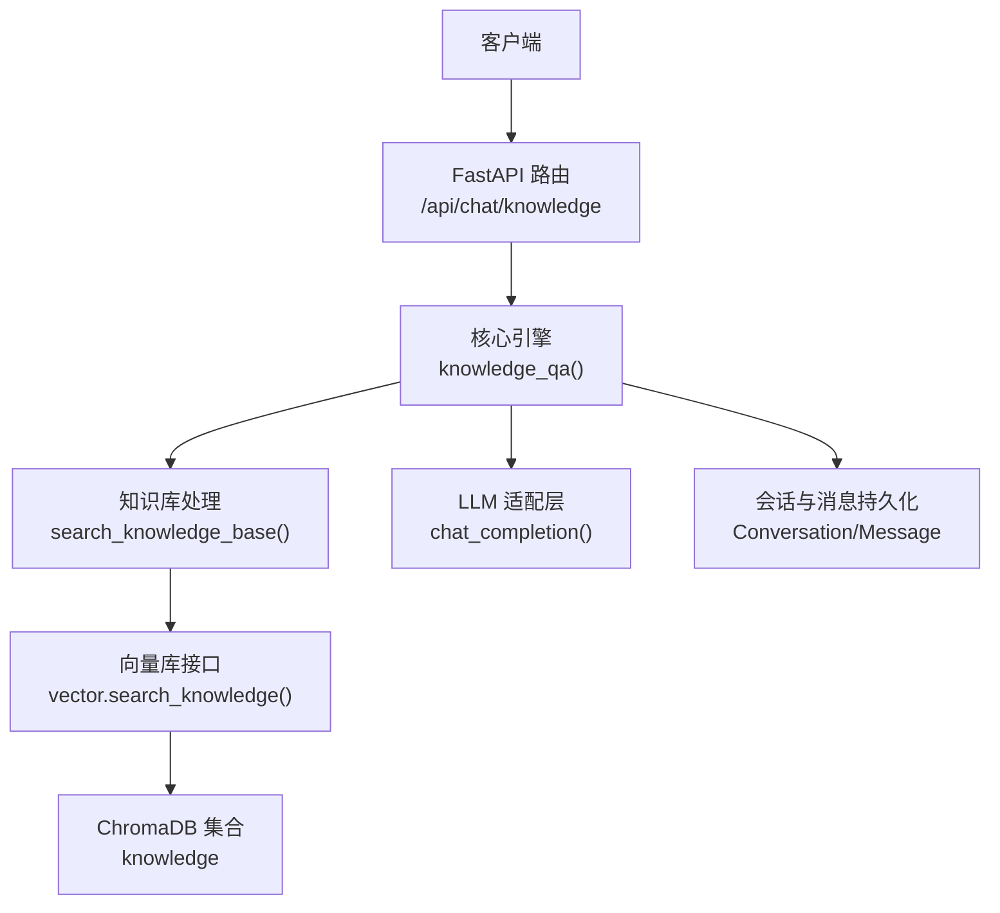
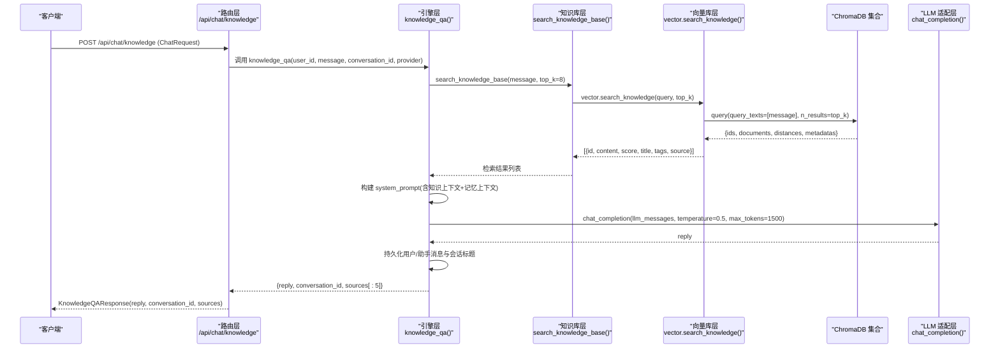
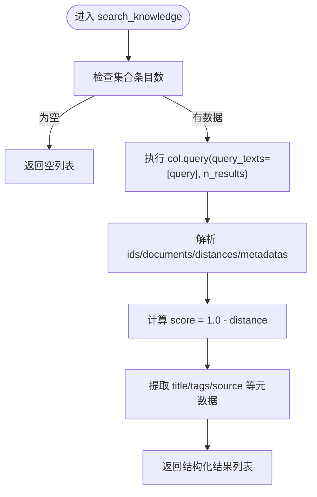
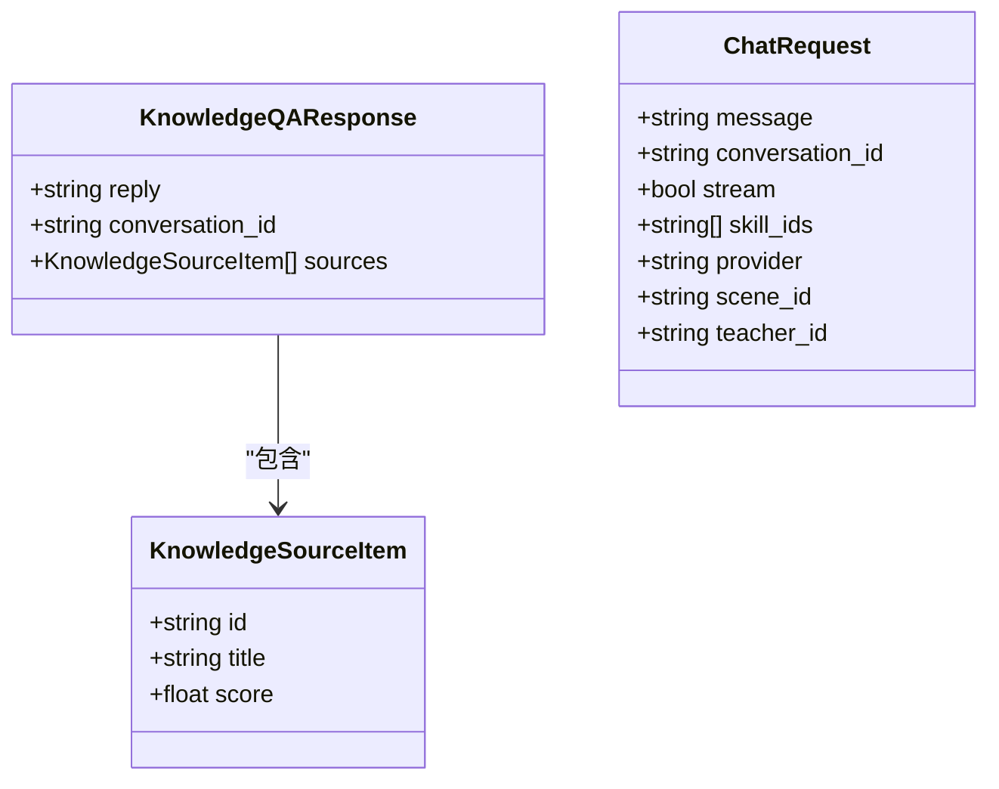
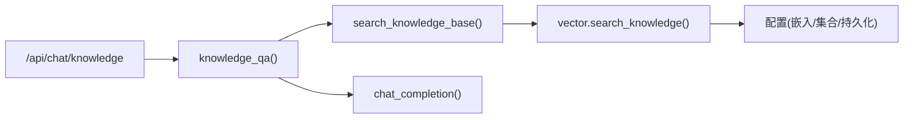

# 知识库问答接口

<cite>
**本文引用的文件**   
- [hushai/meditation/api/chat.py](file://hushai/meditation/api/chat.py)
- [hushai/meditation/core/engine.py](file://hushai/meditation/core/engine.py)
- [hushai/meditation/core/knowledge.py](file://hushai/meditation/core/knowledge.py)
- [hushai/meditation/db/vector.py](file://hushai/meditation/db/vector.py)
- [hushai/meditation/schemas.py](file://hushai/meditation/schemas.py)
- [README.md](file://README.md)
</cite>

## 目录
1. [简介](#简介)
2. [项目结构](#项目结构)
3. [核心组件](#核心组件)
4. [架构总览](#架构总览)
5. [详细组件分析](#详细组件分析)
6. [依赖关系分析](#依赖关系分析)
7. [性能与调优建议](#性能与调优建议)
8. [错误处理与调试指南](#错误处理与调试指南)
9. [结论](#结论)
10. [附录：请求与响应规范](#附录请求与响应规范)

## 简介
本文件为 hush.ai 的“知识库问答”能力提供面向开发者的 API 文档，重点说明 POST /api/chat/knowledge 端点的 RAG（检索增强生成）实现。内容涵盖：
- 知识检索流程：向量数据库查询、语义匹配算法、相关性排序机制
- 请求参数与响应结构 KnowledgeQAResponse，包括引用来源标注与置信度评分
- 完整使用示例与高质量提问建议
- 与通用对话接口的差异、适用场景与性能特点
- 错误处理策略与调试方法

## 项目结构
与知识库问答相关的代码主要分布在以下模块：
- API 路由层：定义 /api/chat/knowledge 端点，鉴权与限流
- 核心编排层：RAG 流程编排（检索、提示词构建、LLM 调用、结果持久化）
- 知识库处理层：文本分块、导入入库、上下文组装
- 向量数据库层：ChromaDB 集合管理、嵌入函数选择、相似度检索
- 数据模型与 Schema：Pydantic 请求/响应模型定义

图示来源
- [hushai/meditation/api/chat.py:107-127](file://hushai/meditation/api/chat.py#L107-L127)
- [hushai/meditation/core/engine.py:316-387](file://hushai/meditation/core/engine.py#L316-L387)
- [hushai/meditation/core/knowledge.py:207-214](file://hushai/meditation/core/knowledge.py#L207-L214)
- [hushai/meditation/db/vector.py:104-127](file://hushai/meditation/db/vector.py#L104-L127)

章节来源
- [README.md:136-178](file://README.md#L136-L178)

## 核心组件
- 路由层：POST /api/chat/knowledge，复用 ChatRequest 作为入参，返回 KnowledgeQAResponse
- 引擎层：knowledge_qa() 负责检索、构造系统提示词、调用 LLM、持久化对话并返回 sources
- 知识库层：search_knowledge_base() 封装 top_k 配置，委托向量库检索
- 向量库层：ChromaDB 集合 knowledge，默认余弦空间；支持 OpenAI 嵌入或本地默认嵌入
- Schema 层：KnowledgeQAResponse、KnowledgeSourceItem 等 Pydantic 模型

章节来源
- [hushai/meditation/api/chat.py:107-127](file://hushai/meditation/api/chat.py#L107-L127)
- [hushai/meditation/core/engine.py:316-387](file://hushai/meditation/core/engine.py#L316-L387)
- [hushai/meditation/core/knowledge.py:207-214](file://hushai/meditation/core/knowledge.py#L207-L214)
- [hushai/meditation/db/vector.py:61-68](file://hushai/meditation/db/vector.py#L61-L68)
- [hushai/meditation/schemas.py:59-69](file://hushai/meditation/schemas.py#L59-L69)

## 架构总览
下图展示了从客户端发起知识库问答到最终返回答案与来源的完整链路。

图示来源
- [hushai/meditation/api/chat.py:107-127](file://hushai/meditation/api/chat.py#L107-L127)
- [hushai/meditation/core/engine.py:316-387](file://hushai/meditation/core/engine.py#L316-L387)
- [hushai/meditation/core/knowledge.py:207-214](file://hushai/meditation/core/knowledge.py#L207-L214)
- [hushai/meditation/db/vector.py:104-127](file://hushai/meditation/db/vector.py#L104-L127)

## 详细组件分析

### 端点：POST /api/chat/knowledge
- 路径与方法：/api/chat/knowledge，POST
- 鉴权：需要 Authorization: Bearer <token>
- 限流：30 次/分钟
- 请求体：复用 ChatRequest（message、conversation_id、provider 等）
- 响应体：KnowledgeQAResponse（reply、conversation_id、sources）

章节来源
- [hushai/meditation/api/chat.py:107-127](file://hushai/meditation/api/chat.py#L107-L127)
- [hushai/meditation/schemas.py:24-32](file://hushai/meditation/schemas.py#L24-L32)
- [hushai/meditation/schemas.py:59-69](file://hushai/meditation/schemas.py#L59-L69)

### 引擎：knowledge_qa()
- 会话管理：获取或创建 Conversation，写入用户消息
- 知识检索：调用 search_knowledge_base(message, top_k=8)，拼接知识上下文
- 记忆上下文：get_memory_context_for_prompt(session, user_id, message)
- 提示词构建：build_knowledge_qa_prompt(knowledge_context, memory_context)
- LLM 调用：chat_completion(llm_messages, temperature=0.5, max_tokens=1500)
- 结果持久化：写入助手消息，必要时设置会话标题
- 返回 sources：取前 5 条检索结果，包含 id、title、score（保留三位小数）

章节来源
- [hushai/meditation/core/engine.py:316-387](file://hushai/meditation/core/engine.py#L316-L387)
- [hushai/meditation/core/knowledge.py:207-214](file://hushai/meditation/core/knowledge.py#L207-L214)

### 知识库处理：search_knowledge_base()
- 读取配置 knowledge_top_k（若未显式传入 top_k）
- 委托 vector.search_knowledge(query, top_k)

章节来源
- [hushai/meditation/core/knowledge.py:207-214](file://hushai/meditation/core/knowledge.py#L207-L214)

### 向量库：ChromaDB 集合与检索
- 集合名称：knowledge
- 相似度度量：cosine（hnsw:space=cosine）
- 嵌入函数：优先 OpenAIEmbeddingFunction（可自定义 base_url/model），否则回退 DefaultEmbeddingFunction
- 检索逻辑：col.query(query_texts=[query], n_results=min(top_k, count))
- 距离转分数：score = 1.0 - distance（越大越相关）
- 元数据：title、tags、source、parent_id 等

图示来源
- [hushai/meditation/db/vector.py:104-127](file://hushai/meditation/db/vector.py#L104-L127)
- [hushai/meditation/db/vector.py:61-68](file://hushai/meditation/db/vector.py#L61-L68)
- [hushai/meditation/db/vector.py:43-58](file://hushai/meditation/db/vector.py#L43-L58)

章节来源
- [hushai/meditation/db/vector.py:104-127](file://hushai/meditation/db/vector.py#L104-L127)

### 数据模型与 Schema
- KnowledgeQAResponse：包含 reply、conversation_id、sources
- KnowledgeSourceItem：包含 id、title、score
- ChatRequest：message、conversation_id、stream、skill_ids、provider、scene_id、teacher_id

图示来源
- [hushai/meditation/schemas.py:59-69](file://hushai/meditation/schemas.py#L59-L69)
- [hushai/meditation/schemas.py:24-32](file://hushai/meditation/schemas.py#L24-L32)

章节来源
- [hushai/meditation/schemas.py:59-69](file://hushai/meditation/schemas.py#L59-L69)
- [hushai/meditation/schemas.py:24-32](file://hushai/meditation/schemas.py#L24-L32)

## 依赖关系分析
- 路由层依赖引擎层进行业务编排
- 引擎层依赖知识库处理与 LLM 适配层
- 知识库处理层依赖向量库接口
- 向量库层依赖配置（嵌入提供商、模型、base_url、持久化目录）

图示来源
- [hushai/meditation/api/chat.py:107-127](file://hushai/meditation/api/chat.py#L107-L127)
- [hushai/meditation/core/engine.py:316-387](file://hushai/meditation/core/engine.py#L316-L387)
- [hushai/meditation/core/knowledge.py:207-214](file://hushai/meditation/core/knowledge.py#L207-L214)
- [hushai/meditation/db/vector.py:104-127](file://hushai/meditation/db/vector.py#L104-L127)

章节来源
- [hushai/meditation/api/chat.py:107-127](file://hushai/meditation/api/chat.py#L107-L127)
- [hushai/meditation/core/engine.py:316-387](file://hushai/meditation/core/engine.py#L316-L387)
- [hushai/meditation/core/knowledge.py:207-214](file://hushai/meditation/core/knowledge.py#L207-L214)
- [hushai/meditation/db/vector.py:104-127](file://hushai/meditation/db/vector.py#L104-L127)

## 性能与调优建议
- 检索数量 top_k：引擎层固定为 8，可根据业务调整；过大增加 LLM 输入长度与延迟
- 相似度度量：余弦空间适合语义匹配；确保嵌入模型与语料风格一致
- 嵌入提供商：OpenAI 嵌入可获得更稳定语义表示；也可切换至本地默认嵌入以降低成本
- 分块策略：知识库导入时按段落切分并重叠，有助于提高召回质量
- 限流保护：30 次/分钟，避免突发流量导致 LLM 或向量库过载
- 缓存与预热：对高频问题可考虑应用层缓存答案与来源，降低重复检索与 LLM 调用开销

[本节为通用指导，不直接分析具体文件]

## 错误处理与调试指南
- 鉴权失败：缺少或无效 Authorization 头将返回 401
- 服务异常：内部错误统一包装为 500，detail 字段携带异常信息
- 调试建议：
  - 确认已正确登录并获得有效 token
  - 检查知识库是否已导入且集合非空（否则检索结果为空）
  - 查看日志中检索结果与 LLM 调用参数，确认 temperature、max_tokens 是否符合预期
  - 通过 /debug 访问自动生成的 API 文档进行在线测试

章节来源
- [hushai/meditation/api/chat.py:107-127](file://hushai/meditation/api/chat.py#L107-L127)
- [README.md:269-274](file://README.md#L269-L274)

## 结论
POST /api/chat/knowledge 提供了基于 RAG 的知识问答能力：先通过向量检索召回相关知识片段，再结合记忆上下文构建提示词，最后由 LLM 生成回答并附带来源与置信度评分。该接口适用于需要权威依据与可追溯性的专业问答场景，相比通用对话接口具备更强的可解释性与准确性。

[本节为总结性内容，不直接分析具体文件]

## 附录：请求与响应规范

### 请求
- 方法：POST
- 路径：/api/chat/knowledge
- 头部：Authorization: Bearer <token>
- 请求体（JSON）：
  - message: string，必填，最大长度受限于 ChatRequest 校验
  - conversation_id: string，可选，用于延续历史
  - provider: string，可选，指定 LLM 提供商
  - 其他字段（如 stream、skill_ids、scene_id、teacher_id）可按需传递，但仅 message/conversation_id/provider 在知识库问答中生效

章节来源
- [hushai/meditation/api/chat.py:107-127](file://hushai/meditation/api/chat.py#L107-L127)
- [hushai/meditation/schemas.py:24-32](file://hushai/meditation/schemas.py#L24-L32)

### 响应
- 状态码：200 成功；401 鉴权失败；500 服务异常
- 响应体（JSON）：
  - reply: string，LLM 生成的回答
  - conversation_id: string，会话标识
  - sources: list，最多 5 条来源，每条包含：
    - id: string，知识片段 ID
    - title: string，知识片段标题（可能为空）
    - score: number，置信度评分（1.0 - cosine_distance，保留三位小数）

章节来源
- [hushai/meditation/core/engine.py:372-383](file://hushai/meditation/core/engine.py#L372-L383)
- [hushai/meditation/schemas.py:59-69](file://hushai/meditation/schemas.py#L59-L69)

### 使用示例（步骤）
- 准备 token：通过认证接口获取 access_token
- 构造请求：
  - 设置 Authorization: Bearer <access_token>
  - 发送 JSON 体，包含 message 与可选 conversation_id、provider
- 解析响应：
  - 展示 reply 给用户
  - 展示 sources 中的 title 与 score，便于溯源与可信度评估

[本节为概念性示例，不直接分析具体文件]

### 与通用对话接口的区别
- 适用场景：
  - 知识库问答：强调权威依据、可追溯性，适合专业领域问答
  - 通用对话：侧重自然交互、创意与情感陪伴
- 行为差异：
  - 知识库问答会检索知识片段并注入系统提示词，temperature 较低（0.5），max_tokens 较大（1500）
  - 通用对话会综合记忆、技能、场景等多维上下文，temperature 较高（0.7），max_tokens 较小（1024）
- 性能特点：
  - 知识库问答多一次向量检索，但能显著提升答案准确性与可解释性
  - 通用对话更注重流畅性与多样性

章节来源
- [hushai/meditation/core/engine.py:316-387](file://hushai/meditation/core/engine.py#L316-L387)
- [hushai/meditation/core/engine.py:166-236](file://hushai/meditation/core/engine.py#L166-L236)