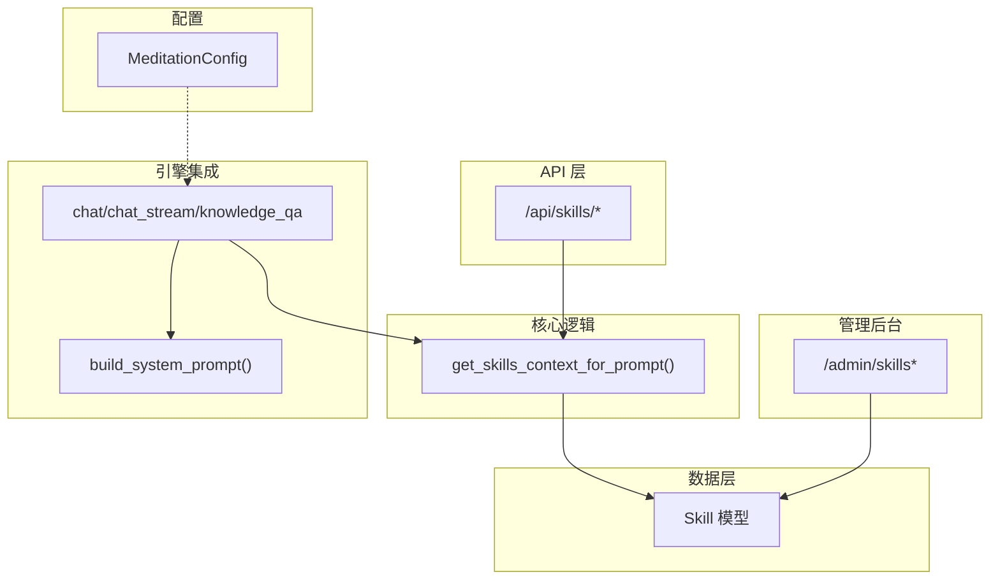
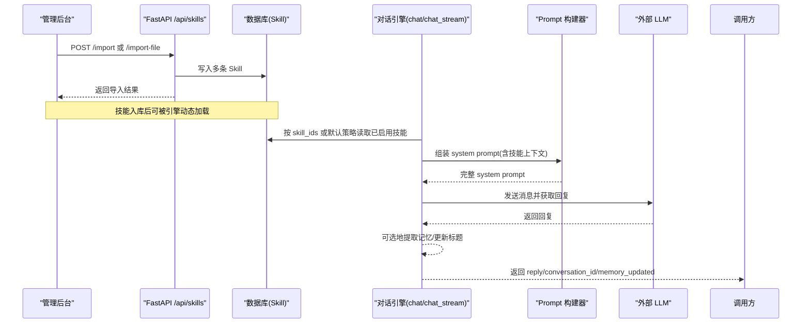
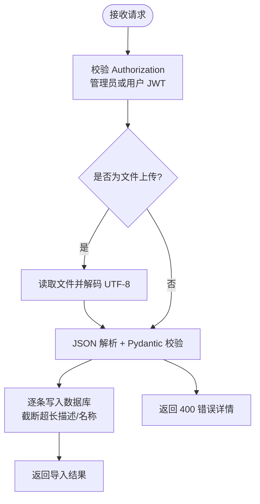
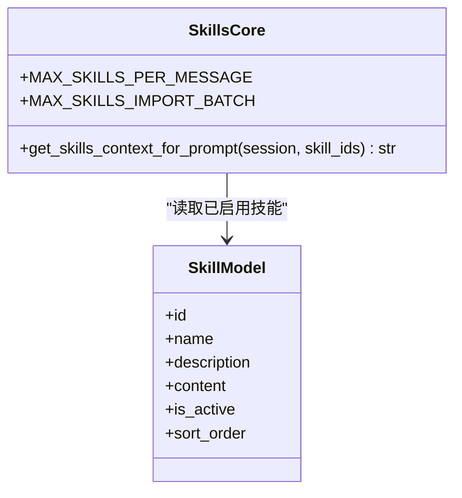
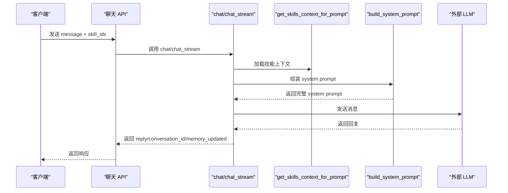
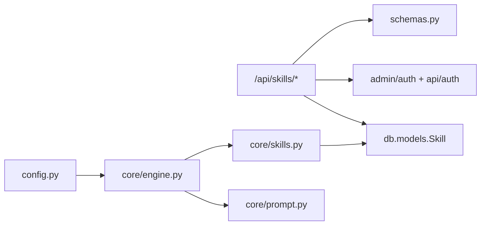

# 技能插件接口

<cite>
**本文引用的文件**
- [hushai/meditation/api/skills.py](file://hushai/meditation/api/skills.py)
- [hushai/meditation/core/skills.py](file://hushai/meditation/core/skills.py)
- [hushai/meditation/admin/pages/skills.py](file://hushai/meditation/admin/pages/skills.py)
- [hushai/meditation/db/models.py](file://hushai/meditation/db/models.py)
- [hushai/meditation/schemas.py](file://hushai/meditation/schemas.py)
- [hushai/meditation/core/engine.py](file://hushai/meditation/core/engine.py)
- [hushai/meditation/core/prompt.py](file://hushai/meditation/core/prompt.py)
- [hushai/meditation/config.py](file://hushai/meditation/config.py)
- [knowledge/open-cognition/templates/skill-template.md](file://knowledge/open-cognition/templates/skill-template.md)
</cite>

## 目录
1. [简介](#简介)
2. [项目结构](#项目结构)
3. [核心组件](#核心组件)
4. [架构总览](#架构总览)
5. [详细组件分析](#详细组件分析)
6. [依赖关系分析](#依赖关系分析)
7. [性能与容量限制](#性能与容量限制)
8. [故障排查指南](#故障排查指南)
9. [结论](#结论)
10. [附录：请求/响应示例与开发规范](#附录请求响应示例与开发规范)

## 简介
本文件为 hush.ai 的“技能插件系统”提供面向管理端与运行时的 API 文档，覆盖技能的动态加载、批量导入、效果评估（通过对话上下文注入）、执行引擎集成、参数传递与结果聚合等。同时给出 SKILL.md 规范解析要点、插件生命周期管理、依赖关系处理的最佳实践，以及完整的请求/响应示例与排障建议。

## 项目结构
围绕“技能”的核心代码分布在以下模块：
- API 层：对外暴露技能列表与批量导入接口
- 核心逻辑：按 ID 或全局加载已启用技能文本，拼入系统提示
- 管理后台：Web 页面与表单用于增删改查
- 数据模型：持久化存储技能元信息与正文
- 模式定义：Pydantic 校验与序列化
- 引擎集成：在对话流程中组装系统提示并调用 LLM
- 配置：环境变量驱动运行时行为

图示来源
- [hushai/meditation/api/skills.py:1-113](file://hushai/meditation/api/skills.py#L1-L113)
- [hushai/meditation/core/skills.py:1-59](file://hushai/meditation/core/skills.py#L1-L59)
- [hushai/meditation/admin/pages/skills.py:1-218](file://hushai/meditation/admin/pages/skills.py#L1-L218)
- [hushai/meditation/db/models.py:120-135](file://hushai/meditation/db/models.py#L120-L135)
- [hushai/meditation/core/engine.py:91-127](file://hushai/meditation/core/engine.py#L91-L127)
- [hushai/meditation/core/prompt.py:77-103](file://hushai/meditation/core/prompt.py#L77-L103)
- [hushai/meditation/config.py:18-52](file://hushai/meditation/config.py#L18-L52)

章节来源
- [hushai/meditation/api/skills.py:1-113](file://hushai/meditation/api/skills.py#L1-L113)
- [hushai/meditation/core/skills.py:1-59](file://hushai/meditation/core/skills.py#L1-L59)
- [hushai/meditation/admin/pages/skills.py:1-218](file://hushai/meditation/admin/pages/skills.py#L1-L218)
- [hushai/meditation/db/models.py:120-135](file://hushai/meditation/db/models.py#L120-L135)
- [hushai/meditation/core/engine.py:91-127](file://hushai/meditation/core/engine.py#L91-L127)
- [hushai/meditation/core/prompt.py:77-103](file://hushai/meditation/core/prompt.py#L77-L103)
- [hushai/meditation/config.py:18-52](file://hushai/meditation/config.py#L18-L52)

## 核心组件
- 技能数据模型 Skill：包含 id、name、description、content、is_active、sort_order、时间戳等字段，用于持久化存储技能元信息与正文。
- 技能 API：提供列出活跃技能、批量导入（JSON 与文件上传）等能力；支持管理员 JWT 与普通用户 JWT 两种认证路径。
- 技能上下文构建：根据传入 skill_ids 或默认策略，从数据库加载已启用的技能内容，拼接为系统提示的一部分。
- 引擎集成：在 chat/chat_stream/knowledge_qa 流程中，将技能上下文与其他上下文（记忆、知识库、场景、教师风格）组合后发送给 LLM。
- 管理后台：提供 Web 页面的创建、编辑、删除与分页查询功能。

章节来源
- [hushai/meditation/db/models.py:120-135](file://hushai/meditation/db/models.py#L120-L135)
- [hushai/meditation/api/skills.py:25-113](file://hushai/meditation/api/skills.py#L25-L113)
- [hushai/meditation/core/skills.py:10-59](file://hushai/meditation/core/skills.py#L10-L59)
- [hushai/meditation/core/engine.py:91-127](file://hushai/meditation/core/engine.py#L91-L127)
- [hushai/meditation/admin/pages/skills.py:17-218](file://hushai/meditation/admin/pages/skills.py#L17-L218)

## 架构总览
技能系统在运行时作为“可插拔的系统提示片段”，由引擎在每次对话轮次前动态装配。管理端负责维护技能条目，API 提供批量导入能力，前端可通过会话参数选择特定技能集合参与本次对话。

图示来源
- [hushai/meditation/api/skills.py:61-113](file://hushai/meditation/api/skills.py#L61-L113)
- [hushai/meditation/core/skills.py:14-59](file://hushai/meditation/core/skills.py#L14-L59)
- [hushai/meditation/core/engine.py:91-127](file://hushai/meditation/core/engine.py#L91-L127)
- [hushai/meditation/core/prompt.py:77-103](file://hushai/meditation/core/prompt.py#L77-L103)

## 详细组件分析

### 组件一：技能管理 API（列表与批量导入）
- GET /api/skills/
  - 作用：列出所有已启用的技能（仅公开摘要信息）。
  - 认证：无需鉴权（公开只读）。
  - 响应：包含 id、name、description 的技能列表。
- POST /api/skills/import
  - 作用：批量导入技能（JSON body）。
  - 认证：需要 Authorization 头，支持管理员 JWT 或普通用户 JWT。
  - 请求体：支持顶层数组或 {skills:[...]} 两种格式；每条包含 name、description、content、sort_order、is_active。
  - 响应：返回导入数量与新增项的 id/name。
- POST /api/skills/import-file
  - 作用：通过 multipart/form-data 上传 JSON 文件进行批量导入。
  - 认证：同上。
  - 错误：JSON 解析失败或数据格式无效时返回 400。

图示来源
- [hushai/meditation/api/skills.py:28-45](file://hushai/meditation/api/skills.py#L28-L45)
- [hushai/meditation/api/skills.py:61-113](file://hushai/meditation/api/skills.py#L61-L113)
- [hushai/meditation/schemas.py:172-218](file://hushai/meditation/schemas.py#L172-L218)

章节来源
- [hushai/meditation/api/skills.py:47-113](file://hushai/meditation/api/skills.py#L47-L113)
- [hushai/meditation/schemas.py:162-218](file://hushai/meditation/schemas.py#L162-L218)

### 组件二：技能上下文加载与提示注入
- get_skills_context_for_prompt(session, skill_ids)
  - 若传入 skill_ids：去重并按顺序取最多 MAX_SKILLS_PER_MESSAGE 个已启用技能。
  - 若未传：默认取全部已启用技能，上限同样受 MAX_SKILLS_PER_MESSAGE 约束。
  - 输出：以“## 名称\n正文”形式拼接的多段文本，供系统提示使用。
- 常量
  - MAX_SKILLS_PER_MESSAGE：每轮对话最大技能数。
  - MAX_SKILLS_IMPORT_BATCH：批量导入最大条目数。

图示来源
- [hushai/meditation/core/skills.py:10-59](file://hushai/meditation/core/skills.py#L10-L59)
- [hushai/meditation/db/models.py:120-135](file://hushai/meditation/db/models.py#L120-L135)

章节来源
- [hushai/meditation/core/skills.py:10-59](file://hushai/meditation/core/skills.py#L10-L59)
- [hushai/meditation/db/models.py:120-135](file://hushai/meditation/db/models.py#L120-L135)

### 组件三：引擎集成与参数传递
- chat / chat_stream / knowledge_qa
  - 在准备每轮上下文时，调用 get_skills_context_for_prompt 获取技能上下文。
  - 将技能上下文与其他上下文（记忆、知识库、场景、教师风格）合并到 system prompt。
  - 最终调用 LLM 完成对话生成。
- ChatRequest 中的 skill_ids
  - 客户端可在聊天请求中指定 skill_ids，实现“按需加持”。
  - 服务端会去重并限制最大数量。

图示来源
- [hushai/meditation/core/engine.py:91-127](file://hushai/meditation/core/engine.py#L91-L127)
- [hushai/meditation/core/skills.py:14-59](file://hushai/meditation/core/skills.py#L14-L59)
- [hushai/meditation/core/prompt.py:77-103](file://hushai/meditation/core/prompt.py#L77-L103)
- [hushai/meditation/schemas.py:24-51](file://hushai/meditation/schemas.py#L24-L51)

章节来源
- [hushai/meditation/core/engine.py:166-236](file://hushai/meditation/core/engine.py#L166-L236)
- [hushai/meditation/core/engine.py:238-314](file://hushai/meditation/core/engine.py#L238-L314)
- [hushai/meditation/core/engine.py:316-387](file://hushai/meditation/core/engine.py#L316-L387)
- [hushai/meditation/schemas.py:24-51](file://hushai/meditation/schemas.py#L24-L51)

### 组件四：管理后台（Web 页面）
- 页面路由
  - /admin/skills-import：批量导入页面入口
  - /admin/skills：分页列表（支持搜索）
  - /admin/skills/new：新建表单
  - /admin/skills/{skill_id}/edit：编辑表单
  - DELETE /api/skills/{skill_id}：删除技能
- 权限控制：需管理员登录，否则重定向至登录页。
- 数据校验：名称与正文必填，长度与空值校验。

章节来源
- [hushai/meditation/admin/pages/skills.py:17-218](file://hushai/meditation/admin/pages/skills.py#L17-L218)

### 组件五：SKILL.md 规范与解析要点
- 模板位置：knowledge/open-cognition/templates/skill-template.md
- 关键要素
  - YAML frontmatter：name、description、domain、linked_thinker、linked_concepts、tags
  - 明确“何时使用/何时不使用”
  - 提供完整示例与反例
  - 关联理论条目与思想家
- 解析说明
  - 当前运行时不直接解析 SKILL.md 文件，而是通过管理端或批量导入将 content 存入数据库。
  - 建议在导入前依据模板规范化内容，确保质量与一致性。

章节来源
- [knowledge/open-cognition/templates/skill-template.md:1-76](file://knowledge/open-cognition/templates/skill-template.md#L1-L76)

## 依赖关系分析
- API 层依赖
  - FastAPI Router、SQLAlchemy 异步会话、认证依赖（管理员/用户 JWT）
  - Pydantic 模型用于请求/响应校验
- 核心逻辑依赖
  - SQLAlchemy 查询 Skill 表，按 is_active 过滤与排序
- 引擎集成依赖
  - 调用 skills 上下文构建函数，再交由 prompt 构建器整合
- 配置依赖
  - 运行时行为（如对话轮次上限等）来自 MeditationConfig

图示来源
- [hushai/meditation/api/skills.py:1-24](file://hushai/meditation/api/skills.py#L1-L24)
- [hushai/meditation/core/skills.py:1-12](file://hushai/meditation/core/skills.py#L1-L12)
- [hushai/meditation/core/engine.py:1-31](file://hushai/meditation/core/engine.py#L1-L31)
- [hushai/meditation/core/prompt.py:1-24](file://hushai/meditation/core/prompt.py#L1-L24)
- [hushai/meditation/config.py:18-52](file://hushai/meditation/config.py#L18-L52)

章节来源
- [hushai/meditation/api/skills.py:1-24](file://hushai/meditation/api/skills.py#L1-L24)
- [hushai/meditation/core/skills.py:1-12](file://hushai/meditation/core/skills.py#L1-L12)
- [hushai/meditation/core/engine.py:1-31](file://hushai/meditation/core/engine.py#L1-L31)
- [hushai/meditation/core/prompt.py:1-24](file://hushai/meditation/core/prompt.py#L1-L24)
- [hushai/meditation/config.py:18-52](file://hushai/meditation/config.py#L18-L52)

## 性能与容量限制
- 每轮对话最大技能数：MAX_SKILLS_PER_MESSAGE（默认 8），避免过长系统提示影响延迟与成本。
- 批量导入上限：MAX_SKILLS_IMPORT_BATCH（默认 100），防止单次写入过大。
- 描述字段长度：导入时截断至 512 字符；名称截断至 128 字符。
- 对话历史窗口：conversation_max_turns 由配置控制，影响系统提示长度与 LLM 输入大小。
- 建议
  - 合理拆分技能内容，保持精炼与结构化。
  - 对高频使用的技能设置较低 sort_order，提升检索与展示优先级。
  - 监控 LLM 输入 token 用量，必要时减少技能数量或精简内容。

章节来源
- [hushai/meditation/core/skills.py:10-12](file://hushai/meditation/core/skills.py#L10-L12)
- [hushai/meditation/api/skills.py:72-86](file://hushai/meditation/api/skills.py#L72-L86)
- [hushai/meditation/config.py:40-42](file://hushai/meditation/config.py#L40-L42)

## 故障排查指南
- 401 缺少 Authorization
  - 检查请求头是否携带正确的 Bearer Token。
  - 确认 Token 未过期且具备相应权限（管理员或用户）。
- 400 JSON 解析失败/数据格式无效
  - 检查上传文件或 JSON body 是否符合 Pydantic 模型要求。
  - 确认顶层可为数组或 {skills:[...]} 两种格式之一。
- 404 技能不存在
  - 管理后台编辑/删除操作需确保 skill_id 有效。
- 导入后未生效
  - 确认 is_active 为 True。
  - 检查 skill_ids 是否在请求中正确传递，且不超过上限。
- 性能问题
  - 观察 conversation_max_turns 与 MAX_SKILLS_PER_MESSAGE 的影响。
  - 评估 LLM provider 的延迟与配额。

章节来源
- [hushai/meditation/api/skills.py:28-45](file://hushai/meditation/api/skills.py#L28-L45)
- [hushai/meditation/api/skills.py:103-113](file://hushai/meditation/api/skills.py#L103-L113)
- [hushai/meditation/admin/pages/skills.py:198-218](file://hushai/meditation/admin/pages/skills.py#L198-L218)
- [hushai/meditation/core/skills.py:14-59](file://hushai/meditation/core/skills.py#L14-L59)

## 结论
技能插件系统通过“可插拔的系统提示片段”机制，实现了灵活、可控的动态增强能力。管理端提供完善的 CRUD 与批量导入能力，API 层支持多认证路径与严格的数据校验，引擎层将技能上下文无缝融入对话流程。配合 SKILL.md 规范与最佳实践，可有效提升 AI 回答的质量与一致性。

## 附录：请求/响应示例与开发规范

### 接口清单与说明
- 列出活跃技能
  - 方法：GET
  - 路径：/api/skills/
  - 认证：无
  - 响应：{ skills: [{ id, name, description }] }
- 批量导入（JSON）
  - 方法：POST
  - 路径：/api/skills/import
  - 认证：Authorization: Bearer <token>
  - 请求体：{ skills: [{ name, description?, content, sort_order?, is_active? }] } 或顶层数组 [...]
  - 响应：{ imported, items: [{ id, name }] }
- 批量导入（文件）
  - 方法：POST
  - 路径：/api/skills/import-file
  - 认证：Authorization: Bearer <token>
  - 表单字段：file (multipart/form-data)
  - 响应：同 JSON 导入
- 删除技能（管理后台）
  - 方法：DELETE
  - 路径：/api/skills/{skill_id}
  - 认证：管理员登录
  - 响应：{ success: true }

### 请求/响应示例（文字描述）
- 列出活跃技能
  - 请求：GET /api/skills/
  - 响应：{ "skills": [{"id":"...","name":"认知负荷评估","description":"Sweller 三类诊断"}] }
- 批量导入（JSON）
  - 请求：POST /api/skills/import
  - 头部：Authorization: Bearer <token>
  - 主体：{ "skills": [{"name":"A","content":"..."},{"name":"B","content":"..."}] }
  - 响应：{ "imported": 2, "items": [{"id":"...","name":"A"}, {"id":"...","name":"B"}] }
- 批量导入（文件）
  - 请求：POST /api/skills/import-file
  - 头部：Authorization: Bearer <token>
  - 表单：file=xxx.json
  - 响应：同 JSON 导入
- 删除技能
  - 请求：DELETE /api/skills/{skill_id}
  - 头部：管理员登录态
  - 响应：{ "success": true }

### 参数与校验要点
- ChatRequest.skill_ids
  - 类型：字符串数组
  - 去重与上限：自动去重，最多 MAX_SKILLS_PER_MESSAGE 个
- SkillImportItem
  - name：必填，最大 128 字符，前后空白会被去除
  - description：可选，最大 512 字符，空字符串转为 None
  - content：必填
  - sort_order：整数，默认 0
  - is_active：布尔，默认 True
- SkillImportRequest
  - 支持顶层数组或 {skills:[...]} 两种格式

章节来源
- [hushai/meditation/schemas.py:24-51](file://hushai/meditation/schemas.py#L24-L51)
- [hushai/meditation/schemas.py:172-218](file://hushai/meditation/schemas.py#L172-L218)
- [hushai/meditation/api/skills.py:47-113](file://hushai/meditation/api/skills.py#L47-L113)

### 插件开发指南（基于 SKILL.md 规范）
- 前置准备
  - 参考模板：knowledge/open-cognition/templates/skill-template.md
  - 明确触发场景、理论基础、操作流程、示例与反例
- 编写步骤
  - 填写 YAML frontmatter（name、description、domain、linked_thinker、linked_concepts、tags）
  - 撰写“何时使用/何时不使用”，保证边界清晰
  - 提供至少一个完整示例与一个反例
  - 链接到 domains/ 下对应理论条目
- 审核标准
  - 事实准确性、引用可靠性、标签合规性、互链有效性、拒绝主观评价原则

章节来源
- [knowledge/open-cognition/templates/skill-template.md:1-76](file://knowledge/open-cognition/templates/skill-template.md#L1-L76)

### 效果评估与监控建议
- 指标建议
  - 技能命中率：带 skill_ids 的请求占比
  - 平均响应时长：对比开启/关闭技能时的差异
  - 用户满意度：结合反馈或后续交互深度
- 监控手段
  - 记录 conversation_id 与 memory_updated 标志，辅助定位问题
  - 关注 LLM provider 的延迟与错误率
  - 定期审查技能内容与排序，优化系统提示长度

[本节为通用指导，不直接分析具体文件]