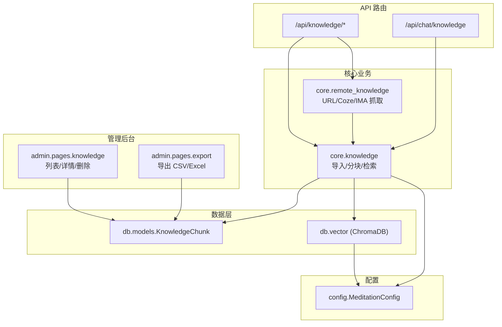
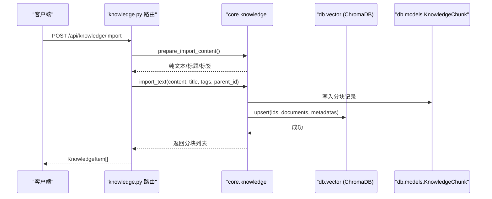
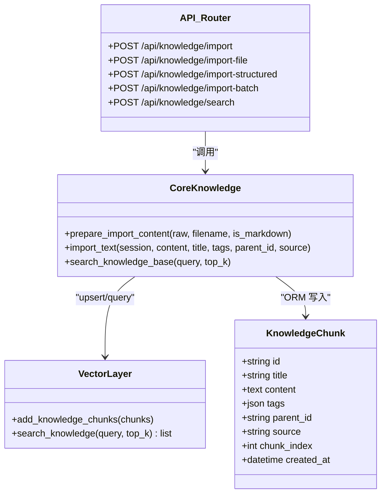
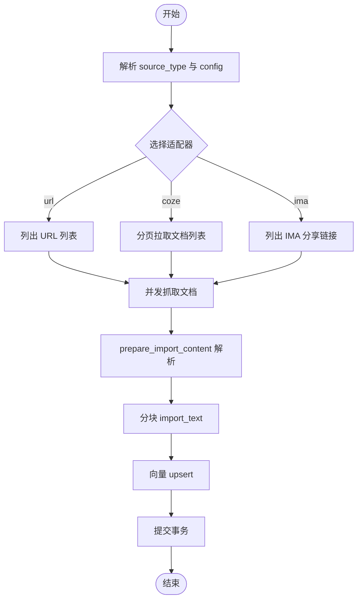
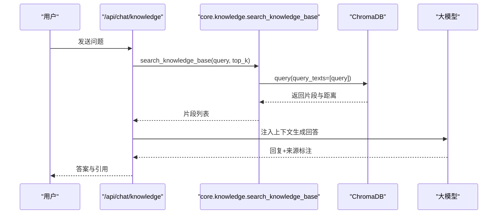
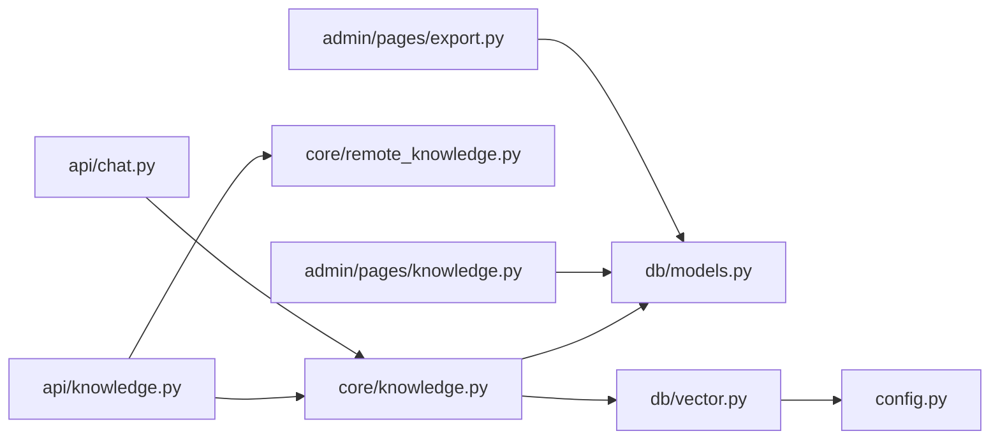

# 知识库接口

<cite>
**本文引用的文件**   
- [hushai/meditation/api/knowledge.py](file://hushai/meditation/api/knowledge.py)
- [hushai/meditation/core/knowledge.py](file://hushai/meditation/core/knowledge.py)
- [hushai/meditation/db/vector.py](file://hushai/meditation/db/vector.py)
- [hushai/meditation/db/models.py](file://hushai/meditation/db/models.py)
- [hushai/meditation/schemas.py](file://hushai/meditation/schemas.py)
- [hushai/meditation/core/remote_knowledge.py](file://hushai/meditation/core/remote_knowledge.py)
- [hushai/meditation/config.py](file://hushai/meditation/config.py)
- [hushai/meditation/admin/pages/knowledge.py](file://hushai/meditation/admin/pages/knowledge.py)
- [hushai/meditation/admin/pages/export.py](file://hushai/meditation/admin/pages/export.py)
- [hushai/meditation/api/chat.py](file://hushai/meditation/api/chat.py)
- [scripts/test_api.py](file://scripts/test_api.py)
</cite>

## 目录
1. [简介](#简介)
2. [项目结构](#项目结构)
3. [核心组件](#核心组件)
4. [架构总览](#架构总览)
5. [详细组件分析](#详细组件分析)
6. [依赖关系分析](#依赖关系分析)
7. [性能与优化建议](#性能与优化建议)
8. [故障排查指南](#故障排查指南)
9. [结论](#结论)
10. [附录：API 定义与示例](#附录api-定义与示例)

## 简介
本文件为 hush.ai 知识库系统的 API 接口文档，覆盖知识内容的增删改查、Markdown 语料导入、向量检索、来源标注、RAG（检索增强生成）工作原理、语义搜索算法、知识图谱构建思路、版本管理、批量导入导出、质量评估等高级特性。文档同时提供完整的请求/响应示例与索引优化、缓存策略和检索性能调优建议，帮助开发者快速集成与扩展。

## 项目结构
知识库相关能力分布在以下模块：
- API 路由层：FastAPI 路由，负责鉴权、参数校验、调用业务逻辑并返回结构化响应
- 核心业务层：文本预处理、分块、结构化导入、远程抓取与入库、检索上下文组装
- 数据持久化层：SQLAlchemy ORM 模型、ChromaDB 向量库封装
- 配置与环境：环境变量映射、嵌入模型与向量库配置
- 管理后台：页面与导出、删除等管理能力
- 对话与 RAG：聊天接口中集成知识库问答

图表来源
- [hushai/meditation/api/knowledge.py:1-310](file://hushai/meditation/api/knowledge.py#L1-L310)
- [hushai/meditation/core/knowledge.py:1-225](file://hushai/meditation/core/knowledge.py#L1-L225)
- [hushai/meditation/db/vector.py:1-179](file://hushai/meditation/db/vector.py#L1-L179)
- [hushai/meditation/db/models.py:137-151](file://hushai/meditation/db/models.py#L137-L151)
- [hushai/meditation/config.py:18-53](file://hushai/meditation/config.py#L18-L53)
- [hushai/meditation/admin/pages/knowledge.py:1-163](file://hushai/meditation/admin/pages/knowledge.py#L1-L163)
- [hushai/meditation/admin/pages/export.py:171-207](file://hushai/meditation/admin/pages/export.py#L171-L207)
- [hushai/meditation/api/chat.py:107-128](file://hushai/meditation/api/chat.py#L107-L128)

章节来源
- [hushai/meditation/api/knowledge.py:1-310](file://hushai/meditation/api/knowledge.py#L1-L310)
- [hushai/meditation/core/knowledge.py:1-225](file://hushai/meditation/core/knowledge.py#L1-L225)
- [hushai/meditation/db/vector.py:1-179](file://hushai/meditation/db/vector.py#L1-L179)
- [hushai/meditation/db/models.py:137-151](file://hushai/meditation/db/models.py#L137-L151)
- [hushai/meditation/config.py:18-53](file://hushai/meditation/config.py#L18-L53)
- [hushai/meditation/admin/pages/knowledge.py:1-163](file://hushai/meditation/admin/pages/knowledge.py#L1-L163)
- [hushai/meditation/admin/pages/export.py:171-207](file://hushai/meditation/admin/pages/export.py#L171-L207)
- [hushai/meditation/api/chat.py:107-128](file://hushai/meditation/api/chat.py#L107-L128)

## 核心组件
- 知识库 API 路由：提供导入、文件导入、结构化导入、批量导入、搜索、远程导入与同步等端点
- 核心处理：Markdown 解析、纯文本转换、段落分块、结构化递归导入、向量入库、相似度检索
- 向量数据库：基于 ChromaDB 的集合管理与查询，支持 OpenAI 或默认嵌入函数
- 数据模型：KnowledgeChunk 实体，支持父子层级、标签、来源、时间戳
- 远程源适配：URL、Coze、IMA 三种适配器，统一抓取与入库流程
- 配置：嵌入模型、Top-K、持久化路径、远程源配置等
- 管理后台：分页浏览、详情查看、单条/批量删除、导出 CSV/Excel
- 对话集成：/api/chat/knowledge 提供带来源标注的知识问答

章节来源
- [hushai/meditation/api/knowledge.py:35-310](file://hushai/meditation/api/knowledge.py#L35-L310)
- [hushai/meditation/core/knowledge.py:76-225](file://hushai/meditation/core/knowledge.py#L76-L225)
- [hushai/meditation/db/vector.py:61-127](file://hushai/meditation/db/vector.py#L61-L127)
- [hushai/meditation/db/models.py:137-151](file://hushai/meditation/db/models.py#L137-L151)
- [hushai/meditation/core/remote_knowledge.py:179-389](file://hushai/meditation/core/remote_knowledge.py#L179-L389)
- [hushai/meditation/config.py:40-53](file://hushai/meditation/config.py#L40-L53)
- [hushai/meditation/admin/pages/knowledge.py:22-163](file://hushai/meditation/admin/pages/knowledge.py#L22-L163)
- [hushai/meditation/admin/pages/export.py:171-207](file://hushai/meditation/admin/pages/export.py#L171-L207)
- [hushai/meditation/api/chat.py:107-128](file://hushai/meditation/api/chat.py#L107-L128)

## 架构总览
知识库系统采用“路由层 + 核心逻辑 + 数据层”的分层架构，结合向量检索实现 RAG。

图表来源
- [hushai/meditation/api/knowledge.py:57-93](file://hushai/meditation/api/knowledge.py#L57-L93)
- [hushai/meditation/core/knowledge.py:137-171](file://hushai/meditation/core/knowledge.py#L137-L171)
- [hushai/meditation/db/vector.py:81-101](file://hushai/meditation/db/vector.py#L81-L101)
- [hushai/meditation/db/models.py:137-151](file://hushai/meditation/db/models.py#L137-L151)

## 详细组件分析

### 组件 A：知识库导入与检索（API + 核心 + 向量）
- 导入端点
  - POST /api/knowledge/import：支持 plain/markdown 两种格式，自动提取 frontmatter 标题与标签，转纯文本后分块入库
  - POST /api/knowledge/import-file：上传文件，按文件名后缀或表单标记判断 Markdown；合并标签
  - POST /api/knowledge/import-structured：JSON 结构化导入，支持 children 递归子节点
  - POST /api/knowledge/import-batch：多文件批量导入，容错汇总结果与错误
  - POST /api/knowledge/search：语义检索，返回 top_k 片段及分数、标签、来源
- 核心处理
  - prepare_import_content：解析 frontmatter、提取首个一级标题、Markdown→纯文本
  - _split_text_to_chunks：按段落切分，控制 chunk_size 与 overlap，避免过长片段
  - import_text：逐块写入 ORM 并 upsert 到向量库
  - search_knowledge_base：读取配置 knowledge_top_k，调用向量检索
- 向量库
  - knowledge_collection：创建/获取集合，设置 cosine 空间
  - add_knowledge_chunks：将 id、content、title、tags、source、parent_id 转为元数据
  - search_knowledge：query_texts 查询，返回 id、content、score=1-dist、title、tags、source

图表来源
- [hushai/meditation/db/models.py:137-151](file://hushai/meditation/db/models.py#L137-L151)
- [hushai/meditation/db/vector.py:81-127](file://hushai/meditation/db/vector.py#L81-L127)
- [hushai/meditation/core/knowledge.py:76-225](file://hushai/meditation/core/knowledge.py#L76-L225)
- [hushai/meditation/api/knowledge.py:57-234](file://hushai/meditation/api/knowledge.py#L57-L234)

章节来源
- [hushai/meditation/api/knowledge.py:57-234](file://hushai/meditation/api/knowledge.py#L57-L234)
- [hushai/meditation/core/knowledge.py:76-225](file://hushai/meditation/core/knowledge.py#L76-L225)
- [hushai/meditation/db/vector.py:81-127](file://hushai/meditation/db/vector.py#L81-L127)
- [hushai/meditation/db/models.py:137-151](file://hushai/meditation/db/models.py#L137-L151)

### 组件 B：远程知识源抓取与同步
- 适配器协议与实现
  - URLSourceAdapter：从 urls 字段拉取任意 HTTP(S) 地址
  - CozeSourceAdapter：分页拉取文档列表与内容，使用 api_token/dataset_id
  - IMASourceAdapter：通过分享链接或导出 URL 拉取，可选 cookie
- 抓取引擎
  - fetch_and_import_urls：直接传入 URL 列表进行抓取与导入
  - fetch_from_remote_source：根据 source_type 选择适配器，构造额外头信息
  - _import_documents：并发抓取（Semaphore），解析、分块、入库，汇总 results/errors
  - sync_all_remote_sources：读取配置 remote_knowledge_sources，逐一同步

图表来源
- [hushai/meditation/core/remote_knowledge.py:179-389](file://hushai/meditation/core/remote_knowledge.py#L179-L389)
- [hushai/meditation/core/knowledge.py:76-171](file://hushai/meditation/core/knowledge.py#L76-L171)
- [hushai/meditation/db/vector.py:81-101](file://hushai/meditation/db/vector.py#L81-L101)

章节来源
- [hushai/meditation/core/remote_knowledge.py:179-389](file://hushai/meditation/core/remote_knowledge.py#L179-L389)
- [hushai/meditation/core/knowledge.py:76-171](file://hushai/meditation/core/knowledge.py#L76-L171)
- [hushai/meditation/db/vector.py:81-101](file://hushai/meditation/db/vector.py#L81-L101)

### 组件 C：管理后台与导出
- 管理页面
  - GET /knowledge：分页浏览，支持标题/内容模糊搜索
  - GET /knowledge/{item_id}：查看详情
  - DELETE /api/knowledge/{item_id}：删除单条
  - POST /api/knowledge/batch-delete：批量删除
- 导出
  - GET /export/knowledge：导出知识库条目为 CSV/Excel，支持搜索过滤

章节来源
- [hushai/meditation/admin/pages/knowledge.py:22-163](file://hushai/meditation/admin/pages/knowledge.py#L22-L163)
- [hushai/meditation/admin/pages/export.py:171-207](file://hushai/meditation/admin/pages/export.py#L171-L207)

### 组件 D：RAG 与语义检索
- 语义搜索算法
  - 文本清洗与分块：去除 Markdown 装饰，保留代码块内文本，按段落切分，控制重叠
  - 向量化：OpenAIEmbeddingFunction 或 DefaultEmbeddingFunction，集合空间为 cosine
  - 检索：col.query(query_texts=[query], n_results=top_k)，返回距离并转换为 score=1-dist
- RAG 工作流
  - 用户提问 → 检索 top_k 片段 → 组装提示上下文 → LLM 生成回答
  - 来源标注：返回片段包含 source、title、tags，便于溯源

图表来源
- [hushai/meditation/api/chat.py:107-128](file://hushai/meditation/api/chat.py#L107-L128)
- [hushai/meditation/core/knowledge.py:207-225](file://hushai/meditation/core/knowledge.py#L207-L225)
- [hushai/meditation/db/vector.py:104-127](file://hushai/meditation/db/vector.py#L104-L127)

章节来源
- [hushai/meditation/api/chat.py:107-128](file://hushai/meditation/api/chat.py#L107-L128)
- [hushai/meditation/core/knowledge.py:207-225](file://hushai/meditation/core/knowledge.py#L207-L225)
- [hushai/meditation/db/vector.py:104-127](file://hushai/meditation/db/vector.py#L104-L127)

## 依赖关系分析
- 路由层依赖核心业务与认证依赖
- 核心业务依赖 ORM 模型与向量库
- 向量库依赖配置（嵌入提供者、模型、持久化路径）
- 管理后台与导出依赖 ORM 模型
- 远程抓取依赖核心导入流程

图表来源
- [hushai/meditation/api/knowledge.py:1-310](file://hushai/meditation/api/knowledge.py#L1-L310)
- [hushai/meditation/core/knowledge.py:1-225](file://hushai/meditation/core/knowledge.py#L1-L225)
- [hushai/meditation/db/vector.py:1-179](file://hushai/meditation/db/vector.py#L1-L179)
- [hushai/meditation/db/models.py:137-151](file://hushai/meditation/db/models.py#L137-L151)
- [hushai/meditation/config.py:18-53](file://hushai/meditation/config.py#L18-L53)
- [hushai/meditation/admin/pages/knowledge.py:1-163](file://hushai/meditation/admin/pages/knowledge.py#L1-L163)
- [hushai/meditation/admin/pages/export.py:171-207](file://hushai/meditation/admin/pages/export.py#L171-L207)
- [hushai/meditation/api/chat.py:107-128](file://hushai/meditation/api/chat.py#L107-L128)

章节来源
- [hushai/meditation/api/knowledge.py:1-310](file://hushai/meditation/api/knowledge.py#L1-L310)
- [hushai/meditation/core/knowledge.py:1-225](file://hushai/meditation/core/knowledge.py#L1-L225)
- [hushai/meditation/db/vector.py:1-179](file://hushai/meditation/db/vector.py#L1-L179)
- [hushai/meditation/db/models.py:137-151](file://hushai/meditation/db/models.py#L137-L151)
- [hushai/meditation/config.py:18-53](file://hushai/meditation/config.py#L18-L53)
- [hushai/meditation/admin/pages/knowledge.py:1-163](file://hushai/meditation/admin/pages/knowledge.py#L1-L163)
- [hushai/meditation/admin/pages/export.py:171-207](file://hushai/meditation/admin/pages/export.py#L171-L207)
- [hushai/meditation/api/chat.py:107-128](file://hushai/meditation/api/chat.py#L107-L128)

## 性能与优化建议
- 索引优化
  - 调整 chunk_size 与 overlap：较大 chunk 提升召回但降低精度；较小 chunk 提高定位但增加开销
  - 向量集合空间：cosine 适合语义相似度；如需速度可考虑其他度量
  - 持久化 ChromaDB：启用 chroma_persist_dir 避免重启丢失
- 缓存策略
  - 对高频查询结果做短期缓存（如 Redis），键含 query 与 top_k
  - 对热门知识片段建立热点缓存，减少重复 upsert
- 检索性能调优
  - 合理设置 knowledge_top_k，避免过大导致 LLM 上下文膨胀
  - 在导入时预计算并缓存常用标签组合，加速过滤
  - 并发抓取限制 MAX_CONCURRENT_FETCHES，避免网络拥塞
- 资源与成本
  - 选择合适的 embedding 模型与 base_url，平衡质量与延迟
  - 对长文档进行分段与摘要，减少向量维度与存储占用

[本节为通用指导，不直接分析具体文件]

## 故障排查指南
- 导入内容为空
  - 现象：返回 400，提示“导入内容解析后为空”
  - 排查：检查 Markdown frontmatter 与正文是否有效；确认 as_markdown 标志与文件后缀
- 远程抓取失败
  - 现象：errors 列表包含“抓取失败/解析失败/入库失败”
  - 排查：检查 URL 可达性、Content-Type、Cookie/Bearer Token；确认超时与重定向
- 向量检索无结果
  - 现象：返回空列表
  - 排查：确认集合 count>0；检查 embedding_provider 与 api_key；验证 query 与 top_k
- 权限与鉴权
  - 现象：401 缺少 Authorization 或 token 无效
  - 排查：确保携带正确的 Bearer Token；管理员与普通用户均被允许操作知识库导入/搜索

章节来源
- [hushai/meditation/api/knowledge.py:62-73](file://hushai/meditation/api/knowledge.py#L62-L73)
- [hushai/meditation/core/remote_knowledge.py:294-360](file://hushai/meditation/core/remote_knowledge.py#L294-L360)
- [hushai/meditation/db/vector.py:104-127](file://hushai/meditation/db/vector.py#L104-L127)
- [hushai/meditation/api/knowledge.py:38-55](file://hushai/meditation/api/knowledge.py#L38-L55)

## 结论
本知识库系统以 FastAPI 为核心，结合 SQLAlchemy 与 ChromaDB 实现了高效的语义检索与 RAG 能力。通过灵活的导入方式（文本、文件、结构化、远程源）、完善的元数据与来源标注、以及管理后台与导出功能，满足企业级知识管理与应用需求。建议在部署时关注索引参数、缓存策略与嵌入模型选择，以获得最佳检索效果与性能表现。

[本节为总结，不直接分析具体文件]

## 附录：API 定义与示例

### 认证与鉴权
- 所有知识库导入/搜索端点需要 Authorization: Bearer <token>
- 支持管理员 JWT 与普通用户 JWT

章节来源
- [hushai/meditation/api/knowledge.py:38-55](file://hushai/meditation/api/knowledge.py#L38-L55)

### 导入接口
- POST /api/knowledge/import
  - 请求体：{ content, title?, tags[], parent_id?, content_format="plain"|"markdown" }
  - 响应：KnowledgeItem[]
- POST /api/knowledge/import-file
  - 表单：file, tags="", parent_id?, as_markdown=false
  - 响应：KnowledgeItem[]
- POST /api/knowledge/import-structured
  - 请求体：JSON 对象，支持 children 递归
  - 响应：KnowledgeItem[]
- POST /api/knowledge/import-batch
  - 表单：files[], tags="", as_markdown=false
  - 响应：{ imported, results[], errors[] }

章节来源
- [hushai/meditation/api/knowledge.py:57-210](file://hushai/meditation/api/knowledge.py#L57-L210)
- [hushai/meditation/schemas.py:110-151](file://hushai/meditation/schemas.py#L110-L151)

### 搜索接口
- POST /api/knowledge/search
  - 请求体：{ query, top_k=5 }
  - 响应：{ results: [{ id, title?, content, score, tags }] }

章节来源
- [hushai/meditation/api/knowledge.py:213-234](file://hushai/meditation/api/knowledge.py#L213-L234)
- [hushai/meditation/schemas.py:136-151](file://hushai/meditation/schemas.py#L136-L151)

### 远程导入与同步
- POST /api/knowledge/import-url
  - 请求体：{ source_type="url", urls[], tags[], config{} }
  - 响应：RemoteImportResult
- POST /api/knowledge/import-remote
  - 请求体：{ source_type="coze"|"ima"|"url", config{}, tags[] }
  - 响应：RemoteImportResult
- POST /api/knowledge/sync-remote
  - 无需请求体
  - 响应：{ synced, sources[], errors[] }

章节来源
- [hushai/meditation/api/knowledge.py:237-310](file://hushai/meditation/api/knowledge.py#L237-L310)
- [hushai/meditation/schemas.py:220-237](file://hushai/meditation/schemas.py#L220-L237)

### 管理后台接口
- GET /knowledge：分页列表，支持 search
- GET /knowledge/{item_id}：详情
- DELETE /api/knowledge/{item_id}：删除单条
- POST /api/knowledge/batch-delete：批量删除
- GET /export/knowledge：导出 CSV/Excel

章节来源
- [hushai/meditation/admin/pages/knowledge.py:22-163](file://hushai/meditation/admin/pages/knowledge.py#L22-L163)
- [hushai/meditation/admin/pages/export.py:171-207](file://hushai/meditation/admin/pages/export.py#L171-L207)

### 对话与 RAG
- POST /api/chat/knowledge
  - 请求体：ChatRequest（message, conversation_id?, provider?）
  - 响应：KnowledgeQAResponse（reply, conversation_id, sources[]）

章节来源
- [hushai/meditation/api/chat.py:107-128](file://hushai/meditation/api/chat.py#L107-L128)
- [hushai/meditation/schemas.py:59-69](file://hushai/meditation/schemas.py#L59-L69)

### 本地测试脚本
- scripts/test_api.py：启动服务、登录、导入、搜索、对话、记忆、用户档案等端到端测试

章节来源
- [scripts/test_api.py:45-175](file://scripts/test_api.py#L45-L175)