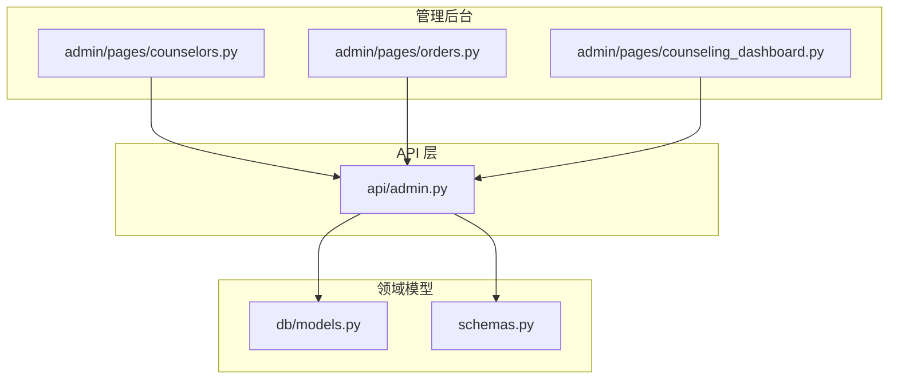
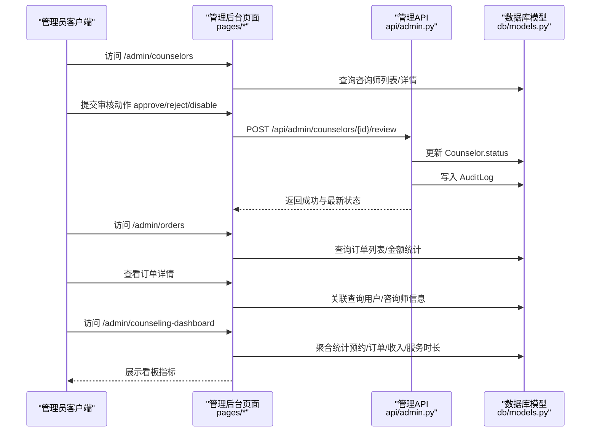
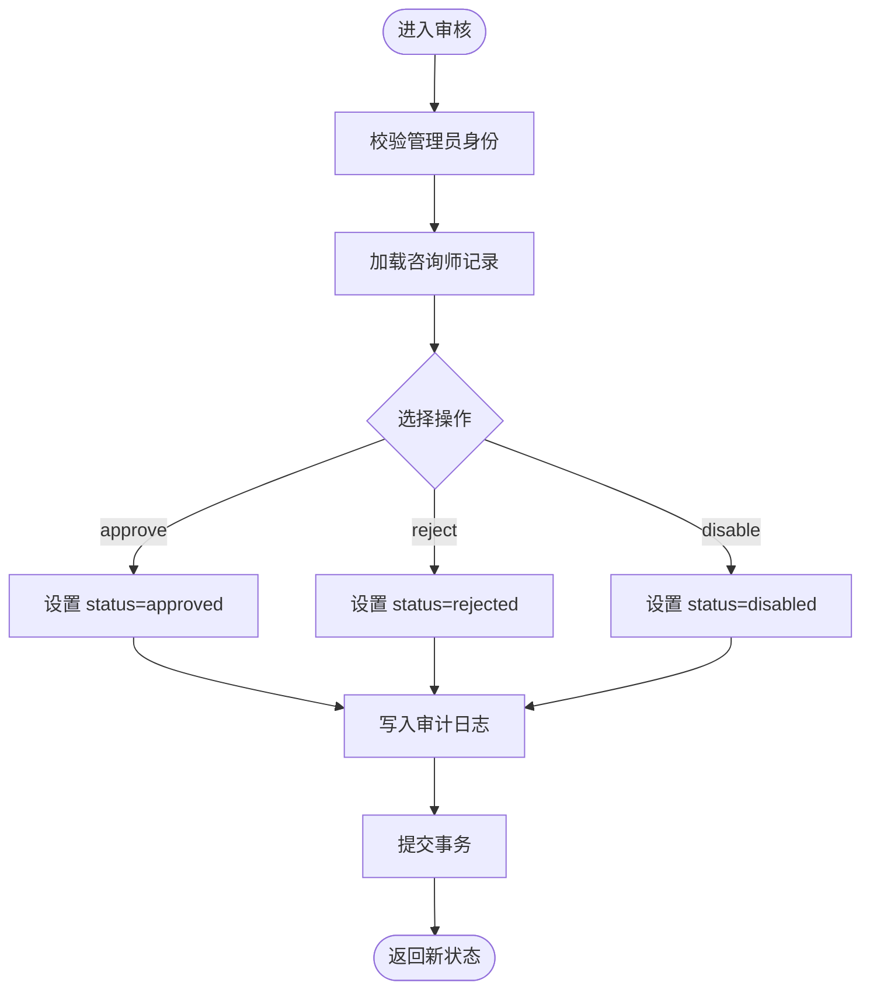
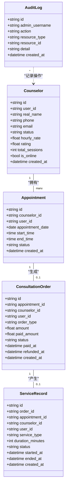
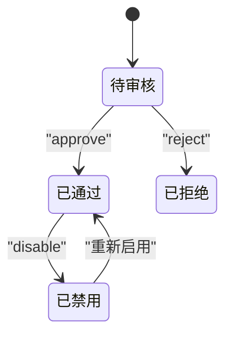
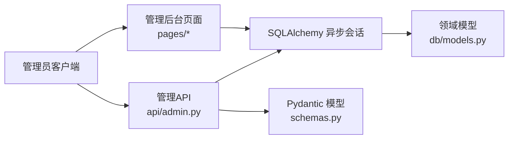

# 咨询服务管理接口

<cite>
**本文引用的文件**   
- [hushai/meditation/api/admin.py](file://hushai/meditation/api/admin.py)
- [hushai/meditation/db/models.py](file://hushai/meditation/db/models.py)
- [hushai/meditation/schemas.py](file://hushai/meditation/schemas.py)
- [hushai/meditation/admin/pages/counselors.py](file://hushai/meditation/admin/pages/counselors.py)
- [hushai/meditation/admin/pages/orders.py](file://hushai/meditation/admin/pages/orders.py)
- [hushai/meditation/admin/pages/counseling_dashboard.py](file://hushai/meditation/admin/pages/counseling_dashboard.py)
</cite>

## 目录
1. [简介](#简介)
2. [项目结构](#项目结构)
3. [核心组件](#核心组件)
4. [架构总览](#架构总览)
5. [详细组件分析](#详细组件分析)
6. [依赖关系分析](#依赖关系分析)
7. [性能与一致性](#性能与一致性)
8. [故障排查指南](#故障排查指南)
9. [结论](#结论)

## 简介
本文件为 hush.ai 管理后台的“咨询服务管理”能力提供 API 文档，覆盖以下关键能力：
- 咨询师入驻申请审核流程（approve/reject/disable）及审计日志记录
- 订单管理与筛选、状态说明
- 业务全局统计（预约统计、订单统计、收入统计等）
- 咨询师列表查询、在线状态切换
- 业务流程状态转换与数据一致性保证要点

## 项目结构
与咨询服务管理相关的后端实现主要分布在以下位置：
- API 路由与管理端点：hushai/meditation/api/admin.py
- 数据模型与关系：hushai/meditation/db/models.py
- Pydantic 请求/响应模型：hushai/meditation/schemas.py
- 管理后台页面端点（HTML 渲染 + 轻量 API）：
  - 咨询师管理：hushai/meditation/admin/pages/counselors.py
  - 订单管理：hushai/meditation/admin/pages/orders.py
  - 咨询看板：hushai/meditation/admin/pages/counseling_dashboard.py

图表来源
- [hushai/meditation/api/admin.py:1-268](file://hushai/meditation/api/admin.py#L1-L268)
- [hushai/meditation/admin/pages/counselors.py:1-202](file://hushai/meditation/admin/pages/counselors.py#L1-L202)
- [hushai/meditation/admin/pages/orders.py:1-125](file://hushai/meditation/admin/pages/orders.py#L1-L125)
- [hushai/meditation/admin/pages/counseling_dashboard.py:1-127](file://hushai/meditation/admin/pages/counseling_dashboard.py#L1-L127)
- [hushai/meditation/db/models.py:273-434](file://hushai/meditation/db/models.py#L273-L434)
- [hushai/meditation/schemas.py:267-541](file://hushai/meditation/schemas.py#L267-L541)

章节来源
- [hushai/meditation/api/admin.py:1-268](file://hushai/meditation/api/admin.py#L1-L268)
- [hushai/meditation/db/models.py:273-434](file://hushai/meditation/db/models.py#L273-L434)
- [hushai/meditation/schemas.py:267-541](file://hushai/meditation/schemas.py#L267-L541)
- [hushai/meditation/admin/pages/counselors.py:1-202](file://hushai/meditation/admin/pages/counselors.py#L1-L202)
- [hushai/meditation/admin/pages/orders.py:1-125](file://hushai/meditation/admin/pages/orders.py#L1-L125)
- [hushai/meditation/admin/pages/counseling_dashboard.py:1-127](file://hushai/meditation/admin/pages/counseling_dashboard.py#L1-L127)

## 核心组件
- 管理员鉴权与路由前缀：/api/admin
- 咨询师审核：POST /api/admin/counselors/{counselor_id}/review
- 咨询师列表：GET /api/admin/counselors
- 订单列表：GET /api/admin/orders
- 全局统计：GET /api/admin/counseling/stats
- 管理后台页面端点（HTML）：/admin/counselors、/admin/orders、/admin/counseling-dashboard

章节来源
- [hushai/meditation/api/admin.py:116-268](file://hushai/meditation/api/admin.py#L116-L268)
- [hushai/meditation/admin/pages/counselors.py:23-202](file://hushai/meditation/admin/pages/counselors.py#L23-L202)
- [hushai/meditation/admin/pages/orders.py:17-125](file://hushai/meditation/admin/pages/orders.py#L17-L125)
- [hushai/meditation/admin/pages/counseling_dashboard.py:24-127](file://hushai/meditation/admin/pages/counseling_dashboard.py#L24-L127)

## 架构总览
下图展示了管理后台对“咨询师审核、订单管理、业务统计”的核心调用路径与数据流向。

图表来源
- [hushai/meditation/api/admin.py:116-268](file://hushai/meditation/api/admin.py#L116-L268)
- [hushai/meditation/admin/pages/counselors.py:145-202](file://hushai/meditation/admin/pages/counselors.py#L145-L202)
- [hushai/meditation/admin/pages/orders.py:17-125](file://hushai/meditation/admin/pages/orders.py#L17-L125)
- [hushai/meditation/admin/pages/counseling_dashboard.py:24-127](file://hushai/meditation/admin/pages/counseling_dashboard.py#L24-L127)
- [hushai/meditation/db/models.py:273-434](file://hushai/meditation/db/models.py#L273-L434)

## 详细组件分析

### 咨询师入驻审核流程
- 入口
  - 管理后台页面端点：POST /admin/counselors/{counselor_id}/review
  - 管理 API 端点：POST /api/admin/counselors/{counselor_id}/review
- 支持操作
  - approve：通过认证，状态变更为 approved
  - reject：拒绝入驻，状态变更为 rejected
  - disable：禁用咨询师，状态变更为 disabled
- 审计日志
  - 每次审核均写入 AuditLog，包含操作人、动作、资源类型、资源 ID、原因等
- 在线状态切换
  - 管理后台页面端点：POST /admin/counselors/{counselor_id}/toggle-online

图表来源
- [hushai/meditation/api/admin.py:159-190](file://hushai/meditation/api/admin.py#L159-L190)
- [hushai/meditation/admin/pages/counselors.py:145-180](file://hushai/meditation/admin/pages/counselors.py#L145-L180)
- [hushai/meditation/db/models.py:188-202](file://hushai/meditation/db/models.py#L188-L202)

章节来源
- [hushai/meditation/api/admin.py:159-190](file://hushai/meditation/api/admin.py#L159-L190)
- [hushai/meditation/admin/pages/counselors.py:145-202](file://hushai/meditation/admin/pages/counselors.py#L145-L202)
- [hushai/meditation/db/models.py:188-202](file://hushai/meditation/db/models.py#L188-L202)

### 咨询师列表与详情
- 列表查询
  - 管理 API：GET /api/admin/counselors
    - 支持按 status 过滤
    - 分页参数：limit、offset
  - 管理后台页面：GET /admin/counselors
    - 支持 status、search（姓名/手机号模糊匹配）
    - 返回分页信息与统计（总数、待审、已批准、在线）
- 详情与排班/预约统计
  - 管理后台页面：GET /admin/counselors/{counselor_id}
    - 展示咨询师基本信息、排班数量、预约数量、待处理预约数

章节来源
- [hushai/meditation/api/admin.py:193-228](file://hushai/meditation/api/admin.py#L193-L228)
- [hushai/meditation/admin/pages/counselors.py:23-92](file://hushai/meditation/admin/pages/counselors.py#L23-L92)
- [hushai/meditation/admin/pages/counselors.py:95-143](file://hushai/meditation/admin/pages/counselors.py#L95-L143)

### 订单管理
- 列表查询
  - 管理 API：GET /api/admin/orders
    - 支持按 status 过滤
    - 分页参数：limit、offset
  - 管理后台页面：GET /admin/orders
    - 支持按 status 过滤
    - 返回统计：未支付/已支付/已退款数量、累计应收金额、累计实收金额
- 详情
  - 管理后台页面：GET /admin/orders/{order_id}
    - 展示订单、关联咨询师与用户信息

章节来源
- [hushai/meditation/api/admin.py:231-268](file://hushai/meditation/api/admin.py#L231-L268)
- [hushai/meditation/admin/pages/orders.py:17-89](file://hushai/meditation/admin/pages/orders.py#L17-L89)
- [hushai/meditation/admin/pages/orders.py:92-125](file://hushai/meditation/admin/pages/orders.py#L92-L125)

### 业务全局统计（咨询看板）
- 管理 API：GET /api/admin/counseling/stats
  - 返回字段：
    - total_appointments：总预约数
    - pending_appointments：待处理预约数
    - completed_appointments：已完成预约数
    - total_orders：总订单数
    - total_revenue：累计收入（仅统计 paid 状态的 paid_amount 之和）
    - total_counselors：已批准咨询师数
    - online_counselors：在线且已批准的咨询师数
- 管理后台页面：GET /admin/counseling-dashboard
  - 除上述指标外，还展示：
    - 今日新增订单数
    - 服务记录总数与服务总时长（分钟转小时）
    - 最近待审核咨询师列表
    - 今日预约列表

章节来源
- [hushai/meditation/api/admin.py:116-156](file://hushai/meditation/api/admin.py#L116-L156)
- [hushai/meditation/admin/pages/counseling_dashboard.py:24-127](file://hushai/meditation/admin/pages/counseling_dashboard.py#L24-L127)

### 数据模型与状态定义
- 咨询师 Counselor
  - 关键字段：status（pending/approved/rejected/disabled）、is_online、hourly_rate、rating、total_sessions
- 预约 Appointment
  - 关键字段：status（pending/confirmed/completed/cancelled/rejected）、appointment_date、start_time、end_time
- 订单 ConsultationOrder
  - 关键字段：status（unpaid/paid/refunded）、amount、paid_amount、paid_at、refunded_at
- 服务记录 ServiceRecord
  - 关键字段：status（in_progress/completed/archived）、duration_minutes、started_at、ended_at
- 审计日志 AuditLog
  - 关键字段：admin_username、action、resource_type、resource_id、detail、created_at

图表来源
- [hushai/meditation/db/models.py:273-434](file://hushai/meditation/db/models.py#L273-L434)
- [hushai/meditation/db/models.py:188-202](file://hushai/meditation/db/models.py#L188-L202)

章节来源
- [hushai/meditation/db/models.py:273-434](file://hushai/meditation/db/models.py#L273-L434)
- [hushai/meditation/db/models.py:188-202](file://hushai/meditation/db/models.py#L188-L202)

### 业务流程状态转换
- 咨询师状态
  - pending → approved（通过）
  - pending → rejected（拒绝）
  - approved → disabled（禁用）
  - disabled → approved（重新启用）
- 预约状态
  - pending → confirmed（确认）
  - confirmed → completed（完成）
  - pending/confirmed → cancelled/rejected（取消/拒绝）
- 订单状态
  - unpaid → paid（支付成功）
  - paid → refunded（退款）

图表来源
- [hushai/meditation/api/admin.py:159-190](file://hushai/meditation/api/admin.py#L159-L190)
- [hushai/meditation/admin/pages/counselors.py:163-170](file://hushai/meditation/admin/pages/counselors.py#L163-L170)
- [hushai/meditation/db/models.py:287-289](file://hushai/meditation/db/models.py#L287-L289)

章节来源
- [hushai/meditation/api/admin.py:159-190](file://hushai/meditation/api/admin.py#L159-L190)
- [hushai/meditation/admin/pages/counselors.py:163-170](file://hushai/meditation/admin/pages/counselors.py#L163-L170)
- [hushai/meditation/db/models.py:287-289](file://hushai/meditation/db/models.py#L287-L289)

## 依赖关系分析
- 路由与鉴权
  - 管理 API 使用 Header Authorization 进行管理员鉴权
  - 管理后台页面端点使用会话/模板上下文中的管理员身份
- 数据访问
  - 所有统计与列表查询基于 SQLAlchemy 异步会话执行
- 模型与 Schema
  - 统计响应使用 CounselingStatsResponse 统一输出
  - 枚举类型在 schemas.py 中统一定义，便于前后端一致

图表来源
- [hushai/meditation/api/admin.py:1-268](file://hushai/meditation/api/admin.py#L1-L268)
- [hushai/meditation/admin/pages/counselors.py:1-202](file://hushai/meditation/admin/pages/counselors.py#L1-L202)
- [hushai/meditation/admin/pages/orders.py:1-125](file://hushai/meditation/admin/pages/orders.py#L1-L125)
- [hushai/meditation/admin/pages/counseling_dashboard.py:1-127](file://hushai/meditation/admin/pages/counseling_dashboard.py#L1-L127)
- [hushai/meditation/db/models.py:273-434](file://hushai/meditation/db/models.py#L273-L434)
- [hushai/meditation/schemas.py:267-541](file://hushai/meditation/schemas.py#L267-L541)

章节来源
- [hushai/meditation/api/admin.py:1-268](file://hushai/meditation/api/admin.py#L1-L268)
- [hushai/meditation/schemas.py:267-541](file://hushai/meditation/schemas.py#L267-L541)

## 性能与一致性
- 统计计算方式
  - 预约统计：基于 Appointment 表 count 与条件计数
  - 订单统计：基于 ConsultationOrder 表 count 与 sum(paid_amount)
  - 收入统计：仅计入 status=paid 的 paid_amount 合计
  - 服务时长：ServiceRecord 中 status=completed 的 duration_minutes 求和并换算为小时
- 索引与查询优化
  - Counselor.status、Appointment.status、ConsultationOrder.status 均有索引
  - CounselorSchedule 具备唯一复合索引避免重复时段
- 一致性保障
  - 审核操作在同一事务内更新 Counselor.status 并写入 AuditLog，确保原子性
  - 订单金额统计以数据库聚合为准，避免前端或缓存不一致

章节来源
- [hushai/meditation/api/admin.py:116-156](file://hushai/meditation/api/admin.py#L116-L156)
- [hushai/meditation/admin/pages/counseling_dashboard.py:64-88](file://hushai/meditation/admin/pages/counseling_dashboard.py#L64-L88)
- [hushai/meditation/db/models.py:322-324](file://hushai/meditation/db/models.py#L322-L324)
- [hushai/meditation/db/models.py:287-289](file://hushai/meditation/db/models.py#L287-L289)
- [hushai/meditation/db/models.py:339-341](file://hushai/meditation/db/models.py#L339-L341)
- [hushai/meditation/db/models.py:368-370](file://hushai/meditation/db/models.py#L368-L370)

## 故障排查指南
- 常见错误码
  - 401：未登录或无管理员权限
  - 404：咨询师/订单不存在
  - 400：无效操作（如不支持的 action）
- 定位建议
  - 检查 AuditLog 是否写入成功，确认审核动作是否落库
  - 核对 Counselor.status 是否符合预期状态机
  - 核对订单 status 与金额字段（amount、paid_amount）的一致性
- 调试步骤
  - 先访问 /admin/counseling-dashboard 观察整体指标
  - 再分别打开 /admin/counselors 与 /admin/orders 验证明细
  - 若异常，查看对应页面的控制台与网络请求

章节来源
- [hushai/meditation/api/admin.py:159-190](file://hushai/meditation/api/admin.py#L159-L190)
- [hushai/meditation/admin/pages/counselors.py:154-170](file://hushai/meditation/admin/pages/counselors.py#L154-L170)
- [hushai/meditation/admin/pages/orders.py:98-108](file://hushai/meditation/admin/pages/orders.py#L98-L108)

## 结论
本管理后台围绕“咨询师审核、订单管理、业务统计”三大核心能力，提供了清晰的管理 API 与页面端点。通过统一的模型与枚举定义、严格的审计日志记录以及数据库层面的聚合统计，确保了业务数据的准确性与可追溯性。建议在后续迭代中补充更细粒度的时间维度统计与导出能力，以提升运营效率与数据分析深度。