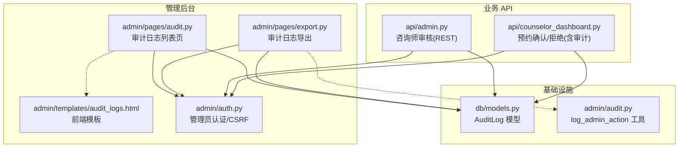
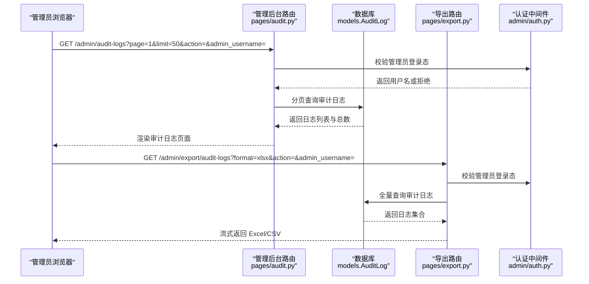
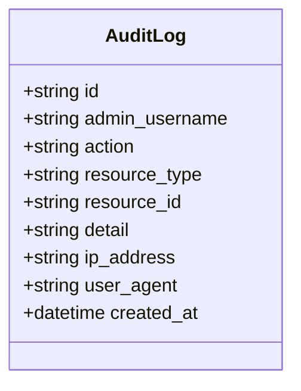
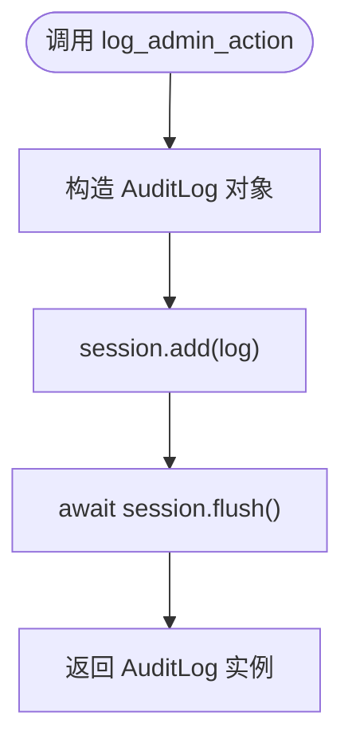
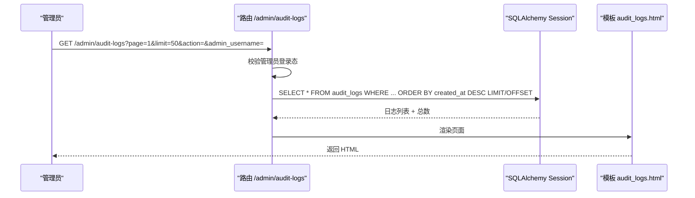
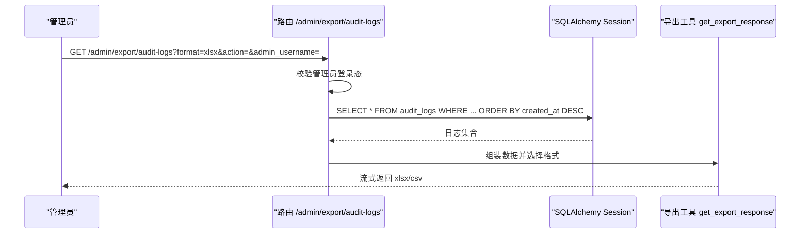
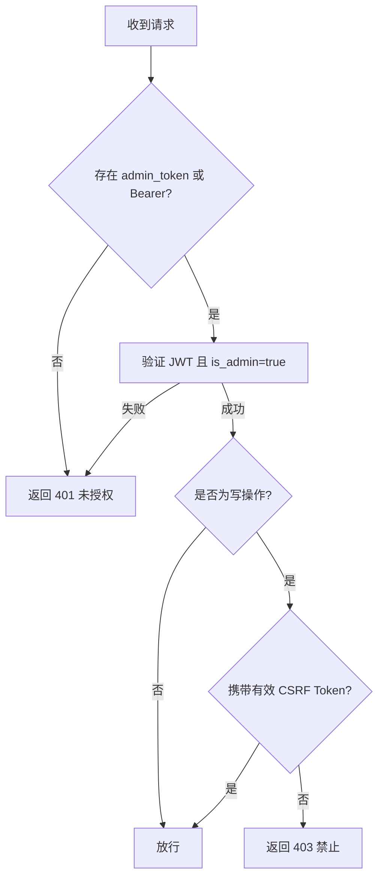
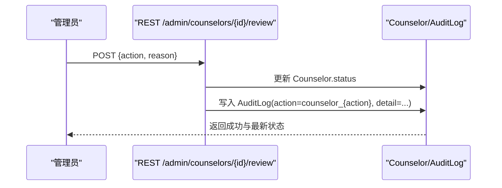
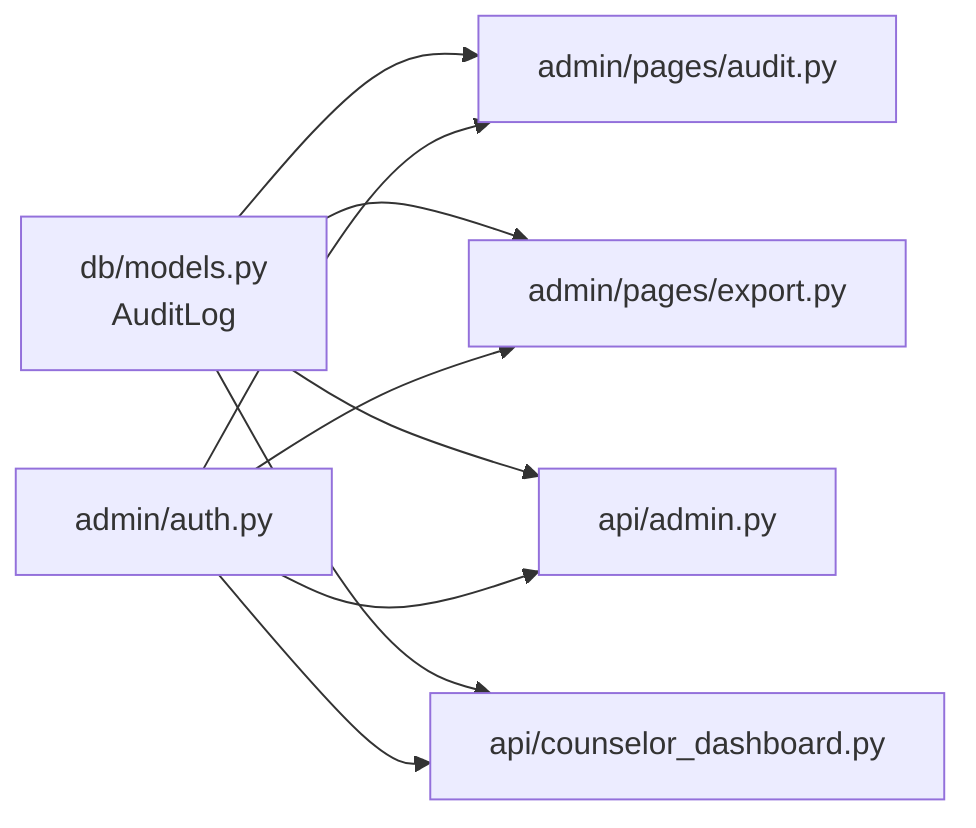

# 审计日志接口

<cite>
**本文引用的文件**   
- [hushai/meditation/db/models.py](file://hushai/meditation/db/models.py)
- [hushai/meditation/admin/audit.py](file://hushai/meditation/admin/audit.py)
- [hushai/meditation/admin/pages/audit.py](file://hushai/meditation/admin/pages/audit.py)
- [hushai/meditation/admin/templates/audit_logs.html](file://hushai/meditation/admin/templates/audit_logs.html)
- [hushai/meditation/admin/pages/export.py](file://hushai/meditation/admin/pages/export.py)
- [hushai/meditation/admin/auth.py](file://hushai/meditation/admin/auth.py)
- [hushai/meditation/api/admin.py](file://hushai/meditation/api/admin.py)
- [hushai/meditation/api/counselor_dashboard.py](file://hushai/meditation/api/counselor_dashboard.py)
</cite>

## 目录
1. [简介](#简介)
2. [项目结构](#项目结构)
3. [核心组件](#核心组件)
4. [架构总览](#架构总览)
5. [详细组件分析](#详细组件分析)
6. [依赖关系分析](#依赖关系分析)
7. [性能与扩展性](#性能与扩展性)
8. [故障排查指南](#故障排查指南)
9. [结论](#结论)
10. [附录：API 定义与示例](#附录api-定义与示例)

## 简介
本文件为 hush.ai 管理后台的“审计日志”子系统提供完整 API 文档，覆盖操作审计、行为追溯与合规监控等安全管理能力。重点包括：
- AuditLog 模型的数据结构与字段说明
- 审计日志的自动记录机制与关键业务集成（如咨询师审核）
- 审计查询、导出与分析的使用方式
- 数据安全存储、日志保留策略与隐私保护建议

## 项目结构
审计日志相关代码主要分布在以下模块：
- 数据模型：AuditLog 定义于 ORM 模型层
- 写入工具：统一的异步写入函数
- 页面端查询与导出：FastAPI 路由 + Jinja 模板
- 认证与鉴权：管理员登录态校验与 CSRF 保护
- 业务集成点：咨询师入驻审核、预约确认/拒绝等关键流程

图表来源
- [hushai/meditation/admin/pages/audit.py:16-71](file://hushai/meditation/admin/pages/audit.py#L16-L71)
- [hushai/meditation/admin/templates/audit_logs.html:1-131](file://hushai/meditation/admin/templates/audit_logs.html#L1-L131)
- [hushai/meditation/admin/pages/export.py:54-92](file://hushai/meditation/admin/pages/export.py#L54-L92)
- [hushai/meditation/admin/auth.py:87-113](file://hushai/meditation/admin/auth.py#L87-L113)
- [hushai/meditation/api/admin.py:159-190](file://hushai/meditation/api/admin.py#L159-L190)
- [hushai/meditation/api/counselor_dashboard.py:315-368](file://hushai/meditation/api/counselor_dashboard.py#L315-L368)
- [hushai/meditation/db/models.py:188-202](file://hushai/meditation/db/models.py#L188-L202)
- [hushai/meditation/admin/audit.py:10-31](file://hushai/meditation/admin/audit.py#L10-L31)

章节来源
- [hushai/meditation/admin/pages/audit.py:16-71](file://hushai/meditation/admin/pages/audit.py#L16-L71)
- [hushai/meditation/admin/pages/export.py:54-92](file://hushai/meditation/admin/pages/export.py#L54-L92)
- [hushai/meditation/db/models.py:188-202](file://hushai/meditation/db/models.py#L188-L202)
- [hushai/meditation/admin/auth.py:87-113](file://hushai/meditation/admin/auth.py#L87-L113)
- [hushai/meditation/api/admin.py:159-190](file://hushai/meditation/api/admin.py#L159-L190)
- [hushai/meditation/api/counselor_dashboard.py:315-368](file://hushai/meditation/api/counselor_dashboard.py#L315-L368)
- [hushai/meditation/admin/audit.py:10-31](file://hushai/meditation/admin/audit.py#L10-L31)

## 核心组件
- AuditLog 模型：统一记录管理员或系统关键操作的元数据，包含操作者、动作类型、资源标识、详情、客户端信息与时戳等。
- 审计写入工具：提供异步写入方法，便于在事务中追加审计记录。
- 审计查询与导出：支持按操作类型与管理员筛选、分页浏览与 CSV/Excel 导出。
- 认证与鉴权：基于 JWT Cookie/Bearer Token 的管理员身份校验，并配合 CSRF 防护。
- 业务集成点：咨询师审核、预约状态变更等关键路径均写入审计日志。

章节来源
- [hushai/meditation/db/models.py:188-202](file://hushai/meditation/db/models.py#L188-L202)
- [hushai/meditation/admin/audit.py:10-31](file://hushai/meditation/admin/audit.py#L10-L31)
- [hushai/meditation/admin/pages/audit.py:16-71](file://hushai/meditation/admin/pages/audit.py#L16-L71)
- [hushai/meditation/admin/pages/export.py:54-92](file://hushai/meditation/admin/pages/export.py#L54-L92)
- [hushai/meditation/admin/auth.py:87-113](file://hushai/meditation/admin/auth.py#L87-L113)

## 架构总览
审计日志采用“写多读少”的通用设计：所有关键业务操作在事务内追加审计记录；管理后台提供查询与导出能力；认证中间件确保仅管理员可访问。

图表来源
- [hushai/meditation/admin/pages/audit.py:16-71](file://hushai/meditation/admin/pages/audit.py#L16-L71)
- [hushai/meditation/admin/pages/export.py:54-92](file://hushai/meditation/admin/pages/export.py#L54-L92)
- [hushai/meditation/admin/auth.py:87-113](file://hushai/meditation/admin/auth.py#L87-L113)
- [hushai/meditation/db/models.py:188-202](file://hushai/meditation/db/models.py#L188-L202)

## 详细组件分析

### 数据模型：AuditLog
- 表名：audit_logs
- 主键：id（UUID）
- 关键字段
  - admin_username：执行操作的管理员用户名（索引）
  - action：操作类型（索引），例如 counselor_approve、counselor_reject、appointment_confirm 等
  - resource_type：被操作资源类型，如 counselor、appointment
  - resource_id：资源唯一标识（可选）
  - detail：操作详情（文本，可选）
  - ip_address：客户端 IP（可选）
  - user_agent：客户端 UA（可选）
  - created_at：创建时间（UTC）

图表来源
- [hushai/meditation/db/models.py:188-202](file://hushai/meditation/db/models.py#L188-L202)

章节来源
- [hushai/meditation/db/models.py:188-202](file://hushai/meditation/db/models.py#L188-L202)

### 审计写入工具：log_admin_action
- 作用：封装审计记录的创建与持久化，便于在事务中 flush 后继续后续逻辑。
- 参数：session、admin_username、action、resource_type、resource_id、detail、ip_address、user_agent
- 返回值：写入后的 AuditLog 实例

图表来源
- [hushai/meditation/admin/audit.py:10-31](file://hushai/meditation/admin/audit.py#L10-L31)

章节来源
- [hushai/meditation/admin/audit.py:10-31](file://hushai/meditation/admin/audit.py#L10-L31)

### 审计查询与展示：/admin/audit-logs
- 功能：分页列出审计日志，支持按 action 与 admin_username 过滤，动态生成可用筛选值。
- 权限：需管理员登录态。
- 响应：Jinja 模板渲染 HTML 页面，包含分页、筛选与导出入口。

图表来源
- [hushai/meditation/admin/pages/audit.py:16-71](file://hushai/meditation/admin/pages/audit.py#L16-L71)
- [hushai/meditation/admin/templates/audit_logs.html:1-131](file://hushai/meditation/admin/templates/audit_logs.html#L1-L131)

章节来源
- [hushai/meditation/admin/pages/audit.py:16-71](file://hushai/meditation/admin/pages/audit.py#L16-L71)
- [hushai/meditation/admin/templates/audit_logs.html:1-131](file://hushai/meditation/admin/templates/audit_logs.html#L1-L131)

### 审计导出：/admin/export/audit-logs
- 功能：将审计日志导出为 CSV 或 Excel，支持相同过滤条件。
- 权限：需管理员登录态。
- 输出：StreamingResponse 流式下载。

图表来源
- [hushai/meditation/admin/pages/export.py:54-92](file://hushai/meditation/admin/pages/export.py#L54-L92)
- [hushai/meditation/admin/export.py:92-106](file://hushai/meditation/admin/export.py#L92-L106)

章节来源
- [hushai/meditation/admin/pages/export.py:54-92](file://hushai/meditation/admin/pages/export.py#L54-L92)
- [hushai/meditation/admin/export.py:92-106](file://hushai/meditation/admin/export.py#L92-L106)

### 认证与鉴权：管理员登录态与 CSRF
- 登录态来源：Cookie 中的 admin_token 或 Authorization: Bearer <token>
- 校验：解析 JWT，要求 is_admin=true，失败则拒绝访问
- CSRF：对 POST/PUT/DELETE/PATCH 请求进行令牌校验

图表来源
- [hushai/meditation/admin/auth.py:87-113](file://hushai/meditation/admin/auth.py#L87-L113)
- [hushai/meditation/admin/auth.py:173-182](file://hushai/meditation/admin/auth.py#L173-L182)

章节来源
- [hushai/meditation/admin/auth.py:87-113](file://hushai/meditation/admin/auth.py#L87-L113)
- [hushai/meditation/admin/auth.py:173-182](file://hushai/meditation/admin/auth.py#L173-L182)

### 关键业务集成：咨询师审核与预约操作
- 咨询师审核（管理后台 REST）：POST /admin/counselors/{id}/review，根据 action 更新状态并写入审计日志
- 咨询师申请（咨询师端）：提交入驻申请时写入审计日志
- 预约确认/拒绝（咨询师端）：状态变更时写入审计日志

图表来源
- [hushai/meditation/api/admin.py:159-190](file://hushai/meditation/api/admin.py#L159-L190)
- [hushai/meditation/api/counselor_dashboard.py:315-368](file://hushai/meditation/api/counselor_dashboard.py#L315-L368)

章节来源
- [hushai/meditation/api/admin.py:159-190](file://hushai/meditation/api/admin.py#L159-L190)
- [hushai/meditation/api/counselor_dashboard.py:315-368](file://hushai/meditation/api/counselor_dashboard.py#L315-L368)

## 依赖关系分析
- 模型依赖：AuditLog 由 db/models.py 定义，被 pages、api、export 等多处引用
- 认证依赖：所有管理后台路由通过 admin/auth.py 校验管理员身份
- 导出依赖：pages/export.py 复用 export_to_csv/export_to_excel 工具

图表来源
- [hushai/meditation/db/models.py:188-202](file://hushai/meditation/db/models.py#L188-L202)
- [hushai/meditation/admin/pages/audit.py:16-71](file://hushai/meditation/admin/pages/audit.py#L16-L71)
- [hushai/meditation/admin/pages/export.py:54-92](file://hushai/meditation/admin/pages/export.py#L54-L92)
- [hushai/meditation/api/admin.py:159-190](file://hushai/meditation/api/admin.py#L159-L190)
- [hushai/meditation/api/counselor_dashboard.py:315-368](file://hushai/meditation/api/counselor_dashboard.py#L315-L368)
- [hushai/meditation/admin/auth.py:87-113](file://hushai/meditation/admin/auth.py#L87-L113)

章节来源
- [hushai/meditation/db/models.py:188-202](file://hushai/meditation/db/models.py#L188-L202)
- [hushai/meditation/admin/pages/audit.py:16-71](file://hushai/meditation/admin/pages/audit.py#L16-L71)
- [hushai/meditation/admin/pages/export.py:54-92](file://hushai/meditation/admin/pages/export.py#L54-L92)
- [hushai/meditation/api/admin.py:159-190](file://hushai/meditation/api/admin.py#L159-L190)
- [hushai/meditation/api/counselor_dashboard.py:315-368](file://hushai/meditation/api/counselor_dashboard.py#L315-L368)
- [hushai/meditation/admin/auth.py:87-113](file://hushai/meditation/admin/auth.py#L87-L113)

## 性能与扩展性
- 查询优化
  - 使用索引字段 action、admin_username 进行过滤
  - 列表页采用分页（offset/limit）避免一次性加载大量数据
- 导出优化
  - 使用 StreamingResponse 流式输出，降低内存峰值
  - 大表导出建议增加后端限流与异步任务队列
- 可扩展点
  - 引入异步写入队列（如 Celery/RQ）解耦审计落库
  - 增加审计事件分类与级别，便于告警与聚合分析
  - 对 detail 字段进行脱敏处理，避免敏感信息泄露

[本节为通用指导，不直接分析具体文件]

## 故障排查指南
- 无法查看审计日志
  - 检查是否已登录管理后台（Cookie 或 Bearer Token）
  - 确认 JWT 是否过期或签名无效
- 导出为空或报错
  - 检查过滤条件是否过严
  - 确认数据库连接与权限正常
- 审核操作未产生审计记录
  - 检查事务是否提交
  - 确认写入逻辑是否被执行（断点或日志）

章节来源
- [hushai/meditation/admin/auth.py:87-113](file://hushai/meditation/admin/auth.py#L87-L113)
- [hushai/meditation/admin/pages/export.py:54-92](file://hushai/meditation/admin/pages/export.py#L54-L92)
- [hushai/meditation/api/admin.py:159-190](file://hushai/meditation/api/admin.py#L159-L190)

## 结论
审计日志系统以统一的模型与写入工具为核心，结合管理后台的查询与导出能力，以及严格的认证与 CSRF 保护，形成了完整的操作审计闭环。建议在后续迭代中引入异步写入、脱敏与归档策略，以满足更高安全与合规要求。

[本节为总结，不直接分析具体文件]

## 附录：API 定义与示例

### 审计日志列表（管理后台页面）
- 方法：GET
- 路径：/admin/audit-logs
- 查询参数
  - page：页码，默认 1
  - limit：每页条数，默认 50
  - action：按操作类型过滤（可选）
  - admin_username：按管理员用户名过滤（可选）
- 权限：需要管理员登录态
- 响应：HTML 页面（Jinja 模板渲染）

章节来源
- [hushai/meditation/admin/pages/audit.py:16-71](file://hushai/meditation/admin/pages/audit.py#L16-L71)
- [hushai/meditation/admin/templates/audit_logs.html:1-131](file://hushai/meditation/admin/templates/audit_logs.html#L1-L131)

### 审计日志导出
- 方法：GET
- 路径：/admin/export/audit-logs
- 查询参数
  - format：csv 或 xlsx，默认 csv
  - action：按操作类型过滤（可选）
  - admin_username：按管理员用户名过滤（可选）
- 权限：需要管理员登录态
- 响应：流式下载的 CSV 或 Excel 文件

章节来源
- [hushai/meditation/admin/pages/export.py:54-92](file://hushai/meditation/admin/pages/export.py#L54-L92)

### 咨询师审核（管理后台 REST）
- 方法：POST
- 路径：/admin/counselors/{counselor_id}/review
- 请求体
  - action：approve | reject | disable
  - reason：原因（可选）
- 权限：需要管理员登录态
- 响应：JSON，包含 success 与最新状态

章节来源
- [hushai/meditation/api/admin.py:159-190](file://hushai/meditation/api/admin.py#L159-L190)

### 预约确认/拒绝（咨询师端）
- 方法：POST
- 路径：/appointments/{appointment_id}/confirm 或 /appointments/{appointment_id}/reject
- 权限：需要咨询师登录态
- 行为：更新预约状态并写入审计日志

章节来源
- [hushai/meditation/api/counselor_dashboard.py:315-368](file://hushai/meditation/api/counselor_dashboard.py#L315-L368)

### 数据安全与合规建议
- 数据存储
  - 审计日志本身不包含高度敏感内容，但 detail 字段可能包含业务上下文，建议对敏感信息进行脱敏后再落库
  - 如需长期留存，考虑冷热分层存储与压缩归档
- 日志保留策略
  - 建议按业务合规要求设定保留周期（如 180 天/1 年），到期后自动归档或删除
  - 对历史数据进行不可变存储（WORM）以满足审计追踪
- 隐私保护
  - 限制导出范围与频率，防止批量拉取造成数据泄露
  - 对导出文件进行加密传输与访问控制
  - 记录访问审计日志本身的审计（谁在何时导出了哪些数据）

[本节为通用指导，不直接分析具体文件]