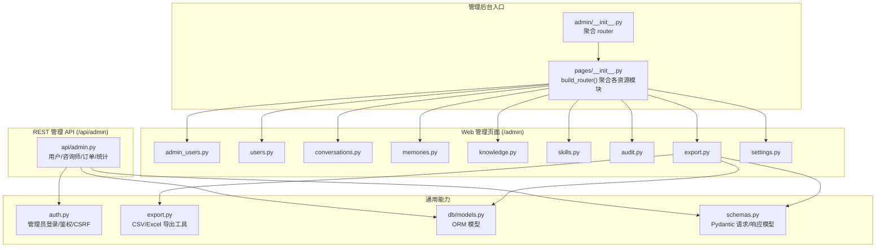
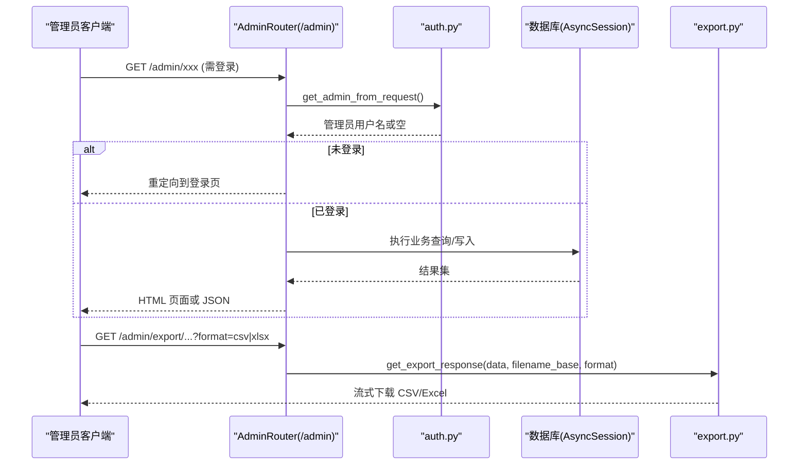
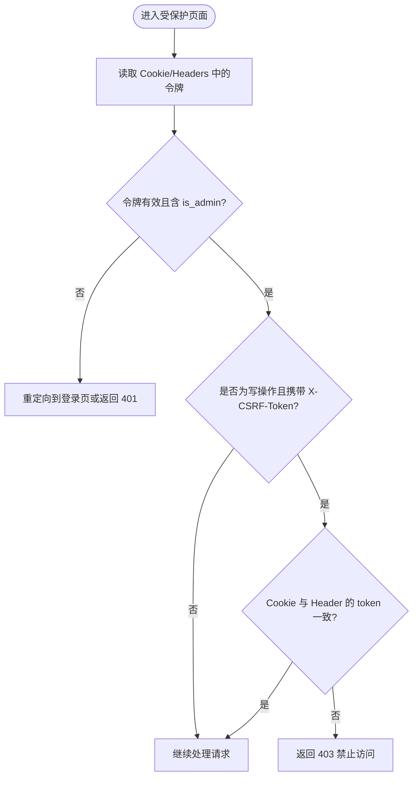
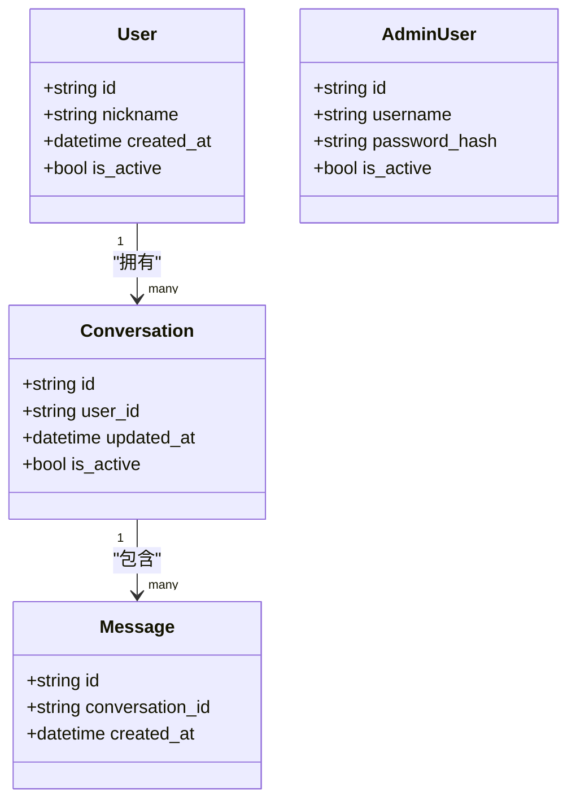
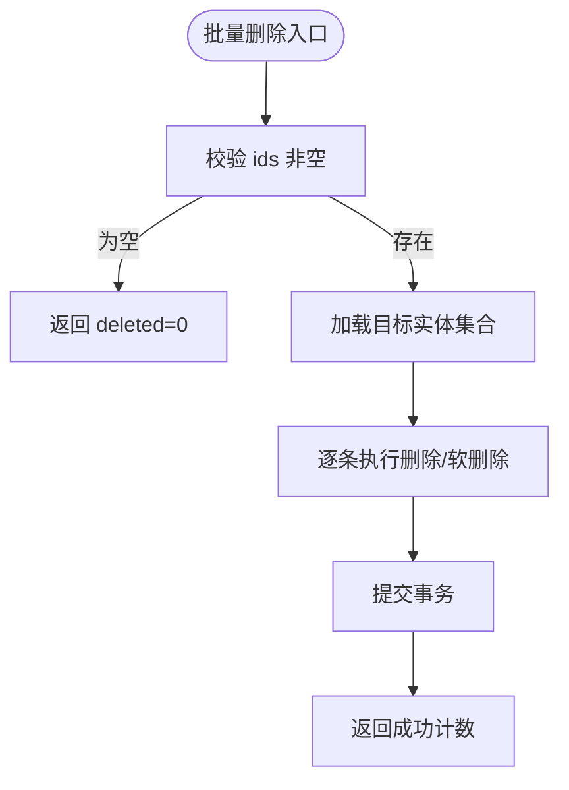
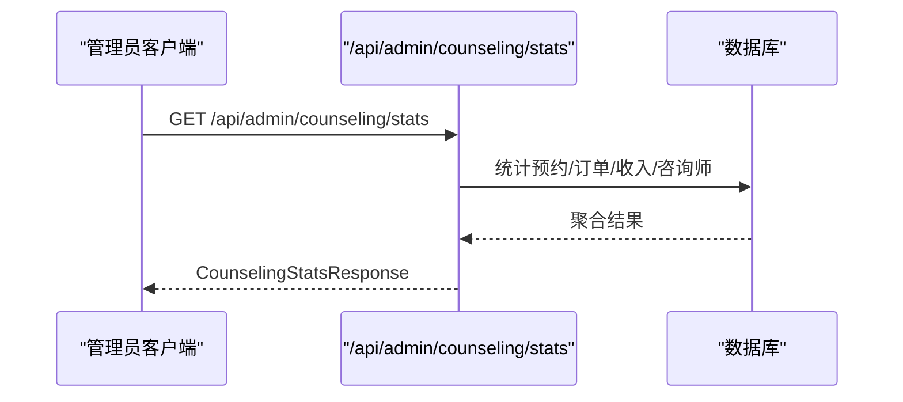
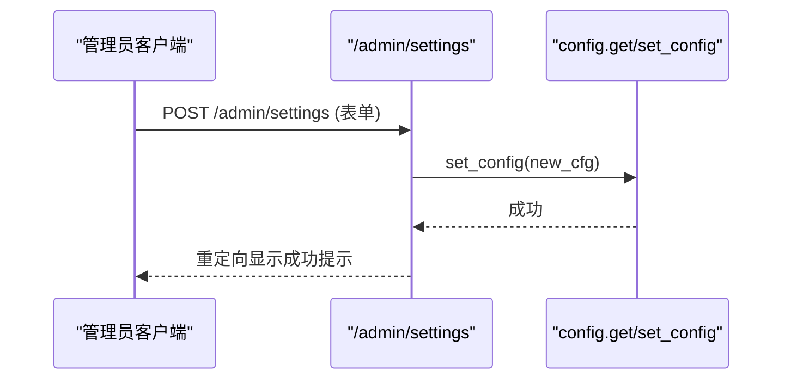
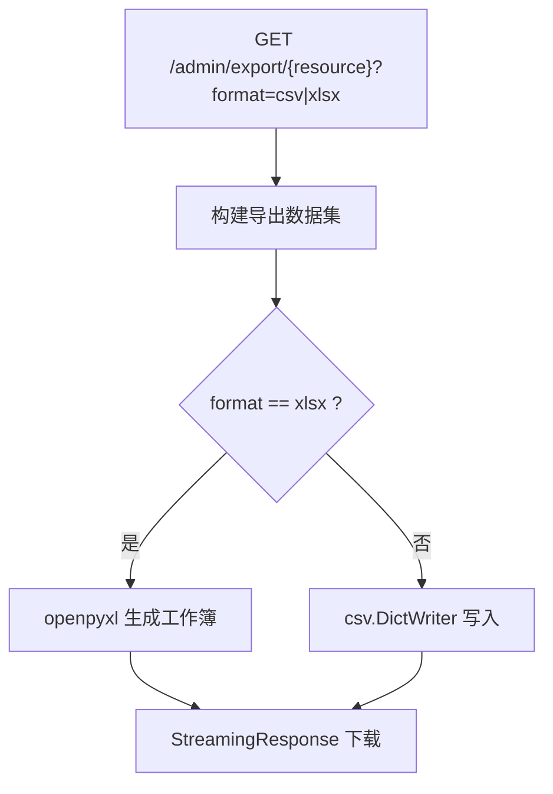
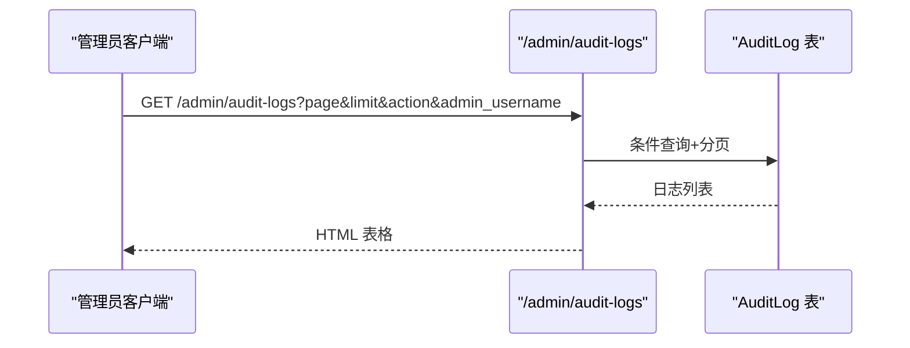
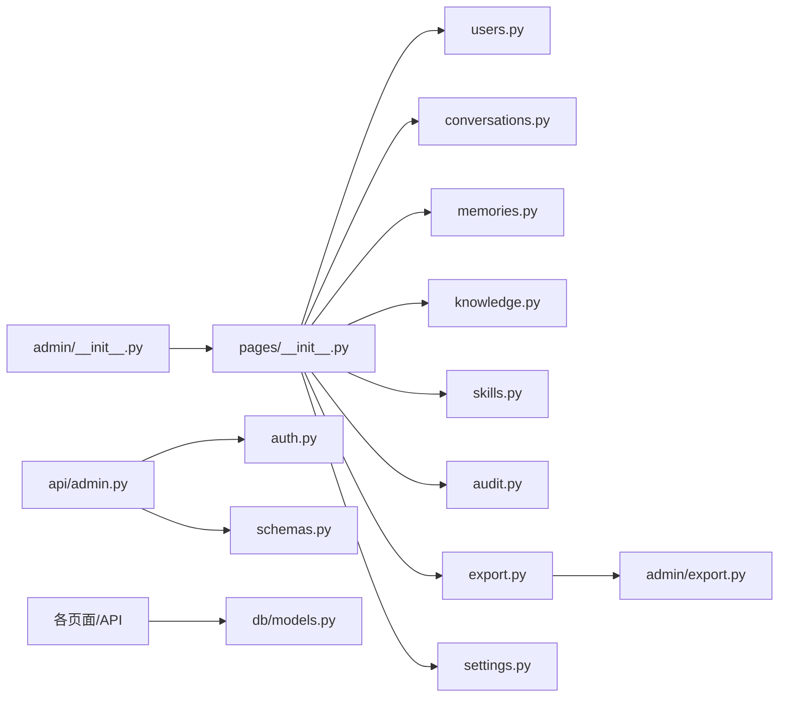

# 管理后台接口

<cite>
**本文引用的文件**   
- [hushai/meditation/admin/__init__.py](file://hushai/meditation/admin/__init__.py)
- [hushai/meditation/admin/pages/__init__.py](file://hushai/meditation/admin/pages/__init__.py)
- [hushai/meditation/api/admin.py](file://hushai/meditation/api/admin.py)
- [hushai/meditation/admin/auth.py](file://hushai/meditation/admin/auth.py)
- [hushai/meditation/admin/export.py](file://hushai/meditation/admin/export.py)
- [hushai/meditation/admin/pages/admin_users.py](file://hushai/meditation/admin/pages/admin_users.py)
- [hushai/meditation/admin/pages/users.py](file://hushai/meditation/admin/pages/users.py)
- [hushai/meditation/admin/pages/audit.py](file://hushai/meditation/admin/pages/audit.py)
- [hushai/meditation/admin/pages/export.py](file://hushai/meditation/admin/pages/export.py)
- [hushai/meditation/admin/pages/settings.py](file://hushai/meditation/admin/pages/settings.py)
- [hushai/meditation/db/models.py](file://hushai/meditation/db/models.py)
- [hushai/meditation/schemas.py](file://hushai/meditation/schemas.py)
</cite>

## 目录
1. [简介](#简介)
2. [项目结构](#项目结构)
3. [核心组件](#核心组件)
4. [架构总览](#架构总览)
5. [详细组件分析](#详细组件分析)
6. [依赖关系分析](#依赖关系分析)
7. [性能与扩展性](#性能与扩展性)
8. [故障排查指南](#故障排查指南)
9. [结论](#结论)
10. [附录：API 清单与示例](#附录api-清单与示例)

## 简介
本文件为 hush.ai 管理后台的完整 API 接口文档，覆盖管理员认证、用户管理、内容审核、数据分析、系统配置、数据导出等能力。重点说明：
- 管理员权限控制（基于 Cookie/Authorization Bearer 的管理员令牌）
- 操作审计日志记录与查询
- 批量数据处理（批量删除、导入导出）
- 数据导出与报表生成（CSV/Excel）
- 安全访问控制（CSRF、最小权限）与可追溯性
- 运维相关接口（统计概览、设置更新）

## 项目结构
管理后台由两部分组成：
- Web 管理页面路由（HTML 模板渲染），统一挂载于 /admin
- 面向程序化调用的 REST 风格 API（部分以 /api/admin 前缀暴露）

图示来源
- [hushai/meditation/admin/__init__.py:1-15](file://hushai/meditation/admin/__init__.py#L1-L15)
- [hushai/meditation/admin/pages/__init__.py:30-52](file://hushai/meditation/admin/pages/__init__.py#L30-L52)
- [hushai/meditation/api/admin.py:1-268](file://hushai/meditation/api/admin.py#L1-L268)
- [hushai/meditation/admin/auth.py:1-183](file://hushai/meditation/admin/auth.py#L1-L183)
- [hushai/meditation/admin/export.py:1-106](file://hushai/meditation/admin/export.py#L1-L106)
- [hushai/meditation/db/models.py:1-200](file://hushai/meditation/db/models.py#L1-L200)
- [hushai/meditation/schemas.py:1-541](file://hushai/meditation/schemas.py#L1-L541)

章节来源
- [hushai/meditation/admin/__init__.py:1-15](file://hushai/meditation/admin/__init__.py#L1-L15)
- [hushai/meditation/admin/pages/__init__.py:30-52](file://hushai/meditation/admin/pages/__init__.py#L30-L52)

## 核心组件
- 管理员认证与授权
  - 支持通过 Cookie admin_token 或 Authorization: Bearer 获取管理员身份
  - 提供 require_admin 装饰器用于页面级鉴权；API 侧使用 _require_admin 依赖注入
  - CSRF 保护：对写操作校验 X-CSRF-Token 与 cookie 中的 token 一致
- 数据导出
  - 统一的 CSV/Excel 导出工具，按时间戳生成文件名并返回流式下载
- 审计日志
  - 关键管理动作写入 AuditLog，支持按操作类型、管理员用户名筛选与分页
- 业务管理
  - 用户、对话、记忆、知识、技能、咨询师、预约、订单等资源的增删改查与批量操作
- 系统设置
  - 动态更新默认 LLM 提供商、模型、检索参数、远程知识源等

章节来源
- [hushai/meditation/admin/auth.py:104-183](file://hushai/meditation/admin/auth.py#L104-L183)
- [hushai/meditation/admin/export.py:1-106](file://hushai/meditation/admin/export.py#L1-L106)
- [hushai/meditation/admin/pages/audit.py:1-72](file://hushai/meditation/admin/pages/audit.py#L1-L72)
- [hushai/meditation/admin/pages/settings.py:1-123](file://hushai/meditation/admin/pages/settings.py#L1-L123)

## 架构总览
管理后台采用 FastAPI + SQLAlchemy 异步会话，前端模板渲染与 JSON API 并存。管理员凭据经 bcrypt 校验后签发 JWT，后续请求携带 Cookie 或 Bearer Token 进行鉴权。所有写操作均记录审计日志，便于追溯。

图示来源
- [hushai/meditation/admin/pages/__init__.py:30-52](file://hushai/meditation/admin/pages/__init__.py#L30-L52)
- [hushai/meditation/admin/auth.py:87-113](file://hushai/meditation/admin/auth.py#L87-L113)
- [hushai/meditation/admin/export.py:92-106](file://hushai/meditation/admin/export.py#L92-L106)

## 详细组件分析

### 管理员认证与安全
- 登录与会话
  - 支持从环境变量初始化默认管理员账号
  - 签发包含 is_admin 标志的 JWT，有效期 24 小时
- 鉴权方式
  - 页面端：Cookie admin_token
  - API 端：Authorization: Bearer <token>
- CSRF 保护
  - 写操作需携带 X-CSRF-Token，且与 cookie 中 admin_csrf_token 一致
- 错误码
  - 401 未登录或令牌无效
  - 403 CSRF 验证失败

图示来源
- [hushai/meditation/admin/auth.py:64-113](file://hushai/meditation/admin/auth.py#L64-L113)
- [hushai/meditation/admin/auth.py:164-183](file://hushai/meditation/admin/auth.py#L164-L183)

章节来源
- [hushai/meditation/admin/auth.py:1-183](file://hushai/meditation/admin/auth.py#L1-L183)

### 用户管理（Web 页面与 API）
- 列表与详情
  - 支持分页、搜索（昵称/OpenID）
  - 详情展示对话数、消息数、记忆摘要
- 状态切换
  - 启用/禁用用户
- 管理员用户管理
  - 新增/编辑/删除管理员账号（不允许删除当前登录者）

图示来源
- [hushai/meditation/db/models.py:37-96](file://hushai/meditation/db/models.py#L37-L96)
- [hushai/meditation/db/models.py:172-186](file://hushai/meditation/db/models.py#L172-L186)

章节来源
- [hushai/meditation/admin/pages/users.py:1-146](file://hushai/meditation/admin/pages/users.py#L1-L146)
- [hushai/meditation/admin/pages/admin_users.py:1-208](file://hushai/meditation/admin/pages/admin_users.py#L1-L208)
- [hushai/meditation/api/admin.py:37-103](file://hushai/meditation/api/admin.py#L37-L103)

### 内容审核与批量处理
- 对话管理
  - 列表、详情、按用户筛选
  - 批量软删除（标记 is_active=False）
- 记忆管理
  - 列表、分类/用户筛选
  - 单条删除、批量删除
- 知识条目
  - 列表、详情、导入页面
  - 单条删除、批量删除

图示来源
- [hushai/meditation/admin/pages/conversations.py:117-139](file://hushai/meditation/admin/pages/conversations.py#L117-L139)
- [hushai/meditation/admin/pages/memories.py:108-130](file://hushai/meditation/admin/pages/memories.py#L108-L130)
- [hushai/meditation/admin/pages/knowledge.py:141-163](file://hushai/meditation/admin/pages/knowledge.py#L141-L163)

章节来源
- [hushai/meditation/admin/pages/conversations.py:1-139](file://hushai/meditation/admin/pages/conversations.py#L1-L139)
- [hushai/meditation/admin/pages/memories.py:1-130](file://hushai/meditation/admin/pages/memories.py#L1-L130)
- [hushai/meditation/admin/pages/knowledge.py:1-163](file://hushai/meditation/admin/pages/knowledge.py#L1-L163)

### 数据分析与统计
- 咨询业务全局统计
  - 预约总数/待处理/已完成
  - 订单总数/总收入
  - 咨询师总数/在线数量
- 用户画像
  - 用户基本信息、对话/消息总量、记忆类别分布

图示来源
- [hushai/meditation/api/admin.py:116-156](file://hushai/meditation/api/admin.py#L116-L156)
- [hushai/meditation/schemas.py:532-541](file://hushai/meditation/schemas.py#L532-L541)

章节来源
- [hushai/meditation/api/admin.py:116-156](file://hushai/meditation/api/admin.py#L116-L156)
- [hushai/meditation/schemas.py:532-541](file://hushai/meditation/schemas.py#L532-L541)

### 系统配置
- 查看与更新系统设置
  - 默认 LLM 提供商/模型
  - 记忆与知识检索 top_k
  - 对话最大轮次
  - 第三方服务密钥与基础地址
  - 远程知识源配置（coze/ima/url）

图示来源
- [hushai/meditation/admin/pages/settings.py:40-123](file://hushai/meditation/admin/pages/settings.py#L40-L123)

章节来源
- [hushai/meditation/admin/pages/settings.py:1-123](file://hushai/meditation/admin/pages/settings.py#L1-L123)

### 数据导出与报表
- 导出范围
  - 对话、审计日志、用户、记忆、知识库
- 格式
  - CSV 与 Excel（xlsx）
- 特性
  - 自动附加时间戳文件名
  - 流式响应，适合大数据量

图示来源
- [hushai/meditation/admin/pages/export.py:17-207](file://hushai/meditation/admin/pages/export.py#L17-L207)
- [hushai/meditation/admin/export.py:12-106](file://hushai/meditation/admin/export.py#L12-L106)

章节来源
- [hushai/meditation/admin/pages/export.py:1-207](file://hushai/meditation/admin/pages/export.py#L1-L207)
- [hushai/meditation/admin/export.py:1-106](file://hushai/meditation/admin/export.py#L1-L106)

### 操作审计日志
- 记录内容
  - 管理员用户名、操作类型、资源类型/ID、详情、IP、UA
- 查询与导出
  - 支持按 action、admin_username 过滤与分页
  - 支持导出为 CSV/Excel

图示来源
- [hushai/meditation/admin/pages/audit.py:16-72](file://hushai/meditation/admin/pages/audit.py#L16-L72)
- [hushai/meditation/db/models.py:188-200](file://hushai/meditation/db/models.py#L188-L200)

章节来源
- [hushai/meditation/admin/pages/audit.py:1-72](file://hushai/meditation/admin/pages/audit.py#L1-L72)
- [hushai/meditation/db/models.py:188-200](file://hushai/meditation/db/models.py#L188-L200)

## 依赖关系分析
- 路由聚合
  - admin/__init__.py 暴露 router，供应用主入口挂载
  - pages/__init__.py 将各资源模块路由聚合至 /admin
- 鉴权依赖
  - 页面与 API 均依赖 auth.py 提供的管理员解析与 CSRF 校验
- 数据层依赖
  - 所有页面与 API 通过 AsyncSession 访问 ORM 模型
- 导出依赖
  - export.py 提供 CSV/Excel 导出工具，被 /admin/export/* 复用

图示来源
- [hushai/meditation/admin/__init__.py:1-15](file://hushai/meditation/admin/__init__.py#L1-L15)
- [hushai/meditation/admin/pages/__init__.py:30-52](file://hushai/meditation/admin/pages/__init__.py#L30-L52)
- [hushai/meditation/api/admin.py:1-268](file://hushai/meditation/api/admin.py#L1-L268)
- [hushai/meditation/admin/export.py:1-106](file://hushai/meditation/admin/export.py#L1-L106)
- [hushai/meditation/db/models.py:1-200](file://hushai/meditation/db/models.py#L1-L200)
- [hushai/meditation/schemas.py:1-541](file://hushai/meditation/schemas.py#L1-L541)

章节来源
- [hushai/meditation/admin/__init__.py:1-15](file://hushai/meditation/admin/__init__.py#L1-L15)
- [hushai/meditation/admin/pages/__init__.py:30-52](file://hushai/meditation/admin/pages/__init__.py#L30-L52)

## 性能与扩展性
- 分页与限流
  - 列表接口普遍支持 limit/offset，建议限制上限避免大结果集
- 导出优化
  - 使用 StreamingResponse 降低内存峰值
  - 大数据量时优先选择 CSV，减少序列化开销
- 索引与查询
  - 常用字段（如 user_id、category、created_at）具备索引，利于排序与过滤
- 并发与事务
  - 使用异步会话提升吞吐；批量操作注意事务粒度与回滚策略

[本节为通用指导，不直接分析具体文件]

## 故障排查指南
- 401 未登录或令牌无效
  - 检查 Cookie admin_token 是否存在且未过期
  - 若调用 API，确认 Authorization: Bearer 是否携带有效令牌
- 403 CSRF 验证失败
  - 确保写请求携带 X-CSRF-Token，且与 cookie 中 admin_csrf_token 一致
- 404 资源不存在
  - 核对路径参数是否正确
- 400 参数校验失败
  - 检查必填字段、长度与取值范围
- 导出无数据
  - 确认查询条件是否过严，或数据尚未入库

章节来源
- [hushai/meditation/admin/auth.py:104-183](file://hushai/meditation/admin/auth.py#L104-L183)
- [hushai/meditation/admin/pages/users.py:126-146](file://hushai/meditation/admin/pages/users.py#L126-L146)
- [hushai/meditation/admin/pages/knowledge.py:119-163](file://hushai/meditation/admin/pages/knowledge.py#L119-L163)

## 结论
本管理后台在安全性、可追溯性与可扩展性方面提供了完善的基础能力：管理员令牌与 CSRF 双重保障、全链路审计日志、统一的导出工具与分页查询。建议在后续迭代中补充更细粒度的 RBAC、速率限制与监控告警指标采集，以满足更大规模运营需求。

[本节为总结性内容，不直接分析具体文件]

## 附录：API 清单与示例

### 管理员认证与安全
- 获取管理员身份
  - 方法：页面端 Cookie admin_token；API 端 Authorization: Bearer
  - 参考实现：[hushai/meditation/admin/auth.py:87-113](file://hushai/meditation/admin/auth.py#L87-L113)
- CSRF 校验
  - 写操作需携带 X-CSRF-Token
  - 参考实现：[hushai/meditation/admin/auth.py:164-183](file://hushai/meditation/admin/auth.py#L164-L183)

章节来源
- [hushai/meditation/admin/auth.py:87-113](file://hushai/meditation/admin/auth.py#L87-L113)
- [hushai/meditation/admin/auth.py:164-183](file://hushai/meditation/admin/auth.py#L164-L183)

### 用户管理
- 获取用户资料（API）
  - 路径：GET /api/admin/users/{user_id}/profile
  - 鉴权：需要管理员令牌
  - 响应模型：UserProfile
  - 参考实现：[hushai/meditation/api/admin.py:37-74](file://hushai/meditation/api/admin.py#L37-L74)
  - 响应字段参考：[hushai/meditation/schemas.py:153-160](file://hushai/meditation/schemas.py#L153-L160)
- 用户列表（API）
  - 路径：GET /api/admin/users?limit&offset
  - 鉴权：需要管理员令牌
  - 参考实现：[hushai/meditation/api/admin.py:77-103](file://hushai/meditation/api/admin.py#L77-L103)
- 用户列表（Web）
  - 路径：GET /admin/users?page&limit&search
  - 鉴权：需要管理员登录
  - 参考实现：[hushai/meditation/admin/pages/users.py:18-65](file://hushai/meditation/admin/pages/users.py#L18-L65)
- 用户详情（Web）
  - 路径：GET /admin/users/{user_id}
  - 鉴权：需要管理员登录
  - 参考实现：[hushai/meditation/admin/pages/users.py:68-123](file://hushai/meditation/admin/pages/users.py#L68-L123)
- 切换用户状态（API）
  - 路径：POST /api/users/{user_id}/toggle-status
  - 鉴权：需要管理员登录
  - 参考实现：[hushai/meditation/admin/pages/users.py:126-146](file://hushai/meditation/admin/pages/users.py#L126-L146)

章节来源
- [hushai/meditation/api/admin.py:37-103](file://hushai/meditation/api/admin.py#L37-L103)
- [hushai/meditation/admin/pages/users.py:18-146](file://hushai/meditation/admin/pages/users.py#L18-L146)
- [hushai/meditation/schemas.py:153-160](file://hushai/meditation/schemas.py#L153-L160)

### 内容审核与批量处理
- 对话列表（Web）
  - 路径：GET /admin/conversations?page&limit&user_id
  - 鉴权：需要管理员登录
  - 参考实现：[hushai/meditation/admin/pages/conversations.py:22-70](file://hushai/meditation/admin/pages/conversations.py#L22-L70)
- 对话详情（Web）
  - 路径：GET /admin/conversations/{conversation_id}
  - 鉴权：需要管理员登录
  - 参考实现：[hushai/meditation/admin/pages/conversations.py:73-114](file://hushai/meditation/admin/pages/conversations.py#L73-L114)
- 批量删除对话（API）
  - 路径：POST /api/conversations/batch-delete
  - 请求体：BatchDeleteRequest(ids: list[str])
  - 鉴权：需要管理员登录
  - 参考实现：[hushai/meditation/admin/pages/conversations.py:117-139](file://hushai/meditation/admin/pages/conversations.py#L117-L139)
- 记忆列表（Web）
  - 路径：GET /admin/memories?page&limit&user_id&category
  - 鉴权：需要管理员登录
  - 参考实现：[hushai/meditation/admin/pages/memories.py:22-83](file://hushai/meditation/admin/pages/memories.py#L22-L83)
- 删除记忆（API）
  - 路径：DELETE /api/memories/{memory_id}
  - 鉴权：需要管理员登录
  - 参考实现：[hushai/meditation/admin/pages/memories.py:86-105](file://hushai/meditation/admin/pages/memories.py#L86-L105)
- 批量删除记忆（API）
  - 路径：POST /api/memories/batch-delete
  - 请求体：BatchDeleteRequest(ids: list[str])
  - 鉴权：需要管理员登录
  - 参考实现：[hushai/meditation/admin/pages/memories.py:108-130](file://hushai/meditation/admin/pages/memories.py#L108-L130)
- 知识列表（Web）
  - 路径：GET /admin/knowledge?page&limit&search
  - 鉴权：需要管理员登录
  - 参考实现：[hushai/meditation/admin/pages/knowledge.py:22-71](file://hushai/meditation/admin/pages/knowledge.py#L22-L71)
- 知识详情（Web）
  - 路径：GET /admin/knowledge/{item_id}
  - 鉴权：需要管理员登录
  - 参考实现：[hushai/meditation/admin/pages/knowledge.py:74-98](file://hushai/meditation/admin/pages/knowledge.py#L74-L98)
- 删除知识（API）
  - 路径：DELETE /api/knowledge/{item_id}
  - 鉴权：需要管理员登录
  - 参考实现：[hushai/meditation/admin/pages/knowledge.py:119-138](file://hushai/meditation/admin/pages/knowledge.py#L119-L138)
- 批量删除知识（API）
  - 路径：POST /api/knowledge/batch-delete
  - 请求体：BatchDeleteRequest(ids: list[str])
  - 鉴权：需要管理员登录
  - 参考实现：[hushai/meditation/admin/pages/knowledge.py:141-163](file://hushai/meditation/admin/pages/knowledge.py#L141-L163)

章节来源
- [hushai/meditation/admin/pages/conversations.py:22-139](file://hushai/meditation/admin/pages/conversations.py#L22-L139)
- [hushai/meditation/admin/pages/memories.py:22-130](file://hushai/meditation/admin/pages/memories.py#L22-L130)
- [hushai/meditation/admin/pages/knowledge.py:22-163](file://hushai/meditation/admin/pages/knowledge.py#L22-L163)

### 数据分析与统计
- 咨询业务统计（API）
  - 路径：GET /api/admin/counseling/stats
  - 鉴权：需要管理员令牌
  - 响应模型：CounselingStatsResponse
  - 参考实现：[hushai/meditation/api/admin.py:116-156](file://hushai/meditation/api/admin.py#L116-L156)
  - 响应字段参考：[hushai/meditation/schemas.py:532-541](file://hushai/meditation/schemas.py#L532-L541)
- 咨询师列表（API）
  - 路径：GET /api/admin/counselors?status&limit&offset
  - 鉴权：需要管理员令牌
  - 参考实现：[hushai/meditation/api/admin.py:193-228](file://hushai/meditation/api/admin.py#L193-L228)
- 审核咨询师（API）
  - 路径：POST /api/admin/counselors/{counselor_id}/review
  - 请求体：{action: approve|reject|disable, reason?: string}
  - 鉴权：需要管理员令牌
  - 参考实现：[hushai/meditation/api/admin.py:159-191](file://hushai/meditation/api/admin.py#L159-L191)
- 订单列表（API）
  - 路径：GET /api/admin/orders?status&limit&offset
  - 鉴权：需要管理员令牌
  - 参考实现：[hushai/meditation/api/admin.py:231-267](file://hushai/meditation/api/admin.py#L231-L267)

章节来源
- [hushai/meditation/api/admin.py:116-267](file://hushai/meditation/api/admin.py#L116-L267)
- [hushai/meditation/schemas.py:532-541](file://hushai/meditation/schemas.py#L532-L541)

### 系统配置
- 设置页面（Web）
  - 路径：GET /admin/settings
  - 鉴权：需要管理员登录
  - 参考实现：[hushai/meditation/admin/pages/settings.py:15-37](file://hushai/meditation/admin/pages/settings.py#L15-L37)
- 更新设置（Web）
  - 路径：POST /admin/settings
  - 表单字段：default_llm_provider/default_llm_model/memory_top_k/knowledge_top_k/conversation_max_turns/openai_api_key/openai_base_url/deepseek_api_key/deepseek_base_url/deepseek_model/zhipu_api_key/zhipu_base_url/zhipu_model/kimi_api_key/kimi_base_url/kimi_model/save_remote_sources/coze_api_base/coze_api_token/coze_dataset_id/ima_urls/coze_urls
  - 鉴权：需要管理员登录
  - 参考实现：[hushai/meditation/admin/pages/settings.py:40-123](file://hushai/meditation/admin/pages/settings.py#L40-L123)

章节来源
- [hushai/meditation/admin/pages/settings.py:15-123](file://hushai/meditation/admin/pages/settings.py#L15-L123)

### 数据导出与报表
- 导出对话（Web）
  - 路径：GET /admin/export/conversations?user_id&format
  - 鉴权：需要管理员登录
  - 参考实现：[hushai/meditation/admin/pages/export.py:17-51](file://hushai/meditation/admin/pages/export.py#L17-L51)
- 导出审计日志（Web）
  - 路径：GET /admin/export/audit-logs?action&admin_username&format
  - 鉴权：需要管理员登录
  - 参考实现：[hushai/meditation/admin/pages/export.py:54-92](file://hushai/meditation/admin/pages/export.py#L54-L92)
- 导出用户（Web）
  - 路径：GET /admin/export/users?search&format
  - 鉴权：需要管理员登录
  - 参考实现：[hushai/meditation/admin/pages/export.py:95-128](file://hushai/meditation/admin/pages/export.py#L95-L128)
- 导出记忆（Web）
  - 路径：GET /admin/export/memories?user_id&category&format
  - 鉴权：需要管理员登录
  - 参考实现：[hushai/meditation/admin/pages/export.py:131-169](file://hushai/meditation/admin/pages/export.py#L131-L169)
- 导出知识库（Web）
  - 路径：GET /admin/export/knowledge?search&format
  - 鉴权：需要管理员登录
  - 参考实现：[hushai/meditation/admin/pages/export.py:172-206](file://hushai/meditation/admin/pages/export.py#L172-L206)
- 导出工具（通用）
  - 函数：get_export_response(data, filename_base, format)
  - 参考实现：[hushai/meditation/admin/export.py:92-106](file://hushai/meditation/admin/export.py#L92-L106)

章节来源
- [hushai/meditation/admin/pages/export.py:17-206](file://hushai/meditation/admin/pages/export.py#L17-L206)
- [hushai/meditation/admin/export.py:92-106](file://hushai/meditation/admin/export.py#L92-L106)

### 操作审计日志
- 审计日志页面（Web）
  - 路径：GET /admin/audit-logs?page&limit&action&admin_username
  - 鉴权：需要管理员登录
  - 参考实现：[hushai/meditation/admin/pages/audit.py:16-72](file://hushai/meditation/admin/pages/audit.py#L16-L72)
- 审计日志模型
  - 字段：admin_username/action/resource_type/resource_id/detail/ip_address/user_agent
  - 参考实现：[hushai/meditation/db/models.py:188-200](file://hushai/meditation/db/models.py#L188-L200)

章节来源
- [hushai/meditation/admin/pages/audit.py:16-72](file://hushai/meditation/admin/pages/audit.py#L16-L72)
- [hushai/meditation/db/models.py:188-200](file://hushai/meditation/db/models.py#L188-L200)