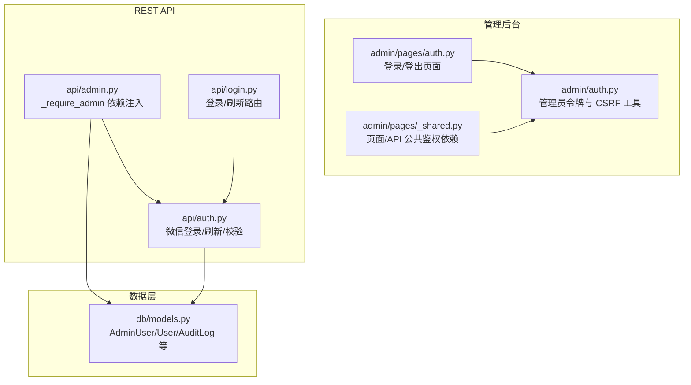
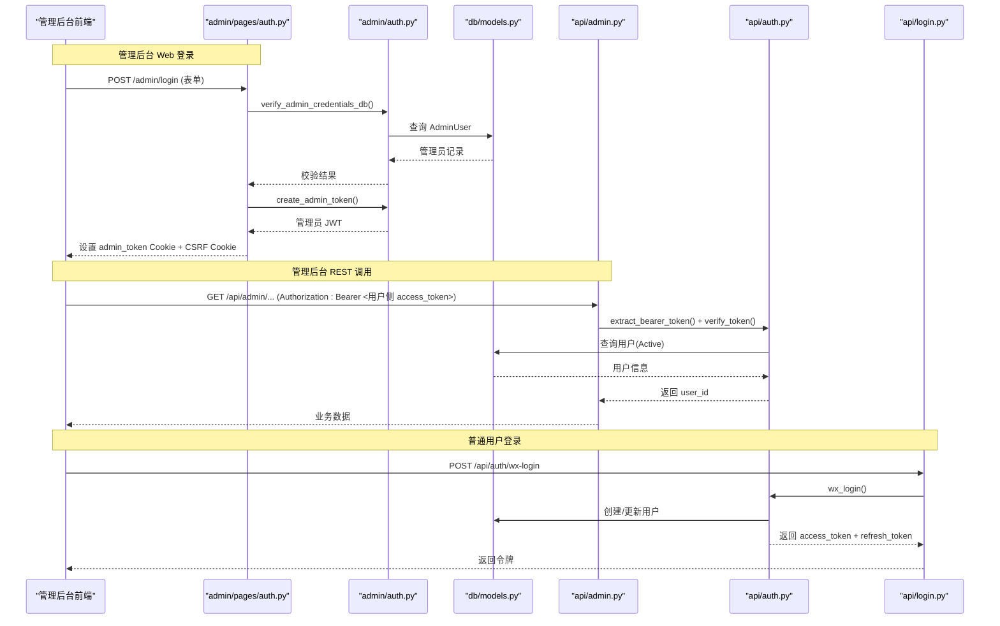
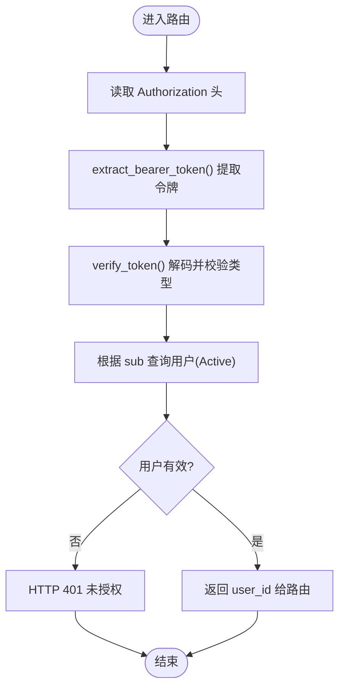
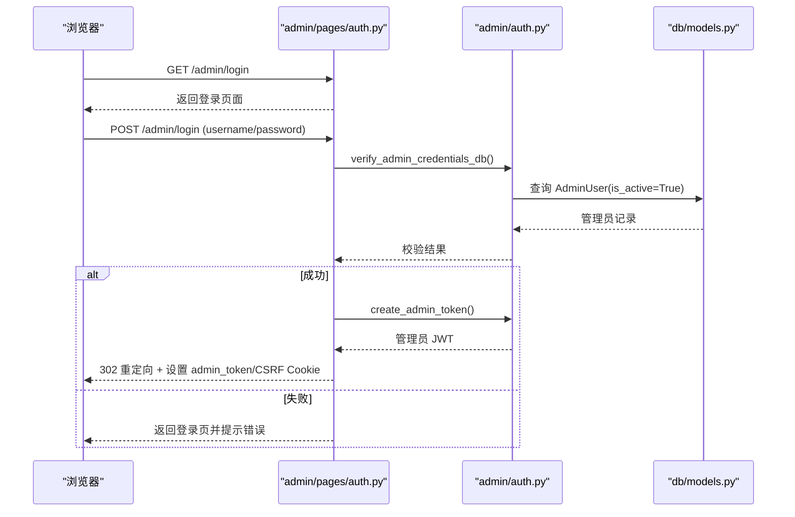
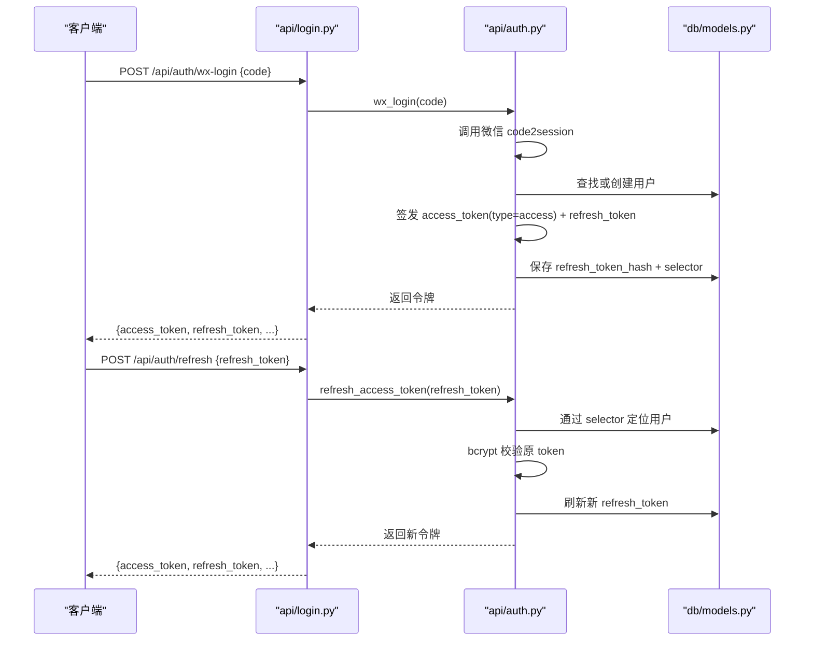
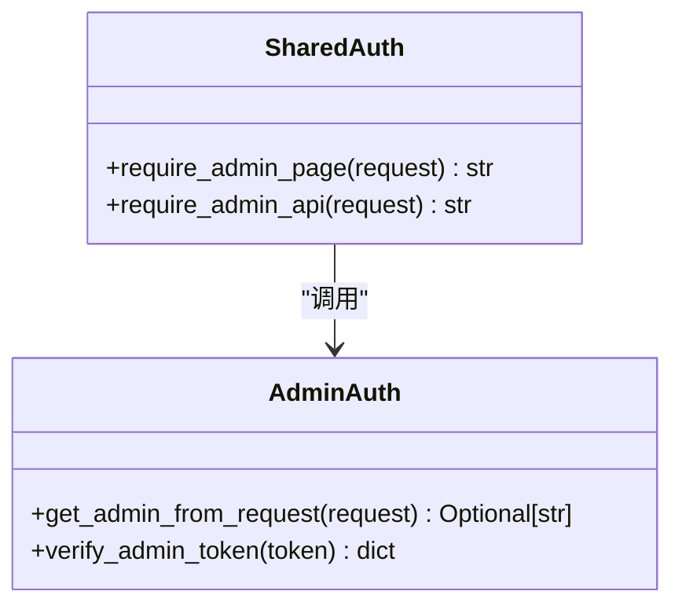
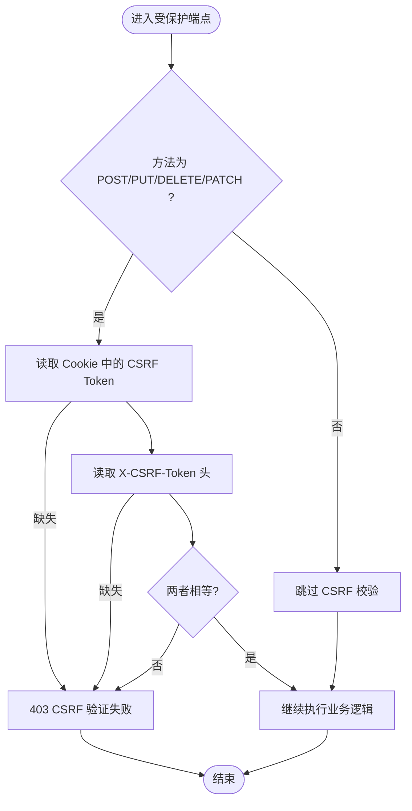
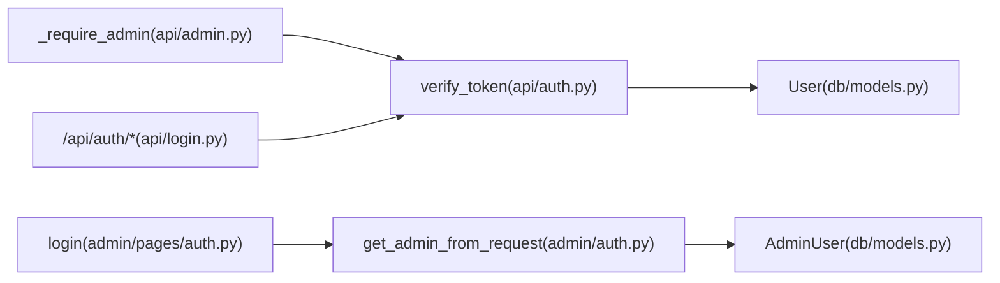

# 管理员认证接口

<cite>
**本文引用的文件**   
- [hushai/meditation/admin/auth.py](file://hushai/meditation/admin/auth.py)
- [hushai/meditation/api/admin.py](file://hushai/meditation/api/admin.py)
- [hushai/meditation/api/auth.py](file://hushai/meditation/api/auth.py)
- [hushai/meditation/api/login.py](file://hushai/meditation/api/login.py)
- [hushai/meditation/admin/pages/_shared.py](file://hushai/meditation/admin/pages/_shared.py)
- [hushai/meditation/admin/pages/auth.py](file://hushai/meditation/admin/pages/auth.py)
- [hushai/meditation/db/models.py](file://hushai/meditation/db/models.py)
- [hushai/meditation/schemas.py](file://hushai/meditation/schemas.py)
</cite>

## 目录
1. [简介](#简介)
2. [项目结构](#项目结构)
3. [核心组件](#核心组件)
4. [架构总览](#架构总览)
5. [详细组件分析](#详细组件分析)
6. [依赖关系分析](#依赖关系分析)
7. [性能与安全考量](#性能与安全考量)
8. [故障排查指南](#故障排查指南)
9. [结论](#结论)
10. [附录：认证流程示例与最佳实践](#附录：认证流程示例与最佳实践)

## 简介
本文件为 hush.ai 管理后台的认证系统提供权威 API 文档，聚焦以下目标：
- 管理员身份验证、权限检查、Token 验证等安全机制
- _require_admin 依赖注入函数的工作原理（Bearer Token 提取、用户权限验证、会话管理等）
- 管理员与普通用户的权限差异及多级权限控制设计模式
- 完整的认证流程示例（登录获取 Token、请求头设置、错误处理）
- 安全最佳实践与常见问题解决方案

## 项目结构
围绕“管理后台认证”的关键代码分布在如下模块：
- 管理后台 Web 登录与 Cookie 会话：admin/pages/auth.py、admin/pages/_shared.py
- 管理后台通用鉴权工具：admin/auth.py
- 面向管理后台的 REST API 路由与依赖注入：api/admin.py
- 普通用户微信登录与 Access/Refresh Token：api/auth.py、api/login.py
- 数据模型（管理员、普通用户、审计日志等）：db/models.py
- 统一响应/请求模型：schemas.py

图表来源
- [hushai/meditation/admin/pages/auth.py:1-65](file://hushai/meditation/admin/pages/auth.py#L1-L65)
- [hushai/meditation/admin/pages/_shared.py:72-110](file://hushai/meditation/admin/pages/_shared.py#L72-L110)
- [hushai/meditation/admin/auth.py:64-102](file://hushai/meditation/admin/auth.py#L64-L102)
- [hushai/meditation/api/admin.py:25-35](file://hushai/meditation/api/admin.py#L25-L35)
- [hushai/meditation/api/auth.py:63-118](file://hushai/meditation/api/auth.py#L63-L118)
- [hushai/meditation/api/login.py:21-53](file://hushai/meditation/api/login.py#L21-L53)
- [hushai/meditation/db/models.py:172-202](file://hushai/meditation/db/models.py#L172-L202)

章节来源
- [hushai/meditation/admin/pages/auth.py:1-65](file://hushai/meditation/admin/pages/auth.py#L1-L65)
- [hushai/meditation/admin/pages/_shared.py:72-110](file://hushai/meditation/admin/pages/_shared.py#L72-L110)
- [hushai/meditation/admin/auth.py:64-102](file://hushai/meditation/admin/auth.py#L64-L102)
- [hushai/meditation/api/admin.py:25-35](file://hushai/meditation/api/admin.py#L25-L35)
- [hushai/meditation/api/auth.py:63-118](file://hushai/meditation/api/auth.py#L63-L118)
- [hushai/meditation/api/login.py:21-53](file://hushai/meditation/api/login.py#L21-L53)
- [hushai/meditation/db/models.py:172-202](file://hushai/meditation/db/models.py#L172-L202)

## 核心组件
- 管理员认证工具集（admin/auth.py）
  - 密码哈希与校验、数据库凭据校验、管理员 JWT 签发与校验、从请求中提取管理员身份、CSRF 生成/校验与保护装饰器
- 管理后台 Web 登录（admin/pages/auth.py）
  - 登录页渲染、表单提交、设置 admin_token Cookie 与 CSRF Cookie、登出清理 Cookie
- 页面/通用鉴权依赖（admin/pages/_shared.py）
  - require_admin_page / require_admin_api 用于页面与 API 的统一鉴权入口
- 管理后台 REST 依赖注入（api/admin.py）
  - _require_admin 从 Authorization 头提取 Bearer Token，调用用户侧 token 校验并返回当前用户标识
- 普通用户认证（api/auth.py, api/login.py）
  - 微信登录、Access/Refresh Token 签发与刷新、token 类型强制校验、从 token 解析用户 ID

章节来源
- [hushai/meditation/admin/auth.py:24-102](file://hushai/meditation/admin/auth.py#L24-L102)
- [hushai/meditation/admin/pages/auth.py:20-65](file://hushai/meditation/admin/pages/auth.py#L20-L65)
- [hushai/meditation/admin/pages/_shared.py:72-110](file://hushai/meditation/admin/pages/_shared.py#L72-L110)
- [hushai/meditation/api/admin.py:25-35](file://hushai/meditation/api/admin.py#L25-L35)
- [hushai/meditation/api/auth.py:45-118](file://hushai/meditation/api/auth.py#L45-L118)
- [hushai/meditation/api/login.py:21-53](file://hushai/meditation/api/login.py#L21-L53)

## 架构总览
下图展示了“管理后台 Web 登录 + 管理后台 REST 鉴权 + 普通用户登录”的整体交互。

图表来源
- [hushai/meditation/admin/pages/auth.py:28-55](file://hushai/meditation/admin/pages/auth.py#L28-L55)
- [hushai/meditation/admin/auth.py:32-73](file://hushai/meditation/admin/auth.py#L32-L73)
- [hushai/meditation/api/admin.py:25-35](file://hushai/meditation/api/admin.py#L25-L35)
- [hushai/meditation/api/auth.py:63-118](file://hushai/meditation/api/auth.py#L63-L118)
- [hushai/meditation/api/login.py:21-53](file://hushai/meditation/api/login.py#L21-L53)
- [hushai/meditation/db/models.py:172-202](file://hushai/meditation/db/models.py#L172-L202)

## 详细组件分析

### 组件一：_require_admin 依赖注入（管理后台 REST 鉴权）
- 职责
  - 从请求头 Authorization 中按 Bearer 方案提取 token
  - 调用用户侧 token 校验逻辑，确保 token 类型为 access
  - 通过数据库确认用户存在且启用
  - 将当前用户标识作为依赖返回值供路由使用
- 关键实现要点
  - 使用 Header 参数自动读取 Authorization
  - 复用 api/auth.py 中的 extract_bearer_token 与 get_current_user_id
  - 失败时抛出 HTTP 401，携带具体错误信息
- 典型用法
  - 在管理后台路由中以 Depends(_require_admin) 声明，如列表用户、审核咨询师、订单管理等

图表来源
- [hushai/meditation/api/admin.py:25-35](file://hushai/meditation/api/admin.py#L25-L35)
- [hushai/meditation/api/auth.py:109-131](file://hushai/meditation/api/auth.py#L109-L131)

章节来源
- [hushai/meditation/api/admin.py:25-35](file://hushai/meditation/api/admin.py#L25-L35)
- [hushai/meditation/api/auth.py:109-131](file://hushai/meditation/api/auth.py#L109-L131)

### 组件二：管理员 Web 登录与 Cookie 会话
- 职责
  - 提供 /admin/login 页面与登录处理
  - 校验管理员凭据（用户名+密码），成功后签发管理员 JWT
  - 设置 admin_token Cookie 与 CSRF Cookie，支持登出清理
- 关键实现要点
  - 使用 bcrypt 进行密码哈希与校验
  - 管理员 JWT 包含 is_admin 标记，便于后续校验
  - CSRF Cookie 在生产环境启用 secure，开发环境关闭以便本地调试
- 相关工具
  - generate_csrf_token / set_csrf_cookie / verify_csrf_token / require_csrf

图表来源
- [hushai/meditation/admin/pages/auth.py:28-55](file://hushai/meditation/admin/pages/auth.py#L28-L55)
- [hushai/meditation/admin/auth.py:32-73](file://hushai/meditation/admin/auth.py#L32-L73)
- [hushai/meditation/db/models.py:172-186](file://hushai/meditation/db/models.py#L172-L186)

章节来源
- [hushai/meditation/admin/pages/auth.py:20-65](file://hushai/meditation/admin/pages/auth.py#L20-L65)
- [hushai/meditation/admin/auth.py:24-73](file://hushai/meditation/admin/auth.py#L24-L73)
- [hushai/meditation/db/models.py:172-186](file://hushai/meditation/db/models.py#L172-L186)

### 组件三：普通用户登录与 Token 体系（微信 OAuth）
- 职责
  - 通过微信 code 换取 session_key/openid，完成用户识别
  - 签发 Access Token（JWT，type=access）与 Refresh Token（随机串）
  - 支持用 Refresh Token 刷新 Access Token
  - 提供 verify_token 强制校验 token 类型，防止混淆
- 关键实现要点
  - Access Token 短时效，Refresh Token 长时效
  - Refresh Token 以 bcrypt 哈希存储，并使用 SHA-256 selector 做 O(1) 定位，避免全表扫描
  - 登录/刷新接口封装于 login.py 路由

图表来源
- [hushai/meditation/api/login.py:21-53](file://hushai/meditation/api/login.py#L21-L53)
- [hushai/meditation/api/auth.py:63-164](file://hushai/meditation/api/auth.py#L63-L164)
- [hushai/meditation/db/models.py:37-61](file://hushai/meditation/db/models.py#L37-L61)

章节来源
- [hushai/meditation/api/login.py:21-53](file://hushai/meditation/api/login.py#L21-L53)
- [hushai/meditation/api/auth.py:45-164](file://hushai/meditation/api/auth.py#L45-L164)
- [hushai/meditation/db/models.py:37-61](file://hushai/meditation/db/models.py#L37-L61)

### 组件四：页面级与管理后台 API 级鉴权依赖
- 页面级 require_admin_page
  - 基于 Cookie 中的 admin_token 或 Authorization 头解析管理员身份
  - 未登录返回 401 或重定向到登录页
- API 级 require_admin_api
  - 与页面类似，但直接返回 401 而非重定向
- 底层实现
  - 使用 admin/auth.py 的 get_admin_from_request 与 verify_admin_token

图表来源
- [hushai/meditation/admin/pages/_shared.py:72-91](file://hushai/meditation/admin/pages/_shared.py#L72-L91)
- [hushai/meditation/admin/auth.py:87-102](file://hushai/meditation/admin/auth.py#L87-L102)

章节来源
- [hushai/meditation/admin/pages/_shared.py:72-91](file://hushai/meditation/admin/pages/_shared.py#L72-L91)
- [hushai/meditation/admin/auth.py:87-102](file://hushai/meditation/admin/auth.py#L87-L102)

### 组件五：CSRF 保护
- 生成与设置
  - generate_csrf_token 生成安全随机令牌
  - set_csrf_cookie 写入 Cookie，生产环境启用 secure，开发环境关闭
- 校验与装饰器
  - verify_csrf_token 比较 Cookie 与 X-CSRF-Token 头
  - require_csrf 对写操作进行防护

图表来源
- [hushai/meditation/admin/auth.py:136-182](file://hushai/meditation/admin/auth.py#L136-L182)

章节来源
- [hushai/meditation/admin/auth.py:136-182](file://hushai/meditation/admin/auth.py#L136-L182)

## 依赖关系分析
- 管理后台 REST 鉴权链
  - api/admin.py:_require_admin -> api/auth.py:extract_bearer_token + verify_token -> db/models.py:User
- 管理后台 Web 鉴权链
  - admin/pages/auth.py -> admin/auth.py:get_admin_from_request -> admin/auth.py:verify_admin_token -> db/models.py:AdminUser
- 普通用户登录链
  - api/login.py -> api/auth.py:wx_login/refresh_access_token -> db/models.py:User

图表来源
- [hushai/meditation/api/admin.py:25-35](file://hushai/meditation/api/admin.py#L25-L35)
- [hushai/meditation/api/auth.py:109-131](file://hushai/meditation/api/auth.py#L109-L131)
- [hushai/meditation/admin/pages/auth.py:28-55](file://hushai/meditation/admin/pages/auth.py#L28-L55)
- [hushai/meditation/admin/auth.py:87-102](file://hushai/meditation/admin/auth.py#L87-L102)
- [hushai/meditation/db/models.py:37-61](file://hushai/meditation/db/models.py#L37-L61)
- [hushai/meditation/db/models.py:172-186](file://hushai/meditation/db/models.py#L172-L186)

章节来源
- [hushai/meditation/api/admin.py:25-35](file://hushai/meditation/api/admin.py#L25-L35)
- [hushai/meditation/api/auth.py:109-131](file://hushai/meditation/api/auth.py#L109-L131)
- [hushai/meditation/admin/pages/auth.py:28-55](file://hushai/meditation/admin/pages/auth.py#L28-L55)
- [hushai/meditation/admin/auth.py:87-102](file://hushai/meditation/admin/auth.py#L87-L102)
- [hushai/meditation/db/models.py:37-61](file://hushai/meditation/db/models.py#L37-L61)
- [hushai/meditation/db/models.py:172-186](file://hushai/meditation/db/models.py#L172-L186)

## 性能与安全考量
- 性能
  - Refresh Token 刷新采用 selector（SHA-256）索引定位用户，再执行 bcrypt 校验，避免全表扫描带来的 DoS 风险
  - 统计类接口使用聚合查询减少多次往返
- 安全
  - 管理员凭据使用 bcrypt 哈希存储与校验
  - 管理员 JWT 包含 is_admin 标记，校验时拒绝非管理员 token
  - CSRF 保护针对写操作，Cookie 的 secure 属性随环境切换
  - 普通用户 Access Token 强制 type=access，防止未来引入 refresh JWT 时的类型混淆
  - 敏感字段（如服务记录）采用加密存储策略（见数据模型注释）

章节来源
- [hushai/meditation/api/auth.py:36-43](file://hushai/meditation/api/auth.py#L36-L43)
- [hushai/meditation/api/auth.py:109-118](file://hushai/meditation/api/auth.py#L109-L118)
- [hushai/meditation/admin/auth.py:76-84](file://hushai/meditation/admin/auth.py#L76-L84)
- [hushai/meditation/admin/auth.py:146-161](file://hushai/meditation/admin/auth.py#L146-L161)
- [hushai/meditation/db/models.py:386-411](file://hushai/meditation/db/models.py#L386-L411)

## 故障排查指南
- 401 未授权
  - 管理后台 REST：检查 Authorization 头是否包含正确的 Bearer Token；确认 token 未被篡改且未过期
  - 管理后台 Web：检查 admin_token Cookie 是否存在且有效；确认 CSRF Cookie 是否正确设置
- 403 CSRF 验证失败
  - 确认请求方法为写操作且携带 X-CSRF-Token 头，值与 Cookie 一致
- 登录失败
  - 管理员登录：核对用户名与密码；确认管理员账号处于启用状态
  - 普通用户登录：核对微信 code 有效性；检查网络连通性与微信回调配置
- 刷新失败
  - 检查 refresh_token 是否匹配数据库中已保存的哈希；确认用户仍处于启用状态

章节来源
- [hushai/meditation/api/admin.py:25-35](file://hushai/meditation/api/admin.py#L25-L35)
- [hushai/meditation/admin/auth.py:164-182](file://hushai/meditation/admin/auth.py#L164-L182)
- [hushai/meditation/admin/pages/auth.py:28-55](file://hushai/meditation/admin/pages/auth.py#L28-L55)
- [hushai/meditation/api/auth.py:134-164](file://hushai/meditation/api/auth.py#L134-L164)

## 结论
本认证体系通过“管理员 Web 登录 + 管理后台 REST 鉴权 + 普通用户微信登录”的组合，实现了清晰的多角色权限边界与安全的令牌生命周期管理。_require_admin 依赖注入提供了统一的鉴权入口，结合 CSRF 保护与严格的 token 类型校验，有效降低了越权与跨站攻击风险。建议在生产环境中严格遵循安全最佳实践，并持续完善审计与监控能力。

## 附录：认证流程示例与最佳实践

### 完整认证流程示例
- 管理后台 Web 登录
  - 访问 /admin/login，提交用户名与密码
  - 成功后设置 admin_token 与 CSRF Cookie，并重定向至管理后台首页
- 管理后台 REST 调用
  - 在请求头设置 Authorization: Bearer <用户侧 access_token>
  - 调用 /api/admin/* 受保护接口，由 _require_admin 完成鉴权
- 普通用户登录
  - 调用 /api/auth/wx-login 获取 access_token 与 refresh_token
  - 需要时使用 /api/auth/refresh 刷新令牌

章节来源
- [hushai/meditation/admin/pages/auth.py:20-65](file://hushai/meditation/admin/pages/auth.py#L20-L65)
- [hushai/meditation/api/admin.py:25-35](file://hushai/meditation/api/admin.py#L25-L35)
- [hushai/meditation/api/login.py:21-53](file://hushai/meditation/api/login.py#L21-L53)

### 请求头与 Cookie 设置建议
- 管理后台 REST
  - Authorization: Bearer <access_token>
- 管理后台 Web
  - Cookie: admin_token=<jwt>; admin_csrf_token=<csrf>
  - 写操作需附带 X-CSRF-Token 头，值与 Cookie 一致
- 普通用户
  - 登录后保存 access_token 与 refresh_token，必要时刷新

章节来源
- [hushai/meditation/admin/auth.py:146-170](file://hushai/meditation/admin/auth.py#L146-L170)
- [hushai/meditation/api/auth.py:167-171](file://hushai/meditation/api/auth.py#L167-L171)

### 安全最佳实践
- 生产环境启用 HTTPS，并确保 admin_token 与 CSRF Cookie 的 secure 标志生效
- 限制管理后台 IP 白名单与速率限制
- 定期轮换 JWT 密钥与管理员凭据
- 对所有写操作启用 CSRF 保护
- 对敏感数据采用加密存储与最小化暴露原则

章节来源
- [hushai/meditation/admin/auth.py:146-161](file://hushai/meditation/admin/auth.py#L146-L161)
- [hushai/meditation/db/models.py:386-411](file://hushai/meditation/db/models.py#L386-L411)