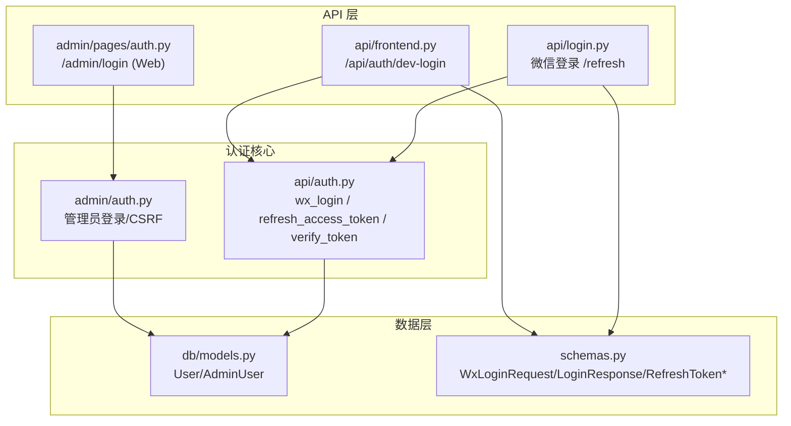
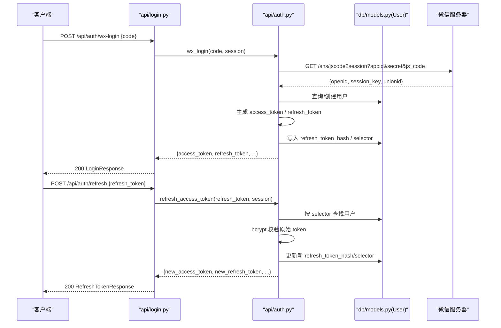
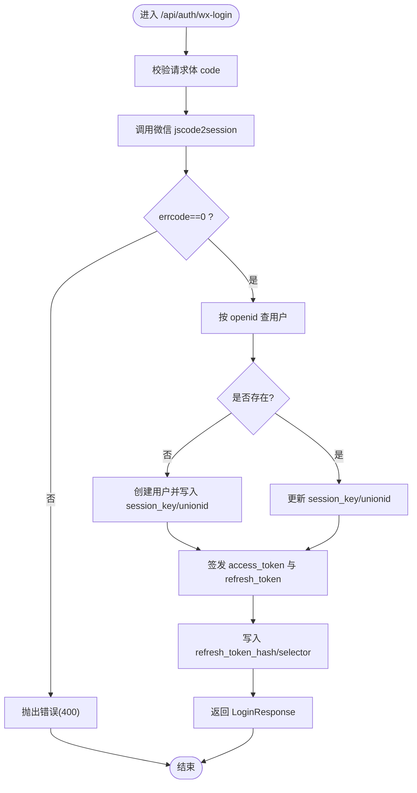
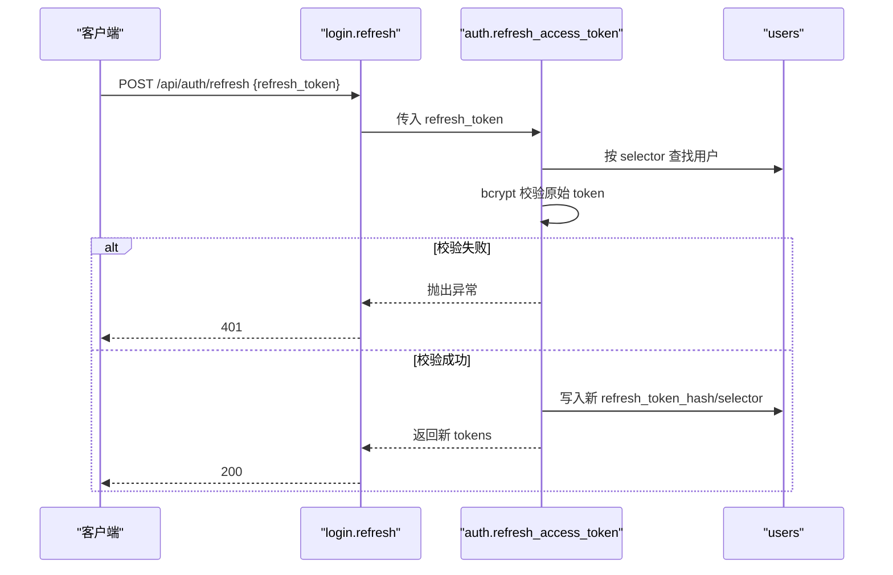
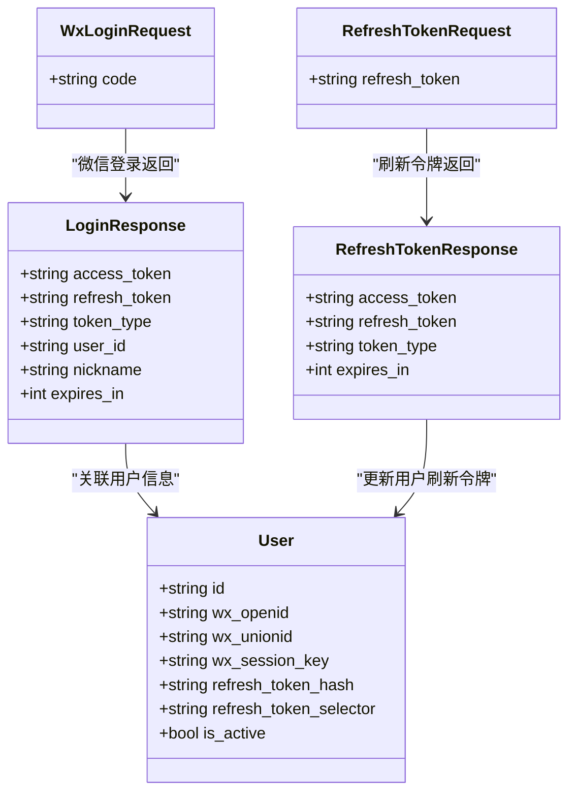

# 认证接口

<cite>
**本文引用的文件**
- [hushai/meditation/api/auth.py](file://hushai/meditation/api/auth.py)
- [hushai/meditation/api/login.py](file://hushai/meditation/api/login.py)
- [hushai/meditation/api/frontend.py](file://hushai/meditation/api/frontend.py)
- [hushai/meditation/schemas.py](file://hushai/meditation/schemas.py)
- [hushai/meditation/db/models.py](file://hushai/meditation/db/models.py)
- [hushai/meditation/admin/auth.py](file://hushai/meditation/admin/auth.py)
- [hushai/meditation/admin/pages/auth.py](file://hushai/meditation/admin/pages/auth.py)
- [tests/meditation/test_auth.py](file://tests/meditation/test_auth.py)
</cite>

## 目录
1. [简介](#简介)
2. [项目结构](#项目结构)
3. [核心组件](#核心组件)
4. [架构总览](#架构总览)
5. [详细组件分析](#详细组件分析)
6. [依赖关系分析](#依赖关系分析)
7. [性能与安全考虑](#性能与安全考虑)
8. [故障排查指南](#故障排查指南)
9. [结论](#结论)
10. [附录：客户端集成与最佳实践](#附录客户端集成与最佳实践)

## 简介
本文件为 hush.ai 的认证系统 API 文档，覆盖以下能力：
- 微信第三方登录（code 换取会话并签发 JWT）
- Refresh Token 刷新 Access Token
- 开发模式一键登录（dev-login）
- 访问令牌校验、用户身份解析与权限控制
- 管理后台登录（Web 表单 + CSRF）

文档包含请求参数验证规则、响应格式、错误码处理、JWT 生命周期管理、安全策略与客户端集成建议。

## 项目结构
认证相关代码主要分布在以下模块：
- 认证逻辑与工具：api/auth.py
- 认证路由：api/login.py
- 前端开发模式登录：api/frontend.py
- 数据模型：db/models.py
- 请求/响应模型：schemas.py
- 管理后台认证与 CSRF：admin/auth.py、admin/pages/auth.py

图示来源
- [hushai/meditation/api/login.py:1-53](file://hushai/meditation/api/login.py#L1-L53)
- [hushai/meditation/api/frontend.py:1-55](file://hushai/meditation/api/frontend.py#L1-L55)
- [hushai/meditation/api/auth.py:1-171](file://hushai/meditation/api/auth.py#L1-L171)
- [hushai/meditation/admin/auth.py:1-183](file://hushai/meditation/admin/auth.py#L1-L183)
- [hushai/meditation/admin/pages/auth.py:1-41](file://hushai/meditation/admin/pages/auth.py#L1-L41)
- [hushai/meditation/db/models.py:37-66](file://hushai/meditation/db/models.py#L37-L66)
- [hushai/meditation/schemas.py:71-93](file://hushai/meditation/schemas.py#L71-L93)

章节来源
- [hushai/meditation/api/login.py:1-53](file://hushai/meditation/api/login.py#L1-L53)
- [hushai/meditation/api/frontend.py:1-55](file://hushai/meditation/api/frontend.py#L1-L55)
- [hushai/meditation/api/auth.py:1-171](file://hushai/meditation/api/auth.py#L1-L171)
- [hushai/meditation/admin/auth.py:1-183](file://hushai/meditation/admin/auth.py#L1-L183)
- [hushai/meditation/admin/pages/auth.py:1-41](file://hushai/meditation/admin/pages/auth.py#L1-L41)
- [hushai/meditation/db/models.py:37-66](file://hushai/meditation/db/models.py#L37-L66)
- [hushai/meditation/schemas.py:71-93](file://hushai/meditation/schemas.py#L71-L93)

## 核心组件
- 微信登录流程：通过 code 调用微信 jscode2session，获取 openid/session_key/unionid；若用户不存在则自动创建；签发 access_token 与 refresh_token，并将 refresh_token 的哈希与选择器存入用户记录。
- Refresh Token 刷新：基于 refresh_token_selector 快速定位用户，再用 bcrypt 校验原始 token，成功后签发新的 access_token 与新的 refresh_token。
- Access Token 校验：解码 JWT，强制 type=access，并从数据库确认用户存在且启用。
- 开发模式登录：根据请求中的 nickname 动态创建用户并返回 JWT。
- 管理后台登录：表单提交用户名密码，校验通过后设置 admin_token cookie 与 CSRF cookie。

章节来源
- [hushai/meditation/api/auth.py:63-106](file://hushai/meditation/api/auth.py#L63-L106)
- [hushai/meditation/api/auth.py:134-164](file://hushai/meditation/api/auth.py#L134-L164)
- [hushai/meditation/api/auth.py:109-131](file://hushai/meditation/api/auth.py#L109-L131)
- [hushai/meditation/api/frontend.py:26-55](file://hushai/meditation/api/frontend.py#L26-L55)
- [hushai/meditation/admin/pages/auth.py:28-41](file://hushai/meditation/admin/pages/auth.py#L28-L41)

## 架构总览
下图展示微信登录与刷新令牌的端到端流程，以及关键的数据落库点。

图示来源
- [hushai/meditation/api/login.py:21-52](file://hushai/meditation/api/login.py#L21-L52)
- [hushai/meditation/api/auth.py:63-106](file://hushai/meditation/api/auth.py#L63-L106)
- [hushai/meditation/api/auth.py:134-164](file://hushai/meditation/api/auth.py#L134-L164)
- [hushai/meditation/db/models.py:37-66](file://hushai/meditation/db/models.py#L37-L66)

## 详细组件分析

### 微信登录（POST /api/auth/wx-login）
- 功能：使用微信临时 code 完成登录，返回 access_token 与 refresh_token。
- 请求体
  - code: 字符串，必填，长度≥1
- 成功响应（200）
  - access_token: 字符串
  - refresh_token: 字符串
  - token_type: 固定为 bearer
  - user_id: 字符串
  - nickname: 可选字符串
  - expires_in: 整数（秒）
- 失败响应（400）
  - error/detail: 描述错误原因（如微信侧 errcode 非零、未获取到 openid 等）
- 行为说明
  - 首次登录自动注册用户，后续登录更新 session_key/unionid
  - 签发 access_token（有效期约 7 天）与 refresh_token（有效期约 30 天）
  - refresh_token 以 bcrypt 哈希存储，同时保存 SHA-256 选择器用于 O(1) 定位

图示来源
- [hushai/meditation/api/login.py:21-35](file://hushai/meditation/api/login.py#L21-L35)
- [hushai/meditation/api/auth.py:63-106](file://hushai/meditation/api/auth.py#L63-L106)
- [hushai/meditation/schemas.py:71-82](file://hushai/meditation/schemas.py#L71-L82)

章节来源
- [hushai/meditation/api/login.py:21-35](file://hushai/meditation/api/login.py#L21-L35)
- [hushai/meditation/api/auth.py:63-106](file://hushai/meditation/api/auth.py#L63-L106)
- [hushai/meditation/schemas.py:71-82](file://hushai/meditation/schemas.py#L71-L82)

### 刷新令牌（POST /api/auth/refresh）
- 功能：用 refresh_token 换取新的 access_token 与新的 refresh_token。
- 请求体
  - refresh_token: 字符串，必填
- 成功响应（200）
  - access_token: 字符串
  - refresh_token: 字符串（轮换）
  - token_type: 固定为 bearer
  - expires_in: 整数（秒）
- 失败响应（401）
  - error/detail: 无效或过期、被篡改等
- 行为说明
  - 通过 refresh_token_selector 快速定位用户
  - 使用 bcrypt 校验原始 token，避免全表扫描 DoS
  - 成功后轮换 refresh_token（旧值失效）

图示来源
- [hushai/meditation/api/login.py:38-52](file://hushai/meditation/api/login.py#L38-L52)
- [hushai/meditation/api/auth.py:134-164](file://hushai/meditation/api/auth.py#L134-L164)
- [hushai/meditation/db/models.py:46-51](file://hushai/meditation/db/models.py#L46-L51)

章节来源
- [hushai/meditation/api/login.py:38-52](file://hushai/meditation/api/login.py#L38-L52)
- [hushai/meditation/api/auth.py:134-164](file://hushai/meditation/api/auth.py#L134-L164)
- [hushai/meditation/db/models.py:46-51](file://hushai/meditation/db/models.py#L46-L51)

### 开发模式登录（POST /api/auth/dev-login）
- 功能：开发环境便捷登录，无需真实微信授权。
- 请求体
  - nickname: 可选字符串，默认“冥想者”，最大长度限制
- 成功响应（200）
  - 同 LoginResponse
- 行为说明
  - 自动生成随机 openid 并创建用户
  - 签发 access_token 与 refresh_token，并持久化 refresh_token 哈希

章节来源
- [hushai/meditation/api/frontend.py:26-55](file://hushai/meditation/api/frontend.py#L26-L55)
- [hushai/meditation/schemas.py:75-82](file://hushai/meditation/schemas.py#L75-L82)

### 访问令牌校验与当前用户解析
- 校验函数
  - 解码 JWT，强制 type=access
  - 从数据库确认用户存在且 is_active=True
- 提取 Bearer
  - 支持 Authorization: Bearer xxx 或直接传入 token

章节来源
- [hushai/meditation/api/auth.py:109-131](file://hushai/meditation/api/auth.py#L109-L131)
- [hushai/meditation/api/auth.py:167-171](file://hushai/meditation/api/auth.py#L167-L171)

### 管理后台登录（Web 表单）
- 登录页面：GET /admin/login
- 登录处理：POST /admin/login（Form 提交 username/password）
- 安全措施
  - 密码使用 bcrypt 存储与校验
  - 登录成功后设置 admin_token cookie
  - 设置 CSRF cookie（httponly=False，samesite=strict，secure 跟随 debug 配置）
  - 提供 require_csrf 装饰器保护写操作

章节来源
- [hushai/meditation/admin/pages/auth.py:20-41](file://hushai/meditation/admin/pages/auth.py#L20-L41)
- [hushai/meditation/admin/auth.py:24-43](file://hushai/meditation/admin/auth.py#L24-L43)
- [hushai/meditation/admin/auth.py:136-182](file://hushai/meditation/admin/auth.py#L136-L182)

## 依赖关系分析
- api/login.py 依赖 api/auth.py 的核心逻辑与 schemas 的请求/响应模型
- api/auth.py 依赖 db/models.py 的 User 模型进行用户查询与更新
- admin 认证独立于用户认证，使用 AdminUser 模型与独立的 JWT 载荷（含 is_admin 标记）

图示来源
- [hushai/meditation/schemas.py:71-93](file://hushai/meditation/schemas.py#L71-L93)
- [hushai/meditation/db/models.py:37-66](file://hushai/meditation/db/models.py#L37-L66)

章节来源
- [hushai/meditation/schemas.py:71-93](file://hushai/meditation/schemas.py#L71-L93)
- [hushai/meditation/db/models.py:37-66](file://hushai/meditation/db/models.py#L37-L66)

## 性能与安全考虑
- 性能优化
  - refresh_token 采用 selector（SHA-256）+ bcrypt 双重机制，避免全表 bcrypt 比对导致的 DoS 风险
  - 数据库索引：refresh_token_hash、refresh_token_selector、wx_openid 均建立索引，提升查询效率
- 安全策略
  - Access Token 强制 type=access，防止类型混淆
  - Refresh Token 不入库明文，仅存哈希；每次刷新轮换
  - 管理后台启用 CSRF 保护，Cookie 属性随环境调整（生产 HTTPS 启用 secure）
  - 所有敏感字段（如密码、服务记录）使用 bcrypt/加密方案存储

章节来源
- [hushai/meditation/api/auth.py:36-43](file://hushai/meditation/api/auth.py#L36-L43)
- [hushai/meditation/api/auth.py:109-118](file://hushai/meditation/api/auth.py#L109-L118)
- [hushai/meditation/db/models.py:46-51](file://hushai/meditation/db/models.py#L46-L51)
- [hushai/meditation/admin/auth.py:146-170](file://hushai/meditation/admin/auth.py#L146-L170)

## 故障排查指南
- 微信登录失败（400）
  - 常见原因：微信侧 errcode 非零、未获取到 openid
  - 排查要点：检查 appid/secret 配置、网络连通性、code 是否已使用
- Refresh Token 无效或过期（401）
  - 可能原因：token 被篡改、已被轮换、用户被禁用
  - 排查要点：核对 selector 命中是否正确、bcrypt 校验是否失败、用户状态是否为 active
- 开发模式登录异常
  - 检查请求体 nickname 是否符合长度限制
- 管理后台登录失败（401/403）
  - 检查用户名/密码是否正确、CSRF 头是否携带、Cookie 是否生效

章节来源
- [hushai/meditation/api/login.py:21-52](file://hushai/meditation/api/login.py#L21-L52)
- [hushai/meditation/api/auth.py:63-106](file://hushai/meditation/api/auth.py#L63-L106)
- [hushai/meditation/api/auth.py:134-164](file://hushai/meditation/api/auth.py#L134-L164)
- [hushai/meditation/admin/pages/auth.py:28-41](file://hushai/meditation/admin/pages/auth.py#L28-L41)

## 结论
本认证体系围绕“微信登录 + JWT + Refresh Token 轮换”构建，兼顾安全性与性能。通过 selector 与 bcrypt 的组合有效抵御暴力破解与 DoS 攻击；Access Token 强类型校验与用户状态检查确保访问安全；管理后台提供 CSRF 防护与 Cookie 安全策略。整体设计清晰、可扩展，适合在生产环境中部署。

## 附录：客户端集成与最佳实践
- 登录流程
  - 微信登录：调用 POST /api/auth/wx-login，保存 access_token 与 refresh_token
  - 开发模式：调用 POST /api/auth/dev-login，便于本地调试
- 请求鉴权
  - 在后续业务请求中携带 Authorization: Bearer <access_token>
  - 服务端将校验 JWT 并确认用户活跃状态
- Token 刷新
  - 当 access_token 即将过期时，调用 POST /api/auth/refresh 获取新令牌对
  - 注意：refresh_token 会轮换，旧值立即失效
- 错误处理
  - 400：微信登录失败、参数校验失败
  - 401：Token 无效/过期、用户不存在或被禁用
  - 403：管理后台 CSRF 校验失败
  - 404：资源不存在（如对话、订单）
  - 500：内部错误（如外部服务异常）
- 安全建议
  - 使用 HTTPS 传输
  - 妥善存储 access_token 与 refresh_token（避免明文日志）
  - 定期刷新 access_token，避免长时间持有同一令牌
  - 管理后台务必启用 CSRF 与 secure Cookie

章节来源
- [hushai/meditation/api/login.py:21-52](file://hushai/meditation/api/login.py#L21-L52)
- [hushai/meditation/api/frontend.py:26-55](file://hushai/meditation/api/frontend.py#L26-L55)
- [hushai/meditation/api/auth.py:109-131](file://hushai/meditation/api/auth.py#L109-L131)
- [hushai/meditation/admin/auth.py:146-182](file://hushai/meditation/admin/auth.py#L146-L182)