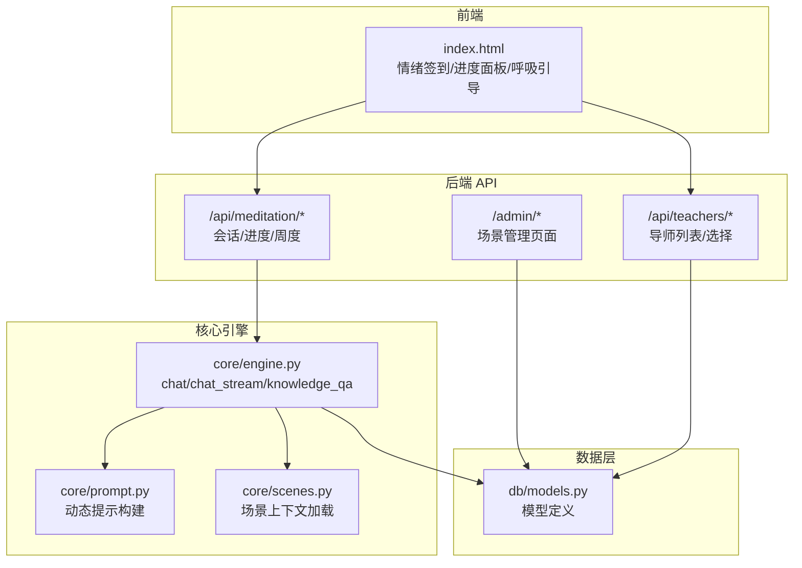
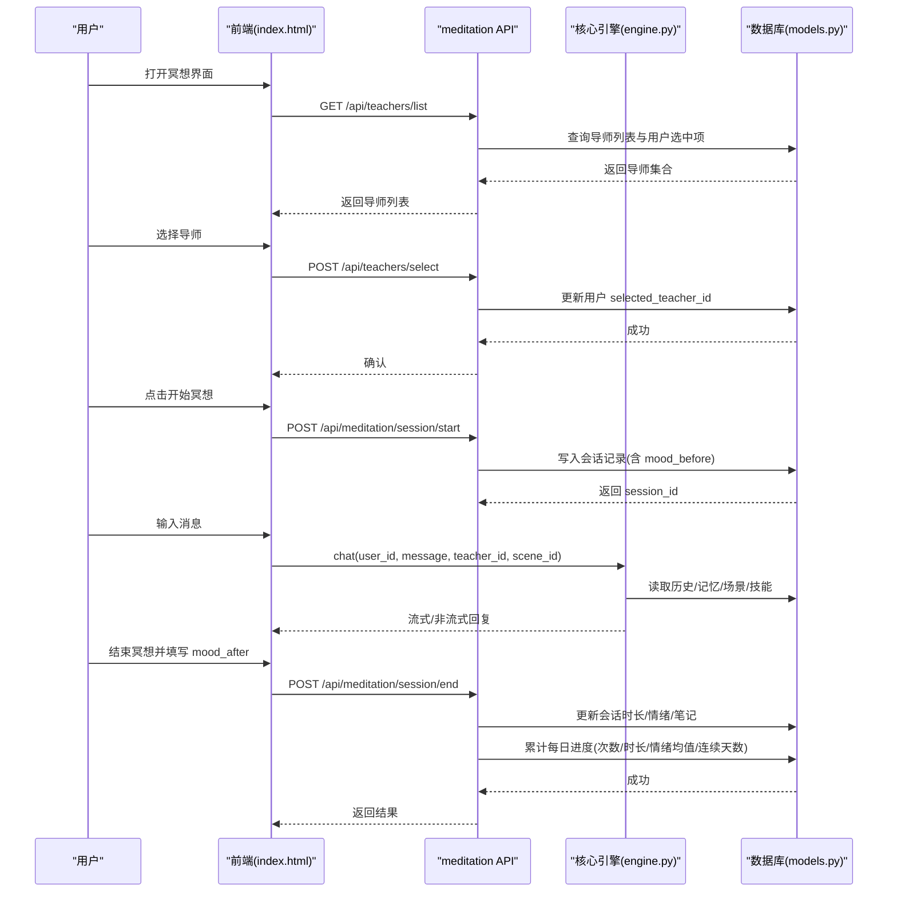
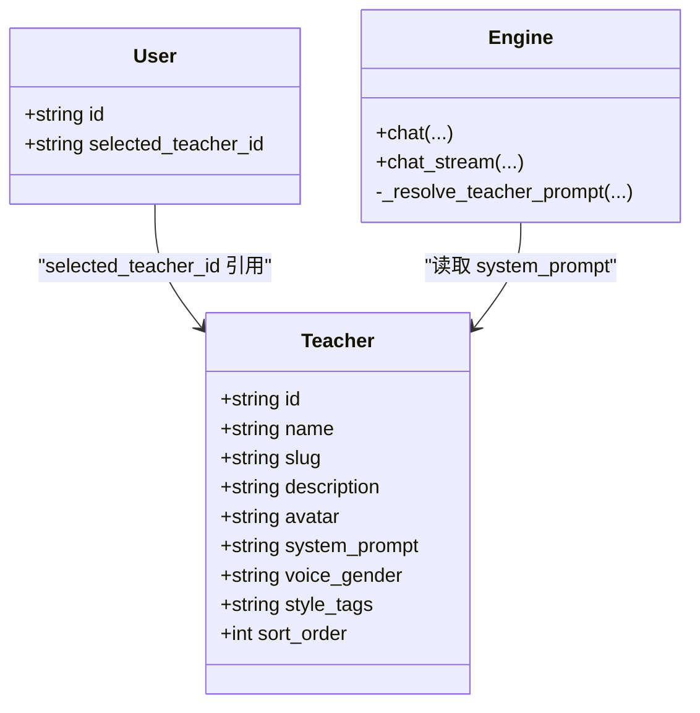
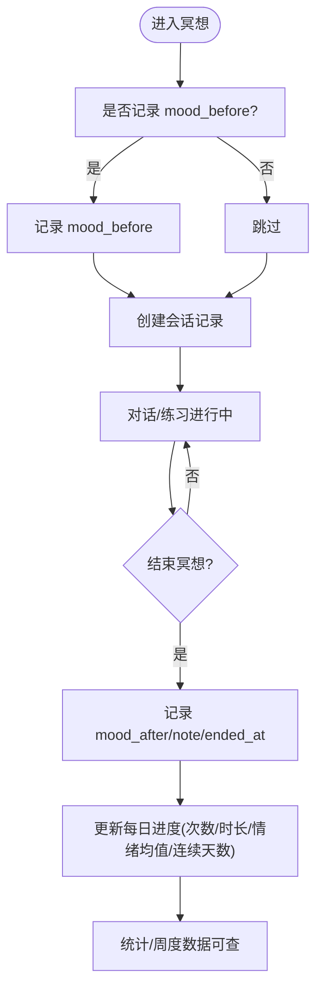
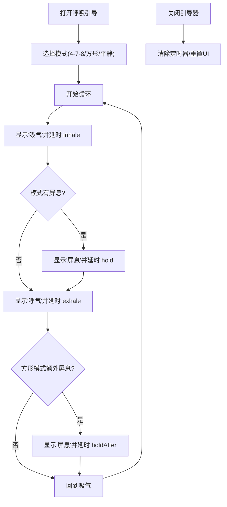
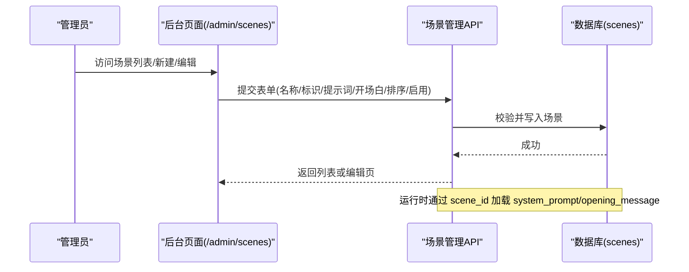
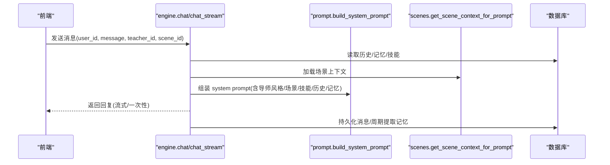
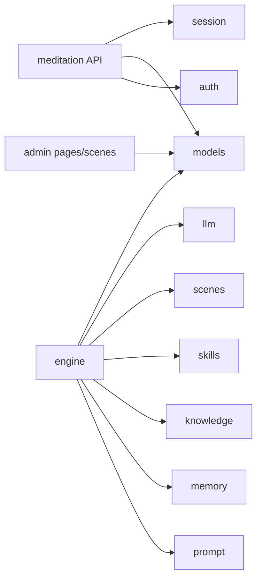

# 冥想功能

<cite>
**本文引用的文件**   
- [hushai/meditation/api/meditation.py](file://hushai/meditation/api/meditation.py)
- [hushai/meditation/core/engine.py](file://hushai/meditation/core/engine.py)
- [hushai/meditation/core/scenes.py](file://hushai/meditation/core/scenes.py)
- [hushai/meditation/admin/pages/scenes.py](file://hushai/meditation/admin/pages/scenes.py)
- [hushai/meditation/db/models.py](file://hushai/meditation/db/models.py)
- [hushai/meditation/core/prompt.py](file://hushai/meditation/core/prompt.py)
- [hushai/meditation/api/teachers.py](file://hushai/meditation/api/teachers.py)
- [hushai/meditation/app.py](file://hushai/meditation/app.py)
- [hushai/meditation/static/index.html](file://hushai/meditation/static/index.html)
</cite>

## 目录
1. [简介](#简介)
2. [项目结构](#项目结构)
3. [核心组件](#核心组件)
4. [架构总览](#架构总览)
5. [详细组件分析](#详细组件分析)
6. [依赖关系分析](#依赖关系分析)
7. [性能与可扩展性](#性能与可扩展性)
8. [故障排查指南](#故障排查指南)
9. [结论](#结论)
10. [附录：使用指南（教练与健康顾问）](#附录使用指南教练与健康顾问)

## 简介
本文件面向 hush.ai 的“冥想”功能模块，系统性阐述以下能力：
- 冥想搭子系统：多角色导师配置、切换逻辑与个性化对话风格注入
- 冥想追踪：情绪签到机制、进度统计与可视化展示
- 呼吸练习引导系统：4-7-8 呼吸、方形呼吸、平静呼吸三种模式
- 场景管理：预设场景配置与自定义场景创建
- 数据分析与报告：会话与周度数据聚合、趋势与连续打卡统计
- 使用指南：为冥想教练与健康顾问提供端到端操作说明

## 项目结构
冥想模块采用前后端分离设计：后端以 FastAPI 提供 REST API，前端静态页面通过浏览器调用；核心引擎负责编排对话、记忆提取、知识检索与场景/技能注入。

图表来源
- [hushai/meditation/api/meditation.py:1-368](file://hushai/meditation/api/meditation.py#L1-L368)
- [hushai/meditation/api/teachers.py:1-139](file://hushai/meditation/api/teachers.py#L1-L139)
- [hushai/meditation/core/engine.py:1-387](file://hushai/meditation/core/engine.py#L1-L387)
- [hushai/meditation/core/prompt.py:1-130](file://hushai/meditation/core/prompt.py#L1-L130)
- [hushai/meditation/core/scenes.py:1-30](file://hushai/meditation/core/scenes.py#L1-L30)
- [hushai/meditation/db/models.py:1-434](file://hushai/meditation/db/models.py#L1-L434)
- [hushai/meditation/static/index.html:1091-2012](file://hushai/meditation/static/index.html#L1091-L2012)

章节来源
- [hushai/meditation/api/meditation.py:1-368](file://hushai/meditation/api/meditation.py#L1-L368)
- [hushai/meditation/api/teachers.py:1-139](file://hushai/meditation/api/teachers.py#L1-L139)
- [hushai/meditation/core/engine.py:1-387](file://hushai/meditation/core/engine.py#L1-L387)
- [hushai/meditation/core/prompt.py:1-130](file://hushai/meditation/core/prompt.py#L1-L130)
- [hushai/meditation/core/scenes.py:1-30](file://hushai/meditation/core/scenes.py#L1-L30)
- [hushai/meditation/db/models.py:1-434](file://hushai/meditation/db/models.py#L1-L434)
- [hushai/meditation/static/index.html:1091-2012](file://hushai/meditation/static/index.html#L1091-L2012)

## 核心组件
- 冥想会话与进度追踪 API：提供会话开始/结束、情绪签到、统计与周度数据接口
- 导师角色与切换：列出可用导师、设置用户默认导师
- 对话引擎：组装系统提示、历史、记忆、知识与场景，驱动 LLM 生成回复
- 场景管理：后台创建/编辑/删除场景，运行时注入场景上下文
- 数据库模型：会话、每日进度、导师、场景等实体定义
- 前端交互：情绪签到弹窗、进度抽屉、呼吸练习引导器

章节来源
- [hushai/meditation/api/meditation.py:1-368](file://hushai/meditation/api/meditation.py#L1-L368)
- [hushai/meditation/api/teachers.py:1-139](file://hushai/meditation/api/teachers.py#L1-L139)
- [hushai/meditation/core/engine.py:1-387](file://hushai/meditation/core/engine.py#L1-L387)
- [hushai/meditation/core/scenes.py:1-30](file://hushai/meditation/core/scenes.py#L1-L30)
- [hushai/meditation/db/models.py:1-434](file://hushai/meditation/db/models.py#L1-L434)
- [hushai/meditation/static/index.html:1091-2012](file://hushai/meditation/static/index.html#L1091-L2012)

## 架构总览
冥想功能由“前端交互 → API 路由 → 核心引擎 → 数据模型”四层构成。关键流程包括：
- 导师选择：前端调用导师列表与选择接口，持久化到用户记录
- 会话生命周期：开始→聊天→结束，期间更新每日进度与情绪均值
- 场景注入：根据 scene_id 加载场景提示，影响对话风格与开场白
- 呼吸练习：纯前端实现，支持多种节奏循环

图表来源
- [hushai/meditation/api/teachers.py:58-139](file://hushai/meditation/api/teachers.py#L58-L139)
- [hushai/meditation/api/meditation.py:112-174](file://hushai/meditation/api/meditation.py#L112-L174)
- [hushai/meditation/core/engine.py:166-236](file://hushai/meditation/core/engine.py#L166-L236)
- [hushai/meditation/db/models.py:204-243](file://hushai/meditation/db/models.py#L204-L243)

## 详细组件分析

### 冥想搭子系统（多角色导师与个性化风格）
- 导师数据模型：包含名称、标识、描述、头像、系统提示、语音性别、风格标签、排序等字段
- 默认导师初始化：服务启动时写入若干预设导师（如藏传上师、道家真人等），便于快速体验
- 导师列表与详情：按启用状态与排序返回，同时返回当前用户的已选导师 ID
- 导师切换：将用户 selected_teacher_id 指向目标导师 ID，后续对话将使用该导师的系统提示
- 对话风格注入：引擎在构建 system prompt 时，若存在 teacher_id，则优先取数据库中该导师的 system_prompt，否则回退到传入的描述文本

图表来源
- [hushai/meditation/db/models.py:246-266](file://hushai/meditation/db/models.py#L246-L266)
- [hushai/meditation/core/engine.py:78-89](file://hushai/meditation/core/engine.py#L78-L89)
- [hushai/meditation/api/teachers.py:58-139](file://hushai/meditation/api/teachers.py#L58-L139)
- [hushai/meditation/app.py:79-108](file://hushai/meditation/app.py#L79-L108)

章节来源
- [hushai/meditation/db/models.py:246-266](file://hushai/meditation/db/models.py#L246-L266)
- [hushai/meditation/core/engine.py:78-89](file://hushai/meditation/core/engine.py#L78-L89)
- [hushai/meditation/api/teachers.py:58-139](file://hushai/meditation/api/teachers.py#L58-L139)
- [hushai/meditation/app.py:79-108](file://hushai/meditation/app.py#L79-L108)

### 冥想追踪（情绪签到、进度统计与可视化）
- 会话生命周期
  - 开始：记录 user_id、conversation_id、scene_id、mood_before、started_at
  - 结束：计算 duration_seconds，记录 mood_after、note，并触发每日进度更新
- 情绪签到：独立接口允许仅记录当日情绪，不关联会话
- 每日进度聚合
  - 计数：meditation_count、total_duration_seconds
  - 情绪均值：mood_avg 基于已有会话情绪进行增量平均
  - 连续天数：streak_day 依据昨日是否有有效会话递增
- 统计与周度
  - 总次数/总时长/平均情绪/最近会话
  - 本周七天维度：日期、星期名、会话数、时长、情绪均值、连续天数
- 前端可视化
  - 进度抽屉展示总次数、总分钟、连续天数、平均情绪
  - 本周进度条与最近练习列表

图表来源
- [hushai/meditation/api/meditation.py:112-174](file://hushai/meditation/api/meditation.py#L112-L174)
- [hushai/meditation/api/meditation.py:177-186](file://hushai/meditation/api/meditation.py#L177-L186)
- [hushai/meditation/api/meditation.py:189-238](file://hushai/meditation/api/meditation.py#L189-L238)
- [hushai/meditation/api/meditation.py:241-333](file://hushai/meditation/api/meditation.py#L241-L333)
- [hushai/meditation/api/meditation.py:336-368](file://hushai/meditation/api/meditation.py#L336-L368)
- [hushai/meditation/static/index.html:1124-1159](file://hushai/meditation/static/index.html#L1124-L1159)

章节来源
- [hushai/meditation/api/meditation.py:112-174](file://hushai/meditation/api/meditation.py#L112-L174)
- [hushai/meditation/api/meditation.py:177-186](file://hushai/meditation/api/meditation.py#L177-L186)
- [hushai/meditation/api/meditation.py:189-238](file://hushai/meditation/api/meditation.py#L189-L238)
- [hushai/meditation/api/meditation.py:241-333](file://hushai/meditation/api/meditation.py#L241-L333)
- [hushai/meditation/api/meditation.py:336-368](file://hushai/meditation/api/meditation.py#L336-L368)
- [hushai/meditation/static/index.html:1124-1159](file://hushai/meditation/static/index.html#L1124-L1159)

### 呼吸练习引导系统（4-7-8、方形、平静）
- 模式定义
  - 4-7-8：吸气 4s、屏息 7s、呼气 8s
  - 方形：吸气 4s、屏息 4s、呼气 4s、屏息 4s
  - 平静：吸气 4s、屏息 2s、呼气 6s
- 交互流程
  - 打开引导器后自动开始当前模式
  - 切换模式会停止旧计时器并重启新循环
  - 关闭引导器会清理定时器并重置状态
- 视觉反馈
  - 圆形动画与文字提示对应阶段（吸气/屏息/呼气）

图表来源
- [hushai/meditation/static/index.html:1938-2012](file://hushai/meditation/static/index.html#L1938-L2012)

章节来源
- [hushai/meditation/static/index.html:1938-2012](file://hushai/meditation/static/index.html#L1938-L2012)

### 场景管理系统（预设与自定义）
- 数据模型：场景包含名称、唯一标识、描述、系统提示、开场白、启用状态、排序等
- 后台管理
  - 列表页：分页、搜索（名称/描述）、排序
  - 新建/编辑：校验必填字段、唯一性约束、保存后重定向
  - 删除：管理员鉴权后删除
- 运行时注入：引擎根据 scene_id 加载场景提示与可选开场白，拼接到 system prompt 中

图表来源
- [hushai/meditation/admin/pages/scenes.py:17-240](file://hushai/meditation/admin/pages/scenes.py#L17-L240)
- [hushai/meditation/core/scenes.py:11-30](file://hushai/meditation/core/scenes.py#L11-L30)
- [hushai/meditation/db/models.py:153-170](file://hushai/meditation/db/models.py#L153-L170)

章节来源
- [hushai/meditation/admin/pages/scenes.py:17-240](file://hushai/meditation/admin/pages/scenes.py#L17-L240)
- [hushai/meditation/core/scenes.py:11-30](file://hushai/meditation/core/scenes.py#L11-L30)
- [hushai/meditation/db/models.py:153-170](file://hushai/meditation/db/models.py#L153-L170)

### 对话引擎与个性化提示构建
- 安全前置：对用户输入进行安全检查，必要时直接返回安全提示而不调用外部模型
- 上下文组装：加载历史消息、记忆上下文、知识库片段、技能上下文、场景上下文
- 导师风格：若指定 teacher_id，优先使用数据库中该导师的 system_prompt；否则使用传入描述
- 输出持久化：保存用户与助手消息，周期性提取记忆并补全会话标题
- 知识问答：独立入口，结合知识库检索结果与记忆上下文生成结构化回答

图表来源
- [hushai/meditation/core/engine.py:166-236](file://hushai/meditation/core/engine.py#L166-L236)
- [hushai/meditation/core/prompt.py:77-103](file://hushai/meditation/core/prompt.py#L77-L103)
- [hushai/meditation/core/scenes.py:11-30](file://hushai/meditation/core/scenes.py#L11-L30)

章节来源
- [hushai/meditation/core/engine.py:166-236](file://hushai/meditation/core/engine.py#L166-L236)
- [hushai/meditation/core/prompt.py:77-103](file://hushai/meditation/core/prompt.py#L77-L103)
- [hushai/meditation/core/scenes.py:11-30](file://hushai/meditation/core/scenes.py#L11-L30)

## 依赖关系分析
- 模块耦合
  - meditation API 依赖 auth、models、session
  - engine 依赖 prompt、memory、knowledge、skills、scenes、llm、models
  - admin scenes 页面依赖 models 与模板渲染
- 外部依赖
  - LLM 调用通过 llm 模块抽象
  - 微信支付集成位于 core.wechat_pay（咨询模块，非冥想主路径）

图表来源
- [hushai/meditation/api/meditation.py:1-368](file://hushai/meditation/api/meditation.py#L1-L368)
- [hushai/meditation/core/engine.py:1-387](file://hushai/meditation/core/engine.py#L1-L387)
- [hushai/meditation/admin/pages/scenes.py:1-240](file://hushai/meditation/admin/pages/scenes.py#L1-L240)

章节来源
- [hushai/meditation/api/meditation.py:1-368](file://hushai/meditation/api/meditation.py#L1-L368)
- [hushai/meditation/core/engine.py:1-387](file://hushai/meditation/core/engine.py#L1-L387)
- [hushai/meditation/admin/pages/scenes.py:1-240](file://hushai/meditation/admin/pages/scenes.py#L1-L240)

## 性能与可扩展性
- 数据库索引
  - daily_progress 对 (user_id, date) 建立复合索引，加速按日查询与周度聚合
- 内存活跃会话
  - 使用进程内字典缓存活跃会话开始时间，避免频繁读库；注意多实例部署时需改为分布式存储
- 流式响应
  - 引擎支持 chat_stream，降低首字延迟，提升用户体验
- 扩展建议
  - 将 _active_sessions 迁移至 Redis，支持水平扩展
  - 对统计查询增加物化视图或定时任务预计算，缓解高峰压力
  - 对 LLM 调用增加重试与熔断策略，提高稳定性

[本节为通用指导，无需代码引用]

## 故障排查指南
- 会话未找到或已结束
  - 现象：结束会话返回 404
  - 原因：未在活跃会话字典中找到 session_id 或会话不存在
  - 处理：检查前端是否正确传递 session_id，确保先 start 再 end
- 导师不存在
  - 现象：选择导师或获取详情返回 404
  - 原因：teacher_id 无效或未启用
  - 处理：核对导师列表与 selected_teacher_id
- 场景不存在
  - 现象：场景上下文为空
  - 原因：scene_id 无效或场景未启用
  - 处理：在后台确认场景状态与 ID
- 安全拦截
  - 现象：直接返回安全提示，不调用 LLM
  - 原因：输入触发安全检查规则
  - 处理：调整用户输入或优化安全策略

章节来源
- [hushai/meditation/api/meditation.py:136-174](file://hushai/meditation/api/meditation.py#L136-L174)
- [hushai/meditation/api/teachers.py:89-139](file://hushai/meditation/api/teachers.py#L89-L139)
- [hushai/meditation/core/engine.py:166-236](file://hushai/meditation/core/engine.py#L166-L236)

## 结论
冥想模块围绕“导师风格定制、场景化引导、完整追踪与可视化、轻量呼吸练习”形成闭环。后端以清晰的 API 与模块化引擎支撑，前端提供直观交互。建议在多实例部署下完善活跃会话共享与统计预计算，进一步提升性能与可用性。

[本节为总结，无需代码引用]

## 附录：使用指南（教练与健康顾问）
- 导师选择与风格
  - 在“导师列表”中选择适合来访者的导师（如温和鼓励型、哲理引导型），并保存为用户默认导师
  - 不同导师的 system_prompt 会影响对话语气与引导方式
- 场景配置
  - 在后台创建场景（如“森林禅”“身体觉察”），编写系统提示与开场白，用于统一引导策略
  - 在会话开始时传入 scene_id，使 AI 遵循场景指引
- 情绪签到与进度查看
  - 每次冥想前记录 mood_before，结束后记录 mood_after，便于评估效果
  - 查看“我的进度”面板了解总次数、总时长、连续天数与平均情绪
- 呼吸练习
  - 使用内置呼吸引导器，选择 4-7-8、方形或平静模式，配合音频/视觉提示完成练习
- 数据导出与分析（建议）
  - 利用统计与周度接口导出数据，结合外部工具生成趋势图与个人报告
  - 关注连续天数与情绪均值变化，作为干预效果的参考指标

章节来源
- [hushai/meditation/api/teachers.py:58-139](file://hushai/meditation/api/teachers.py#L58-L139)
- [hushai/meditation/admin/pages/scenes.py:17-240](file://hushai/meditation/admin/pages/scenes.py#L17-L240)
- [hushai/meditation/api/meditation.py:241-368](file://hushai/meditation/api/meditation.py#L241-L368)
- [hushai/meditation/static/index.html:1124-1159](file://hushai/meditation/static/index.html#L1124-L1159)
- [hushai/meditation/static/index.html:1938-2012](file://hushai/meditation/static/index.html#L1938-L2012)