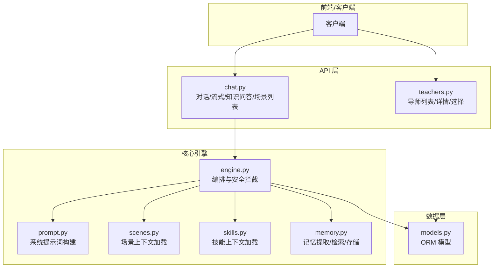
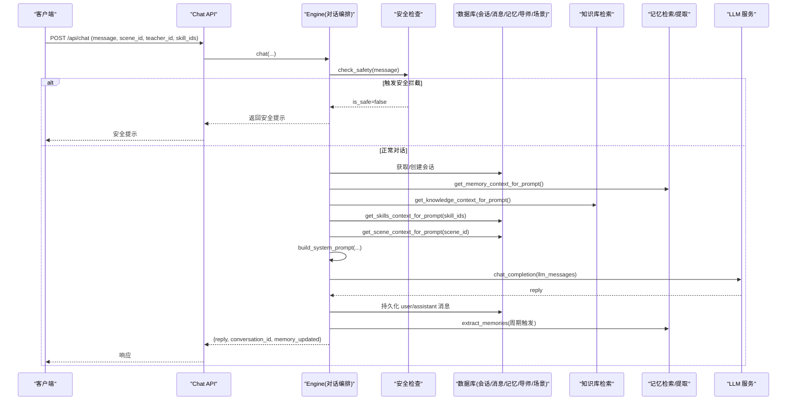
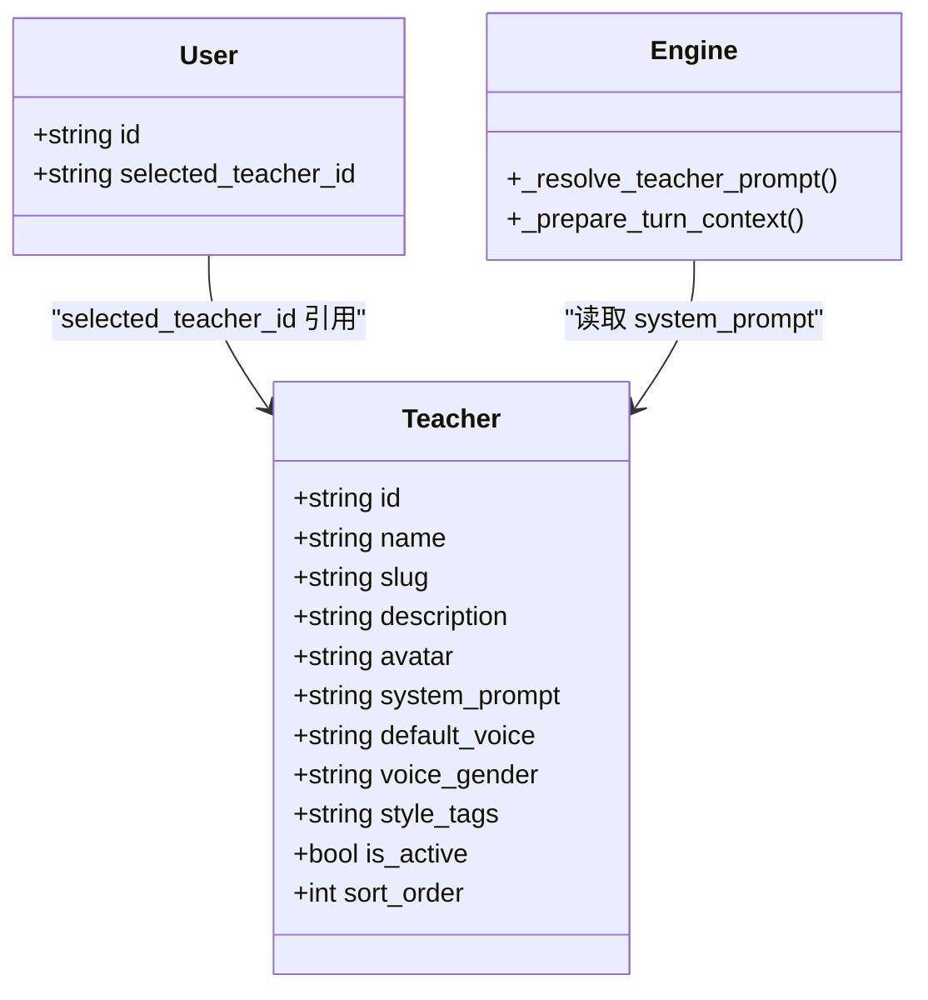
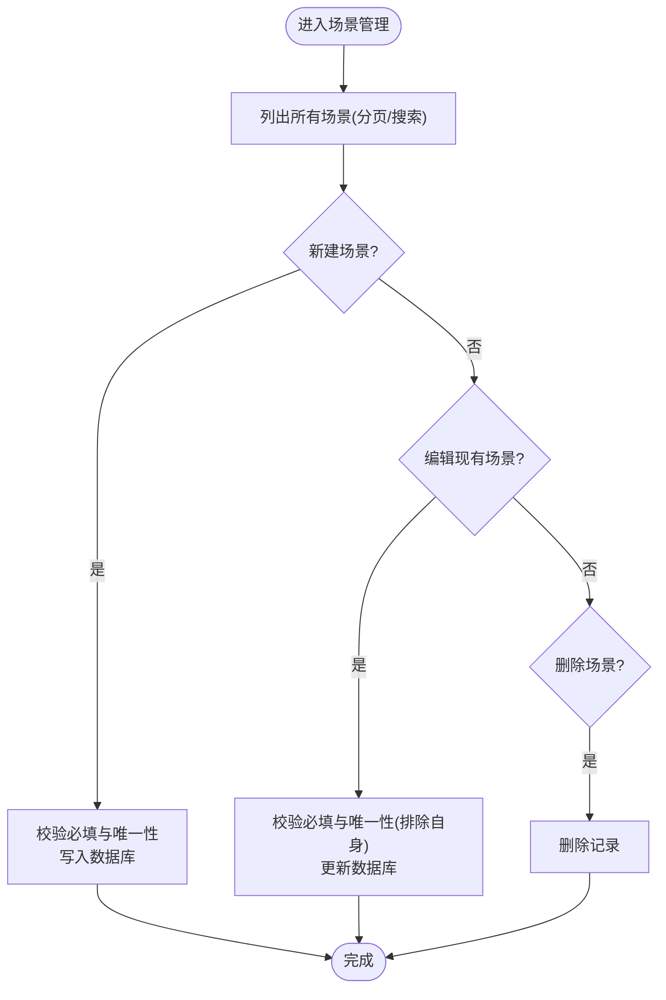
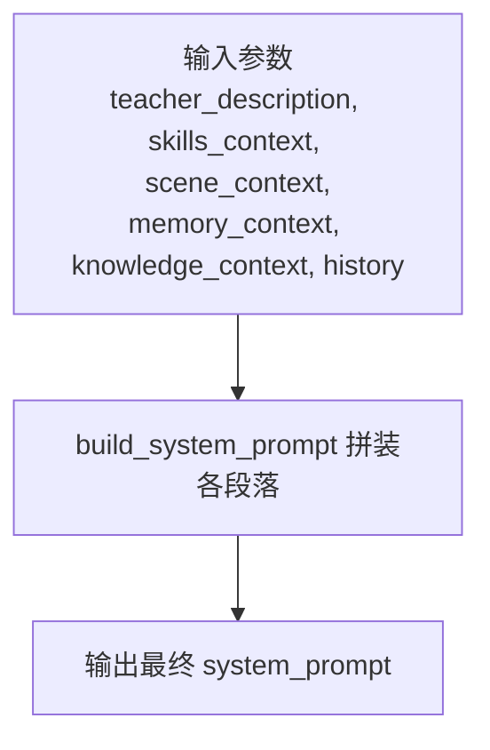
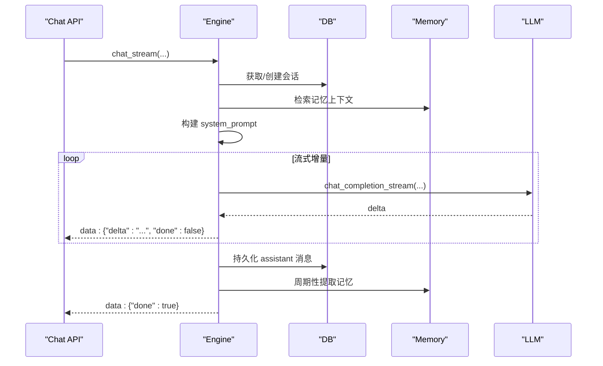
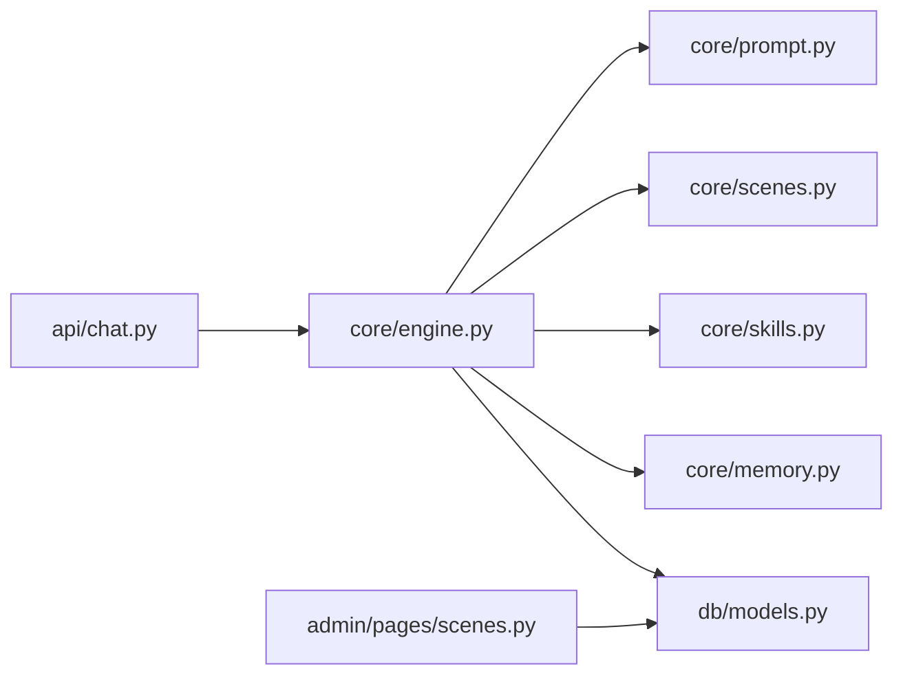

# 冥想搭子系统

<cite>
**本文引用的文件**   
- [hushai/meditation/core/prompt.py](file://hushai/meditation/core/prompt.py)
- [hushai/meditation/core/scenes.py](file://hushai/meditation/core/scenes.py)
- [hushai/meditation/core/skills.py](file://hushai/meditation/core/skills.py)
- [hushai/meditation/core/memory.py](file://hushai/meditation/core/memory.py)
- [hushai/meditation/core/engine.py](file://hushai/meditation/core/engine.py)
- [hushai/meditation/api/chat.py](file://hushai/meditation/api/chat.py)
- [hushai/meditation/api/teachers.py](file://hushai/meditation/api/teachers.py)
- [hushai/meditation/admin/pages/scenes.py](file://hushai/meditation/admin/pages/scenes.py)
- [hushai/meditation/db/models.py](file://hushai/meditation/db/models.py)
- [hushai/meditation/app.py](file://hushai/meditation/app.py)
- [hushai/meditation/schemas.py](file://hushai/meditation/schemas.py)
</cite>

## 目录
1. [简介](#简介)
2. [项目结构](#项目结构)
3. [核心组件](#核心组件)
4. [架构总览](#架构总览)
5. [详细组件分析](#详细组件分析)
6. [依赖关系分析](#依赖关系分析)
7. [性能考量](#性能考量)
8. [故障排查指南](#故障排查指南)
9. [结论](#结论)
10. [附录：API 参考与使用示例](#附录api-参考与使用示例)

## 简介
本文件面向 hush.ai 的“冥想搭子系统”，聚焦以下目标：
- 多角色导师系统：角色配置、切换逻辑与个性化对话风格实现
- 场景管理系统：预设场景配置、自定义创建流程、与导师的关联机制
- 提示词构建策略：系统提示词的动态生成与用户上下文整合（记忆、知识、技能、历史）
- 管理端 API：导师角色管理、场景配置管理的接口说明与使用示例
- 效果评估与反馈收集：安全拦截、记忆提取与沉淀、会话统计等闭环能力

## 项目结构
围绕“导师—场景—技能—记忆—引擎—API”的主线，关键模块分布如下：
- 数据模型：db/models.py 定义 User、Conversation、Message、Memory、Teacher、Scene、Skill 等实体
- 引擎层：core/engine.py 编排对话、记忆提取、知识检索、安全拦截与持久化
- 提示词：core/prompt.py 负责系统提示词拼装与格式化
- 场景加载：core/scenes.py 按 scene_id 注入场景指引
- 技能注入：core/skills.py 按 skill_ids 或全量启用技能注入
- 长期记忆：core/memory.py 负责记忆提取、存储、检索与上下文组装
- 对外 API：api/chat.py 提供对话、流式对话、知识问答、场景列表等；api/teachers.py 提供导师列表/详情/选择
- 管理后台：admin/pages/scenes.py 提供场景的增删改查页面与表单校验
- 初始化：app.py 在首次启动时写入默认导师角色

图表来源
- [hushai/meditation/api/chat.py:1-245](file://hushai/meditation/api/chat.py#L1-L245)
- [hushai/meditation/api/teachers.py:1-139](file://hushai/meditation/api/teachers.py#L1-L139)
- [hushai/meditation/core/engine.py:1-387](file://hushai/meditation/core/engine.py#L1-L387)
- [hushai/meditation/core/prompt.py:1-130](file://hushai/meditation/core/prompt.py#L1-L130)
- [hushai/meditation/core/scenes.py:1-30](file://hushai/meditation/core/scenes.py#L1-L30)
- [hushai/meditation/core/skills.py:1-59](file://hushai/meditation/core/skills.py#L1-L59)
- [hushai/meditation/core/memory.py:1-206](file://hushai/meditation/core/memory.py#L1-L206)
- [hushai/meditation/db/models.py:1-434](file://hushai/meditation/db/models.py#L1-L434)

章节来源
- [hushai/meditation/api/chat.py:1-245](file://hushai/meditation/api/chat.py#L1-L245)
- [hushai/meditation/api/teachers.py:1-139](file://hushai/meditation/api/teachers.py#L1-L139)
- [hushai/meditation/core/engine.py:1-387](file://hushai/meditation/core/engine.py#L1-L387)
- [hushai/meditation/db/models.py:1-434](file://hushai/meditation/db/models.py#L1-L434)

## 核心组件
- 多角色导师系统
  - 角色数据模型：Teacher（名称、slug、描述、头像、系统提示、语音性别、风格标签、排序、是否启用）
  - 默认导师初始化：应用启动时若数据库为空则写入若干默认导师
  - 角色切换：用户通过 /api/teachers/select 设置 selected_teacher_id，后续对话由 engine 解析 teacher_id 并加载对应 system_prompt
- 场景管理系统
  - 场景数据模型：Scene（名称、slug、描述、system_prompt、opening_message、是否启用、排序）
  - 场景加载：根据 scene_id 查询活跃场景，将 system_prompt 与 opening_message 拼接为场景上下文注入到系统提示
  - 管理后台：提供场景的增删改查页面与表单校验（唯一性、非空校验等）
- 技能注入
  - 支持按 ID 指定或自动挂载全部已启用技能，限制每消息最多 8 条，导入批量上限 100
- 长期记忆
  - 周期性从对话中提取结构化记忆（类别、内容、摘要、重要度），写入数据库并建立向量索引
  - 检索相关记忆，以“类别+摘要/片段”形式注入系统提示，增强个性化
- 提示词构建
  - 组合基础角色、导师个性、场景指引、技能指引、知识库参考、记忆上下文、最近对话、安全边界等段落
- 引擎编排
  - 安全检查优先于 LLM 调用；会话/消息持久化；记忆提取与标题补全；流式与非流式两种回复模式

章节来源
- [hushai/meditation/db/models.py:246-266](file://hushai/meditation/db/models.py#L246-L266)
- [hushai/meditation/db/models.py:153-170](file://hushai/meditation/db/models.py#L153-L170)
- [hushai/meditation/core/scenes.py:11-29](file://hushai/meditation/core/scenes.py#L11-L29)
- [hushai/meditation/core/skills.py:14-58](file://hushai/meditation/core/skills.py#L14-L58)
- [hushai/meditation/core/memory.py:45-112](file://hushai/meditation/core/memory.py#L45-L112)
- [hushai/meditation/core/prompt.py:77-103](file://hushai/meditation/core/prompt.py#L77-L103)
- [hushai/meditation/core/engine.py:166-236](file://hushai/meditation/core/engine.py#L166-L236)
- [hushai/meditation/app.py:44-108](file://hushai/meditation/app.py#L44-L108)

## 架构总览
下图展示了从客户端请求到引擎处理、再到数据持久化的完整链路。

图表来源
- [hushai/meditation/api/chat.py:58-104](file://hushai/meditation/api/chat.py#L58-L104)
- [hushai/meditation/core/engine.py:166-236](file://hushai/meditation/core/engine.py#L166-L236)
- [hushai/meditation/core/prompt.py:77-103](file://hushai/meditation/core/prompt.py#L77-L103)
- [hushai/meditation/core/scenes.py:11-29](file://hushai/meditation/core/scenes.py#L11-L29)
- [hushai/meditation/core/skills.py:14-58](file://hushai/meditation/core/skills.py#L14-L58)
- [hushai/meditation/core/memory.py:161-173](file://hushai/meditation/core/memory.py#L161-L173)

## 详细组件分析

### 多角色导师系统
- 角色数据模型与字段
  - Teacher 包含 name、slug、description、avatar、system_prompt、voice_gender、style_tags、is_active、sort_order 等
- 默认导师初始化
  - 应用启动时若 teachers 表为空，则插入若干默认导师（如小观、禅师、森林导师、藏传上师、道家真人）
- 角色切换逻辑
  - 用户通过 /api/teachers/select 更新 users.selected_teacher_id
  - 引擎在 _prepare_turn_context 中通过 _resolve_teacher_prompt 解析 teacher_id，若存在则取 Teacher.system_prompt，否则回退到传入的 teacher_description
- 个性化风格
  - prompt.py 中的 TEACHER_PERSONALITY 段落指导不同经验水平与情绪状态下的语气与深度

图表来源
- [hushai/meditation/db/models.py:246-266](file://hushai/meditation/db/models.py#L246-L266)
- [hushai/meditation/db/models.py:37-66](file://hushai/meditation/db/models.py#L37-L66)
- [hushai/meditation/core/engine.py:78-89](file://hushai/meditation/core/engine.py#L78-L89)
- [hushai/meditation/core/prompt.py:67-74](file://hushai/meditation/core/prompt.py#L67-L74)

章节来源
- [hushai/meditation/db/models.py:246-266](file://hushai/meditation/db/models.py#L246-L266)
- [hushai/meditation/app.py:44-108](file://hushai/meditation/app.py#L44-L108)
- [hushai/meditation/core/engine.py:78-89](file://hushai/meditation/core/engine.py#L78-L89)
- [hushai/meditation/core/prompt.py:67-74](file://hushai/meditation/core/prompt.py#L67-L74)

### 场景管理系统
- 场景数据模型
  - Scene 包含 name、slug、description、system_prompt、opening_message、is_active、sort_order
- 场景加载与注入
  - scenes.get_scene_context_for_prompt 根据 scene_id 查询活跃场景，拼接 system_prompt 与可选 opening_message
- 管理后台
  - admin/pages/scenes.py 提供场景列表、新建、编辑、删除页面，含名称/标识/系统提示必填校验与 slug 唯一性检查
- 与导师的关联机制
  - 场景不直接绑定导师，而是作为对话上下文的“情境引导”。实际运行时，场景上下文与导师 system_prompt 共同拼入系统提示，形成“导师风格 × 场景指引”的组合

图表来源
- [hushai/meditation/admin/pages/scenes.py:17-240](file://hushai/meditation/admin/pages/scenes.py#L17-L240)
- [hushai/meditation/core/scenes.py:11-29](file://hushai/meditation/core/scenes.py#L11-L29)
- [hushai/meditation/db/models.py:153-170](file://hushai/meditation/db/models.py#L153-L170)

章节来源
- [hushai/meditation/db/models.py:153-170](file://hushai/meditation/db/models.py#L153-L170)
- [hushai/meditation/core/scenes.py:11-29](file://hushai/meditation/core/scenes.py#L11-L29)
- [hushai/meditation/admin/pages/scenes.py:17-240](file://hushai/meditation/admin/pages/scenes.py#L17-L240)

### 提示词构建策略
- 构建入口
  - prompt.build_system_prompt 聚合以下段落：
    - 基础角色与行为准则
    - 导师个性化描述（来自 Teacher.system_prompt 或传入的 teacher_description）
    - 场景指引（scene_context）
    - 技能指引（skills_context）
    - 个性化风格（TEACHER_PERSONALITY）
    - 知识库参考（knowledge_context）
    - 记忆上下文（memory_context）
    - 最近对话（conversation_history）
    - 安全边界（SAFETY_GUARD）
- 历史格式化
  - format_conversation_history 仅保留最近 N 轮，避免过长上下文
- 知识问答专用提示
  - build_knowledge_qa_prompt 用于知识问答路径，侧重基于知识库回答

图表来源
- [hushai/meditation/core/prompt.py:77-103](file://hushai/meditation/core/prompt.py#L77-L103)
- [hushai/meditation/core/prompt.py:106-116](file://hushai/meditation/core/prompt.py#L106-L116)
- [hushai/meditation/core/prompt.py:119-129](file://hushai/meditation/core/prompt.py#L119-L129)

章节来源
- [hushai/meditation/core/prompt.py:77-103](file://hushai/meditation/core/prompt.py#L77-L103)
- [hushai/meditation/core/prompt.py:106-116](file://hushai/meditation/core/prompt.py#L106-L116)
- [hushai/meditation/core/prompt.py:119-129](file://hushai/meditation/core/prompt.py#L119-L129)

### 引擎编排与流式对话
- 非流式 chat
  - 安全检查 → 持久化用户消息 → 构建上下文 → 调用 LLM → 持久化助手消息 → 周期性记忆提取与标题补全 → 提交事务
- 流式 chat_stream
  - 同流程，但逐块推送 delta，并在结束时发送 done=true 标记
- 知识问答 knowledge_qa
  - 检索知识库 top-k → 构造系统提示 → 调用 LLM → 持久化消息与标题

图表来源
- [hushai/meditation/api/chat.py:80-104](file://hushai/meditation/api/chat.py#L80-L104)
- [hushai/meditation/core/engine.py:238-314](file://hushai/meditation/core/engine.py#L238-L314)
- [hushai/meditation/core/engine.py:316-387](file://hushai/meditation/core/engine.py#L316-L387)

章节来源
- [hushai/meditation/core/engine.py:166-236](file://hushai/meditation/core/engine.py#L166-L236)
- [hushai/meditation/core/engine.py:238-314](file://hushai/meditation/core/engine.py#L238-L314)
- [hushai/meditation/core/engine.py:316-387](file://hushai/meditation/core/engine.py#L316-L387)

### 长期记忆与个性化
- 记忆提取
  - 每隔固定轮次（默认每 2 条用户消息）触发一次，调用 LLM 抽取结构化记忆（类别、内容、摘要、重要度）
- 记忆存储与向量索引
  - 写入 memories 表，同时尝试写入向量索引（失败不影响主流程）
- 记忆检索与上下文注入
  - 根据当前消息语义检索相关记忆，以“类别+摘要/片段”的形式注入系统提示，提升个性化与连续性

章节来源
- [hushai/meditation/core/engine.py:130-154](file://hushai/meditation/core/engine.py#L130-L154)
- [hushai/meditation/core/memory.py:45-112](file://hushai/meditation/core/memory.py#L45-L112)
- [hushai/meditation/core/memory.py:161-173](file://hushai/meditation/core/memory.py#L161-L173)

## 依赖关系分析
- 模块耦合
  - api/chat.py 依赖 core/engine.py、schemas.py、db/models.py
  - core/engine.py 依赖 core/prompt.py、core/scenes.py、core/skills.py、core/memory.py、db/models.py
  - admin/pages/scenes.py 依赖 db/models.py 与管理认证
- 外部依赖
  - LLM 服务通过 core/llm.py 抽象（在本仓库中未展开）
  - 向量检索通过 db/vector.py 抽象（在本仓库中未展开）

图表来源
- [hushai/meditation/api/chat.py:1-245](file://hushai/meditation/api/chat.py#L1-L245)
- [hushai/meditation/core/engine.py:1-387](file://hushai/meditation/core/engine.py#L1-L387)
- [hushai/meditation/admin/pages/scenes.py:1-240](file://hushai/meditation/admin/pages/scenes.py#L1-L240)
- [hushai/meditation/db/models.py:1-434](file://hushai/meditation/db/models.py#L1-L434)

章节来源
- [hushai/meditation/api/chat.py:1-245](file://hushai/meditation/api/chat.py#L1-L245)
- [hushai/meditation/core/engine.py:1-387](file://hushai/meditation/core/engine.py#L1-L387)
- [hushai/meditation/admin/pages/scenes.py:1-240](file://hushai/meditation/admin/pages/scenes.py#L1-L240)
- [hushai/meditation/db/models.py:1-434](file://hushai/meditation/db/models.py#L1-L434)

## 性能考量
- 上下文长度控制
  - 对话历史仅保留最近 N 轮，避免超长上下文导致延迟与成本上升
- 技能注入上限
  - 每消息最多 8 条技能，导入批量上限 100，防止提示词膨胀
- 记忆提取频率
  - 每 2 条用户消息触发一次，平衡个性化与资源消耗
- 流式输出
  - 采用 SSE 流式传输，降低首字延迟，提升用户体验
- 数据库索引
  - 对常用查询字段建立索引（如 conversations.user_id、messages.conversation_id、memories.user_id+category 等）

[本节为通用性能建议，无需特定文件引用]

## 故障排查指南
- 常见问题定位
  - 401 未授权：确认 Authorization 头携带有效 token
  - 404 不存在：检查 teacher_id/scene_id/conversation_id 是否正确
  - 500 服务器错误：查看日志中的 RuntimeError 堆栈
- 安全拦截
  - 命中关键词规则会阻断外部 LLM 调用，返回安全提示；可检查规则与文案
- 记忆写入失败
  - 向量写入异常会被捕获并记录警告，不影响主流程；可检查向量服务可用性

章节来源
- [hushai/meditation/api/chat.py:58-104](file://hushai/meditation/api/chat.py#L58-L104)
- [hushai/meditation/core/engine.py:166-236](file://hushai/meditation/core/engine.py#L166-L236)
- [hushai/meditation/core/memory.py:102-112](file://hushai/meditation/core/memory.py#L102-L112)

## 结论
冥想搭子系统以“导师—场景—技能—记忆—引擎—API”为核心架构，实现了多角色导师的动态切换、场景化引导、技能加持与长期记忆的个性化融合。通过严格的安全拦截与流式输出，系统在体验与安全性之间取得良好平衡。管理后台提供了完善的场景与技能管理能力，便于运营持续优化。

[本节为总结性内容，无需特定文件引用]

## 附录：API 参考与使用示例

### 导师角色管理 API
- GET /api/teachers/list
  - 功能：返回启用的导师列表与当前用户选择的导师 ID
  - 鉴权：需要 Authorization: Bearer <token>
  - 响应：{ teachers: [...], selected_id: string|null }
- GET /api/teachers/{teacher_id}
  - 功能：返回指定导师详情
  - 鉴权：需要 Authorization: Bearer <token>
  - 响应：{ id, name, slug, description, avatar, default_voice, voice_gender, style_tags }
- POST /api/teachers/select
  - 功能：设置当前用户的选中导师
  - 鉴权：需要 Authorization: Bearer <token>
  - 请求体：{ teacher_id: string }
  - 响应：{ success: bool, teacher_id: string }

章节来源
- [hushai/meditation/api/teachers.py:58-139](file://hushai/meditation/api/teachers.py#L58-L139)

### 场景配置管理 API（管理后台）
- GET /admin/scenes
  - 功能：场景列表（分页、搜索）
  - 鉴权：管理员登录态
  - 响应：HTML 模板渲染
- GET /admin/scenes/new
  - 功能：新建场景表单
  - 鉴权：管理员登录态
- POST /admin/scenes/new
  - 功能：创建场景
  - 表单字段：name, slug, description, system_prompt, opening_message, sort_order, is_active
  - 校验：必填项与 slug 唯一性
- GET /admin/scenes/{scene_id}/edit
  - 功能：编辑场景表单
- POST /admin/scenes/{scene_id}/edit
  - 功能：更新场景
  - 校验：必填项与 slug 唯一性（排除自身）
- DELETE /admin/api/scenes/{scene_id}
  - 功能：删除场景
  - 鉴权：管理员登录态

章节来源
- [hushai/meditation/admin/pages/scenes.py:17-240](file://hushai/meditation/admin/pages/scenes.py#L17-L240)

### 对话与知识问答 API
- POST /api/chat
  - 功能：普通对话
  - 请求体：{ message, conversation_id?, stream?: false, skill_ids?: [], provider?, scene_id?, teacher_id? }
  - 响应：{ reply, conversation_id, memory_updated? }
- POST /api/chat/stream
  - 功能：流式对话（SSE）
  - 请求体同上
  - 响应：data: StreamChunk JSON 行，最后一条 done=true
- POST /api/chat/knowledge
  - 功能：知识问答（RAG）
  - 请求体：{ message, conversation_id?, provider? }
  - 响应：{ reply, conversation_id, sources: [{id,title,score}] }
- GET /api/chat/scenes
  - 功能：返回所有启用的场景（供前台选择）
  - 响应：{ scenes: [{id,name,slug,description,opening_message}] }
- GET /api/chat/conversations
  - 功能：当前用户的对话列表（分页）
  - 鉴权：需要 Authorization: Bearer <token>
  - 响应：{ conversations: [...], total }
- GET /api/chat/conversations/{conversation_id}/messages
  - 功能：获取指定对话的消息历史
  - 鉴权：需要 Authorization: Bearer <token>
  - 响应：{ messages: [...], conversation_title }

章节来源
- [hushai/meditation/api/chat.py:58-245](file://hushai/meditation/api/chat.py#L58-L245)
- [hushai/meditation/schemas.py:24-69](file://hushai/meditation/schemas.py#L24-L69)
- [hushai/meditation/schemas.py:244-259](file://hushai/meditation/schemas.py#L244-L259)

### 使用示例（简要）
- 选择导师
  - 请求：POST /api/teachers/select
  - 请求体：{ "teacher_id": "teacher-xiaoguan" }
  - 响应：{ "success": true, "teacher_id": "teacher-xiaoguan" }
- 发起对话（带场景与技能）
  - 请求：POST /api/chat
  - 请求体：{ "message": "我想学习睡前放松冥想", "scene_id": "sleep-relaxation", "skill_ids": ["s1","s2"], "teacher_id": "teacher-xiaoguan" }
  - 响应：{ "reply": "...", "conversation_id": "...", "memory_updated": false }
- 流式对话
  - 请求：POST /api/chat/stream
  - 响应：连续 data: {...} 行，最后一行 done=true
- 知识问答
  - 请求：POST /api/chat/knowledge
  - 请求体：{ "message": "什么是正念呼吸？" }
  - 响应：{ "reply": "...", "conversation_id": "...", "sources": [...] }

章节来源
- [hushai/meditation/api/teachers.py:121-139](file://hushai/meditation/api/teachers.py#L121-L139)
- [hushai/meditation/api/chat.py:58-127](file://hushai/meditation/api/chat.py#L58-L127)
- [hushai/meditation/api/chat.py:130-152](file://hushai/meditation/api/chat.py#L130-L152)
- [hushai/meditation/api/chat.py:155-245](file://hushai/meditation/api/chat.py#L155-L245)