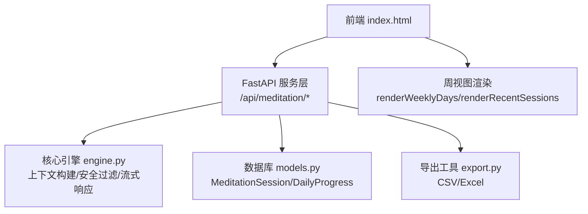
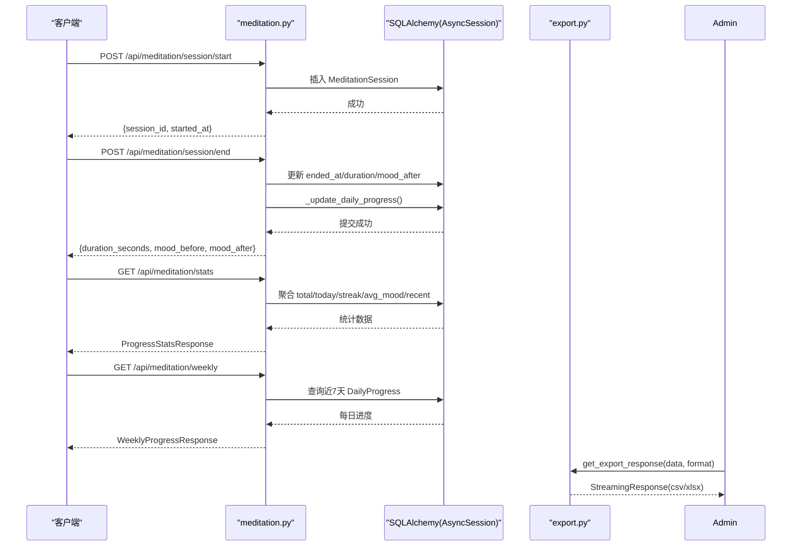
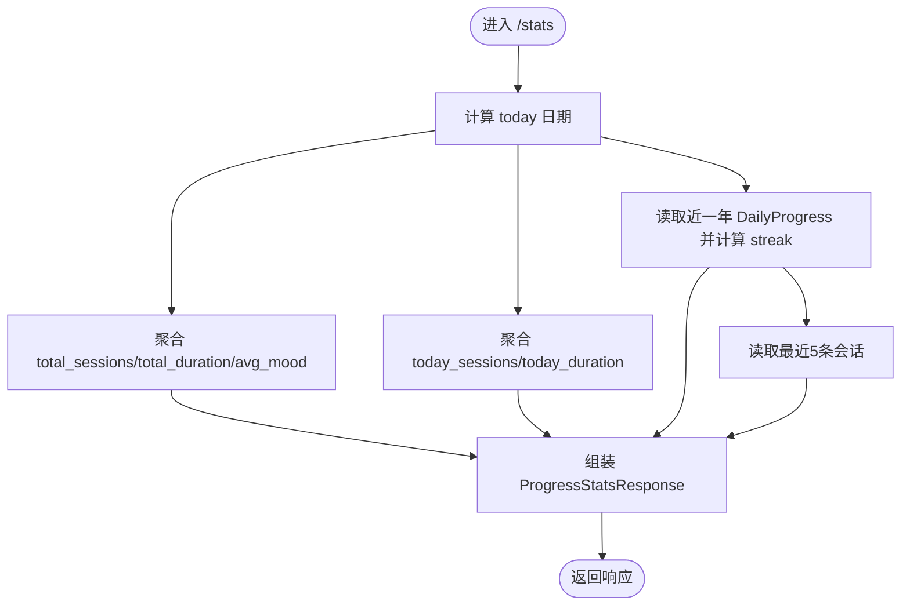
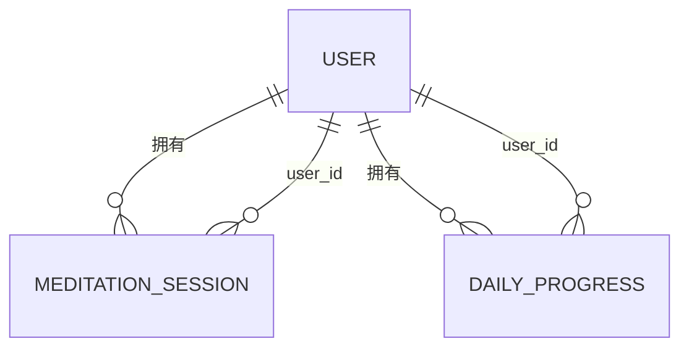
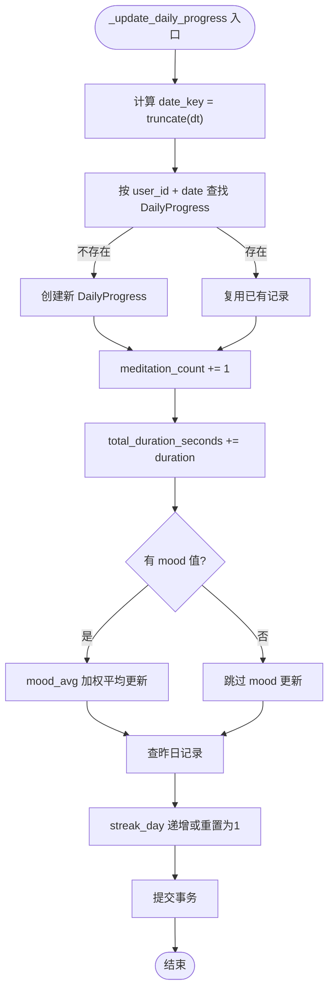
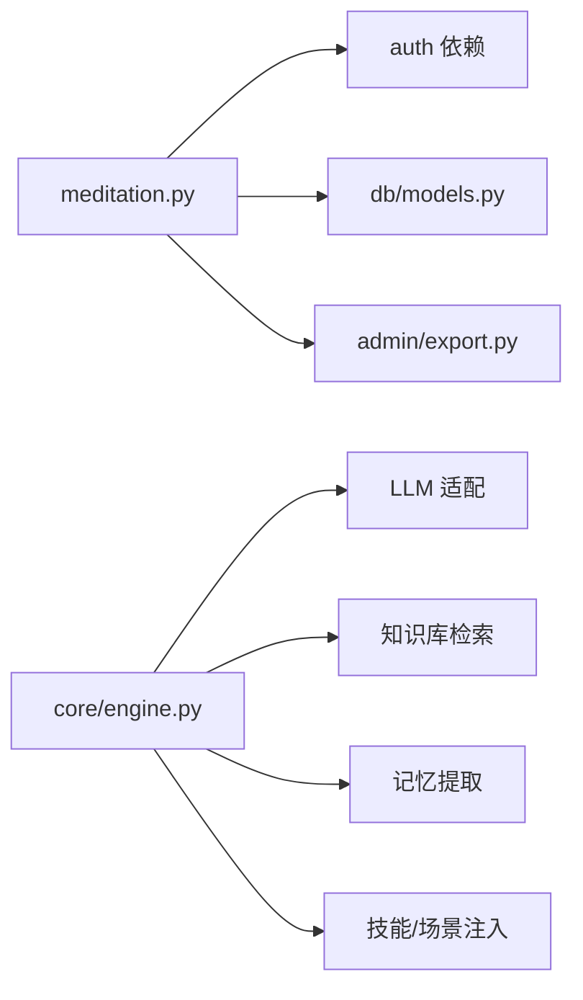

# 冥想数据分析

<cite>
**本文引用的文件**
- [README.md](file://README.md)
- [meditation.py](file://hushai/meditation/api/meditation.py)
- [engine.py](file://hushai/meditation/core/engine.py)
- [models.py](file://hushai/meditation/db/models.py)
- [export.py](file://hushai/meditation/admin/export.py)
- [index.html](file://hushai/meditation/static/index.html)
</cite>

## 目录
1. [引言](#引言)
2. [项目结构](#项目结构)
3. [核心组件](#核心组件)
4. [架构总览](#架构总览)
5. [详细组件分析](#详细组件分析)
6. [依赖关系分析](#依赖关系分析)
7. [性能与可扩展性](#性能与可扩展性)
8. [故障排查指南](#故障排查指南)
9. [结论](#结论)
10. [附录：API 规范与导出集成](#附录api-规范与导出集成)

## 引言
本文件面向 hush.ai 的冥想数据分析系统，聚焦以下目标：
- 统计分析算法：趋势分析、模式识别、个性化洞察生成
- 报告生成：周报、月报、年度报告的数据聚合与格式化输出
- 情绪变化分析模型：波动检测、趋势预测、心理健康指标计算
- 用户行为分析：练习习惯识别、最佳时段分析、参与度评估
- 数据分析 API：统计查询、报告生成、趋势分析、个性化建议获取
- 数据导出与第三方工具集成

说明：
- 当前仓库已实现“会话记录 + 每日进度”的基础统计能力（次数、时长、连续天数、平均情绪、本周进度）。
- 高级功能（如月度/年度报表、趋势预测、个性化建议）在现有数据结构上可平滑扩展。

## 项目结构
围绕冥想数据分析的关键代码位于以下模块：
- API 层：冥想会话与进度追踪接口
- 核心引擎：对话编排、记忆提取、知识检索（为后续个性化洞察提供基础）
- 数据模型：会话、每日进度等实体定义
- 管理后台导出：CSV/Excel 导出工具
- 前端渲染：周视图与最近会话展示

图表来源
- [meditation.py:1-368](file://hushai/meditation/api/meditation.py#L1-L368)
- [engine.py:1-387](file://hushai/meditation/core/engine.py#L1-L387)
- [models.py:204-244](file://hushai/meditation/db/models.py#L204-L244)
- [export.py:1-106](file://hushai/meditation/admin/export.py#L1-L106)
- [index.html:2052-2083](file://hushai/meditation/static/index.html#L2052-L2083)

章节来源
- [README.md:136-178](file://README.md#L136-L178)
- [meditation.py:1-368](file://hushai/meditation/api/meditation.py#L1-L368)
- [models.py:204-244](file://hushai/meditation/db/models.py#L204-L244)
- [export.py:1-106](file://hushai/meditation/admin/export.py#L1-L106)
- [index.html:2052-2083](file://hushai/meditation/static/index.html#L2052-L2083)

## 核心组件
- 冥想会话与进度追踪 API
  - 会话开始/结束、情绪签到、总体统计、本周进度
- 数据模型
  - MeditationSession：单次冥想会话（起止时间、前后情绪、备注）
  - DailyProgress：按日聚合（次数、总时长、平均情绪、连续打卡天数）
- 导出工具
  - CSV/Excel 导出，支持日期序列化、列表字段拼接、空值处理
- 前端可视化
  - 周视图渲染、最近会话列表渲染

章节来源
- [meditation.py:1-368](file://hushai/meditation/api/meditation.py#L1-L368)
- [models.py:204-244](file://hushai/meditation/db/models.py#L204-L244)
- [export.py:1-106](file://hushai/meditation/admin/export.py#L1-L106)
- [index.html:2052-2083](file://hushai/meditation/static/index.html#L2052-L2083)

## 架构总览
冥想数据分析在 FastAPI 服务层暴露 REST 接口，调用 SQLAlchemy 异步会话访问 PostgreSQL/SQLite，结合内存中的活跃会话映射完成会话生命周期管理；导出模块通过 openpyxl/csv 将结果序列化为文件流返回给客户端或管理后台。

图表来源
- [meditation.py:112-368](file://hushai/meditation/api/meditation.py#L112-L368)
- [models.py:204-244](file://hushai/meditation/db/models.py#L204-L244)
- [export.py:92-106](file://hushai/meditation/admin/export.py#L92-L106)

## 详细组件分析

### 冥想会话与进度追踪 API
- 会话开始
  - 生成 session_id，记录 started_at、mood_before、scene/conversation 关联
- 会话结束
  - 计算 duration_seconds，写入 ended_at、mood_after、note
  - 触发 _update_daily_progress 更新当日进度与连续打卡
- 情绪签到
  - 直接更新当日 mood_avg 与 meditation_count
- 总体统计
  - 累计次数/时长、今日次数/时长、平均情绪、最近5条会话
  - 连续打卡：基于 DailyProgress.streak_day 倒序扫描计算 current_streak 与 longest_streak
- 本周进度
  - 过去7天逐日聚合 sessions/duration/mood/streak

图表来源
- [meditation.py:241-333](file://hushai/meditation/api/meditation.py#L241-L333)

章节来源
- [meditation.py:112-368](file://hushai/meditation/api/meditation.py#L112-L368)

### 数据模型与索引设计
- MeditationSession
  - 关键字段：user_id、started_at、ended_at、duration_seconds、mood_before、mood_after、note
- DailyProgress
  - 关键字段：user_id、date、meditation_count、total_duration_seconds、mood_avg、streak_day
  - 索引：ix_daily_progress_user_date(user_id, date) 加速按日聚合
- 关系
  - User 1:N MeditationSession、User 1:N DailyProgress

图表来源
- [models.py:204-244](file://hushai/meditation/db/models.py#L204-L244)

章节来源
- [models.py:204-244](file://hushai/meditation/db/models.py#L204-L244)

### 每日进度更新逻辑
- 入参：用户ID、时间戳、可选 mood_before/mood_after、可选 duration
- 步骤：
  - 取当天日期键，查找或新建 DailyProgress
  - meditation_count+1，total_duration_seconds+=duration
  - mood_avg 增量更新（加权平均）
  - streak_day 根据昨日是否有记录递增
  - 提交事务

图表来源
- [meditation.py:189-238](file://hushai/meditation/api/meditation.py#L189-L238)

章节来源
- [meditation.py:189-238](file://hushai/meditation/api/meditation.py#L189-L238)

### 前端周视图与最近会话渲染
- 周视图：遍历 days 数组，按 day_name/sessions 渲染柱状卡片
- 最近会话：按 started_at/duration_seconds/mood_after 格式化展示

章节来源
- [index.html:2052-2083](file://hushai/meditation/static/index.html#L2052-L2083)

### 报告生成（周报/月报/年报）
- 现状
  - 已提供“本周进度”接口，适合周报
  - 未提供月报/年报专用端点
- 扩展建议（基于现有数据模型）
  - 月报：按月份聚合 DailyProgress，汇总 meditation_count、total_duration_seconds、mood_avg、streak_day 的最大/均值
  - 年报：按年聚合，叠加月度指标，计算年度连续最长打卡、年度平均情绪、年度总时长
  - 输出格式：JSON（供前端/BI 使用），或通过导出工具生成 CSV/Excel

章节来源
- [meditation.py:336-368](file://hushai/meditation/api/meditation.py#L336-L368)
- [models.py:224-244](file://hushai/meditation/db/models.py#L224-L244)
- [export.py:1-106](file://hushai/meditation/admin/export.py#L1-L106)

### 情绪变化分析模型
- 波动检测
  - 基于 DailyProgress.mood_avg 的时间序列，计算相邻日差值绝对值超过阈值为“波动日”
- 趋势预测（轻量）
  - 移动平均/指数平滑用于短期趋势估计
  - 线性回归拟合近 N 日 mood_avg 斜率作为趋势方向
- 心理健康指标（示例）
  - 连续打卡天数（streak_day/current_streak）
  - 平均情绪（mood_avg）
  - 波动率（标准差）
  - 活跃度（日均会话数/时长）

注意：上述为算法设计建议，可在现有 DailyProgress 基础上实现，无需改动核心表结构。

[本节为概念性设计，不直接分析具体文件]

### 用户行为分析机制
- 练习习惯识别
  - 依据 DailyProgress.meditation_count > 0 的天数分布识别“规律型/间歇型/新手型”
- 最佳时段分析
  - 若未来引入 started_at 的小时维度，可统计各小时段的会话密度与情绪均值，定位最佳时段
- 参与度评估
  - 综合指标：连续打卡、近7天/30天活跃天数、平均时长、情绪改善幅度

[本节为概念性设计，不直接分析具体文件]

### 个性化洞察生成（与核心引擎联动）
- 数据来源
  - 会话历史（Message）、记忆（Memory）、技能（Skills）、场景（Scene）
- 流程
  - 引擎在每轮对话中按需提取记忆、检索知识、注入技能与场景提示
  - 可将统计结果（如本周进度、情绪趋势）作为上下文注入，生成个性化建议

章节来源
- [engine.py:91-127](file://hushai/meditation/core/engine.py#L91-L127)
- [models.py:85-118](file://hushai/meditation/db/models.py#L85-L118)

## 依赖关系分析
- API 层依赖
  - 认证依赖：从 Authorization 头解析 JWT，校验用户身份
  - 数据库依赖：SQLAlchemy AsyncSession 访问 models
- 核心引擎依赖
  - LLM 适配、知识库检索、记忆提取、技能/场景注入、安全护栏
- 导出依赖
  - csv/openpyxl 库，返回 StreamingResponse

图表来源
- [meditation.py:1-368](file://hushai/meditation/api/meditation.py#L1-L368)
- [engine.py:1-387](file://hushai/meditation/core/engine.py#L1-L387)
- [models.py:1-434](file://hushai/meditation/db/models.py#L1-L434)
- [export.py:1-106](file://hushai/meditation/admin/export.py#L1-L106)

章节来源
- [meditation.py:1-368](file://hushai/meditation/api/meditation.py#L1-L368)
- [engine.py:1-387](file://hushai/meditation/core/engine.py#L1-L387)
- [models.py:1-434](file://hushai/meditation/db/models.py#L1-L434)
- [export.py:1-106](file://hushai/meditation/admin/export.py#L1-L106)

## 性能与可扩展性
- 查询优化
  - DailyProgress 已建立 (user_id, date) 复合索引，利于按日聚合
  - stats 接口采用函数聚合（count/sum/avg）减少应用层计算
- 并发与一致性
  - 使用异步会话与事务提交，避免长时间锁表
- 可扩展点
  - 新增月度/年度聚合接口，复用 DailyProgress 聚合逻辑
  - 增加小时粒度统计以支持“最佳时段分析”
  - 导出接口统一封装，便于批量导出各类报表

[本节为通用指导，不直接分析具体文件]

## 故障排查指南
- 会话结束 404
  - 可能原因：session_id 不在活跃映射或无权限
  - 排查：确认 start 是否成功、Authorization 是否正确
- 统计为空
  - 可能原因：无会话记录或未提交事务
  - 排查：检查数据库是否存在 MeditationSession/DailyProgress 记录
- 导出失败
  - 可能原因：openpyxl 未安装或数据包含不可序列化类型
  - 排查：查看日志，确保 datetime/list/None 已通过 _serialize_value 处理

章节来源
- [meditation.py:136-175](file://hushai/meditation/api/meditation.py#L136-L175)
- [export.py:81-90](file://hushai/meditation/admin/export.py#L81-L90)

## 结论
- 当前系统已具备冥想会话与每日进度的完整闭环，支撑周报与基础趋势分析
- 在现有模型与接口基础上，可低成本扩展月报/年报、情绪波动检测、趋势预测与个性化建议
- 导出能力完善，便于对接 BI 与第三方工具

[本节为总结，不直接分析具体文件]

## 附录：API 规范与导出集成

### 冥想统计与进度 API
- 会话开始
  - 方法：POST
  - 路径：/api/meditation/session/start
  - 请求体：conversation_id | scene_id | mood_before(1-10)
  - 响应：session_id, started_at
- 会话结束
  - 方法：POST
  - 路径：/api/meditation/session/end
  - 请求体：session_id, mood_after(1-10), note
  - 响应：duration_seconds, mood_before, mood_after
- 情绪签到
  - 方法：POST
  - 路径：/api/meditation/mood-checkin
  - 请求体：mood(1-10)
  - 响应：mood, recorded_at
- 总体统计
  - 方法：GET
  - 路径：/api/meditation/stats
  - 响应：total_sessions, total_duration_seconds, current_streak, longest_streak, today_sessions, today_duration_seconds, avg_mood, recent_sessions
- 本周进度
  - 方法：GET
  - 路径：/api/meditation/weekly
  - 响应：days[]（含 date, day_name, sessions, duration_seconds, mood, streak）

章节来源
- [meditation.py:112-368](file://hushai/meditation/api/meditation.py#L112-L368)

### 导出接口（管理后台）
- 统一导出
  - 方法：GET/POST（由路由决定）
  - 参数：data(list[dict]), filename_base, export_format(csv|xlsx)
  - 响应：StreamingResponse（CSV 或 Excel）
- 注意事项
  - 日期自动格式化为字符串
  - 列表字段以逗号分隔
  - None 转为空字符串

章节来源
- [export.py:1-106](file://hushai/meditation/admin/export.py#L1-L106)

### 第三方工具集成指南
- 数据源
  - 通过 /api/meditation/stats 与 /api/meditation/weekly 拉取结构化 JSON
- 报表生成
  - 使用导出接口生成 CSV/Excel，导入至 BI 工具（如 Metabase、Superset）
- 定时任务
  - 调度脚本定期调用统计与导出接口，生成日报/周报/月报文件并归档

[本节为操作指引，不直接分析具体文件]