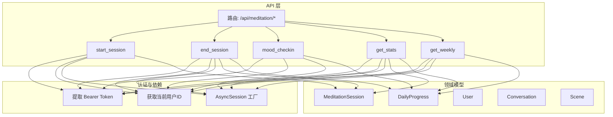
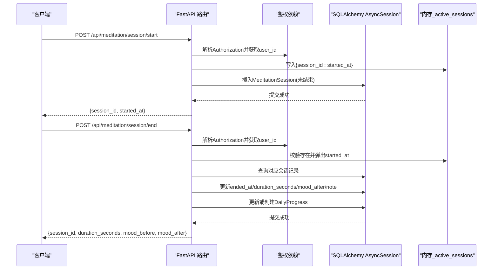
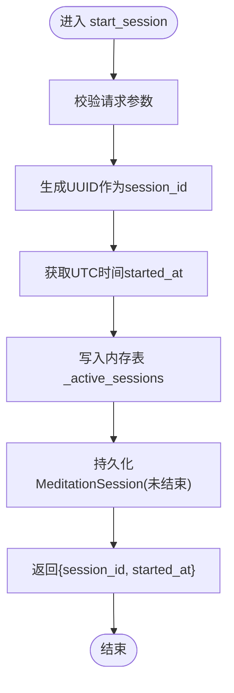
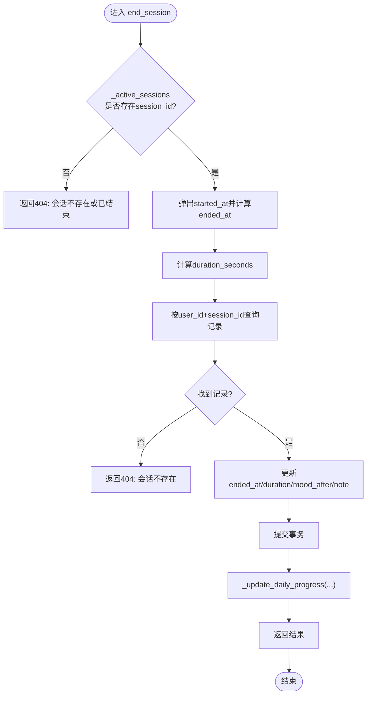
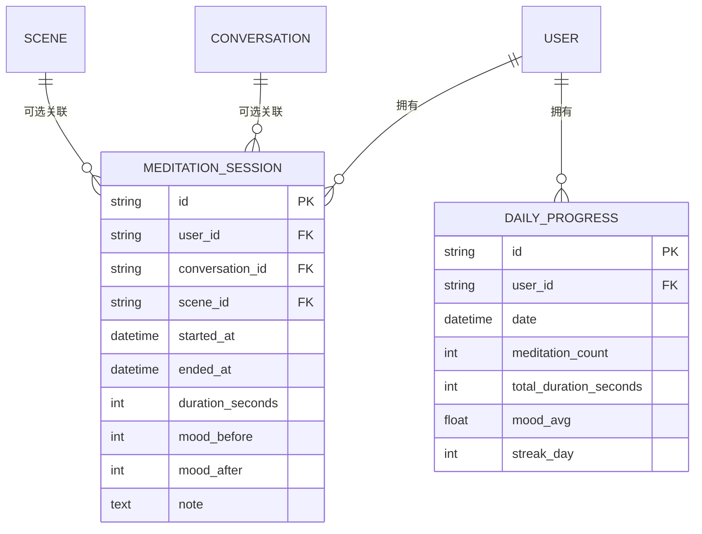
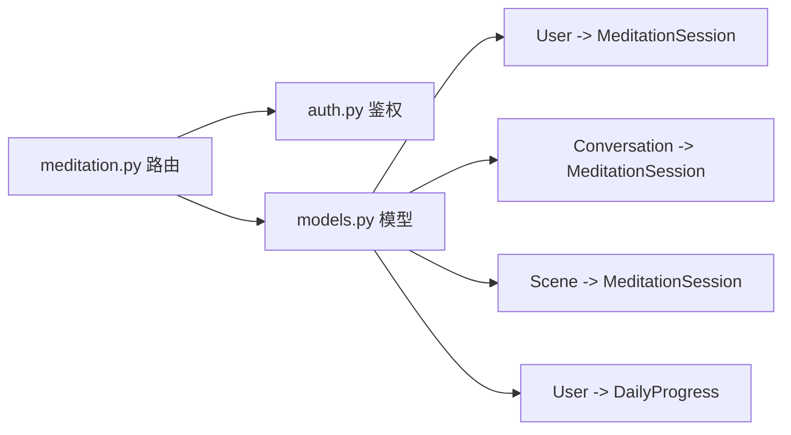

# 冥想会话管理

<cite>
**本文引用的文件**   
- [hushai/meditation/api/meditation.py](file://hushai/meditation/api/meditation.py)
- [hushai/meditation/db/models.py](file://hushai/meditation/db/models.py)
- [hushai/meditation/api/auth.py](file://hushai/meditation/api/auth.py)
</cite>

## 目录
1. [简介](#简介)
2. [项目结构](#项目结构)
3. [核心组件](#核心组件)
4. [架构总览](#架构总览)
5. [详细组件分析](#详细组件分析)
6. [依赖关系分析](#依赖关系分析)
7. [性能考虑](#性能考虑)
8. [故障排查指南](#故障排查指南)
9. [结论](#结论)
10. [附录：API 接口文档](#附录api-接口文档)

## 简介
本技术文档聚焦于“冥想会话管理”功能，覆盖以下关键主题：
- 会话生命周期：开始（start_session）与结束（end_session）的完整流程
- 状态跟踪：内存中的活跃会话字典（_active_sessions）与数据库持久化策略
- 标识与时序：会话ID生成、时间戳处理与时长计算
- 关联关系：会话与对话（conversation_id）、场景（scene_id）的关联
- API 规范：请求参数校验、响应结构与错误处理
- 健壮性：异常处理、并发安全与数据一致性保证

## 项目结构
冥想会话管理位于 FastAPI 路由模块中，使用 SQLAlchemy 异步 ORM 进行数据持久化，并通过 JWT 鉴权保护接口。

图表来源
- [hushai/meditation/api/meditation.py:112-174](file://hushai/meditation/api/meditation.py#L112-L174)
- [hushai/meditation/db/models.py:204-243](file://hushai/meditation/db/models.py#L204-L243)

章节来源
- [hushai/meditation/api/meditation.py:1-368](file://hushai/meditation/api/meditation.py#L1-L368)
- [hushai/meditation/db/models.py:1-434](file://hushai/meditation/db/models.py#L1-L434)

## 核心组件
- 路由与请求/响应模型
  - 会话开始：POST /api/meditation/session/start
  - 会话结束：POST /api/meditation/session/end
  - 情绪打卡：POST /api/meditation/mood-checkin
  - 统计查询：GET /api/meditation/stats
  - 周视图：GET /api/meditation/weekly
- 内存状态
  - _active_sessions：进程内 dict[session_id, started_at]，用于快速判定会话是否仍在进行中并计算时长
- 数据模型
  - MeditationSession：记录会话起止时间、时长、前后情绪、备注及关联 conversation_id/scene_id
  - DailyProgress：按日聚合的练习次数、总时长、平均情绪与连续天数
- 鉴权
  - 通过 Authorization: Bearer <token> 头解析用户身份，确保操作归属

章节来源
- [hushai/meditation/api/meditation.py:44-94](file://hushai/meditation/api/meditation.py#L44-L94)
- [hushai/meditation/api/meditation.py:109-174](file://hushai/meditation/api/meditation.py#L109-L174)
- [hushai/meditation/db/models.py:204-243](file://hushai/meditation/db/models.py#L204-L243)
- [hushai/meditation/api/auth.py:167-171](file://hushai/meditation/api/auth.py#L167-L171)

## 架构总览
下图展示了从客户端发起请求到数据库落盘的关键调用链，以及内存活跃会话表的作用。

图表来源
- [hushai/meditation/api/meditation.py:112-174](file://hushai/meditation/api/meditation.py#L112-L174)
- [hushai/meditation/db/models.py:204-243](file://hushai/meditation/db/models.py#L204-L243)

## 详细组件分析

### 会话开始（start_session）
- 输入校验
  - conversation_id、scene_id 可选；mood_before 为 1~10 的整数（可选）
- 处理逻辑
  - 生成 UUID 作为 session_id
  - 取 UTC 当前时间为 started_at
  - 将 {session_id: started_at} 写入内存表 _active_sessions
  - 在数据库中插入 MeditationSession 初始记录（未结束）
  - 返回 session_id 与 started_at
- 关键点
  - 时间统一使用 UTC，避免时区歧义
  - 会话开始时即持久化，便于后续恢复与审计

图表来源
- [hushai/meditation/api/meditation.py:112-133](file://hushai/meditation/api/meditation.py#L112-L133)

章节来源
- [hushai/meditation/api/meditation.py:44-53](file://hushai/meditation/api/meditation.py#L44-L53)
- [hushai/meditation/api/meditation.py:112-133](file://hushai/meditation/api/meditation.py#L112-L133)
- [hushai/meditation/db/models.py:204-222](file://hushai/meditation/db/models.py#L204-L222)

### 会话结束（end_session）
- 输入校验
  - session_id 必填；mood_after 为 1~10 的整数（可选）；note 可选
- 处理逻辑
  - 校验 _active_sessions 中存在该 session_id，否则返回 404
  - 弹出 started_at，计算 ended_at 与 duration_seconds
  - 根据 user_id 与 session_id 查询数据库记录，不存在则 404
  - 更新 ended_at、duration_seconds、mood_after、note
  - 提交后调用 _update_daily_progress 更新当日进度（含 streak 与 mood_avg）
  - 返回 duration_seconds、前后情绪等
- 关键点
  - 时长基于两端时间差精确到秒
  - 每日进度包含计数、累计时长、情绪均值与连续天数

图表来源
- [hushai/meditation/api/meditation.py:136-174](file://hushai/meditation/api/meditation.py#L136-L174)
- [hushai/meditation/api/meditation.py:189-238](file://hushai/meditation/api/meditation.py#L189-L238)

章节来源
- [hushai/meditation/api/meditation.py:55-66](file://hushai/meditation/api/meditation.py#L55-L66)
- [hushai/meditation/api/meditation.py:136-174](file://hushai/meditation/api/meditation.py#L136-L174)
- [hushai/meditation/api/meditation.py:189-238](file://hushai/meditation/api/meditation.py#L189-L238)

### 情绪打卡（mood_checkin）
- 作用：在不结束会话的情况下记录一次情绪值，用于更新当日进度与情绪均值
- 处理逻辑：根据当前 UTC 时间更新 DailyProgress（计数、时长、mood_avg、streak_day）

章节来源
- [hushai/meditation/api/meditation.py:177-186](file://hushai/meditation/api/meditation.py#L177-L186)
- [hushai/meditation/api/meditation.py:189-238](file://hushai/meditation/api/meditation.py#L189-L238)

### 统计与周视图
- GET /api/meditation/stats：汇总总次数、总时长、今日次数/时长、最长/当前连续天数、平均情绪、最近5条会话
- GET /api/meditation/weekly：过去7天每日的会话数、时长、情绪均值、连续天数

章节来源
- [hushai/meditation/api/meditation.py:241-333](file://hushai/meditation/api/meditation.py#L241-L333)
- [hushai/meditation/api/meditation.py:336-367](file://hushai/meditation/api/meditation.py#L336-L367)

### 数据模型与关联关系
- MeditationSession
  - 关键字段：id、user_id、conversation_id、scene_id、started_at、ended_at、duration_seconds、mood_before、mood_after、note
  - 与 User 一对多；与 Conversation、Scene 外键关联（可选）
- DailyProgress
  - 关键字段：user_id、date、meditation_count、total_duration_seconds、mood_avg、streak_day
  - 索引：(user_id, date)

图表来源
- [hushai/meditation/db/models.py:204-243](file://hushai/meditation/db/models.py#L204-L243)

章节来源
- [hushai/meditation/db/models.py:204-243](file://hushai/meditation/db/models.py#L204-L243)

### 会话ID生成机制
- 使用 UUID v4 生成全局唯一字符串作为 session_id
- 优点：无中心化协调、冲突概率极低、适合分布式环境

章节来源
- [hushai/meditation/api/meditation.py:118](file://hushai/meditation/api/meditation.py#L118)

### 时间戳处理逻辑
- 所有时间均使用 UTC（datetime.now(timezone.utc)）
- 日期比较与分组采用 func.date() 截断至日粒度，避免时区与跨日问题

章节来源
- [hushai/meditation/api/meditation.py:36-41](file://hushai/meditation/api/meditation.py#L36-L41)
- [hushai/meditation/api/meditation.py:197-204](file://hushai/meditation/api/meditation.py#L197-L204)

### 时长计算算法
- duration_seconds = (ended_at - started_at).total_seconds() 取整
- 以秒为单位，便于统计与展示

章节来源
- [hushai/meditation/api/meditation.py:146-147](file://hushai/meditation/api/meditation.py#L146-L147)

### 并发安全与数据一致性
- 并发安全
  - _active_sessions 为进程内 dict，单进程内 Python GIL 可保证基本读写原子性；但多进程部署下需外部锁或共享存储（如 Redis）保障互斥
- 数据一致性
  - 会话结束先弹内存再写库，若写库失败会回滚，但内存已弹出导致“幽灵会话”。建议：
    - 将内存操作置于事务之后，或
    - 使用带过期时间的缓存（TTL），定期清理
    - 或在结束流程中加入幂等校验（以数据库为准）

章节来源
- [hushai/meditation/api/meditation.py:142-147](file://hushai/meditation/api/meditation.py#L142-L147)
- [hushai/meditation/api/meditation.py:164-167](file://hushai/meditation/api/meditation.py#L164-L167)

## 依赖关系分析
- 路由依赖
  - 鉴权：从 Authorization 头提取 Bearer token，解码并校验用户有效性
  - 数据库：通过 Depends(get_session) 注入异步会话
- 模型依赖
  - MeditationSession 与 User、Conversation、Scene 的外键关系
  - DailyProgress 与 User 的一对多关系

图表来源
- [hushai/meditation/api/meditation.py:14-16](file://hushai/meditation/api/meditation.py#L14-L16)
- [hushai/meditation/api/auth.py:167-171](file://hushai/meditation/api/auth.py#L167-L171)
- [hushai/meditation/db/models.py:204-243](file://hushai/meditation/db/models.py#L204-L243)

章节来源
- [hushai/meditation/api/meditation.py:14-16](file://hushai/meditation/api/meditation.py#L14-L16)
- [hushai/meditation/api/auth.py:121-131](file://hushai/meditation/api/auth.py#L121-L131)
- [hushai/meditation/db/models.py:204-243](file://hushai/meditation/db/models.py#L204-L243)

## 性能考虑
- 索引优化
  - DailyProgress(user_id, date) 复合索引提升按日查询效率
- 聚合查询
  - stats 使用 SQL 聚合函数减少应用层计算
- 内存表
  - _active_sessions 提供 O(1) 查找，避免重复查询数据库判断是否进行中

章节来源
- [hushai/meditation/db/models.py:241](file://hushai/meditation/db/models.py#L241)
- [hushai/meditation/api/meditation.py:248-271](file://hushai/meditation/api/meditation.py#L248-L271)

## 故障排查指南
- 常见错误
  - 401 未授权：Authorization 缺失或 token 无效
  - 404 会话不存在：session_id 不在 _active_sessions 或数据库无记录
- 定位步骤
  - 检查 Authorization 头格式是否为 "Bearer <token>"
  - 确认 start_session 已成功返回 session_id
  - 核对数据库 MeditationSession 记录是否存在且属于当前用户
  - 检查 DailyProgress 更新是否触发（查看 meditation_count、total_duration_seconds、mood_avg、streak_day）

章节来源
- [hushai/meditation/api/meditation.py:25-33](file://hushai/meditation/api/meditation.py#L25-33)
- [hushai/meditation/api/meditation.py:142-157](file://hushai/meditation/api/meditation.py#L142-L157)

## 结论
冥想会话管理通过“内存快路径 + 数据库持久化”的组合实现高效的状态跟踪与可靠的数据归档。为保证生产环境的健壮性，建议对内存表引入 TTL 或外部缓存，并在结束流程中强化幂等与一致性保障。

## 附录：API 接口文档

### 通用鉴权
- 请求头
  - Authorization: Bearer <access_token>
- 说明
  - access_token 由登录流程签发，包含用户标识与有效期

章节来源
- [hushai/meditation/api/auth.py:167-171](file://hushai/meditation/api/auth.py#L167-L171)

### 开始会话
- 方法：POST
- 路径：/api/meditation/session/start
- 请求体
  - conversation_id: 字符串，可选
  - scene_id: 字符串，可选
  - mood_before: 整数 1~10，可选
- 响应体
  - session_id: 字符串
  - started_at: UTC 时间
- 错误码
  - 401：未授权
  - 其他：服务端异常

章节来源
- [hushai/meditation/api/meditation.py:44-53](file://hushai/meditation/api/meditation.py#L44-L53)
- [hushai/meditation/api/meditation.py:112-133](file://hushai/meditation/api/meditation.py#L112-L133)

### 结束会话
- 方法：POST
- 路径：/api/meditation/session/end
- 请求体
  - session_id: 字符串，必填
  - mood_after: 整数 1~10，可选
  - note: 字符串，可选
- 响应体
  - session_id: 字符串
  - duration_seconds: 整数
  - mood_before: 整数或空
  - mood_after: 整数或空
- 错误码
  - 401：未授权
  - 404：会话不存在或已结束

章节来源
- [hushai/meditation/api/meditation.py:55-66](file://hushai/meditation/api/meditation.py#L55-L66)
- [hushai/meditation/api/meditation.py:136-174](file://hushai/meditation/api/meditation.py#L136-L174)

### 情绪打卡
- 方法：POST
- 路径：/api/meditation/mood-checkin
- 请求体
  - mood: 整数 1~10，必填
- 响应体
  - mood: 整数
  - recorded_at: UTC 时间
- 错误码
  - 401：未授权

章节来源
- [hushai/meditation/api/meditation.py:68-75](file://hushai/meditation/api/meditation.py#L68-L75)
- [hushai/meditation/api/meditation.py:177-186](file://hushai/meditation/api/meditation.py#L177-L186)

### 统计概览
- 方法：GET
- 路径：/api/meditation/stats
- 响应体字段
  - total_sessions: 总次数
  - total_duration_seconds: 总时长
  - current_streak: 当前连续天数
  - longest_streak: 最长连续天数
  - today_sessions: 今日次数
  - today_duration_seconds: 今日时长
  - avg_mood: 平均情绪（浮点或空）
  - recent_sessions: 最近5条会话列表
- 错误码
  - 401：未授权

章节来源
- [hushai/meditation/api/meditation.py:85-94](file://hushai/meditation/api/meditation.py#L85-L94)
- [hushai/meditation/api/meditation.py:241-333](file://hushai/meditation/api/meditation.py#L241-L333)

### 周视图
- 方法：GET
- 路径：/api/meditation/weekly
- 响应体
  - days: 过去7天的每日统计数组
    - date: 月-日
    - day_name: 中文星期
    - sessions: 次数
    - duration_seconds: 时长
    - mood: 平均情绪或空
    - streak: 连续天数
- 错误码
  - 401：未授权

章节来源
- [hushai/meditation/api/meditation.py:96-106](file://hushai/meditation/api/meditation.py#L96-L106)
- [hushai/meditation/api/meditation.py:336-367](file://hushai/meditation/api/meditation.py#L336-L367)