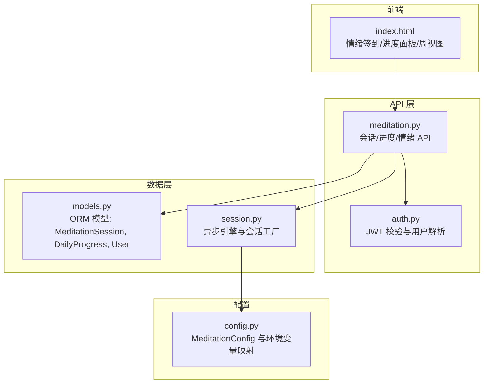
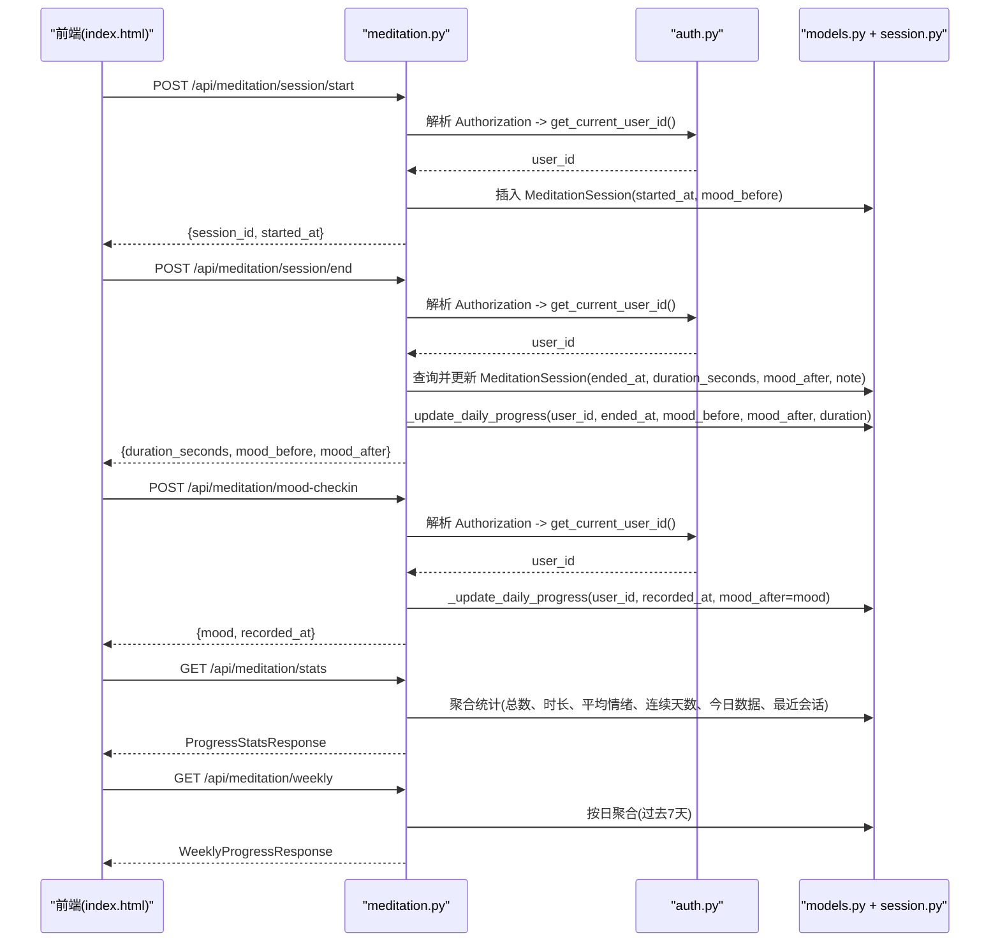
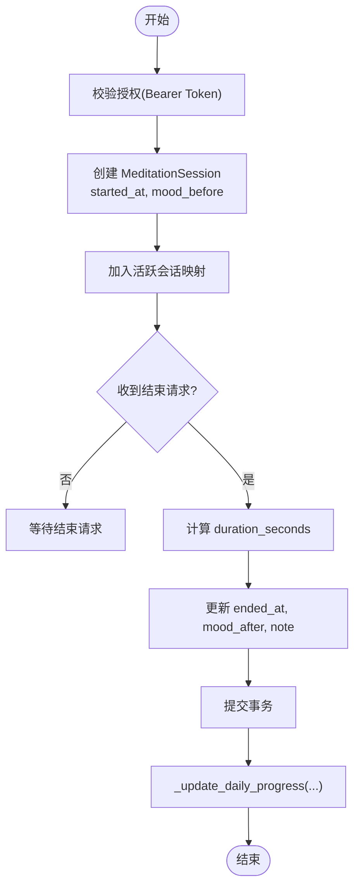
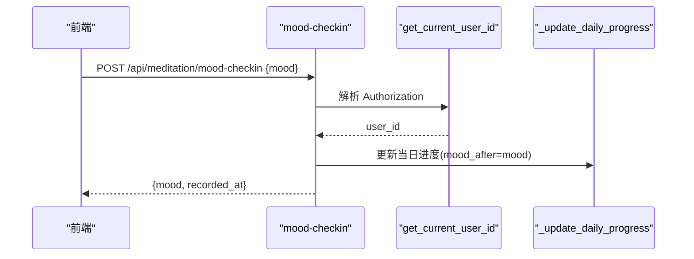
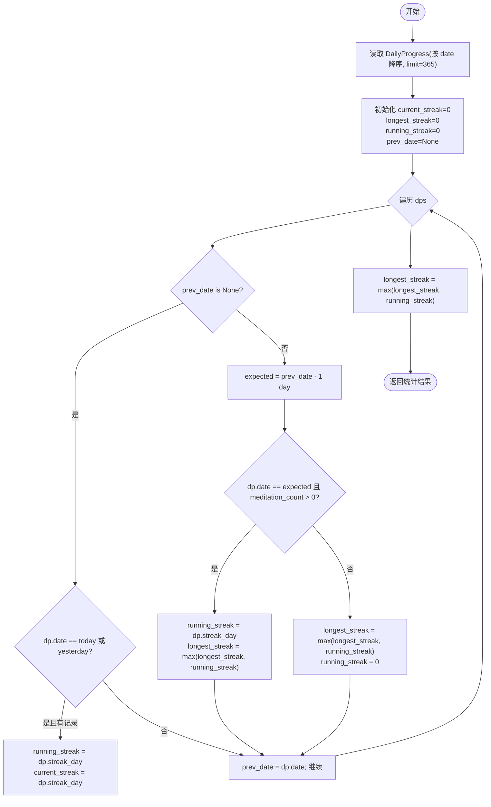
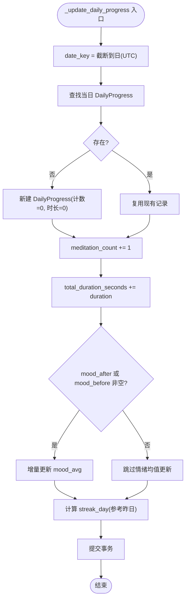
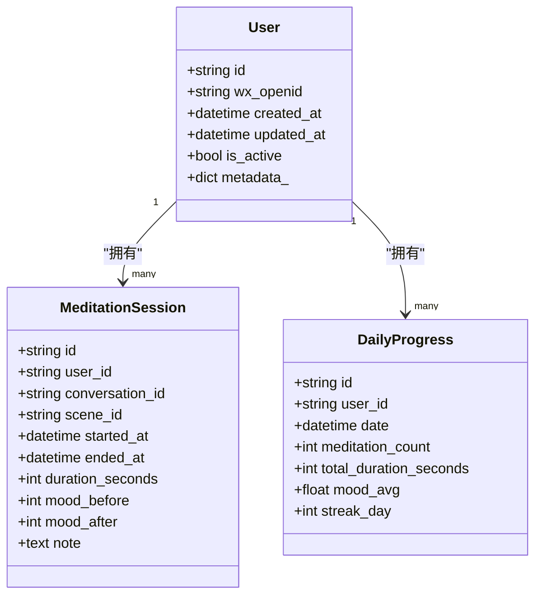
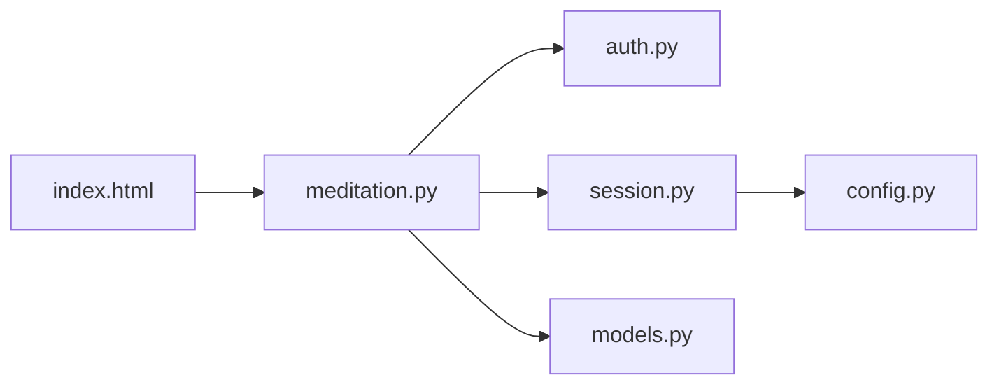

# 冥想追踪系统

<cite>
**本文引用的文件**   
- [hushai/meditation/api/meditation.py](file://hushai/meditation/api/meditation.py)
- [hushai/meditation/db/models.py](file://hushai/meditation/db/models.py)
- [hushai/meditation/api/auth.py](file://hushai/meditation/api/auth.py)
- [hushai/meditation/db/session.py](file://hushai/meditation/db/session.py)
- [hushai/meditation/config.py](file://hushai/meditation/config.py)
- [hushai/meditation/static/index.html](file://hushai/meditation/static/index.html)
</cite>

## 目录
1. [简介](#简介)
2. [项目结构](#项目结构)
3. [核心组件](#核心组件)
4. [架构总览](#架构总览)
5. [详细组件分析](#详细组件分析)
6. [依赖关系分析](#依赖关系分析)
7. [性能考量](#性能考量)
8. [故障排查指南](#故障排查指南)
9. [结论](#结论)
10. [附录：API 接口文档与前端集成指南](#附录api-接口文档与前端集成指南)

## 简介
本文件为 hush.ai 的“冥想追踪系统”提供完整功能文档，覆盖以下关键主题：
- 冥想会话生命周期管理（开始、结束、状态跟踪、数据持久化）
- 情绪签到机制（情绪值记录、时间戳处理、数据验证规则）
- 进度统计算法（连续天数、总时长、平均情绪等指标）
- 每日进度更新机制（数据聚合、增量更新、一致性保证）
- 统计数据 API（统计查询、周报表生成、历史数据分析）
- 前端可视化展示与集成指南

## 项目结构
冥想追踪系统位于 meditation 模块中，主要包含：
- API 层：FastAPI 路由定义与请求/响应模型
- 数据层：SQLAlchemy ORM 模型与异步数据库会话管理
- 认证与安全：JWT 签发与校验、Bearer Token 提取
- 配置：环境变量加载与运行时配置
- 前端静态页面：情绪签到弹窗、进度抽屉、周视图渲染等

图表来源
- [hushai/meditation/api/meditation.py:1-368](file://hushai/meditation/api/meditation.py#L1-L368)
- [hushai/meditation/api/auth.py:1-171](file://hushai/meditation/api/auth.py#L1-L171)
- [hushai/meditation/db/models.py:1-434](file://hushai/meditation/db/models.py#L1-L434)
- [hushai/meditation/db/session.py:1-83](file://hushai/meditation/db/session.py#L1-L83)
- [hushai/meditation/config.py:1-136](file://hushai/meditation/config.py#L1-L136)
- [hushai/meditation/static/index.html:1124-2111](file://hushai/meditation/static/index.html#L1124-L2111)

章节来源
- [hushai/meditation/api/meditation.py:1-368](file://hushai/meditation/api/meditation.py#L1-L368)
- [hushai/meditation/db/models.py:1-434](file://hushai/meditation/db/models.py#L1-L434)
- [hushai/meditation/api/auth.py:1-171](file://hushai/meditation/api/auth.py#L1-L171)
- [hushai/meditation/db/session.py:1-83](file://hushai/meditation/db/session.py#L1-L83)
- [hushai/meditation/config.py:1-136](file://hushai/meditation/config.py#L1-L136)
- [hushai/meditation/static/index.html:1124-2111](file://hushai/meditation/static/index.html#L1124-L2111)

## 核心组件
- 会话控制器与统计 API：负责会话开始/结束、情绪签到、统计与周报。
- 认证中间件：基于 JWT 的用户身份解析与权限校验。
- 数据模型：会话记录 MeditationSession、每日进度 DailyProgress、用户 User。
- 数据库会话：异步 SQLAlchemy 引擎与会话工厂，支持 SQLite/PostgreSQL。
- 配置中心：从 .env 加载配置项，包括数据库 URL、JWT 密钥、LLM 与嵌入提供者等。
- 前端交互：情绪签到弹窗、进度面板、周视图渲染与最近练习列表。

章节来源
- [hushai/meditation/api/meditation.py:1-368](file://hushai/meditation/api/meditation.py#L1-L368)
- [hushai/meditation/api/auth.py:1-171](file://hushai/meditation/api/auth.py#L1-L171)
- [hushai/meditation/db/models.py:1-434](file://hushai/meditation/db/models.py#L1-L434)
- [hushai/meditation/db/session.py:1-83](file://hushai/meditation/db/session.py#L1-L83)
- [hushai/meditation/config.py:1-136](file://hushai/meditation/config.py#L1-L136)
- [hushai/meditation/static/index.html:1124-2111](file://hushai/meditation/static/index.html#L1124-L2111)

## 架构总览
系统采用前后端分离架构：前端通过 REST API 调用后端服务；后端使用 FastAPI 暴露接口，并通过 SQLAlchemy 异步访问数据库；认证由 JWT 完成，配置集中管理。

图表来源
- [hushai/meditation/api/meditation.py:112-367](file://hushai/meditation/api/meditation.py#L112-L367)
- [hushai/meditation/api/auth.py:109-132](file://hushai/meditation/api/auth.py#L109-L132)
- [hushai/meditation/db/models.py:204-244](file://hushai/meditation/db/models.py#L204-L244)
- [hushai/meditation/db/session.py:57-68](file://hushai/meditation/db/session.py#L57-L68)

## 详细组件分析

### 会话生命周期管理
- 开始会话
  - 生成唯一 session_id 与 UTC 时间戳
  - 在内存字典中维护活跃会话映射（用于快速判断是否已结束）
  - 写入 MeditationSession 记录（含 conversation_id、scene_id、mood_before）
- 结束会话
  - 校验 session_id 是否存在于活跃映射
  - 计算持续时间（秒），更新 ended_at、duration_seconds、mood_after、note
  - 提交事务后触发每日进度更新
- 状态跟踪
  - 活跃会话通过内存字典维护，避免重复结束
  - 数据库记录作为最终一致的数据源

图表来源
- [hushai/meditation/api/meditation.py:112-174](file://hushai/meditation/api/meditation.py#L112-L174)
- [hushai/meditation/db/models.py:204-222](file://hushai/meditation/db/models.py#L204-L222)

章节来源
- [hushai/meditation/api/meditation.py:112-174](file://hushai/meditation/api/meditation.py#L112-L174)
- [hushai/meditation/db/models.py:204-222](file://hushai/meditation/db/models.py#L204-L222)

### 情绪签到机制
- 输入验证
  - mood 字段范围 1..10，使用 Pydantic Field 约束
- 时间戳处理
  - 使用 UTC 时间作为 recorded_at
- 数据更新
  - 直接调用 _update_daily_progress，将 mood 作为 mood_after 参与当日情绪均值与连续天数计算
- 前端交互
  - 弹窗滑块选择情绪值，确认后调用 /api/meditation/mood-checkin

图表来源
- [hushai/meditation/api/meditation.py:177-186](file://hushai/meditation/api/meditation.py#L177-L186)
- [hushai/meditation/api/auth.py:121-132](file://hushai/meditation/api/auth.py#L121-L132)
- [hushai/meditation/static/index.html:1893-1936](file://hushai/meditation/static/index.html#L1893-L1936)

章节来源
- [hushai/meditation/api/meditation.py:177-186](file://hushai/meditation/api/meditation.py#L177-L186)
- [hushai/meditation/static/index.html:1893-1936](file://hushai/meditation/static/index.html#L1893-L1936)

### 进度统计算法
- 累计指标
  - total_sessions：会话计数
  - total_duration_seconds：会话时长总和
  - avg_mood：所有会话 mood_after 的平均值（若存在且大于 0）
- 今日指标
  - today_sessions、today_duration_seconds：按当天 started_at 过滤
- 连续天数
  - current_streak：当前连续天数（允许今天或昨天有记录）
  - longest_streak：历史最长连续天数
  - 算法要点：
    - 按日期降序读取最多 365 条 DailyProgress
    - 维护 running_streak 与 prev_date，比较相邻日期差是否为 1 天
    - 仅当 meditation_count > 0 时计入连续
- 最近会话
  - 返回最近 5 条会话（id、started_at、duration_seconds、mood_before、mood_after）

图表来源
- [hushai/meditation/api/meditation.py:241-333](file://hushai/meditation/api/meditation.py#L241-L333)

章节来源
- [hushai/meditation/api/meditation.py:241-333](file://hushai/meditation/api/meditation.py#L241-L333)

### 每日进度更新机制
- 数据聚合
  - meditation_count：每次事件（会话结束或情绪签到）+1
  - total_duration_seconds：会话结束时累加 duration
  - mood_avg：增量加权平均
    - 若已有旧均值与旧计数，则 new_avg = (old_avg * old_count + mood_val) / new_count
    - 否则直接赋值为 mood_val
- 连续天数
  - streak_day：若昨日存在且 meditation_count > 0，则 +1；否则重置为 1
- 一致性保证
  - 每个更新操作在单个事务内提交，确保当日记录原子性
  - 使用 func.date(DailyProgress.date) 进行日期匹配，避免时区问题

图表来源
- [hushai/meditation/api/meditation.py:189-238](file://hushai/meditation/api/meditation.py#L189-L238)

章节来源
- [hushai/meditation/api/meditation.py:189-238](file://hushai/meditation/api/meditation.py#L189-L238)

### 数据模型与关系

图表来源
- [hushai/meditation/db/models.py:37-66](file://hushai/meditation/db/models.py#L37-L66)
- [hushai/meditation/db/models.py:204-244](file://hushai/meditation/db/models.py#L204-L244)

章节来源
- [hushai/meditation/db/models.py:37-66](file://hushai/meditation/db/models.py#L37-L66)
- [hushai/meditation/db/models.py:204-244](file://hushai/meditation/db/models.py#L204-L244)

## 依赖关系分析
- API 层依赖认证模块以解析用户身份
- API 层依赖数据库会话工厂获取 AsyncSession
- 数据模型定义表结构与关系
- 配置模块提供数据库 URL、JWT 密钥等运行时参数
- 前端通过 fetch 调用 API，并在本地存储 token

图表来源
- [hushai/meditation/api/meditation.py:1-368](file://hushai/meditation/api/meditation.py#L1-L368)
- [hushai/meditation/api/auth.py:1-171](file://hushai/meditation/api/auth.py#L1-L171)
- [hushai/meditation/db/session.py:1-83](file://hushai/meditation/db/session.py#L1-L83)
- [hushai/meditation/db/models.py:1-434](file://hushai/meditation/db/models.py#L1-L434)
- [hushai/meditation/config.py:1-136](file://hushai/meditation/config.py#L1-L136)
- [hushai/meditation/static/index.html:1124-2111](file://hushai/meditation/static/index.html#L1124-L2111)

章节来源
- [hushai/meditation/api/meditation.py:1-368](file://hushai/meditation/api/meditation.py#L1-L368)
- [hushai/meditation/api/auth.py:1-171](file://hushai/meditation/api/auth.py#L1-L171)
- [hushai/meditation/db/session.py:1-83](file://hushai/meditation/db/session.py#L1-L83)
- [hushai/meditation/db/models.py:1-434](file://hushai/meditation/db/models.py#L1-L434)
- [hushai/meditation/config.py:1-136](file://hushai/meditation/config.py#L1-L136)
- [hushai/meditation/static/index.html:1124-2111](file://hushai/meditation/static/index.html#L1124-L2111)

## 性能考量
- 数据库索引
  - DailyProgress 对 (user_id, date) 建立复合索引，提升按日查询效率
- 查询优化
  - 统计接口使用 SQL 聚合函数减少应用层计算
  - 连续天数计算限制读取最近 365 天，避免全表扫描
- 连接池
  - SQLite 与 PostgreSQL 分别设置合适的 pool_size，降低连接开销
- 内存活跃会话
  - 使用进程内字典维护活跃会话，O(1) 判断是否已结束，但需注意进程重启导致的状态丢失

章节来源
- [hushai/meditation/db/models.py:241-244](file://hushai/meditation/db/models.py#L241-L244)
- [hushai/meditation/db/session.py:34-54](file://hushai/meditation/db/session.py#L34-L54)
- [hushai/meditation/api/meditation.py:273-305](file://hushai/meditation/api/meditation.py#L273-L305)

## 故障排查指南
- 401 未授权
  - 检查 Authorization 头是否携带有效 Bearer Token
  - 确认 Token 类型与过期时间
- 404 会话不存在或已结束
  - 确认 session_id 是否在活跃映射中
  - 检查是否重复结束会话
- 数据库连接失败
  - 检查 MEDITATION_POSTGRES_URL 或默认 SQLite 路径
  - 确认异步驱动已正确安装（如 asyncpg、aiosqlite）
- 连续天数异常
  - 检查 DailyProgress 的 date 字段是否按 UTC 截断
  - 确认昨日记录存在且 meditation_count > 0

章节来源
- [hushai/meditation/api/meditation.py:142-157](file://hushai/meditation/api/meditation.py#L142-L157)
- [hushai/meditation/api/auth.py:109-132](file://hushai/meditation/api/auth.py#L109-L132)
- [hushai/meditation/db/session.py:15-31](file://hushai/meditation/db/session.py#L15-L31)

## 结论
冥想追踪系统通过清晰的 API 设计、稳健的认证机制与高效的数据库模型，实现了完整的会话生命周期管理与进度统计能力。增量更新的每日进度与严格的连续天数算法保证了数据的准确性与一致性。前端提供了直观的情绪签到与进度展示，便于用户理解自身练习情况。

## 附录：API 接口文档与前端集成指南

### 接口总览
- 基础路径：/api/meditation
- 认证方式：Authorization: Bearer <access_token>

#### 会话管理
- POST /api/meditation/session/start
  - 请求体：{conversation_id?, scene_id?, mood_before?(1..10)}
  - 响应：{session_id, started_at}
- POST /api/meditation/session/end
  - 请求体：{session_id, mood_after?(1..10), note?}
  - 响应：{session_id, duration_seconds, mood_before?, mood_after?}

#### 情绪签到
- POST /api/meditation/mood-checkin
  - 请求体：{mood(1..10)}
  - 响应：{mood, recorded_at}

#### 统计与周报
- GET /api/meditation/stats
  - 响应：{total_sessions, total_duration_seconds, current_streak, longest_streak, today_sessions, today_duration_seconds, avg_mood?, recent_sessions[]}
- GET /api/meditation/weekly
  - 响应：{days: [{date, day_name, sessions, duration_seconds, mood?, streak}]}

章节来源
- [hushai/meditation/api/meditation.py:112-367](file://hushai/meditation/api/meditation.py#L112-L367)

### 前端集成指南
- 情绪签到弹窗
  - 打开弹窗后，用户通过滑块选择情绪值（1..10）
  - 点击确认调用 /api/meditation/mood-checkin，携带 Authorization 头
- 进度面板
  - 打开面板后调用 /api/meditation/stats，渲染总次数、总分钟数、连续天数、平均情绪
  - 同时调用 /api/meditation/weekly 渲染本周每日练习次数
- 最近练习列表
  - 根据 stats 返回的 recent_sessions 渲染日期、时长与情绪记录

章节来源
- [hushai/meditation/static/index.html:1893-1936](file://hushai/meditation/static/index.html#L1893-L1936)
- [hushai/meditation/static/index.html:2014-2083](file://hushai/meditation/static/index.html#L2014-L2083)