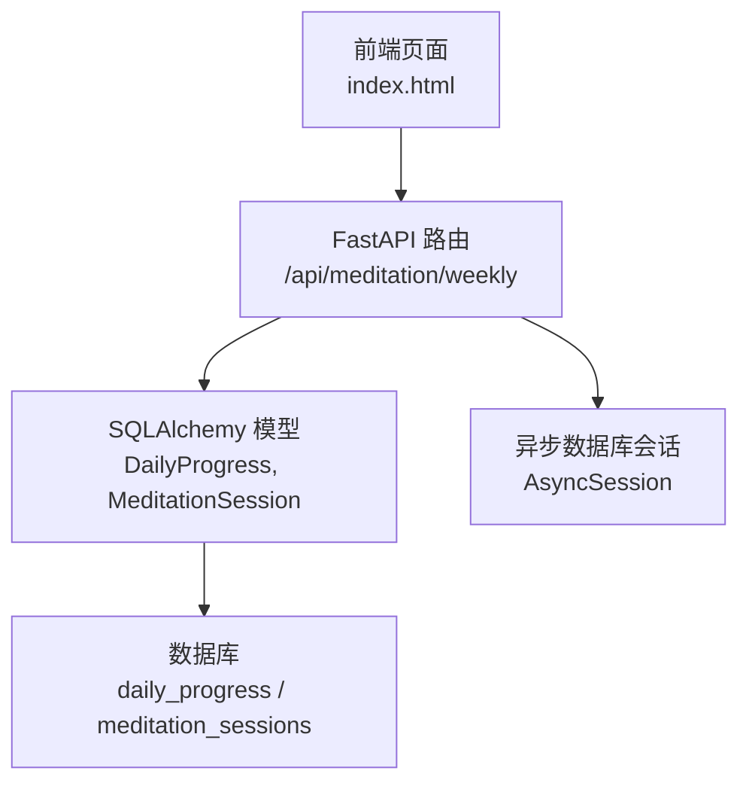
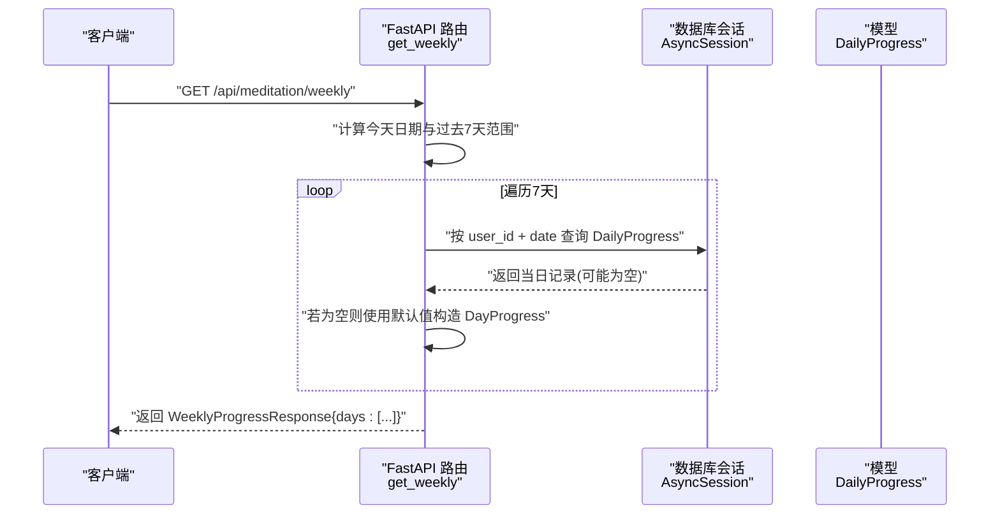
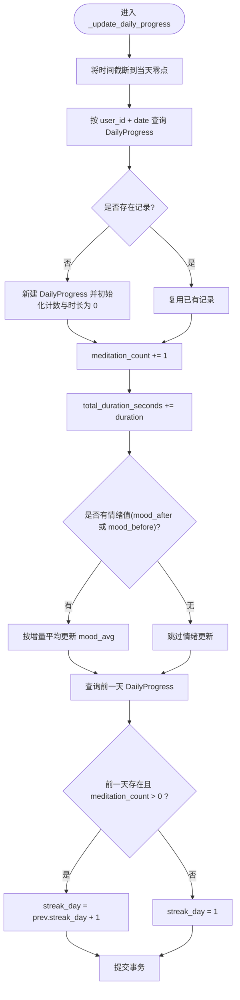
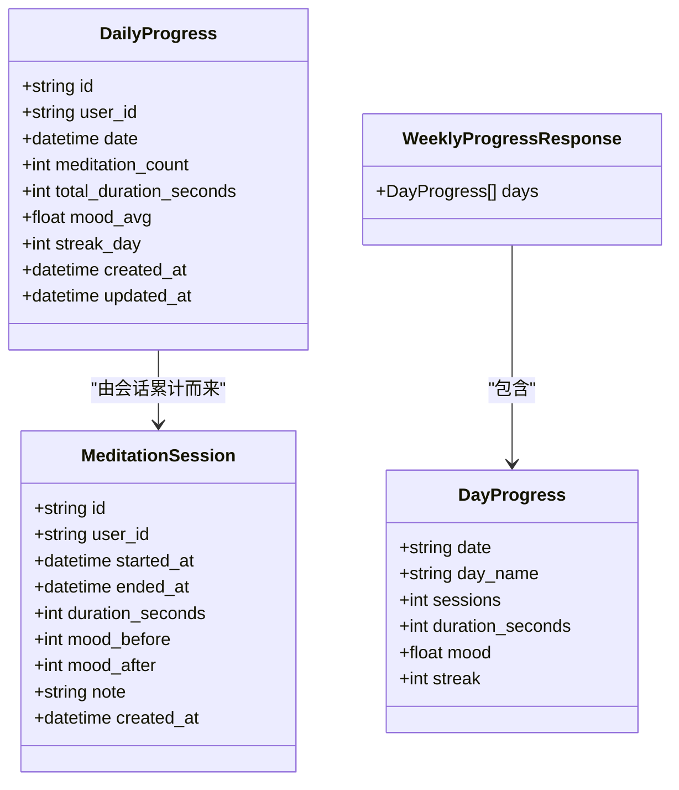
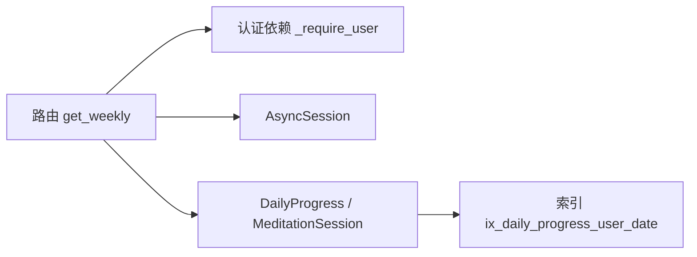

# 周报表生成功能

<cite>
**本文引用的文件**   
- [hushai/meditation/api/meditation.py](file://hushai/meditation/api/meditation.py)
- [hushai/meditation/db/models.py](file://hushai/meditation/db/models.py)
- [hushai/meditation/static/index.html](file://hushai/meditation/static/index.html)
</cite>

## 目录
1. [简介](#简介)
2. [项目结构](#项目结构)
3. [核心组件](#核心组件)
4. [架构总览](#架构总览)
5. [详细组件分析](#详细组件分析)
6. [依赖关系分析](#依赖关系分析)
7. [性能考虑](#性能考虑)
8. [故障排查指南](#故障排查指南)
9. [结论](#结论)
10. [附录：API 规范](#附录api-规范)

## 简介
本技术文档聚焦“周报表生成功能”，围绕以下目标展开：
- 深入解释 WeeklyProgressResponse 的数据结构设计，以及 DayProgress 模型各字段的含义与计算逻辑。
- 详细说明过去 7 天数据查询的实现机制，包括日期范围计算、星期名称映射与本地化处理。
- 阐述每日数据的聚合查询策略，涵盖冥想次数、总时长、平均情绪值与连续天数的统计方法。
- 解释空数据处理与默认值设置策略。
- 提供周报表 API 接口的完整规范（查询参数、响应格式、错误处理）。
- 给出数据缓存策略与查询性能优化的实现建议。

## 项目结构
与周报表功能直接相关的代码位于 meditation 模块的 API 层与数据库模型层：
- API 层负责认证、路由、请求校验、业务组装与响应序列化。
- 数据模型层定义会话与每日进度表结构及索引。
- 前端静态页面通过调用 /api/meditation/weekly 获取周报表数据并渲染。

图表来源
- [hushai/meditation/api/meditation.py:336-367](file://hushai/meditation/api/meditation.py#L336-L367)
- [hushai/meditation/db/models.py:204-243](file://hushai/meditation/db/models.py#L204-L243)

章节来源
- [hushai/meditation/api/meditation.py:1-368](file://hushai/meditation/api/meditation.py#L1-L368)
- [hushai/meditation/db/models.py:204-243](file://hushai/meditation/db/models.py#L204-L243)
- [hushai/meditation/static/index.html:2041-2050](file://hushai/meditation/static/index.html#L2041-L2050)

## 核心组件
- 数据模型
  - DailyProgress：用户每日进度统计表，包含冥想次数、总时长、平均情绪、连续天数等字段，并在 (user_id, date) 上建立复合索引以优化查询。
  - MeditationSession：单次冥想会话记录，用于累计时长与情绪变化。
- Pydantic 响应模型
  - DayProgress：表示单日的周报表项，包含日期、星期名、会话数、时长、情绪均值、连续天数。
  - WeeklyProgressResponse：周报表根对象，包含 days 列表。
- API 路由
  - GET /api/meditation/weekly：返回最近 7 天的每日汇总。
  - POST /api/meditation/session/end 与 POST /api/meditation/mood-checkin：在写入会话或情绪打卡时更新 DailyProgress。

章节来源
- [hushai/meditation/db/models.py:204-243](file://hushai/meditation/db/models.py#L204-L243)
- [hushai/meditation/api/meditation.py:96-106](file://hushai/meditation/api/meditation.py#L96-L106)
- [hushai/meditation/api/meditation.py:336-367](file://hushai/meditation/api/meditation.py#L336-L367)

## 架构总览
周报表生成流程从客户端发起请求开始，经过认证、日期计算、逐日查询 DailyProgress、填充缺失日期的默认值、构造 DayProgress 列表，最终返回 WeeklyProgressResponse。

图表来源
- [hushai/meditation/api/meditation.py:336-367](file://hushai/meditation/api/meditation.py#L336-L367)
- [hushai/meditation/db/models.py:224-243](file://hushai/meditation/db/models.py#L224-L243)

## 详细组件分析

### 数据结构设计：DayProgress 与 WeeklyProgressResponse
- DayProgress 字段说明
  - date：字符串形式的月-日（如 “05-31”），便于前端展示。
  - day_name：中文星期名（“日、一、二、三、四、五、六”），由 weekday() 映射得到。
  - sessions：当日冥想次数，来源于 DailyProgress.meditation_count；若无记录则为 0。
  - duration_seconds：当日总时长（秒），来源于 DailyProgress.total_duration_seconds；若无记录则为 0。
  - mood：当日平均情绪值（浮点），来源于 DailyProgress.mood_avg；若无记录则为 null。
  - streak：当日连续天数，来源于 DailyProgress.streak_day；若无记录则为 0。
- WeeklyProgressResponse
  - days：DayProgress 列表，长度为 7，顺序为“昨天到今天”的倒序（即第 1 项为 6 天前，第 7 项为今天）。

章节来源
- [hushai/meditation/api/meditation.py:96-106](file://hushai/meditation/api/meditation.py#L96-L106)
- [hushai/meditation/api/meditation.py:356-365](file://hushai/meditation/api/meditation.py#L356-L365)

### 7 天数据查询机制
- 日期范围计算
  - 取当前 UTC 时间，截断至当天零点作为 today。
  - 循环 i 从 6 到 0，target_date = today - timedelta(days=i)，覆盖过去 7 天。
- 星期名称映射与本地化
  - 使用固定数组 ["日","一","二","三","四","五","六"] 按 target_date.weekday() 取值。
  - 注意：weekday() 返回值 0 对应周一，但映射数组下标 0 对应“日”。因此 day_name 与 weekday() 的组合并非严格语义一致，存在错位风险。
- 逐日查询
  - 对每一天执行一次 select(DailyProgress).where(user_id == ... AND func.date(date) == target_date.date())。
  - 若查询结果为空，则使用默认值构造 DayProgress。

章节来源
- [hushai/meditation/api/meditation.py:341-365](file://hushai/meditation/api/meditation.py#L341-L365)

### 每日数据聚合策略与计算逻辑
- 冥想次数与总时长
  - 每次结束会话或情绪打卡时，_update_daily_progress 会累加 meditation_count 与 total_duration_seconds。
- 平均情绪值
  - 优先使用 mood_after；若未提供则回退到 mood_before。
  - 采用增量平均公式：mood_avg = (mood_avg * old_count + new_mood) / meditation_count。
- 连续天数（streak）
  - 根据前一天的 DailyProgress 是否存在且 meditation_count > 0，决定 streak_day 是否递增；否则重置为 1。
- 空数据处理与默认值
  - 当某日无记录时，sessions=0、duration_seconds=0、mood=null、streak=0。

图表来源
- [hushai/meditation/api/meditation.py:189-238](file://hushai/meditation/api/meditation.py#L189-L238)

章节来源
- [hushai/meditation/api/meditation.py:189-238](file://hushai/meditation/api/meditation.py#L189-L238)
- [hushai/meditation/db/models.py:224-243](file://hushai/meditation/db/models.py#L224-L243)

### 类图：数据模型与响应模型关系

图表来源
- [hushai/meditation/db/models.py:204-243](file://hushai/meditation/db/models.py#L204-L243)
- [hushai/meditation/api/meditation.py:96-106](file://hushai/meditation/api/meditation.py#L96-L106)

## 依赖关系分析
- API 层依赖
  - FastAPI 路由与依赖注入（认证、数据库会话）。
  - SQLAlchemy 异步会话与函数式查询（func.date、select）。
  - Pydantic 模型进行响应序列化。
- 数据层依赖
  - DailyProgress 与 MeditationSession 两个表，前者为聚合结果，后者为原始事件。
  - 复合索引 ix_daily_progress_user_date 提升按用户与日期查询的性能。

图表来源
- [hushai/meditation/api/meditation.py:25-34](file://hushai/meditation/api/meditation.py#L25-L34)
- [hushai/meditation/db/models.py:241-243](file://hushai/meditation/db/models.py#L241-L243)

章节来源
- [hushai/meditation/api/meditation.py:25-34](file://hushai/meditation/api/meditation.py#L25-L34)
- [hushai/meditation/db/models.py:241-243](file://hushai/meditation/db/models.py#L241-L243)

## 性能考虑
- 查询复杂度
  - 周报表接口对每一天进行一次精确匹配查询，共 7 次 I/O。由于 (user_id, date) 上有复合索引，单次查询应为 O(log N)。
- 潜在瓶颈
  - 逐日查询导致多次往返数据库；在高并发场景可考虑批量查询后内存聚合。
- 优化建议
  - 批量查询：一次性拉取近 7 天的 DailyProgress 记录，在应用层按日期分组，减少数据库往返。
  - 缓存策略：对同一用户的周报表结果进行短时缓存（例如 1-5 分钟），降低重复读取压力。
  - 预聚合：在低峰期定时任务预计算 7 天窗口数据，供只读接口快速返回。
  - 分页与限制：如需扩展历史周报表，增加可选参数控制窗口大小与偏移。

[本节为通用性能建议，不直接分析具体文件]

## 故障排查指南
- 认证失败
  - 现象：返回 401。
  - 原因：Authorization 头缺失或无效。
  - 定位：检查 _require_user 依赖与 token 解析逻辑。
- 数据不一致
  - 现象：周报表某天数据异常或缺失。
  - 原因：会话结束或情绪打卡未触发 _update_daily_progress；或 timezone 差异导致日期截断偏差。
  - 定位：核对 session/end 与 mood-checkin 调用路径与时间戳。
- 星期名称错位
  - 现象：day_name 与日期实际星期不符。
  - 原因：weekday() 与 day_names 数组下标映射不一致。
  - 定位：修正映射关系或使用 locale-aware 的星期名称库。

章节来源
- [hushai/meditation/api/meditation.py:25-34](file://hushai/meditation/api/meditation.py#L25-L34)
- [hushai/meditation/api/meditation.py:341-365](file://hushai/meditation/api/meditation.py#L341-L365)

## 结论
周报表生成功能基于 DailyProgress 的增量聚合与逐日查询实现，具备清晰的职责划分与良好的可扩展性。当前实现简单直观，但在高并发与大规模数据场景下可通过批量查询与缓存进一步优化。同时需修复星期名称映射问题以确保显示正确。

[本节为总结性内容，不直接分析具体文件]

## 附录：API 规范

### 接口：获取周报表
- 方法：GET
- 路径：/api/meditation/weekly
- 认证：需要 Authorization: Bearer <token>
- 查询参数：无（服务端固定返回最近 7 天）
- 响应体：WeeklyProgressResponse
  - days: list<DayProgress>
    - date: string（MM-DD）
    - day_name: string（中文星期名）
    - sessions: int（冥想次数）
    - duration_seconds: int（总时长，秒）
    - mood: float | null（平均情绪值）
    - streak: int（连续天数）
- 状态码
  - 200：成功
  - 401：认证失败
  - 其他：服务端错误

章节来源
- [hushai/meditation/api/meditation.py:336-367](file://hushai/meditation/api/meditation.py#L336-L367)
- [hushai/meditation/static/index.html:2041-2050](file://hushai/meditation/static/index.html#L2041-L2050)