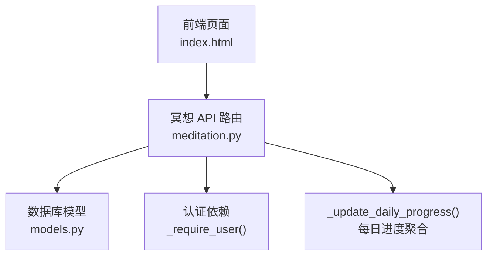
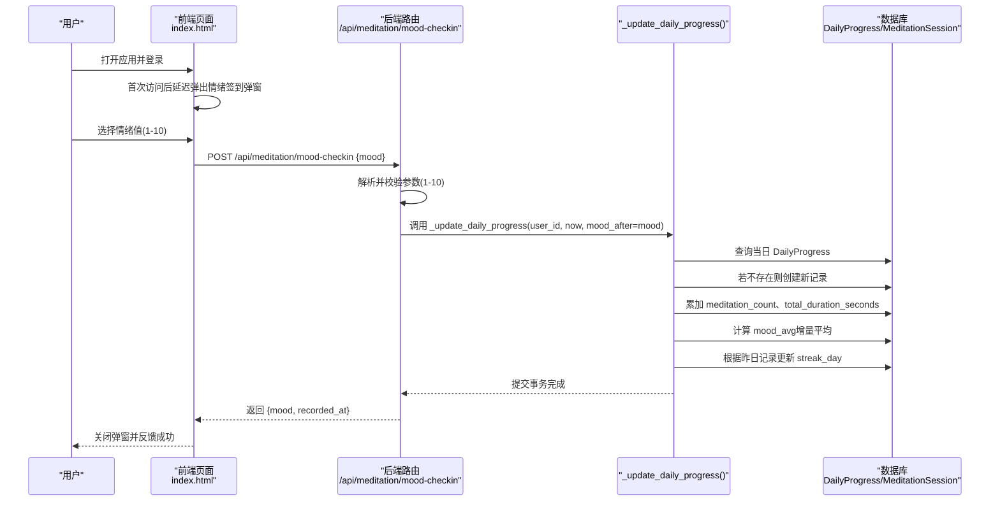
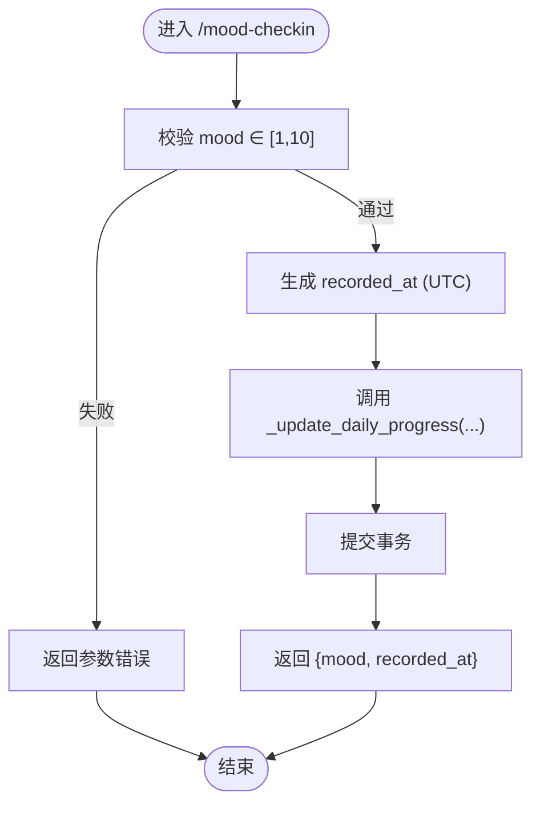
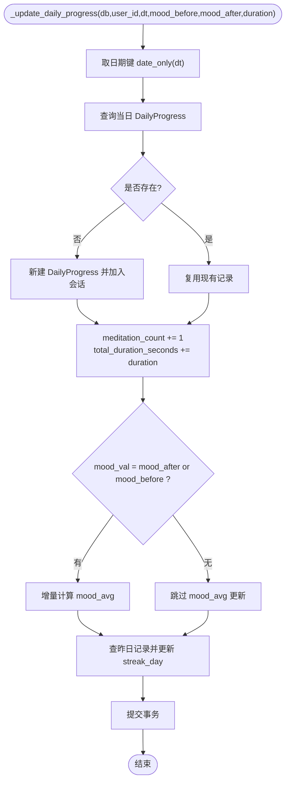
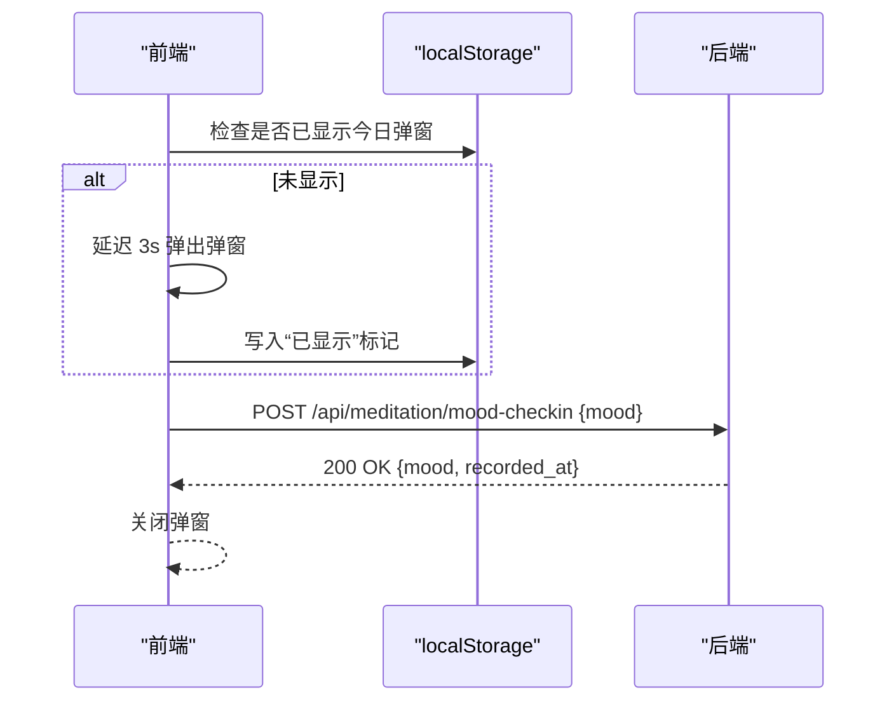
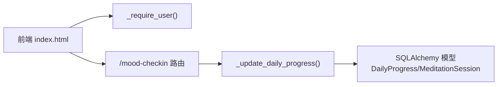

# 情绪签到系统

<cite>
**本文引用的文件**   
- [hushai/meditation/api/meditation.py](file://hushai/meditation/api/meditation.py)
- [hushai/meditation/db/models.py](file://hushai/meditation/db/models.py)
- [hushai/meditation/static/index.html](file://hushai/meditation/static/index.html)
- [README.md](file://README.md)
</cite>

## 目录
1. [简介](#简介)
2. [项目结构](#项目结构)
3. [核心组件](#核心组件)
4. [架构总览](#架构总览)
5. [详细组件分析](#详细组件分析)
6. [依赖关系分析](#依赖关系分析)
7. [性能与扩展性](#性能与扩展性)
8. [故障排查指南](#故障排查指南)
9. [结论](#结论)
10. [附录：API 规范与前端集成](#附录api-规范与前端集成)

## 简介
本文件面向“情绪签到”功能，系统性阐述其业务逻辑、数据模型、API 接口、与每日进度更新的集成机制，以及前后端协作方式。重点包括：
- 情绪值范围验证（1-10 分制）
- 时间戳记录与数据处理流程
- 通过 _update_daily_progress 实现的情绪聚合统计
- mood_before 与 mood_after 的存储策略与使用场景
- 情绪签到 API 完整规范（MoodCheckInRequest/MoodCheckInResponse）
- 时间序列分析、趋势统计与可视化展示的前端集成建议

## 项目结构
情绪签到相关代码主要分布在以下位置：
- API 路由与请求/响应模型定义：hushai/meditation/api/meditation.py
- 数据库模型（会话与每日进度）：hushai/meditation/db/models.py
- 前端交互与自动弹窗提示：hushai/meditation/static/index.html
- 文档索引与端点清单：README.md



图表来源
- [hushai/meditation/api/meditation.py:177-186](file://hushai/meditation/api/meditation.py#L177-L186)
- [hushai/meditation/db/models.py:204-244](file://hushai/meditation/db/models.py#L204-L244)
- [hushai/meditation/static/index.html:1928-1936](file://hushai/meditation/static/index.html#L1928-L1936)

章节来源
- [hushai/meditation/api/meditation.py:1-368](file://hushai/meditation/api/meditation.py#L1-L368)
- [hushai/meditation/db/models.py:1-434](file://hushai/meditation/db/models.py#L1-L434)
- [hushai/meditation/static/index.html:1893-2111](file://hushai/meditation/static/index.html#L1893-L2111)
- [README.md:200-211](file://README.md#L200-L211)

## 核心组件
- 情绪签到 API：POST /api/meditation/mood-checkin
- 每日进度聚合函数：_update_daily_progress
- 数据模型：MeditationSession、DailyProgress
- 前端弹窗与自动触发：mood modal + localStorage 标记

要点说明
- 情绪值校验：Pydantic Field(ge=1, le=10)，确保输入为 1-10 整数
- 时间戳：服务端统一使用 UTC 时间；记录 recorded_at 与 session 开始/结束时间
- 聚合统计：按用户+日期维度更新 meditation_count、total_duration_seconds、mood_avg、streak_day
- 状态区分：mood_before 用于会话开始前记录；mood_after 用于会话结束后或独立签到时记录

章节来源
- [hushai/meditation/api/meditation.py:68-75](file://hushai/meditation/api/meditation.py#L68-L75)
- [hushai/meditation/api/meditation.py:177-186](file://hushai/meditation/api/meditation.py#L177-L186)
- [hushai/meditation/api/meditation.py:189-238](file://hushai/meditation/api/meditation.py#L189-L238)
- [hushai/meditation/db/models.py:204-244](file://hushai/meditation/db/models.py#L204-L244)

## 架构总览
情绪签到的端到端流程如下：



图表来源
- [hushai/meditation/static/index.html:1893-1936](file://hushai/meditation/static/index.html#L1893-L1936)
- [hushai/meditation/api/meditation.py:177-186](file://hushai/meditation/api/meditation.py#L177-L186)
- [hushai/meditation/api/meditation.py:189-238](file://hushai/meditation/api/meditation.py#L189-L238)
- [hushai/meditation/db/models.py:224-244](file://hushai/meditation/db/models.py#L224-L244)

## 详细组件分析

### 情绪签到 API 与数据流
- 路由：POST /api/meditation/mood-checkin
- 鉴权：通过 Authorization Bearer Token 获取 user_id
- 入参：MoodCheckInRequest.mood（1-10 整数）
- 出参：MoodCheckInResponse.mood、recorded_at（UTC）
- 副作用：调用 _update_daily_progress 更新当日统计



图表来源
- [hushai/meditation/api/meditation.py:68-75](file://hushai/meditation/api/meditation.py#L68-L75)
- [hushai/meditation/api/meditation.py:177-186](file://hushai/meditation/api/meditation.py#L177-L186)

章节来源
- [hushai/meditation/api/meditation.py:177-186](file://hushai/meditation/api/meditation.py#L177-L186)

### 每日进度聚合函数 _update_daily_progress
职责
- 定位用户当日记录（按 date 去重）
- 若无记录则新建 DailyProgress
- 累加 meditation_count、total_duration_seconds
- 计算 mood_avg（增量平均）
- 基于昨日记录更新 streak_day（连续打卡天数）



图表来源
- [hushai/meditation/api/meditation.py:189-238](file://hushai/meditation/api/meditation.py#L189-L238)

章节来源
- [hushai/meditation/api/meditation.py:189-238](file://hushai/meditation/api/meditation.py#L189-L238)

### 数据模型与字段语义
- MeditationSession：记录单次冥想会话，包含 mood_before（会话前）、mood_after（会话后）、duration_seconds、started_at、ended_at 等
- DailyProgress：按用户+日期聚合，包含 meditation_count、total_duration_seconds、mood_avg、streak_day

```mermaid
classDiagram
class User {
+id
+created_at
+updated_at
}
class MeditationSession {
+id
+user_id
+conversation_id
+scene_id
+started_at
+ended_at
+duration_seconds
+mood_before
+mood_after
+note
+created_at
}
class DailyProgress {
+id
+user_id
+date
+meditation_count
+total_duration_seconds
+mood_avg
+streak_day
+created_at
+updated_at
}
User ||--o{ MeditationSession : "拥有"
User ||--o{ DailyProgress : "拥有"
```

图表来源
- [hushai/meditation/db/models.py:204-244](file://hushai/meditation/db/models.py#L204-L244)

章节来源
- [hushai/meditation/db/models.py:204-244](file://hushai/meditation/db/models.py#L204-L244)

### 情绪值存储策略：mood_before 与 mood_after
- mood_before：在会话开始时记录，反映进入冥想前的情绪基线
- mood_after：在会话结束时记录，或在独立情绪签到时记录，反映当前情绪
- 聚合规则：当 mood_after 存在时使用 mood_after，否则回退到 mood_before；据此计算当日 mood_avg

使用场景
- 会话模式：start 传入 mood_before，end 传入 mood_after，便于对比变化
- 独立签到：仅调用 /mood-checkin，传入 mood，作为 mood_after 参与聚合

章节来源
- [hushai/meditation/api/meditation.py:44-48](file://hushai/meditation/api/meditation.py#L44-L48)
- [hushai/meditation/api/meditation.py:55-66](file://hushai/meditation/api/meditation.py#L55-L66)
- [hushai/meditation/api/meditation.py:189-226](file://hushai/meditation/api/meditation.py#L189-L226)

### 前端集成与交互
- 弹窗：登录后首次访问自动弹出情绪签到弹窗（localStorage 控制一天一次）
- 交互：滑块选择 1-10，确认后将 {mood} 发送至 /api/meditation/mood-checkin
- 鉴权：携带 Authorization: Bearer <token>
- 错误处理：401 时清理本地认证并跳转登录



图表来源
- [hushai/meditation/static/index.html:1893-1936](file://hushai/meditation/static/index.html#L1893-L1936)
- [hushai/meditation/static/index.html:2096-2107](file://hushai/meditation/static/index.html#L2096-L2107)

章节来源
- [hushai/meditation/static/index.html:1893-1936](file://hushai/meditation/static/index.html#L1893-L1936)
- [hushai/meditation/static/index.html:2096-2107](file://hushai/meditation/static/index.html#L2096-L2107)

## 依赖关系分析
- API 层依赖认证依赖 _require_user 与数据库会话 get_session
- 业务函数 _update_daily_progress 依赖 SQLAlchemy 查询与事务提交
- 前端依赖浏览器 localStorage 与 fetch API



图表来源
- [hushai/meditation/api/meditation.py:25-34](file://hushai/meditation/api/meditation.py#L25-L34)
- [hushai/meditation/api/meditation.py:177-186](file://hushai/meditation/api/meditation.py#L177-L186)
- [hushai/meditation/api/meditation.py:189-238](file://hushai/meditation/api/meditation.py#L189-L238)
- [hushai/meditation/db/models.py:204-244](file://hushai/meditation/db/models.py#L204-L244)

章节来源
- [hushai/meditation/api/meditation.py:25-34](file://hushai/meditation/api/meditation.py#L25-L34)
- [hushai/meditation/api/meditation.py:177-186](file://hushai/meditation/api/meditation.py#L177-L186)
- [hushai/meditation/api/meditation.py:189-238](file://hushai/meditation/api/meditation.py#L189-L238)
- [hushai/meditation/db/models.py:204-244](file://hushai/meditation/db/models.py#L204-L244)

## 性能与扩展性
- 时间复杂度：_update_daily_progress 每次执行固定次数的单表查询与更新，O(1)
- 空间复杂度：内存中不保留长期状态，仅维护活跃会话字典（与签到无关）
- 可扩展点：
  - 增加情绪标签或维度（如情绪类别、强度等级）
  - 引入滑动窗口均值或指数平滑以改善趋势稳定性
  - 对 DailyProgress 增加更多指标（如专注度、睡眠时长等）

[本节为通用指导，无需具体文件引用]

## 故障排查指南
- 参数校验失败：mood 不在 1-10 范围内会触发 Pydantic 校验错误
- 认证失败：缺少或无效 Authorization 头将返回 401
- 并发写入：同一用户同一天多次签到会正确累加计数与更新平均值
- 时间一致性：所有时间均为 UTC，注意前端展示时的时区转换

章节来源
- [hushai/meditation/api/meditation.py:68-75](file://hushai/meditation/api/meditation.py#L68-L75)
- [hushai/meditation/api/meditation.py:25-34](file://hushai/meditation/api/meditation.py#L25-L34)
- [hushai/meditation/api/meditation.py:189-238](file://hushai/meditation/api/meditation.py#L189-L238)

## 结论
情绪签到系统以简洁清晰的 API 与稳健的每日聚合逻辑为核心，结合前端弹窗与自动提示，形成完整的用户体验闭环。通过 mood_before/mood_after 的差异化存储与 _update_daily_progress 的增量统计，系统能够稳定输出日级情绪趋势与连续打卡统计，为后续分析与可视化提供可靠的数据基础。

[本节为总结，无需具体文件引用]

## 附录：API 规范与前端集成

### API 端点清单（冥想模块）
- POST /api/meditation/session/start
- POST /api/meditation/session/end
- POST /api/meditation/mood-checkin
- GET /api/meditation/stats
- GET /api/meditation/weekly

章节来源
- [README.md:200-211](file://README.md#L200-L211)

### 情绪签到接口规范
- 路径与方法：POST /api/meditation/mood-checkin
- 鉴权：Authorization: Bearer <token>
- 请求体：MoodCheckInRequest
  - mood: int，必填，取值范围 1-10
- 响应体：MoodCheckInResponse
  - mood: int
  - recorded_at: datetime（UTC）

章节来源
- [hushai/meditation/api/meditation.py:68-75](file://hushai/meditation/api/meditation.py#L68-L75)
- [hushai/meditation/api/meditation.py:177-186](file://hushai/meditation/api/meditation.py#L177-L186)

### 数据结构定义
- MoodCheckInRequest
  - mood: int（1-10）
- MoodCheckInResponse
  - mood: int
  - recorded_at: datetime（UTC）

章节来源
- [hushai/meditation/api/meditation.py:68-75](file://hushai/meditation/api/meditation.py#L68-L75)

### 前端集成指南
- 弹窗触发：登录后首次访问延迟 3 秒弹出，localStorage 控制一天一次
- 交互流程：滑块选择 1-10，点击确认后发送 POST 请求
- 错误处理：401 时清理本地认证并跳转登录
- 数据展示：可结合 /api/meditation/weekly 与 /api/meditation/stats 进行周视图与统计面板渲染

章节来源
- [hushai/meditation/static/index.html:1893-1936](file://hushai/meditation/static/index.html#L1893-L1936)
- [hushai/meditation/static/index.html:2096-2107](file://hushai/meditation/static/index.html#L2096-L2107)

### 时间序列分析与可视化建议
- 数据来源：
  - 周视图：GET /api/meditation/weekly（含 sessions、duration_seconds、mood、streak）
  - 统计概览：GET /api/meditation/stats（含 total_sessions、avg_mood、recent_sessions 等）
- 可视化建议：
  - 折线图：展示近 7 天 mood 均值趋势
  - 柱状图：展示每日 sessions 与 duration_seconds
  - 热力图：展示月度打卡密度（基于 streak_day）
- 趋势统计：
  - 移动平均：对 mood 做 3/7 日滑动平均，平滑短期波动
  - 环比/同比：比较相邻周或同周去年情绪均值变化
  - 异常检测：当 mood 显著低于阈值时触发提醒或引导内容

[本节为概念性指导，无需具体文件引用]