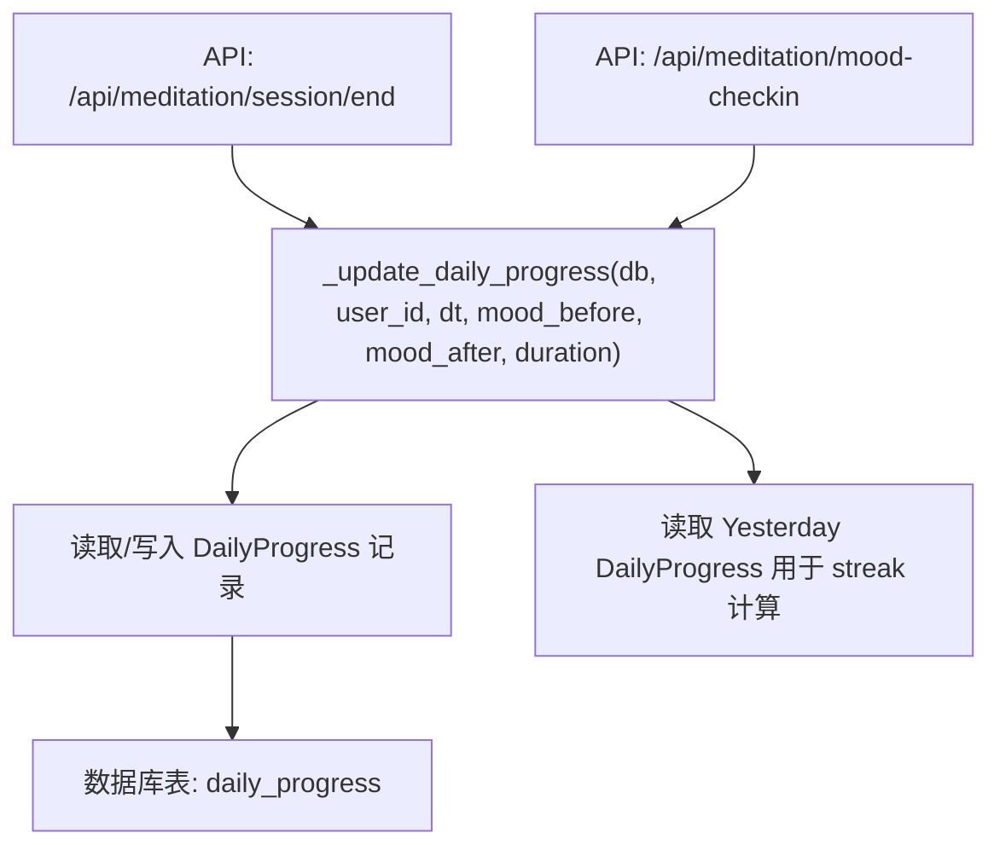
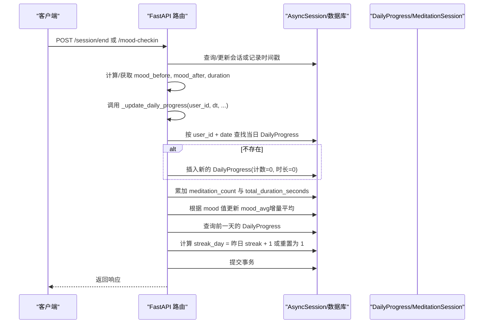
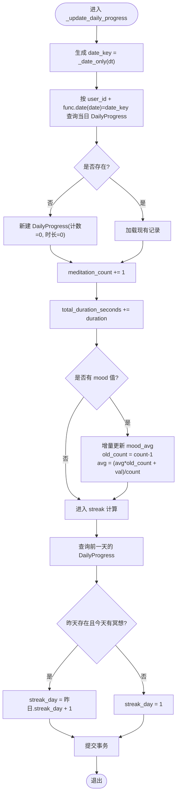
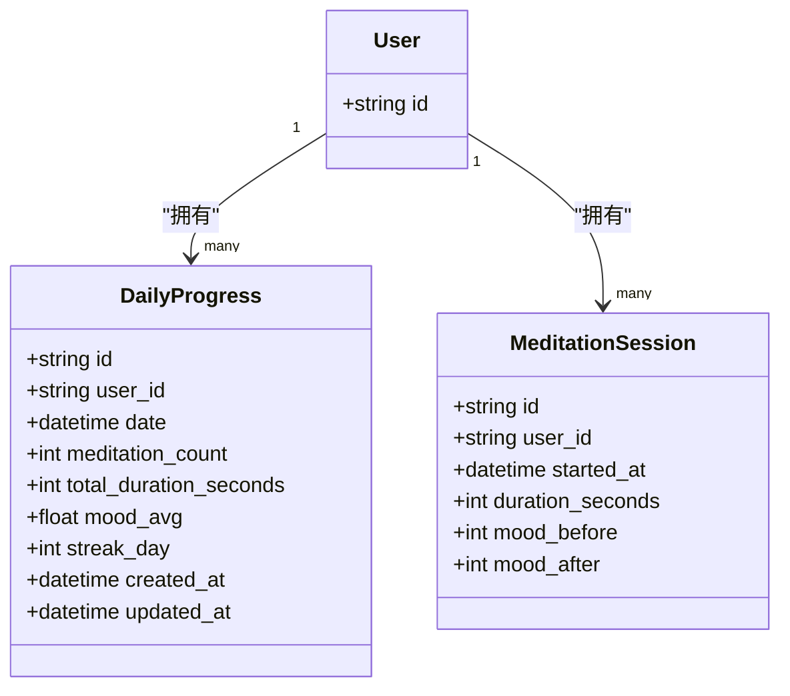
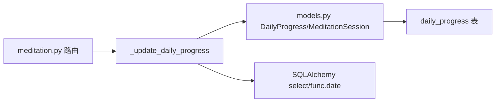

# 每日进度更新机制

<cite>
**本文引用的文件**
- [hushai/meditation/api/meditation.py](file://hushai/meditation/api/meditation.py)
- [hushai/meditation/db/models.py](file://hushai/meditation/db/models.py)
</cite>

## 目录
1. [简介](#简介)
2. [项目结构](#项目结构)
3. [核心组件](#核心组件)
4. [架构总览](#架构总览)
5. [详细组件分析](#详细组件分析)
6. [依赖关系分析](#依赖关系分析)
7. [性能考量](#性能考量)
8. [故障排查指南](#故障排查指南)
9. [结论](#结论)

## 简介
本技术文档聚焦于“每日进度更新机制”，围绕 _update_daily_progress 函数的核心算法展开，系统阐述 DailyProgress 记录的创建、更新与事务处理逻辑；解释每日统计数据的多字段增量计算策略（冥想次数 meditation_count、总时长 total_duration_seconds、情绪平均值 mood_avg）；说明连续天数 streak_day 的维护算法（前一天数据查询、连续性判断与计数更新）；解析日期键 date_key 的处理逻辑与时间标准化策略；并给出数据一致性保证机制（并发更新与事务回滚）、性能优化建议与批量更新最佳实践。

## 项目结构
与每日进度更新相关的代码主要分布在两个位置：
- API 层：定义会话结束与情绪打卡接口，并在其中调用 _update_daily_progress 完成统计聚合。
- 数据模型层：定义 DailyProgress 与 MeditationSession 等 ORM 模型及索引。

图表来源
- [hushai/meditation/api/meditation.py:136-174](file://hushai/meditation/api/meditation.py#L136-L174)
- [hushai/meditation/api/meditation.py:177-186](file://hushai/meditation/api/meditation.py#L177-L186)
- [hushai/meditation/api/meditation.py:189-238](file://hushai/meditation/api/meditation.py#L189-L238)
- [hushai/meditation/db/models.py:224-243](file://hushai/meditation/db/models.py#L224-L243)

章节来源
- [hushai/meditation/api/meditation.py:1-368](file://hushai/meditation/api/meditation.py#L1-L368)
- [hushai/meditation/db/models.py:204-243](file://hushai/meditation/db/models.py#L204-L243)

## 核心组件
- _update_daily_progress：核心聚合函数，负责按用户+日维度聚合冥想次数、总时长、情绪均值，并维护连续天数。
- DailyProgress：每日进度统计表，包含 meditation_count、total_duration_seconds、mood_avg、streak_day 等字段。
- MeditationSession：原始会话明细表，作为统计源之一。
- 辅助工具：_utcnow、_date_only 提供 UTC 时间与日期归一化。

章节来源
- [hushai/meditation/api/meditation.py:35-41](file://hushai/meditation/api/meditation.py#L35-L41)
- [hushai/meditation/api/meditation.py:189-238](file://hushai/meditation/api/meditation.py#L189-L238)
- [hushai/meditation/db/models.py:204-243](file://hushai/meditation/db/models.py#L204-L243)

## 架构总览
下图展示了从会话结束或情绪打卡到每日统计更新的端到端流程。

图表来源
- [hushai/meditation/api/meditation.py:136-174](file://hushai/meditation/api/meditation.py#L136-L174)
- [hushai/meditation/api/meditation.py:177-186](file://hushai/meditation/api/meditation.py#L177-L186)
- [hushai/meditation/api/meditation.py:189-238](file://hushai/meditation/api/meditation.py#L189-L238)
- [hushai/meditation/db/models.py:204-243](file://hushai/meditation/db/models.py#L204-L243)

## 详细组件分析

### _update_daily_progress 核心算法
该函数是每日进度更新的核心，执行以下关键步骤：
- 日期键生成与时间标准化：使用 _date_only 将传入时间归一化为当天零点，确保同一自然日内的多次操作命中同一条记录。
- 当日记录存在性检查与创建：按 user_id 与 func.date(date) 查询当日 DailyProgress；若不存在则新建并加入会话。
- 多字段增量更新：
  - meditation_count：每次事件自增 1。
  - total_duration_seconds：累加本次 duration（会话结束时传入）。
  - mood_avg：采用增量平均公式，当有 mood 值时更新；首次或无历史均值时直接赋值。
- 连续天数 streak_day 维护：查询前一天的 DailyProgress，若存在且当日 meditation_count > 0，则 streak_day = 昨日 streak_day + 1；否则重置为 1。
- 事务提交：在函数末尾统一 commit，保证上述所有变更原子性。

图表来源
- [hushai/meditation/api/meditation.py:189-238](file://hushai/meditation/api/meditation.py#L189-L238)

章节来源
- [hushai/meditation/api/meditation.py:189-238](file://hushai/meditation/api/meditation.py#L189-L238)

### DailyProgress 数据模型与索引
- 关键字段：
  - user_id：用户标识，外键关联 users。
  - date：日期时间（带时区），用于按天聚合。
  - meditation_count：当日冥想次数。
  - total_duration_seconds：当日累计时长（秒）。
  - mood_avg：当日情绪平均值（浮点，可为空）。
  - streak_day：连续坚持天数。
- 索引：
  - ix_daily_progress_user_date：复合索引 (user_id, date)，加速按用户+日期的查询。

图表来源
- [hushai/meditation/db/models.py:224-243](file://hushai/meditation/db/models.py#L224-L243)
- [hushai/meditation/db/models.py:204-222](file://hushai/meditation/db/models.py#L204-L222)

章节来源
- [hushai/meditation/db/models.py:224-243](file://hushai/meditation/db/models.py#L224-L243)
- [hushai/meditation/db/models.py:204-222](file://hushai/meditation/db/models.py#L204-L222)

### 日期键处理与时间标准化
- _utcnow：返回当前 UTC 时间，避免本地时区差异导致跨日边界错误。
- _date_only：将 datetime 的时间部分清零，得到当天零点时刻，作为 date_key。
- 查询条件使用 func.date(DailyProgress.date) == date_key.date()，确保无论存储时间的时分秒如何，都能正确匹配到对应自然日。

章节来源
- [hushai/meditation/api/meditation.py:35-41](file://hushai/meditation/api/meditation.py#L35-L41)
- [hushai/meditation/api/meditation.py:197-204](file://hushai/meditation/api/meditation.py#L197-L204)

### 多字段增量更新策略
- meditation_count：每次调用自增 1，适用于会话结束与情绪打卡两种场景。
- total_duration_seconds：仅在会话结束时累加 duration；情绪打卡不改变时长。
- mood_avg：
  - 优先使用 mood_after；若无则回退到 mood_before。
  - 采用增量平均：avg_new = (avg_old * old_count + new_val) / new_count。
  - 若为当日第一条情绪记录或旧均值为空，则直接赋值为新值。

章节来源
- [hushai/meditation/api/meditation.py:217-226](file://hushai/meditation/api/meditation.py#L217-L226)

### 连续天数（streak_day）维护算法
- 查询前一天的 DailyProgress（yesterday = date_key - timedelta(days=1)）。
- 若昨天存在且昨天的 meditation_count > 0，则 streak_day = 昨日.streak_day + 1。
- 否则重置为 1（包括第一天或断档后重新开始的场景）。

章节来源
- [hushai/meditation/api/meditation.py:228-236](file://hushai/meditation/api/meditation.py#L228-L236)

### 事务处理与一致性
- 函数内部对当日与昨日的读写均在同一个 AsyncSession 中完成，并在末尾统一 commit。
- 优点：简化了调用方事务管理，保证当日聚合与 streak 计算的原子性。
- 风险：
  - 未显式捕获异常并进行回滚，若中间发生异常可能导致部分状态不一致。
  - 高并发下对同一天同一用户的写操作可能产生竞态条件（读-改-写模式）。

章节来源
- [hushai/meditation/api/meditation.py:238](file://hushai/meditation/api/meditation.py#L238)

## 依赖关系分析
- API 层依赖：
  - FastAPI 路由：/session/end 与 /mood-checkin 触发 _update_daily_progress。
  - SQLAlchemy：select、func.date 进行条件查询与日期比较。
  - 模型：DailyProgress、MeditationSession。
- 数据层依赖：
  - Index("ix_daily_progress_user_date", "user_id", "date") 提升按用户+日期的查询效率。

图表来源
- [hushai/meditation/api/meditation.py:136-186](file://hushai/meditation/api/meditation.py#L136-L186)
- [hushai/meditation/db/models.py:224-243](file://hushai/meditation/db/models.py#L224-L243)

章节来源
- [hushai/meditation/api/meditation.py:136-186](file://hushai/meditation/api/meditation.py#L136-L186)
- [hushai/meditation/db/models.py:224-243](file://hushai/meditation/db/models.py#L224-L243)

## 性能考量
- 索引利用：
  - 已建立 (user_id, date) 复合索引，可显著降低按用户+日期的查询成本。
- 查询复杂度：
  - 每次更新涉及两次单行查询（当日与昨日），整体 O(1)。
- 潜在瓶颈：
  - 高并发下对同一天同一用户的频繁更新会产生锁竞争。
  - 大量历史数据的 streak 计算（如 stats 接口）会扫描最近一年记录，但这是只读路径。

优化建议
- 使用行级锁或唯一约束防止重复插入：
  - 在 DailyProgress 上增加 (user_id, date) 的唯一约束，结合 INSERT ... ON CONFLICT DO UPDATE 实现幂等更新。
- 减少二次查询：
  - 将 yesterday 查询合并到一次窗口函数或子查询中，或在应用层缓存昨日 streak。
- 批量化更新：
  - 对于批量导入或补录场景，建议按用户+日分组，一次性计算并批量更新，避免逐条提交。
- 异步与连接池：
  - 确保 AsyncSession 来自连接池，合理设置 pool_size/max_overflow，避免连接耗尽。

[本节为通用性能指导，不直接分析具体文件]

## 故障排查指南
- 现象：同一用户同一天多次更新后，streak_day 未按预期递增。
  - 排查要点：
    - 确认前一天的 meditation_count 是否大于 0。
    - 检查 date_key 是否正确归一化（_date_only 是否被调用）。
    - 查看数据库 daily_progress 表中相邻两天的记录是否存在且 meditation_count > 0。
- 现象：mood_avg 出现异常波动或 NaN。
  - 排查要点：
    - 确认 mood 值是否在有效范围（1-10）。
    - 检查增量平均公式中的 old_count 与当前 count 是否一致。
- 现象：并发更新导致数据不一致。
  - 排查要点：
    - 观察是否存在重复插入或覆盖问题。
    - 考虑引入唯一约束与冲突更新策略。
- 现象：事务未提交或部分失败。
  - 排查要点：
    - 检查函数末尾是否成功 commit。
    - 建议在外部包裹 try/except 并在异常时 rollback。

章节来源
- [hushai/meditation/api/meditation.py:189-238](file://hushai/meditation/api/meditation.py#L189-L238)
- [hushai/meditation/db/models.py:224-243](file://hushai/meditation/db/models.py#L224-L243)

## 结论
_update_daily_progress 以简洁高效的增量方式维护每日进度统计，涵盖次数、时长与情绪均值，并通过前一天的记录维护连续天数。其设计具备良好的可读性与扩展性，但在高并发与异常处理方面仍有改进空间。通过引入唯一约束与冲突更新、增强事务异常处理、以及批量化更新策略，可以进一步提升系统的健壮性与性能。