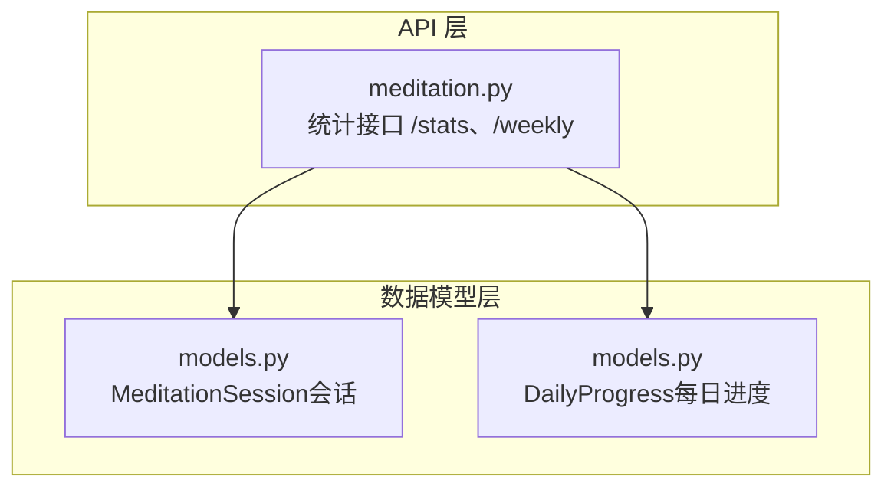
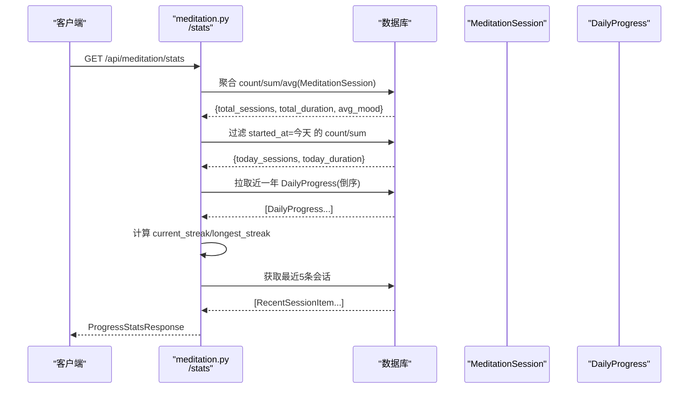
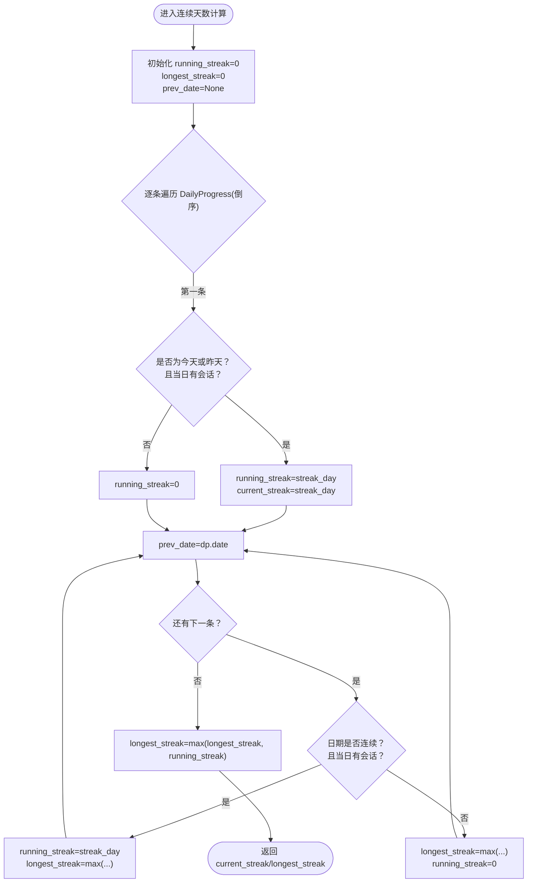
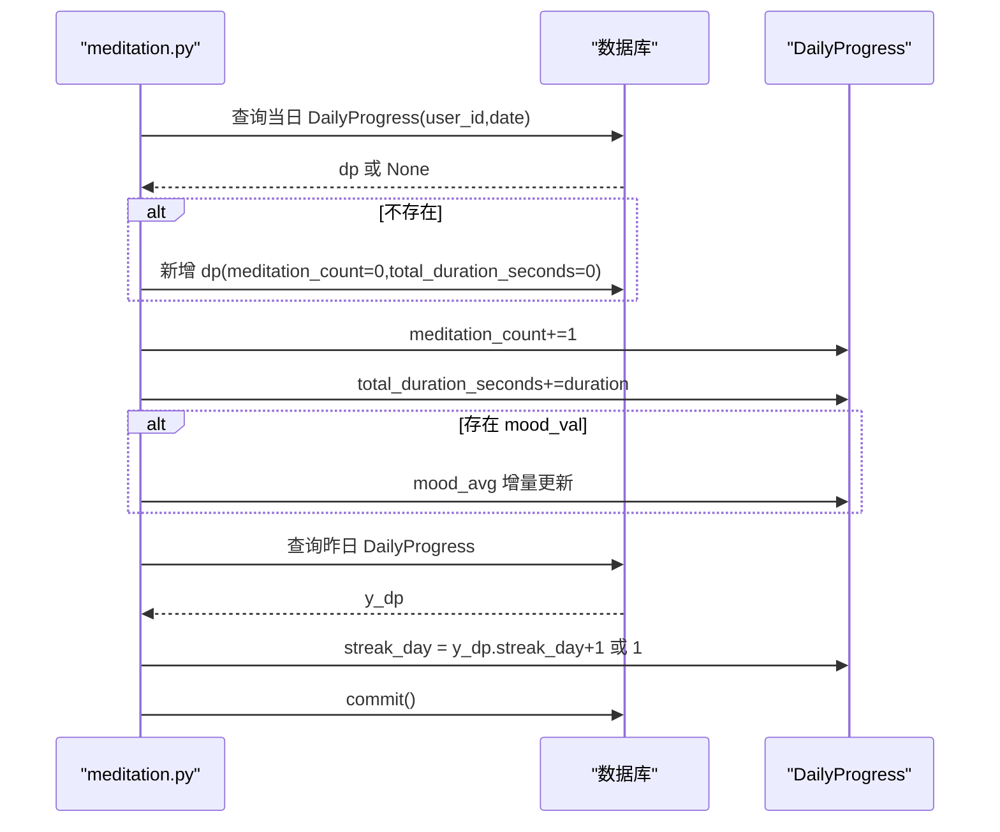
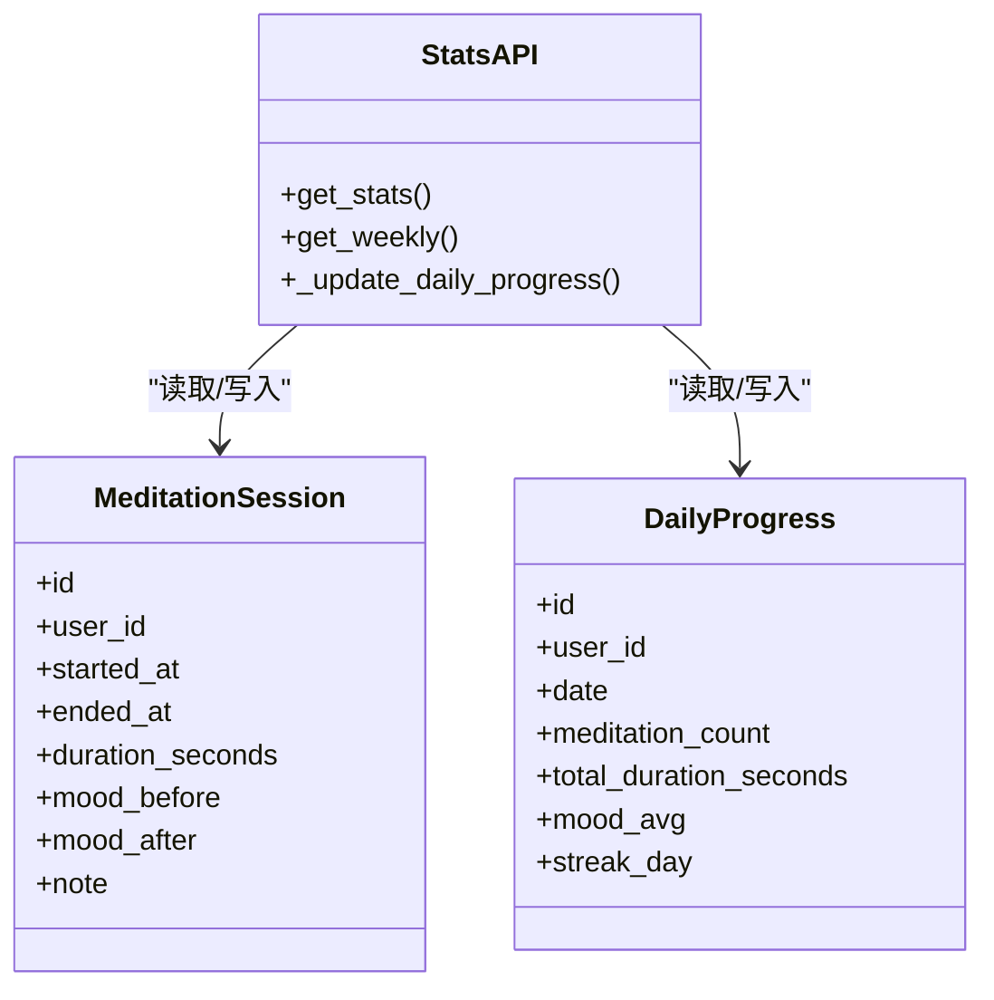

# 进度统计分析

<cite>
**本文引用的文件**   
- [hushai/meditation/api/meditation.py](file://hushai/meditation/api/meditation.py)
- [hushai/meditation/db/models.py](file://hushai/meditation/db/models.py)
</cite>

## 目录
1. [简介](#简介)
2. [项目结构](#项目结构)
3. [核心组件](#核心组件)
4. [架构总览](#架构总览)
5. [详细组件分析](#详细组件分析)
6. [依赖关系分析](#依赖关系分析)
7. [性能考虑](#性能考虑)
8. [故障排查指南](#故障排查指南)
9. [结论](#结论)
10. [附录](#附录)

## 简介
本技术文档聚焦于“进度统计分析”子系统，围绕冥想会话与每日进度统计的核心指标展开，包括总会话数、总时长、当前连续天数、最长连续天数、今日会话与时长、平均情绪值等。文档深入解释各项指标的计算算法、连续天数的判定规则与重置机制、平均情绪值的增量更新与精度控制策略，并给出 ProgressStatsResponse 的数据结构说明与查询优化建议。

## 项目结构
该功能位于冥想模块的 API 层与数据模型层：
- API 层负责对外暴露统计接口、计算并组装返回结果
- 数据模型层定义会话记录与每日进度聚合表，提供必要的索引以支撑高效查询

图表来源
- [hushai/meditation/api/meditation.py:241-333](file://hushai/meditation/api/meditation.py#L241-L333)
- [hushai/meditation/db/models.py:204-243](file://hushai/meditation/db/models.py#L204-L243)

章节来源
- [hushai/meditation/api/meditation.py:1-368](file://hushai/meditation/api/meditation.py#L1-L368)
- [hushai/meditation/db/models.py:1-434](file://hushai/meditation/db/models.py#L1-L434)

## 核心组件
- 会话记录模型 MeditationSession：记录每次冥想的开始时间、结束时间、时长、前后情绪评分等
- 每日进度模型 DailyProgress：按用户+日期聚合当日会话次数、总时长、情绪均值、连续天数等
- 统计接口 GET /api/meditation/stats：返回 ProgressStatsResponse，包含累计与会话、连续天数、今日统计、平均情绪与最近会话列表
- 周视图接口 GET /api/meditation/weekly：返回过去七天的每日进度摘要

章节来源
- [hushai/meditation/db/models.py:204-243](file://hushai/meditation/db/models.py#L204-L243)
- [hushai/meditation/api/meditation.py:85-106](file://hushai/meditation/api/meditation.py#L85-L106)
- [hushai/meditation/api/meditation.py:241-367](file://hushai/meditation/api/meditation.py#L241-L367)

## 架构总览
统计流程由两个关键路径组成：
- 写入路径：会话结束或情绪打卡时，调用 _update_daily_progress 更新 DailyProgress 的计数、时长、情绪均值与 streak_day
- 读取路径：GET /stats 汇总 MeditationSession 与 DailyProgress，计算 total_sessions、total_duration_seconds、current_streak、longest_streak、today_*、avg_mood 与 recent_sessions

图表来源
- [hushai/meditation/api/meditation.py:241-333](file://hushai/meditation/api/meditation.py#L241-L333)
- [hushai/meditation/db/models.py:204-243](file://hushai/meditation/db/models.py#L204-L243)

## 详细组件分析

### 数据结构：ProgressStatsResponse
- total_sessions：用户历史总会话数
- total_duration_seconds：用户历史总时长（秒）
- current_streak：当前连续天数
- longest_streak：历史最长连续天数
- today_sessions：今日会话数
- today_duration_seconds：今日总时长（秒）
- avg_mood：历史平均情绪值（基于 mood_after；若无有效值则为空）
- recent_sessions：最近若干条会话摘要

字段类型与约束见响应模型定义。

章节来源
- [hushai/meditation/api/meditation.py:85-93](file://hushai/meditation/api/meditation.py#L85-L93)

### 指标计算算法

#### 总会话数（total_sessions）
- 通过聚合函数对 MeditationSession 表按 user_id 进行计数得到

章节来源
- [hushai/meditation/api/meditation.py:248-256](file://hushai/meditation/api/meditation.py#L248-L256)

#### 总时长（total_duration_seconds）
- 通过聚合函数对 MeditationSession.duration_seconds 求和，使用 coalesce 处理空值

章节来源
- [hushai/meditation/api/meditation.py:248-258](file://hushai/meditation/api/meditation.py#L248-L258)

#### 今日统计（today_sessions、today_duration_seconds）
- 基于 MeditationSession.started_at 的日期部分等于当天进行过滤，再执行 count 与 sum

章节来源
- [hushai/meditation/api/meditation.py:260-271](file://hushai/meditation/api/meditation.py#L260-L271)

#### 平均情绪值（avg_mood）
- 全局平均：直接对 MeditationSession.mood_after 使用 avg 聚合，若结果为 0 或空则返回 None
- 日级增量更新：在 _update_daily_progress 中维护 DailyProgress.mood_avg，采用增量公式避免全量重算
  - 当 mood_val 存在且已有旧均值时：mood_avg = (mood_avg * old_count + mood_val) / meditation_count
  - 否则初始化 mood_avg = float(mood_val)
- 数值精度控制：使用浮点运算，未显式做四舍五入；如需展示可结合前端格式化

章节来源
- [hushai/meditation/api/meditation.py:248-258](file://hushai/meditation/api/meditation.py#L248-L258)
- [hushai/meditation/api/meditation.py:220-226](file://hushai/meditation/api/meditation.py#L220-L226)

#### 连续天数（current_streak、longest_streak）
- 数据来源：DailyProgress.streak_day 与 meditation_count
- 读取逻辑（/stats）：
  - 拉取近一年 DailyProgress 并按 date 倒序遍历
  - 首条记录若为今天或昨天且当日有会话，则 running_streak=current_streak=streak_day
  - 后续记录若与前一条日期连续且当日有会话，则 running_streak=streak_day，并更新 longest_streak
  - 若不连续或当日无会话，则 longest_streak=max(longest_streak, running_streak)，running_streak=0
  - 最终 longest_streak=max(longest_streak, running_streak)
- 写入逻辑（_update_daily_progress）：
  - 根据 yesterday 是否存在且当日有会话，决定 streak_day = y_dp.streak_day + 1 或 1
  - 即：中断后重置为 1，连续则累加

图表来源
- [hushai/meditation/api/meditation.py:273-305](file://hushai/meditation/api/meditation.py#L273-L305)
- [hushai/meditation/api/meditation.py:228-236](file://hushai/meditation/api/meditation.py#L228-L236)

章节来源
- [hushai/meditation/api/meditation.py:273-305](file://hushai/meditation/api/meditation.py#L273-L305)
- [hushai/meditation/api/meditation.py:228-236](file://hushai/meditation/api/meditation.py#L228-L236)

### 写入路径：_update_daily_progress
- 输入：user_id、dt（事件时间）、可选 mood_before/mood_after、duration
- 步骤：
  - 将 dt 归一化为当日零点作为 date_key
  - 查找或创建对应 DailyProgress 记录
  - 递增 meditation_count 与 total_duration_seconds
  - 若有 mood_val（优先 mood_after），按增量公式更新 mood_avg
  - 查询昨日记录，若存在且当日有会话，则 streak_day=昨日 streak_day+1，否则重置为 1
  - 提交事务

图表来源
- [hushai/meditation/api/meditation.py:189-238](file://hushai/meditation/api/meditation.py#L189-L238)

章节来源
- [hushai/meditation/api/meditation.py:189-238](file://hushai/meditation/api/meditation.py#L189-L238)

### 数据模型与索引
- MeditationSession：会话明细，含 started_at、ended_at、duration_seconds、mood_before、mood_after 等
- DailyProgress：每日聚合，含 meditation_count、total_duration_seconds、mood_avg、streak_day
- 索引：
  - DailyProgress.user_id + date 复合索引，用于快速定位某用户某日的进度记录
  - 其他常用索引如 users.id、sessions.user_id 等提升关联与过滤效率

章节来源
- [hushai/meditation/db/models.py:204-243](file://hushai/meditation/db/models.py#L204-L243)

## 依赖关系分析
- API 层依赖 ORM 模型与异步会话
- 统计接口同时读取会话明细与每日进度，前者用于总量与今日统计，后者用于连续天数与日级情绪均值
- 写入路径在会话结束与情绪打卡时触发，保证 DailyProgress 与会话明细的一致性

图表来源
- [hushai/meditation/db/models.py:204-243](file://hushai/meditation/db/models.py#L204-L243)
- [hushai/meditation/api/meditation.py:241-367](file://hushai/meditation/api/meditation.py#L241-L367)

章节来源
- [hushai/meditation/db/models.py:204-243](file://hushai/meditation/db/models.py#L204-L243)
- [hushai/meditation/api/meditation.py:241-367](file://hushai/meditation/api/meditation.py#L241-L367)

## 性能考虑
- 聚合查询优化
  - 使用 SQL 聚合函数在数据库侧完成 count/sum/avg，减少应用层计算开销
  - 针对 daily_progress 的 user_id+date 复合索引，确保按用户与日期的高效定位
- 连续天数计算
  - 限制拉取范围至近一年（limit 365），降低大数据量下的内存与网络传输压力
  - 在应用层线性扫描 DailyProgress 列表，时间复杂度 O(n)，n≤365，整体可控
- 今日统计
  - 基于 started_at 的日期过滤，配合数据库索引可快速定位当日会话
- 平均情绪值
  - 全局 avg 由数据库计算；日级 mood_avg 采用增量更新，避免全量重算
  - 注意浮点精度问题，必要时可在展示层进行格式化或保留固定小数位
- 并发与一致性
  - 写入路径在同一事务内更新会话与每日进度，保证一致性
  - 高并发场景下，建议关注数据库连接池与事务隔离级别，避免热点行竞争

[本节为通用性能建议，不直接分析具体代码片段]

## 故障排查指南
- 连续天数为 0 或异常
  - 检查 DailyProgress 的 meditation_count 是否为 0（当日无有效会话会被视为中断）
  - 确认 streak_day 的写入逻辑是否正确依据昨日记录
- 平均情绪值为空
  - 若所有会话的 mood_after 为空或为 0，则全局 avg_mood 会返回空
  - 检查情绪打卡与会话结束时是否传入了有效的 mood 值
- 今日统计不准确
  - 确认 started_at 的时间戳与时区设置，确保日期过滤条件匹配预期
- 性能退化
  - 查看 DailyProgress 的 user_id+date 索引是否存在
  - 评估 limit 365 的合理性，必要时增加缓存或预聚合

章节来源
- [hushai/meditation/api/meditation.py:228-236](file://hushai/meditation/api/meditation.py#L228-L236)
- [hushai/meditation/api/meditation.py:248-258](file://hushai/meditation/api/meditation.py#L248-L258)
- [hushai/meditation/api/meditation.py:260-271](file://hushai/meditation/api/meditation.py#L260-L271)
- [hushai/meditation/db/models.py:241-241](file://hushai/meditation/db/models.py#L241-L241)

## 结论
本系统通过“会话明细 + 每日进度聚合”的双层设计，实现了高效的统计与连续天数追踪。核心指标的计算遵循数据库聚合与应用层轻量计算的组合策略，既保证了准确性，也兼顾了性能。连续天数的判定严格依赖日期连续性与会话有效性，平均情绪值采用增量更新以避免重复计算。建议在大规模数据场景下进一步引入缓存与预聚合，以提升实时性与稳定性。

[本节为总结性内容，不直接分析具体代码片段]

## 附录

### ProgressStatsResponse 完整字段说明
- total_sessions：int，总会话数
- total_duration_seconds：int，总时长（秒）
- current_streak：int，当前连续天数
- longest_streak：int，最长连续天数
- today_sessions：int，今日会话数
- today_duration_seconds：int，今日总时长（秒）
- avg_mood：float | None，历史平均情绪值（基于 mood_after）
- recent_sessions：list[RecentSessionItem]，最近会话列表

章节来源
- [hushai/meditation/api/meditation.py:85-93](file://hushai/meditation/api/meditation.py#L85-L93)

### 查询性能优化建议
- 索引
  - 确保 DailyProgress.user_id + date 复合索引存在
  - 对 MeditationSession.user_id 与 started_at 建立合适索引以加速过滤与排序
- 分页与限流
  - 对近期会话列表使用 limit 控制返回数量
  - 对高频统计接口增加缓存层（如 Redis），按用户与时间窗口缓存结果
- 预聚合
  - 对于超大数据量，可考虑定时任务生成小时/日级汇总表，减少实时聚合压力
- 时区与日期边界
  - 统一使用 UTC 时间并在应用层按业务时区转换，避免跨日边界统计偏差

[本节为通用优化建议，不直接分析具体代码片段]