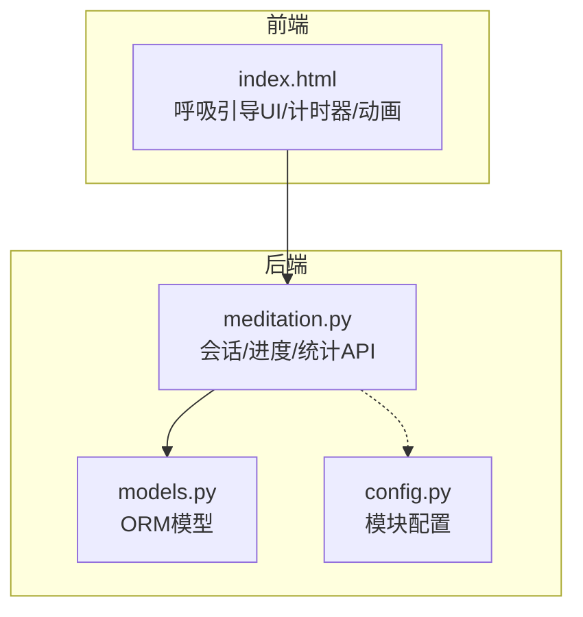
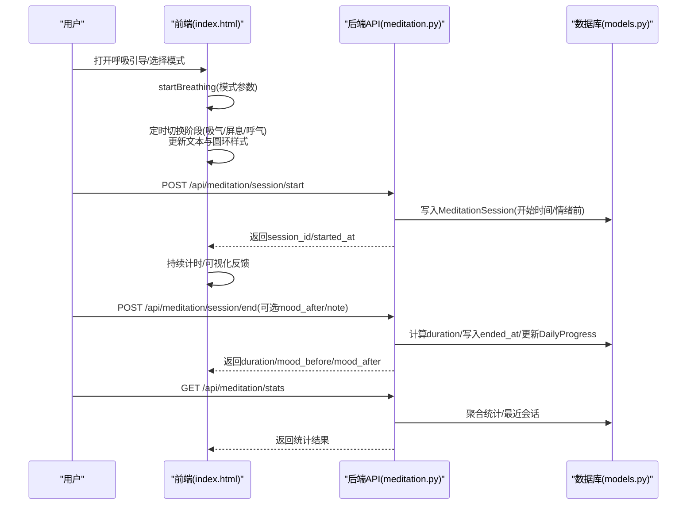
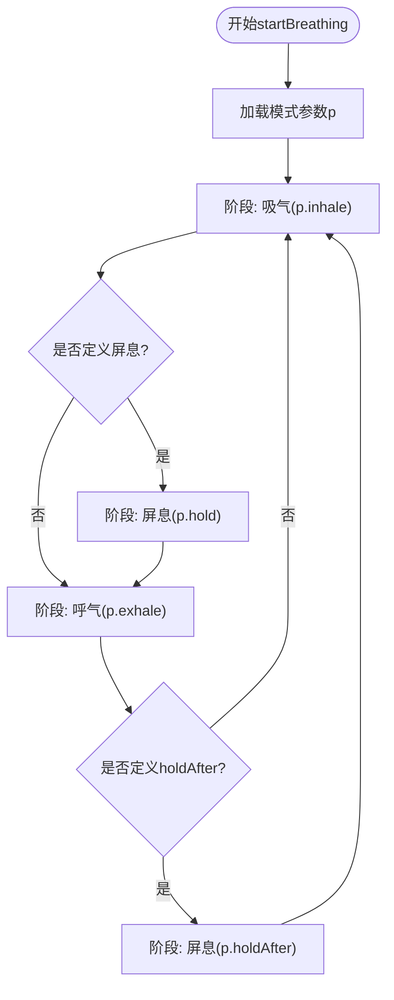
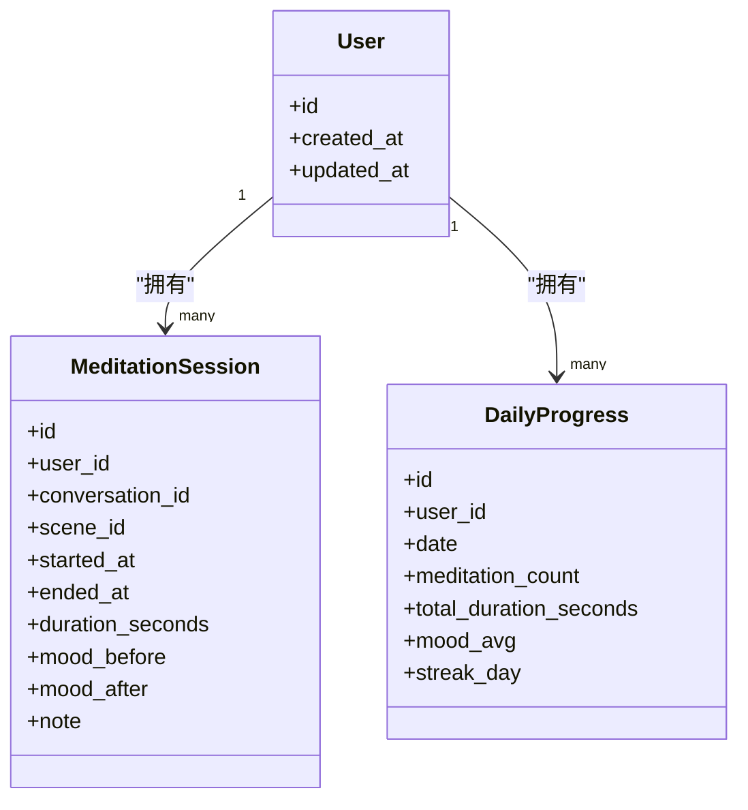
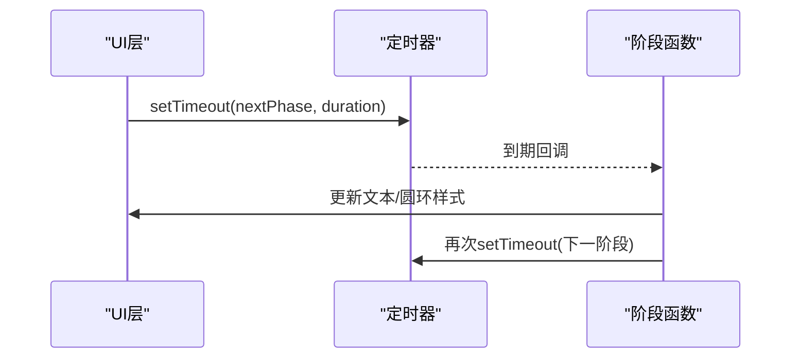
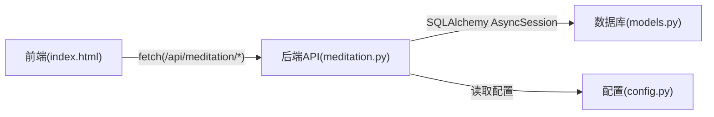

# 呼吸练习引导

<cite>
**本文引用的文件**   
- [hushai/meditation/api/meditation.py](file://hushai/meditation/api/meditation.py)
- [hushai/meditation/db/models.py](file://hushai/meditation/db/models.py)
- [hushai/meditation/static/index.html](file://hushai/meditation/static/index.html)
- [hushai/meditation/config.py](file://hushai/meditation/config.py)
</cite>

## 目录
1. [简介](#简介)
2. [项目结构](#项目结构)
3. [核心组件](#核心组件)
4. [架构总览](#架构总览)
5. [详细组件分析](#详细组件分析)
6. [依赖关系分析](#依赖关系分析)
7. [性能与可用性考虑](#性能与可用性考虑)
8. [故障排查指南](#故障排查指南)
9. [结论](#结论)
10. [附录：API 规范](#附录api-规范)

## 简介
本文件面向 hush.ai 的“呼吸练习引导”功能，系统性说明三种呼吸模式（4-7-8、方形、平静）的引导逻辑实现、计时器控制、语音与视觉反馈同步、用户交互流程；并阐述会话管理（开始、进度跟踪、中断恢复、完成处理）、节奏控制算法、用户偏好存储机制，以及前后端集成的最佳实践。

## 项目结构
呼吸练习相关代码主要分布在以下位置：
- 前端界面与交互逻辑：静态页面 index.html 中的呼吸引导 UI、计时器与动画、进度面板等
- 后端 API：FastAPI 路由用于会话生命周期、情绪打卡、统计查询
- 数据模型：SQLAlchemy ORM 定义冥想会话与每日进度等表结构
- 配置：模块级配置加载与管理

图表来源
- [hushai/meditation/static/index.html:1938-2008](file://hushai/meditation/static/index.html#L1938-L2008)
- [hushai/meditation/api/meditation.py:112-174](file://hushai/meditation/api/meditation.py#L112-L174)
- [hushai/meditation/db/models.py:204-244](file://hushai/meditation/db/models.py#L204-L244)
- [hushai/meditation/config.py:18-62](file://hushai/meditation/config.py#L18-L62)

章节来源
- [hushai/meditation/static/index.html:1938-2008](file://hushai/meditation/static/index.html#L1938-L2008)
- [hushai/meditation/api/meditation.py:112-174](file://hushai/meditation/api/meditation.py#L112-L174)
- [hushai/meditation/db/models.py:204-244](file://hushai/meditation/db/models.py#L204-L244)
- [hushai/meditation/config.py:18-62](file://hushai/meditation/config.py#L18-L62)

## 核心组件
- 呼吸模式与节奏控制（前端）
  - 三种预设模式：4-7-8、方形、平静，分别定义了吸气、屏息、呼气时长
  - 使用定时器驱动阶段切换，更新文本与圆环样式以提供视觉反馈
- 会话管理与进度追踪（后端）
  - 会话开始/结束、情绪打卡、统计与周视图
  - 通过内存字典维护活跃会话时间戳，结合数据库持久化记录
- 数据模型（后端）
  - 冥想会话、每日进度、用户等实体
- 配置（后端）
  - 从环境变量加载模块配置，支持运行时获取与重置

章节来源
- [hushai/meditation/static/index.html:1945-2008](file://hushai/meditation/static/index.html#L1945-L2008)
- [hushai/meditation/api/meditation.py:109-174](file://hushai/meditation/api/meditation.py#L109-L174)
- [hushai/meditation/db/models.py:204-244](file://hushai/meditation/db/models.py#L204-L244)
- [hushai/meditation/config.py:18-62](file://hushai/meditation/config.py#L18-L62)

## 架构总览
呼吸练习由前端主导节奏与反馈，后端负责会话与统计。整体时序如下：

图表来源
- [hushai/meditation/static/index.html:1987-2008](file://hushai/meditation/static/index.html#L1987-L2008)
- [hushai/meditation/api/meditation.py:112-174](file://hushai/meditation/api/meditation.py#L112-L174)
- [hushai/meditation/db/models.py:204-244](file://hushai/meditation/db/models.py#L204-L244)

## 详细组件分析

### 呼吸模式与节奏控制（前端）
- 模式定义
  - 4-7-8：吸气4s、屏息7s、呼气8s
  - 方形：吸气4s、屏息4s、呼气4s、屏息后4s
  - 平静：吸气4s、屏息2s、呼气6s
- 计时器与阶段机
  - 使用定时器按阶段切换，每阶段设置文本与圆环类名以触发CSS动画
  - 支持在切换时动态决定下一阶段的回调函数
- 用户交互
  - 打开/关闭引导窗口
  - 点击预设按钮切换当前模式并重启计时器
  - 停止时清理定时器并复位UI状态

图表来源
- [hushai/meditation/static/index.html:1987-2008](file://hushai/meditation/static/index.html#L1987-L2008)

章节来源
- [hushai/meditation/static/index.html:1945-2008](file://hushai/meditation/static/index.html#L1945-L2008)

### 会话管理机制（后端）
- 会话开始
  - 生成 session_id，记录 started_at，写入 MeditationSession，并在内存中登记活跃会话
- 会话结束
  - 校验活跃会话存在，计算 duration_seconds，回填 ended_at、mood_after、note，提交事务
  - 调用内部方法更新 DailyProgress（次数、时长、情绪均值、连续天数）
- 情绪打卡
  - 独立接口记录 mood，同样更新 DailyProgress
- 统计与周视图
  - 统计总量、今日量、平均情绪、最近会话
  - 周视图按日期聚合每日次数、时长、情绪均值、连续天数

图表来源
- [hushai/meditation/db/models.py:204-244](file://hushai/meditation/db/models.py#L204-L244)

章节来源
- [hushai/meditation/api/meditation.py:112-174](file://hushai/meditation/api/meditation.py#L112-L174)
- [hushai/meditation/db/models.py:204-244](file://hushai/meditation/db/models.py#L204-L244)

### 呼吸节奏控制算法（前端）
- 倒计时逻辑
  - 每个阶段使用定时器延迟执行下一阶段回调
  - 阶段函数内封装文本与样式更新，保证视觉与提示一致
- 视觉反馈
  - 通过为圆环元素添加不同类名（如 inhale/hold/exhale）驱动 CSS 动画
- 音频提示同步
  - 当前呼吸引导未直接集成 Web Speech API 或音频播放；如需语音同步可在阶段回调中调用 speak() 或 Audio API

图表来源
- [hushai/meditation/static/index.html:1987-2008](file://hushai/meditation/static/index.html#L1987-L2008)

章节来源
- [hushai/meditation/static/index.html:1987-2008](file://hushai/meditation/static/index.html#L1987-L2008)

### 用户偏好设置与个性化配置（前端）
- 语音设置
  - 性别筛选、语速、音调等通过滑块与按钮调整，并保存到 localStorage
- 其他偏好
  - 技能选择、聊天历史等也保存在 localStorage（非呼吸练习专属，但体现通用偏好存储方式）

章节来源
- [hushai/meditation/static/index.html:1505-1543](file://hushai/meditation/static/index.html#L1505-L1543)

### 前端界面集成与用户体验优化建议
- 交互一致性
  - 切换模式时先 stopBreathing 再 startBreathing，避免多定时器叠加
- 可访问性
  - 为关键控件增加 aria-label/aria-live，便于读屏器播报
- 错误与边界
  - 网络请求失败时给出友好提示；认证失效时跳转登录
- 性能
  - 避免频繁 DOM 操作，批量更新统计面板；必要时使用 requestAnimationFrame 平滑动画

[本节为概念性指导，不直接分析具体文件]

## 依赖关系分析
- 前端依赖
  - 通过 fetch 调用后端 REST API，携带 Authorization 头进行鉴权
- 后端依赖
  - FastAPI 路由依赖认证中间件与数据库会话注入
  - 使用 SQLAlchemy 异步会话读写数据库
- 配置依赖
  - 模块配置从环境变量加载，供服务启动时使用

图表来源
- [hushai/meditation/static/index.html:2025-2050](file://hushai/meditation/static/index.html#L2025-L2050)
- [hushai/meditation/api/meditation.py:112-174](file://hushai/meditation/api/meditation.py#L112-L174)
- [hushai/meditation/db/models.py:204-244](file://hushai/meditation/db/models.py#L204-L244)
- [hushai/meditation/config.py:18-62](file://hushai/meditation/config.py#L18-L62)

章节来源
- [hushai/meditation/static/index.html:2025-2050](file://hushai/meditation/static/index.html#L2025-L2050)
- [hushai/meditation/api/meditation.py:112-174](file://hushai/meditation/api/meditation.py#L112-L174)
- [hushai/meditation/db/models.py:204-244](file://hushai/meditation/db/models.py#L204-L244)
- [hushai/meditation/config.py:18-62](file://hushai/meditation/config.py#L18-L62)

## 性能与可用性考虑
- 前端
  - 使用一次性定时器链式推进，避免 setInterval 累积误差
  - 将样式变更集中在阶段函数内，减少重排重绘
- 后端
  - 活跃会话使用内存字典，注意进程重启会丢失；生产环境可迁移至 Redis
  - 统计查询使用聚合函数与索引，降低全表扫描成本
- 可用性
  - 提供清晰的视觉与文本提示，确保弱网环境下仍可本地运行呼吸引导

[本节为通用指导，不直接分析具体文件]

## 故障排查指南
- 无法开始/结束会话
  - 检查 Authorization 头是否正确；确认 session_id 是否存在于活跃会话集合
- 统计为空或不准确
  - 确认会话结束接口已调用；检查 DailyProgress 更新逻辑是否被触发
- 前端无响应
  - 检查浏览器控制台是否有 CORS 或鉴权错误；确认 API 地址与 token 有效

章节来源
- [hushai/meditation/api/meditation.py:136-174](file://hushai/meditation/api/meditation.py#L136-L174)
- [hushai/meditation/static/index.html:2025-2050](file://hushai/meditation/static/index.html#L2025-L2050)

## 结论
呼吸练习引导系统在前端实现了稳定可靠的节奏控制与可视化反馈，在后端提供了完整的会话与统计能力。通过清晰的数据模型与 API 设计，系统具备良好的扩展性与可维护性。后续可增强语音同步、断点续练与跨设备同步等体验特性。

[本节为总结性内容，不直接分析具体文件]

## 附录：API 规范

- 基础信息
  - 基路径：/api/meditation
  - 鉴权：请求头 Authorization: Bearer <token>
  - 内容类型：application/json（POST 请求体）

- 会话管理
  - 开始会话
    - 方法：POST
    - 路径：/session/start
    - 请求体字段：
      - conversation_id: string | null
      - scene_id: string | null
      - mood_before: int | null (1..10)
    - 响应体字段：
      - session_id: string
      - started_at: datetime
  - 结束会话
    - 方法：POST
    - 路径：/session/end
    - 请求体字段：
      - session_id: string
      - mood_after: int | null (1..10)
      - note: string | null
    - 响应体字段：
      - session_id: string
      - duration_seconds: int
      - mood_before: int | null
      - mood_after: int | null

- 情绪打卡
  - 方法：POST
  - 路径：/mood-checkin
  - 请求体字段：
    - mood: int (1..10)
  - 响应体字段：
    - mood: int
    - recorded_at: datetime

- 统计与进度
  - 总体统计
    - 方法：GET
    - 路径：/stats
    - 响应体字段：
      - total_sessions: int
      - total_duration_seconds: int
      - current_streak: int
      - longest_streak: int
      - today_sessions: int
      - today_duration_seconds: int
      - avg_mood: float | null
      - recent_sessions: list[{id, started_at, duration_seconds, mood_before, mood_after}]
  - 周视图
    - 方法：GET
    - 路径：/weekly
    - 响应体字段：
      - days: list[{date, day_name, sessions, duration_seconds, mood, streak}]

章节来源
- [hushai/meditation/api/meditation.py:44-107](file://hushai/meditation/api/meditation.py#L44-L107)
- [hushai/meditation/api/meditation.py:112-174](file://hushai/meditation/api/meditation.py#L112-L174)
- [hushai/meditation/api/meditation.py:177-186](file://hushai/meditation/api/meditation.py#L177-L186)
- [hushai/meditation/api/meditation.py:241-333](file://hushai/meditation/api/meditation.py#L241-L333)
- [hushai/meditation/api/meditation.py:336-367](file://hushai/meditation/api/meditation.py#L336-L367)