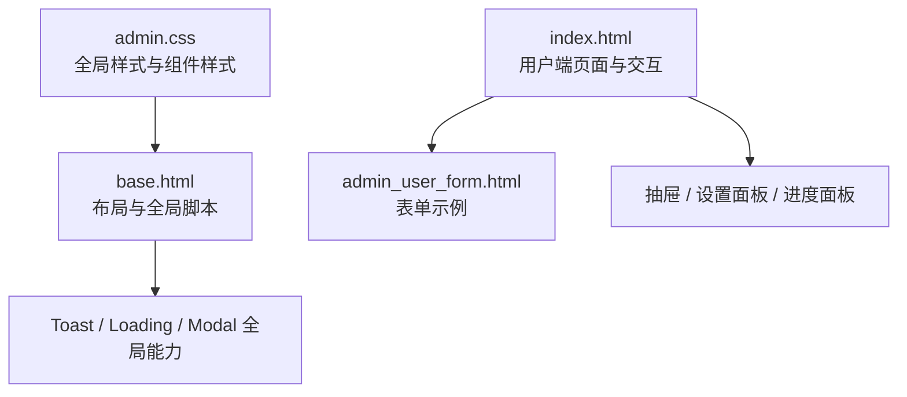
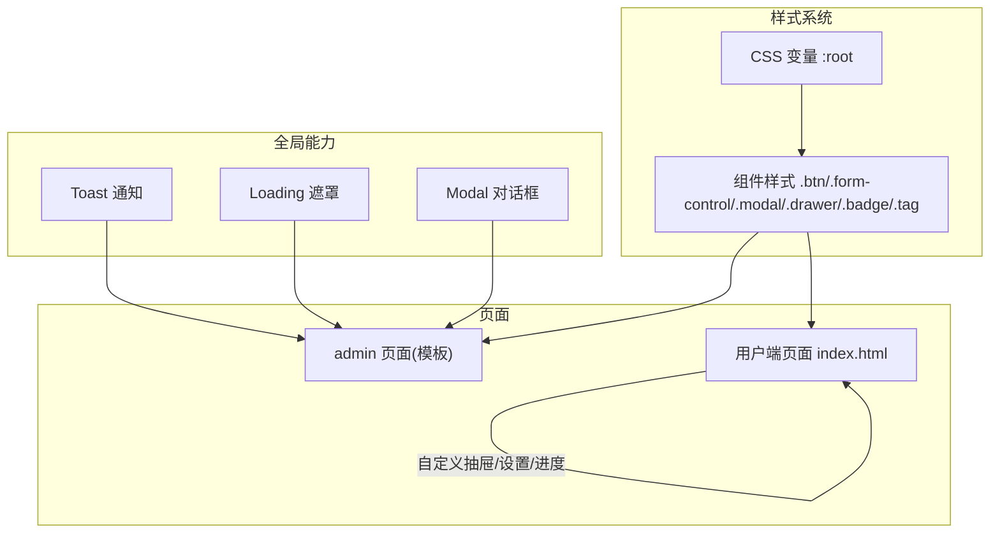
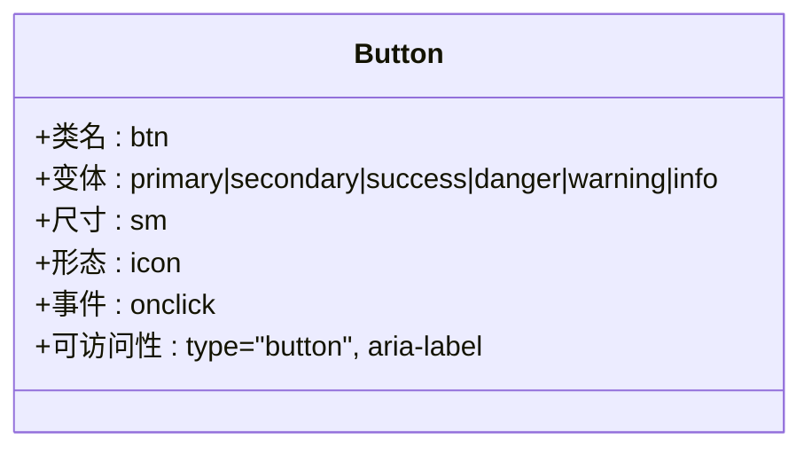
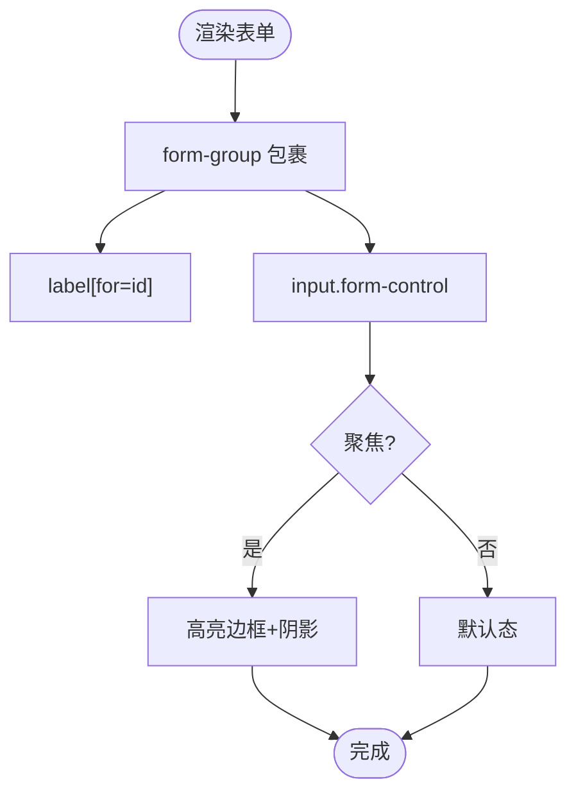
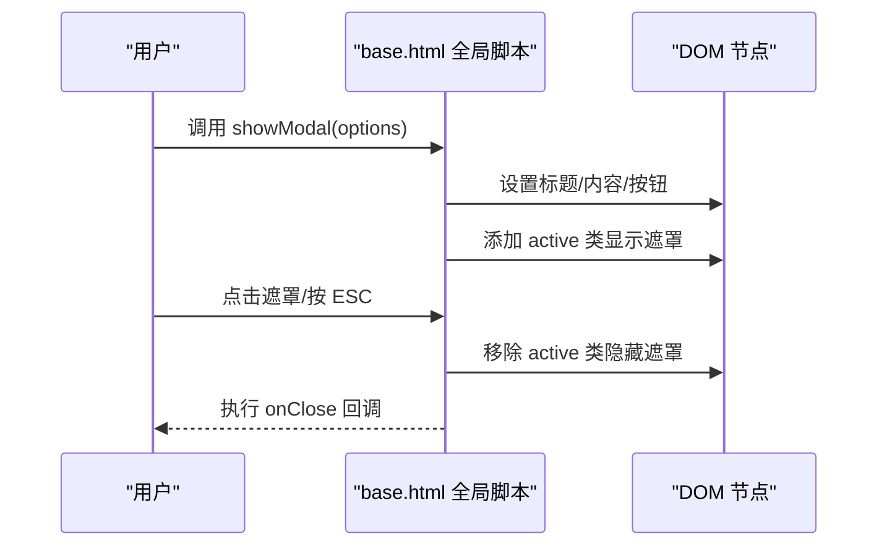
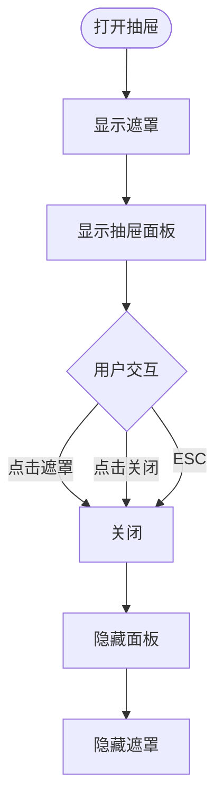
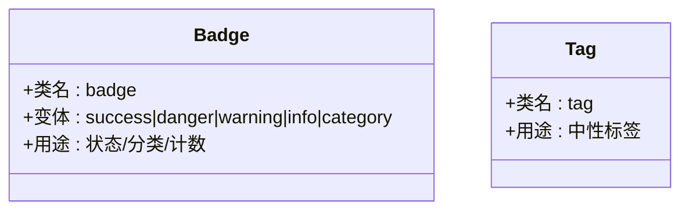
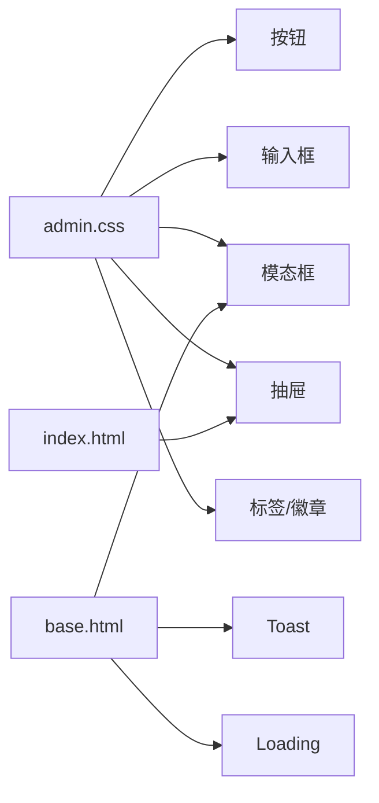

# UI 组件库

<cite>
**本文引用的文件**   
- [admin.css](file://hushai/meditation/admin/static/css/admin.css)
- [base.html](file://hushai/meditation/admin/templates/base.html)
- [index.html](file://hushai/meditation/static/index.html)
- [admin_user_form.html](file://hushai/meditation/admin/templates/admin_user_form.html)
</cite>

## 目录
1. [简介](#简介)
2. [项目结构](#项目结构)
3. [核心组件](#核心组件)
4. [架构总览](#架构总览)
5. [详细组件分析](#详细组件分析)
6. [依赖关系分析](#依赖关系分析)
7. [性能与可访问性](#性能与可访问性)
8. [故障排查指南](#故障排查指南)
9. [结论](#结论)
10. [附录：API 参考与最佳实践](#附录api-参考与最佳实践)

## 简介
本文件为 hush.ai 管理后台与前端页面的 UI 组件库设计与使用文档。基于仓库中的样式与模板实现，提炼出按钮、输入框、模态框、抽屉、标签等通用组件的设计原则、样式系统、API 与可访问性规范，并提供使用示例与最佳实践，帮助开发者快速复用与扩展。

## 项目结构
UI 相关资源主要分布在以下位置：
- 管理后台样式与基础模板：admin/static/css/admin.css、admin/templates/base.html
- 用户端页面（对话、抽屉、呼吸引导等）：meditation/static/index.html
- 表单页面示例：admin/templates/admin_user_form.html

图表来源
- [admin.css:1-800](file://hushai/meditation/admin/static/css/admin.css#L1-L800)
- [base.html:1-502](file://hushai/meditation/admin/templates/base.html#L1-L502)
- [index.html:1038-1237](file://hushai/meditation/static/index.html#L1038-L1237)
- [admin_user_form.html:31-89](file://hushai/meditation/admin/templates/admin_user_form.html#L31-L89)

章节来源
- [admin.css:1-800](file://hushai/meditation/admin/static/css/admin.css#L1-L800)
- [base.html:1-502](file://hushai/meditation/admin/templates/base.html#L1-L502)
- [index.html:1038-1237](file://hushai/meditation/static/index.html#L1038-L1237)
- [admin_user_form.html:31-89](file://hushai/meditation/admin/templates/admin_user_form.html#L31-L89)

## 核心组件
本节从现有实现中抽象出通用组件，并给出职责边界与接口约定。

- 按钮 Button
  - 职责：触发操作，支持主次语义、尺寸与图标组合
  - 关键类名：btn、btn-primary、btn-secondary、btn-success、btn-danger、btn-warning、btn-info、btn-sm、btn-icon
  - 事件：onclick（由调用方绑定）
  - 可访问性：type="button"，必要时提供 aria-label

- 输入框 Input
  - 职责：文本输入，支持必填、占位符、聚焦态
  - 关键类名：form-control、form-group
  - 属性：type、required、minlength、placeholder、value
  - 可访问性：label 关联 for/id，aria-required 可选

- 模态框 Modal
  - 职责：阻塞式对话框，承载确认、详情或复杂表单
  - 入口 API：showModal(options)、closeModal()
  - 选项键：title、icon、content、size、buttons、onClose
  - 行为：ESC 关闭、点击遮罩关闭、焦点管理（建议）
  - 可访问性：role="dialog"、aria-modal、aria-labelledby、aria-describedby

- 抽屉 Drawer
  - 职责：侧边滑出面板，承载列表、筛选、设置
  - 形态：对话历史抽屉、设置抽屉、进度抽屉
  - 行为：open/close、遮罩点击关闭、键盘 ESC 关闭（建议）
  - 可访问性：role="complementary" 或 "dialog"、aria-hidden 切换

- 标签 Tag/Badge
  - 职责：状态、分类、计数等轻量信息展示
  - 关键类名：badge、badge-*、tag
  - 场景：分类、重要度、状态提示

章节来源
- [admin.css:665-778](file://hushai/meditation/admin/static/css/admin.css#L665-L778)
- [admin.css:1170-1178](file://hushai/meditation/admin/static/css/admin.css#L1170-L1178)
- [admin.css:1243-1279](file://hushai/meditation/admin/static/css/admin.css#L1243-L1279)
- [base.html:271-391](file://hushai/meditation/admin/templates/base.html#L271-L391)
- [index.html:1038-1237](file://hushai/meditation/static/index.html#L1038-L1237)

## 架构总览
UI 层以 CSS 变量为核心，统一主题与视觉；通过 base.html 暴露全局 JS 能力（Toast、Loading、Modal），在业务页面按需调用。用户端 index.html 独立实现抽屉与交互逻辑，形成“共享基础 + 页面定制”的架构。

图表来源
- [admin.css:1-35](file://hushai/meditation/admin/static/css/admin.css#L1-L35)
- [admin.css:665-778](file://hushai/meditation/admin/static/css/admin.css#L665-L778)
- [admin.css:1243-1279](file://hushai/meditation/admin/static/css/admin.css#L1243-L1279)
- [base.html:190-391](file://hushai/meditation/admin/templates/base.html#L190-L391)
- [index.html:1038-1237](file://hushai/meditation/static/index.html#L1038-L1237)

## 详细组件分析

### 按钮组件（Button）
- 设计要点
  - 语义化：主按钮用于确认/提交，次按钮用于取消/返回
  - 一致性：圆角、阴影、过渡动效统一
  - 可扩展：支持小尺寸与纯图标按钮
- 样式类名
  - 基础：btn
  - 变体：btn-primary、btn-secondary、btn-success、btn-danger、btn-warning、btn-info
  - 尺寸/形态：btn-sm、btn-icon
- 使用建议
  - 始终设置 type="button" 避免意外提交
  - 图标按钮需提供 aria-label

图表来源
- [admin.css:700-778](file://hushai/meditation/admin/static/css/admin.css#L700-L778)

章节来源
- [admin.css:700-778](file://hushai/meditation/admin/static/css/admin.css#L700-L778)

### 输入框组件（Input）
- 设计要点
  - 表单分组：form-group 包裹 label 与 input
  - 控件：form-control 统一边框、圆角、聚焦态
  - 栅格：form-grid 多列布局
- 属性与校验
  - required、minlength、placeholder、value
- 可访问性
  - label 的 for 与 input id 对应
  - 错误提示可使用 aria-live 区域

图表来源
- [admin.css:1243-1279](file://hushai/meditation/admin/static/css/admin.css#L1243-L1279)
- [admin_user_form.html:31-89](file://hushai/meditation/admin/templates/admin_user_form.html#L31-L89)

章节来源
- [admin.css:1243-1279](file://hushai/meditation/admin/static/css/admin.css#L1243-L1279)
- [admin_user_form.html:31-89](file://hushai/meditation/admin/templates/admin_user_form.html#L31-L89)

### 模态框组件（Modal）
- 设计要点
  - 层级：遮罩 backdrop 与 dialog 分离，支持大尺寸 modal-lg
  - 内容：标题区、主体区、底部按钮区
  - 交互：ESC 关闭、点击遮罩关闭、回调 onClose
- API
  - showModal({ title, icon, content, size, buttons, onClose })
  - closeModal()
  - confirmDelete(title, name, onConfirm)
  - confirmAction(title, message, onConfirm, icon)
- 可访问性
  - role="dialog"、aria-modal="true"、aria-labelledby、aria-describedby
  - 打开时锁定滚动，关闭后恢复

图表来源
- [base.html:271-391](file://hushai/meditation/admin/templates/base.html#L271-L391)
- [admin.css:1597-1726](file://hushai/meditation/admin/static/css/admin.css#L1597-L1726)

章节来源
- [base.html:271-391](file://hushai/meditation/admin/templates/base.html#L271-L391)
- [admin.css:1597-1726](file://hushai/meditation/admin/static/css/admin.css#L1597-L1726)

### 抽屉组件（Drawer）
- 设计要点
  - 容器：mask + drawer 双节点控制显隐
  - 内容：头部标题、关闭按钮、主体区域
  - 交互：点击遮罩关闭、按钮关闭、键盘 ESC（建议）
- 典型场景
  - 对话历史抽屉、语音设置抽屉、进度抽屉
- 可访问性
  - 打开时 aria-hidden="false"，关闭时 aria-hidden="true"
  - 焦点应移入抽屉内部

图表来源
- [index.html:1038-1237](file://hushai/meditation/static/index.html#L1038-L1237)

章节来源
- [index.html:1038-1237](file://hushai/meditation/static/index.html#L1038-L1237)

### 标签组件（Tag/Badge）
- 设计要点
  - 轻量信息展示，区分状态与分类
  - 颜色语义：成功、危险、警告、信息、分类
- 类名
  - badge、badge-success、badge-danger、badge-warning、badge-info、badge-category
  - tag（中性标签）

图表来源
- [admin.css:665-697](file://hushai/meditation/admin/static/css/admin.css#L665-L697)
- [admin.css:1170-1178](file://hushai/meditation/admin/static/css/admin.css#L1170-L1178)

章节来源
- [admin.css:665-697](file://hushai/meditation/admin/static/css/admin.css#L665-L697)
- [admin.css:1170-1178](file://hushai/meditation/admin/static/css/admin.css#L1170-L1178)

## 依赖关系分析
- 样式依赖
  - 所有组件均依赖 :root 定义的 CSS 变量（颜色、圆角、阴影、字体、过渡）
  - 组件样式集中在 admin.css，便于统一维护
- 脚本依赖
  - base.html 注入全局 window 方法（Toast/Loading/Modal），供各页面直接调用
  - index.html 自包含抽屉与交互逻辑，不依赖 base.html 的全局能力
- 模板依赖
  - 管理后台页面继承 base.html 布局与全局能力
  - 用户端页面独立运行

图表来源
- [admin.css:1-35](file://hushai/meditation/admin/static/css/admin.css#L1-L35)
- [base.html:190-391](file://hushai/meditation/admin/templates/base.html#L190-L391)
- [index.html:1038-1237](file://hushai/meditation/static/index.html#L1038-L1237)

章节来源
- [admin.css:1-35](file://hushai/meditation/admin/static/css/admin.css#L1-L35)
- [base.html:190-391](file://hushai/meditation/admin/templates/base.html#L190-L391)
- [index.html:1038-1237](file://hushai/meditation/static/index.html#L1038-L1237)

## 性能与可访问性
- 性能
  - 优先使用 CSS 变量与类名切换，减少内联样式与频繁重排
  - 动画使用 transition 与 transform，避免 layout thrashing
  - 大型列表（如对话历史）采用懒加载与虚拟滚动（建议）
- 可访问性
  - 跳过链接：skip-link 提升键盘导航效率
  - 语义化标签与 ARIA：role、aria-label、aria-live、aria-pressed、aria-hidden
  - 键盘交互：ESC 关闭弹窗/抽屉，焦点管理（建议）
  - 对比度与可读性：遵循 WCAG 对比度要求

章节来源
- [base.html:17-28](file://hushai/meditation/admin/templates/base.html#L17-L28)
- [index.html:943-1035](file://hushai/meditation/static/index.html#L943-L1035)

## 故障排查指南
- 模态框无法关闭
  - 检查是否误删遮罩监听或 ESC 监听
  - 确认 backdrop.active 类是否正确切换
- Toast 未显示
  - 确认 toastContainer 是否存在
  - 检查 showToast 参数类型与时长
- Loading 遮罩残留
  - 确保请求成功/失败分支都调用 hideLoading
- 抽屉无法弹出
  - 检查 mask/drawer 节点 ID 与 open/close 逻辑
  - 确认 z-index 未被覆盖

章节来源
- [base.html:271-391](file://hushai/meditation/admin/templates/base.html#L271-L391)
- [index.html:1038-1237](file://hushai/meditation/static/index.html#L1038-L1237)

## 结论
本组件库以 CSS 变量驱动的主题系统与模块化样式为基础，结合 base.html 的全局能力与页面级抽屉实现，形成了“基础能力共享 + 页面灵活定制”的架构。通过统一的类名约定与可访问性规范，可在保证一致体验的同时提高开发效率与可维护性。

## 附录：API 参考与最佳实践

### 样式系统与主题
- CSS 变量定义
  - 色彩：primary、accent、success、warning、danger、info
  - 背景：bg-primary、bg-secondary、bg-tertiary、bg-sidebar
  - 文字：text-primary、text-secondary、text-light、text-inverse
  - 边框与阴影：border、shadow-sm/shadow/shadow-lg
  - 圆角与过渡：radius-sm/radius/radius-lg、transition
  - 字体：font-display、font-ui
- 主题切换
  - 通过覆盖 :root 变量实现主题切换
  - 建议在页面根节点或 body 上应用主题类名

章节来源
- [admin.css:1-35](file://hushai/meditation/admin/static/css/admin.css#L1-L35)

### 组件 API 速查
- 按钮
  - 类名：btn、btn-primary、btn-secondary、btn-success、btn-danger、btn-warning、btn-info、btn-sm、btn-icon
  - 事件：onclick
  - 可访问性：type="button"、aria-label
- 输入框
  - 类名：form-control、form-group、form-grid
  - 属性：type、required、minlength、placeholder、value
  - 可访问性：label[for] 与 input[id] 对应
- 模态框
  - 方法：showModal(options)、closeModal()
  - 选项：title、icon、content、size、buttons、onClose
  - 快捷：confirmDelete、confirmAction
  - 可访问性：role="dialog"、aria-modal、aria-labelledby、aria-describedby
- 抽屉
  - 节点：mask + drawer
  - 方法：open()/close()（页面级实现）
  - 可访问性：aria-hidden 切换、focus trap（建议）
- 标签/徽章
  - 类名：badge、badge-*、tag

章节来源
- [admin.css:665-778](file://hushai/meditation/admin/static/css/admin.css#L665-L778)
- [admin.css:1170-1178](file://hushai/meditation/admin/static/css/admin.css#L1170-L1178)
- [admin.css:1243-1279](file://hushai/meditation/admin/static/css/admin.css#L1243-L1279)
- [base.html:271-391](file://hushai/meditation/admin/templates/base.html#L271-L391)
- [index.html:1038-1237](file://hushai/meditation/static/index.html#L1038-L1237)

### 使用示例与最佳实践
- 按钮
  - 使用 btn-primary 表示主要操作，btn-secondary 表示次要操作
  - 图标按钮配合 aria-label 描述动作
- 输入框
  - 使用 form-group 组织 label 与 input，提供清晰的辅助说明
  - 对敏感字段使用 type="password" 并给出最小长度提示
- 模态框
  - 删除操作使用 confirmDelete，其他确认使用 confirmAction
  - 复杂内容使用 size="lg"，并在 onClose 中清理副作用
- 抽屉
  - 将长列表放入抽屉，避免遮挡主内容
  - 打开时锁定滚动，关闭后恢复
- 标签/徽章
  - 使用语义化颜色表达状态，避免过度装饰
- 可访问性
  - 为所有交互元素提供可理解的名称与角色
  - 动态更新区域使用 aria-live 告知屏幕阅读器

章节来源
- [admin.css:665-778](file://hushai/meditation/admin/static/css/admin.css#L665-L778)
- [admin.css:1243-1279](file://hushai/meditation/admin/static/css/admin.css#L1243-L1279)
- [base.html:271-391](file://hushai/meditation/admin/templates/base.html#L271-L391)
- [index.html:1038-1237](file://hushai/meditation/static/index.html#L1038-L1237)