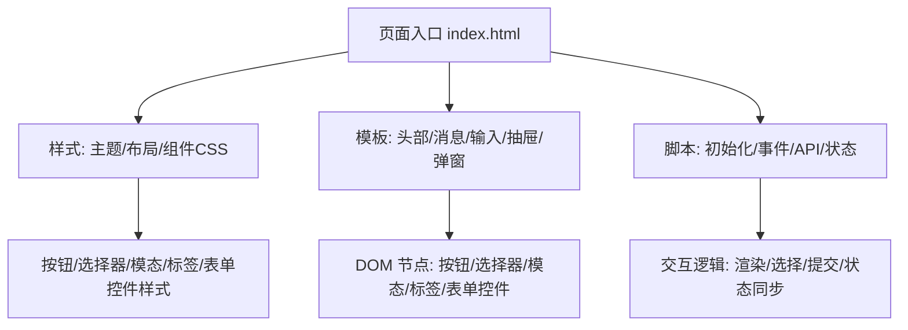
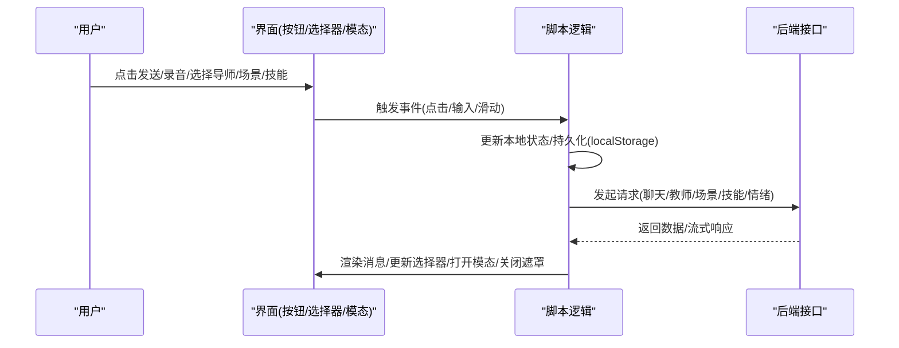
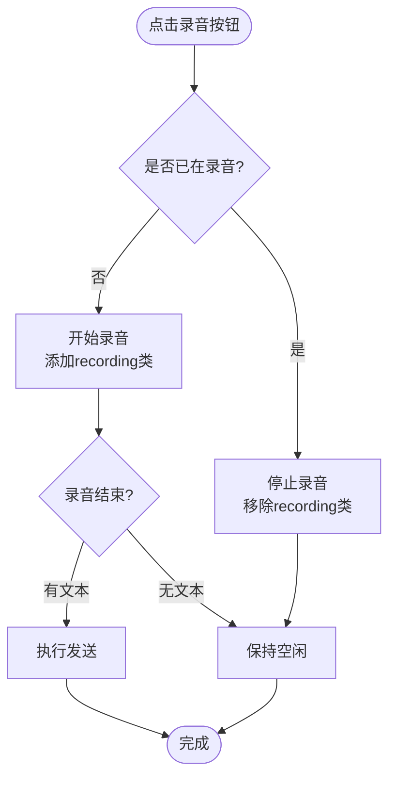
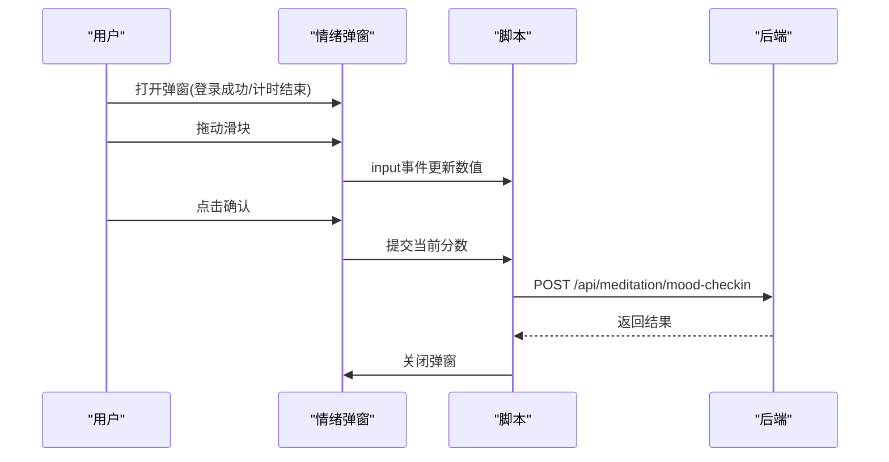
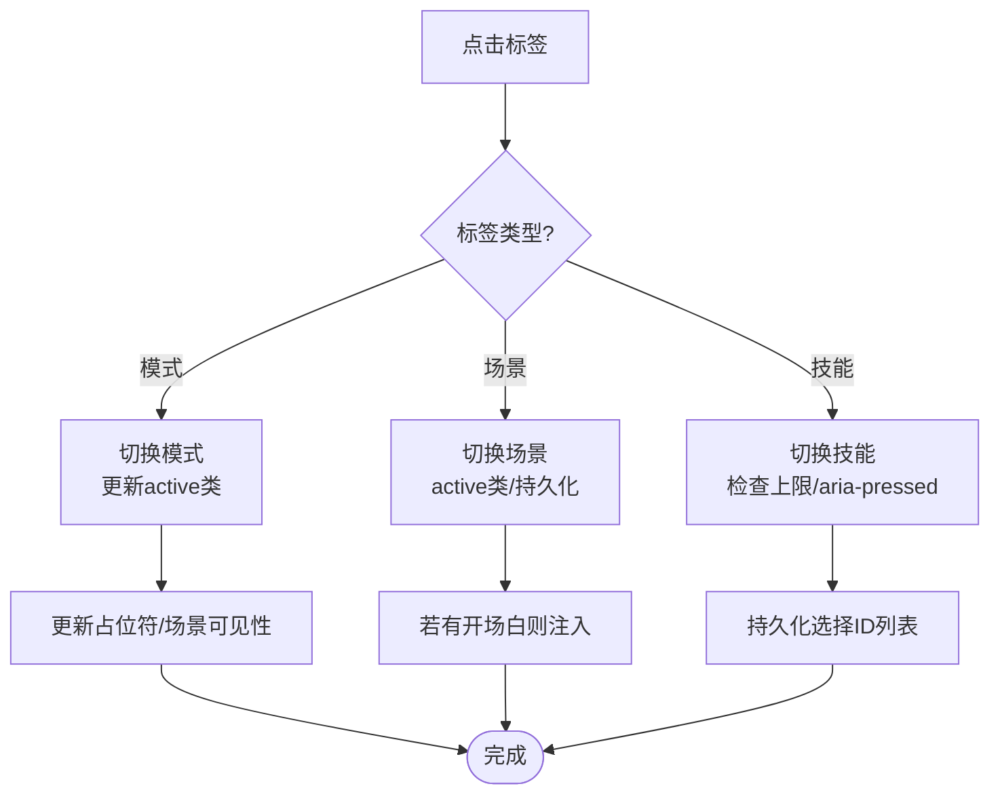
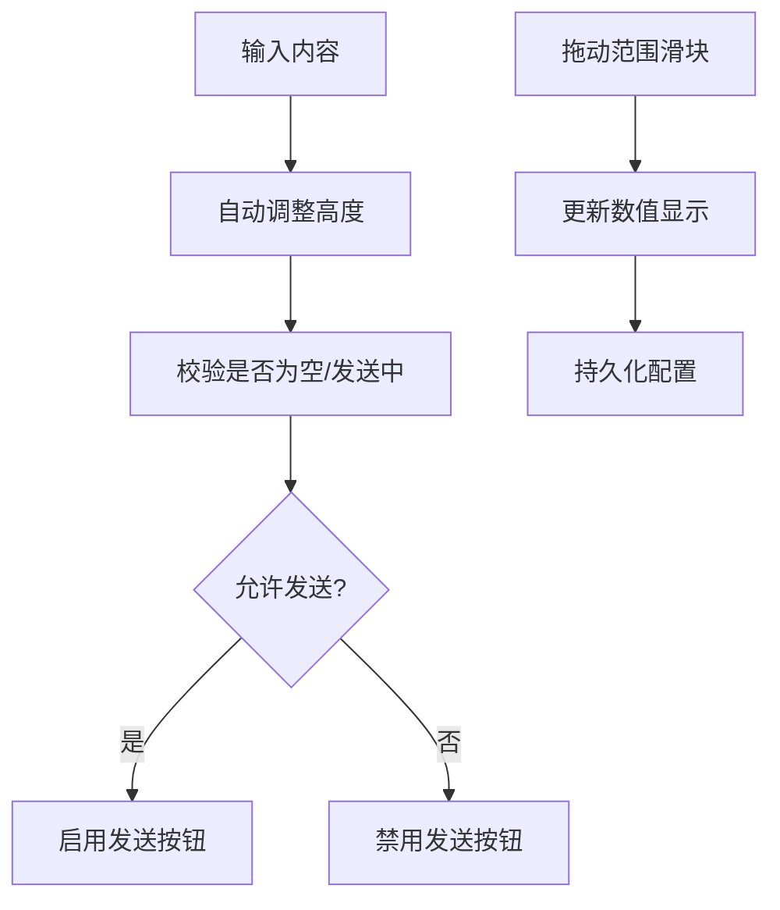
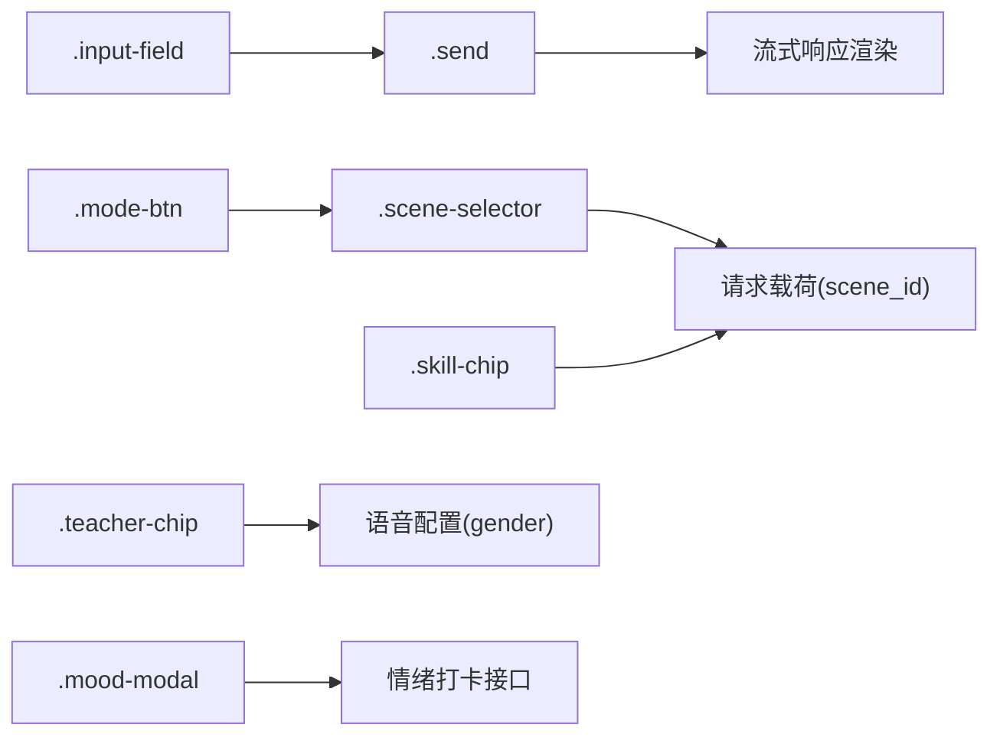

# 交互组件

<cite>
**本文引用的文件**   
- [index.html](file://hushai/meditation/static/index.html)
</cite>

## 目录
1. [简介](#简介)
2. [项目结构](#项目结构)
3. [核心组件](#核心组件)
4. [架构总览](#架构总览)
5. [详细组件分析](#详细组件分析)
6. [依赖关系分析](#依赖关系分析)
7. [性能与可访问性](#性能与可访问性)
8. [故障排查指南](#故障排查指南)
9. [结论](#结论)

## 简介
本文件面向 hush.ai 的冥想陪伴前端界面，聚焦“交互组件”的实现与使用。文档围绕以下目标展开：
- 按钮组件：普通圆形按钮、发送按钮、录音按钮的状态与样式
- 选择器组件：导师选择器、场景选择器、技能条（技能芯片）的交互逻辑
- 模态框组件：情绪评分滑块、确认/取消按钮与动画效果
- 标签组件：模式切换、场景芯片、技能芯片的状态管理（激活、悬停、点击反馈）
- 表单控件：输入框、下拉选择、范围滑块的样式与行为

所有说明均基于仓库中的实际实现进行梳理，便于开发者快速理解并扩展。

## 项目结构
该页面为单页应用，HTML/CSS/JS 集中在一个文件中，按区域划分样式与脚本：
- 样式区：定义全局变量、布局、各组件样式与动画
- 模板区：头部、消息区、输入区、设置抽屉、对话历史抽屉、进度抽屉、呼吸引导、情绪弹窗等
- 脚本区：初始化、数据加载、事件绑定、API 调用、状态管理



图表来源
- [index.html:1-100](file://hushai/meditation/static/index.html#L1-L100)
- [index.html:940-1160](file://hushai/meditation/static/index.html#L940-L1160)

章节来源
- [index.html:1-120](file://hushai/meditation/static/index.html#L1-L120)
- [index.html:940-1160](file://hushai/meditation/static/index.html#L940-L1160)

## 核心组件
本节概述各组件的职责与关键特性，后续章节将深入细节。

- 按钮组件
  - 普通圆形按钮 .btn-circle：基础圆形按钮，支持 hover/active/disabled 状态
  - 发送按钮 .btn-circle.send：高亮主按钮，禁用时不可点击
  - 录音按钮 .btn-circle.recording：录音中状态，带脉冲动画与颜色提示
- 选择器组件
  - 导师选择器 .teacher-selector：展示可选导师卡片，选中后持久化并影响语音性别过滤
  - 场景选择器 .scene-selector：场景标签，选中后自动注入开场白或重置会话
  - 技能条 .skill-bar：技能芯片集合，限制最大选择数，持久化选择
- 模态框组件
  - 情绪弹窗 .mood-modal：滑块评分、确认/跳过按钮、遮罩与缩放动画
- 标签组件
  - 模式按钮 .mode-btn：模式切换（冥想陪伴/知识库问答），激活态高亮
  - 场景芯片 .scene-chip：选中态背景填充动画
  - 技能芯片 .skill-chip：aria-pressed 控制激活态，禁用态防超选
- 表单控件
  - 输入框 .input-field：自适应高度、焦点边框变化
  - 下拉选择 .set-select：自定义箭头、焦点边框变化
  - 范围滑块 .set-range：统一滑块样式，实时数值显示

章节来源
- [index.html:524-540](file://hushai/meditation/static/index.html#L524-L540)
- [index.html:300-389](file://hushai/meditation/static/index.html#L300-L389)
- [index.html:761-800](file://hushai/meditation/static/index.html#L761-L800)
- [index.html:291-298](file://hushai/meditation/static/index.html#L291-L298)
- [index.html:585-616](file://hushai/meditation/static/index.html#L585-L616)

## 架构总览
从用户操作到后端响应的整体流程如下：



图表来源
- [index.html:1795-1891](file://hushai/meditation/static/index.html#L1795-L1891)
- [index.html:1368-1438](file://hushai/meditation/static/index.html#L1368-L1438)
- [index.html:1280-1315](file://hushai/meditation/static/index.html#L1280-L1315)
- [index.html:1893-1936](file://hushai/meditation/static/index.html#L1893-L1936)

## 详细组件分析

### 按钮组件
- 普通圆形按钮 .btn-circle
  - 外观：圆形、边框、居中图标；hover 加深边框与文字色；active 缩小；disabled 半透明且禁止交互
  - 用途：通用圆形操作按钮（如设置、语音）
- 发送按钮 .btn-circle.send
  - 外观：深色背景+浅色文字；hover 变浅灰；禁用态不可点击
  - 行为：当输入为空或正在发送时禁用；点击触发发送流程
- 录音按钮 .btn-circle.recording
  - 外观：红色系边框与背景，配合呼吸动画表示录音中
  - 行为：点击开始/停止录音；录音结束自动提交文本；失败时清理状态



图表来源
- [index.html:534-539](file://hushai/meditation/static/index.html#L534-L539)
- [index.html:1652-1659](file://hushai/meditation/static/index.html#L1652-L1659)
- [index.html:1795-1891](file://hushai/meditation/static/index.html#L1795-L1891)

章节来源
- [index.html:524-540](file://hushai/meditation/static/index.html#L524-L540)
- [index.html:1652-1659](file://hushai/meditation/static/index.html#L1652-L1659)
- [index.html:1795-1891](file://hushai/meditation/static/index.html#L1795-L1891)

### 选择器组件
- 导师选择器 .teacher-selector
  - 交互：点击某位导师，记录选中 ID 并持久化；根据导师语音性别过滤音色列表；更新头像与名称
  - 数据：通过接口获取导师列表与当前选中项
- 场景选择器 .scene-selector
  - 交互：点击场景标签，切换 active 状态并持久化；若场景含开场白，则清空会话并插入开场内容
  - 数据：通过接口获取场景列表
- 技能条 .skill-bar
  - 交互：多选技能芯片，最多 N 个；超出上限时禁用未选中项；持久化选择 ID 列表
  - 数据：通过接口获取技能列表

```mermaid
classDiagram
class TeacherSelector {
+show() void
+renderChips() void
+selectTeacher(id) void
}
class SceneSelector {
+show() void
+renderChips() void
+toggleScene(id) void
}
class SkillBar {
+show() void
+renderChips() void
+toggleSkill(id) void
}
TeacherSelector --> "持久化" : localStorage
SceneSelector --> "持久化" : localStorage
SkillBar --> "持久化" : localStorage
```

图表来源
- [index.html:300-329](file://hushai/meditation/static/index.html#L300-L329)
- [index.html:333-361](file://hushai/meditation/static/index.html#L333-L361)
- [index.html:365-389](file://hushai/meditation/static/index.html#L365-L389)
- [index.html:1368-1438](file://hushai/meditation/static/index.html#L1368-L1438)
- [index.html:1280-1315](file://hushai/meditation/static/index.html#L1280-L1315)
- [index.html:1326-1366](file://hushai/meditation/static/index.html#L1326-L1366)

章节来源
- [index.html:300-329](file://hushai/meditation/static/index.html#L300-L329)
- [index.html:333-361](file://hushai/meditation/static/index.html#L333-L361)
- [index.html:365-389](file://hushai/meditation/static/index.html#L365-L389)
- [index.html:1280-1315](file://hushai/meditation/static/index.html#L1280-L1315)
- [index.html:1326-1366](file://hushai/meditation/static/index.html#L1326-L1366)
- [index.html:1368-1438](file://hushai/meditation/static/index.html#L1368-L1438)

### 模态框组件（情绪评分）
- 功能
  - 遮罩层与弹窗：点击遮罩关闭；弹窗内包含标题、说明、滑块、数值、确认/跳过按钮
  - 滑块：范围 1-10，实时更新数值显示
  - 动画：遮罩淡入、弹窗缩放进入
  - 提交：确认后调用情绪打卡接口
- 交互要点
  - 首次登录后当天仅弹出一次（通过日期键持久化）
  - 跳过不提交，直接关闭



图表来源
- [index.html:761-800](file://hushai/meditation/static/index.html#L761-L800)
- [index.html:1893-1936](file://hushai/meditation/static/index.html#L1893-L1936)
- [index.html:2096-2107](file://hushai/meditation/static/index.html#L2096-L2107)

章节来源
- [index.html:761-800](file://hushai/meditation/static/index.html#L761-L800)
- [index.html:1893-1936](file://hushai/meditation/static/index.html#L1893-L1936)
- [index.html:2096-2107](file://hushai/meditation/static/index.html#L2096-L2107)

### 标签组件（状态管理）
- 模式按钮 .mode-btn
  - 激活态：深色背景+浅色文字；切换时互斥
  - 行为：切换模式后改变输入占位符与场景选择器可见性
- 场景芯片 .scene-chip
  - 激活态：背景填充动画；悬停边框加深
  - 行为：选中后可能注入开场白或重置会话
- 技能芯片 .skill-chip
  - 激活态：aria-pressed="true"，深色背景+浅色文字
  - 行为：受最大选择数限制，超出时禁用未选中项



图表来源
- [index.html:291-298](file://hushai/meditation/static/index.html#L291-L298)
- [index.html:344-361](file://hushai/meditation/static/index.html#L344-L361)
- [index.html:377-389](file://hushai/meditation/static/index.html#L377-L389)
- [index.html:1269-1278](file://hushai/meditation/static/index.html#L1269-L1278)
- [index.html:1289-1315](file://hushai/meditation/static/index.html#L1289-L1315)
- [index.html:1326-1366](file://hushai/meditation/static/index.html#L1326-L1366)

章节来源
- [index.html:291-298](file://hushai/meditation/static/index.html#L291-L298)
- [index.html:344-361](file://hushai/meditation/static/index.html#L344-L361)
- [index.html:377-389](file://hushai/meditation/static/index.html#L377-L389)
- [index.html:1269-1278](file://hushai/meditation/static/index.html#L1269-L1278)
- [index.html:1289-1315](file://hushai/meditation/static/index.html#L1289-L1315)
- [index.html:1326-1366](file://hushai/meditation/static/index.html#L1326-L1366)

### 表单控件组件
- 输入框 .input-field
  - 样式：圆角为 0，边框随焦点变化；背景在焦点时变浅
  - 行为：自动调整高度（最小/最大限制）；空值或发送中禁用发送按钮
- 下拉选择 .set-select
  - 样式：自定义下拉箭头；焦点边框加深
  - 行为：用于音色筛选与选择
- 范围滑块 .set-range
  - 样式：统一滑块轨道与拇指；悬停放大
  - 行为：实时显示数值并持久化



图表来源
- [index.html:514-523](file://hushai/meditation/static/index.html#L514-L523)
- [index.html:585-616](file://hushai/meditation/static/index.html#L585-L616)
- [index.html:1565-1570](file://hushai/meditation/static/index.html#L1565-L1570)
- [index.html:1523-1537](file://hushai/meditation/static/index.html#L1523-L1537)

章节来源
- [index.html:514-523](file://hushai/meditation/static/index.html#L514-L523)
- [index.html:585-616](file://hushai/meditation/static/index.html#L585-L616)
- [index.html:1565-1570](file://hushai/meditation/static/index.html#L1565-L1570)
- [index.html:1523-1537](file://hushai/meditation/static/index.html#L1523-L1537)

## 依赖关系分析
- 组件间耦合
  - 发送流程依赖输入框状态、模式选择、场景/技能/导师选择
  - 导师选择影响音色过滤与语音输出
  - 情绪弹窗独立于聊天流程，但可在计时结束时触发
- 外部依赖
  - Web Speech API（语音识别/合成）
  - 浏览器 fetch API（网络请求）
  - localStorage（持久化）



图表来源
- [index.html:1795-1891](file://hushai/meditation/static/index.html#L1795-L1891)
- [index.html:1368-1438](file://hushai/meditation/static/index.html#L1368-L1438)
- [index.html:1893-1936](file://hushai/meditation/static/index.html#L1893-L1936)

章节来源
- [index.html:1795-1891](file://hushai/meditation/static/index.html#L1795-L1891)
- [index.html:1368-1438](file://hushai/meditation/static/index.html#L1368-L1438)
- [index.html:1893-1936](file://hushai/meditation/static/index.html#L1893-L1936)

## 性能与可访问性
- 性能
  - 流式渲染：逐段拼接文本，避免整段重绘
  - 减少动画：尊重 prefers-reduced-motion，禁用不必要动画
  - 局部更新：仅更新必要 DOM 节点（如消息气泡、选择器 chips）
- 可访问性
  - 键盘可达：focus-visible 提供清晰轮廓
  - 语义化：aria-pressed 表达开关状态；aria-live 播报新增消息
  - 无障碍提示：statusText 反映朗读状态

章节来源
- [index.html:736-746](file://hushai/meditation/static/index.html#L736-L746)
- [index.html:1011-1016](file://hushai/meditation/static/index.html#L1011-L1016)
- [index.html:1678-1692](file://hushai/meditation/static/index.html#L1678-L1692)

## 故障排查指南
- 无法连接服务
  - 现象：登录错误提示“无法连接服务，请检查网络后重试”
  - 处理：检查网络与后端可用性；确认 API 地址
- 登录过期
  - 现象：请求返回 401，自动刷新 token 失败则回到登录页
  - 处理：重新登录；检查 refresh_token 是否有效
- 语音不可用
  - 现象：SpeechRecognition/SpeechSynthesis 不可用
  - 处理：更换浏览器或使用 HTTPS；确认权限
- 流式响应异常
  - 现象：无法解析 data: 行或出现错误信息
  - 处理：查看服务端返回格式；确保 delta/done 字段正确

章节来源
- [index.html:1605-1608](file://hushai/meditation/static/index.html#L1605-L1608)
- [index.html:1611-1637](file://hushai/meditation/static/index.html#L1611-L1637)
- [index.html:1640-1651](file://hushai/meditation/static/index.html#L1640-L1651)
- [index.html:1854-1883](file://hushai/meditation/static/index.html#L1854-L1883)

## 结论
本文件系统化梳理了 hush.ai 冥想陪伴界面的交互组件实现，涵盖按钮、选择器、模态框、标签与表单控件的样式、状态与交互逻辑。通过清晰的流程图与时序图，帮助读者快速定位关键路径与潜在问题点。建议在扩展新功能时遵循现有模式：以 CSS 类名驱动状态、以 localStorage 持久化选择、以事件驱动更新 UI，并保持对可访问性与性能的兼顾。