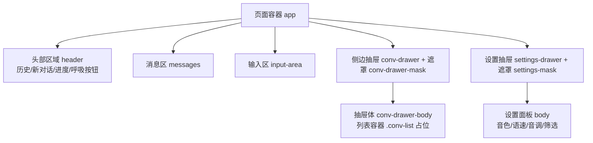
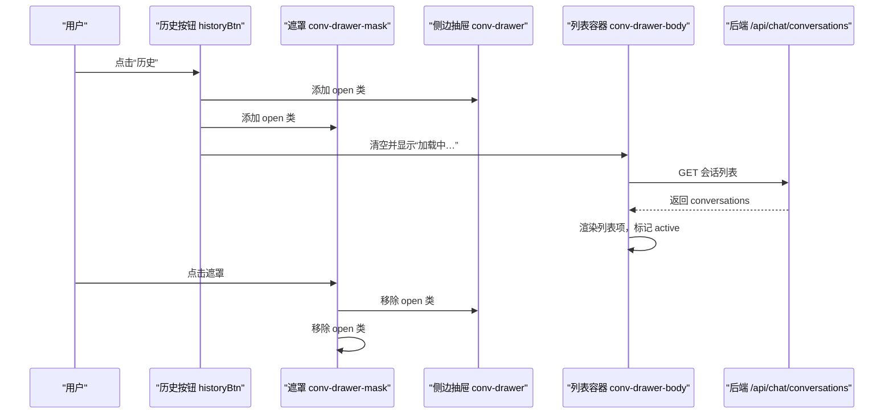
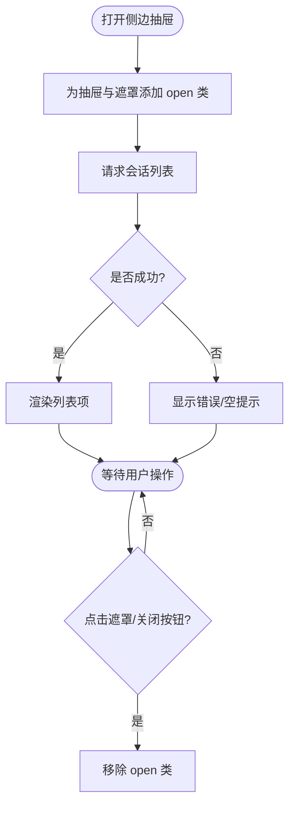
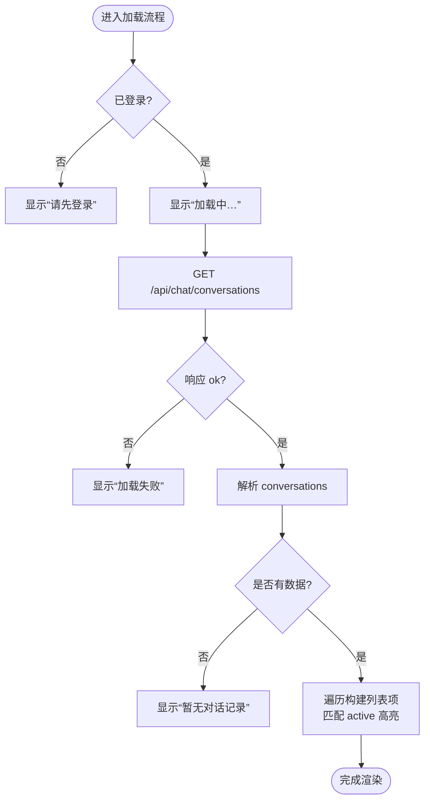
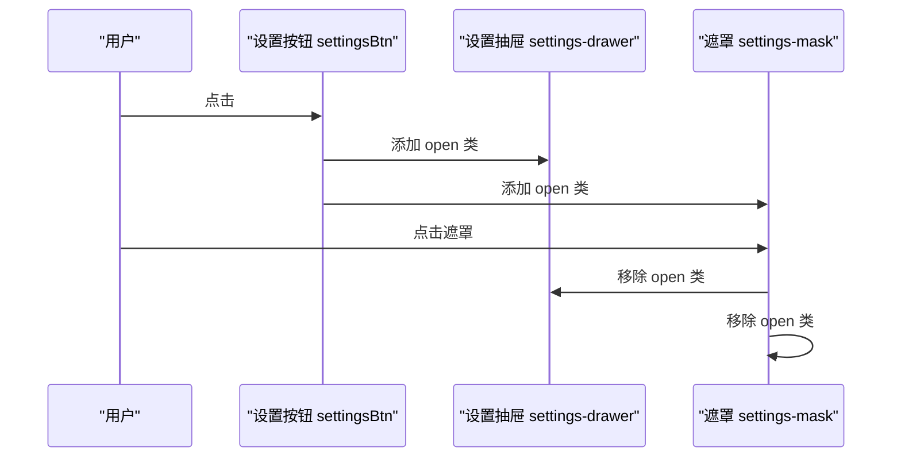
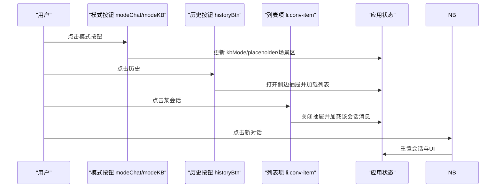
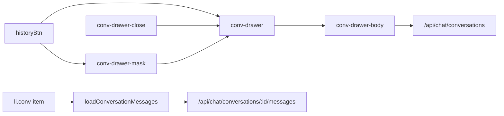

# 导航组件

<cite>
**本文引用的文件**   
- [index.html](file://hushai/meditation/static/index.html)
</cite>

## 目录
1. [简介](#简介)
2. [项目结构](#项目结构)
3. [核心组件](#核心组件)
4. [架构总览](#架构总览)
5. [详细组件分析](#详细组件分析)
6. [依赖关系分析](#依赖关系分析)
7. [性能与可访问性](#性能与可访问性)
8. [故障排查指南](#故障排查指南)
9. [结论](#结论)

## 简介
本文件面向 hush.ai 前端页面中的“导航组件”，聚焦以下目标：
- 侧边抽屉（.conv-drawer）的滑入滑出动画与遮罩层交互
- 对话列表（.conv-list）渲染逻辑，包括加载状态、空状态和活跃项高亮
- 设置抽屉（.settings-drawer）的底部弹出效果、最大高度限制与滚动处理
- 导航按钮的状态管理与路由切换逻辑（会话切换与模式切换）
- 抽屉组件的触摸手势支持、键盘导航与屏幕阅读器兼容性实现要点

## 项目结构
导航相关 UI 与行为集中在单页应用入口文件中，包含样式与脚本两部分：
- 样式部分定义了侧边抽屉、遮罩层、设置抽屉、列表项等视觉与动效
- 脚本部分实现了打开/关闭抽屉、拉取并渲染对话列表、切换会话、模式切换等交互逻辑

图表来源
- [index.html:970-1035](file://hushai/meditation/static/index.html#L970-L1035)
- [index.html:1038-1089](file://hushai/meditation/static/index.html#L1038-L1089)

章节来源
- [index.html:970-1035](file://hushai/meditation/static/index.html#L970-L1035)
- [index.html:1038-1089](file://hushai/meditation/static/index.html#L1038-L1089)

## 核心组件
- 侧边抽屉（.conv-drawer）
  - 通过添加/移除 open 类控制 transform 位移，配合遮罩层 opacity 变化完成滑入滑出
  - 点击遮罩或关闭按钮触发关闭
- 对话列表（.conv-list）
  - 在抽屉打开时发起请求，先显示“加载中…”，成功后渲染列表；无数据时显示“暂无对话记录”
  - 当前会话项通过 active 类高亮
- 设置抽屉（.settings-drawer）
  - 从底部弹出，使用 translate(-50%, Y) 居中定位，open 类将 Y 从 100% 变为 0
  - 最大高度 72vh，内部滚动条隐藏，内容超出自动滚动
- 导航按钮与状态管理
  - “历史”按钮打开侧边抽屉，“新对话”重置会话，“冥想陪伴/知识库问答”模式切换影响场景选择与发送端点

章节来源
- [index.html:668-731](file://hushai/meditation/static/index.html#L668-L731)
- [index.html:549-665](file://hushai/meditation/static/index.html#L549-L665)
- [index.html:1186-1254](file://hushai/meditation/static/index.html#L1186-L1254)
- [index.html:1269-1278](file://hushai/meditation/static/index.html#L1269-L1278)

## 架构总览
下图展示了导航相关的 DOM 结构与交互流程。

图表来源
- [index.html:1186-1216](file://hushai/meditation/static/index.html#L1186-L1216)
- [index.html:1218-1235](file://hushai/meditation/static/index.html#L1218-L1235)

## 详细组件分析

### 侧边抽屉（.conv-drawer）
- 动画与遮罩
  - 默认 transform: translateX(-100%)，open 类切换为 translateX(0)，过渡曲线使用 ease-out-expo
  - 遮罩层固定覆盖全屏，opacity 从 0 到 1，pointer-events 随 open 切换
- 交互
  - 打开：绑定“历史”按钮 click，同时为遮罩与关闭按钮绑定关闭事件
  - 关闭：点击遮罩或关闭按钮均会移除 open 类
- 无障碍
  - 关闭按钮具备 :focus-visible 样式，确保键盘可见焦点环

图表来源
- [index.html:1186-1216](file://hushai/meditation/static/index.html#L1186-L1216)
- [index.html:668-706](file://hushai/meditation/static/index.html#L668-L706)

章节来源
- [index.html:668-706](file://hushai/meditation/static/index.html#L668-L706)
- [index.html:1186-1216](file://hushai/meditation/static/index.html#L1186-L1216)

### 对话列表（.conv-list）渲染逻辑
- 加载状态
  - 进入 loadConversations 后，立即将容器内容替换为“加载中…”
- 空状态
  - 未登录时显示“请先登录”
  - 请求失败或无数据时分别显示“加载失败”或“暂无对话记录”
- 活跃项高亮
  - 根据当前会话 ID 对比，为对应项添加 active 类
- 切换会话
  - 点击列表项后关闭抽屉，调用 loadConversationMessages 拉取该会话消息并渲染

图表来源
- [index.html:1202-1235](file://hushai/meditation/static/index.html#L1202-L1235)

章节来源
- [index.html:1202-1235](file://hushai/meditation/static/index.html#L1202-L1235)

### 设置抽屉（.settings-drawer）底部弹出
- 位置与动画
  - 初始 transform: translate(-50%, 100%)，open 类切换为 translate(-50%, 0)
  - 遮罩层独立于侧边抽屉，避免遮挡冲突
- 高度与滚动
  - max-height: 72vh，overflow-y: auto，滚动条隐藏
- 交互
  - 打开：点击语音设置按钮，添加 open 类并加载可用音色
  - 关闭：点击遮罩或关闭按钮移除 open 类

图表来源
- [index.html:549-559](file://hushai/meditation/static/index.html#L549-L559)
- [index.html:1557-1563](file://hushai/meditation/static/index.html#L1557-L1563)

章节来源
- [index.html:549-559](file://hushai/meditation/static/index.html#L549-L559)
- [index.html:1557-1563](file://hushai/meditation/static/index.html#L1557-L1563)

### 导航按钮状态管理与路由切换
- 模式切换（冥想陪伴/知识库问答）
  - 切换时更新按钮 active 状态、输入框 placeholder、场景选择器显隐
- 会话切换
  - 点击历史列表项后，关闭抽屉并加载对应会话的消息，同时更新本地存储的会话 ID
- 新对话
  - 清空当前会话、停止朗读与录音、重置消息区与输入框

图表来源
- [index.html:1269-1278](file://hushai/meditation/static/index.html#L1269-L1278)
- [index.html:1237-1254](file://hushai/meditation/static/index.html#L1237-L1254)
- [index.html:1572-1582](file://hushai/meditation/static/index.html#L1572-L1582)

章节来源
- [index.html:1269-1278](file://hushai/meditation/static/index.html#L1269-L1278)
- [index.html:1237-1254](file://hushai/meditation/static/index.html#L1237-L1254)
- [index.html:1572-1582](file://hushai/meditation/static/index.html#L1572-L1582)

### 触摸手势、键盘导航与屏幕阅读器兼容
- 触摸手势
  - 当前代码未实现侧边抽屉的手势拖拽开合，可通过监听 touchstart/touchmove/touchend 计算滑动距离并动态修改 transform 来实现
- 键盘导航
  - 关闭按钮与主要交互元素已提供 :focus-visible 样式，保证键盘焦点可见
  - 建议在抽屉打开时将焦点锁定在抽屉内，Esc 键关闭抽屉，Tab 循环聚焦
- 屏幕阅读器
  - 消息区使用 aria-live="polite" 播报新增消息
  - 建议为遮罩与抽屉增加 role="dialog" 与 aria-modal="true"，并在打开时设置 aria-hidden 状态切换

章节来源
- [index.html:736-739](file://hushai/meditation/static/index.html#L736-L739)
- [index.html:1011-1016](file://hushai/meditation/static/index.html#L1011-L1016)

## 依赖关系分析
- DOM 节点依赖
  - 侧边抽屉与其遮罩、关闭按钮、列表容器
  - 设置抽屉与其遮罩、关闭按钮、音色列表容器
- 事件依赖
  - 历史按钮、遮罩点击、关闭按钮点击
  - 列表项点击触发会话切换
- 网络依赖
  - 会话列表与消息拉取接口，需携带 Authorization 头
  - 401 时触发刷新令牌或回到登录页

图表来源
- [index.html:1186-1254](file://hushai/meditation/static/index.html#L1186-L1254)

章节来源
- [index.html:1186-1254](file://hushai/meditation/static/index.html#L1186-L1254)

## 性能与可访问性
- 性能
  - 列表渲染采用一次性 innerHTML 拼接，减少多次重排
  - 遮罩与抽屉使用 CSS transform 与 opacity 动画，利于 GPU 加速
- 可访问性
  - 全局 :focus-visible 样式提升键盘可见性
  - 消息区 aria-live 播报新增内容
  - 建议补充 dialog 语义与焦点管理以完善无障碍体验

章节来源
- [index.html:736-739](file://hushai/meditation/static/index.html#L736-L739)
- [index.html:1011-1016](file://hushai/meditation/static/index.html#L1011-L1016)

## 故障排查指南
- 侧边抽屉无法打开
  - 检查 historyBtn 是否存在且绑定了 click 事件
  - 确认 conv-drawer 与 conv-drawer-mask 的 open 类是否正确切换
- 列表不显示或一直“加载中…”
  - 检查 token 是否为空
  - 查看 /api/chat/conversations 响应状态码与 JSON 结构
  - 确认 catch 分支是否被触发并显示错误提示
- 切换会话无效
  - 确认列表项 click 事件是否绑定
  - 检查 loadConversationMessages 中 URL 与 headers 是否正确
- 设置抽屉异常
  - 确认 settingsDrawer 与 settingsMask 的 open 类切换
  - 检查语音合成 API 可用性（window.speechSynthesis）

章节来源
- [index.html:1186-1216](file://hushai/meditation/static/index.html#L1186-L1216)
- [index.html:1202-1235](file://hushai/meditation/static/index.html#L1202-L1235)
- [index.html:1237-1254](file://hushai/meditation/static/index.html#L1237-L1254)
- [index.html:1557-1563](file://hushai/meditation/static/index.html#L1557-L1563)

## 结论
导航组件通过简洁的 CSS 类切换与少量原生 JS 事件绑定，实现了侧边抽屉与设置抽屉的滑入滑出与遮罩交互；对话列表在加载、空态与活跃项高亮方面表现清晰；模式切换与会话切换逻辑明确。若需进一步提升体验，可在抽屉上补充手势拖拽、焦点管理与更完善的无障碍语义。