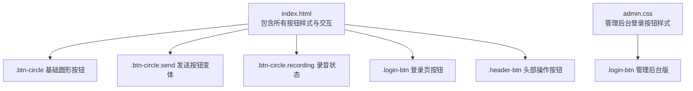
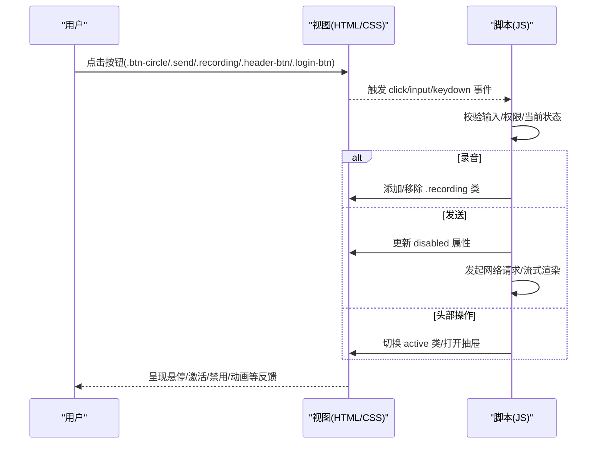
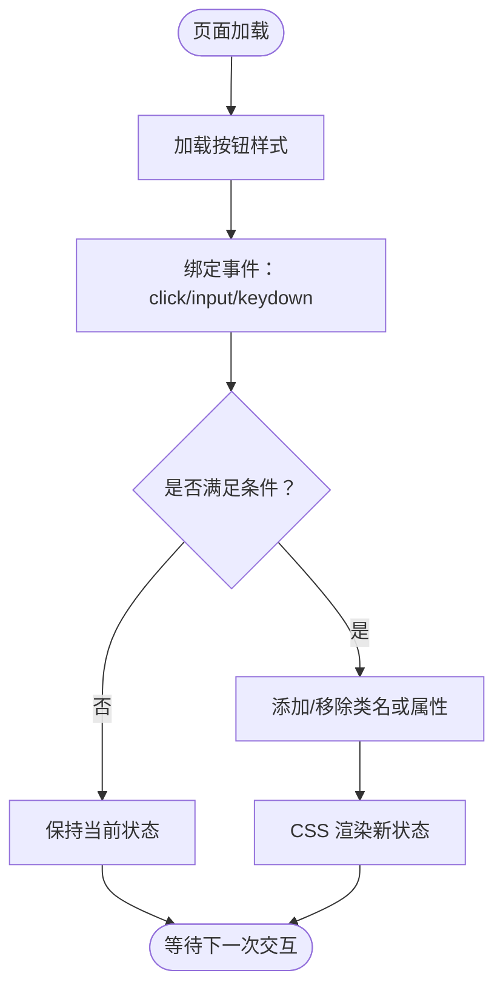

# 按钮组件

<cite>
**本文引用的文件**   
- [hushai/meditation/static/index.html](file://hushai/meditation/static/index.html)
- [hushai/meditation/admin/static/css/admin.css](file://hushai/meditation/admin/static/css/admin.css)
</cite>

## 目录
1. [简介](#简介)
2. [项目结构](#项目结构)
3. [核心组件](#核心组件)
4. [架构总览](#架构总览)
5. [详细组件分析](#详细组件分析)
6. [依赖关系分析](#依赖关系分析)
7. [性能与可访问性](#性能与可访问性)
8. [故障排查指南](#故障排查指南)
9. [结论](#结论)

## 简介
本文件聚焦 hush.ai 前端界面中的按钮组件，系统性梳理以下样式类及其交互行为：
- 圆形按钮 .btn-circle（普通、悬停、激活、禁用）
- 发送按钮 .send（作为 .btn-circle 的变体）
- 录音按钮 .recording（呼吸动画与颜色变化）
- 登录页按钮 .login-btn（渐变背景与悬停效果）
- 头部操作按钮 .header-btn（状态切换与激活反馈）

文档同时给出对应的 CSS 样式定义位置、交互逻辑与 JavaScript 事件处理要点，帮助开发者快速定位并扩展这些按钮。

## 项目结构
按钮相关样式与脚本集中在冥想主页面中，管理后台的登录按钮样式位于独立 CSS 文件中。

图表来源
- [hushai/meditation/static/index.html:197-214](file://hushai/meditation/static/index.html#L197-L214)
- [hushai/meditation/static/index.html:267-275](file://hushai/meditation/static/index.html#L267-L275)
- [hushai/meditation/static/index.html:525-539](file://hushai/meditation/static/index.html#L525-L539)
- [hushai/meditation/admin/static/css/admin.css:322-343](file://hushai/meditation/admin/static/css/admin.css#L322-L343)

章节来源
- [hushai/meditation/static/index.html:197-214](file://hushai/meditation/static/index.html#L197-L214)
- [hushai/meditation/static/index.html:267-275](file://hushai/meditation/static/index.html#L267-L275)
- [hushai/meditation/static/index.html:525-539](file://hushai/meditation/static/index.html#L525-L539)
- [hushai/meditation/admin/static/css/admin.css:322-343](file://hushai/meditation/admin/static/css/admin.css#L322-L343)

## 核心组件
本节概述各按钮的核心样式与交互要点，具体实现细节见后文“详细组件分析”。

- 圆形按钮 .btn-circle
  - 外观：圆形容器、居中图标、默认边框与中性色文字
  - 交互：悬停加深边框与文字；按下缩放；禁用态降低透明度并禁止指针
  - 适用：设置、语音输入等辅助操作

- 发送按钮 .send（.btn-circle.send）
  - 外观：实心主色填充、反色文字、主色边框
  - 交互：悬停加深主色；由 JS 控制 disabled 以反映输入有效性

- 录音按钮 .recording（.btn-circle.recording）
  - 外观：强调色边框与文字、浅色强调背景
  - 动画：呼吸式闪烁（基于关键帧）
  - 状态：JS 在开始/结束录音时添加/移除 recording 类

- 登录页按钮 .login-btn
  - 外观：深色填充、反色文字、伪元素覆盖层
  - 交互：悬停覆盖层滑入、轻微上移；按下回退；禁用态隐藏覆盖层并显示等待光标

- 头部操作按钮 .header-btn
  - 外观：透明背景、细边框、中性文字
  - 交互：悬停加深边框与文字；active 态反转配色（深色背景+浅色文字）
  - 典型用法：进度、呼吸、历史、新对话等头部功能开关

章节来源
- [hushai/meditation/static/index.html:525-539](file://hushai/meditation/static/index.html#L525-L539)
- [hushai/meditation/static/index.html:197-214](file://hushai/meditation/static/index.html#L197-L214)
- [hushai/meditation/static/index.html:267-275](file://hushai/meditation/static/index.html#L267-L275)

## 架构总览
下图展示按钮组件在页面中的角色与交互链路：用户点击触发 JS 事件，JS 通过 DOM API 切换类名或属性，CSS 根据类名与伪类呈现不同视觉状态。

图表来源
- [hushai/meditation/static/index.html:1566-1570](file://hushai/meditation/static/index.html#L1566-L1570)
- [hushai/meditation/static/index.html:1653-1659](file://hushai/meditation/static/index.html#L1653-L1659)
- [hushai/meditation/static/index.html:1796-1797](file://hushai/meditation/static/index.html#L1796-L1797)
- [hushai/meditation/static/index.html:1962-1970](file://hushai/meditation/static/index.html#L1962-L1970)

## 详细组件分析

### 圆形按钮 .btn-circle
- 样式要点
  - 尺寸与布局：固定宽高、圆形圆角、Flex 居中
  - 过渡：统一缓动曲线，保证交互顺滑
  - 状态：
    - 悬停：边框与文字加深
    - 激活：按下缩放
    - 禁用：透明度降低、禁用指针
- 交互要点
  - 通常用于设置、语音输入等辅助操作
  - 无障碍：提供 aria-label/title 提示

参考路径
- [hushai/meditation/static/index.html:525-539](file://hushai/meditation/static/index.html#L525-L539)

章节来源
- [hushai/meditation/static/index.html:525-539](file://hushai/meditation/static/index.html#L525-L539)

### 发送按钮 .send（.btn-circle.send）
- 样式要点
  - 继承 .btn-circle 基础样式
  - 覆盖为实心主色背景、反色文字、主色边框
  - 悬停加深主色
- 交互要点
  - 由输入框内容长度与发送中标志控制 disabled
  - 点击后进入发送流程，期间保持禁用直至完成

参考路径
- [hushai/meditation/static/index.html:538-539](file://hushai/meditation/static/index.html#L538-L539)
- [hushai/meditation/static/index.html:1566-1570](file://hushai/meditation/static/index.html#L1566-L1570)
- [hushai/meditation/static/index.html:1796-1797](file://hushai/meditation/static/index.html#L1796-L1797)

章节来源
- [hushai/meditation/static/index.html:538-539](file://hushai/meditation/static/index.html#L538-L539)
- [hushai/meditation/static/index.html:1566-1570](file://hushai/meditation/static/index.html#L1566-L1570)
- [hushai/meditation/static/index.html:1796-1797](file://hushai/meditation/static/index.html#L1796-L1797)

### 录音按钮 .recording（.btn-circle.recording）
- 样式要点
  - 强调色边框与文字、浅色强调背景
  - 呼吸动画：使用关键帧循环产生明暗交替
- 交互要点
  - 点击切换录音状态：添加/移除 .recording 类
  - 配合顶部语音条 voice-bar.show 提示“正在聆听…”
  - 录音结束时若存在文本则自动发送

参考路径
- [hushai/meditation/static/index.html:534-537](file://hushai/meditation/static/index.html#L534-L537)
- [hushai/meditation/static/index.html:1653-1659](file://hushai/meditation/static/index.html#L1653-L1659)
- [hushai/meditation/static/index.html:1649-1651](file://hushai/meditation/static/index.html#L1649-L1651)

章节来源
- [hushai/meditation/static/index.html:534-537](file://hushai/meditation/static/index.html#L534-L537)
- [hushai/meditation/static/index.html:1653-1659](file://hushai/meditation/static/index.html#L1653-L1659)
- [hushai/meditation/static/index.html:1649-1651](file://hushai/meditation/static/index.html#L1649-L1651)

### 登录页按钮 .login-btn
- 样式要点
  - 全宽按钮，深色背景、反色文字
  - 伪元素 ::before 作为覆盖层，悬停时从左侧滑入
  - 悬停整体轻微上移，按下回退
  - 禁用态隐藏覆盖层、显示等待光标
- 交互要点
  - 点击触发登录流程，成功后淡出遮罩并加载后续模块

参考路径
- [hushai/meditation/static/index.html:197-214](file://hushai/meditation/static/index.html#L197-L214)
- [hushai/meditation/static/index.html:1586-1608](file://hushai/meditation/static/index.html#L1586-L1608)

章节来源
- [hushai/meditation/static/index.html:197-214](file://hushai/meditation/static/index.html#L197-L214)
- [hushai/meditation/static/index.html:1586-1608](file://hushai/meditation/static/index.html#L1586-L1608)

### 头部操作按钮 .header-btn
- 样式要点
  - 透明背景、细边框、小字号
  - 悬停加深边框与文字
  - active 态反转配色（深色背景+浅色文字）
- 交互要点
  - 用于切换功能面板（如进度、呼吸、历史、新对话）
  - 点击后可能打开侧边抽屉或切换模式

参考路径
- [hushai/meditation/static/index.html:267-275](file://hushai/meditation/static/index.html#L267-L275)
- [hushai/meditation/static/index.html:1962-1970](file://hushai/meditation/static/index.html#L1962-L1970)

章节来源
- [hushai/meditation/static/index.html:267-275](file://hushai/meditation/static/index.html#L267-L275)
- [hushai/meditation/static/index.html:1962-1970](file://hushai/meditation/static/index.html#L1962-L1970)

### 管理后台登录按钮 .login-btn（admin.css）
- 样式要点
  - 渐变背景（深绿到主色）、阴影
  - 悬停加深渐变并提升亮度
- 交互要点
  - 常规表单提交按钮，无特殊动画

参考路径
- [hushai/meditation/admin/static/css/admin.css:322-343](file://hushai/meditation/admin/static/css/admin.css#L322-L343)

章节来源
- [hushai/meditation/admin/static/css/admin.css:322-343](file://hushai/meditation/admin/static/css/admin.css#L322-L343)

## 依赖关系分析
- 样式依赖
  - 全局变量与缓动函数：颜色、字体、缓动曲线在根级定义，按钮样式引用
  - 关键帧动画：呼吸与消息出现动画被按钮复用
- 脚本依赖
  - 输入监听：根据输入内容启用/禁用发送按钮
  - 语音识别：录音按钮状态切换与自动发送
  - 头部按钮：打开/关闭抽屉与切换 active 类

图表来源
- [hushai/meditation/static/index.html:1566-1570](file://hushai/meditation/static/index.html#L1566-L1570)
- [hushai/meditation/static/index.html:1653-1659](file://hushai/meditation/static/index.html#L1653-L1659)
- [hushai/meditation/static/index.html:1796-1797](file://hushai/meditation/static/index.html#L1796-L1797)

章节来源
- [hushai/meditation/static/index.html:1566-1570](file://hushai/meditation/static/index.html#L1566-L1570)
- [hushai/meditation/static/index.html:1653-1659](file://hushai/meditation/static/index.html#L1653-L1659)
- [hushai/meditation/static/index.html:1796-1797](file://hushai/meditation/static/index.html#L1796-L1797)

## 性能与可访问性
- 性能
  - 大量使用 CSS 过渡与关键帧动画，避免在 JS 中频繁计算样式
  - 减少重排：仅通过 classList 切换类名，不直接修改内联样式
- 可访问性
  - 焦点可见：为按钮提供 :focus-visible 轮廓
  - 语义化：为按钮提供 aria-label/title，便于屏幕阅读器理解
  - 键盘支持：Enter 键触发发送，符合常见交互预期

参考路径
- [hushai/meditation/static/index.html:736-739](file://hushai/meditation/static/index.html#L736-L739)
- [hushai/meditation/static/index.html:1796-1797](file://hushai/meditation/static/index.html#L1796-L1797)

章节来源
- [hushai/meditation/static/index.html:736-739](file://hushai/meditation/static/index.html#L736-L739)
- [hushai/meditation/static/index.html:1796-1797](file://hushai/meditation/static/index.html#L1796-L1797)

## 故障排查指南
- 发送按钮不可用
  - 检查输入是否为空或处于发送中状态
  - 确认 input 的 input 事件是否正确更新 sendBtn.disabled
- 录音按钮无动画
  - 确认 .recording 类是否成功添加到按钮
  - 检查浏览器是否支持 SpeechRecognition 以及权限
- 头部按钮未切换 active
  - 确认点击事件是否绑定且正确切换 active 类
- 登录按钮悬停异常
  - 检查 ::before 伪元素是否存在且未被其他样式覆盖

参考路径
- [hushai/meditation/static/index.html:1566-1570](file://hushai/meditation/static/index.html#L1566-L1570)
- [hushai/meditation/static/index.html:1653-1659](file://hushai/meditation/static/index.html#L1653-L1659)
- [hushai/meditation/static/index.html:1962-1970](file://hushai/meditation/static/index.html#L1962-L1970)
- [hushai/meditation/static/index.html:197-214](file://hushai/meditation/static/index.html#L197-L214)

章节来源
- [hushai/meditation/static/index.html:1566-1570](file://hushai/meditation/static/index.html#L1566-L1570)
- [hushai/meditation/static/index.html:1653-1659](file://hushai/meditation/static/index.html#L1653-L1659)
- [hushai/meditation/static/index.html:1962-1970](file://hushai/meditation/static/index.html#L1962-L1970)
- [hushai/meditation/static/index.html:197-214](file://hushai/meditation/static/index.html#L197-L214)

## 结论
本组件体系围绕统一的视觉语言与简洁的状态切换展开：
- 通过少量类名与伪类即可表达丰富的交互状态
- 将动画与过渡交由 CSS 处理，JS 负责状态判断与类名切换
- 兼顾可访问性与用户体验，确保键盘与屏幕阅读器友好

建议后续扩展时遵循现有命名约定与状态模型，保持样式与行为的清晰分离。