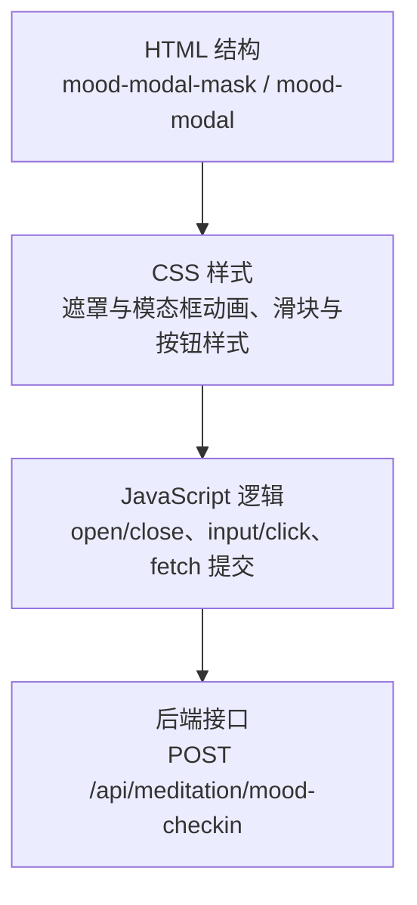
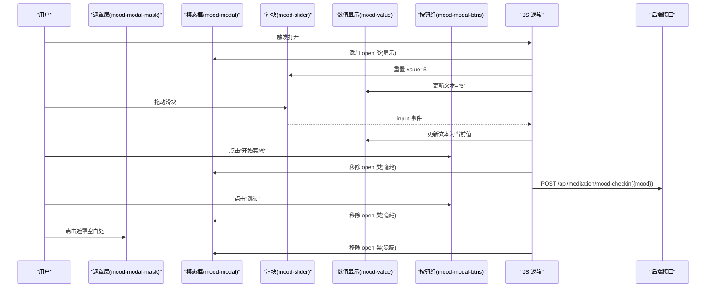
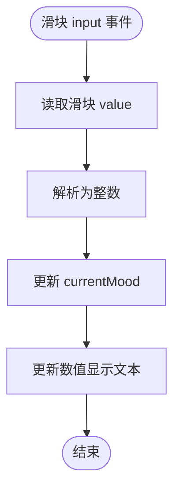
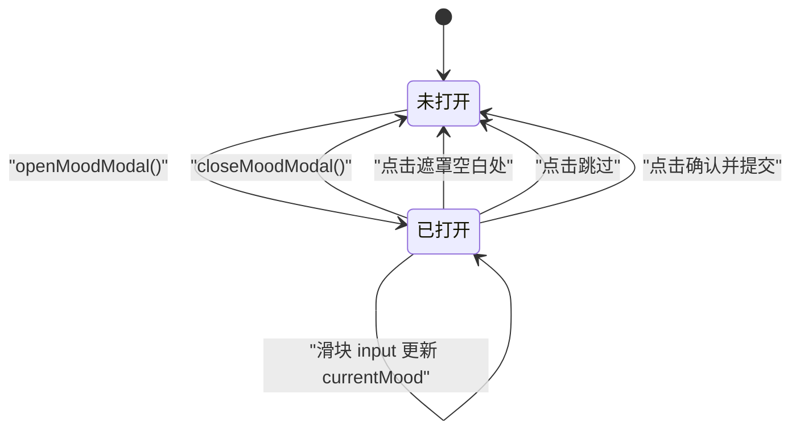
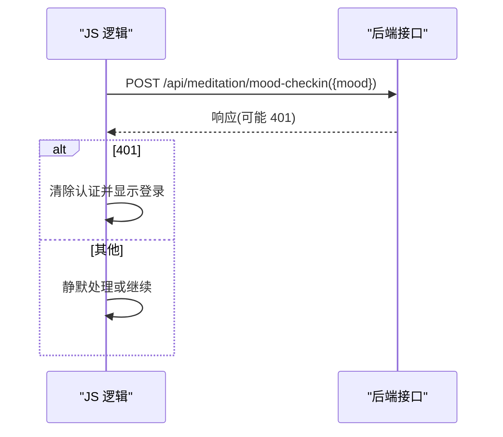
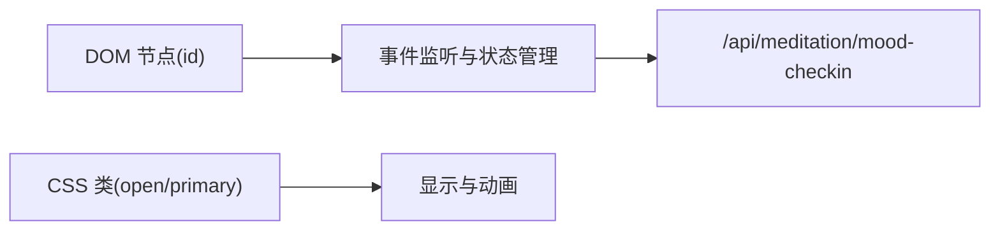

# 模态框组件

<cite>
**本文引用的文件**   
- [hushai/meditation/static/index.html](file://hushai/meditation/static/index.html)
</cite>

## 目录
1. [简介](#简介)
2. [项目结构](#项目结构)
3. [核心组件](#核心组件)
4. [架构总览](#架构总览)
5. [详细组件分析](#详细组件分析)
6. [依赖分析](#依赖分析)
7. [性能考虑](#性能考虑)
8. [故障排查指南](#故障排查指南)
9. [结论](#结论)

## 简介
本文件为 hush.ai 前端“情绪评分模态框”（mood modal）的完整技术文档。该组件用于在用户开始冥想前快速采集当前情绪值，并提供遮罩层、缩放动画、滑块交互与确认/跳过按钮等能力。文档覆盖以下要点：
- 遮罩层 .mood-modal-mask 的显示逻辑与层级控制
- 模态框 .mood-modal 的缩放动画与过渡效果
- 情绪滑块 .mood-slider 的交互行为、数值显示与范围控制
- 确认/取消按钮 .mood-modal-btns 的事件处理与样式状态
- 打开/关闭动画的实现细节（transform 变换与透明度过渡）
- JavaScript 事件监听器与状态管理的关键流程

## 项目结构
情绪模态框相关代码集中在单一页面文件中，包含 HTML 结构、CSS 样式与内联 JavaScript 逻辑。关键位置如下：
- HTML 结构：模态框容器、标题、说明文本、滑块区域、数值显示、按钮组
- CSS 样式：遮罩层、模态框定位与缩放、滑块样式、按钮样式与过渡
- JavaScript：打开/关闭函数、滑块 input 事件、按钮 click 事件、遮罩点击关闭、提交到后端接口

图表来源
- [hushai/meditation/static/index.html:1091-1108](file://hushai/meditation/static/index.html#L1091-L1108)
- [hushai/meditation/static/index.html:761-800](file://hushai/meditation/static/index.html#L761-L800)
- [hushai/meditation/static/index.html:1893-1936](file://hushai/meditation/static/index.html#L1893-L1936)

章节来源
- [hushai/meditation/static/index.html:1091-1108](file://hushai/meditation/static/index.html#L1091-L1108)
- [hushai/meditation/static/index.html:761-800](file://hushai/meditation/static/index.html#L761-L800)
- [hushai/meditation/static/index.html:1893-1936](file://hushai/meditation/static/index.html#L1893-L1936)

## 核心组件
- 遮罩层 .mood-modal-mask
  - 固定定位覆盖全屏，默认不可交互且透明；添加 open 类后变为可见并可接收点击事件，用于点击外部关闭。
- 模态框 .mood-modal
  - 使用 transform 居中并初始 scale(.95)，通过 transition 实现平滑缩放至 scale(1)。
- 情绪滑块 .mood-slider
  - 原生 range 输入，范围 1~10，拖动时实时更新数值显示。
- 数值显示 .mood-value
  - 展示当前滑块值，字体采用等宽风格，便于对齐与阅读。
- 按钮组 .mood-modal-btns
  - 包含“跳过”和“开始冥想”两个按钮，后者为主按钮样式，hover 有颜色变化。

章节来源
- [hushai/meditation/static/index.html:761-800](file://hushai/meditation/static/index.html#L761-L800)
- [hushai/meditation/static/index.html:1091-1108](file://hushai/meditation/static/index.html#L1091-L1108)

## 架构总览
情绪模态框的前端交互流程如下：
- 触发打开：调用 openMoodModal()，设置遮罩层 open 类、重置滑块与数值显示
- 用户交互：拖动滑块更新 currentMood 与数值显示
- 用户确认：点击“开始冥想”，关闭模态框并调用 doMoodCheckin(currentMood) 提交数据
- 用户跳过：点击“跳过”，仅关闭模态框
- 遮罩点击：点击遮罩层空白处关闭模态框

图表来源
- [hushai/meditation/static/index.html:1893-1936](file://hushai/meditation/static/index.html#L1893-L1936)
- [hushai/meditation/static/index.html:1091-1108](file://hushai/meditation/static/index.html#L1091-L1108)

## 详细组件分析

### 遮罩层 .mood-modal-mask 显示逻辑
- 默认状态：opacity:0，pointer-events:none，不阻挡页面交互
- 激活状态：添加 open 类后 opacity:1，pointer-events:auto，允许点击
- 点击遮罩空白处：事件冒泡判断 e.target === mask，执行 closeMoodModal()

章节来源
- [hushai/meditation/static/index.html:761-766](file://hushai/meditation/static/index.html#L761-L766)
- [hushai/meditation/static/index.html:1924-1926](file://hushai/meditation/static/index.html#L1924-L1926)

### 模态框 .mood-modal 缩放动画
- 初始 transform: translate(-50%,-50%) scale(.95)
- 打开时：父级 .mood-modal-mask.open 下子元素 .mood-modal 的 transform 变为 scale(1)
- 过渡：transition: transform .35s var(--ease-out-expo)，提供缓动曲线

章节来源
- [hushai/meditation/static/index.html:767-775](file://hushai/meditation/static/index.html#L767-L775)

### 情绪滑块 .mood-slider 交互行为
- 范围：min=1, max=10, 默认 value=5
- 交互：input 事件实时读取 value，转换为整数并写入 currentMood 与数值显示
- 视觉：自定义 thumb 尺寸与阴影，提升可触达性

图表来源
- [hushai/meditation/static/index.html:1907-1912](file://hushai/meditation/static/index.html#L1907-L1912)
- [hushai/meditation/static/index.html:1096-1101](file://hushai/meditation/static/index.html#L1096-L1101)

章节来源
- [hushai/meditation/static/index.html:781-795](file://hushai/meditation/static/index.html#L781-L795)
- [hushai/meditation/static/index.html:1907-1912](file://hushai/meditation/static/index.html#L1907-L1912)

### 确认/取消按钮 .mood-modal-btns 事件处理与样式
- “跳过”按钮：click 事件仅关闭模态框
- “开始冥想”按钮：click 事件先关闭模态框，再调用 doMoodCheckin(currentMood) 提交
- 样式：主按钮具有 primary 类，hover 时背景色加深

章节来源
- [hushai/meditation/static/index.html:796-800](file://hushai/meditation/static/index.html#L796-L800)
- [hushai/meditation/static/index.html:1913-1923](file://hushai/meditation/static/index.html#L1913-L1923)

### 打开/关闭动画与状态管理
- 打开：openMoodModal() 向遮罩层添加 open 类，并将滑块与数值重置为默认值
- 关闭：closeMoodModal() 从遮罩层移除 open 类
- 状态：currentMood 保存当前选择的情绪值，供提交时使用

图表来源
- [hushai/meditation/static/index.html:1898-1906](file://hushai/meditation/static/index.html#L1898-L1906)
- [hushai/meditation/static/index.html:1924-1926](file://hushai/meditation/static/index.html#L1924-L1926)

章节来源
- [hushai/meditation/static/index.html:1893-1906](file://hushai/meditation/static/index.html#L1893-L1906)

### 数据提交流程
- 入口：doMoodCheckin(mood)
- 请求：POST /api/meditation/mood-checkin，携带 JSON {mood}
- 鉴权：请求头包含 Authorization: Bearer <token>
- 错误处理：若返回 401，则清除认证信息并跳转登录

图表来源
- [hushai/meditation/static/index.html:1928-1936](file://hushai/meditation/static/index.html#L1928-L1936)

章节来源
- [hushai/meditation/static/index.html:1928-1936](file://hushai/meditation/static/index.html#L1928-L1936)

## 依赖分析
- DOM 引用
  - moodModalMask、moodSlider、moodValue、moodConfirmBtn、moodSkipBtn 通过 id 获取
- CSS 依赖
  - 遮罩与模态框的 open 类驱动显示与动画
  - 滑块与按钮的样式由对应 class 定义
- 网络依赖
  - 使用 fetch 发起请求，依赖 token 与 API 变量

图表来源
- [hushai/meditation/static/index.html:1091-1108](file://hushai/meditation/static/index.html#L1091-L1108)
- [hushai/meditation/static/index.html:1893-1936](file://hushai/meditation/static/index.html#L1893-L1936)

章节来源
- [hushai/meditation/static/index.html:1091-1108](file://hushai/meditation/static/index.html#L1091-L1108)
- [hushai/meditation/static/index.html:1893-1936](file://hushai/meditation/static/index.html#L1893-L1936)

## 性能考虑
- 动画性能
  - 使用 transform 与 opacity 进行动画，避免布局重排，提升流畅度
- 事件频率
  - 滑块使用 input 事件，频繁触发但仅更新文本内容，开销较小
- 网络请求
  - 仅在用户确认后发起一次请求，避免重复提交

[本节为通用指导，无需具体文件引用]

## 故障排查指南
- 遮罩无法点击
  - 检查遮罩层是否添加了 open 类，确保 pointer-events 不为 none
- 滑块数值不更新
  - 确认 input 事件绑定成功，且数值显示元素存在
- 确认按钮无响应
  - 检查按钮 click 事件绑定与 doMoodCheckin 调用链路
- 401 未授权
  - 检查 token 是否存在且有效，必要时重新登录

章节来源
- [hushai/meditation/static/index.html:1928-1936](file://hushai/meditation/static/index.html#L1928-L1936)

## 结论
情绪评分模态框以简洁的 HTML/CSS/JS 组合实现了完整的交互闭环：遮罩层控制显隐、模态框缩放动画提升体验、滑块实时反馈数值、按钮完成提交或跳过。整体实现清晰、耦合度低，易于维护与扩展。