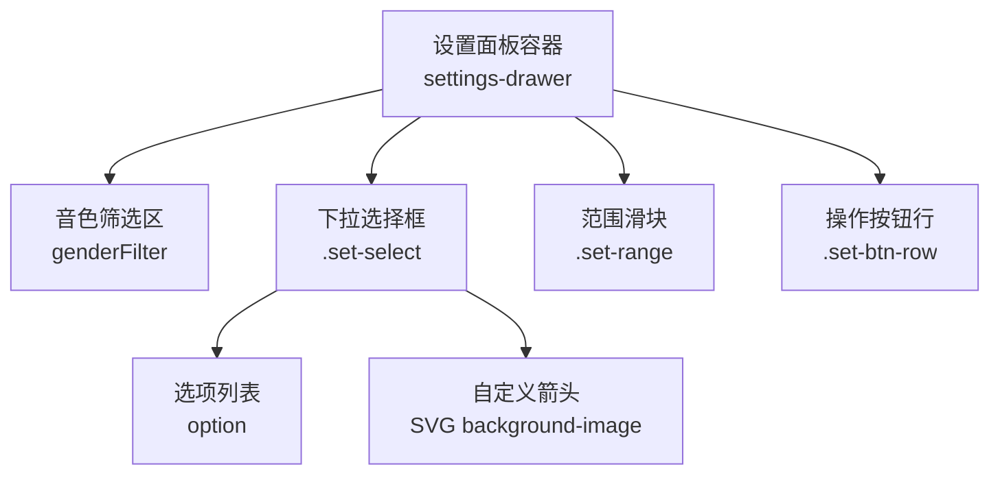
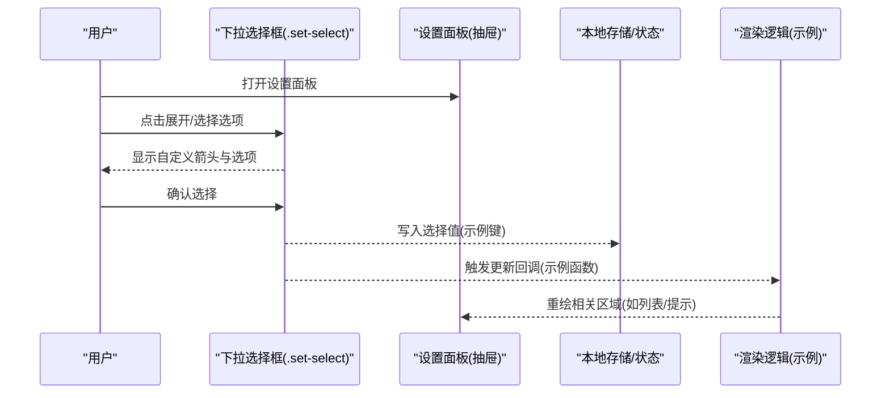
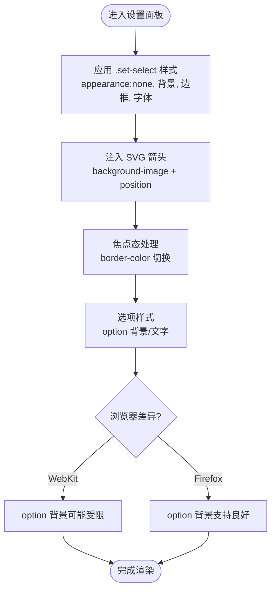
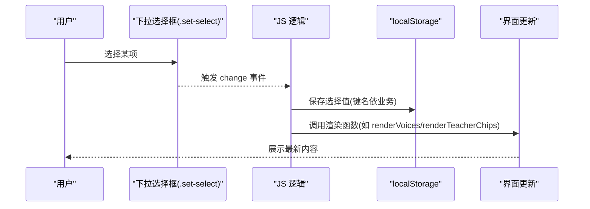
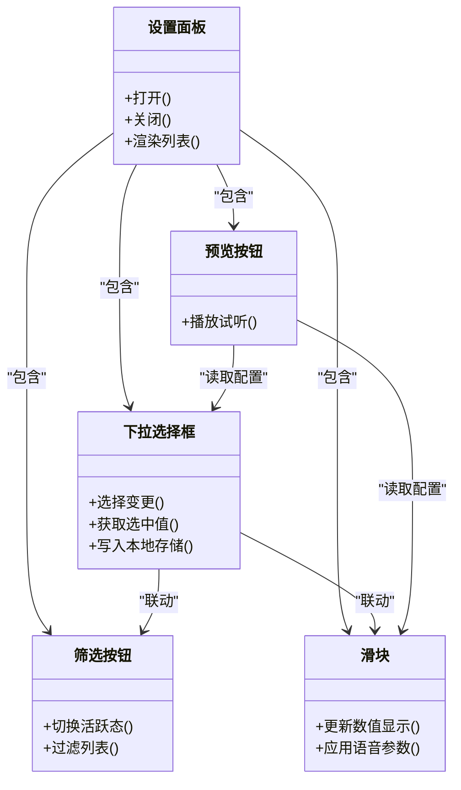
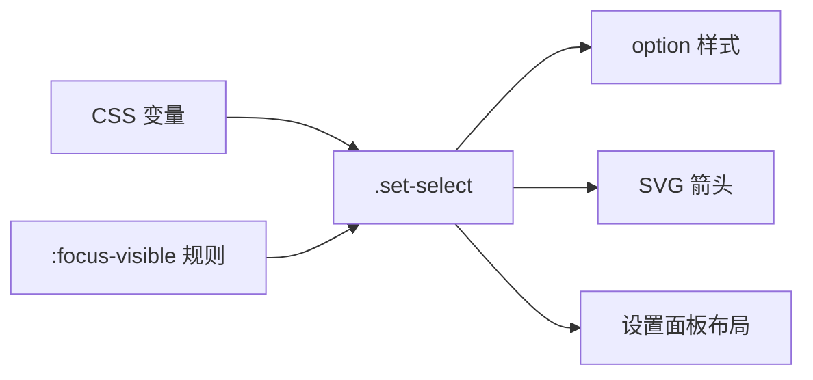

# 下拉选择框组件

<cite>
**本文引用的文件**   
- [index.html](file://hushai/meditation/static/index.html)
- [admin.css](file://hushai/meditation/admin/static/css/admin.css)
- [settings.html](file://hushai/meditation/admin/templates/settings.html)
</cite>

## 目录
1. [简介](#简介)
2. [项目结构](#项目结构)
3. [核心组件](#核心组件)
4. [架构总览](#架构总览)
5. [详细组件分析](#详细组件分析)
6. [依赖关系分析](#依赖关系分析)
7. [性能考量](#性能考量)
8. [故障排查指南](#故障排查指南)
9. [结论](#结论)
10. [附录](#附录)

## 简介
本文件聚焦 hush.ai 前端设置面板中的下拉选择框组件（类名 .set-select），系统性说明其自定义样式实现、浏览器兼容性处理、动态选项加载与值绑定、事件处理以及与设置面板其他控件的协作方式。该组件通过移除原生外观并嵌入 SVG 箭头，统一了跨浏览器的视觉表现；同时提供焦点状态与选项背景色的定制能力，确保在 WebKit 与 Firefox 下的一致性体验。

## 项目结构
- 样式定义位于主页面内嵌样式中，包含 .set-select 及其相关交互态样式。
- 设置面板 UI 由同一页面的抽屉式布局承载，下拉选择框与其他控件（筛选按钮、滑块等）共同组织在设置区域。
- 管理后台模板中也存在 select 元素，但使用不同的样式体系（form-control），用于区分“用户侧设置”和“管理员后台”。

图表来源
- [index.html:550-583](file://hushai/meditation/static/index.html#L550-L583)
- [index.html:584-595](file://hushai/meditation/static/index.html#L584-L595)
- [index.html:597-616](file://hushai/meditation/static/index.html#L597-L616)
- [index.html:618-627](file://hushai/meditation/static/index.html#L618-L627)

章节来源
- [index.html:550-583](file://hushai/meditation/static/index.html#L550-L583)
- [index.html:584-595](file://hushai/meditation/static/index.html#L584-L595)
- [index.html:597-616](file://hushai/meditation/static/index.html#L597-L616)
- [index.html:618-627](file://hushai/meditation/static/index.html#L618-L627)

## 核心组件
- 组件标识：.set-select（select 元素的自定义样式类）
- 主要职责：
  - 统一外观：移除浏览器默认外观，应用主题色板变量
  - 自定义箭头：通过内联 SVG data URI 作为背景图
  - 选项定制：为 option 子项设置背景与文字颜色
  - 焦点反馈：focus 状态下边框高亮
  - 可访问性：配合 :focus-visible 全局规则提升键盘导航可见性

关键样式要点
- 移除原生外观：appearance:none
- 背景与边框：使用 CSS 变量 --paper-warm、--stone-200、--ink
- 字体与尺寸：font-family: var(--font-body)，字号 13px，内边距 12px 14px
- 箭头图标：data:image/svg+xml 编码的三角形路径，填充色 #a8a39a，定位 right 12px center
- 过渡动画：border-color 0.3s 平滑变化
- 选项样式：option 背景 --paper，文字 --ink
- 焦点态：border-color 切换为 --ink

章节来源
- [index.html:584-595](file://hushai/meditation/static/index.html#L584-L595)
- [index.html:736-739](file://hushai/meditation/static/index.html#L736-L739)

## 架构总览
从组件到页面的交互流程如下：用户在设置面板打开后，通过 .set-select 进行选项选择；选择结果影响后续逻辑（如刷新列表或联动其他控件）。虽然当前文件中未直接出现 .set-select 的 HTML 实例，但其样式与行为模式已在项目中明确定义并可复用。

图表来源
- [index.html:550-583](file://hushai/meditation/static/index.html#L550-L583)
- [index.html:584-595](file://hushai/meditation/static/index.html#L584-L595)

## 详细组件分析

### 样式实现与浏览器兼容
- appearance 属性
  - 使用 appearance:none 移除系统默认下拉外观，保证一致的视觉风格。
- 自定义箭头
  - 通过 background-image 内嵌 SVG，避免外部资源请求，提升加载稳定性。
  - 使用 background-position: right 12px center 将箭头置于右侧居中位置。
- 选项背景与文字
  - 针对 option 设置背景与文字颜色，适配深色/浅色主题变量。
- 焦点状态
  - focus 时边框颜色切换为主题强调色，配合 :focus-visible 全局规则增强键盘可达性。
- 浏览器差异
  - WebKit（Chrome/Safari）：对 select 的 option 支持有限，通常仅能控制文本颜色；背景色在某些平台可能不生效。
  - Firefox：对 option 的背景色支持较好，可通过 CSS 变量统一主题。
  - 建议：若需强一致背景色，可在需要时以自定义下拉替代原生 select（本项目当前采用原生 select + CSS 定制）。

图表来源
- [index.html:584-595](file://hushai/meditation/static/index.html#L584-L595)
- [index.html:736-739](file://hushai/meditation/static/index.html#L736-L739)

章节来源
- [index.html:584-595](file://hushai/meditation/static/index.html#L584-L595)
- [index.html:736-739](file://hushai/meditation/static/index.html#L736-L739)

### 动态选项加载、值绑定与事件处理
- 动态选项加载
  - 常见做法：根据后端数据或用户选择，动态创建 <option> 节点并插入 select。
  - 示例参考：项目中教师选择逻辑展示了基于 ID 查找与状态更新的模式，可作为下拉选项绑定的参考范式。
- 值绑定
  - 将选择结果持久化至 localStorage（例如保存 teacher_id、性别过滤等），以便页面刷新后恢复。
- 事件处理
  - 监听 change 事件，读取选中值并触发相应 UI 更新（如渲染音色列表、更新提示文案）。
  - 结合全局 :focus-visible 规则，确保键盘操作时的可见焦点环。

图表来源
- [index.html:1410-1438](file://hushai/meditation/static/index.html#L1410-L1438)

章节来源
- [index.html:1410-1438](file://hushai/meditation/static/index.html#L1410-L1438)

### 与设置面板其他控件的协调
- 与筛选按钮（性别/语言）协同
  - 当选择教师或场景时，可能自动同步性别过滤器状态，并刷新可用音色列表。
- 与滑块（语速/音调）协同
  - 下拉选择的结果可与滑块预设值联动，形成组合配置。
- 与预览/重置按钮协同
  - 试听按钮读取当前下拉与滑块配置进行播放；重置按钮恢复默认值并清空本地缓存。

图表来源
- [index.html:550-583](file://hushai/meditation/static/index.html#L550-L583)
- [index.html:584-595](file://hushai/meditation/static/index.html#L584-L595)
- [index.html:597-616](file://hushai/meditation/static/index.html#L597-L616)
- [index.html:618-627](file://hushai/meditation/static/index.html#L618-L627)
- [index.html:1410-1438](file://hushai/meditation/static/index.html#L1410-L1438)

章节来源
- [index.html:550-583](file://hushai/meditation/static/index.html#L550-L583)
- [index.html:584-595](file://hushai/meditation/static/index.html#L584-L595)
- [index.html:597-616](file://hushai/meditation/static/index.html#L597-L616)
- [index.html:618-627](file://hushai/meditation/static/index.html#L618-L627)
- [index.html:1410-1438](file://hushai/meditation/static/index.html#L1410-L1438)

## 依赖关系分析
- 样式依赖
  - CSS 变量：--paper-warm、--stone-200、--ink、--paper、--font-body 等
  - 全局可访问性规则：:focus-visible 统一焦点环
- 组件耦合
  - 与筛选按钮、滑块、预览按钮存在逻辑联动，但样式层解耦清晰
- 外部依赖
  - 无外部图标库依赖，箭头使用内联 SVG，减少网络开销

图表来源
- [index.html:584-595](file://hushai/meditation/static/index.html#L584-L595)
- [index.html:736-739](file://hushai/meditation/static/index.html#L736-L739)

章节来源
- [index.html:584-595](file://hushai/meditation/static/index.html#L584-L595)
- [index.html:736-739](file://hushai/meditation/static/index.html#L736-L739)

## 性能考量
- 内联 SVG 箭头避免了额外 HTTP 请求，利于首屏渲染。
- 使用 CSS 变量集中管理主题，减少重复样式计算。
- 选项数量较大时，建议分页或虚拟滚动（如需扩展为自定义下拉）。

## 故障排查指南
- 箭头不显示
  - 检查 background-image 是否被覆盖或 URL 编码是否正确。
  - 确认 background-repeat 与 background-position 未被其他样式覆盖。
- 选项背景色不一致
  - WebKit 平台可能对 option 背景支持有限，必要时改用自定义下拉组件。
- 焦点不可见
  - 确认 :focus-visible 规则未被覆盖，且 outline-offset 合理。
- 选择值未持久化
  - 检查 change 事件监听是否绑定成功，localStorage 写入是否被拦截。

章节来源
- [index.html:584-595](file://hushai/meditation/static/index.html#L584-L595)
- [index.html:736-739](file://hushai/meditation/static/index.html#L736-L739)

## 结论
.set-select 通过移除原生外观、嵌入 SVG 箭头与精细的焦点态处理，实现了跨浏览器一致的视觉效果与良好的可访问性。其与设置面板其他控件的联动体现了清晰的职责划分与松耦合设计。对于需要更强一致性的选项背景需求，可考虑进一步演进为完全自定义的下拉组件。

## 附录
- 管理后台 select 样式参考（不同样式体系）
  - 表单控件通用样式与聚焦效果，便于对比与迁移。

章节来源
- [admin.css:1243-1307](file://hushai/meditation/admin/static/css/admin.css#L1243-L1307)
- [admin.css:833-868](file://hushai/meditation/admin/static/css/admin.css#L833-L868)
- [settings.html:21-44](file://hushai/meditation/admin/templates/settings.html#L21-L44)
- [settings.html:55-55](file://hushai/meditation/admin/templates/settings.html#L55-L55)