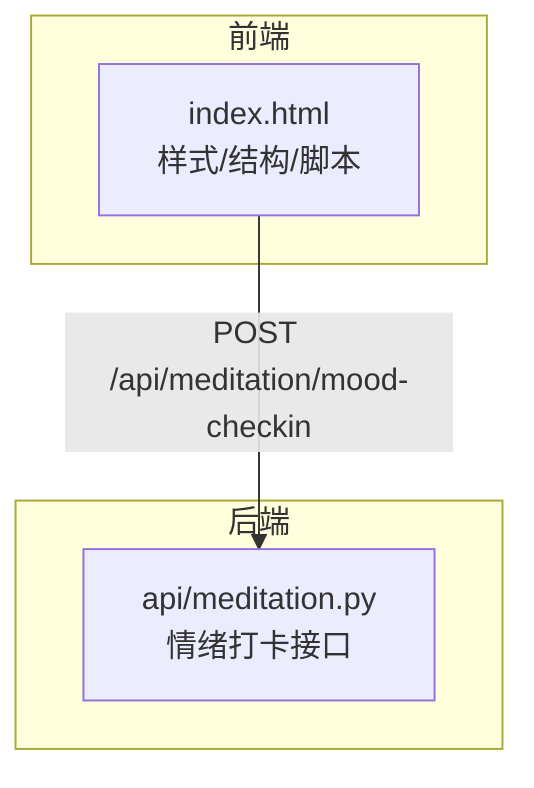
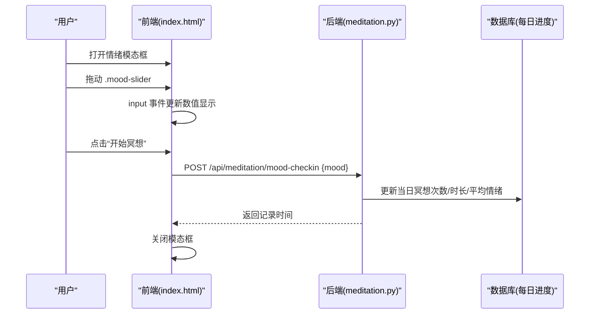
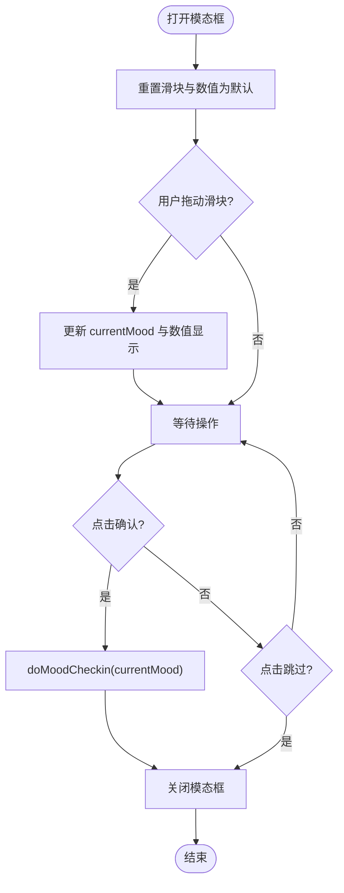
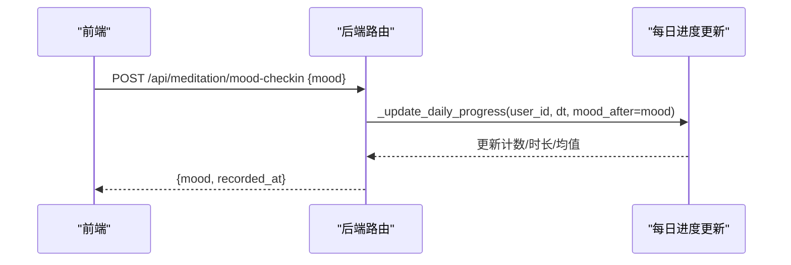
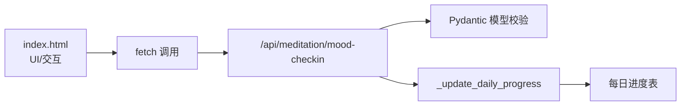

# 情绪滑块组件

<cite>
**本文引用的文件**   
- [hushai/meditation/static/index.html](file://hushai/meditation/static/index.html)
- [hushai/meditation/api/meditation.py](file://hushai/meditation/api/meditation.py)
</cite>

## 目录
1. [简介](#简介)
2. [项目结构](#项目结构)
3. [核心组件](#核心组件)
4. [架构总览](#架构总览)
5. [详细组件分析](#详细组件分析)
6. [依赖关系分析](#依赖关系分析)
7. [性能与可访问性](#性能与可访问性)
8. [故障排查指南](#故障排查指南)
9. [结论](#结论)
10. [附录：代码片段路径](#附录代码片段路径)

## 简介
本文件为 hush.ai 的“情绪滑块”组件提供完整技术文档，聚焦 .mood-slider 的实现细节、模态框交互逻辑、数值显示更新、情感化界面设计、无障碍支持、范围映射与情绪等级计算，以及与冥想功能的集成和数据同步机制。同时给出用户情绪数据收集、本地存储提示与可视化展示的实践指引（以源码位置标注为主）。

## 项目结构
情绪滑块位于前端单页应用的主页面中，包含样式、HTML 结构与脚本逻辑；后端通过 FastAPI 路由接收情绪打卡请求并更新每日进度统计。

图示来源
- [hushai/meditation/static/index.html:761-800](file://hushai/meditation/static/index.html#L761-L800)
- [hushai/meditation/api/meditation.py:177-186](file://hushai/meditation/api/meditation.py#L177-L186)

章节来源
- [hushai/meditation/static/index.html:761-800](file://hushai/meditation/static/index.html#L761-L800)
- [hushai/meditation/api/meditation.py:177-186](file://hushai/meditation/api/meditation.py#L177-L186)

## 核心组件
- 情绪滑块 UI：.mood-slider 原生 range 输入，配合大尺寸拖拽手柄与数值显示。
- 情绪模态框：居中遮罩弹窗，包含标题、说明文案、滑块、标签与确认/跳过按钮。
- 交互逻辑：打开/关闭模态框、input 事件驱动数值更新、点击确认提交到后端。
- 后端接口：/api/meditation/mood-checkin 接收情绪值，更新每日进度与平均情绪。
- 触发时机：登录后首次访问自动弹出；冥想计时结束后可再次提醒。

章节来源
- [hushai/meditation/static/index.html:1091-1108](file://hushai/meditation/static/index.html#L1091-L1108)
- [hushai/meditation/static/index.html:1893-1936](file://hushai/meditation/static/index.html#L1893-L1936)
- [hushai/meditation/api/meditation.py:177-186](file://hushai/meditation/api/meditation.py#L177-L186)

## 架构总览
情绪滑块的前端与后端协作流程如下：

图示来源
- [hushai/meditation/static/index.html:1893-1936](file://hushai/meditation/static/index.html#L1893-L1936)
- [hushai/meditation/api/meditation.py:177-186](file://hushai/meditation/api/meditation.py#L177-L186)
- [hushai/meditation/api/meditation.py:189-226](file://hushai/meditation/api/meditation.py#L189-L226)

## 详细组件分析

### 情绪滑块 .mood-slider 实现
- 外观与触控体验
  - 轨道宽度占容器 80%，高度 4px，圆角 2px，背景色使用中性石色。
  - 拖拽手柄为圆形，宽高 28px，深色填充，带白色描边与阴影，提升触控面积与视觉层次。
  - 底部三标签“低落/平静/愉悦”作为语义锚点，帮助理解区间含义。
- 数值显示更新
  - 监听 input 事件，将当前整数值写入大号等宽字体区域，便于快速感知变化。
- 情感化界面设计
  - 整体采用低饱和纸质感配色与衬线字体，强调安静、克制的氛围。
  - 模态框入场动画使用缓动曲线，避免突兀感。
- 无障碍访问支持
  - 使用原生 <input type="range">，天然具备键盘操作与屏幕阅读器支持。
  - 建议补充 aria-label 或 aria-describedby 指向数值与标签，增强可读性（当前未显式设置，可在 HTML 中补充）。
- 范围映射与情绪等级
  - 滑块 min=1, max=10，整数步进，直接作为情绪等级上报。
  - 后端按 1–10 校验，并在每日维度维护平均值。

章节来源
- [hushai/meditation/static/index.html:761-800](file://hushai/meditation/static/index.html#L761-L800)
- [hushai/meditation/static/index.html:1091-1108](file://hushai/meditation/static/index.html#L1091-L1108)
- [hushai/meditation/static/index.html:1893-1936](file://hushai/meditation/static/index.html#L1893-L1936)
- [hushai/meditation/api/meditation.py:68-74](file://hushai/meditation/api/meditation.py#L68-L74)

### 模态框交互逻辑
- 打开/关闭
  - 通过添加/移除 open 类控制遮罩与模态框显隐。
  - 点击遮罩层空白处可关闭。
- 初始化状态
  - 打开时重置 currentMood 为 5，并将滑块与数值显示归位。
- 确认与跳过
  - 确认：关闭模态框后调用 doMoodCheckin(currentMood)。
  - 跳过：仅关闭模态框，不提交数据。
- 触发时机
  - 登录后首次访问在延迟 3 秒后自动弹出，并通过 localStorage 标记当天已提示。
  - 冥想计时结束时可通过 showMoodReminder() 再次唤起。

图示来源
- [hushai/meditation/static/index.html:1893-1936](file://hushai/meditation/static/index.html#L1893-L1936)
- [hushai/meditation/static/index.html:2096-2107](file://hushai/meditation/static/index.html#L2096-L2107)

章节来源
- [hushai/meditation/static/index.html:1893-1936](file://hushai/meditation/static/index.html#L1893-L1936)
- [hushai/meditation/static/index.html:2096-2107](file://hushai/meditation/static/index.html#L2096-L2107)

### 情绪数据收集与后端处理
- 前端提交
  - 使用 fetch 发送 POST 请求至 /api/meditation/mood-checkin，携带 Authorization 头与 JSON body {mood}。
  - 若返回 401，则清理认证信息并跳转登录。
- 后端处理
  - 校验 mood 范围 1–10。
  - 调用 _update_daily_progress 更新当日冥想次数、总时长与平均情绪。
  - 返回记录时间。

图示来源
- [hushai/meditation/static/index.html:1928-1936](file://hushai/meditation/static/index.html#L1928-L1936)
- [hushai/meditation/api/meditation.py:177-186](file://hushai/meditation/api/meditation.py#L177-L186)
- [hushai/meditation/api/meditation.py:189-226](file://hushai/meditation/api/meditation.py#L189-L226)

章节来源
- [hushai/meditation/static/index.html:1928-1936](file://hushai/meditation/static/index.html#L1928-L1936)
- [hushai/meditation/api/meditation.py:177-186](file://hushai/meditation/api/meditation.py#L177-L186)
- [hushai/meditation/api/meditation.py:189-226](file://hushai/meditation/api/meditation.py#L189-L226)

### 与冥想功能的集成与数据同步
- 会话结束时的情绪采集
  - 会话结束接口 SessionEndRequest 支持 mood_after 字段，用于记录冥想后的情绪变化。
  - 后端在结束会话时一并更新每日进度，保持前后情绪一致性与连续性。
- 独立情绪打卡
  - 非冥想场景也可通过 /api/meditation/mood-checkin 进行情绪记录，统一纳入每日统计。
- 可视化展示
  - 前端“我的进度”抽屉加载 stats 与 weekly 数据，展示总次数、总时长、连续天数、平均情绪与本周柱状视图。
  - 最近练习列表渲染最近会话条目，含前后情绪与时长。

章节来源
- [hushai/meditation/api/meditation.py:55-66](file://hushai/meditation/api/meditation.py#L55-L66)
- [hushai/meditation/api/meditation.py:145-174](file://hushai/meditation/api/meditation.py#L145-L174)
- [hushai/meditation/static/index.html:2014-2050](file://hushai/meditation/static/index.html#L2014-L2050)

### 本地存储与提示策略
- 当日提示去重
  - 使用 localStorage 键 ll_mood_shown_YYYY-MM-DD 标记当天是否已弹出情绪模态框。
  - 登录后首次访问延迟 3 秒自动弹出，避免打断初始体验。
- 其他本地存储
  - token、refresh_token、会话 ID、昵称、技能选择等均在 localStorage 中管理，情绪打卡与之协同工作。

章节来源
- [hushai/meditation/static/index.html:2100-2107](file://hushai/meditation/static/index.html#L2100-L2107)
- [hushai/meditation/static/index.html:1162-1180](file://hushai/meditation/static/index.html#L1162-L1180)

## 依赖关系分析
- 前端依赖
  - DOM API：querySelector、classList、addEventListener、fetch、localStorage。
  - CSS 变量与自定义光标、过渡动画，营造情感化体验。
- 后端依赖
  - FastAPI 路由与 Pydantic 模型校验。
  - 异步数据库会话与每日进度表聚合更新。

图示来源
- [hushai/meditation/static/index.html:1928-1936](file://hushai/meditation/static/index.html#L1928-L1936)
- [hushai/meditation/api/meditation.py:177-186](file://hushai/meditation/api/meditation.py#L177-L186)
- [hushai/meditation/api/meditation.py:189-226](file://hushai/meditation/api/meditation.py#L189-L226)

章节来源
- [hushai/meditation/static/index.html:1928-1936](file://hushai/meditation/static/index.html#L1928-L1936)
- [hushai/meditation/api/meditation.py:177-186](file://hushai/meditation/api/meditation.py#L177-L186)
- [hushai/meditation/api/meditation.py:189-226](file://hushai/meditation/api/meditation.py#L189-L226)

## 性能与可访问性
- 性能
  - 使用原生 range 控件，避免额外库开销；input 事件直接更新文本节点，无重排重绘压力。
  - 模态框显隐通过 class 切换与 transform/opacity 过渡，GPU 加速友好。
- 可访问性
  - 原生控件具备键盘导航与焦点可见性；建议为滑块增加 aria-label 或 aria-describedby，使读屏器能播报“情绪滑块，当前值 X”。
  - 模态框标题与说明文案清晰，按钮具备明确语义。
- 用户体验
  - 大尺寸手柄与高对比度数字便于快速定位与阅读。
  - 三标签提供语义锚点，降低认知负担。

章节来源
- [hushai/meditation/static/index.html:761-800](file://hushai/meditation/static/index.html#L761-L800)
- [hushai/meditation/static/index.html:1091-1108](file://hushai/meditation/static/index.html#L1091-L1108)

## 故障排查指南
- 401 未授权
  - 现象：提交情绪后返回 401。
  - 处理：前端会清理认证并跳转登录；检查 token 是否存在且有效。
- 网络异常
  - 现象：提交失败无反馈。
  - 处理：当前 catch 为空，建议增加错误提示与重试机制。
- 重复提示
  - 现象：同一天多次弹出情绪模态框。
  - 处理：检查 localStorage 键 ll_mood_shown_YYYY-MM-DD 是否正确写入与读取。

章节来源
- [hushai/meditation/static/index.html:1928-1936](file://hushai/meditation/static/index.html#L1928-L1936)
- [hushai/meditation/static/index.html:2100-2107](file://hushai/meditation/static/index.html#L2100-L2107)

## 结论
情绪滑块组件以极简而克制的设计语言，结合大尺寸手柄与直观数值显示，提供了良好的触控与可读性。通过统一的每日进度聚合，情绪数据与冥想会话紧密联动，形成闭环的用户洞察。建议在可访问性与错误提示方面进一步增强，以提升包容性与健壮性。

## 附录：代码片段路径
- 情绪模态框 HTML 结构
  - [hushai/meditation/static/index.html:1091-1108](file://hushai/meditation/static/index.html#L1091-L1108)
- 情绪滑块样式与数值显示
  - [hushai/meditation/static/index.html:761-800](file://hushai/meditation/static/index.html#L761-L800)
- 模态框交互与提交逻辑
  - [hushai/meditation/static/index.html:1893-1936](file://hushai/meditation/static/index.html#L1893-L1936)
- 自动弹出与本地存储标记
  - [hushai/meditation/static/index.html:2100-2107](file://hushai/meditation/static/index.html#L2100-L2107)
- 后端情绪打卡接口
  - [hushai/meditation/api/meditation.py:177-186](file://hushai/meditation/api/meditation.py#L177-L186)
- 每日进度更新与平均情绪计算
  - [hushai/meditation/api/meditation.py:189-226](file://hushai/meditation/api/meditation.py#L189-L226)
- 会话结束携带情绪字段
  - [hushai/meditation/api/meditation.py:55-66](file://hushai/meditation/api/meditation.py#L55-L66)
- 进度可视化加载与渲染
  - [hushai/meditation/static/index.html:2014-2050](file://hushai/meditation/static/index.html#L2014-L2050)