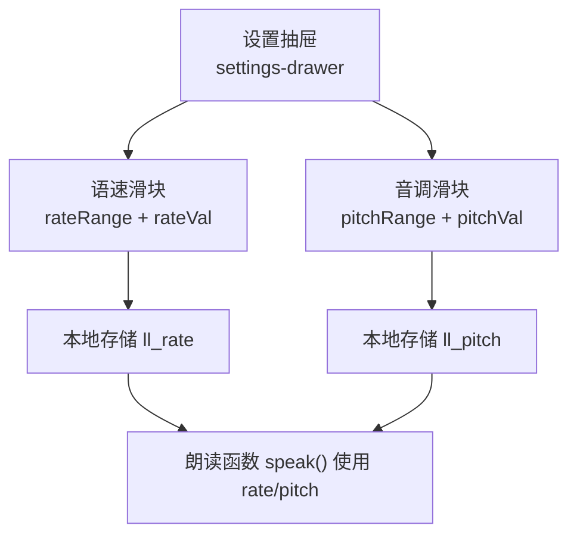
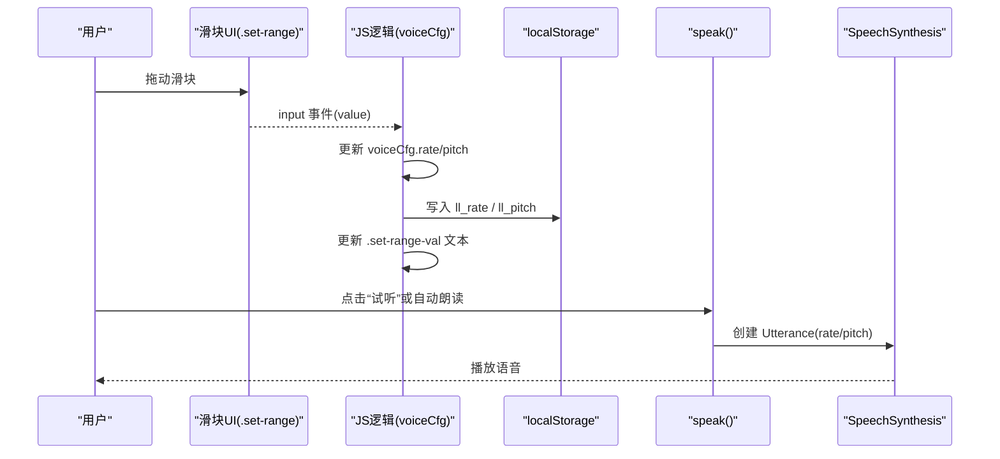
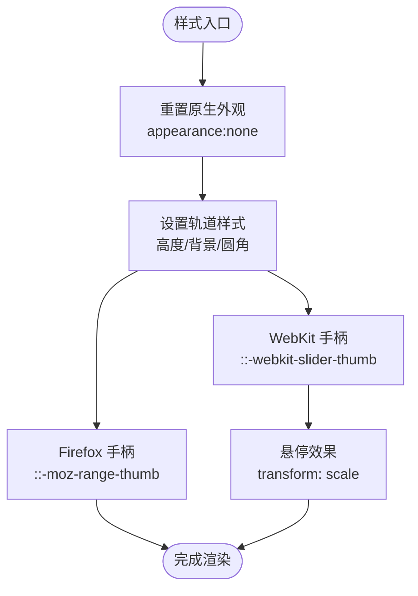
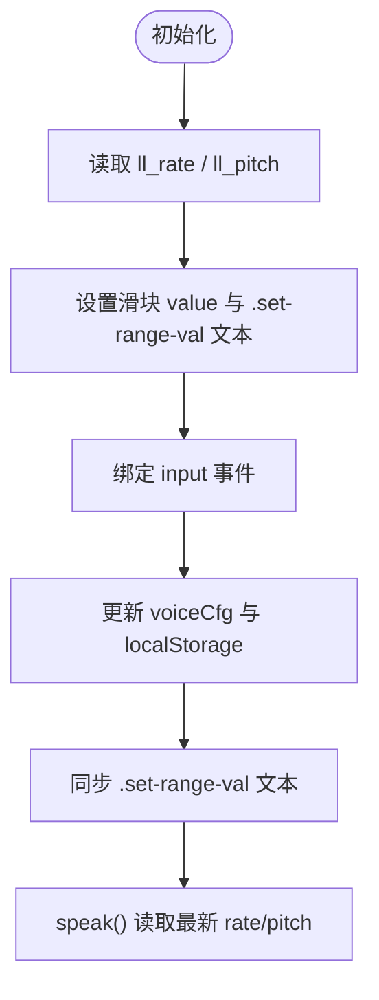
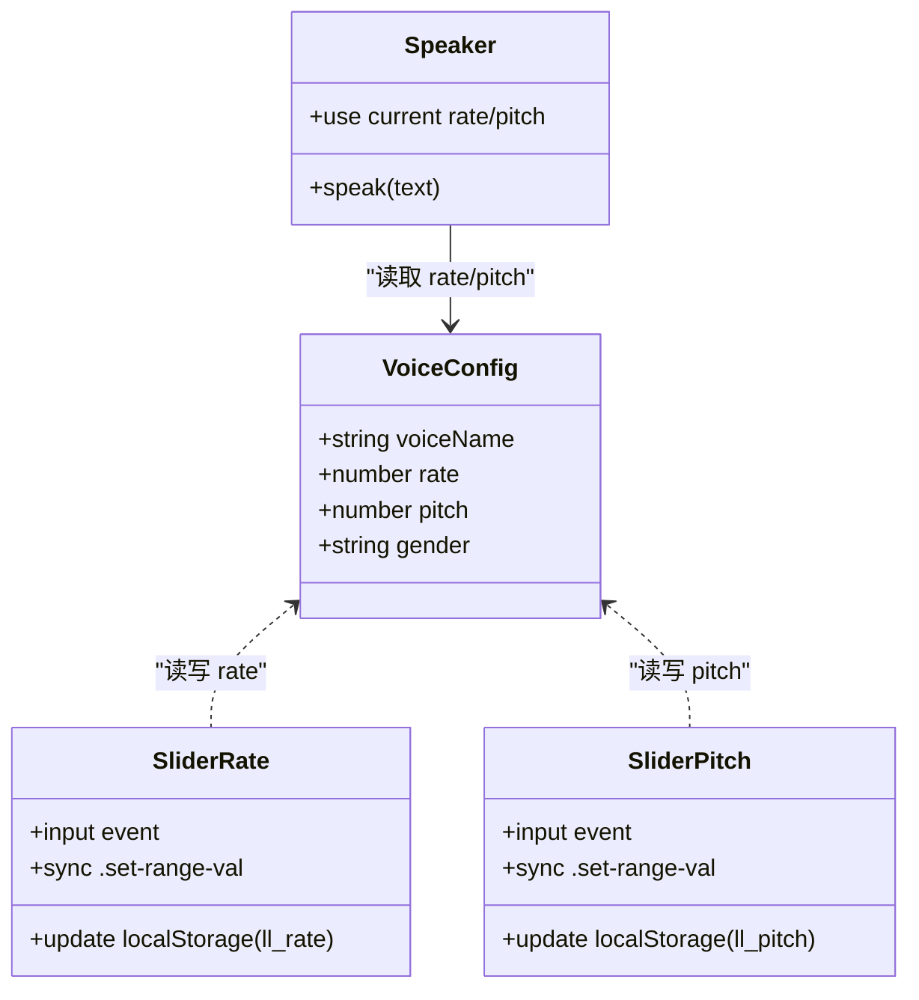
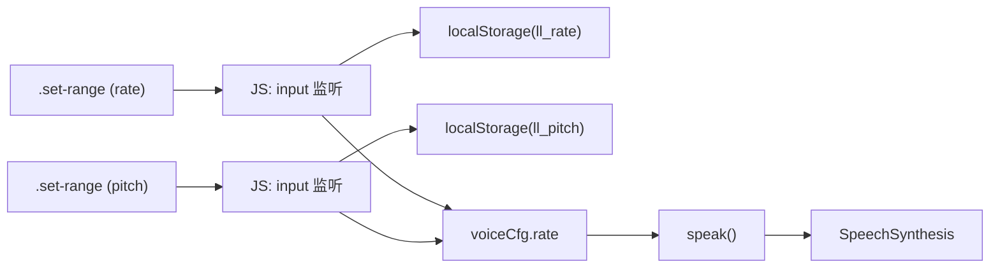

# 范围滑块组件

<cite>
**本文引用的文件**   
- [index.html](file://hushai/meditation/static/index.html)
</cite>

## 目录
1. [简介](#简介)
2. [项目结构](#项目结构)
3. [核心组件](#核心组件)
4. [架构总览](#架构总览)
5. [详细组件分析](#详细组件分析)
6. [依赖关系分析](#依赖关系分析)
7. [性能与体验优化](#性能与体验优化)
8. [故障排查指南](#故障排查指南)
9. [结论](#结论)

## 简介
本文件聚焦 hush.ai 前端中的“范围滑块”组件，围绕 .set-range 的实现进行系统化说明。内容涵盖：
- 滑块轨道样式与拖拽手柄的自定义设计
- WebKit 与 Firefox 浏览器伪元素样式的差异处理
- 数值显示同步、实时更新与用户体验优化
- 与其他设置项（音色选择、性别筛选、试听与恢复默认）的联动逻辑
- 相关代码片段路径与可复用的交互模式

## 项目结构
该范围滑块位于冥想界面的“语音设置”抽屉中，包含两个滑块：语速与音调。每个滑块都配有实时数值显示区域，并通过 input 事件将值持久化到本地存储，供后续朗读时使用。

图表来源
- [index.html:1072-1088](file://hushai/meditation/static/index.html#L1072-L1088)
- [index.html:1523-1537](file://hushai/meditation/static/index.html#L1523-L1537)
- [index.html:1662-1686](file://hushai/meditation/static/index.html#L1662-L1686)

章节来源
- [index.html:1050-1089](file://hushai/meditation/static/index.html#L1050-L1089)

## 核心组件
- 滑块容器与布局
  - 行级容器：.set-range-row，用于将滑块与数值标签并排对齐
  - 滑块本体：.set-range，覆盖默认外观，定义轨道高度、背景色与圆角
  - 数值标签：.set-range-val，等宽字体右对齐，便于数值变化时不抖动
- 浏览器兼容样式
  - WebKit 系列（Chrome/Safari/Edge）：::-webkit-slider-thumb
  - Firefox：::-moz-range-thumb
- 行为与数据流
  - 通过 input 事件监听滑块拖动，更新内存配置对象 voiceCfg.rate/pitch
  - 同步更新 .set-range-val 文本
  - 写入 localStorage 对应键值，保证刷新后仍保持用户偏好
  - 朗读函数 speak() 在生成 SpeechSynthesisUtterance 时读取当前 rate/pitch

章节来源
- [index.html:597-616](file://hushai/meditation/static/index.html#L597-L616)
- [index.html:1072-1088](file://hushai/meditation/static/index.html#L1072-L1088)
- [index.html:1523-1537](file://hushai/meditation/static/index.html#L1523-L1537)
- [index.html:1662-1686](file://hushai/meditation/static/index.html#L1662-L1686)

## 架构总览
下图展示了从用户操作到最终朗读输出的完整链路，包括滑块样式、输入监听、状态同步与朗读应用。

图表来源
- [index.html:1523-1537](file://hushai/meditation/static/index.html#L1523-L1537)
- [index.html:1539-1555](file://hushai/meditation/static/index.html#L1539-L1555)
- [index.html:1662-1686](file://hushai/meditation/static/index.html#L1662-L1686)

## 详细组件分析

### 样式实现与跨浏览器兼容
- 轨道样式
  - 使用 appearance:none 移除原生外观
  - 设置固定高度与背景色，形成细线轨道
  - 圆角与外边框控制视觉层次
- 拖拽手柄
  - WebKit：::-webkit-slider-thumb 定义圆形手柄、边框、阴影与悬停缩放
  - Firefox：::-moz-range-thumb 定义一致的手柄尺寸与颜色
- 数值显示
  - 使用等宽字体与固定最小宽度，避免数字变化导致布局抖动
  - 右对齐，提升可读性

图表来源
- [index.html:597-616](file://hushai/meditation/static/index.html#L597-L616)

章节来源
- [index.html:597-616](file://hushai/meditation/static/index.html#L597-L616)

### 数值显示同步与实时更新
- 初始化
  - 页面加载时从 localStorage 读取 rate/pitch，并回填到滑块与数值标签
- 拖动过程
  - 监听 input 事件，即时更新内存配置与数值标签
  - 每次变更写入 localStorage，确保刷新后保持一致
- 与朗读联动
  - 朗读函数在构造 Utterance 时直接读取当前 rate/pitch，无需额外触发

图表来源
- [index.html:1523-1537](file://hushai/meditation/static/index.html#L1523-L1537)
- [index.html:1662-1686](file://hushai/meditation/static/index.html#L1662-L1686)

章节来源
- [index.html:1523-1537](file://hushai/meditation/static/index.html#L1523-L1537)
- [index.html:1662-1686](file://hushai/meditation/static/index.html#L1662-L1686)

### 与其他设置项的联动逻辑
- 音色选择
  - 选择不同音色后，仅影响 voiceName；rate/pitch 独立保存，互不影响
- 性别筛选
  - 切换性别过滤会重新渲染可用音色列表，但不改变 rate/pitch
- 试听按钮
  - 点击“试听”会调用 speak()，立即以当前 rate/pitch 播放预览文本
- 恢复默认
  - 将 rate/pitch 重置为默认值，清空本地存储，并同步 UI

图表来源
- [index.html:1440-1447](file://hushai/meditation/static/index.html#L1440-L1447)
- [index.html:1523-1537](file://hushai/meditation/static/index.html#L1523-L1537)
- [index.html:1539-1555](file://hushai/meditation/static/index.html#L1539-L1555)
- [index.html:1662-1686](file://hushai/meditation/static/index.html#L1662-L1686)

章节来源
- [index.html:1440-1447](file://hushai/meditation/static/index.html#L1440-L1447)
- [index.html:1523-1537](file://hushai/meditation/static/index.html#L1523-L1537)
- [index.html:1539-1555](file://hushai/meditation/static/index.html#L1539-L1555)
- [index.html:1662-1686](file://hushai/meditation/static/index.html#L1662-L1686)

### 代码示例路径（不含具体代码）
- 滑块 HTML 结构与数值标签
  - [index.html:1072-1088](file://hushai/meditation/static/index.html#L1072-L1088)
- 滑块 CSS 样式与跨浏览器兼容
  - [index.html:597-616](file://hushai/meditation/static/index.html#L597-L616)
- 滑块输入监听与本地存储同步
  - [index.html:1523-1537](file://hushai/meditation/static/index.html#L1523-L1537)
- 试听与恢复默认
  - [index.html:1539-1555](file://hushai/meditation/static/index.html#L1539-L1555)
- 朗读函数使用 rate/pitch
  - [index.html:1662-1686](file://hushai/meditation/static/index.html#L1662-L1686)

## 依赖关系分析
- 组件内依赖
  - DOM 节点：rateRange、pitchRange、rateVal、pitchVal
  - 本地存储：ll_rate、ll_pitch
  - 全局配置：voiceCfg.rate、voiceCfg.pitch
- 外部依赖
  - SpeechSynthesis API：在 speak() 中应用 rate/pitch
- 耦合与内聚
  - 滑块逻辑与朗读逻辑通过 voiceCfg 解耦，内聚于同一模块，便于维护
- 潜在循环依赖
  - 无循环依赖；数据流向单向：UI -> JS -> Storage -> speak()

图表来源
- [index.html:1523-1537](file://hushai/meditation/static/index.html#L1523-L1537)
- [index.html:1662-1686](file://hushai/meditation/static/index.html#L1662-L1686)

章节来源
- [index.html:1523-1537](file://hushai/meditation/static/index.html#L1523-L1537)
- [index.html:1662-1686](file://hushai/meditation/static/index.html#L1662-L1686)

## 性能与体验优化
- 数值显示防抖
  - 当前采用 input 事件即时更新，适合小范围参数调节；如需更平滑体验，可在高频场景下考虑节流
- 动画与过渡
  - 手柄悬停使用 transform: scale，GPU 加速友好，避免重排
- 无障碍支持
  - 使用原生 range 控件，具备键盘导航与屏幕阅读器基础支持
- 兼容性
  - 同时提供 ::-webkit-slider-thumb 与 ::-moz-range-thumb，覆盖主流桌面浏览器
- 与朗读联动
  - 朗读前读取最新 rate/pitch，避免需要手动触发“应用”按钮

[本节为通用指导，不涉及具体文件分析]

## 故障排查指南
- 滑块无法拖动或样式异常
  - 检查是否被其他层遮挡或 pointer-events 被禁用
  - 确认 appearance:none 已生效且未被子类覆盖
- 数值不更新
  - 确认 input 事件绑定成功，DOM 节点 ID 正确
  - 检查浏览器控制台是否有脚本错误
- 更改后刷新丢失
  - 确认 localStorage 写入成功，且初始化时正确回填
- 试听无效
  - 检查 SpeechSynthesis 可用性，以及是否选择了有效 voiceName
  - 确认 rate/pitch 取值在合理范围内

章节来源
- [index.html:1523-1537](file://hushai/meditation/static/index.html#L1523-L1537)
- [index.html:1539-1555](file://hushai/meditation/static/index.html#L1539-L1555)
- [index.html:1662-1686](file://hushai/meditation/static/index.html#L1662-L1686)

## 结论
该范围滑块组件通过简洁的 CSS 与轻量 JS 实现了跨浏览器的统一外观与稳定的交互体验。其关键优势在于：
- 明确的样式分层与伪元素兼容策略
- 实时的数值同步与本地持久化
- 与朗读功能的无缝集成，确保用户调整即刻生效
- 与其他设置项松耦合，易于扩展与维护

[本节为总结性内容，不涉及具体文件分析]