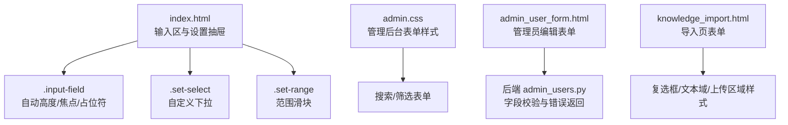
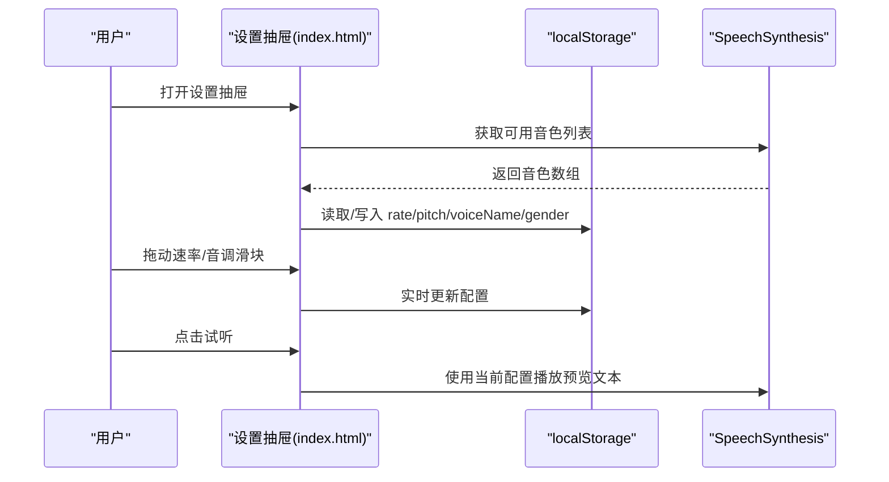
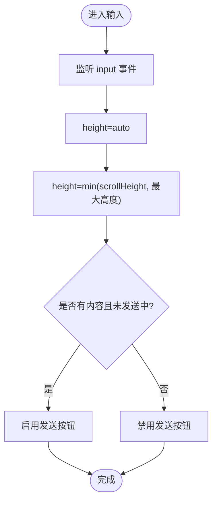
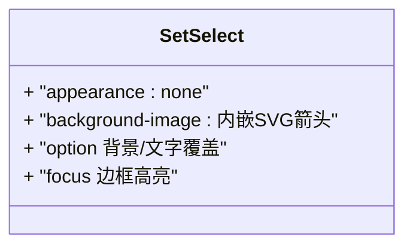
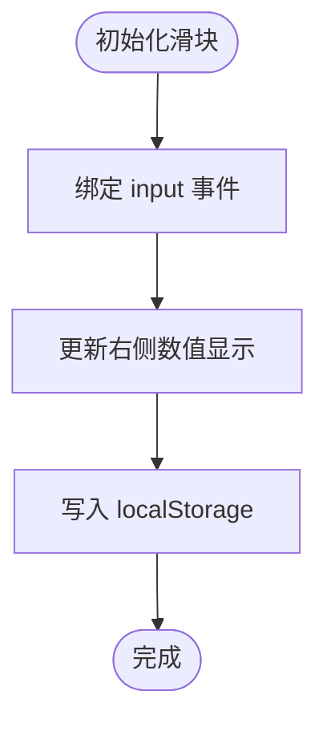
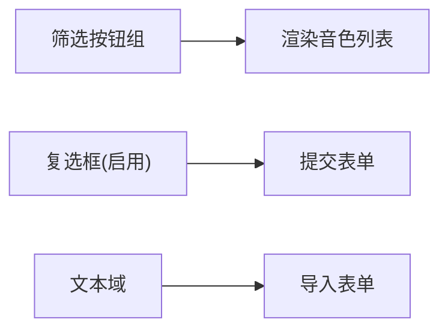
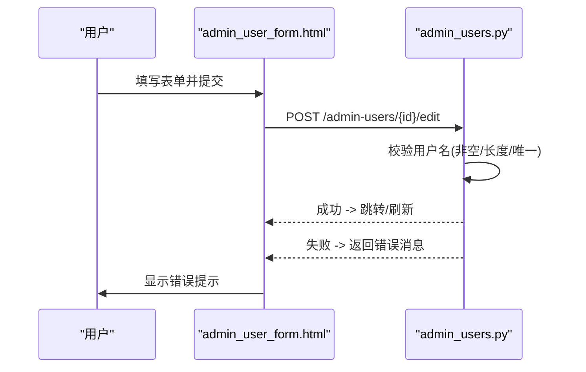
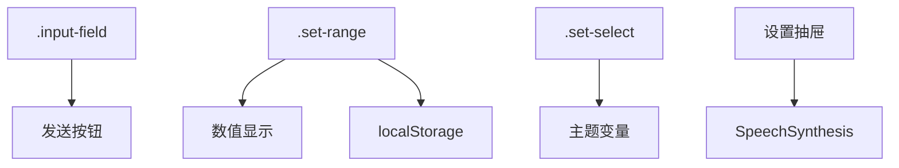

# 表单控件组件

<cite>
**本文引用的文件**   
- [index.html](file://hushai/meditation/static/index.html)
- [admin.css](file://hushai/meditation/admin/static/css/admin.css)
- [admin_user_form.html](file://hushai/meditation/admin/templates/admin_user_form.html)
- [knowledge_import.html](file://hushai/meditation/admin/templates/knowledge_import.html)
- [conversations.html](file://hushai/meditation/admin/templates/conversations.html)
- [settings.html](file://hushai/meditation/admin/templates/settings.html)
- [admin_users.py](file://hushai/meditation/admin/pages/admin_users.py)
</cite>

## 目录
1. [简介](#简介)
2. [项目结构](#项目结构)
3. [核心组件](#核心组件)
4. [架构总览](#架构总览)
5. [详细组件分析](#详细组件分析)
6. [依赖关系分析](#依赖关系分析)
7. [性能与可访问性](#性能与可访问性)
8. [故障排查指南](#故障排查指南)
9. [结论](#结论)
10. [附录：代码片段路径](#附录代码片段路径)

## 简介
本文件面向 hush.ai 的“设置面板”与“对话输入区”中的表单控件，系统性说明以下能力与实现要点：
- 输入框 .input-field：自动高度调整、焦点状态与占位符样式
- 下拉选择框 .set-select：自定义箭头图标与选项样式定制
- 范围滑块 .set-range：拖拽交互、数值显示与浏览器兼容性处理
- 设置面板中的单选按钮组、复选框与文本域
- 表单验证逻辑、数据绑定与用户体验优化（含示例路径）

## 项目结构
与表单控件相关的资源主要分布在：
- 前端主界面与内联样式：hushai/meditation/static/index.html
- 管理后台样式与模板：hushai/meditation/admin/static/css/admin.css、hushai/meditation/admin/templates/*.html
- 后端表单校验与错误回显：hushai/meditation/admin/pages/admin_users.py

图表来源
- [index.html:514-523](file://hushai/meditation/static/index.html#L514-L523)
- [index.html:585-616](file://hushai/meditation/static/index.html#L585-L616)
- [admin.css:801-868](file://hushai/meditation/admin/static/css/admin.css#L801-L868)
- [admin_user_form.html:31-120](file://hushai/meditation/admin/templates/admin_user_form.html#L31-L120)
- [admin_users.py:127-166](file://hushai/meditation/admin/pages/admin_users.py#L127-L166)
- [knowledge_import.html:178-256](file://hushai/meditation/admin/templates/knowledge_import.html#L178-L256)

章节来源
- [index.html:514-523](file://hushai/meditation/static/index.html#L514-L523)
- [index.html:585-616](file://hushai/meditation/static/index.html#L585-L616)
- [admin.css:801-868](file://hushai/meditation/admin/static/css/admin.css#L801-L868)
- [admin_user_form.html:31-120](file://hushai/meditation/admin/templates/admin_user_form.html#L31-L120)
- [admin_users.py:127-166](file://hushai/meditation/admin/pages/admin_users.py#L127-L166)
- [knowledge_import.html:178-256](file://hushai/meditation/admin/templates/knowledge_import.html#L178-L256)

## 核心组件
本节聚焦三类关键控件的实现细节与交互行为。

- 输入框 .input-field
  - 自动高度：通过监听 input 事件，将元素高度重置为 auto 后取 scrollHeight 并限制最大高度，避免溢出
  - 焦点状态：focus 时边框与背景色变化，提供清晰的视觉反馈
  - 占位符样式：使用 ::placeholder 伪类定义颜色与字号
  - 发送按钮联动：当输入为空或处于发送中时禁用发送按钮

- 下拉选择框 .set-select
  - 自定义箭头：通过 background-image 内嵌 SVG 小三角，定位到右侧居中
  - 选项样式：option 的背景与文字颜色覆盖默认样式，保证主题一致
  - 焦点态：focus 时边框高亮

- 范围滑块 .set-range
  - 轨道与滑块：隐藏原生外观，统一轨道高度、圆角与滑块尺寸
  - 数值显示：在滑块旁以等宽字体实时显示当前值
  - 兼容性：分别针对 WebKit 与 Mozilla 的伪元素进行滑块样式适配

章节来源
- [index.html:514-523](file://hushai/meditation/static/index.html#L514-L523)
- [index.html:1565-1570](file://hushai/meditation/static/index.html#L1565-L1570)
- [index.html:585-616](file://hushai/meditation/static/index.html#L585-L616)
- [index.html:1523-1537](file://hushai/meditation/static/index.html#L1523-L1537)

## 架构总览
下图展示“设置抽屉”中各控件与数据持久化、语音合成之间的交互关系。

图表来源
- [index.html:1440-1555](file://hushai/meditation/static/index.html#L1440-L1555)

## 详细组件分析

### 输入框 .input-field
- 自动高度调整
  - 在 input 事件中先将 height 设为 auto，再根据 scrollHeight 计算新高度，并以 max-height 限制上限
  - 同时根据内容是否为空与是否正在发送来切换发送按钮的禁用状态
- 焦点与占位符
  - focus 时边框与背景色变化，::placeholder 定义提示文案样式
- 键盘交互
  - Enter 键触发发送（Shift+Enter 换行），提升输入效率

图表来源
- [index.html:1565-1570](file://hushai/meditation/static/index.html#L1565-L1570)
- [index.html:514-523](file://hushai/meditation/static/index.html#L514-L523)

章节来源
- [index.html:514-523](file://hushai/meditation/static/index.html#L514-L523)
- [index.html:1565-1570](file://hushai/meditation/static/index.html#L1565-L1570)

### 下拉选择框 .set-select
- 自定义箭头
  - 使用 data URI 内嵌 SVG 作为背景图，右对齐居中显示
- 选项样式
  - 覆盖 option 的背景与文字颜色，保持与主题一致
- 焦点态
  - focus 时边框高亮，增强可达性

图表来源
- [index.html:585-595](file://hushai/meditation/static/index.html#L585-L595)

章节来源
- [index.html:585-595](file://hushai/meditation/static/index.html#L585-L595)

### 范围滑块 .set-range
- 轨道与滑块
  - 隐藏原生外观，统一轨道高度与圆角；WebKit 与 Mozilla 分别定义滑块伪元素
- 数值显示
  - 在滑块右侧以等宽字体显示当前值，随 input 事件更新
- 兼容性
  - 同时支持 -webkit-slider-thumb 与 -moz-range-thumb

图表来源
- [index.html:597-616](file://hushai/meditation/static/index.html#L597-L616)
- [index.html:1523-1537](file://hushai/meditation/static/index.html#L1523-L1537)

章节来源
- [index.html:597-616](file://hushai/meditation/static/index.html#L597-L616)
- [index.html:1523-1537](file://hushai/meditation/static/index.html#L1523-L1537)

### 设置面板中的其他控件
- 单选按钮组（性别/语言筛选）
  - 通过一组按钮切换 active 状态，驱动音色列表过滤
- 复选框（管理员启用状态）
  - 在管理员编辑表单中以 checkbox 表示账户启用状态
- 文本域（长文本输入）
  - 导入页面提供 textarea，支持垂直缩放与最小高度

图表来源
- [index.html:1505-1521](file://hushai/meditation/static/index.html#L1505-L1521)
- [admin_user_form.html:91-106](file://hushai/meditation/admin/templates/admin_user_form.html#L91-L106)
- [knowledge_import.html:210-231](file://hushai/meditation/admin/templates/knowledge_import.html#L210-L231)

章节来源
- [index.html:1505-1521](file://hushai/meditation/static/index.html#L1505-L1521)
- [admin_user_form.html:91-106](file://hushai/meditation/admin/templates/admin_user_form.html#L91-L106)
- [knowledge_import.html:210-231](file://hushai/meditation/admin/templates/knowledge_import.html#L210-L231)

### 表单验证逻辑与错误回显
- 前端基础校验
  - 必填、最小长度等 HTML 属性约束
- 后端校验与错误返回
  - 用户名非空与最小长度校验
  - 用户名唯一性校验
  - 失败时返回模板并携带错误信息，由页面渲染提示
- 未保存更改保护
  - 导航离开前检测 formChanged，阻止误操作

图表来源
- [admin_user_form.html:31-120](file://hushai/meditation/admin/templates/admin_user_form.html#L31-L120)
- [admin_users.py:127-166](file://hushai/meditation/admin/pages/admin_users.py#L127-L166)
- [settings.html:370-384](file://hushai/meditation/admin/templates/settings.html#L370-L384)

章节来源
- [admin_user_form.html:31-120](file://hushai/meditation/admin/templates/admin_user_form.html#L31-L120)
- [admin_users.py:127-166](file://hushai/meditation/admin/pages/admin_users.py#L127-L166)
- [settings.html:370-384](file://hushai/meditation/admin/templates/settings.html#L370-L384)

### 数据绑定与用户体验优化
- 本地持久化
  - 速率、音调、音色名称、性别筛选均写入 localStorage，下次打开保持一致
- 即时反馈
  - 滑块拖动时立即更新数值显示
  - 输入框内容变化即时控制发送按钮可用性
- 无障碍与动效
  - 使用 aria-label、aria-live 等属性提升可访问性
  - 尊重 prefers-reduced-motion，减少不必要的动画

章节来源
- [index.html:1440-1555](file://hushai/meditation/static/index.html#L1440-L1555)
- [index.html:1565-1570](file://hushai/meditation/static/index.html#L1565-L1570)
- [index.html:736-746](file://hushai/meditation/static/index.html#L736-L746)

## 依赖关系分析
- 组件耦合
  - 输入框与发送按钮强耦合（可用性状态）
  - 滑块与数值显示、localStorage 紧密协作
  - 下拉选择框仅负责展示与选中项，不直接参与业务逻辑
- 外部依赖
  - SpeechSynthesis API（音色列表与播放）
  - localStorage（配置持久化）
- 潜在循环依赖
  - 无直接循环依赖；各模块职责清晰

图表来源
- [index.html:1565-1570](file://hushai/meditation/static/index.html#L1565-L1570)
- [index.html:1523-1537](file://hushai/meditation/static/index.html#L1523-L1537)
- [index.html:1440-1555](file://hushai/meditation/static/index.html#L1440-L1555)

## 性能与可访问性
- 性能
  - 自动高度计算仅在 input 事件中执行，避免频繁重排
  - 滑块值更新采用轻量 DOM 文本替换
- 可访问性
  - 为关键控件提供 aria-label、aria-live 等语义
  - 提供 :focus-visible 轮廓，便于键盘导航
  - 尊重 reduced motion 偏好

章节来源
- [index.html:736-746](file://hushai/meditation/static/index.html#L736-L746)
- [index.html:1565-1570](file://hushai/meditation/static/index.html#L1565-L1570)

## 故障排查指南
- 输入框无法自动增高
  - 检查是否在 input 事件中正确重置 height 为 auto 后再读取 scrollHeight
  - 确认是否存在 CSS 强制固定高度导致 scrollHeight 异常
- 滑块数值不更新
  - 确认已绑定 input 事件并在回调中更新数值显示与 localStorage
- 下拉箭头不可见
  - 检查 background-image 是否正确加载，确保 appearance:none 生效
- 表单提交后仍显示旧错误
  - 确认后端返回的错误字段被模板正确渲染，且前端未缓存旧状态

章节来源
- [index.html:1565-1570](file://hushai/meditation/static/index.html#L1565-L1570)
- [index.html:585-595](file://hushai/meditation/static/index.html#L585-L595)
- [admin_user_form.html:31-120](file://hushai/meditation/admin/templates/admin_user_form.html#L31-L120)

## 结论
通过统一的样式体系与简洁的前端交互逻辑，hush.ai 的表单控件在输入体验、可访问性与跨浏览器一致性方面表现良好。建议后续在复杂表单场景引入更完善的客户端校验与错误聚合展示，进一步提升用户体验。

## 附录：代码片段路径
- 输入框自动高度与发送按钮联动
  - [index.html:1565-1570](file://hushai/meditation/static/index.html#L1565-L1570)
- 输入框焦点与占位符样式
  - [index.html:514-523](file://hushai/meditation/static/index.html#L514-L523)
- 下拉选择框自定义箭头与选项样式
  - [index.html:585-595](file://hushai/meditation/static/index.html#L585-L595)
- 范围滑块样式与数值显示
  - [index.html:597-616](file://hushai/meditation/static/index.html#L597-L616)
  - [index.html:1523-1537](file://hushai/meditation/static/index.html#L1523-L1537)
- 设置抽屉与语音配置（localStorage/SpeechSynthesis）
  - [index.html:1440-1555](file://hushai/meditation/static/index.html#L1440-L1555)
- 管理后台表单样式（搜索/筛选）
  - [admin.css:801-868](file://hushai/meditation/admin/static/css/admin.css#L801-L868)
- 管理员编辑表单（复选框/文本域/提交）
  - [admin_user_form.html:31-120](file://hushai/meditation/admin/templates/admin_user_form.html#L31-L120)
- 导入页表单（复选框/文本域/上传区域）
  - [knowledge_import.html:178-256](file://hushai/meditation/admin/templates/knowledge_import.html#L178-L256)
- 批量选择（复选框）
  - [conversations.html:140-175](file://hushai/meditation/admin/templates/conversations.html#L140-L175)
- 未保存更改保护
  - [settings.html:370-384](file://hushai/meditation/admin/templates/settings.html#L370-L384)
- 后端表单校验与错误返回
  - [admin_users.py:127-166](file://hushai/meditation/admin/pages/admin_users.py#L127-L166)