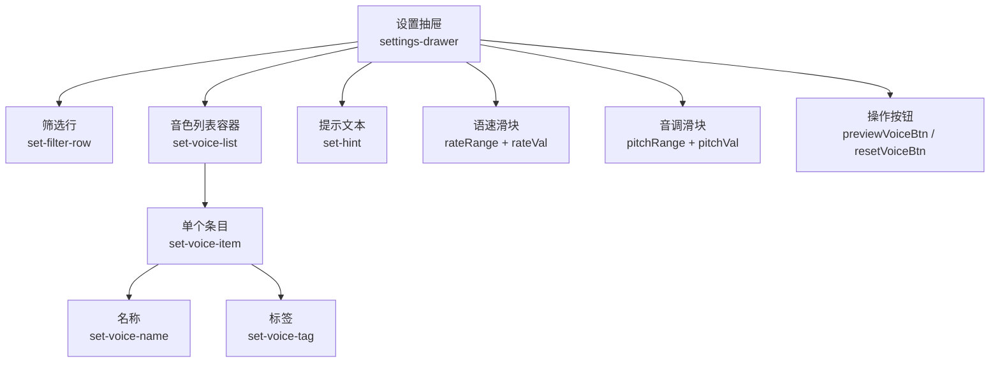
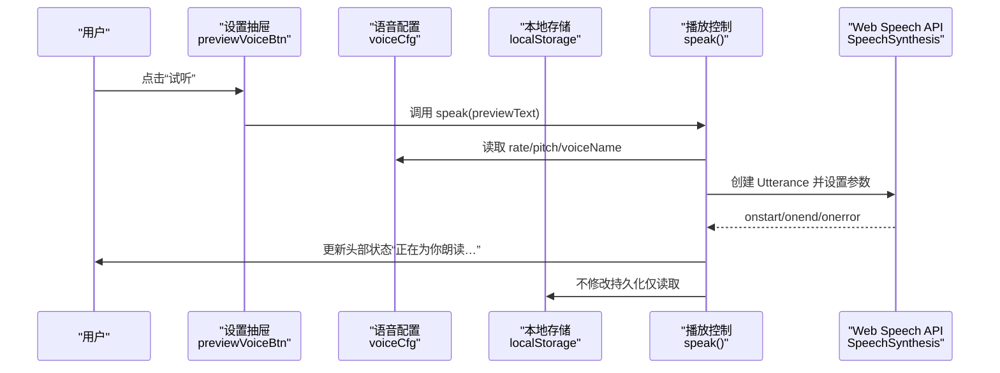
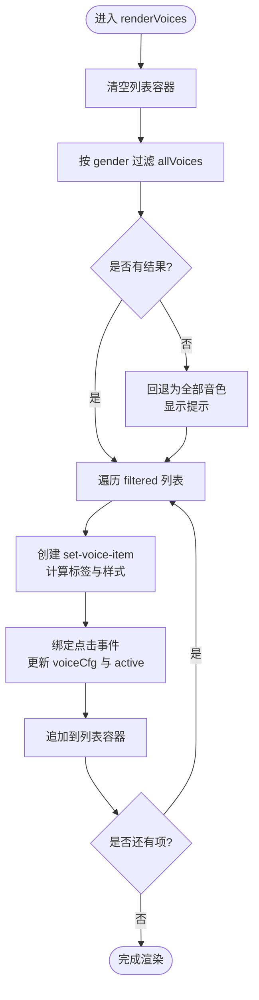
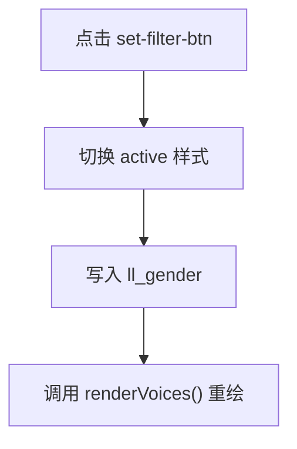
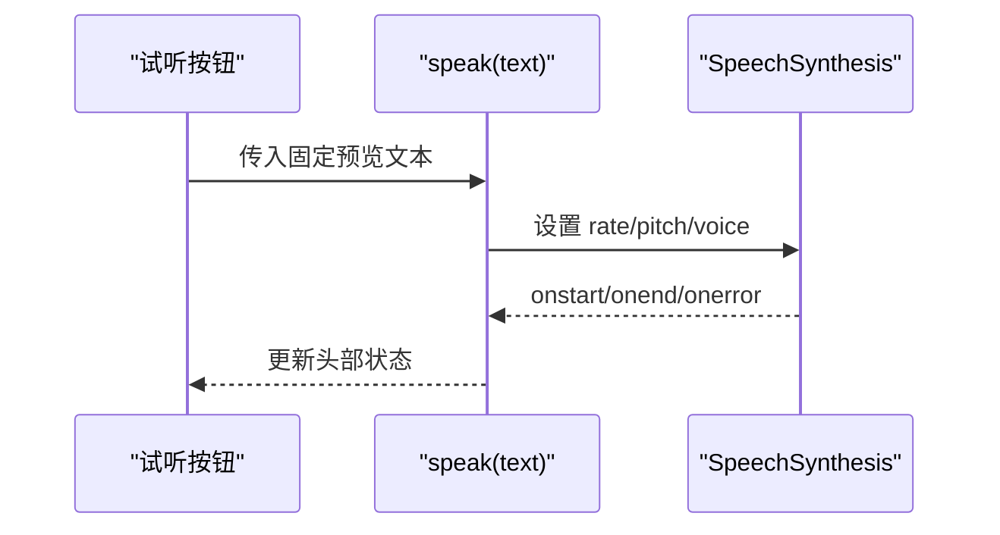
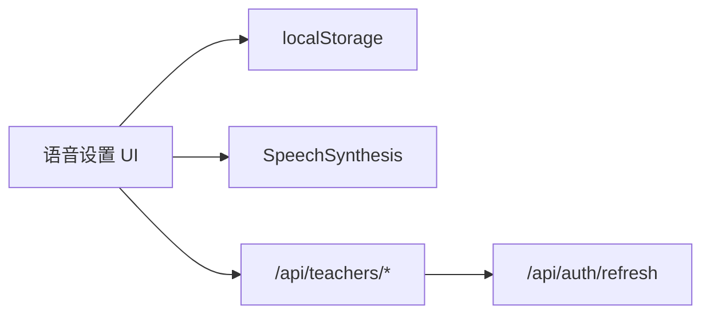

# 语音选择器组件

<cite>
**本文引用的文件**   
- [hushai/meditation/static/index.html](file://hushai/meditation/static/index.html)
</cite>

## 目录
1. [简介](#简介)
2. [项目结构](#项目结构)
3. [核心组件](#核心组件)
4. [架构总览](#架构总览)
5. [详细组件分析](#详细组件分析)
6. [依赖分析](#依赖分析)
7. [性能考虑](#性能考虑)
8. [故障排查指南](#故障排查指南)
9. [结论](#结论)

## 简介
本文件为 hush.ai 前端“语音设置”面板的组件文档，聚焦于 .set-voice-item 的实现与交互。内容涵盖：
- 语音列表渲染、选中状态管理
- 预览播放功能
- 标签系统（女/男/EN/中）
- 分类过滤逻辑（.set-filter-btn）
- 列表滚动优化与响应式布局
- 语音数据绑定、播放控制、状态持久化
- 与后端 API 的集成方式与错误处理机制

该组件位于单页应用的主界面内，通过浏览器 Web Speech API 获取并控制本地 TTS 能力，无需额外库。

## 项目结构
语音设置面板以抽屉形式嵌入主页面，包含筛选按钮、音色列表、语速/音调滑块、试听与恢复默认按钮等。关键 DOM 节点与样式类如下：
- 容器与标题：settings-drawer、settings-head、settings-title
- 筛选区：set-filter-row、set-filter-btn
- 列表区：set-voice-list、set-voice-item、set-voice-name、set-voice-tag
- 提示区：set-hint
- 滑块区：set-range、set-range-val
- 操作区：set-btn、previewVoiceBtn、resetVoiceBtn

图表来源
- [hushai/meditation/static/index.html:1050-1089](file://hushai/meditation/static/index.html#L1050-L1089)
- [hushai/meditation/static/index.html:634-664](file://hushai/meditation/static/index.html#L634-L664)

章节来源
- [hushai/meditation/static/index.html:1050-1089](file://hushai/meditation/static/index.html#L1050-L1089)
- [hushai/meditation/static/index.html:634-664](file://hushai/meditation/static/index.html#L634-L664)

## 核心组件
本节从实现角度拆解语音选择器的关键能力。

- 数据源与加载
  - 使用浏览器 SpeechSynthesis.getVoices() 获取可用音色；监听 onvoiceschanged 事件以适配动态加载场景。
  - 维护 allVoices 数组与 voiceCfg 配置对象（voiceName、rate、pitch、gender），均持久化到 localStorage。

- 列表渲染与选中状态
  - renderVoices() 根据当前 gender 过滤后生成 set-voice-item 列表项，并在点击时更新 voiceCfg.voiceName 与 active 样式。
  - 选中态通过 classList.add/remove('active') 切换。

- 标签系统
  - detectGender(v) 基于 name 正则匹配推断性别；isEnVoice(v) 判断是否为英文。
  - 标签文案与样式类随检测结果变化（女/男/EN/中）。

- 分类过滤
  - set-filter-btn 的 data-gender 属性驱动过滤策略：全部/女声/男声/English。
  - 当目标设备无中文音色时，降级显示全部并给出提示。

- 预览播放
  - previewVoiceBtn 触发 speak(previewText)，使用当前 voiceCfg 中的 rate/pitch/voiceName。

- 滑块控制
  - rateRange/pitchRange 实时更新 voiceCfg 并写入 localStorage，同时刷新对应数值展示。

- 恢复默认
  - resetVoiceBtn 清空相关 localStorage 键值，重置 UI 与 voiceCfg，并重新渲染列表。

- 与教师选择的联动
  - 选择教师时若携带 voice_gender，会同步更新 voiceCfg.gender、筛选按钮高亮并重新渲染列表。

章节来源
- [hushai/meditation/static/index.html:1440-1555](file://hushai/meditation/static/index.html#L1440-L1555)
- [hushai/meditation/static/index.html:1410-1434](file://hushai/meditation/static/index.html#L1410-L1434)
- [hushai/meditation/static/index.html:1461-1503](file://hushai/meditation/static/index.html#L1461-L1503)
- [hushai/meditation/static/index.html:1505-1521](file://hushai/meditation/static/index.html#L1505-L1521)
- [hushai/meditation/static/index.html:1523-1555](file://hushai/meditation/static/index.html#L1523-L1555)
- [hushai/meditation/static/index.html:1539-1543](file://hushai/meditation/static/index.html#L1539-L1543)

## 架构总览
语音选择器在整体对话流程中与“朗读输出”紧密协作。下图展示了从用户点击“试听”到实际发声的关键调用链。

图表来源
- [hushai/meditation/static/index.html:1539-1543](file://hushai/meditation/static/index.html#L1539-L1543)
- [hushai/meditation/static/index.html:1661-1692](file://hushai/meditation/static/index.html#L1661-L1692)

## 详细组件分析

### 列表渲染与选中状态（.set-voice-item）
- 渲染流程
  - 初始化时调用 loadVoices() 获取 allVoices，随后 renderVoices() 清空列表并逐项构建 set-voice-item。
  - 每个 item 包含 set-voice-name 与 set-voice-tag，后者依据性别/语言自动标注。
- 选中态
  - 点击某项时，将 voiceCfg.voiceName 写入 localStorage，并移除其他项的 active 类，给当前项添加 active。
- 空结果回退
  - 当按 gender 过滤结果为空时，回退到全部音色并显示提示。

图表来源
- [hushai/meditation/static/index.html:1471-1503](file://hushai/meditation/static/index.html#L1471-L1503)

章节来源
- [hushai/meditation/static/index.html:1451-1503](file://hushai/meditation/static/index.html#L1451-L1503)

### 分类过滤逻辑（.set-filter-btn）
- 过滤维度
  - all：显示所有中文音色
  - female：中文且检测为女声
  - male：中文且检测为男声
  - en：非中文（英文）
- 交互
  - 点击按钮切换 active 状态，更新 voiceCfg.gender 并持久化，然后重绘列表。
- 初始状态
  - 页面加载时根据 localStorage 中的 ll_gender 恢复上次选择。

图表来源
- [hushai/meditation/static/index.html:1505-1521](file://hushai/meditation/static/index.html#L1505-L1521)

章节来源
- [hushai/meditation/static/index.html:1505-1521](file://hushai/meditation/static/index.html#L1505-L1521)

### 标签系统（set-voice-tag）
- 判定规则
  - 性别：detectGender 基于 name 的正则匹配（如 female/male/女/男及若干常见名）。
  - 语言：isEnVoice 判断 lang 是否包含 zh。
- 标签文案与样式
  - 女→“女”，男→“男”，英文→“EN”，其余中文→“中”。
  - 不同标签对应不同样式类，用于区分视觉呈现。

章节来源
- [hushai/meditation/static/index.html:1461-1469](file://hushai/meditation/static/index.html#L1461-L1469)
- [hushai/meditation/static/index.html:1488-1494](file://hushai/meditation/static/index.html#L1488-L1494)

### 预览播放与播放控制
- 试听入口
  - previewVoiceBtn 点击后调用 speak(previewText)。
- 播放实现
  - speak() 构造 SpeechSynthesisUtterance，设置 lang、rate、pitch，并按 voiceName 匹配具体 Voice；若无匹配则回退到首个中文 Voice。
  - 播放开始/结束/错误时更新头部状态与 speaking 标志。
- 停止播放
  - stopSpeaking() 取消当前播放并复位状态。

图表来源
- [hushai/meditation/static/index.html:1539-1543](file://hushai/meditation/static/index.html#L1539-L1543)
- [hushai/meditation/static/index.html:1661-1692](file://hushai/meditation/static/index.html#L1661-L1692)

章节来源
- [hushai/meditation/static/index.html:1539-1543](file://hushai/meditation/static/index.html#L1539-L1543)
- [hushai/meditation/static/index.html:1661-1692](file://hushai/meditation/static/index.html#L1661-L1692)

### 列表滚动优化与响应式布局
- 滚动优化
  - 列表容器 set-voice-list 设置最大高度与隐藏滚动条，避免多余滚动条影响视觉。
- 响应式
  - 设置抽屉采用底部弹出，宽度受 app 最大宽度限制，在小屏下自适应。
  - 字体、间距、按钮尺寸遵循统一的 CSS 变量体系，保证一致性。

章节来源
- [hushai/meditation/static/index.html:550-564](file://hushai/meditation/static/index.html#L550-L564)
- [hushai/meditation/static/index.html:663-664](file://hushai/meditation/static/index.html#L663-L664)

### 语音数据绑定、状态持久化与恢复
- 数据绑定
  - voiceCfg 集中保存 voiceName/rate/pitch/gender，渲染与播放均从此对象取值。
- 持久化
  - 所有变更均写入 localStorage 对应键（ll_voice、ll_rate、ll_pitch、ll_gender）。
- 恢复
  - 页面初始化时从 localStorage 读取并回填滑块与筛选按钮状态。

章节来源
- [hushai/meditation/static/index.html:1440-1449](file://hushai/meditation/static/index.html#L1440-L1449)
- [hushai/meditation/static/index.html:1523-1555](file://hushai/meditation/static/index.html#L1523-L1555)

### 与后端 API 的集成与错误处理
- 教师选择联动
  - 选择教师后，若返回 voice_gender，会同步更新语音筛选并渲染列表。
  - 请求路径：POST /api/teachers/select，携带 teacher_id。
- 错误处理
  - 教师选择接口失败被静默捕获，不影响主流程。
  - 登录过期或鉴权失败时，全局会清理认证信息并跳转登录。

章节来源
- [hushai/meditation/static/index.html:1410-1434](file://hushai/meditation/static/index.html#L1410-L1434)
- [hushai/meditation/static/index.html:1632-1637](file://hushai/meditation/static/index.html#L1632-L1637)

## 依赖分析
- 浏览器 API 依赖
  - window.speechSynthesis：获取与播放语音
  - window.SpeechRecognition（可选）：语音输入（与语音设置解耦）
- 本地存储
  - localStorage：持久化语音偏好与教师选择
- 外部服务
  - 教师列表/选择接口：/api/teachers/list、/api/teachers/select
  - 鉴权刷新：/api/auth/refresh（全局）

图表来源
- [hushai/meditation/static/index.html:1451-1459](file://hushai/meditation/static/index.html#L1451-L1459)
- [hushai/meditation/static/index.html:1410-1434](file://hushai/meditation/static/index.html#L1410-L1434)
- [hushai/meditation/static/index.html:1611-1630](file://hushai/meditation/static/index.html#L1611-L1630)

章节来源
- [hushai/meditation/static/index.html:1451-1459](file://hushai/meditation/static/index.html#L1451-L1459)
- [hushai/meditation/static/index.html:1410-1434](file://hushai/meditation/static/index.html#L1410-L1434)
- [hushai/meditation/static/index.html:1611-1630](file://hushai/meditation/static/index.html#L1611-L1630)

## 性能考虑
- 列表渲染
  - 当前实现每次渲染前清空 innerHTML 再重建节点，适合中小规模列表；若未来音色数量显著增长，可考虑虚拟滚动或增量更新。
- 过滤开销
  - 过滤逻辑基于全量 allVoices 的线性扫描，复杂度 O(n)；n 通常较小，可接受。
- 播放控制
  - speak() 在每次播放前 cancel() 旧任务，避免队列堆积；onend/onerror 统一收尾，防止状态泄漏。
- 存储读写
  - 频繁 input 事件触发 localStorage 写入，建议必要时做节流（例如对滑块值变更进行防抖）。

[本节为通用性能建议，不直接分析具体代码片段]

## 故障排查指南
- 无法获取音色
  - 检查浏览器是否支持 speechSynthesis；部分环境需用户交互后才能加载 voices。
  - 确认 onvoiceschanged 回调是否触发并调用 renderVoices。
- 试听无声
  - 确认已选择有效 voiceName；若未选择，会回退到首个中文 Voice。
  - 检查 rate/pitch 是否在合理范围。
- 筛选无效
  - 确认设备是否存在对应语言/性别的 Voice；若无中文，会降级显示全部并提示。
- 教师联动异常
  - 检查 /api/teachers/select 返回是否包含 voice_gender；失败会被静默忽略。
- 鉴权问题
  - 若出现 401，会尝试刷新 token；失败则清理认证并回到登录页。

章节来源
- [hushai/meditation/static/index.html:1451-1459](file://hushai/meditation/static/index.html#L1451-L1459)
- [hushai/meditation/static/index.html:1471-1503](file://hushai/meditation/static/index.html#L1471-L1503)
- [hushai/meditation/static/index.html:1611-1637](file://hushai/meditation/static/index.html#L1611-L1637)

## 结论
语音选择器组件以轻量、原生 API 为核心，实现了完整的音色浏览、筛选、预览与偏好持久化。通过与教师选择的联动，进一步提升了个性化体验。在当前规模下，其实现简洁可靠；若后续扩展更多音色或高级特性，可在渲染与存储层面引入更精细的性能优化策略。