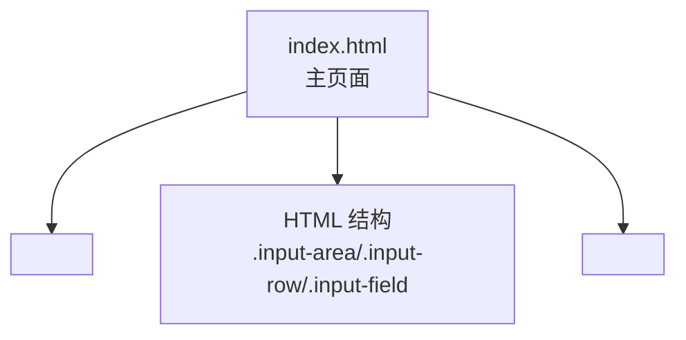
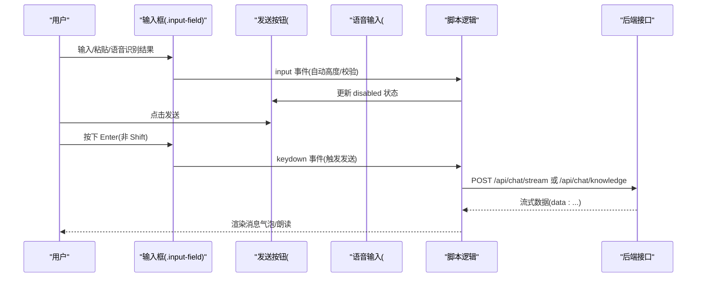
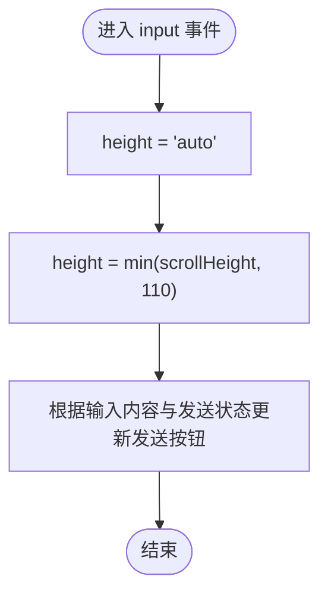
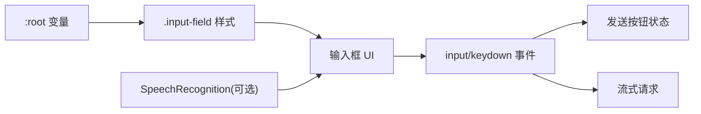

# 输入框组件

<cite>
**本文引用的文件**   
- [hushai/meditation/static/index.html](file://hushai/meditation/static/index.html)
</cite>

## 目录
1. [简介](#简介)
2. [项目结构](#项目结构)
3. [核心组件](#核心组件)
4. [架构总览](#架构总览)
5. [详细组件分析](#详细组件分析)
6. [依赖分析](#依赖分析)
7. [性能考虑](#性能考虑)
8. [故障排查指南](#故障排查指南)
9. [结论](#结论)
10. [附录](#附录)

## 简介
本文件聚焦于 hush.ai 前端对话界面中的输入框组件，围绕 .input-field 的样式与交互实现进行系统化说明。内容涵盖：
- 自动高度调整逻辑
- 焦点状态样式变化
- 占位符文本样式
- 响应式与安全区域适配
- CSS 变量使用（--paper-warm、--stone-200、--ink）
- 过渡动画效果（ease-out-quart）
- 移动端适配处理
- 输入验证、字符限制与用户体验优化建议
- 与发送按钮的交互逻辑和键盘事件处理

## 项目结构
输入框相关代码集中在单页应用的主页面中，包含内联样式与脚本逻辑：
- 样式定义位于 <style> 块中，包含 :root 变量、.input-area、.input-row、.input-field 等
- HTML 结构在 #app 容器内的 .input-area 下，包含 textarea.input-field 与若干操作按钮
- JavaScript 逻辑在同一文件的 <script> 块中，负责输入自适应、发送控制、语音输入联动等

图表来源
- [hushai/meditation/static/index.html:1-120](file://hushai/meditation/static/index.html#L1-L120)
- [hushai/meditation/static/index.html:501-540](file://hushai/meditation/static/index.html#L501-L540)
- [hushai/meditation/static/index.html:1021-1036](file://hushai/meditation/static/index.html#L1021-L1036)
- [hushai/meditation/static/index.html:1565-1571](file://hushai/meditation/static/index.html#L1565-L1571)

章节来源
- [hushai/meditation/static/index.html:1-120](file://hushai/meditation/static/index.html#L1-L120)
- [hushai/meditation/static/index.html:501-540](file://hushai/meditation/static/index.html#L501-L540)
- [hushai/meditation/static/index.html:1021-1036](file://hushai/meditation/static/index.html#L1021-L1036)
- [hushai/meditation/static/index.html:1565-1571](file://hushai/meditation/static/index.html#L1565-L1571)

## 核心组件
本节从样式、结构与行为三个维度解析输入框组件。

- 样式层
  - 使用 CSS 变量统一主题色与字体、缓动曲线
  - .input-field 基础样式包括背景、边框、字号、行高、最小/最大高度、禁用缩放、无轮廓线、圆角为 0
  - 占位符样式通过 ::placeholder 伪类设置颜色与字号
  - 焦点态通过 :focus 切换边框与背景色
  - 过渡动画使用 transition: all .3s var(--ease-out-quart)，配合 --ease-out-quart 缓动函数
- 结构层
  - .input-area 作为输入区域容器，顶部有渐变分割线
  - .input-row 采用 flex 布局，将输入框与右侧按钮对齐到底部
  - textarea.input-field 是实际输入控件，具备 rows="1" 初始行高
- 行为层
  - 监听 input 事件实现自动高度调整，上限由 max-height 控制
  - 根据输入内容是否为空与发送状态控制发送按钮可用性与视觉状态
  - 监听 Enter 键触发发送，Shift+Enter 换行
  - 语音识别结果回填到输入框并触发高度自适应与发送按钮状态更新

章节来源
- [hushai/meditation/static/index.html:24-45](file://hushai/meditation/static/index.html#L24-L45)
- [hushai/meditation/static/index.html:501-540](file://hushai/meditation/static/index.html#L501-L540)
- [hushai/meditation/static/index.html:1021-1036](file://hushai/meditation/static/index.html#L1021-L1036)
- [hushai/meditation/static/index.html:1565-1571](file://hushai/meditation/static/index.html#L1565-L1571)
- [hushai/meditation/static/index.html:1796-1797](file://hushai/meditation/static/index.html#L1796-L1797)

## 架构总览
输入框组件与发送按钮、语音输入、消息流之间的交互关系如下：

图表来源
- [hushai/meditation/static/index.html:1565-1571](file://hushai/meditation/static/index.html#L1565-L1571)
- [hushai/meditation/static/index.html:1796-1797](file://hushai/meditation/static/index.html#L1796-L1797)
- [hushai/meditation/static/index.html:1799-1891](file://hushai/meditation/static/index.html#L1799-L1891)
- [hushai/meditation/static/index.html:1639-1659](file://hushai/meditation/static/index.html#L1639-L1659)

## 详细组件分析

### 样式与主题变量
- 主题变量
  - --paper-warm：输入框默认背景色
  - --stone-200：输入框默认边框色
  - --ink：文字与焦点边框强调色
  - --ease-out-quart：统一的 ease-out 缓动曲线
- 输入框样式要点
  - 背景与边框：background: var(--paper-warm); border: 1px solid var(--stone-200)
  - 文本与排版：color: var(--ink); font-size: 14px; line-height: 1.6; font-family: var(--font-body)
  - 尺寸约束：min-height: 46px; max-height: 110px; resize: none; border-radius: 0
  - 过渡动画：transition: all .3s var(--ease-out-quart)
  - 占位符：::placeholder 使用 --stone-300 与较小字号
  - 焦点态：border-color: var(--ink); background: var(--paper)

章节来源
- [hushai/meditation/static/index.html:24-45](file://hushai/meditation/static/index.html#L24-L45)
- [hushai/meditation/static/index.html:514-523](file://hushai/meditation/static/index.html#L514-L523)

### 自动高度调整逻辑
- 触发时机：textarea 的 input 事件
- 计算方式：先将 height 重置为 auto，再设置为 Math.min(scrollHeight, 110)
- 目的：随内容增长而扩展，但不超过 max-height 限制，避免溢出
- 副作用：当输入为空时，重置为 auto，保持紧凑外观

图表来源
- [hushai/meditation/static/index.html:1565-1571](file://hushai/meditation/static/index.html#L1565-L1571)

章节来源
- [hushai/meditation/static/index.html:1565-1571](file://hushai/meditation/static/index.html#L1565-L1571)

### 焦点状态与占位符样式
- 焦点态
  - 边框颜色切换为 --ink
  - 背景切换为 --paper，形成“纸张”对比
- 占位符
  - 颜色使用 --stone-300，字号略小于正文，降低视觉干扰

章节来源
- [hushai/meditation/static/index.html:522-523](file://hushai/meditation/static/index.html#L522-L523)

### 响应式设计与安全区域适配
- 输入区域底部内边距使用 env(safe-area-inset-bottom, 0px)，适配刘海屏/底部横条设备
- 整体 app 容器使用 100dvh 确保在移动端正确高度
- 媒体查询移除侧边框以适配小屏

章节来源
- [hushai/meditation/static/index.html:504-508](file://hushai/meditation/static/index.html#L504-L508)
- [hushai/meditation/static/index.html:72-78](file://hushai/meditation/static/index.html#L72-L78)

### 与发送按钮的交互逻辑
- 发送按钮初始 disabled
- 当输入框存在非空白内容且未处于发送中时，启用发送按钮
- 点击发送或按下 Enter（非 Shift）触发发送流程
- 发送过程中禁用输入与按钮，防止重复提交

章节来源
- [hushai/meditation/static/index.html:1565-1571](file://hushai/meditation/static/index.html#L1565-L1571)
- [hushai/meditation/static/index.html:1796-1797](file://hushai/meditation/static/index.html#L1796-L1797)
- [hushai/meditation/static/index.html:1799-1891](file://hushai/meditation/static/index.html#L1799-L1891)

### 键盘事件处理
- Enter 键：阻止默认换行行为，直接调用发送
- Shift+Enter：允许换行（浏览器默认行为），不触发发送
- 语音输入完成后若存在内容则自动触发发送

章节来源
- [hushai/meditation/static/index.html:1796-1797](file://hushai/meditation/static/index.html#L1796-L1797)
- [hushai/meditation/static/index.html:1644-1651](file://hushai/meditation/static/index.html#L1644-L1651)

### 与语音输入的联动
- 语音识别结果写入输入框后，触发高度自适应与发送按钮状态更新
- 录音结束时若输入框有内容，自动执行发送

章节来源
- [hushai/meditation/static/index.html:1644-1651](file://hushai/meditation/static/index.html#L1644-L1651)

### 过渡动画与可访问性
- 所有属性过渡使用 --ease-out-quart，提供顺滑的视觉反馈
- 全局 :focus-visible 提供键盘导航可见焦点环
- 减少动效偏好支持：prefers-reduced-motion 关闭关键动画

章节来源
- [hushai/meditation/static/index.html:42-45](file://hushai/meditation/static/index.html#L42-L45)
- [hushai/meditation/static/index.html:736-746](file://hushai/meditation/static/index.html#L736-L746)

## 依赖分析
- 样式依赖
  - CSS 变量来自 :root，影响输入框主题与动画曲线
  - 字体变量用于输入框字体族
- DOM 依赖
  - #chatInput 对应 textarea.input-field
  - #sendBtn 对应发送按钮
- 运行时依赖
  - SpeechRecognition（可选）用于语音输入
  - fetch 与 TextDecoder 用于流式请求

图表来源
- [hushai/meditation/static/index.html:24-45](file://hushai/meditation/static/index.html#L24-L45)
- [hushai/meditation/static/index.html:514-523](file://hushai/meditation/static/index.html#L514-L523)
- [hushai/meditation/static/index.html:1565-1571](file://hushai/meditation/static/index.html#L1565-L1571)
- [hushai/meditation/static/index.html:1799-1891](file://hushai/meditation/static/index.html#L1799-L1891)
- [hushai/meditation/static/index.html:1639-1651](file://hushai/meditation/static/index.html#L1639-L1651)

章节来源
- [hushai/meditation/static/index.html:24-45](file://hushai/meditation/static/index.html#L24-L45)
- [hushai/meditation/static/index.html:514-523](file://hushai/meditation/static/index.html#L514-L523)
- [hushai/meditation/static/index.html:1565-1571](file://hushai/meditation/static/index.html#L1565-L1571)
- [hushai/meditation/static/index.html:1799-1891](file://hushai/meditation/static/index.html#L1799-L1891)
- [hushai/meditation/static/index.html:1639-1651](file://hushai/meditation/static/index.html#L1639-L1651)

## 性能考虑
- 自动高度调整仅在 input 事件中执行，避免频繁重排；max-height 限制防止过大元素导致滚动抖动
- 使用 CSS 变量与 transition 提升渲染效率，减少 JS 样式操作
- 流式输出逐段拼接文本，避免一次性大字符串插入导致的卡顿
- 对语音输入进行 try/catch 与重试策略，降低失败率

章节来源
- [hushai/meditation/static/index.html:1565-1571](file://hushai/meditation/static/index.html#L1565-L1571)
- [hushai/meditation/static/index.html:1799-1891](file://hushai/meditation/static/index.html#L1799-L1891)
- [hushai/meditation/static/index.html:1653-1659](file://hushai/meditation/static/index.html#L1653-L1659)

## 故障排查指南
- 输入框无法自动增高
  - 检查是否设置了 overflow:hidden 或固定高度覆盖
  - 确认 scrollHeight 可读（元素需可见）
- 发送按钮不可用
  - 检查输入值是否为空或仅空白
  - 检查 sending 标志是否被置为 true（网络错误恢复路径会重置）
- 语音输入无效
  - 检查浏览器是否支持 SpeechRecognition
  - 查看 onerror/onend 回调是否清理了录音状态
- 焦点样式不生效
  - 确认 :focus 选择器未被更高优先级规则覆盖
  - 检查 focus-visible 是否与自定义 outline 冲突

章节来源
- [hushai/meditation/static/index.html:1565-1571](file://hushai/meditation/static/index.html#L1565-L1571)
- [hushai/meditation/static/index.html:1799-1891](file://hushai/meditation/static/index.html#L1799-L1891)
- [hushai/meditation/static/index.html:1639-1651](file://hushai/meditation/static/index.html#L1639-L1651)
- [hushai/meditation/static/index.html:736-746](file://hushai/meditation/static/index.html#L736-L746)

## 结论
输入框组件通过简洁的 CSS 变量与过渡动画实现了统一的视觉风格与流畅的交互体验。自动高度调整与键盘事件处理提升了可用性，结合语音输入与流式输出形成了完整的对话输入链路。建议在后续迭代中补充输入验证与字符限制，进一步增强健壮性与用户体验。

## 附录

### 输入验证、字符限制与用户体验优化建议
- 输入验证
  - 在 input 事件中增加正则或长度校验，实时提示非法输入
  - 针对特殊字符进行转义或过滤，避免注入风险
- 字符限制
  - 为 textarea 添加 maxlength 属性，或在 input 事件中截断超长文本
  - 显示剩余字符计数，提升可感知性
- 用户体验优化
  - 在发送前对空白内容进行去重与提示
  - 为长文本提供“折叠预览”，点击展开
  - 在移动端优化触摸目标大小与间距，提升触控体验

章节来源
- [hushai/meditation/static/index.html:1565-1571](file://hushai/meditation/static/index.html#L1565-L1571)
- [hushai/meditation/static/index.html:1796-1797](file://hushai/meditation/static/index.html#L1796-L1797)