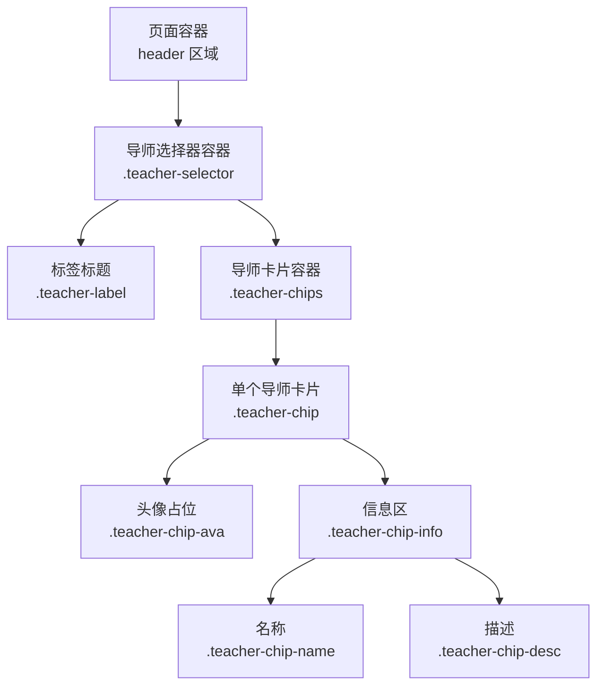
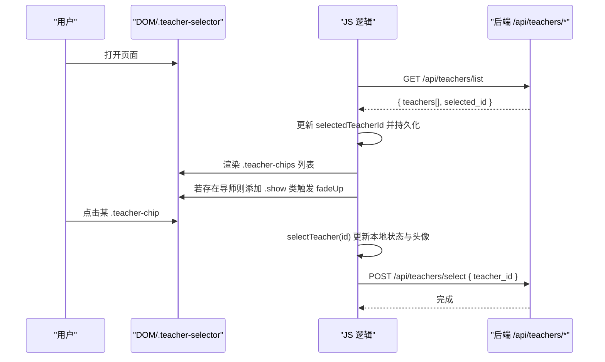
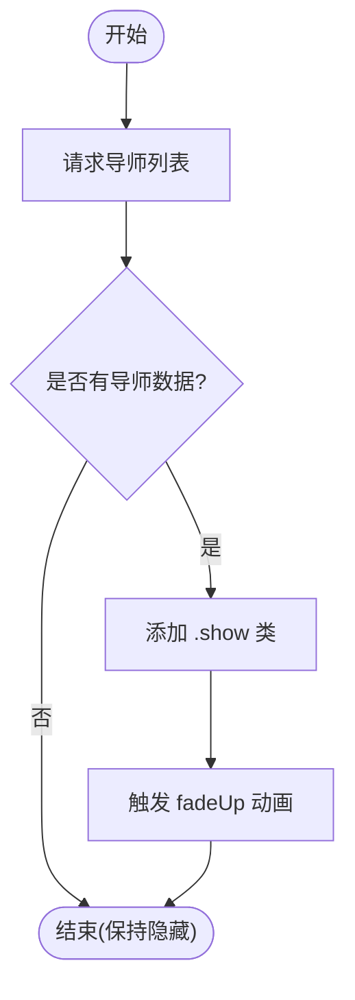
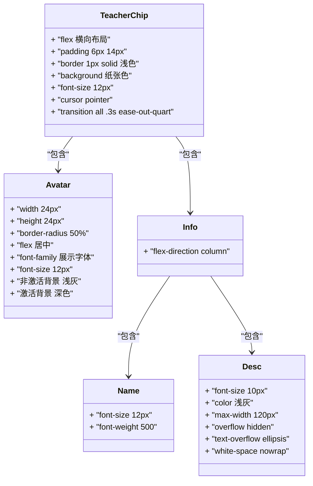
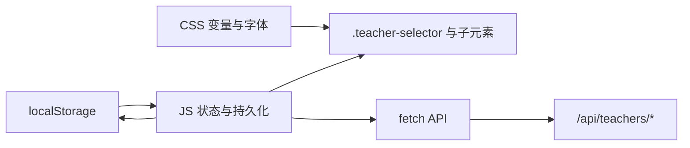

# 导师选择器

<cite>
**本文引用的文件**   
- [index.html](file://hushai/meditation/static/index.html)
</cite>

## 目录
1. [简介](#简介)
2. [项目结构](#项目结构)
3. [核心组件](#核心组件)
4. [架构总览](#架构总览)
5. [详细组件分析](#详细组件分析)
6. [依赖关系分析](#依赖关系分析)
7. [性能考量](#性能考量)
8. [故障排查指南](#故障排查指南)
9. [结论](#结论)

## 简介
本文件为 hush.ai 前端“导师选择器”组件的完整技术文档，聚焦 .teacher-selector 容器的实现与交互。内容涵盖：
- 展开收起动画（fadeUp）与条件显示逻辑
- 导师卡片（.teacher-chip）样式设计，包括头像（.teacher-chip-ava）圆形、颜色变化与字体设置
- 导师信息展示结构（.teacher-chip-info），名称（.teacher-chip-name）与描述（.teacher-chip-desc）的文本截断处理
- 激活状态管理（.active 类）的视觉反馈机制（边框、背景、头像样式）
- 数据绑定与用户点击事件处理的 JavaScript 流程说明

## 项目结构
该组件位于单页应用的主界面文件中，包含内联 CSS 与内联 JS，通过 DOM 操作渲染导师列表并处理交互。

图表来源
- [index.html:990-994](file://hushai/meditation/static/index.html#L990-L994)
- [index.html:300-329](file://hushai/meditation/static/index.html#L300-L329)

章节来源
- [index.html:990-994](file://hushai/meditation/static/index.html#L990-L994)
- [index.html:300-329](file://hushai/meditation/static/index.html#L300-L329)

## 核心组件
- 容器：.teacher-selector
  - 默认隐藏，加载到导师数据后添加 show 类以显示，并触发 fadeUp 动画
- 标签：.teacher-label
  - 小字号、等宽字体、大写提示文案
- 卡片容器：.teacher-chips
  - Flex 布局，自动换行，间距统一
- 卡片：.teacher-chip
  - 圆角边框、悬停高亮、激活态切换背景与边框色
- 头像：.teacher-chip-ava
  - 圆形头像占位，激活与非激活态使用不同背景色；字体采用展示字体
- 信息区：.teacher-chip-info
  - 垂直排列的名称与描述
- 名称：.teacher-chip-name
  - 常规字号、中等字重
- 描述：.teacher-chip-desc
  - 固定最大宽度，超出省略显示

章节来源
- [index.html:300-329](file://hushai/meditation/static/index.html#L300-L329)

## 架构总览
从数据获取到 UI 渲染与交互的整体流程如下：

图表来源
- [index.html:1368-1438](file://hushai/meditation/static/index.html#L1368-L1438)
- [index.html:990-994](file://hushai/meditation/static/index.html#L990-L994)
- [index.html:300-329](file://hushai/meditation/static/index.html#L300-L329)

## 详细组件分析

### 展开收起动画与条件显示
- 动画定义：fadeUp 关键帧，从透明且下移 24px 过渡到不透明且归位
- 容器初始状态：display:none；当添加 .show 时变为 display:block，并应用 fadeUp 动画
- 条件显示：当成功拉取到导师列表且数量大于 0 时，向容器添加 .show 类

图表来源
- [index.html:83-86](file://hushai/meditation/static/index.html#L83-L86)
- [index.html:300-305](file://hushai/meditation/static/index.html#L300-L305)
- [index.html:1387](file://hushai/meditation/static/index.html#L1387)

章节来源
- [index.html:83-86](file://hushai/meditation/static/index.html#L83-L86)
- [index.html:300-305](file://hushai/meditation/static/index.html#L300-L305)
- [index.html:1387](file://hushai/meditation/static/index.html#L1387)

### 导师卡片样式与头像设计
- 卡片基础样式：边框、背景、字号、指针样式、过渡动效
- 悬停态：边框加深、文字变深
- 激活态：边框与文字使用深色，背景切换为暖纸色
- 头像：
  - 尺寸 24x24，圆形（border-radius: 50%）
  - 居中显示首字符或图标占位
  - 非激活态背景为浅灰，激活态背景为深色
  - 字体使用展示字体族，字号适中，字重常规

图表来源
- [index.html:310-329](file://hushai/meditation/static/index.html#L310-L329)

章节来源
- [index.html:310-329](file://hushai/meditation/static/index.html#L310-L329)

### 激活状态管理与视觉反馈
- 状态来源：selectedTeacherId 与当前卡片 id 比较，相等则添加 active 类
- 视觉反馈：
  - 边框颜色由浅色切换为深色
  - 背景色切换为暖纸色
  - 文本颜色切换为深色
  - 头像背景在非激活时为浅灰，激活时为深色
- 持久化：选中后写入 localStorage，刷新页面可恢复

章节来源
- [index.html:1396-1408](file://hushai/meditation/static/index.html#L1396-L1408)
- [index.html:1410-1414](file://hushai/meditation/static/index.html#L1410-L1414)
- [index.html:317-326](file://hushai/meditation/static/index.html#L317-L326)

### 数据绑定与渲染
- 数据源：GET /api/teachers/list，返回 teachers[] 与 selected_id
- 初始化：
  - 优先使用 selected_id 作为默认选中项（若本地未保存）
  - 将 selectedTeacherId 写入 localStorage
- 渲染：
  - 遍历 teachers[]，为每个导师创建 button.teacher-chip
  - 内部结构包含头像、信息区（名称、描述）
  - 根据是否选中动态添加 active 类
- 显示控制：
  - 若存在导师数据，给 .teacher-selector 添加 .show 类以显示

章节来源
- [index.html:1368-1389](file://hushai/meditation/static/index.html#L1368-L1389)
- [index.html:1391-1408](file://hushai/meditation/static/index.html#L1391-L1408)
- [index.html:990-994](file://hushai/meditation/static/index.html#L990-L994)

### 用户点击事件处理
- 点击行为：
  - 调用 selectTeacher(id)
  - 更新 selectedTeacherId 并持久化
  - 重新渲染卡片列表以反映 active 状态
  - 若导师配置了语音性别，同步更新全局语音性别筛选并刷新音色列表
  - 更新对话气泡中的教师头像占位
  - 发送 POST /api/teachers/select 通知后端
- 错误处理：
  - 网络异常或接口失败时静默忽略，不影响其他功能

章节来源
- [index.html:1403-1434](file://hushai/meditation/static/index.html#L1403-L1434)

## 依赖关系分析
- 样式依赖：
  - 变量系统：--ink、--paper、--paper-warm、--stone-*、--ease-out-* 等
  - 字体系统：--font-display、--font-body、--font-mono
- 运行时依赖：
  - localStorage：用于持久化 selectedTeacherId、语音相关配置
  - fetch：用于拉取导师列表与提交选择
  - DOM API：querySelector、createElement、classList、innerHTML 等

图表来源
- [index.html:24-45](file://hushai/meditation/static/index.html#L24-L45)
- [index.html:1368-1438](file://hushai/meditation/static/index.html#L1368-L1438)

章节来源
- [index.html:24-45](file://hushai/meditation/static/index.html#L24-L45)
- [index.html:1368-1438](file://hushai/meditation/static/index.html#L1368-L1438)

## 性能考量
- 渲染优化：
  - 使用 innerHTML 批量插入节点，减少多次 DOM 操作
  - 仅在必要时更新 active 状态与头像占位
- 动画性能：
  - 仅对可见容器应用 transform 与 opacity 动画，避免重排
- 网络请求：
  - 列表请求在登录后执行一次，后续复用本地缓存
  - 选择动作使用轻量 POST，失败静默处理，避免阻塞主线程

[本节为通用指导，无需代码引用]

## 故障排查指南
- 导师列表未显示
  - 检查登录态与 token 是否存在
  - 确认 /api/teachers/list 返回 teachers 数组是否为空
  - 查看控制台是否有 401 或未授权错误
- 点击无响应
  - 确认按钮已正确绑定 click 事件
  - 检查 selectTeacher 函数是否被调用
  - 查看 /api/teachers/select 是否成功
- 激活态未生效
  - 检查 selectedTeacherId 是否正确写入 localStorage
  - 确认渲染时 active 类是否按 id 匹配添加
- 头像未更新
  - 确认 getSelectedTeacher 能拿到对应导师对象
  - 检查消息区头像占位的文本替换逻辑

章节来源
- [index.html:1368-1438](file://hushai/meditation/static/index.html#L1368-L1438)

## 结论
导师选择器通过简洁的 CSS 与原生 JS 实现了优雅的展开动画、清晰的卡片样式与直观的激活反馈。其数据流清晰：拉取列表 → 渲染卡片 → 用户选择 → 持久化与后端同步。整体实现轻量、可维护性强，适合在冥想陪伴场景中快速扩展更多导师与个性化能力。