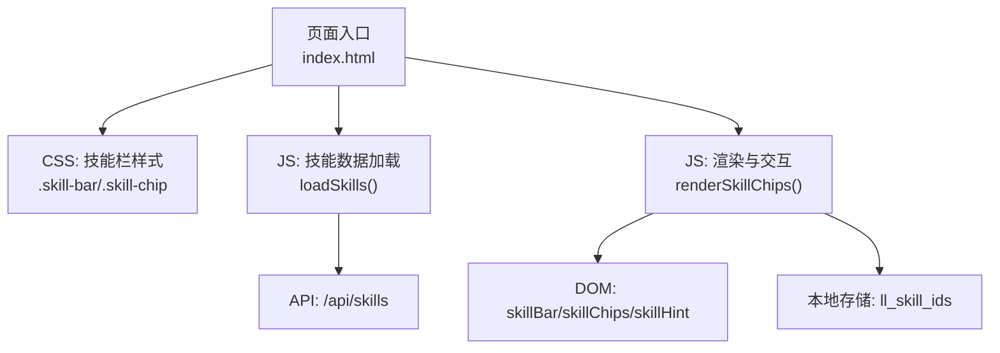
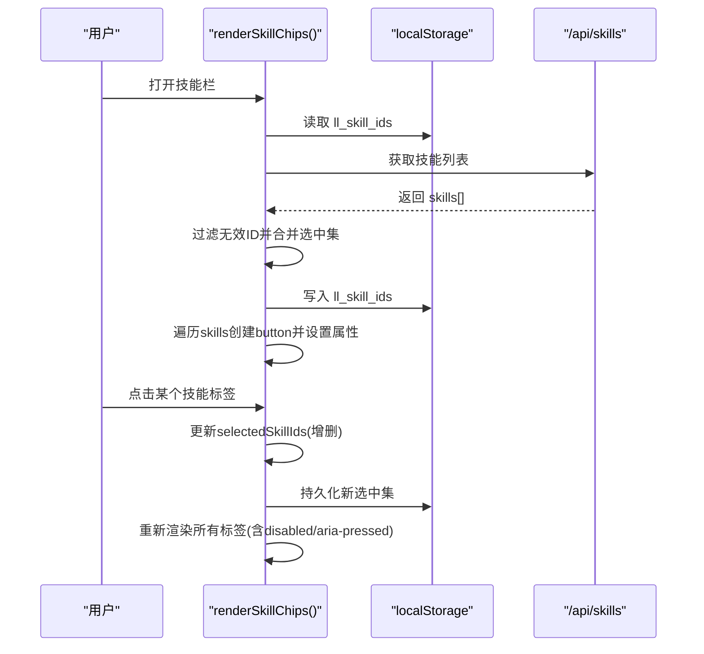
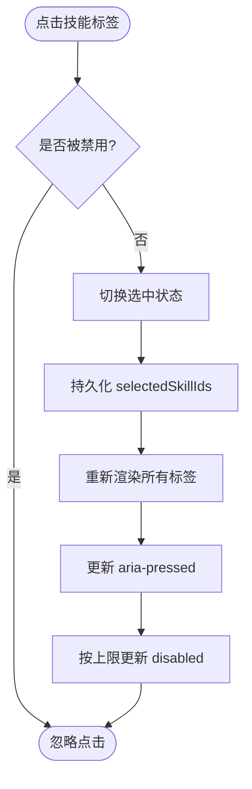
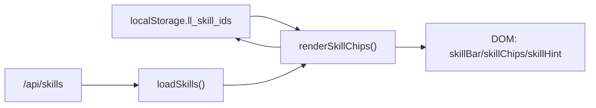

# 技能栏

<cite>
**本文引用的文件**
- [index.html](file://hushai/meditation/static/index.html)
</cite>

## 目录
1. [简介](#简介)
2. [项目结构](#项目结构)
3. [核心组件](#核心组件)
4. [架构总览](#架构总览)
5. [详细组件分析](#详细组件分析)
6. [依赖关系分析](#依赖关系分析)
7. [性能考虑](#性能考虑)
8. [故障排查指南](#故障排查指南)
9. [结论](#结论)

## 简介
本文件为 hush.ai 的“技能栏”组件提供完整的前端实现文档，覆盖布局与样式、交互状态管理（多选与禁用）、动画与条件显示机制，以及数据渲染与事件处理流程。该组件用于在对话界面顶部展示可选的“技能标签”，支持多选、最大数量限制、无障碍属性更新与视觉反馈。

## 项目结构
技能栏相关代码位于前端单页应用的主 HTML 文件中，包含内联 CSS 与 JavaScript：
- 样式定义：技能容器、标题区、标签容器、单个标签、悬停/选中/禁用态等
- 模板与 DOM 操作：动态生成标签按钮、绑定点击事件、维护选中集合与持久化
- 数据加载：从后端接口拉取技能列表并渲染

图表来源
- [index.html:363-388](file://hushai/meditation/static/index.html#L363-L388)
- [index.html:1326-1366](file://hushai/meditation/static/index.html#L1326-L1366)

章节来源
- [index.html:363-388](file://hushai/meditation/static/index.html#L363-L388)
- [index.html:1326-1366](file://hushai/meditation/static/index.html#L1326-L1366)

## 核心组件
- 容器 .skill-bar
  - 布局：flex-direction: column；内部元素垂直排列
  - 间距：gap: 8px（标题与标签区域之间）
  - 可见性：默认 display:none；通过添加 show 类切换为 display:flex
  - 装饰：底部边框、背景色、入场动画 fadeUp
- 头部 .skill-bar-hd
  - 显示已选计数提示与可选上限说明
- 标签容器 .skill-chips
  - 布局：flex-wrap: wrap；标签间 gap: 6px
- 标签 .skill-chip
  - 边框：1px solid 浅灰
  - 背景与文字：默认浅色背景与中性文字色
  - 过渡：transition: all .25s var(--ease-out-quart)
  - 最大宽度：max-width: 100%（防止长文本溢出）
  - 悬停态：边框加深、文字变深
  - 选中态：aria-pressed="true" 时背景与边框变为深色，文字反白
  - 禁用态：opacity:.35；cursor:not-allowed

章节来源
- [index.html:363-388](file://hushai/meditation/static/index.html#L363-L388)

## 架构总览
技能栏的数据流与交互流程如下：
- 登录后或页面初始化时调用 loadSkills() 请求 /api/skills
- 将返回的技能数组缓存到内存，过滤掉无效 ID，持久化 selectedSkillIds
- renderSkillChips() 根据当前选中集合渲染按钮，设置 aria-pressed 与 disabled 状态
- 用户点击标签时，更新选中集合、持久化并重新渲染
- 当选中数达到上限且某标签未选中时，将其置为 disabled

图表来源
- [index.html:1326-1366](file://hushai/meditation/static/index.html#L1326-L1366)

## 详细组件分析

### 布局与样式规范
- 容器 .skill-bar
  - flex-direction: column，确保标题与标签区域纵向排列
  - padding: 10px 28px，上下左右留白统一
  - border-bottom: 1px solid 浅灰，作为分隔线
  - background: 暖纸色，提升层次
  - animation: fadeUp .35s ease-out-expo both，进入时有轻微上移淡入
  - 显隐控制：.skill-bar.show { display:flex }
- 头部 .skill-bar-hd
  - 使用等宽字体、小字号与大字距，呈现“系统感”提示
- 标签容器 .skill-chips
  - flex-wrap: wrap 允许换行；gap: 6px 保持紧凑
- 标签 .skill-chip
  - 边框与背景：默认浅色边框与背景，文字为中灰色
  - 过渡：all .25s ease-out-quart，保证交互顺滑
  - 最大宽度：max-width: 100%，避免超长名称破坏布局
  - 悬停：边框加深、文字变深
  - 选中：[aria-pressed="true"] 时背景与边框变为深色，文字反白
  - 禁用：opacity:.35；cursor:not-allowed

章节来源
- [index.html:363-388](file://hushai/meditation/static/index.html#L363-L388)

### 多选状态管理与无障碍
- 状态源：selectedSkillIds（内存数组），持久化为 localStorage.ll_skill_ids
- 渲染逻辑：
  - 对每个技能项，判断是否在选中集中，设置 aria-pressed="true"/"false"
  - 若未达到上限且未选中，则允许点击；否则设为 disabled
- 交互逻辑：
  - 点击时，若已选中则移除，未选中则加入（需小于等于上限）
  - 每次变更后立即持久化并重新渲染，保证视图与状态一致
- 无障碍：
  - 使用 aria-pressed 表达可按压控件的选中状态
  - 配合 :disabled 语义，辅助技术可识别不可用项

图表来源
- [index.html:1326-1366](file://hushai/meditation/static/index.html#L1326-L1366)

章节来源
- [index.html:1326-1366](file://hushai/meditation/static/index.html#L1326-L1366)

### 禁用状态处理
- 触发条件：当已选数量达到上限 SKILL_MAX，且某标签未被选中时，将其 disabled=true
- 视觉表现：
  - opacity:.35 降低透明度
  - cursor:not-allowed 明确不可交互
- 行为保障：点击事件回调中再次检查 disabled，避免误触

章节来源
- [index.html:1326-1366](file://hushai/meditation/static/index.html#L1326-L1366)
- [index.html:363-388](file://hushai/meditation/static/index.html#L363-L388)

### 展开收起动画与条件显示
- 条件显示：
  - 当存在可用技能时，给 .skill-bar 添加 show 类以显示
  - 无可用技能时移除 show 类隐藏
- 动画效果：
  - 使用 @keyframes fadeUp 实现从下方淡入
  - 通过 transition 与 animation 组合，获得平滑的展开体验

章节来源
- [index.html:363-388](file://hushai/meditation/static/index.html#L363-L388)
- [index.html:1326-1366](file://hushai/meditation/static/index.html#L1326-L1366)

### 数据渲染与事件处理（JavaScript）
- 数据加载
  - 调用 fetch(API+'/api/skills') 获取技能列表
  - 过滤本地已保存的选中 ID，仅保留存在于服务端列表中的有效项
  - 持久化后渲染
- 渲染函数
  - 清空标签容器
  - 遍历技能列表，为每项创建 button.skill-chip
  - 设置 aria-pressed、title、textContent
  - 根据上限与当前选中情况设置 disabled
  - 绑定 click 事件：切换选中、持久化、重渲染
- 事件处理要点
  - 点击前校验 disabled
  - 使用 splice/push 更新 selectedSkillIds
  - 每次变更后立即持久化并刷新视图

章节来源
- [index.html:1326-1366](file://hushai/meditation/static/index.html#L1326-L1366)

## 依赖关系分析
- 外部依赖
  - Web Storage：localStorage 用于持久化 selectedSkillIds
  - Fetch API：从 /api/skills 拉取技能数据
- 内部依赖
  - DOM 引用：skillBar、skillChips、skillHint
  - 常量：SKILL_MAX（最大可选数量）
- 耦合与内聚
  - 渲染与状态管理集中在同一脚本块，内聚度高
  - 与登录流程解耦，仅在 token 存在时加载

图表来源
- [index.html:1326-1366](file://hushai/meditation/static/index.html#L1326-L1366)

章节来源
- [index.html:1326-1366](file://hushai/meditation/static/index.html#L1326-L1366)

## 性能考虑
- 渲染优化
  - 使用 innerHTML='' 清空容器后批量 appendChild，减少重排次数
  - 仅在必要时更新 DOM，避免频繁全量刷新
- 网络请求
  - 建议在登录成功后一次性加载，避免重复请求
- 动画与过渡
  - 使用 GPU 友好的 transform/opacity 动画，避免布局抖动
  - prefers-reduced-motion 媒体查询下应禁用不必要动画

## 故障排查指南
- 技能栏不显示
  - 检查是否存在可用技能（allSkills.length > 0）
  - 确认 .skill-bar 是否添加了 show 类
- 无法选择更多技能
  - 核对已选数量是否已达上限 SKILL_MAX
  - 检查对应标签是否被设置为 disabled
- 无障碍状态不一致
  - 确认 aria-pressed 是否正确随选中状态更新
- 数据不同步
  - 检查 localStorage.ll_skill_ids 是否与当前视图一致
  - 确认加载后是否执行了过滤与持久化

章节来源
- [index.html:1326-1366](file://hushai/meditation/static/index.html#L1326-L1366)
- [index.html:363-388](file://hushai/meditation/static/index.html#L363-L388)

## 结论
技能栏组件通过简洁的 Flex 布局与清晰的样式分层，实现了直观的多选能力与良好的无障碍体验。其状态管理采用内存+本地存储的双层策略，既保证了交互即时性，也具备跨会话一致性。结合轻量动画与条件显示机制，整体交互流畅、可维护性强。后续可在数据加载失败、空状态提示与键盘导航方面进一步增强健壮性与可访问性。