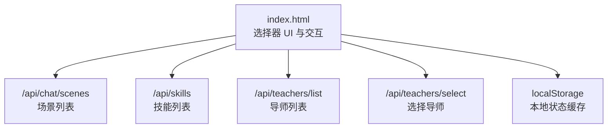
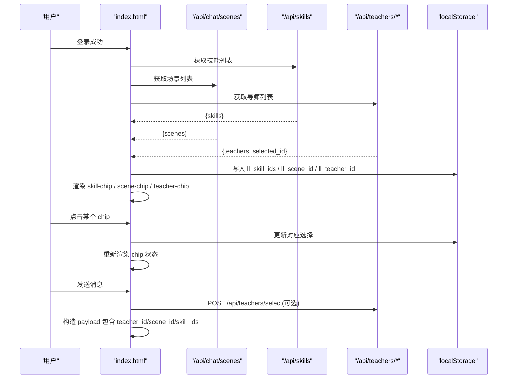
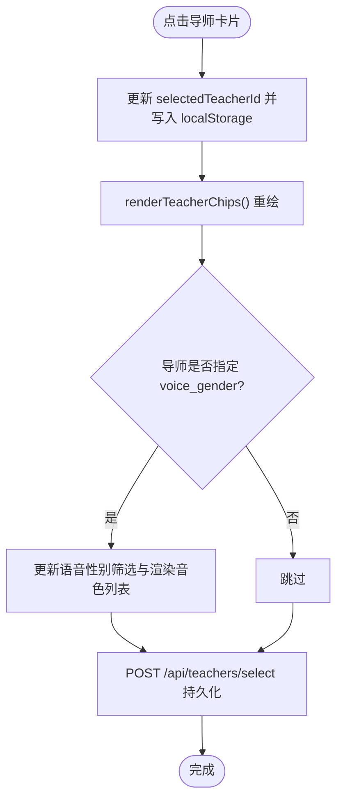
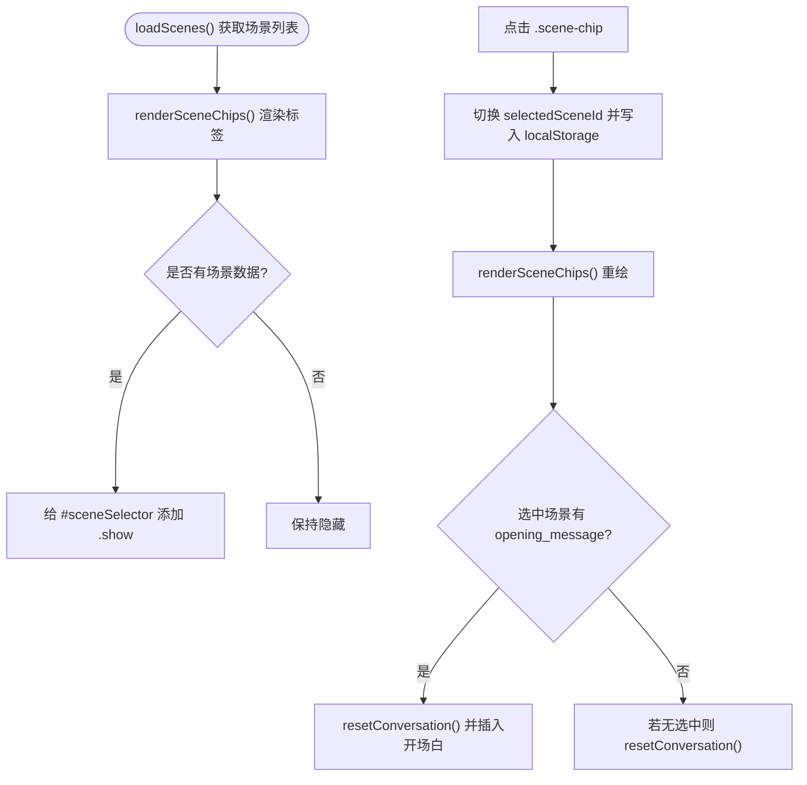
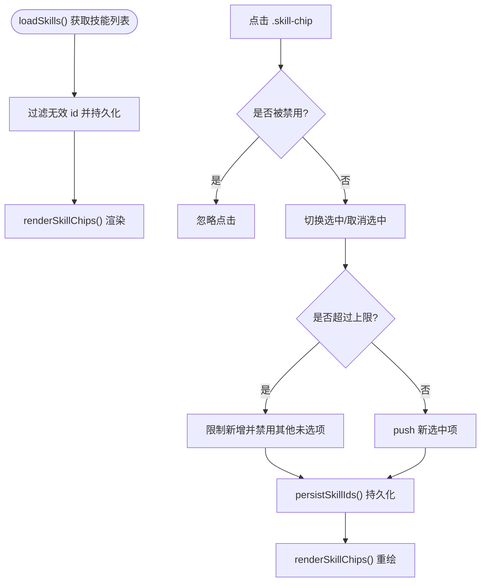
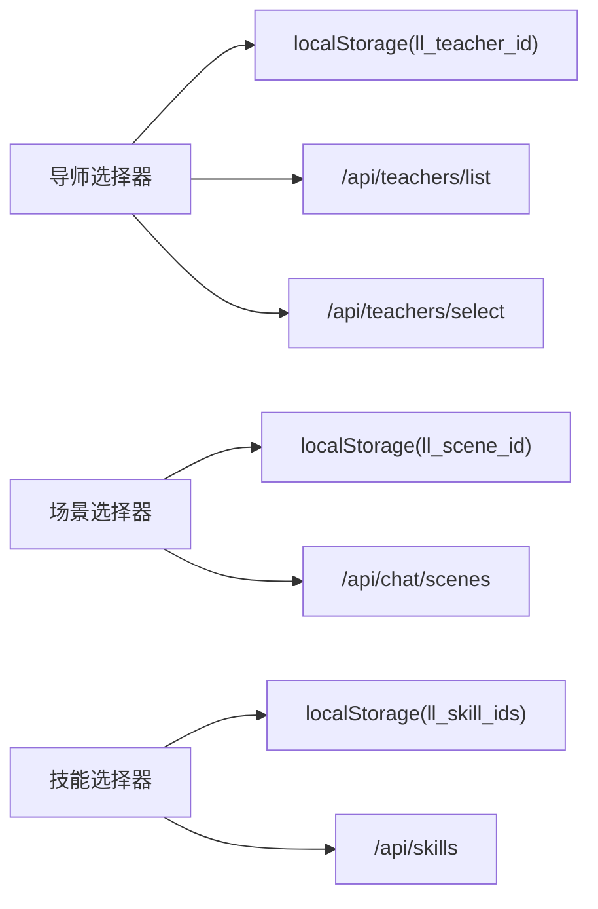

# 选择器组件

<cite>
**本文引用的文件**   
- [index.html](file://hushai/meditation/static/index.html)
- [teachers.py](file://hushai/meditation/api/teachers.py)
</cite>

## 目录
1. [简介](#简介)
2. [项目结构](#项目结构)
3. [核心组件](#核心组件)
4. [架构总览](#架构总览)
5. [详细组件分析](#详细组件分析)
6. [依赖关系分析](#依赖关系分析)
7. [性能与可访问性](#性能与可访问性)
8. [故障排查指南](#故障排查指南)
9. [结论](#结论)

## 简介
本文件为 hush.ai 前端“选择器组件”的完整技术文档，聚焦以下三类选择器：
- 导师选择器（.teacher-selector）：展示导师卡片（.teacher-chip），支持头像、名称、描述与激活态切换。
- 场景选择器（.scene-selector）：管理场景标签（.scene-chip）的单选状态与动画效果，并在选中时注入开场白。
- 技能选择器（.skill-bar）：提供技能标签（.skill-chip）的多选能力，包含上限控制与禁用态处理。

同时说明选择器的展开收起动画（fadeUp）、条件显示逻辑、数据绑定机制以及用户交互事件处理流程。

## 项目结构
选择器相关的前端实现集中在单页应用入口文件中，样式与脚本均内联于页面中；后端接口用于加载导师列表与选择结果持久化。

图表来源
- [index.html:991-1008](file://hushai/meditation/static/index.html#L991-L1008)
- [index.html:1280-1315](file://hushai/meditation/static/index.html#L1280-L1315)
- [index.html:1326-1366](file://hushai/meditation/static/index.html#L1326-L1366)
- [index.html:1368-1438](file://hushai/meditation/static/index.html#L1368-L1438)
- [teachers.py:121-138](file://hushai/meditation/api/teachers.py#L121-L138)

章节来源
- [index.html:991-1008](file://hushai/meditation/static/index.html#L991-L1008)
- [index.html:1280-1315](file://hushai/meditation/static/index.html#L1280-L1315)
- [index.html:1326-1366](file://hushai/meditation/static/index.html#L1326-L1366)
- [index.html:1368-1438](file://hushai/meditation/static/index.html#L1368-L1438)
- [teachers.py:121-138](file://hushai/meditation/api/teachers.py#L121-L138)

## 核心组件
- 导师选择器（.teacher-selector）
  - 容器：.teacher-selector
  - 标签区：.teacher-label
  - 卡片容器：.teacher-chips
  - 卡片元素：.teacher-chip（含 .teacher-chip-ava、.teacher-chip-info、.teacher-chip-name、.teacher-chip-desc）
- 场景选择器（.scene-selector）
  - 容器：.scene-selector
  - 标签区：.scene-label
  - 标签容器：.scene-chips
  - 标签元素：.scene-chip（含 span 文本）
- 技能选择器（.skill-bar）
  - 容器：.skill-bar（头部 .skill-bar-hd，提示 #skillHint）
  - 标签容器：.skill-chips
  - 标签元素：.skill-chip（使用 aria-pressed 表达选中态）

章节来源
- [index.html:300-389](file://hushai/meditation/static/index.html#L300-L389)
- [index.html:991-1008](file://hushai/meditation/static/index.html#L991-L1008)

## 架构总览
选择器采用“数据驱动 + 本地缓存 + 条件渲染”的模式：
- 登录后并行加载导师、场景、技能数据。
- 将当前选择写入 localStorage，保证刷新后状态一致。
- 通过添加/移除 .show 类名触发 fadeUp 动画并控制显示。
- 发送消息时将所选 teacher_id、scene_id、skill_ids 一并提交到后端。

图表来源
- [index.html:1584-1604](file://hushai/meditation/static/index.html#L1584-L1604)
- [index.html:1280-1315](file://hushai/meditation/static/index.html#L1280-L1315)
- [index.html:1326-1366](file://hushai/meditation/static/index.html#L1326-L1366)
- [index.html:1368-1438](file://hushai/meditation/static/index.html#L1368-L1438)
- [index.html:1806-1811](file://hushai/meditation/static/index.html#L1806-L1811)
- [teachers.py:121-138](file://hushai/meditation/api/teachers.py#L121-L138)

## 详细组件分析

### 导师选择器（.teacher-selector）
- 显示逻辑
  - 登录后调用 loadTeachers() 拉取 /api/teachers/list，若返回 selected_id 且本地未保存则同步到本地。
  - renderTeacherChips() 遍历 allTeachers 生成 .teacher-chip，按 t.id === selectedTeacherId 追加 active 类。
  - 当 allTeachers.length > 0 时，给 #teacherSelector 添加 .show 以触发 fadeUp 动画。
- 头像样式与信息展示
  - .teacher-chip-ava 圆形区域，active 与非 active 背景色不同。
  - .teacher-chip-info 包含 .teacher-chip-name 与 .teacher-chip-desc（超长省略）。
- 交互与数据绑定
  - 点击 .teacher-chip 触发 selectTeacher(id)，更新 selectedTeacherId 并写入 ll_teacher_id。
  - 若导师携带 voice_gender，会联动更新语音性别筛选与音色列表。
  - 同步更新对话气泡中的教师头像与名称。
  - 发起 POST /api/teachers/select 持久化选择。

图表来源
- [index.html:1368-1438](file://hushai/meditation/static/index.html#L1368-L1438)
- [teachers.py:121-138](file://hushai/meditation/api/teachers.py#L121-L138)

章节来源
- [index.html:300-329](file://hushai/meditation/static/index.html#L300-L329)
- [index.html:1368-1438](file://hushai/meditation/static/index.html#L1368-L1438)
- [teachers.py:121-138](file://hushai/meditation/api/teachers.py#L121-L138)

### 场景选择器（.scene-selector）
- 功能概述
  - 单选模式：同一时间仅一个 .scene-chip 处于 active。
  - 动画效果：.scene-chip::before 在 active 时 scaleX 填充背景，配合 hover 过渡。
  - 条件显示：当存在场景数据时，给 #sceneSelector 添加 .show。
- 交互与数据绑定
  - loadScenes() 拉取 /api/chat/scenes，渲染 renderSceneChips()。
  - 点击 .scene-chip：
    - 若已选中则取消选择（清空 selectedSceneId 并从 localStorage 移除）。
    - 否则选中该场景（写入 ll_scene_id）。
    - 若选中场景包含 opening_message，则重置会话并插入开场白。
  - 切换“冥想陪伴/知识库问答”模式时，控制 .scene-selector 的显示与隐藏。

图表来源
- [index.html:1280-1315](file://hushai/meditation/static/index.html#L1280-L1315)
- [index.html:1269-1278](file://hushai/meditation/static/index.html#L1269-L1278)

章节来源
- [index.html:331-361](file://hushai/meditation/static/index.html#L331-L361)
- [index.html:1280-1315](file://hushai/meditation/static/index.html#L1280-L1315)
- [index.html:1269-1278](file://hushai/meditation/static/index.html#L1269-L1278)

### 技能选择器（.skill-bar）
- 交互设计
  - 多选模式：每个 .skill-chip 独立维护选中态（aria-pressed="true/false"）。
  - 上限控制：最多选择 SKILL_MAX 项，超出时未选中的 chip 设为 disabled。
  - 提示文案：根据已选数量动态更新 #skillHint。
- 数据绑定
  - loadSkills() 拉取 /api/skills，过滤掉已失效的 id，再持久化到 ll_skill_ids。
  - renderSkillChips() 根据 selectedSkillIds 渲染按钮状态与禁用态。
  - 发送消息时，若非知识库模式且 selectedSkillIds 非空，将其作为 skill_ids 加入请求体。

图表来源
- [index.html:1326-1366](file://hushai/meditation/static/index.html#L1326-L1366)
- [index.html:1806-1811](file://hushai/meditation/static/index.html#L1806-L1811)

章节来源
- [index.html:365-389](file://hushai/meditation/static/index.html#L365-L389)
- [index.html:1326-1366](file://hushai/meditation/static/index.html#L1326-L1366)
- [index.html:1806-1811](file://hushai/meditation/static/index.html#L1806-L1811)

### 展开收起动画与条件显示
- 动画定义：@keyframes fadeUp 从 translateY(24px)+opacity:0 到原位+opacity:1。
- 条件显示：
  - 导师：当 allTeachers.length > 0 时，给 #teacherSelector 添加 .show。
  - 场景：当 allScenes.length > 0 时，给 #sceneSelector 添加 .show。
  - 技能：当 allSkills.length > 0 时，给 #skillBar 添加 .show。
- 模式切换：
  - “冥想陪伴”模式下显示 .scene-selector。
  - “知识库问答”模式下隐藏 .scene-selector。

章节来源
- [index.html:83-86](file://hushai/meditation/static/index.html#L83-L86)
- [index.html:300-305](file://hushai/meditation/static/index.html#L300-L305)
- [index.html:334-339](file://hushai/meditation/static/index.html#L334-L339)
- [index.html:366-371](file://hushai/meditation/static/index.html#L366-L371)
- [index.html:1269-1278](file://hushai/meditation/static/index.html#L1269-L1278)
- [index.html:1280-1286](file://hushai/meditation/static/index.html#L1280-L1286)
- [index.html:1329-1332](file://hushai/meditation/static/index.html#L1329-L1332)

### 数据绑定与事件处理示例（路径引用）
- 场景数据加载与渲染
  - 加载：[index.html:1280-1287](file://hushai/meditation/static/index.html#L1280-L1287)
  - 渲染与点击：[index.html:1289-1315](file://hushai/meditation/static/index.html#L1289-L1315)
- 技能数据加载与渲染
  - 加载与过滤：[index.html:1356-1366](file://hushai/meditation/static/index.html#L1356-L1366)
  - 渲染与点击：[index.html:1329-1355](file://hushai/meditation/static/index.html#L1329-L1355)
- 导师数据加载与选择
  - 加载与渲染：[index.html:1372-1408](file://hushai/meditation/static/index.html#L1372-L1408)
  - 选择与持久化：[index.html:1410-1434](file://hushai/meditation/static/index.html#L1410-L1434)
  - 后端接口：[teachers.py:121-138](file://hushai/meditation/api/teachers.py#L121-L138)
- 发送消息时的参数组装
  - 参数注入：[index.html:1806-1811](file://hushai/meditation/static/index.html#L1806-L1811)

## 依赖关系分析
- 前端内部依赖
  - 三个选择器共享统一的动画与主题变量，并通过 DOM class 控制显隐。
  - 选择器状态统一落盘至 localStorage，避免刷新丢失。
- 外部接口依赖
  - 场景：GET /api/chat/scenes
  - 技能：GET /api/skills
  - 导师：GET /api/teachers/list、POST /api/teachers/select
- 耦合与内聚
  - 各选择器逻辑相对独立，内聚度高；仅在发送消息阶段聚合参数，降低耦合。

图表来源
- [index.html:1280-1315](file://hushai/meditation/static/index.html#L1280-L1315)
- [index.html:1326-1366](file://hushai/meditation/static/index.html#L1326-L1366)
- [index.html:1368-1438](file://hushai/meditation/static/index.html#L1368-L1438)
- [teachers.py:121-138](file://hushai/meditation/api/teachers.py#L121-L138)

章节来源
- [index.html:1280-1315](file://hushai/meditation/static/index.html#L1280-L1315)
- [index.html:1326-1366](file://hushai/meditation/static/index.html#L1326-L1366)
- [index.html:1368-1438](file://hushai/meditation/static/index.html#L1368-L1438)
- [teachers.py:121-138](file://hushai/meditation/api/teachers.py#L121-L138)

## 性能与可访问性
- 性能
  - 列表渲染采用 innerHTML 批量替换，减少多次 DOM 操作开销。
  - 动画使用 CSS transform 与 opacity，避免布局抖动。
  - 条件显示通过 class 切换，避免频繁计算样式。
- 可访问性
  - 技能标签使用 aria-pressed 表达选中态，便于辅助技术识别。
  - 所有交互元素具备合适的 cursor 与 focus-visible 样式。

章节来源
- [index.html:378-389](file://hushai/meditation/static/index.html#L378-L389)
- [index.html:736-746](file://hushai/meditation/static/index.html#L736-L746)

## 故障排查指南
- 选择器不显示
  - 检查对应数据接口是否返回有效数组；确认是否在成功后添加了 .show。
  - 参考：[index.html:1280-1286](file://hushai/meditation/static/index.html#L1280-L1286)、[index.html:1329-1332](file://hushai/meditation/static/index.html#L1329-L1332)、[index.html:1386-1388](file://hushai/meditation/static/index.html#L1386-L1388)
- 技能无法多选或全部禁用
  - 检查 SKILL_MAX 与 selectedSkillIds 长度；确认未选中项是否被错误设置 disabled。
  - 参考：[index.html:1344-1352](file://hushai/meditation/static/index.html#L1344-L1352)
- 场景切换无开场白
  - 确认选中场景对象是否包含 opening_message；检查 resetConversation 是否被调用。
  - 参考：[index.html:1303-1312](file://hushai/meditation/static/index.html#L1303-L1312)
- 导师选择未生效
  - 检查是否成功调用 /api/teachers/select；确认 selected_id 是否正确回写。
  - 参考：[index.html:1429-1434](file://hushai/meditation/static/index.html#L1429-L1434)、[teachers.py:121-138](file://hushai/meditation/api/teachers.py#L121-L138)

章节来源
- [index.html:1280-1315](file://hushai/meditation/static/index.html#L1280-L1315)
- [index.html:1329-1355](file://hushai/meditation/static/index.html#L1329-L1355)
- [index.html:1386-1434](file://hushai/meditation/static/index.html#L1386-L1434)
- [teachers.py:121-138](file://hushai/meditation/api/teachers.py#L121-L138)

## 结论
选择器组件通过简洁的数据流与清晰的视觉反馈，实现了导师、场景、技能三类选择能力的统一体验。其优势在于：
- 状态集中、持久化可靠；
- 动画自然、交互直观；
- 与消息发送流程紧密集成，参数传递清晰。

建议后续优化方向：
- 对大量数据场景增加虚拟滚动或分页加载；
- 为更多交互元素补充 ARIA 属性以提升无障碍体验；
- 将选择器逻辑进一步模块化，提升复用性与可测试性。