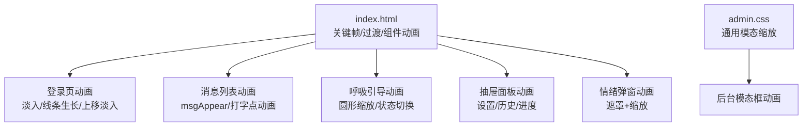
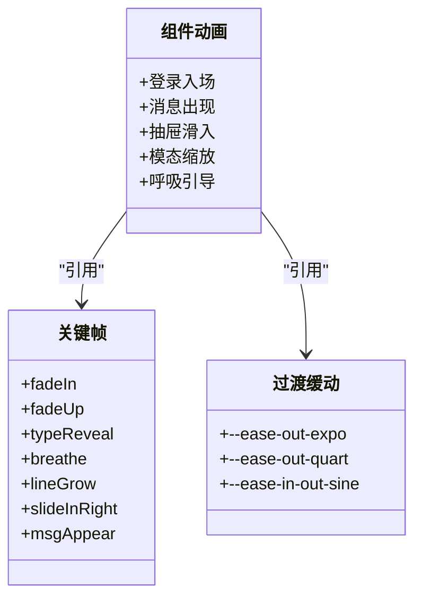
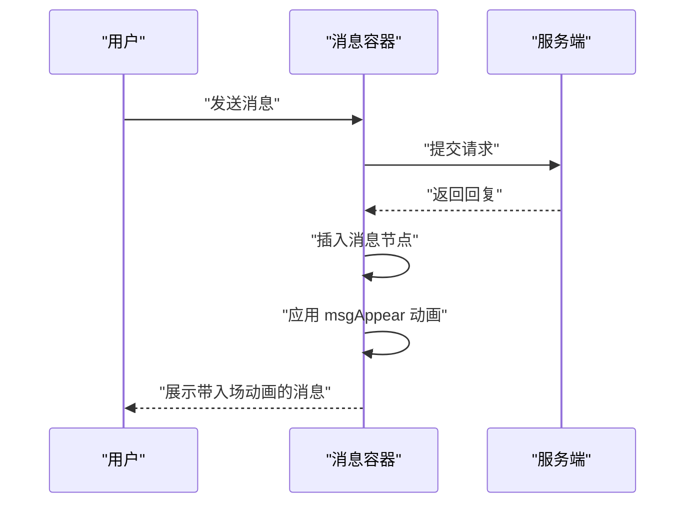
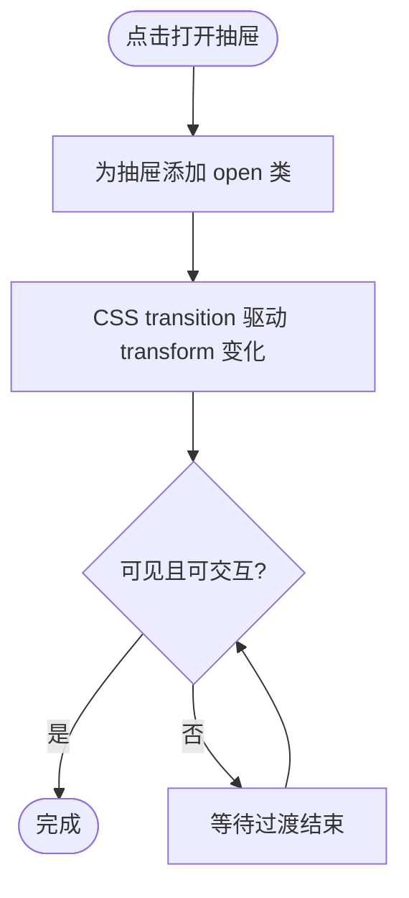
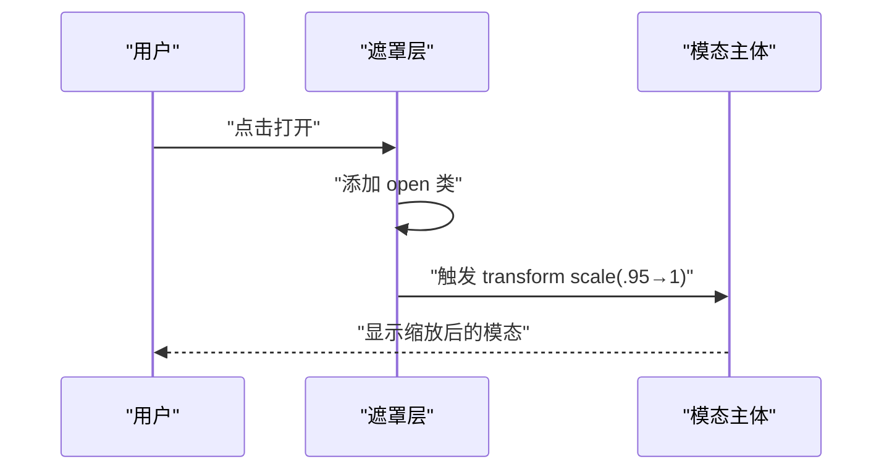
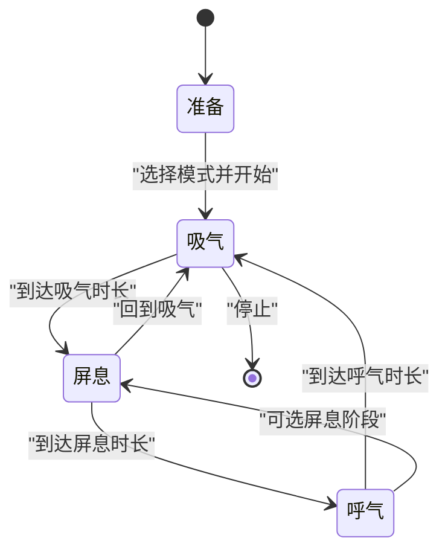
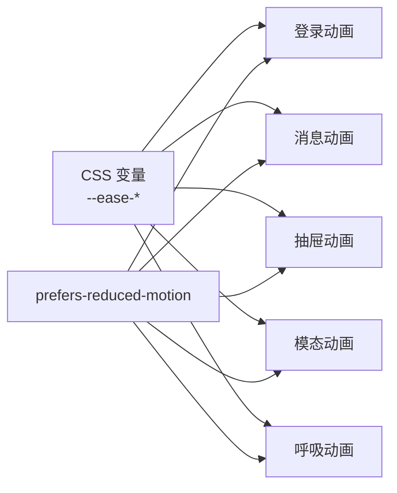

# 动画系统

<cite>
**本文引用的文件**   
- [hushai/meditation/static/index.html](file://hushai/meditation/static/index.html)
- [hushai/meditation/admin/static/css/admin.css](file://hushai/meditation/admin/static/css/admin.css)
- [scripts/frontend_qa.py](file://scripts/frontend_qa.py)
</cite>

## 目录
1. [简介](#简介)
2. [项目结构](#项目结构)
3. [核心组件](#核心组件)
4. [架构总览](#架构总览)
5. [详细组件分析](#详细组件分析)
6. [依赖关系分析](#依赖关系分析)
7. [性能考量](#性能考量)
8. [故障排查指南](#故障排查指南)
9. [结论](#结论)
10. [附录](#附录)

## 简介
本文件系统化梳理 hush.ai 前端动画体系，覆盖关键帧动画定义、过渡缓动函数配置、组件级动画实现（消息出现、抽屉滑入、模态框缩放）、可访问性支持（减少动画偏好）、以及性能优化与调试实践。目标是帮助开发者快速理解并扩展该动画系统，同时确保在低性能设备与无障碍需求下仍保持良好体验。

## 项目结构
动画相关代码主要集中在冥想界面主页面与后台管理样式中：
- 冥想界面主页面：集中定义了关键帧动画、全局缓动变量、组件动画与交互逻辑。
- 后台管理样式：提供通用模态框缩放动画等基础 UI 动效。
- 前端质量检查脚本：包含对“减少动画偏好”的自动化检测能力。

图表来源
- [hushai/meditation/static/index.html:80-105](file://hushai/meditation/static/index.html#L80-L105)
- [hushai/meditation/static/index.html:741-746](file://hushai/meditation/static/index.html#L741-L746)
- [hushai/meditation/static/index.html:761-775](file://hushai/meditation/static/index.html#L761-L775)
- [hushai/meditation/static/index.html:544-559](file://hushai/meditation/static/index.html#L544-L559)
- [hushai/meditation/static/index.html:669-682](file://hushai/meditation/static/index.html#L669-L682)
- [hushai/meditation/static/index.html:848-861](file://hushai/meditation/static/index.html#L848-L861)
- [hushai/meditation/admin/static/css/admin.css:1597-1637](file://hushai/meditation/admin/static/css/admin.css#L1597-L1637)

章节来源
- [hushai/meditation/static/index.html:80-105](file://hushai/meditation/static/index.html#L80-L105)
- [hushai/meditation/static/index.html:741-746](file://hushai/meditation/static/index.html#L741-L746)
- [hushai/meditation/static/index.html:761-775](file://hushai/meditation/static/index.html#L761-L775)
- [hushai/meditation/static/index.html:544-559](file://hushai/meditation/static/index.html#L544-L559)
- [hushai/meditation/static/index.html:669-682](file://hushai/meditation/static/index.html#L669-L682)
- [hushai/meditation/static/index.html:848-861](file://hushai/meditation/static/index.html#L848-L861)
- [hushai/meditation/admin/static/css/admin.css:1597-1637](file://hushai/meditation/admin/static/css/admin.css#L1597-L1637)

## 核心组件
本节聚焦于关键帧动画与过渡缓动函数的统一设计。

- 关键帧动画
  - 淡入类：fadeIn、fadeUp
  - 打字机效果：typeReveal
  - 呼吸提示：breathe
  - 线条生长：lineGrow
  - 消息出现：msgAppear
  - 侧滑进入：slideInRight

- 过渡缓动函数（cubic-bezier）
  - 快速出加速：--ease-out-expo
  - 温和出加速：--ease-out-quart
  - 平滑进出：--ease-in-out-sine

这些动画与缓动通过 CSS 变量统一管理，便于在多处复用并保持一致的节奏感。

章节来源
- [hushai/meditation/static/index.html:41-45](file://hushai/meditation/static/index.html#L41-L45)
- [hushai/meditation/static/index.html:83-105](file://hushai/meditation/static/index.html#L83-L105)

## 架构总览
整体动画架构由“关键帧 + 过渡 + 组件状态”三层构成：
- 关键帧层：定义最小粒度的视觉变化（透明度、位移、缩放）。
- 过渡层：使用 cubic-bezier 控制时间曲线，决定动效的“质感”。
- 组件层：将上述原子动画组合到具体 UI 组件（登录、消息、抽屉、模态、呼吸引导）。

图表来源
- [hushai/meditation/static/index.html:41-45](file://hushai/meditation/static/index.html#L41-L45)
- [hushai/meditation/static/index.html:83-105](file://hushai/meditation/static/index.html#L83-L105)
- [hushai/meditation/static/index.html:761-775](file://hushai/meditation/static/index.html#L761-L775)
- [hushai/meditation/static/index.html:544-559](file://hushai/meditation/static/index.html#L544-L559)
- [hushai/meditation/static/index.html:669-682](file://hushai/meditation/static/index.html#L669-L682)
- [hushai/meditation/static/index.html:848-861](file://hushai/meditation/static/index.html#L848-L861)

## 详细组件分析

### 关键帧动画定义
- 淡入动画（fadeIn, fadeUp）
  - fadeIn：仅透明度从 0 到 1，适合背景或装饰元素渐显。
  - fadeUp：透明度从 0 到 1，同时 Y 轴上移，营造“浮现”感，常用于标题、段落、按钮组等。
- 打字机效果（typeReveal）
  - 小幅度上移配合透明度变化，用于“正在输入”的点状指示器，形成有节奏的跳动。
- 呼吸动画（breathe）
  - 周期性透明度变化，模拟呼吸节律，适用于状态指示灯或呼吸引导中的辅助光晕。
- 线条生长动画（lineGrow）
  - 基于 scaleX 的水平展开，常用于分割线或装饰线的“绘制”效果。
- 消息出现动画（msgAppear）
  - 结合轻微缩放与上移，使新消息自然“落座”，提升对话流的可读性与层次。
- 侧滑进入（slideInRight）
  - 从左侧滑入并渐显，可用于子面板或次级信息的入场。

章节来源
- [hushai/meditation/static/index.html:83-105](file://hushai/meditation/static/index.html#L83-L105)

### 过渡动画配置（cubic-bezier）
- --ease-out-expo：强调“快出慢停”，适合需要迅速响应但收尾柔和的场景（如登录元素入场、抽屉滑入）。
- --ease-out-quart：相对平缓的出加速，适合按钮、卡片等微交互反馈。
- --ease-in-out-sine：对称的平滑曲线，适合呼吸、脉冲等循环动画，避免突兀。

应用场景示例
- 登录页元素依次入场：fadeIn/fadeUp + --ease-out-expo，配合延迟形成“编排式”呈现。
- 消息气泡出现：msgAppear + --ease-out-expo，兼顾速度与柔和度。
- 状态点呼吸：breathe + --ease-in-out-sine，营造稳定节律。

章节来源
- [hushai/meditation/static/index.html:41-45](file://hushai/meditation/static/index.html#L41-L45)
- [hushai/meditation/static/index.html:133-185](file://hushai/meditation/static/index.html#L133-L185)
- [hushai/meditation/static/index.html:400-402](file://hushai/meditation/static/index.html#L400-L402)
- [hushai/meditation/static/index.html:286-288](file://hushai/meditation/static/index.html#L286-L288)

### 组件动画实现

#### 消息出现动画（msgAppear）
- 触发时机：当新消息插入消息容器时，应用 msgAppear 动画。
- 视觉表现：从下方轻微上移并伴随微小缩放，最终稳定显示。
- 适用场景：对话流中新增消息的自然入场，增强可读性与层次感。

图表来源
- [hushai/meditation/static/index.html:102-105](file://hushai/meditation/static/index.html#L102-L105)
- [hushai/meditation/static/index.html:400-402](file://hushai/meditation/static/index.html#L400-L402)

章节来源
- [hushai/meditation/static/index.html:102-105](file://hushai/meditation/static/index.html#L102-L105)
- [hushai/meditation/static/index.html:400-402](file://hushai/meditation/static/index.html#L400-L402)

#### 抽屉滑入动画
- 设置抽屉：底部滑入，使用 transform 与 transition 控制，打开时添加 open 类。
- 历史抽屉：左侧滑入，同样通过 transform 与 open 类切换。
- 进度抽屉：顶部滑入，结构与交互一致。

图表来源
- [hushai/meditation/static/index.html:544-559](file://hushai/meditation/static/index.html#L544-L559)
- [hushai/meditation/static/index.html:669-682](file://hushai/meditation/static/index.html#L669-L682)
- [hushai/meditation/static/index.html:848-861](file://hushai/meditation/static/index.html#L848-L861)

章节来源
- [hushai/meditation/static/index.html:544-559](file://hushai/meditation/static/index.html#L544-L559)
- [hushai/meditation/static/index.html:669-682](file://hushai/meditation/static/index.html#L669-L682)
- [hushai/meditation/static/index.html:848-861](file://hushai/meditation/static/index.html#L848-L861)

#### 模态框缩放动画
- 情绪弹窗：遮罩渐显，主体以 scale(.95) → scale(1) 缩放进入，配合 ease-out-expo。
- 后台模态：遮罩与内容分离，内容默认 scale(0.95)，激活后变为 scale(1)。

图表来源
- [hushai/meditation/static/index.html:761-775](file://hushai/meditation/static/index.html#L761-L775)
- [hushai/meditation/admin/static/css/admin.css:1597-1637](file://hushai/meditation/admin/static/css/admin.css#L1597-L1637)

章节来源
- [hushai/meditation/static/index.html:761-775](file://hushai/meditation/static/index.html#L761-L775)
- [hushai/meditation/admin/static/css/admin.css:1597-1637](file://hushai/meditation/admin/static/css/admin.css#L1597-L1637)

#### 呼吸引导动画
- 圆形呼吸：根据 inhale/hold/exhale 状态切换 transform 与边框颜色，体现吸气、屏息、呼气阶段。
- 文本提示：动态更新当前阶段文字，指导用户跟随节奏。
- 预设模式：支持多种呼吸节奏（如 4-7-8、方形、平静），通过定时器切换阶段。

图表来源
- [hushai/meditation/static/index.html:802-846](file://hushai/meditation/static/index.html#L802-L846)
- [hushai/meditation/static/index.html:1938-2008](file://hushai/meditation/static/index.html#L1938-L2008)

章节来源
- [hushai/meditation/static/index.html:802-846](file://hushai/meditation/static/index.html#L802-L846)
- [hushai/meditation/static/index.html:1938-2008](file://hushai/meditation/static/index.html#L1938-L2008)

## 依赖关系分析
- 动画与缓动变量
  - 所有动画均通过 CSS 变量引用统一的 cubic-bezier，保证一致性。
- 组件与动画耦合
  - 登录页、消息区、抽屉、模态、呼吸引导分别绑定各自的关键帧与过渡。
- 可访问性依赖
  - 通过 prefers-reduced-motion 媒体查询禁用或简化动画，保障无障碍体验。

图表来源
- [hushai/meditation/static/index.html:41-45](file://hushai/meditation/static/index.html#L41-L45)
- [hushai/meditation/static/index.html:741-746](file://hushai/meditation/static/index.html#L741-L746)
- [hushai/meditation/static/index.html:936-939](file://hushai/meditation/static/index.html#L936-L939)

章节来源
- [hushai/meditation/static/index.html:41-45](file://hushai/meditation/static/index.html#L41-L45)
- [hushai/meditation/static/index.html:741-746](file://hushai/meditation/static/index.html#L741-L746)
- [hushai/meditation/static/index.html:936-939](file://hushai/meditation/static/index.html#L936-L939)

## 性能考量
- 硬件加速
  - 优先使用 transform 与 opacity 进行动画，避免触发布局重排；当前实现已遵循此原则（translate/scale/opacity）。
- 动画节流
  - 大量消息渲染时，建议对批量插入进行分批处理或使用 requestAnimationFrame 合并更新，避免频繁重绘。
- 减少重绘
  - 避免在动画过程中修改影响布局的属性（如 width/height/top/left），尽量使用 transform-origin 与 transform 组合。
- 循环动画控制
  - 对于 breathe 等循环动画，建议在不可见区域或用户不活跃时暂停，降低 CPU/GPU 占用。

[本节为通用性能建议，无需特定文件来源]

## 故障排查指南
- 检查是否尊重减少动画偏好
  - 确认 prefers-reduced-motion 媒体查询生效，相关动画与过渡被禁用或简化。
  - 可通过前端 QA 脚本自动检测是否包含减少动画偏好的规则。
- 定位动画未触发
  - 检查对应类名是否正确添加/移除（如 open、active）。
  - 确认 transition 属性与 transform 值匹配，避免属性冲突。
- 调试技巧
  - 使用浏览器开发者工具查看动画时间线与关键帧执行。
  - 针对循环动画，观察 GPU 图层合成情况，必要时调整 transform-origin 或拆分层级。

章节来源
- [scripts/frontend_qa.py:189-193](file://scripts/frontend_qa.py#L189-L193)
- [hushai/meditation/static/index.html:741-746](file://hushai/meditation/static/index.html#L741-L746)
- [hushai/meditation/static/index.html:936-939](file://hushai/meditation/static/index.html#L936-L939)

## 结论
该动画系统以“关键帧 + 过渡 + 组件状态”为核心，通过统一的 cubic-bezier 变量管理动效节奏，并在登录、消息、抽屉、模态、呼吸引导等场景中落地。系统已内置减少动画偏好支持，具备良好的可访问性基础。后续可在批量消息渲染、循环动画控制等方面进一步优化性能，以提升低端设备与长会话下的流畅度。

[本节为总结性内容，无需特定文件来源]

## 附录

### 最佳实践清单
- 统一缓动变量：将常用 cubic-bezier 提取为 CSS 变量，便于全局调优。
- 分层组织动画：将关键帧、过渡、组件状态解耦，提高复用与维护性。
- 可访问性优先：始终提供 prefers-reduced-motion 降级方案。
- 性能敏感路径：对高频更新路径（消息流、语音波形）采用批处理与 RAF 合并。
- 调试与回归：建立自动化检查（如 QA 脚本）确保减少动画偏好不被遗漏。

[本节为通用实践建议，无需特定文件来源]