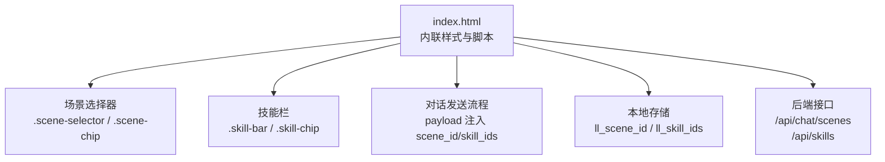
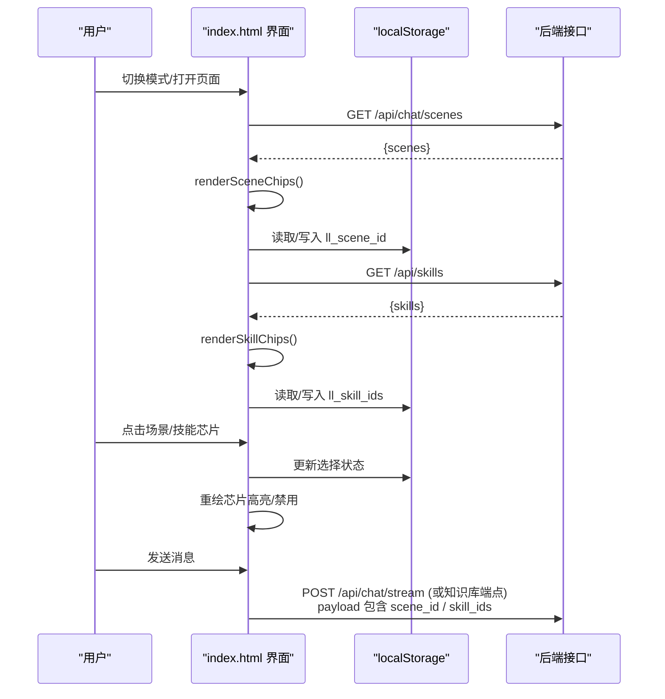
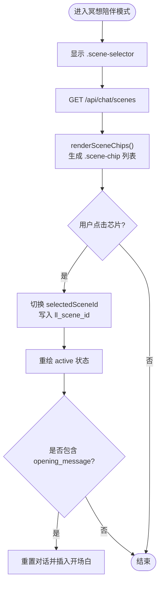
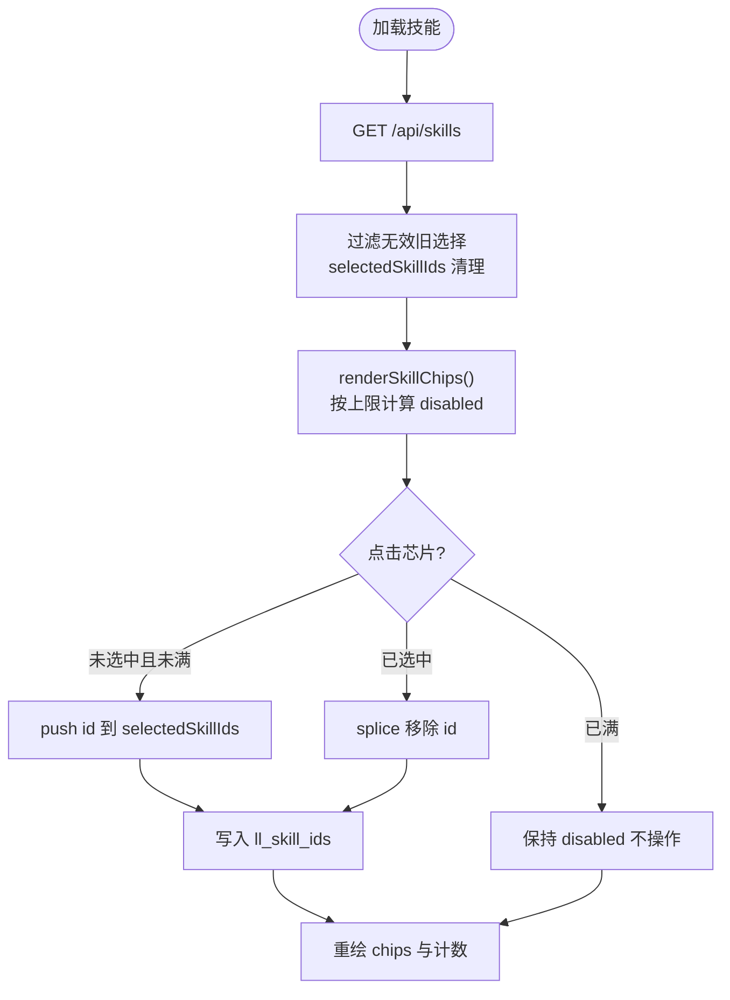
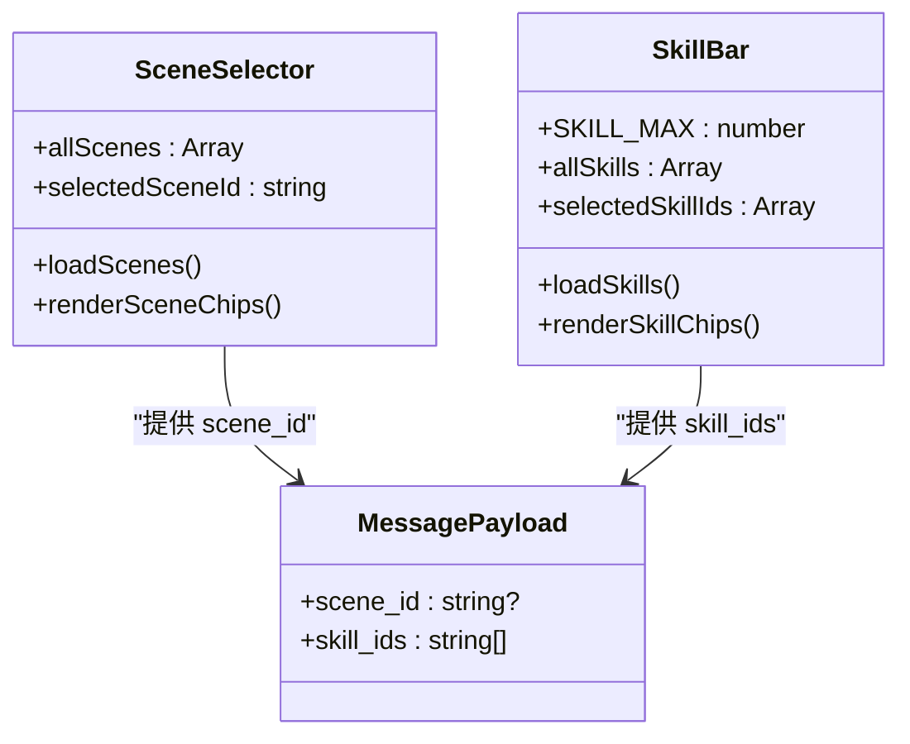
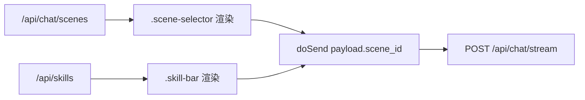

# 场景和技能选择器

<cite>
**本文引用的文件**   
- [hushai/meditation/static/index.html](file://hushai/meditation/static/index.html)
</cite>

## 目录
1. [简介](#简介)
2. [项目结构](#项目结构)
3. [核心组件](#核心组件)
4. [架构总览](#架构总览)
5. [详细组件分析](#详细组件分析)
6. [依赖关系分析](#依赖关系分析)
7. [性能与可访问性](#性能与可访问性)
8. [故障排查指南](#故障排查指南)
9. [结论](#结论)

## 简介
本文件为“场景和技能选择器”组件的完整技术文档，聚焦以下目标：
- 场景选择器（.scene-selector）的布局结构与标签显示、芯片式选项按钮的实现细节。
- 技能栏（.skill-bar）的可折叠面板设计与多选功能实现。
- 选择芯片（.scene-chip, .skill-chip）的样式设计，包括边框变化、背景填充和激活状态。
- 交互逻辑：单选和多选行为、选中状态同步、禁用状态处理。
- 数据绑定方法与事件处理机制。
- 响应式布局与移动端适配方案。

## 项目结构
该选择器组件位于前端静态页面中，包含内联 CSS 与 JavaScript 逻辑，负责从后端接口加载场景与技能数据，并在界面中以芯片形式展示与交互。

图表来源
- [hushai/meditation/static/index.html:331-361](file://hushai/meditation/static/index.html#L331-L361)
- [hushai/meditation/static/index.html:363-388](file://hushai/meditation/static/index.html#L363-L388)
- [hushai/meditation/static/index.html:1280-1315](file://hushai/meditation/static/index.html#L1280-L1315)
- [hushai/meditation/static/index.html:1326-1366](file://hushai/meditation/static/index.html#L1326-L1366)
- [hushai/meditation/static/index.html:1806-1810](file://hushai/meditation/static/index.html#L1806-L1810)

章节来源
- [hushai/meditation/static/index.html:331-361](file://hushai/meditation/static/index.html#L331-L361)
- [hushai/meditation/static/index.html:363-388](file://hushai/meditation/static/index.html#L363-L388)
- [hushai/meditation/static/index.html:1280-1315](file://hushai/meditation/static/index.html#L1280-L1315)
- [hushai/meditation/static/index.html:1326-1366](file://hushai/meditation/static/index.html#L1326-L1366)
- [hushai/meditation/static/index.html:1806-1810](file://hushai/meditation/static/index.html#L1806-L1810)

## 核心组件
- 场景选择器（.scene-selector）
  - 容器类：.scene-selector
  - 标题标签：.scene-label
  - 芯片容器：.scene-chips
  - 单个选项：.scene-chip（含 span 文本层与伪元素背景动画）
- 技能栏（.skill-bar）
  - 容器类：.skill-bar
  - 头部信息：.skill-bar-hd（标题与计数提示）
  - 芯片容器：.skill-chips
  - 单个选项：.skill-chip（通过 aria-pressed 表达选中态）

章节来源
- [hushai/meditation/static/index.html:331-361](file://hushai/meditation/static/index.html#L331-L361)
- [hushai/meditation/static/index.html:363-388](file://hushai/meditation/static/index.html#L363-L388)

## 架构总览
选择器的整体工作流如下：
- 初始化时根据当前模式决定是否展示场景选择器。
- 分别请求场景与技能列表，渲染为芯片。
- 用户点击芯片更新本地状态并持久化到 localStorage。
- 发送消息时将所选场景 ID 与技能 ID 列表注入 payload。

图表来源
- [hushai/meditation/static/index.html:1269-1287](file://hushai/meditation/static/index.html#L1269-L1287)
- [hushai/meditation/static/index.html:1280-1315](file://hushai/meditation/static/index.html#L1280-L1315)
- [hushai/meditation/static/index.html:1326-1366](file://hushai/meditation/static/index.html#L1326-L1366)
- [hushai/meditation/static/index.html:1806-1810](file://hushai/meditation/static/index.html#L1806-L1810)

## 详细组件分析

### 场景选择器（.scene-selector）
- 布局结构
  - 容器：.scene-selector 默认隐藏，通过 .show 控制显示；顶部有分隔线与淡入动画。
  - 标签：.scene-label 使用等宽字体与小字号，用于分组提示。
  - 芯片行：.scene-chips 采用 flex + wrap 布局，支持多行自适应。
  - 芯片项：.scene-chip 使用伪元素 ::before 实现从左到右的背景滑入效果，激活态切换前景文字颜色与边框色。
- 交互逻辑
  - 单选：点击某场景后，若已选中则取消，否则替换为新选择；选中项添加 active 类。
  - 状态同步：selectedSceneId 保存在 localStorage 的 ll_scene_id，页面刷新后恢复。
  - 联动行为：选择场景后，如存在 opening_message，将清空当前对话并插入开场白。
- 样式要点
  - 边框：未选中为浅色边框，悬停加深；选中后边框变深且背景透明，由伪元素覆盖形成深色填充。
  - 过渡：transition 统一使用缓动曲线，hover 与 active 均有平滑反馈。
  - 无障碍：active 仅通过视觉类名体现，建议配合 aria-selected 扩展（当前实现以类名为主）。

图表来源
- [hushai/meditation/static/index.html:1269-1287](file://hushai/meditation/static/index.html#L1269-L1287)
- [hushai/meditation/static/index.html:1280-1315](file://hushai/meditation/static/index.html#L1280-L1315)

章节来源
- [hushai/meditation/static/index.html:331-361](file://hushai/meditation/static/index.html#L331-L361)
- [hushai/meditation/static/index.html:1269-1287](file://hushai/meditation/static/index.html#L1269-L1287)
- [hushai/meditation/static/index.html:1280-1315](file://hushai/meditation/static/index.html#L1280-L1315)

### 技能栏（.skill-bar）
- 布局结构
  - 容器：.skill-bar 默认隐藏，当存在可用技能时显示；内部包含头部信息与芯片行。
  - 头部：.skill-bar-hd 左侧显示标题，右侧显示“已选 N / 最大 M”的计数提示。
  - 芯片行：.skill-chips 同样采用 flex + wrap 布局。
  - 芯片项：.skill-chip 通过 aria-pressed="true/false" 表达选中态，禁用态通过 disabled 属性控制。
- 交互逻辑
  - 多选：点击未选中项时，若未达到上限 SKILL_MAX，则加入 selectedSkillIds；再次点击取消选中。
  - 上限控制：当已选数量达到上限时，未选中项将被禁用（disabled），阻止继续选择。
  - 状态同步：selectedSkillIds 数组持久化到 localStorage 的 ll_skill_ids，刷新后恢复。
  - 数据清洗：加载技能列表后，会过滤掉已失效的旧选择，确保只保留有效 ID。
- 样式要点
  - 边框与背景：未选中为浅色边框与浅色背景；选中后背景变为深色，文字反色。
  - 禁用态：opacity 降低，cursor 不可用，避免误操作。
  - 过渡：hover 与选中态均具备平滑过渡。

图表来源
- [hushai/meditation/static/index.html:1326-1366](file://hushai/meditation/static/index.html#L1326-L1366)

章节来源
- [hushai/meditation/static/index.html:363-388](file://hushai/meditation/static/index.html#L363-L388)
- [hushai/meditation/static/index.html:1326-1366](file://hushai/meditation/static/index.html#L1326-L1366)

### 选择芯片（.scene-chip, .skill-chip）样式设计
- 共同特征
  - 圆角与间距：统一的 padding、gap 与 max-width 保证长文本换行与对齐。
  - 过渡与动画：transition 统一使用缓动曲线，提升交互顺滑度。
  - 悬停反馈：border-color 加深，text-color 加深，增强可感知性。
- 差异化
  - 场景芯片：通过 ::before 伪元素实现从左到右的背景填充动画，active 时背景完全展开。
  - 技能芯片：通过 aria-pressed 属性驱动选中态，禁用态通过 disabled 属性控制。

章节来源
- [hushai/meditation/static/index.html:331-361](file://hushai/meditation/static/index.html#L331-L361)
- [hushai/meditation/static/index.html:363-388](file://hushai/meditation/static/index.html#L363-L388)

### 交互逻辑与状态管理
- 单选 vs 多选
  - 场景：单选，点击同一项取消选择；不同项替换选择。
  - 技能：多选，受上限限制；已达上限时未选中项禁用。
- 选中状态同步
  - 场景：selectedSceneId 写入 ll_scene_id。
  - 技能：selectedSkillIds 写入 ll_skill_ids。
- 禁用状态处理
  - 技能：当 nSel >= SKILL_MAX 且未选中时，设置 disabled=true，阻止点击。
- 发送消息时的数据注入
  - 非知识库模式下，payload 中包含 scene_id 与 skill_ids（数组）。

图表来源
- [hushai/meditation/static/index.html:1280-1315](file://hushai/meditation/static/index.html#L1280-L1315)
- [hushai/meditation/static/index.html:1326-1366](file://hushai/meditation/static/index.html#L1326-L1366)
- [hushai/meditation/static/index.html:1806-1810](file://hushai/meditation/static/index.html#L1806-L1810)

章节来源
- [hushai/meditation/static/index.html:1280-1315](file://hushai/meditation/static/index.html#L1280-L1315)
- [hushai/meditation/static/index.html:1326-1366](file://hushai/meditation/static/index.html#L1326-L1366)
- [hushai/meditation/static/index.html:1806-1810](file://hushai/meditation/static/index.html#L1806-L1810)

### 数据绑定方法与事件处理机制
- 数据加载
  - 场景：GET /api/chat/scenes，返回 {scenes}，渲染为 .scene-chip。
  - 技能：GET /api/skills，返回 {skills}，渲染为 .skill-chip。
- 事件绑定
  - 场景芯片：click 事件切换 selectedSceneId，必要时触发开场白。
  - 技能芯片：click 事件在不超过上限的前提下增删 selectedSkillIds。
- 持久化
  - 场景：ll_scene_id
  - 技能：ll_skill_ids
- 发送阶段
  - doSend 构建 payload，非知识库模式下附加 scene_id 与 skill_ids。

章节来源
- [hushai/meditation/static/index.html:1280-1315](file://hushai/meditation/static/index.html#L1280-L1315)
- [hushai/meditation/static/index.html:1326-1366](file://hushai/meditation/static/index.html#L1326-L1366)
- [hushai/meditation/static/index.html:1806-1810](file://hushai/meditation/static/index.html#L1806-L1810)

### 响应式布局与移动端适配
- 容器宽度
  - .app 最大宽度 560px，居中显示；小于等于 560px 时去除左右边框，适配移动端。
- 芯片布局
  - .scene-chips 与 .skill-chips 使用 flex-wrap，自动换行，适应窄屏。
- 动画与可读性
  - 使用 prefers-reduced-motion 媒体查询减少动画，提升可访问性与性能。
- 输入区域
  - 底部输入区考虑安全区域 env(safe-area-inset-bottom)，适配刘海屏设备。

章节来源
- [hushai/meditation/static/index.html:72-78](file://hushai/meditation/static/index.html#L72-L78)
- [hushai/meditation/static/index.html:344-345](file://hushai/meditation/static/index.html#L344-L345)
- [hushai/meditation/static/index.html:377-378](file://hushai/meditation/static/index.html#L377-L378)
- [hushai/meditation/static/index.html:741-746](file://hushai/meditation/static/index.html#L741-L746)
- [hushai/meditation/static/index.html:505-508](file://hushai/meditation/static/index.html#L505-L508)

## 依赖关系分析
- 外部接口
  - /api/chat/scenes：获取场景列表，决定 .scene-selector 是否显示。
  - /api/skills：获取技能列表，决定 .skill-bar 是否显示。
- 本地存储
  - ll_scene_id：保存当前场景选择。
  - ll_skill_ids：保存当前技能选择集合。
- 发送流程
  - doSend 在非知识库模式下将 scene_id 与 skill_ids 注入 payload，影响后端提示词组装。

图表来源
- [hushai/meditation/static/index.html:1280-1315](file://hushai/meditation/static/index.html#L1280-L1315)
- [hushai/meditation/static/index.html:1326-1366](file://hushai/meditation/static/index.html#L1326-L1366)
- [hushai/meditation/static/index.html:1806-1810](file://hushai/meditation/static/index.html#L1806-L1810)

章节来源
- [hushai/meditation/static/index.html:1280-1315](file://hushai/meditation/static/index.html#L1280-L1315)
- [hushai/meditation/static/index.html:1326-1366](file://hushai/meditation/static/index.html#L1326-L1366)
- [hushai/meditation/static/index.html:1806-1810](file://hushai/meditation/static/index.html#L1806-L1810)

## 性能与可访问性
- 性能
  - 列表渲染采用 innerHTML 重建，简单直接；若数据量增大，建议改用增量更新或虚拟滚动。
  - 动画使用 CSS transition，GPU 加速友好；对低性能设备可通过 prefers-reduced-motion 关闭动画。
- 可访问性
  - 技能芯片使用 aria-pressed 表达选中态，有助于屏幕阅读器识别。
  - 场景芯片目前仅通过类名 active 表达选中态，建议补充 aria-selected 以提升无障碍体验。
  - 焦点可见性通过 :focus-visible 全局定义，确保键盘导航清晰。

章节来源
- [hushai/meditation/static/index.html:363-388](file://hushai/meditation/static/index.html#L363-L388)
- [hushai/meditation/static/index.html:736-739](file://hushai/meditation/static/index.html#L736-L739)
- [hushai/meditation/static/index.html:741-746](file://hushai/meditation/static/index.html#L741-L746)

## 故障排查指南
- 场景/技能未显示
  - 检查网络请求是否成功（/api/chat/scenes、/api/skills）。
  - 确认返回数据结构包含 scenes/skills 字段。
- 选择状态丢失
  - 检查 localStorage 键名是否正确（ll_scene_id、ll_skill_ids）。
  - 确认页面刷新后是否执行了持久化读写逻辑。
- 技能无法多选
  - 检查 SKILL_MAX 常量与当前已选数量。
  - 确认未选中项是否被设置为 disabled。
- 发送消息未携带选择
  - 确认当前是否为知识库模式（kbMode），知识库模式下不会注入 scene_id 与 skill_ids。
  - 检查 doSend 中 payload 构造逻辑。

章节来源
- [hushai/meditation/static/index.html:1280-1315](file://hushai/meditation/static/index.html#L1280-L1315)
- [hushai/meditation/static/index.html:1326-1366](file://hushai/meditation/static/index.html#L1326-L1366)
- [hushai/meditation/static/index.html:1806-1810](file://hushai/meditation/static/index.html#L1806-L1810)

## 结论
场景与技能选择器通过简洁的芯片式 UI 提供了直观的单选与多选能力，结合本地持久化与发送阶段的 payload 注入，实现了前后端的数据闭环。其样式与交互遵循一致的视觉语言与过渡规范，具备良好的响应式表现与基础的可访问性。后续可在无障碍增强（如 aria-selected）、大数据量渲染优化方面进一步改进。