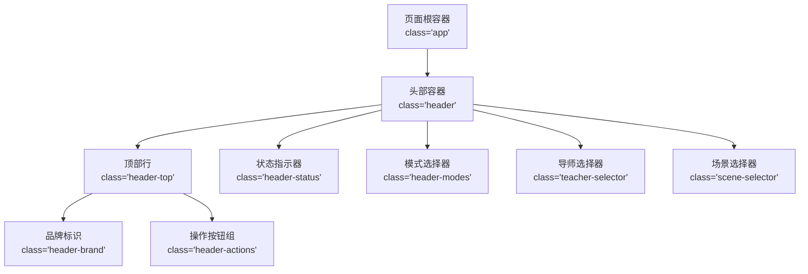
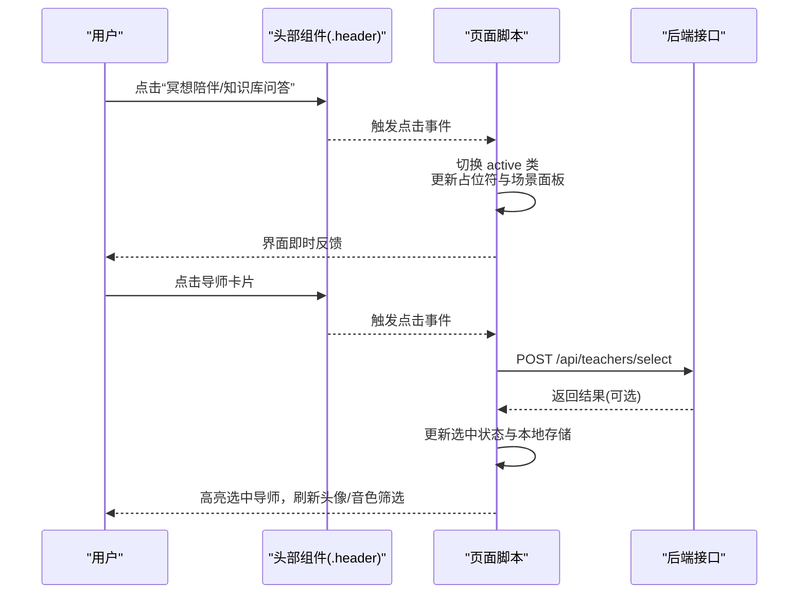
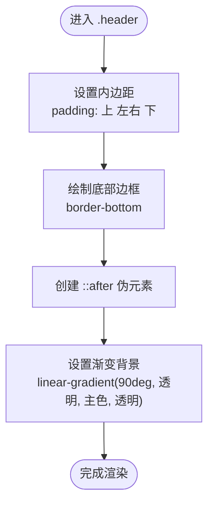
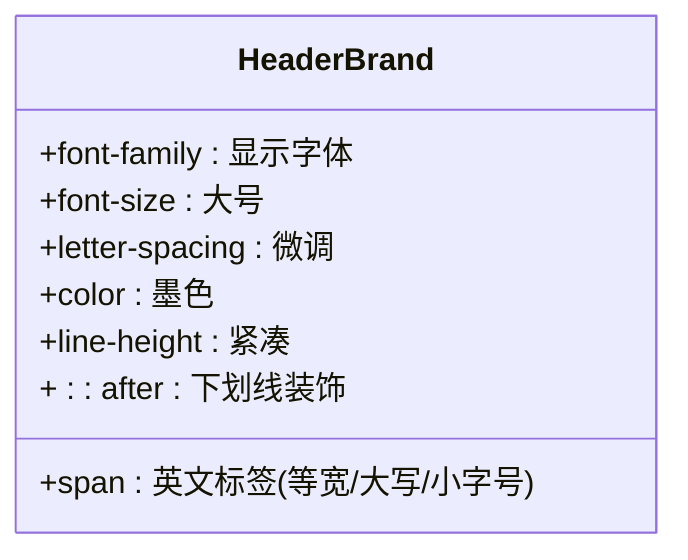
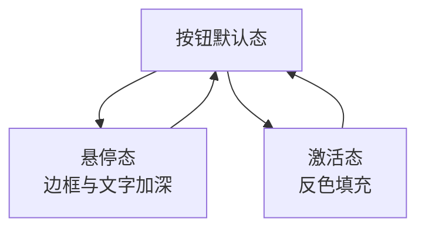
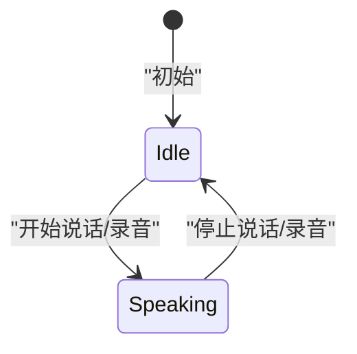
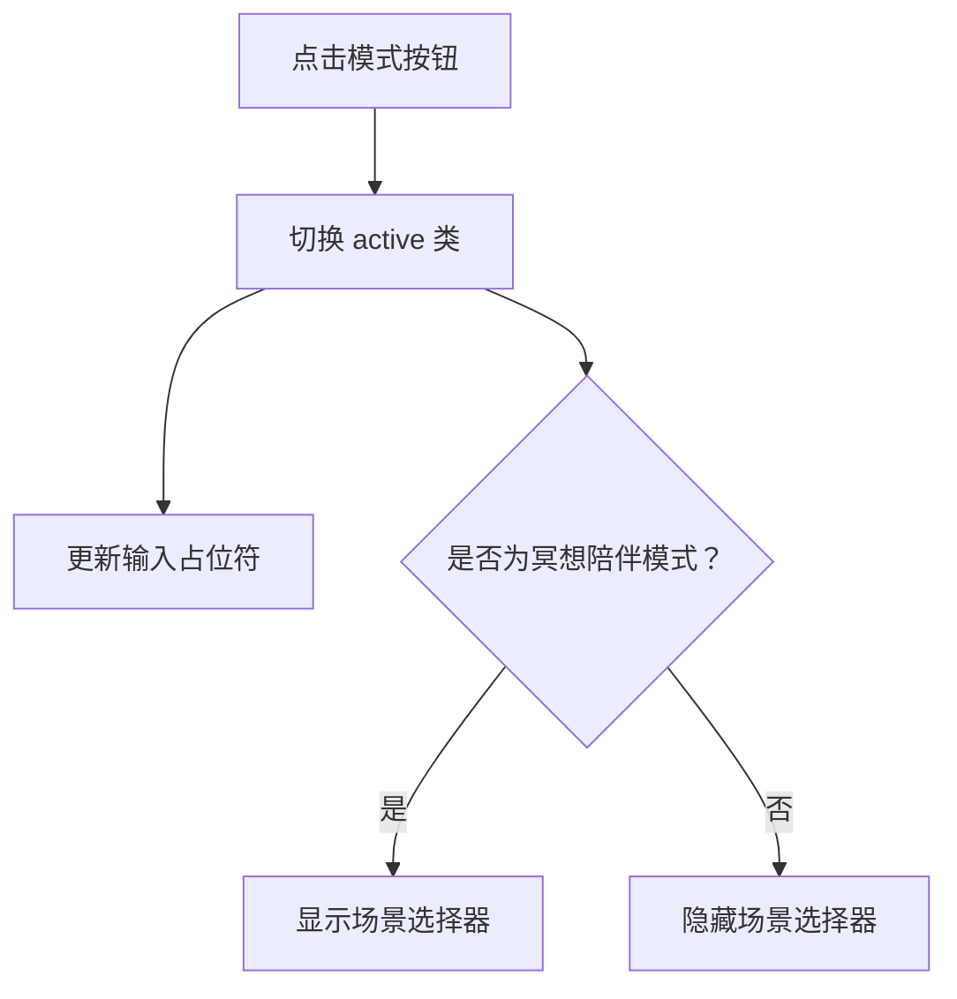
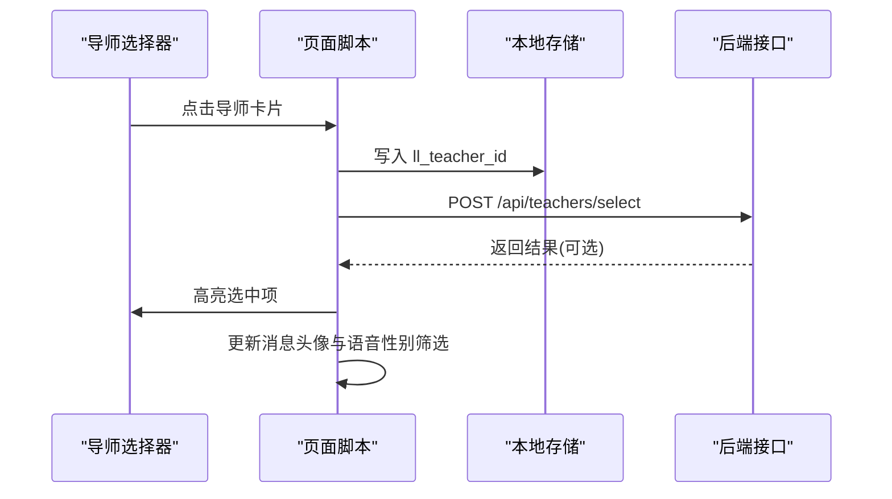
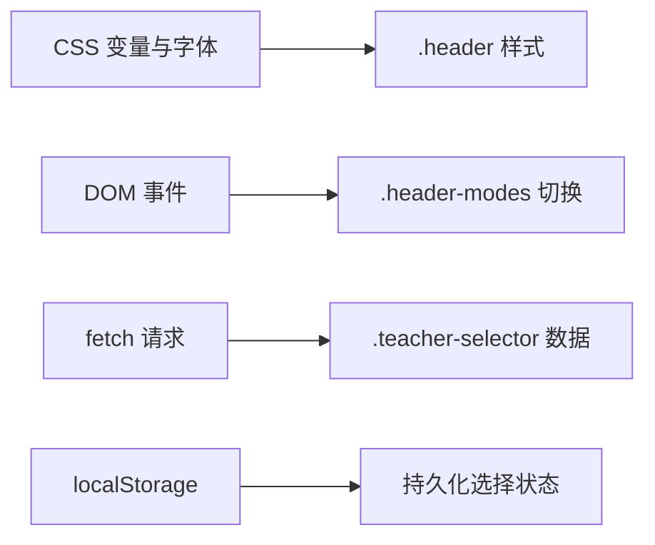

# 头部组件

<cite>
**本文引用的文件**   
- [index.html](file://hushai/meditation/static/index.html)
</cite>

## 目录
1. [简介](#简介)
2. [项目结构](#项目结构)
3. [核心组件](#核心组件)
4. [架构总览](#架构总览)
5. [详细组件分析](#详细组件分析)
6. [依赖分析](#依赖分析)
7. [性能考虑](#性能考虑)
8. [故障排查指南](#故障排查指南)
9. [结论](#结论)

## 简介
本文件为“头部组件（.header）”的完整文档，聚焦其基本结构与样式、品牌标识区域、操作按钮组、状态指示器、模式选择器与导师选择器的实现细节与使用方法。该组件位于冥想对话界面的顶部，承担品牌展示、快捷操作入口、会话状态提示以及模式切换等职责。

## 项目结构
头部组件及其相关交互逻辑集中在单页应用的主页面中，包含内联样式与脚本：
- 样式定义：在页面的 <style> 块中，定义了 .header、.header-brand、.header-actions、.header-status、.header-modes、.teacher-selector 等类名及动画。
- 结构标记：在页面的 <body> 中，以 
 作为容器，内部包含 .header-top、.header-status、.header-modes、.teacher-selector、.scene-selector 等子区域。
- 交互逻辑：通过原生 JavaScript 事件监听与 DOM 操作，驱动模式切换、导师选择、场景选择、状态文本更新等。

图表来源
- [index.html:236-300](file://hushai/meditation/static/index.html#L236-L300)
- [index.html:969-999](file://hushai/meditation/static/index.html#L969-L999)

章节来源
- [index.html:236-300](file://hushai/meditation/static/index.html#L236-L300)
- [index.html:969-999](file://hushai/meditation/static/index.html#L969-L999)

## 核心组件
本节概述头部各子模块的职责与视觉规范：
- 基础结构与边框装饰：.header 使用内边距与底部边框，并通过伪元素 ::after 实现渐变线条效果，增强层次与精致感。
- 品牌标识区域：.header-brand 采用显示字体与等宽英文标签，配合下划线装饰，形成清晰的品牌识别。
- 操作按钮组：.header-actions 提供进度、呼吸、历史、新对话等入口，具备悬停与激活态反馈。
- 状态指示器：.header-status 通过圆点与文字表达当前状态；当处于说话状态时，圆点呈现呼吸动画。
- 模式选择器：.header-modes 支持“冥想陪伴”和“知识库问答”两种模式切换，影响输入占位符与场景面板可见性。
- 导师选择器：.teacher-selector 动态加载可用导师列表，支持选择并持久化到本地存储，同时联动语音性别筛选。

章节来源
- [index.html:236-300](file://hushai/meditation/static/index.html#L236-L300)
- [index.html:969-999](file://hushai/meditation/static/index.html#L969-L999)

## 架构总览
从用户交互到界面反馈的关键流程如下：
- 点击模式按钮：切换 active 类，更新输入占位符与场景面板显隐。
- 点击导师卡片：选中导师并写入本地存储，触发后端选择接口，同步更新消息头像与语音性别筛选。
- 状态变化：根据是否正在朗读或录音，切换 .speaking 类，控制呼吸动画与颜色。

图表来源
- [index.html:1269-1278](file://hushai/meditation/static/index.html#L1269-L1278)
- [index.html:1410-1434](file://hushai/meditation/static/index.html#L1410-L1434)

## 详细组件分析

### 基础结构与样式（.header）
- 内边距设置：上下左右分别设定，确保内容呼吸空间与对齐。
- 底部边框装饰：使用 CSS 变量定义的浅色边框，保持整体风格统一。
- 渐变线条效果：通过 ::after 伪元素在底部叠加一条渐变线，两端透明、中间渐显，提升精致度。

图表来源
- [index.html:236-245](file://hushai/meditation/static/index.html#L236-L245)

章节来源
- [index.html:236-245](file://hushai/meditation/static/index.html#L236-L245)

### 品牌标识区域（.header-brand）
- 字体选择：中文使用显示字体（衬线体），英文标签使用等宽字体，营造对比与节奏。
- 下划线装饰：通过 ::after 伪元素在品牌名下方添加短横线，强调品牌锚点。
- 英文标签显示：小字号、大写字母、字间距加宽，置于品牌名下方，形成层级信息。

图表来源
- [index.html:252-263](file://hushai/meditation/static/index.html#L252-L263)

章节来源
- [index.html:252-263](file://hushai/meditation/static/index.html#L252-L263)

### 操作按钮组（.header-actions）
- 布局：水平排列，按钮之间固定间距，垂直居中对齐。
- 按钮样式：细边框、浅背景、中等字号，字体与正文一致，保持克制风格。
- 悬停效果：边框与文字颜色加深，提供明确反馈。
- 激活状态：反色填充（深色背景+浅色文字），用于区分当前功能入口。

图表来源
- [index.html:265-275](file://hushai/meditation/static/index.html#L265-L275)

章节来源
- [index.html:265-275](file://hushai/meditation/static/index.html#L265-L275)

### 状态指示器（.header-status）
- 组成：圆点与状态文本，使用等宽小字号与大写字母，传达系统状态。
- 呼吸动画：当处于说话状态时，圆点启用呼吸动画（透明度循环变化），颜色加深。
- 状态切换：通过添加/移除 .speaking 类控制动画与颜色。

图表来源
- [index.html:277-287](file://hushai/meditation/static/index.html#L277-L287)

章节来源
- [index.html:277-287](file://hushai/meditation/static/index.html#L277-L287)

### 模式选择器（.header-modes）
- 功能：切换“冥想陪伴”与“知识库问答”两种模式。
- 行为：
  - 切换 active 类，更新输入框占位符。
  - 在“冥想陪伴”模式下显示场景选择器；在“知识库问答”模式下隐藏场景选择器。
- 使用方式：点击对应按钮即可切换，无需额外确认。

图表来源
- [index.html:289-298](file://hushai/meditation/static/index.html#L289-L298)
- [index.html:1269-1278](file://hushai/meditation/static/index.html#L1269-L1278)

章节来源
- [index.html:289-298](file://hushai/meditation/static/index.html#L289-L298)
- [index.html:1269-1278](file://hushai/meditation/static/index.html#L1269-L1278)

### 导师选择器（.teacher-selector）
- 功能：展示可用导师列表，支持选择并持久化。
- 数据加载：登录后自动请求导师列表，若存在已选导师则恢复选中状态。
- 交互行为：
  - 点击导师卡片：更新本地存储、调用后端选择接口、刷新消息头像与语音性别筛选。
  - 首次加载后，若有导师数据则显示选择器面板。
- 使用方式：在“冥想搭子”区域点击目标导师即可完成切换。

图表来源
- [index.html:1368-1438](file://hushai/meditation/static/index.html#L1368-L1438)

章节来源
- [index.html:1368-1438](file://hushai/meditation/static/index.html#L1368-L1438)

## 依赖分析
- 样式依赖：
  - CSS 变量：如 --ink、--paper、--stone-* 等，用于统一色彩体系。
  - 字体资源：Google Fonts 引入 Cormorant Garamond、Noto Serif SC、JetBrains Mono。
- 交互依赖：
  - DOM API：getElementById、classList、addEventListener 等。
  - 网络请求：fetch 调用 /api/teachers/list 与 /api/teachers/select。
  - 本地存储：localStorage 保存 token、会话 ID、导师与场景选择等。

图表来源
- [index.html:24-45](file://hushai/meditation/static/index.html#L24-L45)
- [index.html:1372-1434](file://hushai/meditation/static/index.html#L1372-L1434)

章节来源
- [index.html:24-45](file://hushai/meditation/static/index.html#L24-L45)
- [index.html:1372-1434](file://hushai/meditation/static/index.html#L1372-L1434)

## 性能考虑
- 动画与过渡：
  - 呼吸动画与过渡时间较短，避免阻塞主线程。
  - 对减少动效偏好（prefers-reduced-motion）进行适配，禁用不必要动画。
- 渲染优化：
  - 仅对必要节点添加/移除类名，避免大规模重排。
  - 列表渲染前清空 innerHTML，减少冗余节点。
- 网络请求：
  - 仅在需要时发起请求（如打开历史抽屉、加载导师列表）。
  - 失败路径快速降级，保证界面可用性。

[本节为通用指导，不直接分析具体文件]

## 故障排查指南
- 状态未更新：
  - 检查是否成功切换 .speaking 类，确认呼吸动画是否生效。
  - 查看状态文本是否正确更新。
- 模式切换无效：
  - 确认 active 类是否正确切换。
  - 检查输入占位符与场景面板显隐逻辑。
- 导师选择无响应：
  - 检查 fetch 请求是否成功，是否存在 401 未授权错误。
  - 确认 localStorage 是否写入 ll_teacher_id。
  - 验证后端 /api/teachers/select 接口返回是否正常。

章节来源
- [index.html:1269-1278](file://hushai/meditation/static/index.html#L1269-L1278)
- [index.html:1372-1434](file://hushai/meditation/static/index.html#L1372-L1434)

## 结论
头部组件通过清晰的视觉层次与克制的交互反馈，提供了品牌展示、快捷操作、状态提示与模式/导师选择能力。其样式与逻辑均集中于单页文件中，便于维护与扩展。建议后续可进一步将样式与脚本模块化，以提升复用性与测试覆盖率。