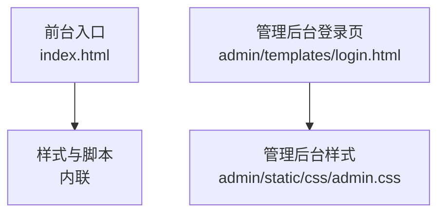
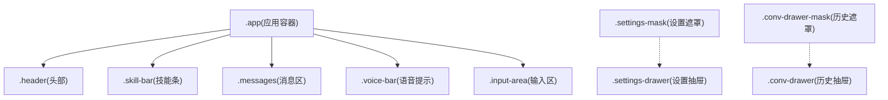
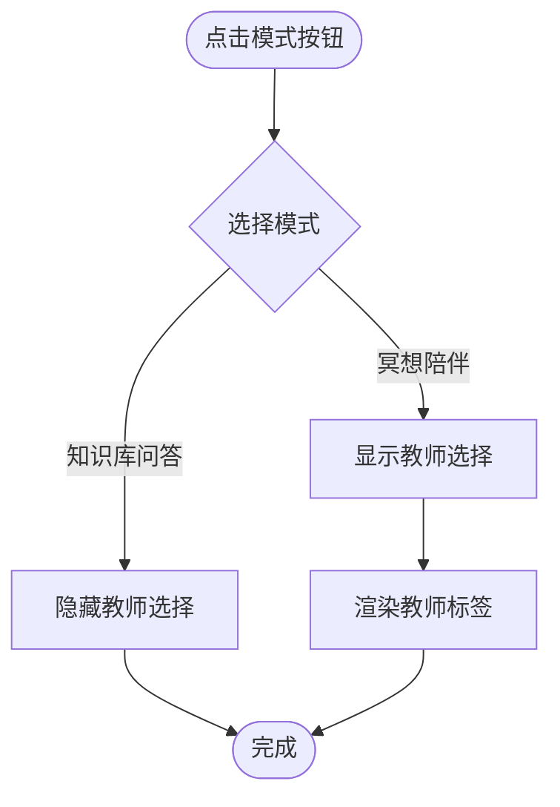
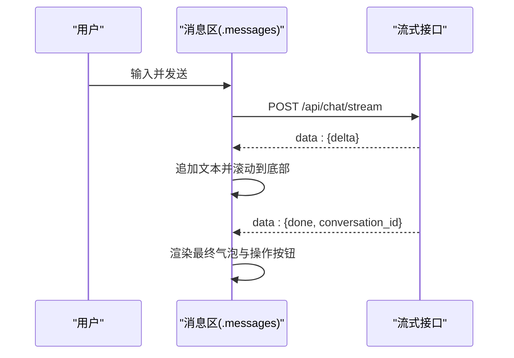
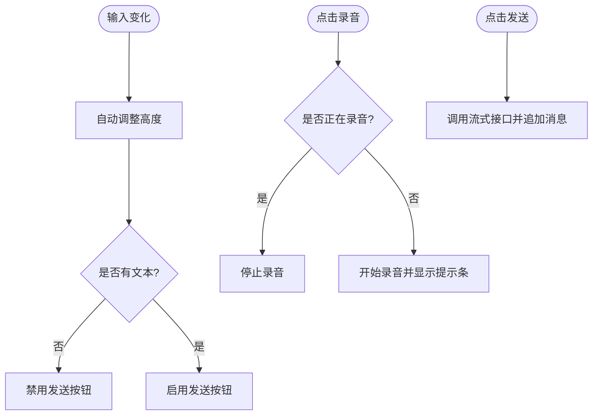
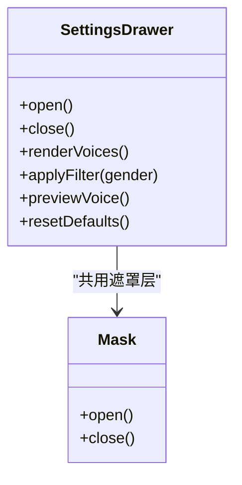
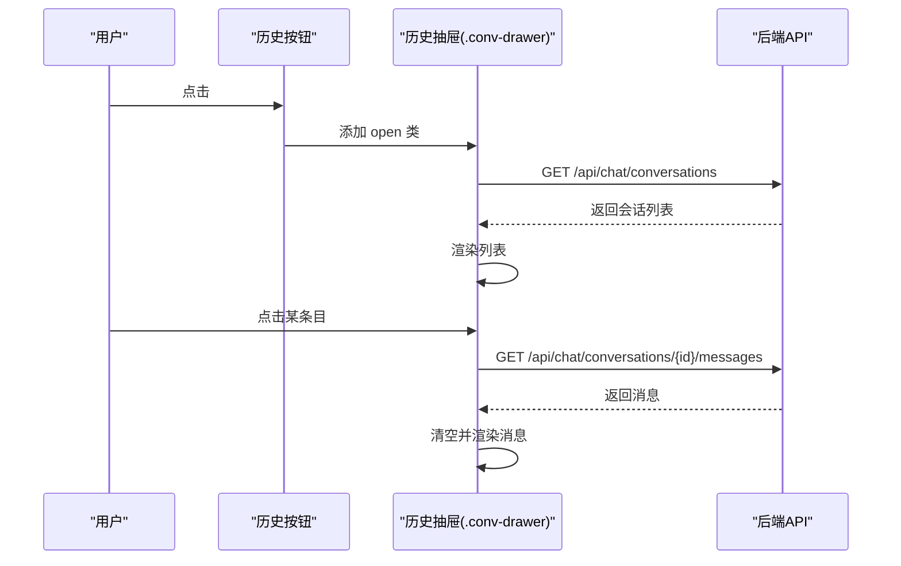
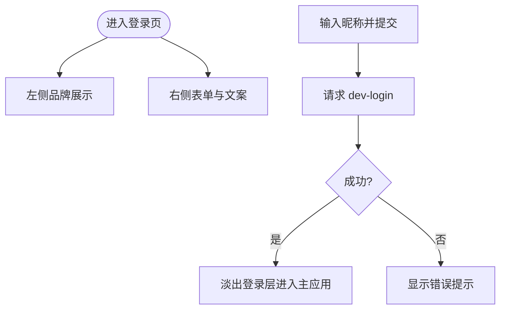
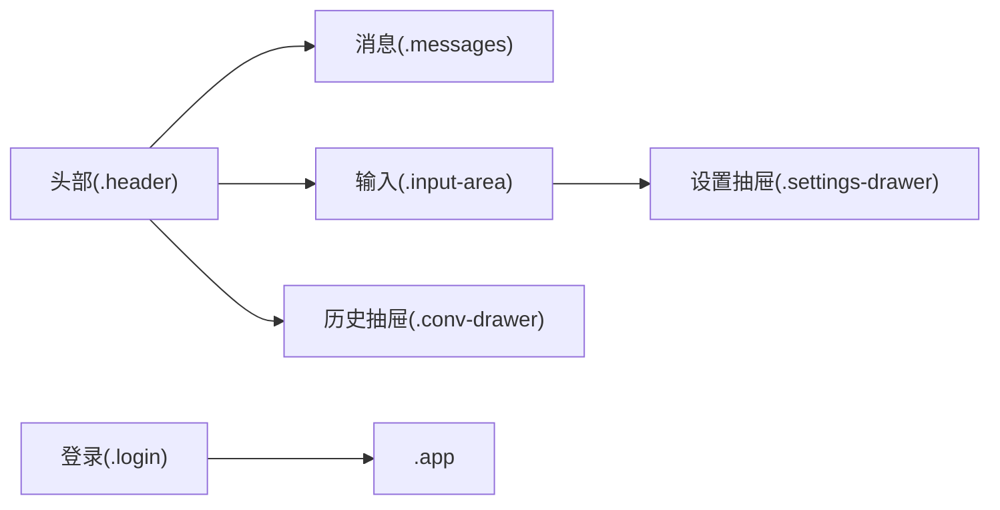

# 布局组件

<cite>
**本文引用的文件**
- [hushai/meditation/static/index.html](file://hushai/meditation/static/index.html)
- [hushai/meditation/admin/templates/login.html](file://hushai/meditation/admin/templates/login.html)
- [hushai/meditation/admin/static/css/admin.css](file://hushai/meditation/admin/static/css/admin.css)
</cite>

## 目录
1. [简介](#简介)
2. [项目结构](#项目结构)
3. [核心组件](#核心组件)
4. [架构总览](#架构总览)
5. [详细组件分析](#详细组件分析)
6. [依赖关系分析](#依赖关系分析)
7. [性能考量](#性能考量)
8. [故障排查指南](#故障排查指南)
9. [结论](#结论)
10. [附录](#附录)

## 简介
本文件聚焦 hush.ai 前台 SPA 的布局与交互组件，围绕以下目标进行系统化说明：
- 应用容器（.app）：固定宽度、居中布局、边框装饰与整体约束
- 头部（.header）：品牌标识、操作按钮与状态指示器
- 消息区域（.messages）：滚动行为、消息气泡样式与间距控制
- 输入区域（.input-area）：文本输入框、发送按钮与语音录制按钮
- 抽屉组件（.settings-drawer, .conv-drawer）：打开关闭动画、遮罩层处理与内部内容组织
- 登录页面（.login）：左右分栏设计与响应式适配

上述内容均基于仓库中的前端静态资源与模板实现进行分析。

## 项目结构
hush.ai 的前台对话界面由单页 HTML 承载，所有样式与脚本内联在同一个文件中；管理后台登录页使用 Jinja2 模板并引用独立 CSS。

图表来源
- [hushai/meditation/static/index.html:1-941](file://hushai/meditation/static/index.html#L1-L941)
- [hushai/meditation/admin/templates/login.html:1-65](file://hushai/meditation/admin/templates/login.html#L1-L65)
- [hushai/meditation/admin/static/css/admin.css:1-120](file://hushai/meditation/admin/static/css/admin.css#L1-L120)

章节来源
- [hushai/meditation/static/index.html:1-941](file://hushai/meditation/static/index.html#L1-L941)
- [hushai/meditation/admin/templates/login.html:1-65](file://hushai/meditation/admin/templates/login.html#L1-L65)
- [hushai/meditation/admin/static/css/admin.css:1-120](file://hushai/meditation/admin/static/css/admin.css#L1-L120)

## 核心组件
本节概述各布局组件的职责与关键样式要点，后续章节将深入展开。

- 应用容器 .app
  - 固定最大宽度、垂直居中、全屏高度、左右细边框装饰
  - 作为整页布局根容器，承载 header、messages、input-area 等子区域
- 头部 .header
  - 品牌标识区、操作按钮组（进度、呼吸、历史、新对话）、模式切换
  - 状态指示器（说话中/安静），教师选择与场景选择面板
- 消息区域 .messages
  - 纵向滚动、自定义滚动条、消息气泡（用户/教师）与头像、名称、操作按钮
  - 打字动画与流式输出占位
- 输入区域 .input-area
  - 自适应高度的文本域、设置按钮、语音录制按钮、发送按钮
  - 安全区域适配（env(safe-area-inset-bottom)）
- 抽屉组件
  - 设置抽屉 .settings-drawer：底部弹出、遮罩层、音色筛选与参数调节
  - 对话历史抽屉 .conv-drawer：左侧滑出、列表加载与切换
- 登录页面 .login
  - 左右分栏：左侧品牌图形与竖排文字，右侧表单与文案
  - 移动端响应式：上下堆叠、隐藏装饰线

章节来源
- [hushai/meditation/static/index.html:72-78](file://hushai/meditation/static/index.html#L72-L78)
- [hushai/meditation/static/index.html:236-329](file://hushai/meditation/static/index.html#L236-L329)
- [hushai/meditation/static/index.html:393-461](file://hushai/meditation/static/index.html#L393-L461)
- [hushai/meditation/static/index.html:504-539](file://hushai/meditation/static/index.html#L504-L539)
- [hushai/meditation/static/index.html:544-665](file://hushai/meditation/static/index.html#L544-L665)
- [hushai/meditation/static/index.html:669-731](file://hushai/meditation/static/index.html#L669-L731)
- [hushai/meditation/static/index.html:110-231](file://hushai/meditation/static/index.html#L110-L231)

## 架构总览
从布局层级看，.app 为根容器，内部自上而下包含 .header、可选技能条 .skill-bar、消息区 .messages、语音提示条 .voice-bar、输入区 .input-area。抽屉与遮罩以 fixed 定位覆盖于 .app 之上。

图表来源
- [hushai/meditation/static/index.html:72-78](file://hushai/meditation/static/index.html#L72-L78)
- [hushai/meditation/static/index.html:236-329](file://hushai/meditation/static/index.html#L236-L329)
- [hushai/meditation/static/index.html:366-388](file://hushai/meditation/static/index.html#L366-L388)
- [hushai/meditation/static/index.html:393-461](file://hushai/meditation/static/index.html#L393-L461)
- [hushai/meditation/static/index.html:492-500](file://hushai/meditation/static/index.html#L492-L500)
- [hushai/meditation/static/index.html:504-539](file://hushai/meditation/static/index.html#L504-L539)
- [hushai/meditation/static/index.html:544-665](file://hushai/meditation/static/index.html#L544-L665)
- [hushai/meditation/static/index.html:669-731](file://hushai/meditation/static/index.html#L669-L731)

## 详细组件分析

### 应用容器 .app
- 结构与尺寸
  - 使用 flex 纵向布局，限制最大宽度，水平居中，高度占满视口（兼容 dvh）
  - 左右边框装饰，窄屏下移除边框以保持沉浸感
- 视觉与可访问性
  - 背景色与字体变量统一，全局 overflow:hidden 避免页面级滚动
  - 通过 :focus-visible 提供键盘导航可见焦点

章节来源
- [hushai/meditation/static/index.html:72-78](file://hushai/meditation/static/index.html#L72-L78)
- [hushai/meditation/static/index.html:47-59](file://hushai/meditation/static/index.html#L47-L59)
- [hushai/meditation/static/index.html:736-746](file://hushai/meditation/static/index.html#L736-L746)

### 头部 .header
- 品牌标识
  - 主标题与英文副标，底部短横线装饰
- 操作按钮
  - 进度、呼吸、历史、新对话四个按钮，支持 active 态
- 状态指示器
  - 圆点 + 文案，朗读时增加 speaking 类触发呼吸动画
- 模式与选择面板
  - 冥想陪伴/知识库问答模式切换
  - 教师选择与场景选择面板，默认隐藏，按需显示

图表来源
- [hushai/meditation/static/index.html:236-329](file://hushai/meditation/static/index.html#L236-L329)

章节来源
- [hushai/meditation/static/index.html:236-329](file://hushai/meditation/static/index.html#L236-L329)

### 消息区域 .messages
- 滚动与外观
  - 纵向滚动，自定义滚动条样式，保持阅读流畅
- 消息气泡
  - 教师消息左对齐，用户消息右对齐；不同背景与边框强调角色差异
  - 支持 Markdown 基础语法渲染（加粗、斜体、代码、链接）
- 交互元素
  - 每条教师消息附带“朗读/停止”操作按钮
  - 打字动画用于等待反馈

图表来源
- [hushai/meditation/static/index.html:393-461](file://hushai/meditation/static/index.html#L393-L461)
- [hushai/meditation/static/index.html:1694-1793](file://hushai/meditation/static/index.html#L1694-L1793)

章节来源
- [hushai/meditation/static/index.html:393-461](file://hushai/meditation/static/index.html#L393-L461)
- [hushai/meditation/static/index.html:1694-1793](file://hushai/meditation/static/index.html#L1694-L1793)

### 输入区域 .input-area
- 文本输入
  - 自适应高度 textarea，最小/最大高度限制，聚焦高亮
- 功能按钮
  - 设置按钮（打开语音设置抽屉）
  - 语音录制按钮（开始/停止录音，实时转写回填）
  - 发送按钮（根据输入内容与发送状态启用/禁用）
- 安全区域适配
  - 底部内边距考虑刘海屏 safe-area-inset-bottom

图表来源
- [hushai/meditation/static/index.html:504-539](file://hushai/meditation/static/index.html#L504-L539)
- [hushai/meditation/static/index.html:1565-1582](file://hushai/meditation/static/index.html#L1565-L1582)
- [hushai/meditation/static/index.html:1639-1659](file://hushai/meditation/static/index.html#L1639-L1659)
- [hushai/meditation/static/index.html:1795-1891](file://hushai/meditation/static/index.html#L1795-L1891)

章节来源
- [hushai/meditation/static/index.html:504-539](file://hushai/meditation/static/index.html#L504-L539)
- [hushai/meditation/static/index.html:1565-1582](file://hushai/meditation/static/index.html#L1565-L1582)
- [hushai/meditation/static/index.html:1639-1659](file://hushai/meditation/static/index.html#L1639-L1659)
- [hushai/meditation/static/index.html:1795-1891](file://hushai/meditation/static/index.html#L1795-L1891)

### 设置抽屉 .settings-drawer
- 打开/关闭动画
  - 底部弹出，transform 配合 ease-out-expo 缓动
  - 遮罩层 .settings-mask 控制 pointer-events 与透明度
- 内部内容组织
  - 音色筛选（全部/女声/男声/English）
  - 音色列表与选中态
  - 语速/音调滑块与数值展示
  - 试听与恢复默认按钮
- 交互逻辑
  - 点击遮罩或关闭按钮收起
  - 筛选条件变更即时重绘列表

图表来源
- [hushai/meditation/static/index.html:544-665](file://hushai/meditation/static/index.html#L544-L665)
- [hushai/meditation/static/index.html:1557-1563](file://hushai/meditation/static/index.html#L1557-L1563)
- [hushai/meditation/static/index.html:1471-1555](file://hushai/meditation/static/index.html#L1471-L1555)

章节来源
- [hushai/meditation/static/index.html:544-665](file://hushai/meditation/static/index.html#L544-L665)
- [hushai/meditation/static/index.html:1557-1563](file://hushai/meditation/static/index.html#L1557-L1563)
- [hushai/meditation/static/index.html:1471-1555](file://hushai/meditation/static/index.html#L1471-L1555)

### 对话历史抽屉 .conv-drawer
- 打开/关闭动画
  - 左侧滑入，transform 控制位移，遮罩层 .conv-drawer-mask 同步控制
- 内部内容组织
  - 头部标题与关闭按钮
  - 列表区域：加载中、空状态、条目项（标题+日期）
- 交互逻辑
  - 点击遮罩或关闭按钮收起
  - 点击条目切换当前会话并加载消息

图表来源
- [hushai/meditation/static/index.html:669-731](file://hushai/meditation/static/index.html#L669-L731)
- [hushai/meditation/static/index.html:1186-1254](file://hushai/meditation/static/index.html#L1186-L1254)

章节来源
- [hushai/meditation/static/index.html:669-731](file://hushai/meditation/static/index.html#L669-L731)
- [hushai/meditation/static/index.html:1186-1254](file://hushai/meditation/static/index.html#L1186-L1254)

### 登录页面 .login
- 布局结构
  - 左右分栏：左侧品牌图形与竖排大字，右侧表单与引导文案
  - 顶部遮罩式覆盖在主应用之上，z-index 高于其他内容
- 响应式适配
  - 小屏下改为上下布局，隐藏装饰线，调整字号与排版
- 交互与反馈
  - 输入昵称后点击“开始对话”，失败时显示错误信息

图表来源
- [hushai/meditation/static/index.html:110-231](file://hushai/meditation/static/index.html#L110-L231)
- [hushai/meditation/static/index.html:1584-1609](file://hushai/meditation/static/index.html#L1584-L1609)

章节来源
- [hushai/meditation/static/index.html:110-231](file://hushai/meditation/static/index.html#L110-L231)
- [hushai/meditation/static/index.html:1584-1609](file://hushai/meditation/static/index.html#L1584-L1609)

## 依赖关系分析
- 组件耦合
  - .header 与 .messages/.input-area 通过 JS 事件联动（如模式切换影响输入占位与场景面板）
  - 抽屉组件共享遮罩层模式，统一通过 open/close 方法管理
- 外部依赖
  - Web Speech API（语音识别/合成）
  - Fetch API（流式读取与 JSON 解析）
  - localStorage（持久化配置与会话）
- 潜在循环依赖
  - 无直接循环导入；JS 自执行函数内按 ID 获取 DOM 节点，避免模块级循环

图表来源
- [hushai/meditation/static/index.html:236-329](file://hushai/meditation/static/index.html#L236-L329)
- [hushai/meditation/static/index.html:393-461](file://hushai/meditation/static/index.html#L393-L461)
- [hushai/meditation/static/index.html:504-539](file://hushai/meditation/static/index.html#L504-L539)
- [hushai/meditation/static/index.html:544-665](file://hushai/meditation/static/index.html#L544-L665)
- [hushai/meditation/static/index.html:669-731](file://hushai/meditation/static/index.html#L669-L731)
- [hushai/meditation/static/index.html:110-231](file://hushai/meditation/static/index.html#L110-L231)

## 性能考量
- 滚动优化
  - 消息区使用 thin scrollbar 与透明轨道，减少视觉干扰与绘制开销
- 动画与可访问性
  - 尊重 prefers-reduced-motion，禁用不必要的动画以提升性能与可用性
- 流式渲染
  - 增量拼接文本并滚动到底部，避免全量重排
- 存储与初始化
  - 仅对必要配置写入 localStorage，减少 I/O 次数

[本节为通用指导，不直接分析具体文件]

## 故障排查指南
- 登录失败
  - 检查网络与服务端连通性，确认 dev-login 返回码与错误提示
- Token 过期
  - 自动刷新机制会在 401 时尝试 refresh，若失败则回到登录页
- 语音不可用
  - 浏览器不支持 SpeechRecognition/SpeechSynthesis 时，相关按钮应降级或提示
- 抽屉无法关闭
  - 检查遮罩层与抽屉的 open 类是否正确移除，pointer-events 是否被阻止

章节来源
- [hushai/meditation/static/index.html:1584-1609](file://hushai/meditation/static/index.html#L1584-L1609)
- [hushai/meditation/static/index.html:1611-1637](file://hushai/meditation/static/index.html#L1611-L1637)
- [hushai/meditation/static/index.html:1639-1659](file://hushai/meditation/static/index.html#L1639-L1659)
- [hushai/meditation/static/index.html:1557-1563](file://hushai/meditation/static/index.html#L1557-L1563)

## 结论
本布局体系以 .app 为中心，采用清晰的分区与一致的视觉语言，结合抽屉与遮罩层实现非侵入式交互。消息区与输入区的组合提供了稳定的对话体验，登录页的分栏设计兼顾品牌表达与易用性。整体方案在可访问性与性能方面均有良好实践，适合持续扩展更多功能模块。

[本节为总结性内容，不直接分析具体文件]

## 附录
- 管理后台登录页参考
  - 模板结构与样式风格与前台不同，采用独立的 admin.css 与 login.html 模板
  - 适用于管理员登录流程，与前台 SPA 解耦

章节来源
- [hushai/meditation/admin/templates/login.html:1-65](file://hushai/meditation/admin/templates/login.html#L1-L65)
- [hushai/meditation/admin/static/css/admin.css:1-120](file://hushai/meditation/admin/static/css/admin.css#L1-L120)