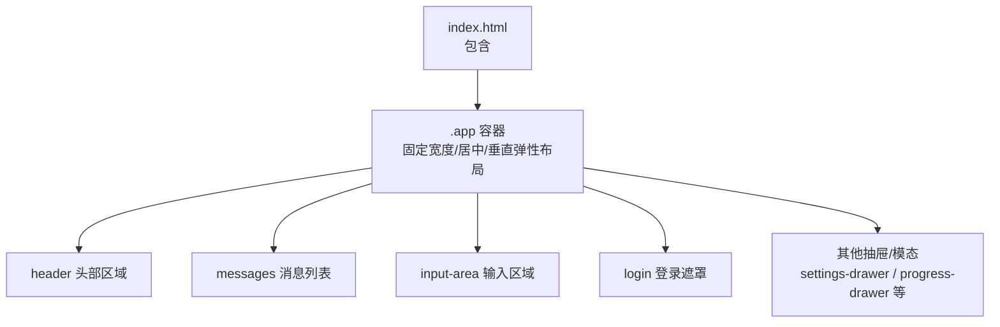
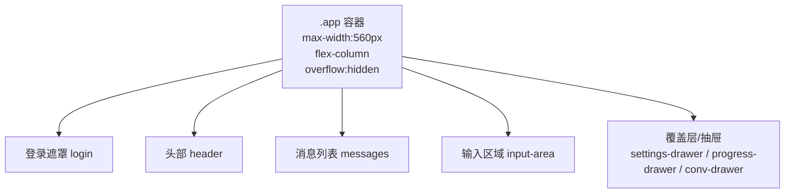
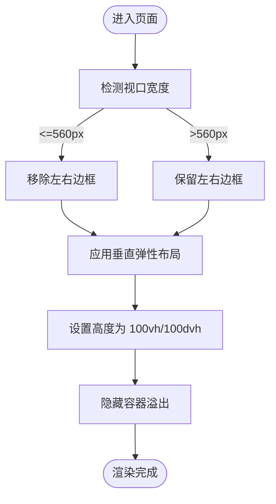
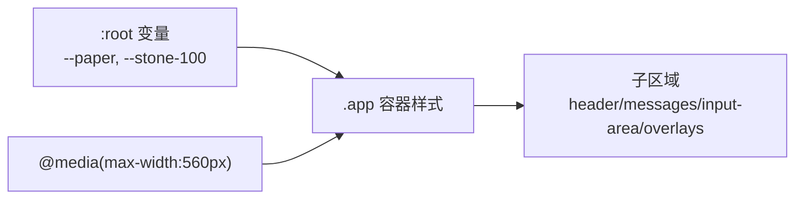

# 应用容器组件

<cite>
**本文引用的文件**   
- [index.html](file://hushai/meditation/static/index.html)
</cite>

## 目录
1. [简介](#简介)
2. [项目结构](#项目结构)
3. [核心组件](#核心组件)
4. [架构总览](#架构总览)
5. [详细组件分析](#详细组件分析)
6. [依赖关系分析](#依赖关系分析)
7. [性能考量](#性能考量)
8. [故障排查指南](#故障排查指南)
9. [结论](#结论)
10. [附录：使用示例与自定义样式指南](#附录使用示例与自定义样式指南)

## 简介
本文件聚焦于应用容器组件（类名 .app）的样式与布局实现，围绕以下目标展开：
- 整体布局结构：固定最大宽度、居中显示、垂直弹性布局。
- 边框装饰：左右边框样式及移动端适配处理。
- 背景色设置与溢出隐藏机制。
- 响应式设计：最大高度适配（100vh/100dvh）与移动端边框移除逻辑。
- 使用示例与自定义样式指南。

该组件位于前端静态页面中，作为整个应用的“外壳”，承载登录遮罩、头部、消息区、输入区以及多个抽屉/模态等子模块。

## 项目结构
应用容器及其相关样式集中在单一 HTML 文件的内联样式块中，HTML 结构与 CSS 定义均位于同一文件，便于快速定位与维护。

图示来源
- [index.html:71-78](file://hushai/meditation/static/index.html#L71-L78)
- [index.html:944-1036](file://hushai/meditation/static/index.html#L944-L1036)

章节来源
- [index.html:71-78](file://hushai/meditation/static/index.html#L71-L78)
- [index.html:944-1036](file://hushai/meditation/static/index.html#L944-L1036)

## 核心组件
本节对 .app 容器的关键样式属性进行说明，并解释其设计意图与效果。

- 尺寸与居中
  - 宽度策略：width: 100% 配合 max-width: 560px，确保在小屏设备上占满宽度，在大屏设备上限制为 560px。
  - 水平居中：margin: 0 auto 使容器在视口内水平居中。
- 布局模型
  - display: flex; flex-direction: column 构建垂直弹性布局，子元素自上而下排列，header、messages、input-area 等自然形成纵向流式排布。
- 高度与滚动
  - height: 100vh; height: 100dvh 同时声明，兼容传统视口高度与现代动态视口高度，避免移动端地址栏导致的溢出或空白。
  - overflow: hidden 防止容器自身出现滚动条，内部滚动由具体子区域（如 messages）控制。
- 背景与边框
  - background: var(--paper) 使用 CSS 变量统一纸质感背景色。
  - border-left/border-right 使用浅色描边营造“书脊”视觉；当屏幕宽度小于等于 560px 时通过媒体查询移除左右边框，提升移动端沉浸感。
- 定位上下文
  - position: relative 为绝对定位的子层（如登录遮罩、抽屉、模态）提供定位参考。

章节来源
- [index.html:71-78](file://hushai/meditation/static/index.html#L71-L78)

## 架构总览
下图展示 .app 容器与其主要子区域的层级关系与职责划分。

图示来源
- [index.html:944-1036](file://hushai/meditation/static/index.html#L944-L1036)
- [index.html:1038-1159](file://hushai/meditation/static/index.html#L1038-L1159)

## 详细组件分析

### 容器 .app 的布局与响应式行为
- 固定宽度与居中
  - 通过 max-width: 560px 与 margin: 0 auto 实现大屏下的固定宽度与居中显示。
- 垂直弹性布局
  - flex-direction: column 保证 header、messages、input-area 自上而下排列，且可随内容自适应高度。
- 高度适配
  - 同时声明 100vh 与 100dvh，兼顾不同浏览器对动态视口的支持差异，确保全屏高度一致。
- 溢出隐藏
  - overflow: hidden 将滚动交由子区域（如 messages）管理，避免外层滚动导致布局错乱。
- 边框装饰与移动端适配
  - 桌面端保留左右细边框以增强“卡片/书页”观感；在 <=560px 时移除左右边框，获得更贴近原生应用的体验。

图示来源
- [index.html:71-78](file://hushai/meditation/static/index.html#L71-L78)

章节来源
- [index.html:71-78](file://hushai/meditation/static/index.html#L71-L78)

### 容器背景与主题变量
- 背景色
  - 使用 CSS 变量 --paper 定义纸张底色，保持整体风格统一。
- 边框颜色
  - 左右边框采用 --stone-100 浅灰描边，与背景形成微妙层次。
- 扩展建议
  - 若需更换主题，可通过修改 :root 中的 --paper 与 --stone-100 实现全局换肤。

章节来源
- [index.html:24-45](file://hushai/meditation/static/index.html#L24-L45)
- [index.html:71-78](file://hushai/meditation/static/index.html#L71-L78)

### 子区域与容器的协作
- 头部 header
  - 固定在顶部，作为导航与状态展示区。
- 消息列表 messages
  - 占据剩余空间，独立滚动，避免影响输入区与头部。
- 输入区域 input-area
  - 固定在底部，与 messages 共同构成对话交互的核心区域。
- 覆盖层/抽屉
  - 登录遮罩、设置抽屉、进度抽屉、历史抽屉等均以绝对定位或固定定位叠加在 .app 之上，利用容器的相对定位上下文保持一致的对齐与尺寸约束。

章节来源
- [index.html:944-1036](file://hushai/meditation/static/index.html#L944-L1036)
- [index.html:1038-1159](file://hushai/meditation/static/index.html#L1038-L1159)

## 依赖关系分析
- 样式依赖
  - .app 的视觉表现依赖于 :root 中定义的 CSS 变量（--paper、--stone-100 等）。
- 结构依赖
  - .app 作为父容器，其子节点（header、messages、input-area、登录遮罩、抽屉等）遵循统一的布局约定，确保整体一致性。
- 响应式依赖
  - 媒体查询基于 560px 断点切换边框可见性，与 max-width 保持一致，避免视觉不一致。

图示来源
- [index.html:24-45](file://hushai/meditation/static/index.html#L24-L45)
- [index.html:71-78](file://hushai/meditation/static/index.html#L71-L78)

章节来源
- [index.html:24-45](file://hushai/meditation/static/index.html#L24-L45)
- [index.html:71-78](file://hushai/meditation/static/index.html#L71-L78)

## 性能考量
- 避免重绘与回流
  - overflow: hidden 将滚动限制在子区域，减少容器级别的滚动计算开销。
- 高度兼容性
  - 同时声明 100vh 与 100dvh，降低因动态视口变化导致的布局抖动。
- 媒体查询优化
  - 仅在必要处（边框可见性）使用媒体查询，避免过度拆分样式规则。

## 故障排查指南
- 问题：容器未居中或超出视口
  - 检查是否误删 margin: 0 auto 或 max-width: 560px。
- 问题：移动端出现横向滚动条
  - 确认 overflow: hidden 未被覆盖；检查子元素是否存在负 margin 或过宽内容。
- 问题：高度异常（顶部/底部留白）
  - 确认 100vh 与 100dvh 同时存在；检查 body 或其他祖先元素的 padding/margin 影响。
- 问题：边框在移动端仍显示
  - 核对媒体查询断点是否为 560px，并确保选择器优先级未被覆盖。

章节来源
- [index.html:71-78](file://hushai/meditation/static/index.html#L71-L78)

## 结论
应用容器组件通过简洁而稳健的 CSS 组合实现了：
- 固定宽度与居中对齐，提升阅读与交互体验。
- 垂直弹性布局，清晰划分头部、消息与输入区域。
- 精细的边框装饰与移动端适配，兼顾美观与沉浸感。
- 双高度声明与溢出隐藏，保障跨设备的一致性表现。

## 附录：使用示例与自定义样式指南

### 基本用法
- 在 HTML 中引入一个带有 class="app" 的根容器，并在其中放置 header、messages、input-area 等子区域。
- 如需覆盖默认样式，建议在 :root 中调整 CSS 变量，或在特定断点下追加媒体查询。

### 自定义样式要点
- 更换背景色
  - 修改 --paper 的值即可替换容器背景。
- 调整边框粗细与颜色
  - 在 .app 的左右边框样式中替换 --stone-100 为新的颜色变量。
- 更改最大宽度
  - 调整 max-width: 560px 为期望值，并同步更新媒体查询断点以保持边框移除逻辑一致。
- 调整高度策略
  - 若需要固定高度而非全屏，可将 height 改为固定值或 calc() 表达式，但需注意与内部滚动区域的协调。

### 常见定制场景
- 无边框模式
  - 直接移除左右边框或使用媒体查询强制隐藏。
- 深色主题
  - 在 :root 中重新定义 --paper 与 --stone-100，使其符合深色配色方案。
- 多列布局扩展
  - 在 .app 内部新增侧边栏或工具栏，并通过 flex 布局合理分配空间。

章节来源
- [index.html:71-78](file://hushai/meditation/static/index.html#L71-L78)
- [index.html:24-45](file://hushai/meditation/static/index.html#L24-L45)