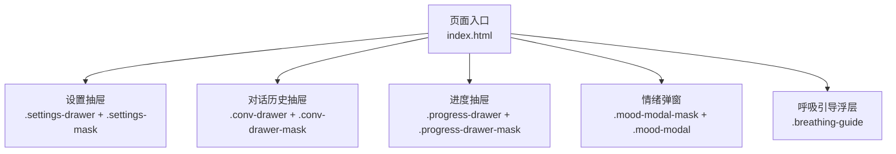
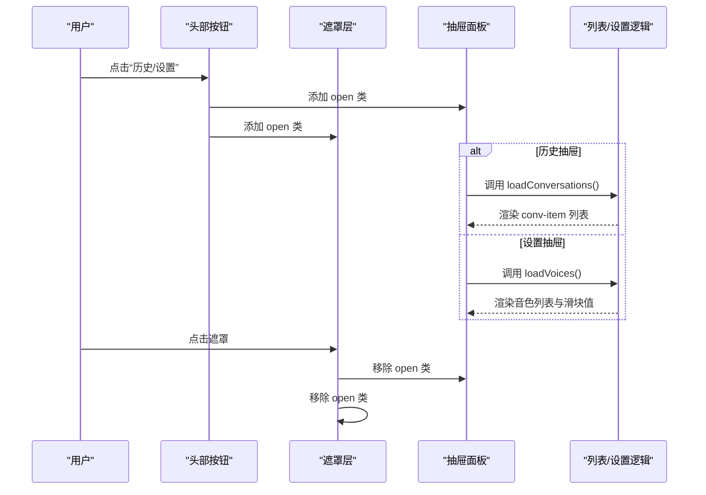
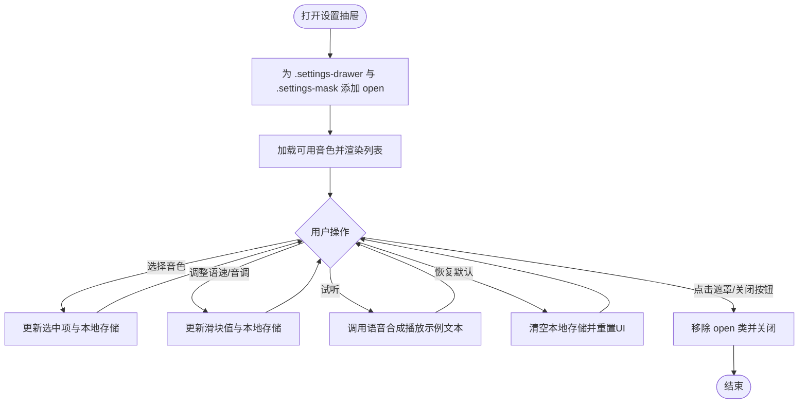
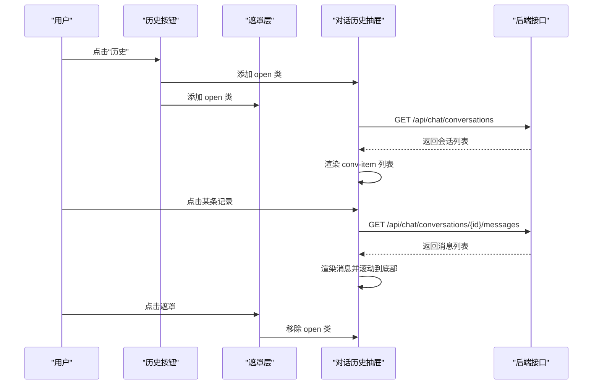
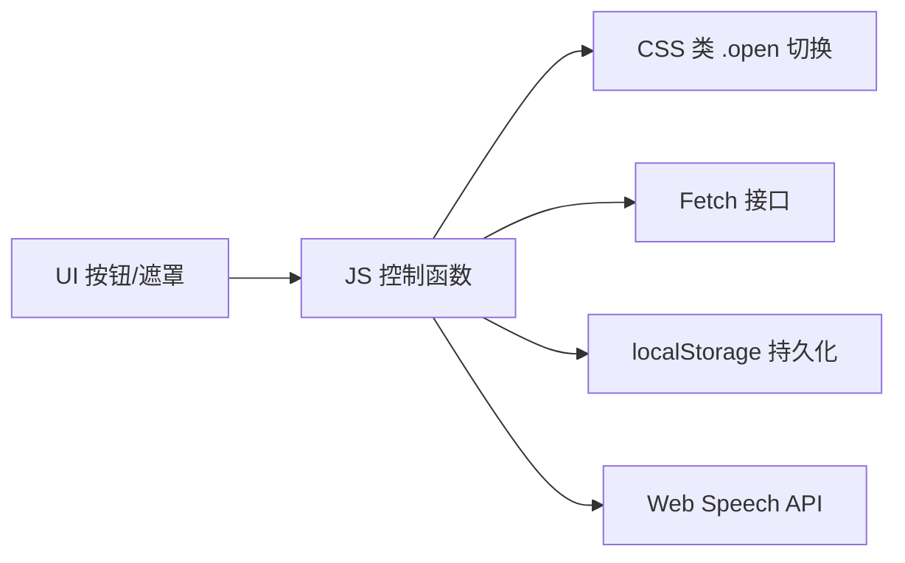

# 抽屉组件

<cite>
**本文引用的文件**   
- [index.html](file://hushai/meditation/static/index.html)
</cite>

## 目录
1. [简介](#简介)
2. [项目结构](#项目结构)
3. [核心组件](#核心组件)
4. [架构总览](#架构总览)
5. [详细组件分析](#详细组件分析)
6. [依赖关系分析](#依赖关系分析)
7. [性能与可访问性](#性能与可访问性)
8. [故障排查指南](#故障排查指南)
9. [结论](#结论)

## 简介
本文件为“抽屉组件系统”的完整技术文档，聚焦以下两类抽屉：
- 设置抽屉（.settings-drawer）：底部弹出式面板，承载语音相关配置。
- 对话历史抽屉（.conv-drawer）：左侧滑出式面板，承载会话列表与切换逻辑。

文档将详细说明其动画、遮罩层状态管理、内部结构组织、JavaScript控制逻辑、事件绑定以及可访问性与键盘导航实现。

## 项目结构
该应用的前端界面与交互逻辑集中在单一HTML文件中，包含内联样式与脚本。抽屉相关的结构与行为均在该文件中定义。

图表来源
- [index.html:540-740](file://hushai/meditation/static/index.html#L540-L740)
- [index.html:666-740](file://hushai/meditation/static/index.html#L666-L740)
- [index.html:848-940](file://hushai/meditation/static/index.html#L848-L940)
- [index.html:1038-1089](file://hushai/meditation/static/index.html#L1038-L1089)

章节来源
- [index.html:1-120](file://hushai/meditation/static/index.html#L1-L120)

## 核心组件
- 设置抽屉（.settings-drawer）
  - 定位与层级：固定定位，z-index高于主内容；默认隐藏于视口底部，打开时向上平移至可视区域。
  - 遮罩层（.settings-mask）：全屏半透明背景，点击关闭抽屉。
  - 头部标题与关闭按钮：用于展示“语音设置”并支持关闭。
  - 内容区域：音色筛选、音色列表、语速/音调滑块、试听与恢复默认操作。
- 对话历史抽屉（.conv-drawer）
  - 定位与层级：固定定位，位于屏幕左侧，宽度固定；默认translateX(-100%)隐藏，打开时滑入。
  - 遮罩层（.conv-drawer-mask）：全屏半透明背景，点击关闭抽屉。
  - 头部标题与关闭按钮：用于展示“对话历史”并支持关闭。
  - 内容区域：加载态、空态、列表项渲染与点击切换当前会话。

章节来源
- [index.html:540-665](file://hushai/meditation/static/index.html#L540-L665)
- [index.html:666-740](file://hushai/meditation/static/index.html#L666-L740)
- [index.html:1038-1089](file://hushai/meditation/static/index.html#L1038-L1089)

## 架构总览
下图展示了用户触发、遮罩层与抽屉面板之间的交互流程，以及数据加载与渲染的关键路径。

图表来源
- [index.html:1186-1200](file://hushai/meditation/static/index.html#L1186-L1200)
- [index.html:1557-1564](file://hushai/meditation/static/index.html#L1557-L1564)
- [index.html:1201-1235](file://hushai/meditation/static/index.html#L1201-L1235)
- [index.html:1451-1503](file://hushai/meditation/static/index.html#L1451-L1503)

## 详细组件分析

### 设置抽屉（.settings-drawer）
- 外观与布局
  - 遮罩层：全屏覆盖，透明度与pointer-events随.open切换。
  - 抽屉面板：底部居中，最大宽度限制，滚动条隐藏，顶部边框分隔。
  - 头部：标题与关闭按钮，悬停高亮。
  - 内容区：分节组织，包括性别/语言筛选、音色列表、语速/音调滑块、预览与重置按钮。
- 交互与状态
  - 打开：为抽屉与遮罩同时添加open类，并加载可用音色。
  - 关闭：移除open类。
  - 遮罩点击：关闭抽屉。
  - 滑块输入：实时更新显示值并持久化到本地存储。
  - 音色选择：更新选中状态与本地存储。
  - 试听：调用语音合成播放示例文本。
  - 恢复默认：清空本地存储并重置UI。
- 可访问性
  - 所有交互元素具备语义化标签与aria属性（如aria-label）。
  - 焦点可见性通过:focus-visible统一描边。
  - 尊重减少动效偏好：当prefers-reduced-motion启用时，过渡与动画被禁用或简化。

图表来源
- [index.html:540-665](file://hushai/meditation/static/index.html#L540-L665)
- [index.html:1557-1564](file://hushai/meditation/static/index.html#L1557-L1564)
- [index.html:1451-1503](file://hushai/meditation/static/index.html#L1451-L1503)
- [index.html:1523-1555](file://hushai/meditation/static/index.html#L1523-L1555)

章节来源
- [index.html:540-665](file://hushai/meditation/static/index.html#L540-L665)
- [index.html:1557-1564](file://hushai/meditation/static/index.html#L1557-L1564)
- [index.html:1451-1503](file://hushai/meditation/static/index.html#L1451-L1503)
- [index.html:1523-1555](file://hushai/meditation/static/index.html#L1523-L1555)

### 对话历史抽屉（.conv-drawer）
- 外观与布局
  - 遮罩层：全屏覆盖，透明度与pointer-events随.open切换。
  - 抽屉面板：固定宽度，左侧贴边，默认translateX(-100%)隐藏，打开时滑入。
  - 头部：标题与关闭按钮，悬停高亮。
  - 内容区：加载态、空态、列表项渲染与点击切换当前会话。
- 交互与状态
  - 打开：为抽屉与遮罩同时添加open类，并拉取会话列表。
  - 关闭：移除open类。
  - 遮罩点击：关闭抽屉。
  - 列表项点击：切换到对应会话ID，刷新消息视图。
- 可访问性
  - 交互元素具备语义化标签与aria属性（如aria-label）。
  - 焦点可见性通过:focus-visible统一描边。
  - 尊重减少动效偏好：当prefers-reduced-motion启用时，过渡与动画被禁用或简化。

图表来源
- [index.html:1186-1200](file://hushai/meditation/static/index.html#L1186-L1200)
- [index.html:1201-1235](file://hushai/meditation/static/index.html#L1201-L1235)
- [index.html:1237-1254](file://hushai/meditation/static/index.html#L1237-L1254)
- [index.html:1256-1267](file://hushai/meditation/static/index.html#L1256-L1267)

章节来源
- [index.html:666-740](file://hushai/meditation/static/index.html#L666-L740)
- [index.html:1186-1200](file://hushai/meditation/static/index.html#L1186-L1200)
- [index.html:1201-1235](file://hushai/meditation/static/index.html#L1201-L1235)
- [index.html:1237-1254](file://hushai/meditation/static/index.html#L1237-L1254)
- [index.html:1256-1267](file://hushai/meditation/static/index.html#L1256-L1267)

### 遮罩层状态管理与点击关闭
- 状态管理
  - 通过CSS类.open控制opacity与pointer-events，确保遮罩在打开时可拦截点击。
  - 打开时同步为抽屉与遮罩添加.open；关闭时同步移除。
- 点击关闭
  - 为遮罩层绑定click事件，仅当点击目标为遮罩本身时关闭抽屉，避免误触内容区域。
- 键盘关闭
  - 未显式监听全局Esc键关闭抽屉；可通过在遮罩或抽屉上增加keydown处理以增强体验。

章节来源
- [index.html:540-560](file://hushai/meditation/static/index.html#L540-L560)
- [index.html:666-683](file://hushai/meditation/static/index.html#L666-L683)
- [index.html:1186-1200](file://hushai/meditation/static/index.html#L1186-L1200)
- [index.html:1557-1564](file://hushai/meditation/static/index.html#L1557-L1564)

### 抽屉内部组件结构
- 头部
  - 标题：使用语义化文本，便于屏幕阅读器识别。
  - 关闭按钮：圆形按钮，提供清晰的关闭意图。
- 内容区域
  - 设置抽屉：分节组织，包含筛选、列表、滑块、操作按钮等。
  - 历史抽屉：列表容器，支持加载态、空态与条目交互。
- 滚动与视觉
  - 自定义滚动条样式，保持整体风格一致。
  - 列表区域overflow-y:auto，保证长内容可滚动。

章节来源
- [index.html:540-665](file://hushai/meditation/static/index.html#L540-L665)
- [index.html:666-740](file://hushai/meditation/static/index.html#L666-L740)

### JavaScript控制逻辑
- 打开/关闭
  - 历史抽屉：historyBtn点击→openConvDrawer()→为抽屉与遮罩添加open→loadConversations()。
  - 设置抽屉：settingsBtn点击→openSettings()→为抽屉与遮罩添加open→loadVoices()。
  - 关闭：遮罩或关闭按钮点击→closeConvDrawer()/closeSettings()→移除open。
- 数据加载与渲染
  - 历史列表：GET /api/chat/conversations → 渲染conv-item → 点击切换会话。
  - 会话消息：GET /api/chat/conversations/{id}/messages → 渲染消息并滚动到底部。
  - 音色列表：获取浏览器语音合成可用音色 → 按性别/语言过滤 → 渲染列表与提示。
- 事件绑定
  - 按钮点击：历史按钮、设置按钮、关闭按钮、遮罩点击。
  - 滑块input：实时更新显示值与本地存储。
  - 列表项点击：切换会话。
- 本地存储
  - 保存语音配置（voiceName、rate、pitch、gender）、会话ID、教师与场景选择等。

章节来源
- [index.html:1186-1200](file://hushai/meditation/static/index.html#L1186-L1200)
- [index.html:1201-1235](file://hushai/meditation/static/index.html#L1201-L1235)
- [index.html:1237-1254](file://hushai/meditation/static/index.html#L1237-L1254)
- [index.html:1256-1267](file://hushai/meditation/static/index.html#L1256-L1267)
- [index.html:1451-1503](file://hushai/meditation/static/index.html#L1451-L1503)
- [index.html:1523-1555](file://hushai/meditation/static/index.html#L1523-L1555)
- [index.html:1557-1564](file://hushai/meditation/static/index.html#L1557-L1564)

### 可访问性与键盘导航
- 焦点可见性
  - 全局:focus-visible为关键交互元素提供清晰描边，提升键盘导航体验。
- 语义化与描述
  - 按钮与输入框使用aria-label明确用途，便于辅助技术读取。
- 减少动效
  - 通过@media (prefers-reduced-motion: reduce)禁用或简化动画，满足对动效敏感的用户需求。
- 键盘关闭建议
  - 当前未实现全局Esc关闭抽屉；建议在遮罩或抽屉上增加keydown监听，当key为Escape时执行关闭逻辑。

章节来源
- [index.html:734-746](file://hushai/meditation/static/index.html#L734-L746)
- [index.html:1025-1035](file://hushai/meditation/static/index.html#L1025-L1035)

## 依赖关系分析
- 组件耦合
  - 遮罩层与抽屉面板强耦合：打开/关闭需同步更新两者的.open状态。
  - 历史抽屉与消息渲染存在间接耦合：切换会话后需要重新渲染消息区。
- 外部依赖
  - Web Speech API：用于语音合成与可选的语音识别。
  - Fetch API：用于拉取会话列表、消息与统计数据。
- 潜在循环依赖
  - 无直接循环依赖；但需注意在切换会话时避免重复请求与状态不一致。

图表来源
- [index.html:1186-1200](file://hushai/meditation/static/index.html#L1186-L1200)
- [index.html:1557-1564](file://hushai/meditation/static/index.html#L1557-L1564)
- [index.html:1201-1235](file://hushai/meditation/static/index.html#L1201-L1235)
- [index.html:1451-1503](file://hushai/meditation/static/index.html#L1451-L1503)

章节来源
- [index.html:1186-1200](file://hushai/meditation/static/index.html#L1186-L1200)
- [index.html:1557-1564](file://hushai/meditation/static/index.html#L1557-L1564)
- [index.html:1201-1235](file://hushai/meditation/static/index.html#L1201-L1235)
- [index.html:1451-1503](file://hushai/meditation/static/index.html#L1451-L1503)

## 性能与可访问性
- 性能
  - 使用transform进行位移动画，避免重排重绘，提高流畅度。
  - 列表渲染采用一次性innerHTML替换，减少DOM操作次数。
  - 滚动区域使用thin滚动条与自定义颜色，兼顾美观与性能。
- 可访问性
  - 统一的:focus-visible样式提升键盘可达性。
  - 尊重用户减少动效偏好，降低眩晕风险。
  - 建议补充全局Esc关闭抽屉与焦点陷阱（Focus Trap），进一步提升无障碍体验。

[本节为通用指导，不直接分析具体文件]

## 故障排查指南
- 遮罩无法点击关闭
  - 检查遮罩是否添加了.open类，确认pointer-events是否为auto。
  - 确认点击事件绑定在遮罩元素上且未被其他元素遮挡。
- 抽屉未出现或位置异常
  - 检查CSS中transform初始值与.open后的目标值是否正确。
  - 确认z-index层级关系，避免被其他元素覆盖。
- 历史列表为空或加载失败
  - 检查网络请求状态码与错误分支处理。
  - 确认登录态与Authorization头是否正确传递。
- 音色列表为空
  - 检查浏览器是否支持SpeechSynthesis与getVoices。
  - 确认设备是否有中文或目标语言的语音包。
- 滑块值未持久化
  - 检查input事件监听是否生效，确认localStorage写入成功。

章节来源
- [index.html:1201-1235](file://hushai/meditation/static/index.html#L1201-L1235)
- [index.html:1451-1503](file://hushai/meditation/static/index.html#L1451-L1503)
- [index.html:1523-1555](file://hushai/meditation/static/index.html#L1523-L1555)

## 结论
本抽屉组件系统通过简洁的CSS类状态管理与原生JavaScript事件绑定，实现了设置抽屉与对话历史抽屉的打开/关闭、遮罩层拦截与内容渲染。其设计遵循良好的可访问性实践，并在移动端与桌面端均有良好表现。建议后续增强键盘导航（如Esc关闭、焦点陷阱）与更完善的错误提示，以提升用户体验与健壮性。