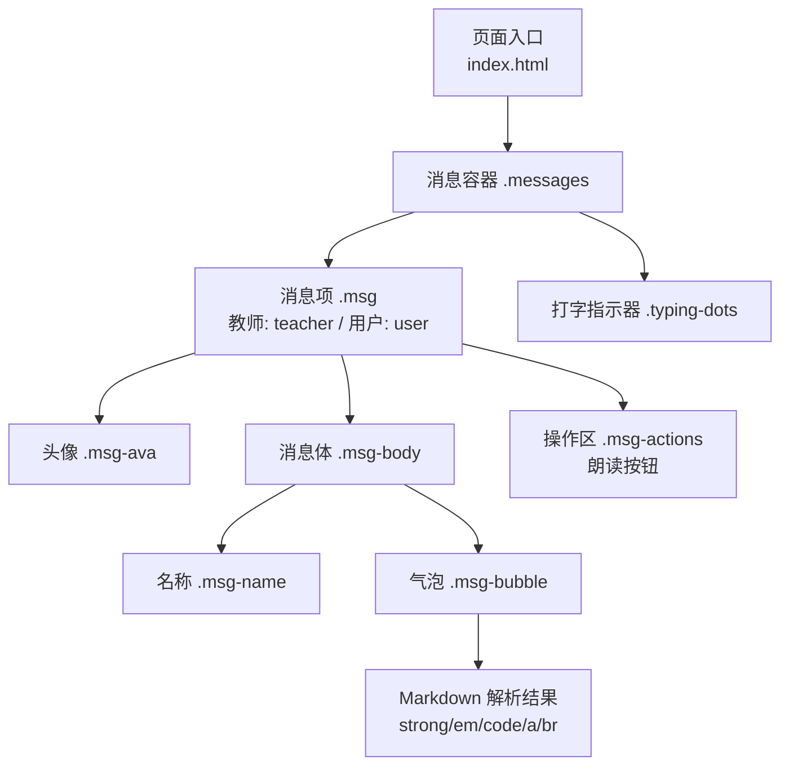
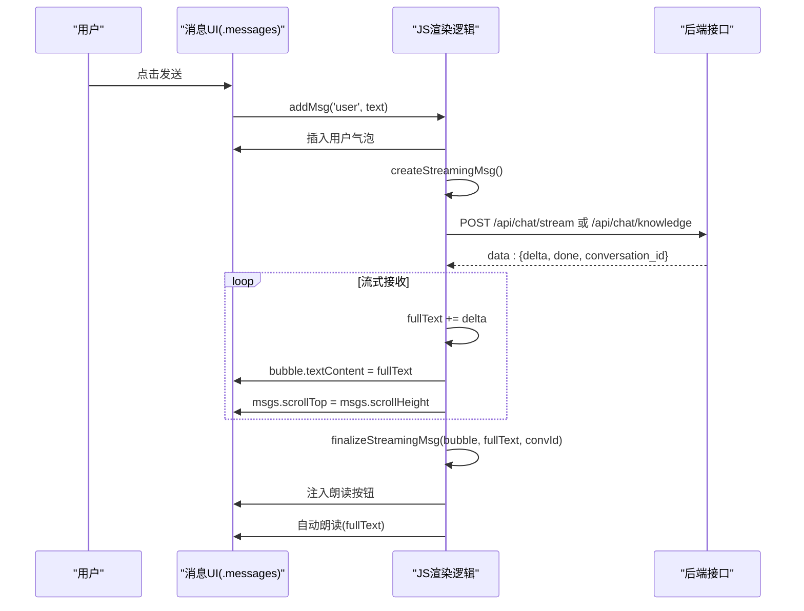
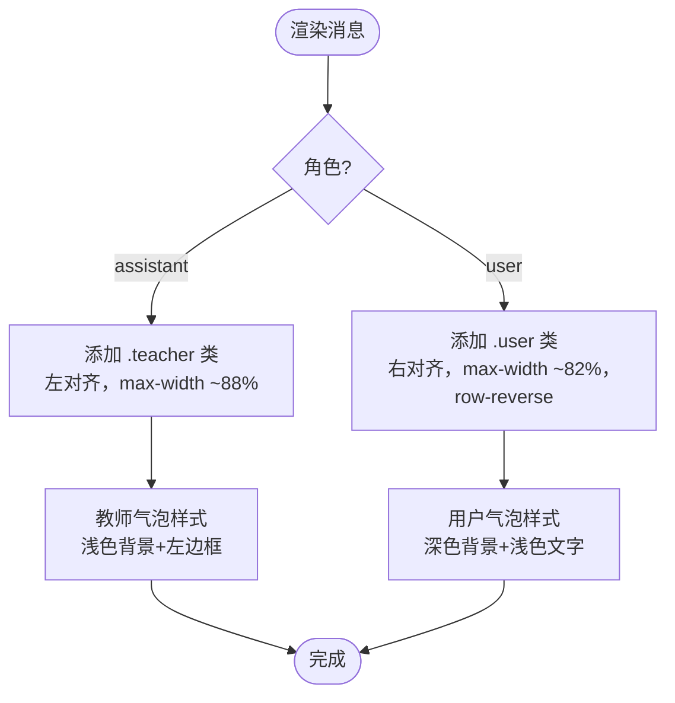
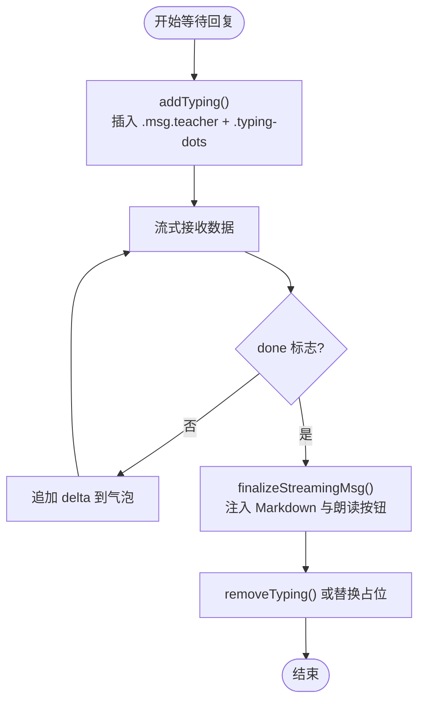

# 消息区域组件

<cite>
**本文引用的文件**   
- [index.html](file://hushai/meditation/static/index.html)
</cite>

## 目录
1. [简介](#简介)
2. [项目结构](#项目结构)
3. [核心组件](#核心组件)
4. [架构总览](#架构总览)
5. [详细组件分析](#详细组件分析)
6. [依赖分析](#依赖分析)
7. [性能考虑](#性能考虑)
8. [故障排查指南](#故障排查指南)
9. [结论](#结论)

## 简介
本文件聚焦于“消息区域组件”（.messages）的样式与交互实现，覆盖以下要点：
- 消息容器的滚动行为与细滚动条设计、颜色配置
- 消息气泡布局结构：教师消息与用户消息的对齐差异
- 头像组件（.msg-ava）的圆形样式、字体图标与颜色区分
- 消息内容区域（.msg-bubble）的背景色、边框装饰与内容格式化支持
- 消息动画效果（.msgAppear）的实现细节与性能优化建议
- 打字指示器（.typing-dots）的动画实现

## 项目结构
该组件位于前端单页应用的主界面中，样式与脚本均内联在页面文件中。消息区域由 HTML 容器、CSS 样式与 JavaScript 渲染逻辑共同构成。

图表来源
- [index.html:390-462](file://hushai/meditation/static/index.html#L390-L462)
- [index.html:1717-1793](file://hushai/meditation/static/index.html#L1717-L1793)

章节来源
- [index.html:390-462](file://hushai/meditation/static/index.html#L390-L462)
- [index.html:1717-1793](file://hushai/meditation/static/index.html#L1717-L1793)

## 核心组件
- 消息容器 .messages
  - 垂直滚动容器，使用弹性布局纵向排列消息项
  - 自定义细滚动条：宽度 3px，滑块颜色为中性灰，轨道透明
  - 兼容 WebKit 与非 WebKit 浏览器的滚动条样式
- 消息项 .msg
  - 教师消息：左对齐，最大宽度约 88%
  - 用户消息：右对齐，最大宽度约 82%，内部元素反向排列
- 头像 .msg-ava
  - 圆形头像，固定宽高，居中显示字符或图标
  - 教师头像：深色背景、浅色文字、深色边框
  - 用户头像：浅色背景、中性文字、浅灰边框
- 消息体 .msg-body
  - 包含消息名称与气泡
- 气泡 .msg-bubble
  - 默认浅色背景，左侧 2px 强调边框
  - 教师气泡：左上圆角保留，其余直角
  - 用户气泡：深色背景、浅色文字、右侧圆角处理
  - 内置对 strong/em/code/a/换行的基础格式化
- 打字指示器 .typing-dots
  - 三个小圆点依次闪烁，表示对方正在输入
- 消息动画 .msgAppear
  - 新消息出现时从下方淡入并轻微缩放

章节来源
- [index.html:390-462](file://hushai/meditation/static/index.html#L390-L462)
- [index.html:1717-1793](file://hushai/meditation/static/index.html#L1717-L1793)

## 架构总览
消息区域的渲染流程如下：
- 用户发送消息后，先插入用户消息气泡
- 创建流式消息占位（教师侧），随后通过服务端流式返回增量文本
- 将增量文本追加到气泡，完成后注入 Markdown 解析后的内容与朗读按钮
- 每次新增消息后自动滚动到底部

图表来源
- [index.html:1795-1891](file://hushai/meditation/static/index.html#L1795-L1891)
- [index.html:1762-1793](file://hushai/meditation/static/index.html#L1762-L1793)
- [index.html:1717-1746](file://hushai/meditation/static/index.html#L1717-L1746)

## 详细组件分析

### 消息容器 .messages：滚动与滚动条
- 滚动行为
  - 使用 flex 纵向布局，子项间距统一
  - overflow-y: auto 启用垂直滚动
  - 新增消息后通过设置 scrollTop 至 scrollHeight 实现自动滚底
- 细滚动条设计
  - 非 WebKit：scrollbar-width: thin；scrollbar-color 使用中性灰与透明轨道
  - WebKit：::-webkit-scrollbar 宽 3px；thumb 圆角 2px，颜色为中性灰；track 透明
- 颜色配置
  - 滚动条颜色基于 CSS 变量 --stone-200，便于主题化调整

章节来源
- [index.html:390-400](file://hushai/meditation/static/index.html#L390-L400)
- [index.html:1745](file://hushai/meditation/static/index.html#L1745)
- [index.html:1866](file://hushai/meditation/static/index.html#L1866)

### 消息气泡布局：教师 vs 用户
- 教师消息
  - 类名 .msg.teacher，align-self: flex-start，最大宽度约 88%
  - 气泡左侧有 2px 强调边框，左上圆角保留
- 用户消息
  - 类名 .msg.user，align-self: flex-end，最大宽度约 82%，flex-direction: row-reverse
  - 气泡背景为深色，文字浅色，右侧圆角处理，左侧边框加深

图表来源
- [index.html:401-443](file://hushai/meditation/static/index.html#L401-L443)

章节来源
- [index.html:401-443](file://hushai/meditation/static/index.html#L401-L443)

### 头像组件 .msg-ava：圆形、图标与颜色
- 圆形样式
  - 固定宽高 32px，border-radius: 50%
  - 使用 Flex 居中显示字符或图标
- 字体图标
  - 教师头像：显示教师首字或预设字符（如“观”）
  - 用户头像：显示昵称首字
- 颜色区分
  - 教师：深色背景、浅色文字、深色边框
  - 用户：浅色背景、中性文字、浅灰边框

章节来源
- [index.html:405-415](file://hushai/meditation/static/index.html#L405-L415)
- [index.html:1705-1715](file://hushai/meditation/static/index.html#L1705-L1715)

### 消息内容区域 .msg-bubble：背景、边框与格式化
- 背景与边框
  - 默认浅色背景，左侧 2px 强调边框
  - 教师气泡：左上圆角保留
  - 用户气泡：深色背景、浅色文字、右侧圆角处理
- 内容格式化支持
  - 加粗 strong、斜体 em、行内代码 code、链接 a、换行 br
  - 链接颜色使用主题变量，悬停变深
  - 代码块采用等宽字体与浅色背景

章节来源
- [index.html:422-443](file://hushai/meditation/static/index.html#L422-L443)
- [index.html:1695-1703](file://hushai/meditation/static/index.html#L1695-L1703)

### 消息动画 .msgAppear：实现与性能优化
- 动画定义
  - 从透明度 0、向下位移 16px、轻微缩小 0.985 过渡到正常状态
  - 使用缓动函数提升自然感
- 触发时机
  - 每条消息根节点 .msg 应用动画，首次出现时执行一次
- 性能优化建议
  - 优先使用 transform 与 opacity 进行动画，避免触发布局重排
  - 控制动画时长与延迟，避免大量消息同时入场造成卡顿
  - 在低性能设备上可结合 prefers-reduced-motion 禁用动画

章节来源
- [index.html:102-105](file://hushai/meditation/static/index.html#L102-L105)
- [index.html:401](file://hushai/meditation/static/index.html#L401)
- [index.html:741-746](file://hushai/meditation/static/index.html#L741-L746)

### 打字指示器 .typing-dots：动画实现
- 结构与样式
  - 三个 span 小圆点，均匀间隔，尺寸 4x4，圆角 50%
  - 使用 typeReveal 关键帧实现呼吸式闪烁
  - 第二、第三个点分别延迟 0.15s 与 0.3s，形成波浪效果
- 使用场景
  - 在等待服务端响应时插入一个教师样式的占位消息，气泡内仅包含 .typing-dots
  - 收到最终结果后移除占位或直接替换为真实内容

图表来源
- [index.html:1748-1760](file://hushai/meditation/static/index.html#L1748-L1760)
- [index.html:1762-1793](file://hushai/meditation/static/index.html#L1762-L1793)

章节来源
- [index.html:454-461](file://hushai/meditation/static/index.html#L454-L461)
- [index.html:1748-1760](file://hushai/meditation/static/index.html#L1748-L1760)
- [index.html:1762-1793](file://hushai/meditation/static/index.html#L1762-L1793)

## 依赖分析
- 样式依赖
  - 颜色与字体变量来自 :root 中的 CSS 变量（如 --ink、--paper-warm、--stone-200 等）
  - 动画关键帧 fadeUp、fadeIn、typeReveal、breathe、lineGrow、slideInRight、msgAppear
- 脚本依赖
  - DOM 操作：querySelector、createElement、appendChild、classList、innerHTML、textContent
  - 网络请求：fetch 调用流式接口，读取 ReadableStream 并逐段更新
  - 语音合成：SpeechSynthesisUtterance 用于朗读消息
- 无障碍与可访问性
  - 消息容器使用 aria-live="polite" 与 aria-relevant="additions" 提示屏幕阅读器
  - 输入框与按钮具备 aria-label 与 role 属性

章节来源
- [index.html:24-45](file://hushai/meditation/static/index.html#L24-L45)
- [index.html:83-105](file://hushai/meditation/static/index.html#L83-L105)
- [index.html:1011](file://hushai/meditation/static/index.html#L1011)
- [index.html:1795-1891](file://hushai/meditation/static/index.html#L1795-L1891)
- [index.html:1662-1692](file://hushai/meditation/static/index.html#L1662-L1692)

## 性能考虑
- 滚动性能
  - 使用 overflow-y: auto 与细滚动条减少视觉干扰
  - 流式更新时仅设置 scrollTop，避免频繁重绘
- 动画性能
  - 使用 transform 与 opacity 驱动动画，降低重排成本
  - 在低性能设备或用户偏好减少动画时，通过 prefers-reduced-motion 禁用动画
- 渲染优化
  - 流式拼接文本时使用 textContent 而非 innerHTML，减少解析开销
  - 仅在最终阶段一次性注入 Markdown 解析后的 HTML，避免中间态重复渲染
- 内存管理
  - 及时移除打字占位节点，避免 DOM 节点堆积
  - 停止语音合成时取消当前播放，释放资源

[本节为通用指导，不直接分析具体文件]

## 故障排查指南
- 滚动未自动到底
  - 检查是否在插入消息后正确设置 msgs.scrollTop = msgs.scrollHeight
  - 确认容器高度是否被其他元素遮挡或计算异常
- 滚动条不可见
  - 在非 WebKit 浏览器需确保 scrollbar-width 与 scrollbar-color 生效
  - 在 WebKit 浏览器检查 ::-webkit-scrollbar 相关选择器是否被覆盖
- 动画不生效
  - 检查是否存在全局样式覆盖动画或 keyframes
  - 在用户开启“减少动态效果”时动画会被禁用，属预期行为
- 打字指示器不消失
  - 确认 finalizeStreamingMsg 后是否正确移除占位节点
  - 检查错误分支是否清理了占位与发送状态
- 朗读按钮无效
  - 检查 SpeechSynthesis 是否可用，以及是否成功选择中文音色
  - 确认 stopSpeaking 与 speak 的状态切换逻辑

章节来源
- [index.html:1745](file://hushai/meditation/static/index.html#L1745)
- [index.html:1866](file://hushai/meditation/static/index.html#L1866)
- [index.html:741-746](file://hushai/meditation/static/index.html#L741-L746)
- [index.html:1760](file://hushai/meditation/static/index.html#L1760)
- [index.html:1662-1692](file://hushai/meditation/static/index.html#L1662-L1692)

## 结论
消息区域组件通过简洁的 CSS 变量与动画体系，实现了优雅的对话体验。细滚动条与柔和的入场动画提升了可读性与沉浸感；教师与用户消息的差异化布局清晰传达对话角色；头像与气泡的配色方案保持整体风格一致。配合流式渲染与打字指示器，用户在等待过程中获得即时反馈。建议在大规模消息场景下进一步优化渲染策略与动画调度，以确保流畅稳定的用户体验。