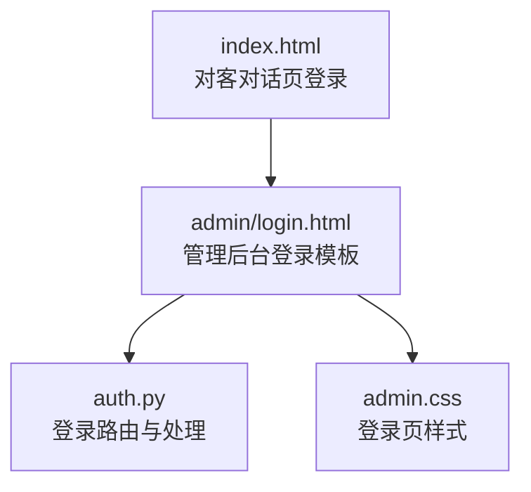
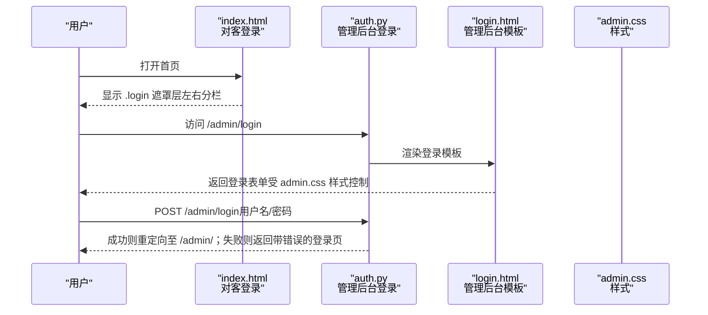
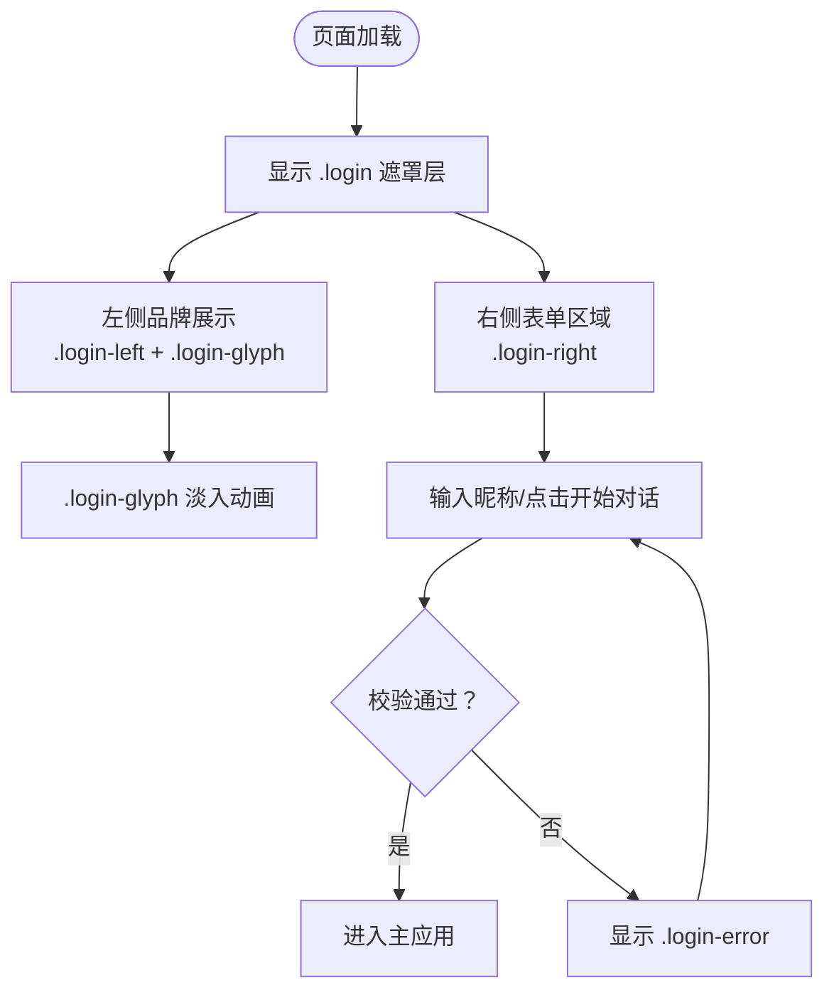
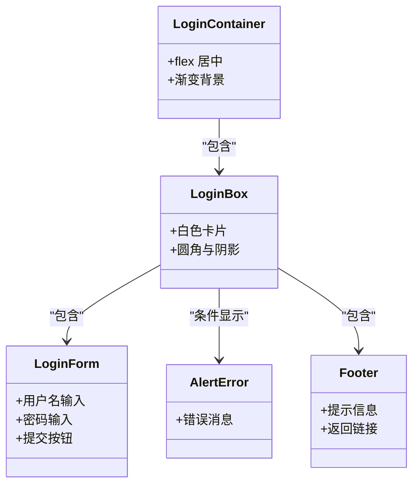
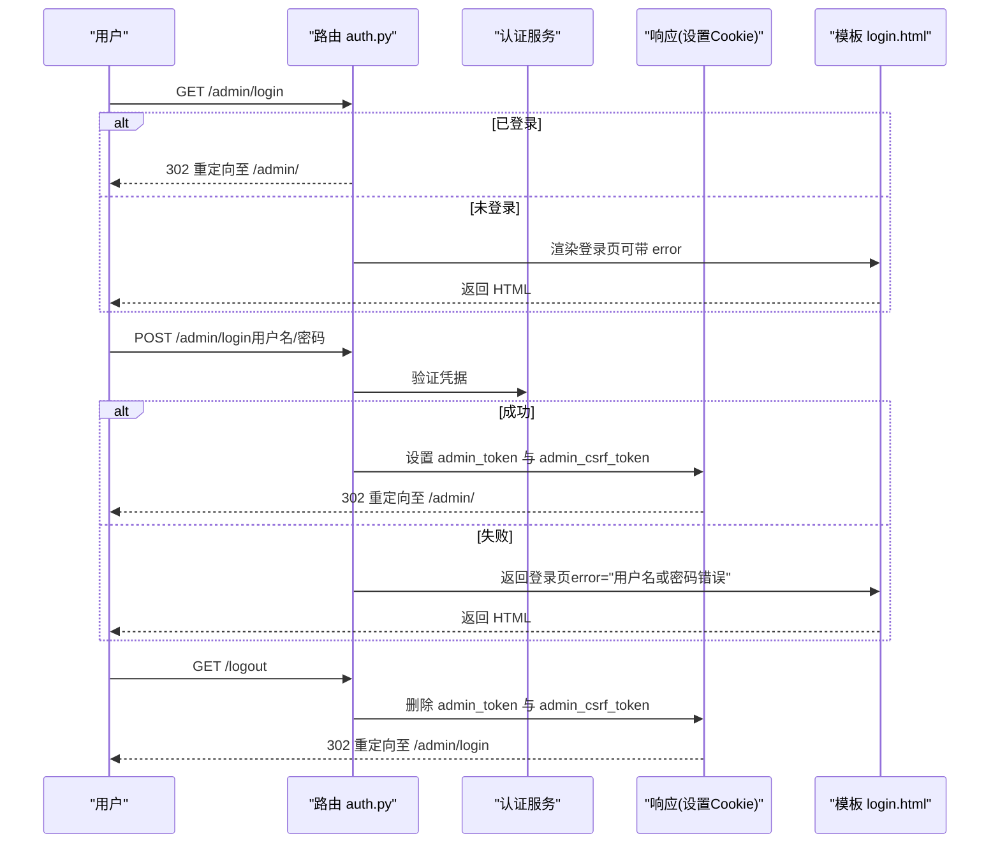
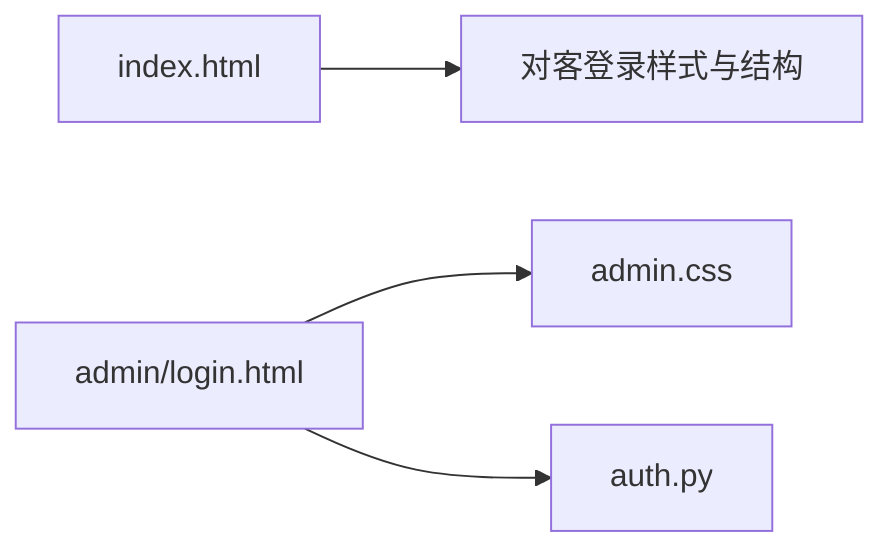

# 登录页面布局

<cite>
**本文引用的文件**   
- [hushai/meditation/static/index.html](file://hushai/meditation/static/index.html)
- [hushai/meditation/admin/templates/login.html](file://hushai/meditation/admin/templates/login.html)
- [hushai/meditation/admin/pages/auth.py](file://hushai/meditation/admin/pages/auth.py)
- [hushai/meditation/admin/static/css/admin.css](file://hushai/meditation/admin/static/css/admin.css)
</cite>

## 目录
1. [简介](#简介)
2. [项目结构](#项目结构)
3. [核心组件](#核心组件)
4. [架构总览](#架构总览)
5. [详细组件分析](#详细组件分析)
6. [依赖关系分析](#依赖关系分析)
7. [性能与可访问性](#性能与可访问性)
8. [故障排查指南](#故障排查指南)
9. [结论](#结论)

## 简介
本文件聚焦于“登录页面布局”的实现与说明，覆盖以下目标：
- 左右分栏布局设计：左侧品牌展示区（宽度约36%）与右侧表单区域。
- 左侧区域的视觉元素：大型字符装饰（.login-glyph）、垂直排版、淡入动画等。
- 右侧表单区域的结构：品牌标题、副标题、诗句展示和输入表单。
- 响应式适配逻辑：小屏幕设备上的单列布局切换。
- 交互流程与状态管理：前端登录入口的交互与后端认证流程的衔接。

本项目包含两套登录界面：
- 对客对话页登录：位于静态首页中，采用左右分栏的品牌化登录体验。
- 管理后台登录：基于模板渲染的表单登录页，样式统一在 admin.css 中定义。

## 项目结构
与登录页面布局直接相关的文件分布如下：
- 对客对话页登录：
  - 结构与样式：[hushai/meditation/static/index.html](file://hushai/meditation/static/index.html)
- 管理后台登录：
  - 模板：[hushai/meditation/admin/templates/login.html](file://hushai/meditation/admin/templates/login.html)
  - 路由与处理：[hushai/meditation/admin/pages/auth.py](file://hushai/meditation/admin/pages/auth.py)
  - 样式：[hushai/meditation/admin/static/css/admin.css](file://hushai/meditation/admin/static/css/admin.css)

图表来源
- [hushai/meditation/static/index.html:108-231](file://hushai/meditation/static/index.html#L108-L231)
- [hushai/meditation/admin/templates/login.html:1-65](file://hushai/meditation/admin/templates/login.html#L1-L65)
- [hushai/meditation/admin/pages/auth.py:1-65](file://hushai/meditation/admin/pages/auth.py#L1-L65)
- [hushai/meditation/admin/static/css/admin.css:233-365](file://hushai/meditation/admin/static/css/admin.css#L233-L365)

章节来源
- [hushai/meditation/static/index.html:108-231](file://hushai/meditation/static/index.html#L108-L231)
- [hushai/meditation/admin/templates/login.html:1-65](file://hushai/meditation/admin/templates/login.html#L1-L65)
- [hushai/meditation/admin/pages/auth.py:1-65](file://hushai/meditation/admin/pages/auth.py#L1-L65)
- [hushai/meditation/admin/static/css/admin.css:233-365](file://hushai/meditation/admin/static/css/admin.css#L233-L365)

## 核心组件
- 对客对话页登录（左右分栏）
  - 容器：.login（全屏遮罩层）
  - 左栏：.login-left（固定宽度36%，背景与分割线）
  - 右栏：.login-right（品牌信息、诗句、输入表单）
  - 大型字符装饰：.login-glyph（垂直排版、淡入动画）
  - 响应式：@media(max-width:480px) 切换为单列布局
- 管理后台登录（居中卡片）
  - 容器：.login-container/.login-box（居中卡片）
  - 头部：.login-header（图标、标题、副标题）
  - 表单：.login-form（用户名、密码、提交按钮）
  - 错误提示：.alert.alert-error
  - 底部：.login-footer（提示信息与返回链接）

章节来源
- [hushai/meditation/static/index.html:108-231](file://hushai/meditation/static/index.html#L108-L231)
- [hushai/meditation/admin/templates/login.html:1-65](file://hushai/meditation/admin/templates/login.html#L1-L65)
- [hushai/meditation/admin/static/css/admin.css:233-365](file://hushai/meditation/admin/static/css/admin.css#L233-L365)

## 架构总览
从用户视角看，登录入口分为两条路径：
- 对客对话页登录：用户在首页看到 .login 遮罩层，输入昵称后触发前端交互，进入主应用。
- 管理后台登录：用户访问 /admin/login，服务端渲染模板并返回表单；提交后由后端验证并设置 Cookie，再重定向到后台主页。

图表来源
- [hushai/meditation/static/index.html:946-967](file://hushai/meditation/static/index.html#L946-L967)
- [hushai/meditation/admin/pages/auth.py:20-55](file://hushai/meditation/admin/pages/auth.py#L20-L55)
- [hushai/meditation/admin/templates/login.html:21-56](file://hushai/meditation/admin/templates/login.html#L21-L56)
- [hushai/meditation/admin/static/css/admin.css:233-365](file://hushai/meditation/admin/static/css/admin.css#L233-L365)

## 详细组件分析

### 对客对话页登录（左右分栏）
- 布局结构
  - 外层容器 .login 使用绝对定位覆盖全屏，内部以 flex 布局组织左右两栏。
  - 左栏 .login-left 固定宽度 36%，用于品牌展示与装饰。
  - 右栏 .login-right 通过 margin-left: 36% 留出左侧空间，承载品牌信息与表单。
- 左侧视觉元素
  - 大型字符装饰 .login-glyph：
    - 字体大小使用 clamp 实现自适应缩放。
    - 低透明度营造背景氛围。
    - writing-mode: vertical-rl 实现垂直排版。
    - animation: fadeIn 配合缓动函数实现淡入效果。
  - 装饰线条 .login-left-line：
    - 细线分隔，配合 lineGrow 动画增强层次感。
- 右侧表单区域
  - 品牌信息：
    - .login-eyebrow：小号英文标识。
    - .login-brand：大号品牌名，支持斜体强调。
    - .login-sub：英文副标题。
  - 诗句展示：
    - .login-poem：限制最大宽度，行高宽松，提升可读性与呼吸感。
  - 输入表单：
    - .login-input：无边框下划线风格，聚焦时边框颜色加深。
    - .login-btn：全宽按钮，悬停与激活态提供微动效。
    - .login-error：错误信息占位，便于无障碍播报。
    - .login-hint：辅助提示文案。
- 响应式适配
  - @media(max-width:480px)：
    - .login 切换为纵向排列。
    - .login-left 变为相对定位，宽度 100%，高度 25vh，取消右边框，改为底边框。
    - .login-glyph 字号缩小并切换为水平排版。
    - .login-left-line 隐藏。
    - .login-right 移除左边距，调整内边距。

图表来源
- [hushai/meditation/static/index.html:108-231](file://hushai/meditation/static/index.html#L108-L231)
- [hushai/meditation/static/index.html:946-967](file://hushai/meditation/static/index.html#L946-L967)

章节来源
- [hushai/meditation/static/index.html:108-231](file://hushai/meditation/static/index.html#L108-L231)
- [hushai/meditation/static/index.html:946-967](file://hushai/meditation/static/index.html#L946-L967)

### 管理后台登录（居中卡片）
- 布局结构
  - .login-container 使用 flex 居中，背景渐变营造沉稳氛围。
  - .login-box 为白色卡片，圆角与阴影突出层级。
  - .login-header 居中标题与图标。
  - .login-form 包含用户名与密码输入项及提交按钮。
  - .alert.alert-error 用于显示服务端返回的错误信息。
  - .login-footer 提供首次登录提示与返回链接。
- 样式要点
  - 表单字段聚焦态使用主题色边框与柔和阴影。
  - 提交按钮使用渐变色与悬停亮度变化。
  - 错误提示使用红色系配色，确保醒目。

图表来源
- [hushai/meditation/admin/templates/login.html:6-63](file://hushai/meditation/admin/templates/login.html#L6-L63)
- [hushai/meditation/admin/static/css/admin.css:233-365](file://hushai/meditation/admin/static/css/admin.css#L233-L365)

章节来源
- [hushai/meditation/admin/templates/login.html:6-63](file://hushai/meditation/admin/templates/login.html#L6-L63)
- [hushai/meditation/admin/static/css/admin.css:233-365](file://hushai/meditation/admin/static/css/admin.css#L233-L365)

### 交互流程与状态管理（管理后台）
- GET /admin/login
  - 若请求已携带有效管理员会话，则重定向至后台主页。
  - 否则渲染 login.html 模板，并可附带 error 参数用于显示错误信息。
- POST /admin/login
  - 接收 Form 数据（username、password）。
  - 调用数据库验证函数进行认证。
  - 认证成功：生成 token 与 CSRF cookie，设置到响应中并重定向至后台主页。
  - 认证失败：返回登录页并附带错误信息。
- GET /logout
  - 删除 admin_token 与 admin_csrf_token 两个 Cookie，并重定向回登录页。

图表来源
- [hushai/meditation/admin/pages/auth.py:20-65](file://hushai/meditation/admin/pages/auth.py#L20-L65)
- [hushai/meditation/admin/templates/login.html:14-19](file://hushai/meditation/admin/templates/login.html#L14-L19)

章节来源
- [hushai/meditation/admin/pages/auth.py:20-65](file://hushai/meditation/admin/pages/auth.py#L20-L65)
- [hushai/meditation/admin/templates/login.html:14-19](file://hushai/meditation/admin/templates/login.html#L14-L19)

## 依赖关系分析
- 对客对话页登录
  - 结构与样式均内联在 index.html 中，无外部 JS/CSS 依赖。
  - 关键类名与动画：.login、.login-left、.login-right、.login-glyph、.login-left-line、.login-brand、.login-sub、.login-poem、.login-input、.login-btn、.login-error、.login-hint。
- 管理后台登录
  - 模板 login.html 继承 base.html，并通过 admin.css 提供样式。
  - 路由 auth.py 负责页面渲染与登录处理，依赖模板渲染器与认证模块。

图表来源
- [hushai/meditation/static/index.html:108-231](file://hushai/meditation/static/index.html#L108-L231)
- [hushai/meditation/admin/templates/login.html:1-65](file://hushai/meditation/admin/templates/login.html#L1-L65)
- [hushai/meditation/admin/static/css/admin.css:233-365](file://hushai/meditation/admin/static/css/admin.css#L233-L365)
- [hushai/meditation/admin/pages/auth.py:1-65](file://hushai/meditation/admin/pages/auth.py#L1-L65)

章节来源
- [hushai/meditation/static/index.html:108-231](file://hushai/meditation/static/index.html#L108-L231)
- [hushai/meditation/admin/templates/login.html:1-65](file://hushai/meditation/admin/templates/login.html#L1-L65)
- [hushai/meditation/admin/static/css/admin.css:233-365](file://hushai/meditation/admin/static/css/admin.css#L233-L365)
- [hushai/meditation/admin/pages/auth.py:1-65](file://hushai/meditation/admin/pages/auth.py#L1-L65)

## 性能与可访问性
- 性能
  - 对客登录页使用纯 CSS 动画（fadeIn、lineGrow），避免额外 JS 开销。
  - 字体大小使用 clamp 实现自适应，减少媒体查询分支。
  - 管理后台登录页样式集中，利于缓存与复用。
- 可访问性
  - 对客登录页的错误区域使用 role="status" 与 aria-live="polite"，便于屏幕阅读器播报。
  - 输入字段具备 placeholder 与 autofocus，提升易用性。
  - 管理后台登录页使用语义化标签与 label 关联，提高表单可访问性。

章节来源
- [hushai/meditation/static/index.html:946-967](file://hushai/meditation/static/index.html#L946-L967)
- [hushai/meditation/admin/templates/login.html:22-50](file://hushai/meditation/admin/templates/login.html#L22-L50)

## 故障排查指南
- 对客登录页
  - 问题：左侧字符不显示或排版异常
    - 检查 .login-glyph 的 writing-mode 与 font-family 是否生效。
    - 确认动画 fadeIn 未被其他样式覆盖。
  - 问题：小屏布局错乱
    - 检查 @media(max-width:480px) 规则是否被更高优先级样式覆盖。
- 管理后台登录
  - 问题：登录后仍停留在登录页
    - 检查 POST /admin/login 是否正确设置 admin_token 与 admin_csrf_token。
    - 确认 secure 属性在调试模式下的行为是否符合预期。
  - 问题：错误信息未显示
    - 检查模板中  条件分支与变量传递。
    - 确认 admin.css 中 .alert-error 样式未被覆盖。

章节来源
- [hushai/meditation/static/index.html:108-231](file://hushai/meditation/static/index.html#L108-L231)
- [hushai/meditation/admin/pages/auth.py:28-55](file://hushai/meditation/admin/pages/auth.py#L28-L55)
- [hushai/meditation/admin/templates/login.html:14-19](file://hushai/meditation/admin/templates/login.html#L14-L19)
- [hushai/meditation/admin/static/css/admin.css:279-292](file://hushai/meditation/admin/static/css/admin.css#L279-L292)

## 结论
- 对客对话页登录通过左右分栏与大型字符装饰，营造出沉浸式的品牌体验；垂直排版与淡入动画增强了视觉层次。
- 管理后台登录采用简洁的居中卡片布局，注重可用性、可访问性与一致性。
- 响应式设计在小屏设备上自动切换为单列布局，保证良好的移动端体验。
- 后端认证流程清晰，结合 Cookie 与重定向完成登录状态管理，并提供登出清理能力。