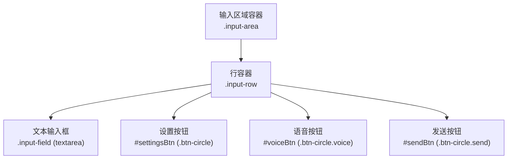
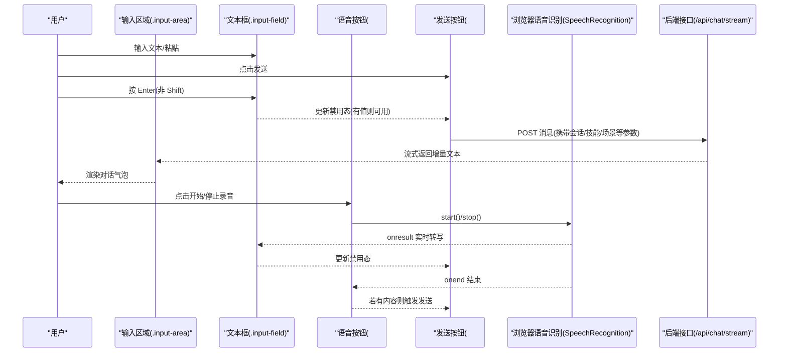
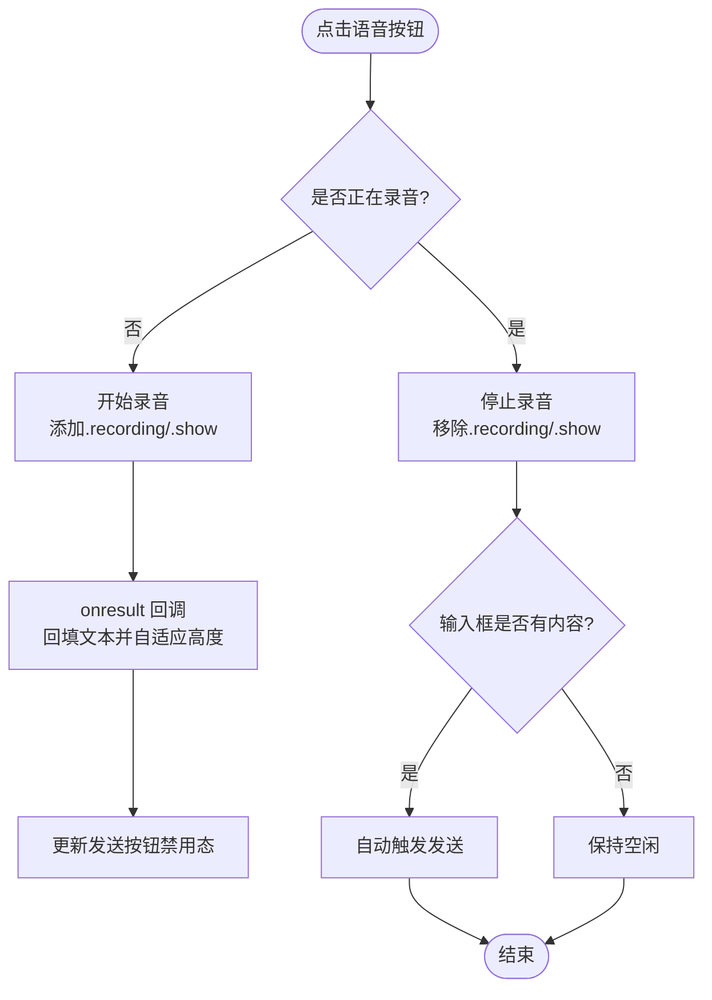
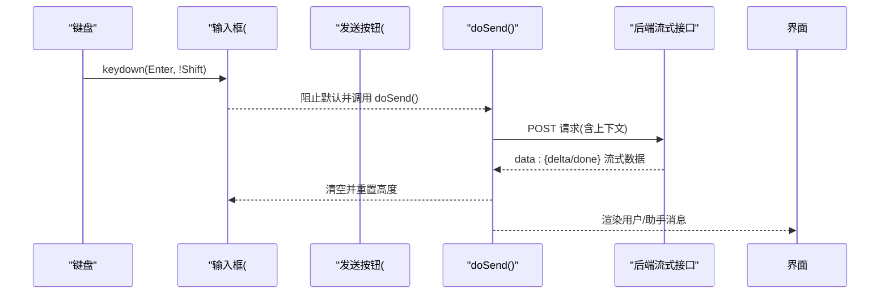
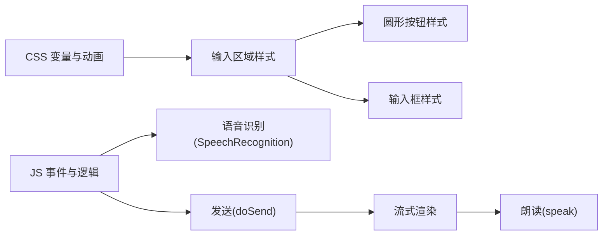

# 输入区域组件

<cite>
**本文引用的文件**   
- [hushai/meditation/static/index.html](file://hushai/meditation/static/index.html)
</cite>

## 目录
1. [简介](#简介)
2. [项目结构](#项目结构)
3. [核心组件](#核心组件)
4. [架构总览](#架构总览)
5. [详细组件分析](#详细组件分析)
6. [依赖关系分析](#依赖关系分析)
7. [性能与可访问性](#性能与可访问性)
8. [故障排查指南](#故障排查指南)
9. [结论](#结论)

## 简介
本文件为输入区域组件（.input-area）的完整技术文档，覆盖布局结构、顶部渐变分隔线与安全区域适配；文本输入框（.input-field）自适应高度、边框样式与焦点状态；圆形按钮（.btn-circle）在发送与语音录制两种角色下的状态表现；交互反馈（悬停、点击缩放、禁用态）；键盘事件处理与移动端适配方案；以及语音录制状态的视觉反馈实现。所有说明均基于仓库中的实际源码定位。

## 项目结构
输入区域的 HTML 结构与样式集中在前端静态页面中，包含：
- 容器 .input-area 包裹一行 .input-row
- 文本域 .input-field 用于输入消息
- 三个圆形按钮：设置（settingsBtn）、语音（voiceBtn）、发送（sendBtn），统一使用 .btn-circle 类名并通过语义化 class 区分角色

图表来源
- [hushai/meditation/static/index.html:1021-1035](file://hushai/meditation/static/index.html#L1021-L1035)

章节来源
- [hushai/meditation/static/index.html:1021-1035](file://hushai/meditation/static/index.html#L1021-L1035)

## 核心组件
本节聚焦输入区域的关键样式与行为要点，并给出对应源码位置以便查阅。

- 输入区域容器 .input-area
  - 底部内边距通过 env(safe-area-inset-bottom,0px) 进行安全区适配，避免被刘海屏或底部横条遮挡
  - 顶部边框 + ::before 伪元素实现两端渐隐的渐变分隔线
  - 相对定位以支撑伪元素的绝对定位

- 文本输入框 .input-field
  - 最小/最大高度限制，配合 JS 动态计算 scrollHeight 实现自适应高度
  - 默认边框色、占位符颜色、字体与行高
  - 焦点态切换边框与背景色，提升可访问性与可用性

- 圆形按钮 .btn-circle
  - 统一尺寸、圆角、居中图标、过渡动画
  - 悬停态加深边框与前景色
  - 按下态 scale(.92) 提供触觉式反馈
  - 禁用态降低透明度并禁止指针
  - 特殊角色：
    - .btn-circle.send 作为发送按钮，启用时反色填充
    - .btn-circle.recording 作为录音态，增加边框/前景色与呼吸动画

章节来源
- [hushai/meditation/static/index.html:504-539](file://hushai/meditation/static/index.html#L504-L539)
- [hushai/meditation/static/index.html:514-523](file://hushai/meditation/static/index.html#L514-L523)
- [hushai/meditation/static/index.html:525-539](file://hushai/meditation/static/index.html#L525-L539)

## 架构总览
输入区域由“展示层（HTML/CSS）+ 交互层（JS 事件）”组成，关键流程包括：
- 用户输入与发送：Enter 键触发发送，按钮点击同样触发
- 语音输入：点击语音按钮开始/停止录音，识别结果回填到输入框并自动调整高度，结束时若存在内容则自动发送
- 发送后清空输入框并重置高度，同时根据后端流式响应更新对话气泡

图表来源
- [hushai/meditation/static/index.html:1640-1659](file://hushai/meditation/static/index.html#L1640-L1659)
- [hushai/meditation/static/index.html:1795-1891](file://hushai/meditation/static/index.html#L1795-L1891)

## 详细组件分析

### 布局结构与顶部渐变分隔线
- 容器 .input-area
  - 使用 flex-shrink:0 确保不被压缩
  - 底部 padding 叠加 env(safe-area-inset-bottom,0px) 适配 iPhone 等设备的底部安全区
  - 顶部 border-top 提供基础分割线
  - ::before 伪元素在 top:-1px 处绘制一条 1px 高的渐变线，左右留白 24px，形成两端渐隐效果

- 行容器 .input-row
  - 使用 flex 布局，gap 控制间距，align-items:flex-end 使多行文本与按钮底部对齐

章节来源
- [hushai/meditation/static/index.html:504-512](file://hushai/meditation/static/index.html#L504-L512)
- [hushai/meditation/static/index.html:513](file://hushai/meditation/static/index.html#L513)

### 文本输入框 .input-field
- 外观与排版
  - 背景、边框、文字颜色、字号、字体族、行高
  - resize:none 禁止手动拖拽改变尺寸
  - min-height/max-height 限制高度范围
  - placeholder 颜色与字号
- 焦点态
  - 聚焦时边框与背景切换，增强可见性
- 自适应高度
  - 通过 JS 监听输入，将 textarea 的 style.height 设置为 Math.min(scrollHeight, 110)，实现随内容增长而增高，但不超过上限

章节来源
- [hushai/meditation/static/index.html:514-523](file://hushai/meditation/static/index.html#L514-L523)
- [hushai/meditation/static/index.html:1644-1647](file://hushai/meditation/static/index.html#L1644-L1647)
- [hushai/meditation/static/index.html:1803](file://hushai/meditation/static/index.html#L1803)

### 圆形按钮 .btn-circle
- 通用样式
  - 固定宽高 44x44，圆角 50%，边框、背景、前景色、flex 居中
  - transition 统一过渡曲线
  - :hover 加深边框与前景色
  - :active 缩小至 0.92 倍，提供按压反馈
  - :disabled 降低不透明度并禁止指针
- 角色变体
  - .btn-circle.send：启用时反色填充（深色背景+浅色前景），悬停加深
  - .btn-circle.recording：录音态边框/前景色与半透明背景，并附加呼吸动画

章节来源
- [hushai/meditation/static/index.html:525-539](file://hushai/meditation/static/index.html#L525-L539)

### 交互反馈与状态机
- 发送按钮 #sendBtn
  - 初始 disabled，当输入框有内容时启用
  - 发送过程中置为 disabled，防止重复提交
  - 发送完成后根据输入框内容恢复禁用态
- 语音按钮 #voiceBtn
  - 点击切换录音状态：添加/移除 .recording 类
  - 录音期间显示可视化条（通过 .show 类控制）
  - 录音结束且输入框有内容时自动触发发送

图表来源
- [hushai/meditation/static/index.html:1640-1659](file://hushai/meditation/static/index.html#L1640-L1659)
- [hushai/meditation/static/index.html:1652](file://hushai/meditation/static/index.html#L1652)

章节来源
- [hushai/meditation/static/index.html:1640-1659](file://hushai/meditation/static/index.html#L1640-L1659)
- [hushai/meditation/static/index.html:1652](file://hushai/meditation/static/index.html#L1652)

### 键盘事件处理
- Enter 键发送
  - 监听输入框 keydown，当 e.key==='Enter' 且未按住 Shift 时阻止默认换行行为并调用发送逻辑
- 发送逻辑 doSend
  - 校验文本与发送锁
  - 清空输入框并重置高度
  - 追加用户消息与流式助手消息
  - 根据模式选择不同端点，携带会话/技能/场景/教师等上下文
  - 解析流式 data: JSON 片段，增量渲染，最终固化并朗读

图表来源
- [hushai/meditation/static/index.html:1795-1891](file://hushai/meditation/static/index.html#L1795-L1891)

章节来源
- [hushai/meditation/static/index.html:1795-1891](file://hushai/meditation/static/index.html#L1795-L1891)

### 移动端适配方案
- 安全区适配
  - 使用 env(safe-area-inset-bottom,0px) 叠加到底部内边距，避免被设备底部横条遮挡
- 触控友好
  - 按钮尺寸 44x44，满足常见触控目标大小
  - 使用 :active 缩放反馈，提升触摸体验
- 输入法与软键盘
  - 输入框高度自适应，避免软键盘弹出时遮挡输入区域
  - 发送后清空并重置高度，保证后续输入体验

章节来源
- [hushai/meditation/static/index.html:504-506](file://hushai/meditation/static/index.html#L504-L506)
- [hushai/meditation/static/index.html:525-533](file://hushai/meditation/static/index.html#L525-L533)
- [hushai/meditation/static/index.html:1803](file://hushai/meditation/static/index.html#L1803)

### 语音录制状态的视觉反馈
- 按钮状态
  - 添加 .recording 类后，边框与前景色变为强调色，背景半透明，并附加呼吸动画
- 可视化条
  - 通过 .show 类控制可视化条的显隐，提示当前处于录音中
- 生命周期
  - 开始录音：添加 .recording/.show，启动 SpeechRecognition
  - 结束录音：移除 .recording/.show，若输入框有内容则自动发送

章节来源
- [hushai/meditation/static/index.html:534-537](file://hushai/meditation/static/index.html#L534-L537)
- [hushai/meditation/static/index.html:1652-1659](file://hushai/meditation/static/index.html#L1652-L1659)

## 依赖关系分析
- 样式依赖
  - CSS 变量（如 --paper、--stone-*、--ink、--font-body、--ease-out-quart 等）决定主题与动效
  - 伪元素 ::before 依赖容器的 position:relative
- 脚本依赖
  - 浏览器原生 API：SpeechRecognition（含 webkit 前缀兼容）
  - DOM 操作：classList、addEventListener、style.height、scrollHeight
  - 网络请求：fetch 流式读取 Response.body.getReader()
- 组件耦合
  - 输入框与发送按钮通过禁用态联动
  - 语音按钮与输入框通过 onresult 回填联动
  - 发送流程与对话渲染、朗读功能解耦但顺序执行

图表来源
- [hushai/meditation/static/index.html:504-539](file://hushai/meditation/static/index.html#L504-L539)
- [hushai/meditation/static/index.html:1640-1659](file://hushai/meditation/static/index.html#L1640-L1659)
- [hushai/meditation/static/index.html:1795-1891](file://hushai/meditation/static/index.html#L1795-L1891)

章节来源
- [hushai/meditation/static/index.html:504-539](file://hushai/meditation/static/index.html#L504-L539)
- [hushai/meditation/static/index.html:1640-1659](file://hushai/meditation/static/index.html#L1640-L1659)
- [hushai/meditation/static/index.html:1795-1891](file://hushai/meditation/static/index.html#L1795-L1891)

## 性能与可访问性
- 性能
  - 流式渲染避免整段等待，提升首字到达时间
  - 输入框高度计算仅取 scrollHeight 并与最大值比较，开销低
- 可访问性
  - 按钮具备 aria-label 与 title，便于屏幕阅读器理解
  - 焦点态清晰，边框与背景变化明确
  - 键盘支持 Enter 发送，符合常见聊天应用习惯

章节来源
- [hushai/meditation/static/index.html:1024-1033](file://hushai/meditation/static/index.html#L1024-L1033)
- [hushai/meditation/static/index.html:522-523](file://hushai/meditation/static/index.html#L522-L523)
- [hushai/meditation/static/index.html:1795-1891](file://hushai/meditation/static/index.html#L1795-L1891)

## 故障排查指南
- 语音无法启动
  - 检查浏览器是否支持 SpeechRecognition（含 webkit 前缀）
  - 确认麦克风权限已授予
  - 观察录音态类名是否正确切换
- 发送无响应
  - 检查网络与鉴权头（Bearer token）
  - 查看流式响应格式是否为 data: JSON 行
  - 确认发送锁 sending 状态是否被正确释放
- 输入框高度异常
  - 确认在输入与语音转写回调中设置了 style.height=Math.min(scrollHeight,110)
  - 发送后是否重置为 auto

章节来源
- [hushai/meditation/static/index.html:1640-1659](file://hushai/meditation/static/index.html#L1640-L1659)
- [hushai/meditation/static/index.html:1795-1891](file://hushai/meditation/static/index.html#L1795-L1891)
- [hushai/meditation/static/index.html:1644-1647](file://hushai/meditation/static/index.html#L1644-L1647)
- [hushai/meditation/static/index.html:1803](file://hushai/meditation/static/index.html#L1803)

## 结论
输入区域组件通过简洁的 HTML 结构与清晰的 CSS 变量体系，实现了跨端一致的视觉与交互体验。其亮点包括：
- 顶部渐变分隔线与底部安全区适配，兼顾美观与可用性
- 输入框自适应高度与明确的焦点态，提升可读性与易用性
- 统一的圆形按钮风格与丰富的状态反馈（悬停、按下、禁用、录音）
- 完善的键盘支持与语音输入闭环，结合流式渲染与自动朗读，形成流畅的对话体验